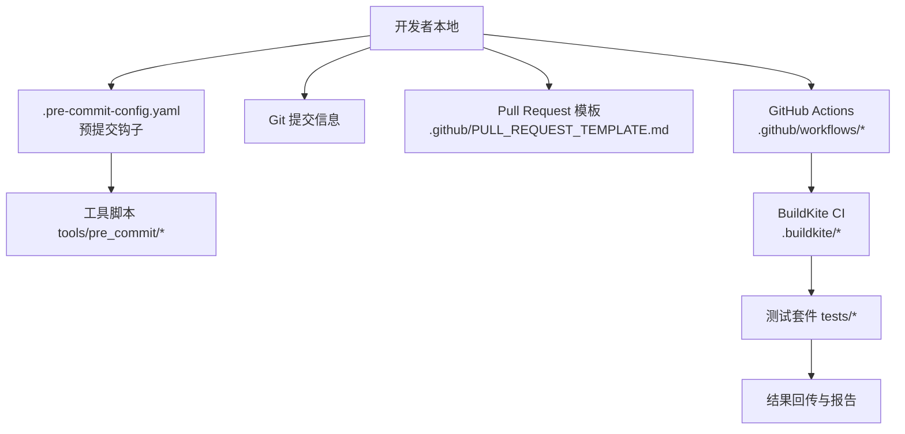
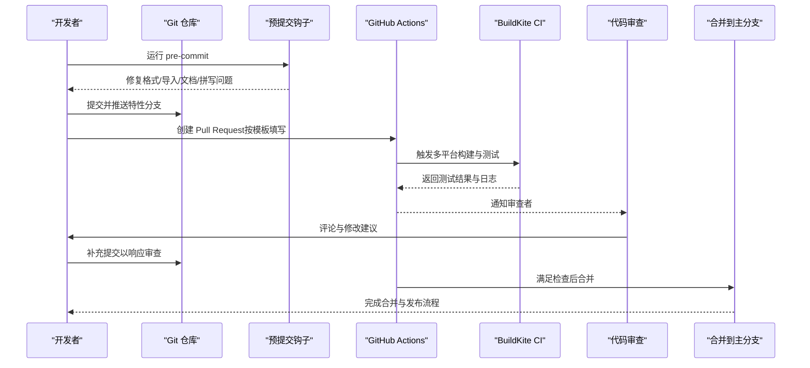
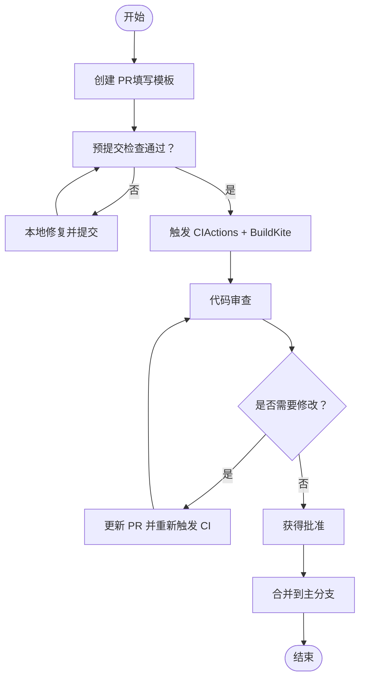
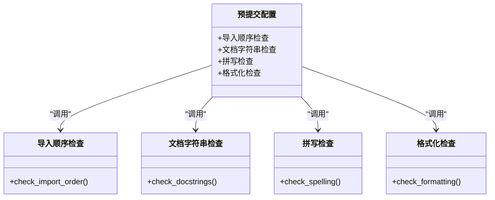
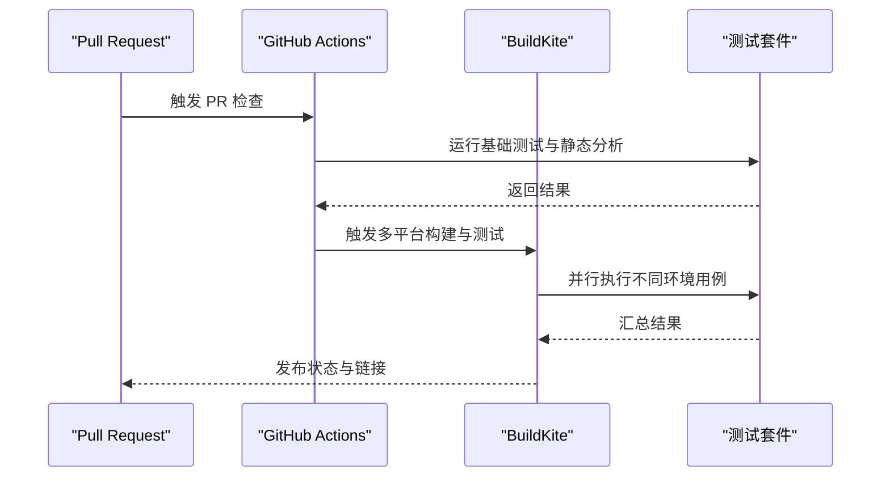
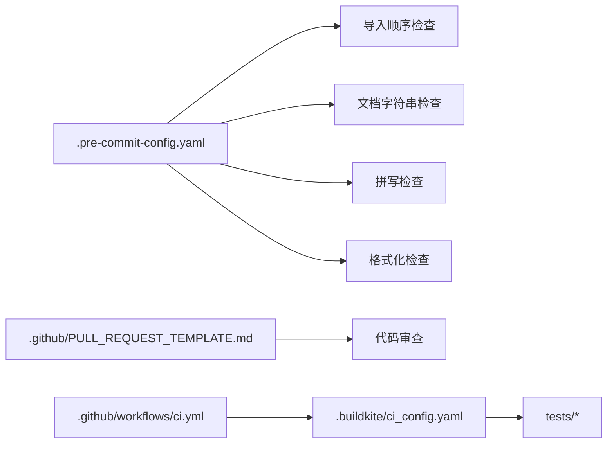

# 代码贡献流程

<cite>
**本文引用的文件**   
- [CONTRIBUTING.md](file://CONTRIBUTING.md)
- [CODE_OF_CONDUCT.md](file://CODE_OF_CONDUCT.md)
- [.pre-commit-config.yaml](file://.pre-commit-config.yaml)
- [pyproject.toml](file://pyproject.toml)
- [.github/PULL_REQUEST_TEMPLATE.md](file://.github/PULL_REQUEST_TEMPLATE.md)
- [.github/workflows/ci.yml](file://.github/workflows/ci.yml)
- [.buildkite/ci_config.yaml](file://.buildkite/ci_config.yaml)
- [tools/pre_commit/check_import_order.py](file://tools/pre_commit/check_import_order.py)
- [tools/pre_commit/check_docstrings.py](file://tools/pre_commit/check_docstrings.py)
- [tools/pre_commit/check_spelling.py](file://tools/pre_commit/check_spelling.py)
- [tools/pre_commit/check_formatting.py](file://tools/pre_commit/check_formatting.py)
- [tests/conftest.py](file://tests/conftest.py)
- [mkdocs.yaml](file://mkdocs.yaml)
</cite>

## 目录
1. [简介](#简介)
2. [项目结构](#项目结构)
3. [核心组件](#核心组件)
4. [架构总览](#架构总览)
5. [详细组件分析](#详细组件分析)
6. [依赖关系分析](#依赖关系分析)
7. [性能注意事项](#性能注意事项)
8. [故障排查指南](#故障排查指南)
9. [结论](#结论)
10. [附录](#附录)

## 简介
本文件面向希望为 vLLM 贡献代码的开发者，系统化说明从分支策略、提交规范、代码风格检查、测试与 CI 到 Pull Request（PR）审查与合并的全流程。内容基于仓库中的贡献指南、CI/CD 配置、预提交钩子与文档模板等实际材料整理而成，旨在帮助贡献者高效、高质量地参与协作。

## 项目结构
vLLM 的贡献相关能力分布在以下位置：
- 根级贡献与行为准则：CONTRIBUTING.md、CODE_OF_CONDUCT.md
- 预提交与代码质量：.pre-commit-config.yaml、tools/pre_commit/*、pyproject.toml
- PR 模板与 GitHub 工作流：.github/PULL_REQUEST_TEMPLATE.md、.github/workflows/*
- CI/CD 编排：.buildkite/*（含多平台构建与测试配置）
- 测试框架与用例组织：tests/*（含 conftest.py）
- 文档站点配置：mkdocs.yaml

图表来源 
- [.pre-commit-config.yaml](file://.pre-commit-config.yaml)
- [tools/pre_commit/check_import_order.py](file://tools/pre_commit/check_import_order.py)
- [tools/pre_commit/check_docstrings.py](file://tools/pre_commit/check_docstrings.py)
- [tools/pre_commit/check_spelling.py](file://tools/pre_commit/check_spelling.py)
- [tools/pre_commit/check_formatting.py](file://tools/pre_commit/check_formatting.py)
- [.github/PULL_REQUEST_TEMPLATE.md](file://.github/PULL_REQUEST_TEMPLATE.md)
- [.github/workflows/ci.yml](file://.github/workflows/ci.yml)
- [.buildkite/ci_config.yaml](file://.buildkite/ci_config.yaml)
- [tests/conftest.py](file://tests/conftest.py)

章节来源
- [CONTRIBUTING.md](file://CONTRIBUTING.md)
- [CODE_OF_CONDUCT.md](file://CODE_OF_CONDUCT.md)
- [.pre-commit-config.yaml](file://.pre-commit-config.yaml)
- [pyproject.toml](file://pyproject.toml)
- [.github/PULL_REQUEST_TEMPLATE.md](file://.github/PULL_REQUEST_TEMPLATE.md)
- [.github/workflows/ci.yml](file://.github/workflows/ci.yml)
- [.buildkite/ci_config.yaml](file://.buildkite/ci_config.yaml)
- [tests/conftest.py](file://tests/conftest.py)
- [mkdocs.yaml](file://mkdocs.yaml)

## 核心组件
- 分支与提交规范
  - 主分支保护规则、特性分支命名与生命周期管理
  - 提交信息格式约定（主题行、正文、关联 Issue/PR）
- 代码质量与风格
  - 预提交钩子（导入顺序、文档字符串、拼写、格式化）
  - 静态分析与类型检查（通过 pyproject.toml 与工具链集成）
- 测试与 CI
  - 本地测试运行与覆盖率
  - GitHub Actions 与 BuildKite 流水线触发条件与阶段
- PR 流程
  - PR 模板填写、审查清单、合并前检查项
- 社区协作
  - 行为准则、沟通渠道、问题与功能请求模板

章节来源
- [CONTRIBUTING.md](file://CONTRIBUTING.md)
- [.pre-commit-config.yaml](file://.pre-commit-config.yaml)
- [pyproject.toml](file://pyproject.toml)
- [.github/PULL_REQUEST_TEMPLATE.md](file://.github/PULL_REQUEST_TEMPLATE.md)
- [.github/workflows/ci.yml](file://.github/workflows/ci.yml)
- [.buildkite/ci_config.yaml](file://.buildkite/ci_config.yaml)

## 架构总览
下图展示一次典型贡献从本地到合并的主干路径，包括预提交、PR 创建、CI 执行与合并门禁。

图表来源 
- [.github/PULL_REQUEST_TEMPLATE.md](file://.github/PULL_REQUEST_TEMPLATE.md)
- [.github/workflows/ci.yml](file://.github/workflows/ci.yml)
- [.buildkite/ci_config.yaml](file://.buildkite/ci_config.yaml)
- [.pre-commit-config.yaml](file://.pre-commit-config.yaml)

## 详细组件分析

### 分支策略与命名规范
- 主分支保护
  - 主分支受保护，禁止直接推送；所有变更需通过 PR 合并
  - 合并前必须通过 CI 检查（测试、静态分析、文档构建等）
- 特性分支
  - 命名建议：feature/<描述>、fix/<描述>、docs/<描述>、chore/<描述>
  - 保持小步提交、原子化变更，便于审查与回溯
- 提交信息规范
  - 主题行简洁明确，必要时在正文中说明动机、影响范围与验证方式
  - 关联 Issue/PR（如 Fixes #123）

章节来源
- [CONTRIBUTING.md](file://CONTRIBUTING.md)

### Pull Request 流程
- 创建 PR
  - 使用 .github/PULL_REQUEST_TEMPLATE.md 提供的模板，清晰描述变更目的、影响与验证步骤
  - 确保本地已通过预提交与基础测试
- 审查与迭代
  - 审查者关注正确性、可维护性、性能与兼容性
  - 根据反馈进行增量提交，避免大段历史重排
- 合并门禁
  - 所有 CI 任务通过
  - 至少一名维护者批准
  - 无未解决的高优先级评论

图表来源 
- [.github/PULL_REQUEST_TEMPLATE.md](file://.github/PULL_REQUEST_TEMPLATE.md)
- [.github/workflows/ci.yml](file://.github/workflows/ci.yml)
- [.buildkite/ci_config.yaml](file://.buildkite/ci_config.yaml)

章节来源
- [.github/PULL_REQUEST_TEMPLATE.md](file://.github/PULL_REQUEST_TEMPLATE.md)

### 代码质量检查与风格
- 预提交钩子
  - 导入顺序检查：tools/pre_commit/check_import_order.py
  - 文档字符串检查：tools/pre_commit/check_docstrings.py
  - 拼写检查：tools/pre_commit/check_spelling.py
  - 格式化检查：tools/pre_commit/check_formatting.py
  - 统一由 .pre-commit-config.yaml 管理
- 静态分析与类型
  - 通过 pyproject.toml 集成 lint、type-check 等任务
- 最佳实践
  - 每次提交前运行 pre-commit --all-files
  - 对新增 API 补充 docstring 与示例
  - 保持导入分组与排序一致

图表来源 
- [.pre-commit-config.yaml](file://.pre-commit-config.yaml)
- [tools/pre_commit/check_import_order.py](file://tools/pre_commit/check_import_order.py)
- [tools/pre_commit/check_docstrings.py](file://tools/pre_commit/check_docstrings.py)
- [tools/pre_commit/check_spelling.py](file://tools/pre_commit/check_spelling.py)
- [tools/pre_commit/check_formatting.py](file://tools/pre_commit/check_formatting.py)

章节来源
- [.pre-commit-config.yaml](file://.pre-commit-config.yaml)
- [tools/pre_commit/check_import_order.py](file://tools/pre_commit/check_import_order.py)
- [tools/pre_commit/check_docstrings.py](file://tools/pre_commit/check_docstrings.py)
- [tools/pre_commit/check_spelling.py](file://tools/pre_commit/check_spelling.py)
- [tools/pre_commit/check_formatting.py](file://tools/pre_commit/check_formatting.py)
- [pyproject.toml](file://pyproject.toml)

### 测试与 CI 流水线
- 本地测试
  - 使用测试框架与 fixtures（tests/conftest.py）
  - 针对改动范围选择合适用例集，保证快速反馈
- CI 触发与阶段
  - GitHub Actions 负责 PR 事件触发的基础检查
  - BuildKite 负责多平台构建与深度测试（.buildkite/ci_config.yaml）
- 覆盖率与报告
  - 结合覆盖率工具生成报告，辅助定位回归

图表来源 
- [.github/workflows/ci.yml](file://.github/workflows/ci.yml)
- [.buildkite/ci_config.yaml](file://.buildkite/ci_config.yaml)
- [tests/conftest.py](file://tests/conftest.py)

章节来源
- [.github/workflows/ci.yml](file://.github/workflows/ci.yml)
- [.buildkite/ci_config.yaml](file://.buildkite/ci_config.yaml)
- [tests/conftest.py](file://tests/conftest.py)

### 提交信息与代码风格要求
- 提交信息
  - 主题行简明扼要，包含变更类型与关键信息
  - 正文说明动机、影响面、验证方法与关联 Issue/PR
- 代码风格
  - 遵循预提交定义的导入顺序、文档字符串、拼写与格式化规则
  - 新增或修改 API 时同步更新文档与示例

章节来源
- [CONTRIBUTING.md](file://CONTRIBUTING.md)
- [.pre-commit-config.yaml](file://.pre-commit-config.yaml)

### 代码审查最佳实践与常见问题
- 最佳实践
  - 将大 PR 拆分为小而独立的提交，便于逐条审查
  - 提供复现步骤与基准数据，帮助评估性能与正确性
  - 主动回应评论，给出修改理由或取舍依据
- 常见问题
  - 未通过预提交导致 CI 失败：本地先运行 pre-commit
  - 缺少必要文档或示例：补充 docstring 与 usage 示例
  - 测试覆盖不足：增加针对性用例，避免回归

章节来源
- [CONTRIBUTING.md](file://CONTRIBUTING.md)
- [.github/PULL_REQUEST_TEMPLATE.md](file://.github/PULL_REQUEST_TEMPLATE.md)

### 高质量 Issue 与功能请求
- Issue 报告
  - 明确环境信息（版本、硬件、依赖）、复现步骤与期望行为
  - 附上日志片段与最小可复现代码
- 功能请求
  - 说明需求背景、目标用户、预期收益与替代方案
  - 提供接口设计草案或伪代码，便于讨论

章节来源
- [CONTRIBUTING.md](file://CONTRIBUTING.md)

### 社区行为准则与协作规范
- 行为准则
  - 尊重、包容、建设性反馈，遵守 CODE_OF_CONDUCT.md
- 协作规范
  - 优先在 Issue/PR 中公开讨论，避免私下决策
  - 对敏感变更（安全、性能、API 兼容）提前沟通

章节来源
- [CODE_OF_CONDUCT.md](file://CODE_OF_CONDUCT.md)

## 依赖关系分析
贡献流程的关键依赖如下：
- 预提交钩子依赖 tools/pre_commit/* 脚本与 .pre-commit-config.yaml 配置
- PR 模板驱动审查者与作者的信息对齐
- GitHub Actions 与 BuildKite 共同承担 CI 任务，后者负责多平台与深度测试
- 测试套件依赖 tests/conftest.py 与各类 fixtures

图表来源 
- [.pre-commit-config.yaml](file://.pre-commit-config.yaml)
- [tools/pre_commit/check_import_order.py](file://tools/pre_commit/check_import_order.py)
- [tools/pre_commit/check_docstrings.py](file://tools/pre_commit/check_docstrings.py)
- [tools/pre_commit/check_spelling.py](file://tools/pre_commit/check_spelling.py)
- [tools/pre_commit/check_formatting.py](file://tools/pre_commit/check_formatting.py)
- [.github/PULL_REQUEST_TEMPLATE.md](file://.github/PULL_REQUEST_TEMPLATE.md)
- [.github/workflows/ci.yml](file://.github/workflows/ci.yml)
- [.buildkite/ci_config.yaml](file://.buildkite/ci_config.yaml)
- [tests/conftest.py](file://tests/conftest.py)

章节来源
- [.pre-commit-config.yaml](file://.pre-commit-config.yaml)
- [.github/PULL_REQUEST_TEMPLATE.md](file://.github/PULL_REQUEST_TEMPLATE.md)
- [.github/workflows/ci.yml](file://.github/workflows/ci.yml)
- [.buildkite/ci_config.yaml](file://.buildkite/ci_config.yaml)
- [tests/conftest.py](file://tests/conftest.py)

## 性能注意事项
- 在涉及性能敏感的模块（内核、调度、内存管理）时，提供基准测试与对比数据
- 谨慎引入新依赖，避免显著增大包体积与启动时间
- 对大规模数据集或高并发场景进行回归测试，确保稳定性

[本节为通用指导，不直接分析具体文件]

## 故障排查指南
- 预提交失败
  - 检查导入顺序、文档字符串、拼写与格式化错误，按提示修复
- CI 失败
  - 查看 GitHub Actions 与 BuildKite 日志，定位失败阶段与环境差异
- 测试不稳定
  - 确认随机种子、资源限制与外部依赖版本一致性
- 文档构建失败
  - 检查 mkdocs.yaml 与文档源文件语法

章节来源
- [.pre-commit-config.yaml](file://.pre-commit-config.yaml)
- [.github/workflows/ci.yml](file://.github/workflows/ci.yml)
- [.buildkite/ci_config.yaml](file://.buildkite/ci_config.yaml)
- [mkdocs.yaml](file://mkdocs.yaml)

## 结论
通过统一的分支策略、严格的预提交与 CI 门禁、清晰的 PR 模板与审查流程，vLLM 确保了贡献的质量与可维护性。贡献者应遵循提交信息规范、完善测试与文档，并在社区协作中秉持开放与尊重的态度，共同推动项目发展。

[本节为总结性内容，不直接分析具体文件]

## 附录
- 常用命令与脚本
  - 运行预提交：pre-commit run --all-files
  - 本地测试：根据 tests 目录结构与 conftest 配置选择用例集
  - 文档构建：参考 mkdocs.yaml 配置
- 参考文件
  - 贡献指南：CONTRIBUTING.md
  - 行为准则：CODE_OF_CONDUCT.md
  - PR 模板：.github/PULL_REQUEST_TEMPLATE.md
  - 预提交配置：.pre-commit-config.yaml
  - CI 配置：.github/workflows/ci.yml、.buildkite/ci_config.yaml
  - 测试框架：tests/conftest.py
  - 文档站点：mkdocs.yaml

章节来源
- [CONTRIBUTING.md](file://CONTRIBUTING.md)
- [CODE_OF_CONDUCT.md](file://CODE_OF_CONDUCT.md)
- [.github/PULL_REQUEST_TEMPLATE.md](file://.github/PULL_REQUEST_TEMPLATE.md)
- [.pre-commit-config.yaml](file://.pre-commit-config.yaml)
- [.github/workflows/ci.yml](file://.github/workflows/ci.yml)
- [.buildkite/ci_config.yaml](file://.buildkite/ci_config.yaml)
- [tests/conftest.py](file://tests/conftest.py)
- [mkdocs.yaml](file://mkdocs.yaml)