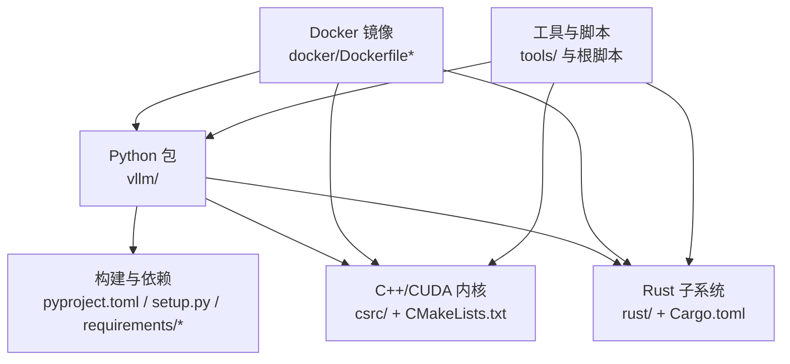
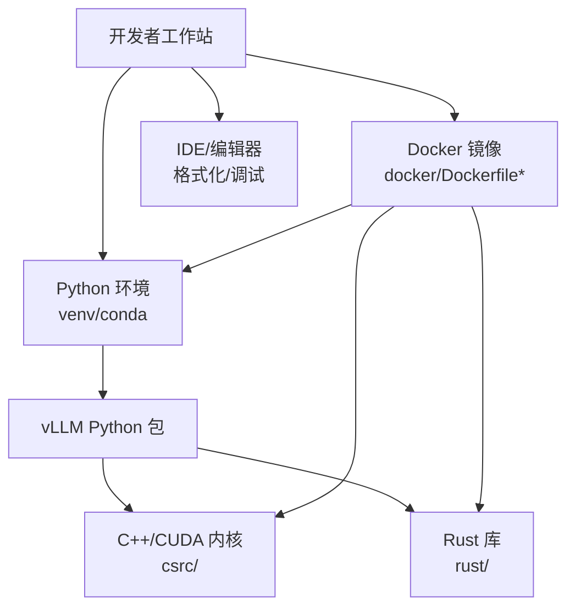
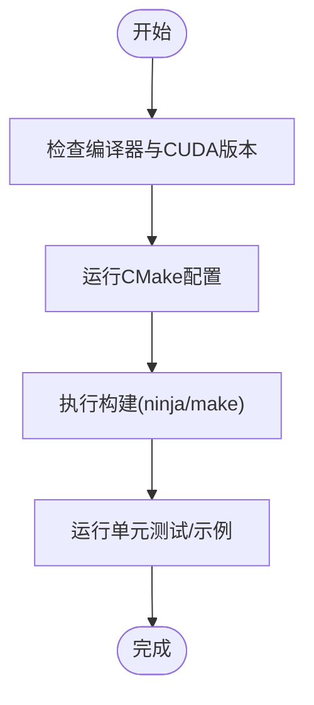
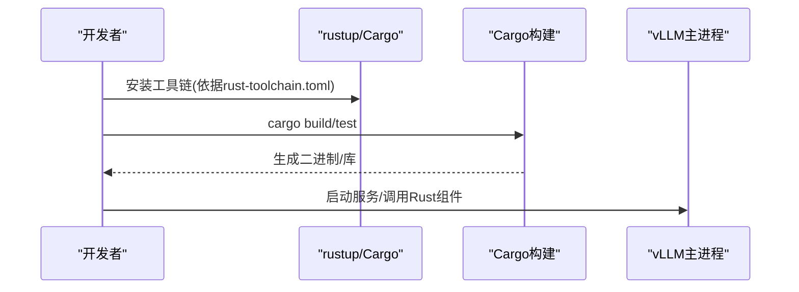
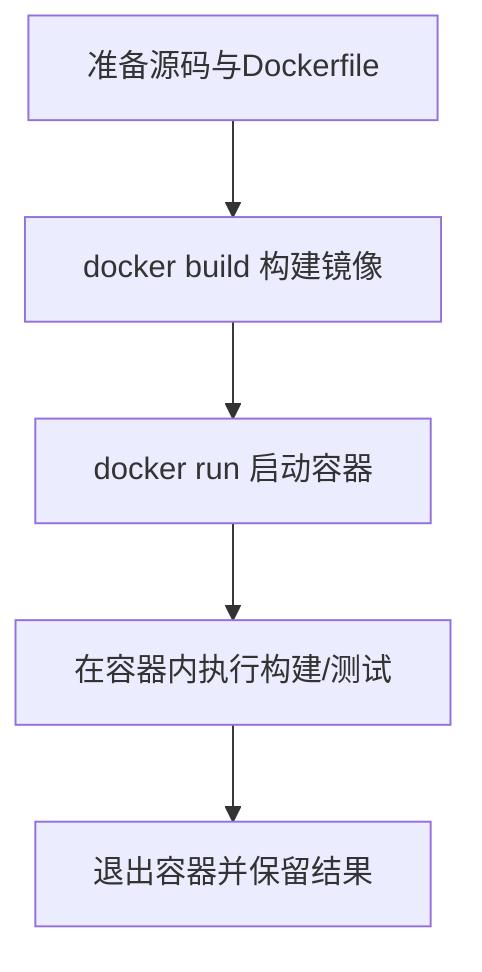
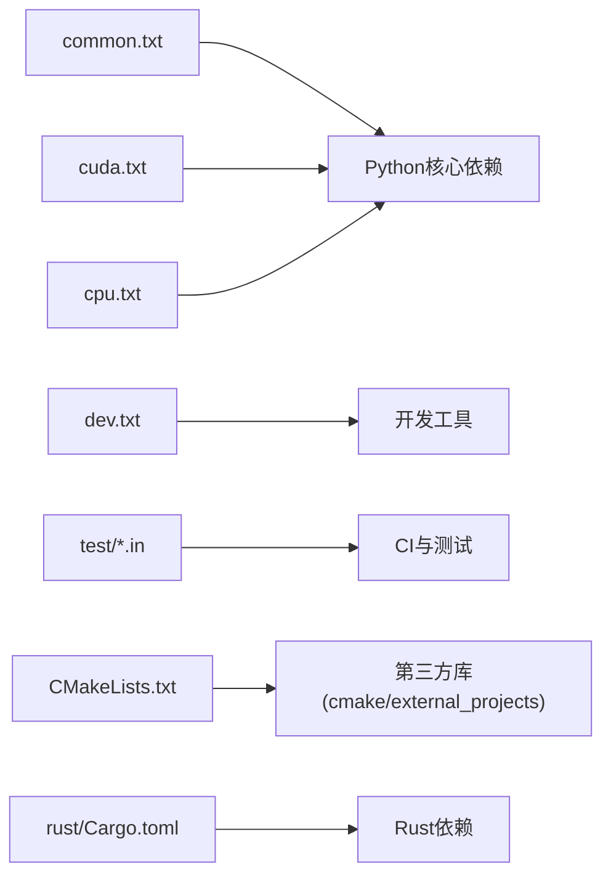

# 开发环境搭建

<cite>
**本文档引用的文件**   
- [README.md](file://README.md)
- [pyproject.toml](file://pyproject.toml)
- [setup.py](file://setup.py)
- [requirements/common.txt](file://requirements/common.txt)
- [requirements/cuda.txt](file://requirements/cuda.txt)
- [requirements/cpu.txt](file://requirements/cpu.txt)
- [requirements/dev.txt](file://requirements/dev.txt)
- [requirements/test/cuda.in](file://requirements/test/cuda.in)
- [requirements/test/rocm.in](file://requirements/test/rocm.in)
- [requirements/test/xpu.in](file://requirements/test/xpu.in)
- [CMakeLists.txt](file://CMakeLists.txt)
- [cmake/utils.cmake](file://cmake/utils.cmake)
- [docker/Dockerfile](file://docker/Dockerfile)
- [docker/Dockerfile.rocm](file://docker/Dockerfile.rocm)
- [docker/Dockerfile.cpu](file://docker/Dockerfile.cpu)
- [docker/versions.json](file://docker/versions.json)
- [rust-toolchain.toml](file://rust-toolchain.toml)
- [rust/Cargo.toml](file://rust/Cargo.toml)
- [build_rust.sh](file://build_rust.sh)
- [tools/build_rust.py](file://tools/build_rust.py)
- [vllm/collect_env.py](file://vllm/collect_env.py)
- [.pre-commit-config.yaml](file://.pre-commit-config.yaml)
- [.clang-format](file://.clang-format)
- [CONTRIBUTING.md](file://CONTRIBUTING.md)
</cite>

## 目录
1. [简介](#简介)
2. [项目结构](#项目结构)
3. [核心组件](#核心组件)
4. [架构总览](#架构总览)
5. [详细组件分析](#详细组件分析)
6. [依赖分析](#依赖分析)
7. [性能考虑](#性能考虑)
8. [故障排除指南](#故障排除指南)
9. [结论](#结论)
10. [附录](#附录)

## 简介
本指南面向希望在本地或容器中构建与调试 vLLM 的开发者，覆盖 Python 环境与依赖、C++/CUDA 编译环境、Rust 开发环境、Docker 开发镜像构建与使用、IDE 配置建议，以及 Linux/macOS/Windows 的差异化安装步骤与常见问题排查。内容基于仓库中的配置文件、构建脚本与文档整理而成，确保可操作性和一致性。

## 项目结构
vLLM 采用多语言混合工程组织：
- Python 包与入口位于根目录与 vllm/ 子目录
- C++/CUDA 内核与扩展位于 csrc/，通过 CMake 管理
- Rust 子系统位于 rust/，由 Cargo 管理
- Docker 构建定义位于 docker/
- 依赖清单与测试依赖位于 requirements/
- 构建与工具脚本位于 tools/ 与根目录脚本

图表来源
- [pyproject.toml](file://pyproject.toml)
- [setup.py](file://setup.py)
- [CMakeLists.txt](file://CMakeLists.txt)
- [docker/Dockerfile](file://docker/Dockerfile)
- [rust/Cargo.toml](file://rust/Cargo.toml)

章节来源
- [README.md](file://README.md)
- [pyproject.toml](file://pyproject.toml)
- [setup.py](file://setup.py)
- [CMakeLists.txt](file://CMakeLists.txt)
- [docker/Dockerfile](file://docker/Dockerfile)
- [rust/Cargo.toml](file://rust/Cargo.toml)

## 核心组件
- Python 环境与依赖管理
  - 使用 pyproject.toml 与 setup.py 描述包元数据与构建选项
  - 依赖分环境管理：common、cuda、cpu、dev、test 等
- C++/CUDA 编译系统
  - 以 CMake 为核心，配合 CUDA 工具链与第三方库（如 CUTLASS、Flash-Attention 等）
- Rust 子系统
  - 使用 rust-toolchain.toml 锁定工具链版本，Cargo 管理依赖与构建
- Docker 开发镜像
  - 提供 GPU/CPU/ROCm/XPU 等多目标镜像，统一构建与运行环境

章节来源
- [pyproject.toml](file://pyproject.toml)
- [setup.py](file://setup.py)
- [requirements/common.txt](file://requirements/common.txt)
- [requirements/cuda.txt](file://requirements/cuda.txt)
- [requirements/cpu.txt](file://requirements/cpu.txt)
- [requirements/dev.txt](file://requirements/dev.txt)
- [CMakeLists.txt](file://CMakeLists.txt)
- [rust-toolchain.toml](file://rust-toolchain.toml)
- [rust/Cargo.toml](file://rust/Cargo.toml)
- [docker/Dockerfile](file://docker/Dockerfile)

## 架构总览
下图展示开发环境的关键组件与交互关系：开发者在本地或容器内通过 Python 调用 vLLM，C++/CUDA 内核与 Rust 组件作为扩展被动态加载；Docker 镜像封装了编译器、CUDA Toolkit、CMake、Rust 工具链与 Python 环境，保证跨平台一致性。

图表来源
- [docker/Dockerfile](file://docker/Dockerfile)
- [CMakeLists.txt](file://CMakeLists.txt)
- [rust/Cargo.toml](file://rust/Cargo.toml)
- [pyproject.toml](file://pyproject.toml)

## 详细组件分析

### Python 环境与依赖
- 环境要求
  - 建议使用 Python 3.x（参考 pyproject.toml 与 CI 配置），推荐使用 venv 或 conda 创建隔离环境
  - 根据硬件选择依赖集：CPU-only 使用 cpu.txt，GPU（NVIDIA CUDA）使用 cuda.txt，ROCm/XPU 使用对应 test 依赖
- 安装步骤
  - 克隆仓库后，进入项目根目录
  - 安装通用依赖：pip install -r requirements/common.txt
  - 按硬件选择安装：
    - NVIDIA CUDA：pip install -r requirements/cuda.txt
    - CPU-only：pip install -r requirements/cpu.txt
    - ROCm/XPU：参考 requirements/test/*.in 与 CI 配置
  - 可选开发依赖：pip install -r requirements/dev.txt
- 版本兼容性
  - 查看 pyproject.toml 中 torch、triton、numpy 等关键依赖的版本约束
  - 若需特定 nightly 或兼容版本，参考 requirements/test/nightly-torch.txt 与 CI 配置

章节来源
- [pyproject.toml](file://pyproject.toml)
- [setup.py](file://setup.py)
- [requirements/common.txt](file://requirements/common.txt)
- [requirements/cuda.txt](file://requirements/cuda.txt)
- [requirements/cpu.txt](file://requirements/cpu.txt)
- [requirements/dev.txt](file://requirements/dev.txt)
- [requirements/test/nightly-torch.txt](file://requirements/test/nightly-torch.txt)

### C++/CUDA 编译环境
- 编译器与工具链
  - 需要支持 C++17 的 GCC/Clang（Linux）或 MSVC（Windows），具体版本参考 CMakeLists.txt 与 cmake/utils.cmake
  - CUDA Toolkit 版本应与安装的 NVIDIA 驱动和 PyTorch 的 CUDA 版本匹配
- CMake 配置
  - 使用 CMake 生成构建系统，常见流程：
    - 创建 build 目录并执行 cmake ..
    - 指定 CUDA 路径与编译器参数（如 -DCMAKE_CUDA_COMPILER）
    - 启用/禁用可选后端（如 Flash-Attention、CUTLASS）
- 构建命令
  - 使用 ninja 或 make 进行并行构建
  - 若遇到第三方库缺失，检查 cmake/external_projects/*.cmake 与 tools/install_* 脚本

图表来源
- [CMakeLists.txt](file://CMakeLists.txt)
- [cmake/utils.cmake](file://cmake/utils.cmake)

章节来源
- [CMakeLists.txt](file://CMakeLists.txt)
- [cmake/utils.cmake](file://cmake/utils.cmake)

### Rust 开发环境
- 工具链安装
  - 使用 rustup 安装 Rust 工具链，版本由 rust-toolchain.toml 锁定
  - 安装 Cargo 与必要的目标三元组（如 aarch64-unknown-linux-gnu）
- 构建与测试
  - 在 rust/ 目录下执行 cargo build / cargo test
  - 如需交叉编译，参考 rust-toolchain.toml 与 tools/build_rust.py
- 集成到 vLLM
  - 通过 Python 绑定或 gRPC 接口与 vLLM 主进程通信

图表来源
- [rust-toolchain.toml](file://rust-toolchain.toml)
- [rust/Cargo.toml](file://rust/Cargo.toml)
- [build_rust.sh](file://build_rust.sh)
- [tools/build_rust.py](file://tools/build_rust.py)

章节来源
- [rust-toolchain.toml](file://rust-toolchain.toml)
- [rust/Cargo.toml](file://rust/Cargo.toml)
- [build_rust.sh](file://build_rust.sh)
- [tools/build_rust.py](file://tools/build_rust.py)

### Docker 开发环境
- 镜像选择
  - GPU（CUDA）：docker/Dockerfile
  - ROCm：docker/Dockerfile.rocm
  - CPU-only：docker/Dockerfile.cpu
- 构建与运行
  - 构建镜像：docker build -t vllm-dev .
  - 运行容器并挂载源码目录，进入交互式 shell
  - 在容器内执行 Python/C++/Rust 构建与测试
- 版本管理
  - 参考 docker/versions.json 获取基础镜像与工具链版本

图表来源
- [docker/Dockerfile](file://docker/Dockerfile)
- [docker/Dockerfile.rocm](file://docker/Dockerfile.rocm)
- [docker/Dockerfile.cpu](file://docker/Dockerfile.cpu)
- [docker/versions.json](file://docker/versions.json)

章节来源
- [docker/Dockerfile](file://docker/Dockerfile)
- [docker/Dockerfile.rocm](file://docker/Dockerfile.rocm)
- [docker/Dockerfile.cpu](file://docker/Dockerfile.cpu)
- [docker/versions.json](file://docker/versions.json)

### IDE 配置建议
- 代码格式化
  - Python：使用 ruff/black/isort（参考 .pre-commit-config.yaml）
  - C++/CUDA：使用 clang-format（.clang-format）
  - Rust：使用 rustfmt（rust/rustfmt.toml）
- 调试器设置
  - Python：VS Code 或 PyCharm 的 Python 调试器
  - C++/CUDA：GDB/LLDB + CUDA GDB，或 VS Code 的 C++ 调试配置
  - Rust：lldb/gdb + VS Code 的 Rust 调试插件
- 预提交钩子
  - 安装 pre-commit 并在仓库根目录运行 pre-commit install

章节来源
- [.pre-commit-config.yaml](file://.pre-commit-config.yaml)
- [.clang-format](file://.clang-format)
- [rust/rustfmt.toml](file://rust/rustfmt.toml)

## 依赖分析
- Python 依赖分层
  - common：基础运行时依赖
  - cuda/cpu：硬件相关依赖
  - dev：开发与测试工具
  - test：CI 与测试用例依赖
- C++/CUDA 依赖
  - 通过 CMake 管理第三方库，外部项目定义在 cmake/external_projects/
- Rust 依赖
  - Cargo.toml 声明 crate 依赖，rust-toolchain.toml 锁定工具链

图表来源
- [requirements/common.txt](file://requirements/common.txt)
- [requirements/cuda.txt](file://requirements/cuda.txt)
- [requirements/cpu.txt](file://requirements/cpu.txt)
- [requirements/dev.txt](file://requirements/dev.txt)
- [requirements/test/cuda.in](file://requirements/test/cuda.in)
- [requirements/test/rocm.in](file://requirements/test/rocm.in)
- [requirements/test/xpu.in](file://requirements/test/xpu.in)
- [CMakeLists.txt](file://CMakeLists.txt)
- [rust/Cargo.toml](file://rust/Cargo.toml)

章节来源
- [requirements/common.txt](file://requirements/common.txt)
- [requirements/cuda.txt](file://requirements/cuda.txt)
- [requirements/cpu.txt](file://requirements/cpu.txt)
- [requirements/dev.txt](file://requirements/dev.txt)
- [requirements/test/cuda.in](file://requirements/test/cuda.in)
- [requirements/test/rocm.in](file://requirements/test/rocm.in)
- [requirements/test/xpu.in](file://requirements/test/xpu.in)
- [CMakeLists.txt](file://CMakeLists.txt)
- [rust/Cargo.toml](file://rust/Cargo.toml)

## 性能考虑
- 选择合适的依赖集以避免不必要的编译与运行时开销
- 使用 Ninja 加速 C++/CUDA 构建
- 在容器内构建以获得一致的依赖与缓存
- 合理配置 CUDA Graphs 与 Triton 优化（参考 vLLM 文档与 CI）

[本节为通用指导，不直接分析具体文件]

## 故障排除指南
- Python 依赖冲突
  - 使用独立虚拟环境，避免系统包污染
  - 检查 pyproject.toml 与 requirements/*.txt 的版本约束
- CUDA 版本不匹配
  - 确认 NVIDIA 驱动、CUDA Toolkit、PyTorch 的 CUDA 版本一致
  - 参考 vllm/collect_env.py 输出诊断信息
- C++/CUDA 编译失败
  - 检查编译器与 CUDA 路径是否正确
  - 清理构建目录并重新运行 CMake
- Rust 构建问题
  - 确认 rust-toolchain.toml 指定的工具链已安装
  - 使用 cargo clean 清理缓存后重试
- Docker 相关问题
  - 确认镜像版本与宿主机驱动兼容
  - 检查容器内环境变量与权限

章节来源
- [vllm/collect_env.py](file://vllm/collect_env.py)
- [CMakeLists.txt](file://CMakeLists.txt)
- [rust-toolchain.toml](file://rust-toolchain.toml)
- [docker/Dockerfile](file://docker/Dockerfile)

## 结论
通过遵循本指南，您可以在不同操作系统上快速搭建 vLLM 的开发环境，涵盖 Python、C++/CUDA、Rust 与 Docker 的多语言构建体系。建议在容器中进行首次构建以确保一致性，随后再按需调整本地环境。遇到问题时，优先检查依赖版本与工具链配置，并使用 collect_env.py 与日志定位问题。

[本节为总结性内容，不直接分析具体文件]

## 附录
- 各操作系统特定说明
  - Linux：推荐使用系统包管理器安装 GCC/Clang、CUDA Toolkit、CMake、Ninja；Docker 作为首选方案
  - macOS：使用 Homebrew 安装工具链；CUDA 支持有限，建议使用 Docker 或 CPU-only 模式
  - Windows：使用 MSVC 与 Visual Studio 构建工具；CUDA 与 WSL2 组合更佳；推荐 Docker Desktop
- 常用命令速查
  - Python：pip install -r requirements/common.txt && pip install -r requirements/cuda.txt
  - C++/CUDA：mkdir build && cd build && cmake .. && ninja
  - Rust：cd rust && cargo build
  - Docker：docker build -t vllm-dev . && docker run -it vllm-dev bash

[本节为补充信息，不直接分析具体文件]