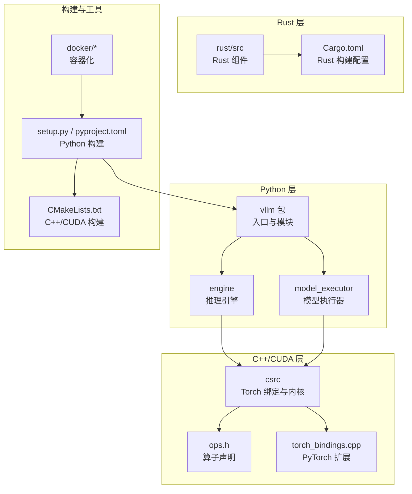
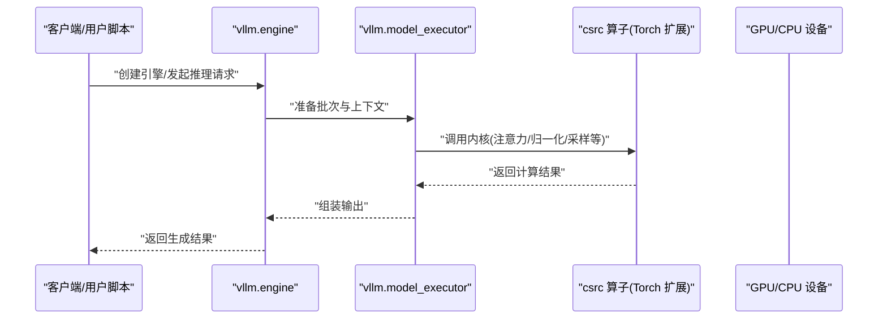
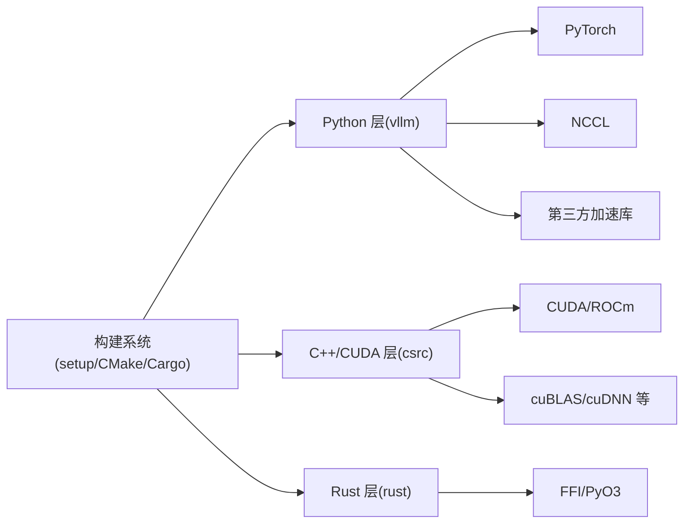

# 开发者指南

<cite>
**本文档引用的文件**   
- [README.md](file://README.md)
- [CONTRIBUTING.md](file://CONTRIBUTING.md)
- [setup.py](file://setup.py)
- [pyproject.toml](file://pyproject.toml)
- [CMakeLists.txt](file://CMakeLists.txt)
- [.pre-commit-config.yaml](file://.pre-commit-config.yaml)
- [requirements/dev.txt](file://requirements/dev.txt)
- [requirements/cuda.txt](file://requirements/cuda.txt)
- [requirements/cpu.txt](file://requirements/cpu.txt)
- [docker/Dockerfile](file://docker/Dockerfile)
- [docker/Dockerfile.rocm](file://docker/Dockerfile.rocm)
- [build_rust.sh](file://build_rust.sh)
- [rust/Cargo.toml](file://rust/Cargo.toml)
- [rust/AGENTS.md](file://rust/AGENTS.md)
- [tools/build_rust.py](file://tools/build_rust.py)
- [vllm/__init__.py](file://vllm/__init__.py)
- [vllm/engine/__init__.py](file://vllm/engine/__init__.py)
- [vllm/model_executor/__init__.py](file://vllm/model_executor/__init__.py)
- [csrc/torch_bindings.cpp](file://csrc/torch_bindings.cpp)
- [csrc/ops.h](file://csrc/ops.h)
- [tests/conftest.py](file://tests/conftest.py)
- [benchmarks/README.md](file://benchmarks/README.md)
- [docs/contributing/README.md](file://docs/contributing/README.md)
- [docs/design/arch_overview.md](file://docs/design/arch_overview.md)
- [docs/getting_started/installation/README.md](file://docs/getting_started/installation/README.md)
- [docs/usage/troubleshooting.md](file://docs/usage/troubleshooting.md)
</cite>

## 目录
1. [简介](#简介)
2. [项目结构](#项目结构)
3. [核心组件](#核心组件)
4. [架构总览](#架构总览)
5. [详细组件分析](#详细组件分析)
6. [依赖关系分析](#依赖关系分析)
7. [性能考量](#性能考量)
8. [故障排除指南](#故障排除指南)
9. [结论](#结论)
10. [附录](#附录)

## 简介
本指南面向希望为 vLLM 贡献代码的开发者，覆盖从开发环境搭建、构建与调试，到代码规范、Git 工作流、审查与合并策略，再到 C++/CUDA 内核与 Rust 组件的开发方法。同时提供新功能开发的完整流程（需求分析、设计文档、实现与测试）、常见问题排查以及社区参与最佳实践。目标是帮助不同背景的贡献者快速上手并高效协作。

## 项目结构
vLLM 采用“Python 主工程 + C++/CUDA 内核 + Rust 组件”的多语言混合架构：
- Python 层负责引擎编排、模型加载、调度、推理服务与 API；
- C++/CUDA 层提供高性能算子、内存管理与通信原语；
- Rust 层提供高性能客户端与服务端能力；
- 构建系统使用 setuptools/pyproject 与 CMake 协同管理编译；
- 测试与基准位于 tests 与 benchmarks；
- Docker 镜像用于统一环境与 CI。

图表来源
- [setup.py](file://setup.py)
- [pyproject.toml](file://pyproject.toml)
- [CMakeLists.txt](file://CMakeLists.txt)
- [vllm/__init__.py](file://vllm/__init__.py)
- [vllm/engine/__init__.py](file://vllm/engine/__init__.py)
- [vllm/model_executor/__init__.py](file://vllm/model_executor/__init__.py)
- [csrc/torch_bindings.cpp](file://csrc/torch_bindings.cpp)
- [csrc/ops.h](file://csrc/ops.h)
- [rust/Cargo.toml](file://rust/Cargo.toml)

章节来源
- [README.md](file://README.md)
- [docs/design/arch_overview.md](file://docs/design/arch_overview.md)
- [docs/getting_started/installation/README.md](file://docs/getting_started/installation/README.md)

## 核心组件
- Python 入口与模块组织：vllm 包通过 __init__ 暴露高层接口，engine 与 model_executor 分别承担推理生命周期与模型执行细节。
- C++/CUDA 内核：csrc 下包含 Torch 绑定与各类 CUDA/CPU 内核，通过 ops.h 声明接口并由 torch_bindings.cpp 暴露给 Python。
- Rust 组件：rust 目录提供独立的 Rust 工程，通过 Cargo 构建并与 Python 集成。
- 构建系统：setup.py 与 pyproject.toml 管理 Python 包与依赖；CMakeLists.txt 协调 C++/CUDA 编译；Dockerfile 提供可复现环境。
- 测试与基准：tests 覆盖单元测试、集成测试与平台相关用例；benchmarks 提供性能回归与特性验证脚本。

章节来源
- [vllm/__init__.py](file://vllm/__init__.py)
- [vllm/engine/__init__.py](file://vllm/engine/__init__.py)
- [vllm/model_executor/__init__.py](file://vllm/model_executor/__init__.py)
- [csrc/torch_bindings.cpp](file://csrc/torch_bindings.cpp)
- [csrc/ops.h](file://csrc/ops.h)
- [rust/Cargo.toml](file://rust/Cargo.toml)
- [setup.py](file://setup.py)
- [pyproject.toml](file://pyproject.toml)
- [CMakeLists.txt](file://CMakeLists.txt)

## 架构总览
vLLM 的核心数据与控制流如下：
- 请求进入 Python 引擎（engine），进行输入解析、调度与批处理；
- 模型执行器（model_executor）调用底层算子（csrc）完成注意力、归一化、采样等计算；
- 可选的 Rust 组件用于高性能客户端/服务端或特定功能；
- 构建阶段将 C++/CUDA 内核编译为 PyTorch 扩展，供 Python 层动态加载。

图表来源
- [vllm/engine/__init__.py](file://vllm/engine/__init__.py)
- [vllm/model_executor/__init__.py](file://vllm/model_executor/__init__.py)
- [csrc/torch_bindings.cpp](file://csrc/torch_bindings.cpp)
- [csrc/ops.h](file://csrc/ops.h)

## 详细组件分析

### 开发环境与依赖安装
- 基础依赖：Python、CUDA/ROCm（按硬件选择）、PyTorch、NCCL 等；
- 可选依赖：Rust 工具链（用于 rust 组件）、Docker（用于容器化构建与测试）；
- 推荐方式：使用 requirements 下的 cuda.txt/cpu.txt/dev.txt 安装对应环境；或使用 docker 镜像快速启动。

章节来源
- [requirements/cuda.txt](file://requirements/cuda.txt)
- [requirements/cpu.txt](file://requirements/cpu.txt)
- [requirements/dev.txt](file://requirements/dev.txt)
- [docker/Dockerfile](file://docker/Dockerfile)
- [docker/Dockerfile.rocm](file://docker/Dockerfile.rocm)
- [docs/getting_started/installation/README.md](file://docs/getting_started/installation/README.md)

### 代码编译与构建
- Python 包构建：通过 setup.py 与 pyproject.toml 定义依赖与构建选项；
- C++/CUDA 内核：CMakeLists.txt 管理编译目标与链接；
- Rust 组件：build_rust.sh 与 tools/build_rust.py 提供构建入口，Cargo.toml 定义 crate 与依赖；
- 增量构建：遵循仓库提供的增量构建说明以减少构建时间。

章节来源
- [setup.py](file://setup.py)
- [pyproject.toml](file://pyproject.toml)
- [CMakeLists.txt](file://CMakeLists.txt)
- [build_rust.sh](file://build_rust.sh)
- [tools/build_rust.py](file://tools/build_rust.py)
- [rust/Cargo.toml](file://rust/Cargo.toml)
- [docs/contributing/README.md](file://docs/contributing/README.md)

### 调试配置
- Python 调试：使用 pdb/ipdb、日志与 profiling 工具；
- C++/CUDA 调试：启用 NVCC/GDB 调试标志，使用 nsight/nsys 进行性能剖析；
- Rust 调试：cargo test、cargo run --release 配合日志与 backtrace；
- 容器内调试：在 Docker 中挂载源码与调试符号，便于断点与追踪。

章节来源
- [docs/contributing/README.md](file://docs/contributing/README.md)
- [docs/usage/troubleshooting.md](file://docs/usage/troubleshooting.md)

### 代码规范与开发流程
- 代码风格：遵循 .pre-commit-config.yaml 配置的 lint/format 规则；
- Git 工作流：分支命名、提交信息规范、PR 模板与审查流程；
- 合并策略：CI 通过后由维护者合并，必要时回滚与版本管理。

章节来源
- [.pre-commit-config.yaml](file://.pre-commit-config.yaml)
- [CONTRIBUTING.md](file://CONTRIBUTING.md)
- [docs/contributing/README.md](file://docs/contributing/README.md)

### 新功能开发流程
- 需求分析：明确问题背景、影响范围与验收标准；
- 设计文档：在 docs/design 下撰写设计说明，包括接口、数据流与性能预期；
- 代码实现：分步实现 Python、C++/CUDA、Rust 组件，保持最小可行实现；
- 测试验证：编写单元测试与集成测试，覆盖边界条件与回归场景；
- 基准评估：在 benchmarks 中添加或更新基准脚本，确保性能不降级。

章节来源
- [docs/design/arch_overview.md](file://docs/design/arch_overview.md)
- [tests/conftest.py](file://tests/conftest.py)
- [benchmarks/README.md](file://benchmarks/README.md)

### C++/CUDA 内核开发方法
- 接口设计：在 csrc/ops.h 声明算子接口，保证类型安全与维度约束；
- 实现要点：合理使用共享内存、向量化与异步拷贝，避免不必要的同步；
- 编译配置：通过 CMake 设置编译器优化与目标架构；
- 性能优化：使用 CUDA Graph、内存池与自定义分配器减少开销；
- 调试技巧：GDB 断点、Nsight Systems/Compute 剖析、错误码与日志定位。

章节来源
- [csrc/ops.h](file://csrc/ops.h)
- [csrc/torch_bindings.cpp](file://csrc/torch_bindings.cpp)
- [CMakeLists.txt](file://CMakeLists.txt)

### Rust 组件开发与集成
- 工程结构：rust/src 下按功能划分模块，Cargo.toml 管理依赖与二进制/库目标；
- 构建与测试：使用 build_rust.sh 或 tools/build_rust.py 构建，cargo test 运行测试；
- 与 Python 集成：通过 PyO3 或其他 FFI 机制暴露接口，确保 ABI 稳定；
- 文档与约定：参考 rust/AGENTS.md 中的编码与协作约定。

章节来源
- [rust/Cargo.toml](file://rust/Cargo.toml)
- [build_rust.sh](file://build_rust.sh)
- [tools/build_rust.py](file://tools/build_rust.py)
- [rust/AGENTS.md](file://rust/AGENTS.md)

## 依赖关系分析
vLLM 的依赖关系呈现分层解耦：
- Python 层依赖 PyTorch、NCCL、第三方加速库；
- C++/CUDA 层依赖 CUDA/ROCm 工具链与 cuBLAS/cuDNN 等；
- Rust 层依赖 Rust 标准库与必要的 FFI 绑定；
- 构建系统串联各层依赖，确保一致性与可复现性。

图表来源
- [setup.py](file://setup.py)
- [pyproject.toml](file://pyproject.toml)
- [CMakeLists.txt](file://CMakeLists.txt)
- [rust/Cargo.toml](file://rust/Cargo.toml)

章节来源
- [setup.py](file://setup.py)
- [pyproject.toml](file://pyproject.toml)
- [CMakeLists.txt](file://CMakeLists.txt)
- [rust/Cargo.toml](file://rust/Cargo.toml)

## 性能考量
- 内核层面：优先使用融合算子、减少内存拷贝与同步；
- 内存管理：合理分配与复用显存，避免碎片化；
- 并行策略：充分利用多卡/多进程，结合 CUDA Graph 提升吞吐；
- 基准回归：新增功能需配套基准，确保性能不劣化；
- 剖析工具：使用 Nsight、perf 与 Python profiling 定位瓶颈。

[本节为通用指导，无需具体文件引用]

## 故障排除指南
- 常见环境问题：CUDA/ROCm 版本不匹配、驱动缺失、环境变量未设置；
- 构建失败：检查依赖版本、编译器路径、CMake 配置；
- 运行时错误：查看日志与回溯，确认输入形状与数据类型；
- 性能退化：对比基准，定位新引入的开销点；
- 容器问题：镜像版本与主机环境差异，重新构建镜像。

章节来源
- [docs/usage/troubleshooting.md](file://docs/usage/troubleshooting.md)
- [docs/contributing/README.md](file://docs/contributing/README.md)

## 结论
本指南系统化梳理了 vLLM 的开发环境、构建与调试、代码规范与流程、架构与组件关系，以及 C++/CUDA 与 Rust 的开发方法。建议贡献者在开始编码前充分理解架构与依赖，遵循规范与流程，并通过测试与基准保障质量与性能。遇到问题时，优先查阅文档与故障排除指南，并在社区中积极交流。

[本节为总结性内容，无需具体文件引用]

## 附录
- 社区参与：阅读 CONTRIBUTING.md 与 docs/contributing/README.md，了解协作方式与治理流程；
- 设计文档：参考 docs/design 下的架构与特性设计；
- 安装与使用：详见 docs/getting_started 与 docs/usage；
- 示例与基准：examples 与 benchmarks 提供实用参考。

章节来源
- [CONTRIBUTING.md](file://CONTRIBUTING.md)
- [docs/contributing/README.md](file://docs/contributing/README.md)
- [docs/design/arch_overview.md](file://docs/design/arch_overview.md)
- [docs/getting_started/installation/README.md](file://docs/getting_started/installation/README.md)
- [docs/usage/troubleshooting.md](file://docs/usage/troubleshooting.md)
- [benchmarks/README.md](file://benchmarks/README.md)