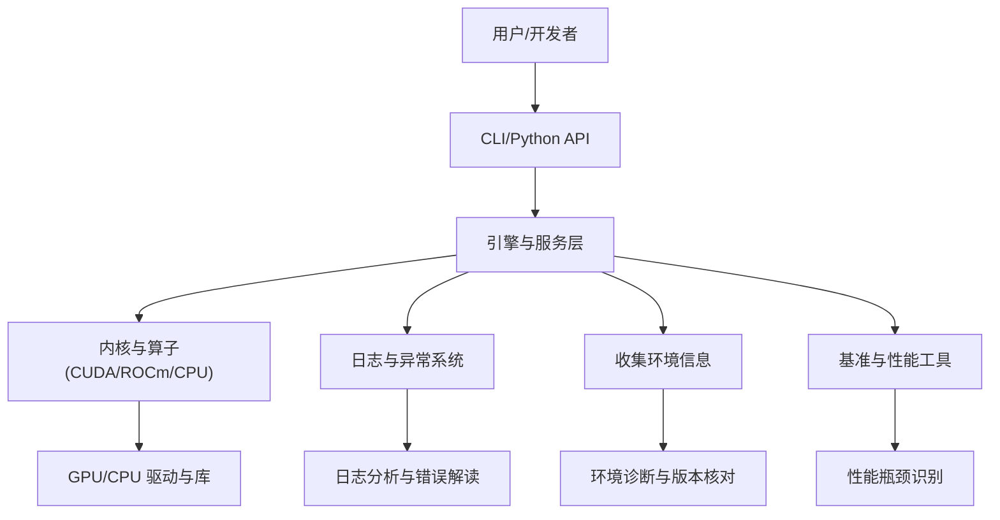
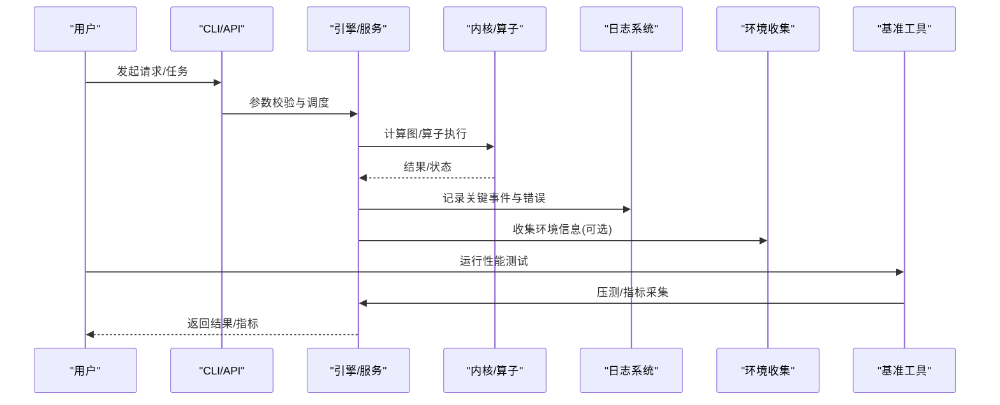
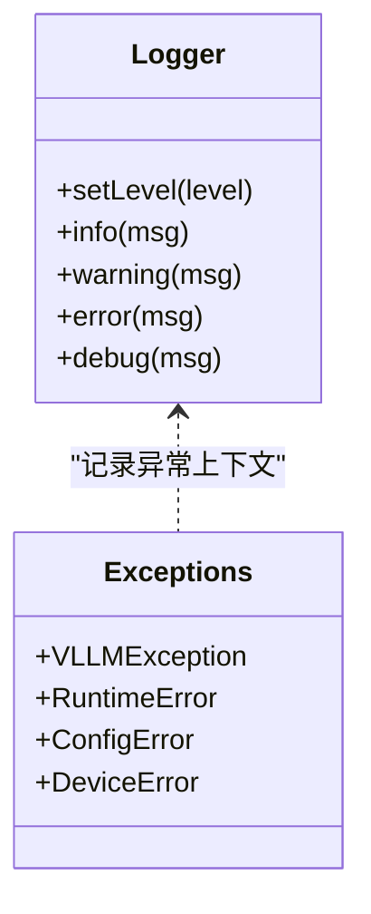
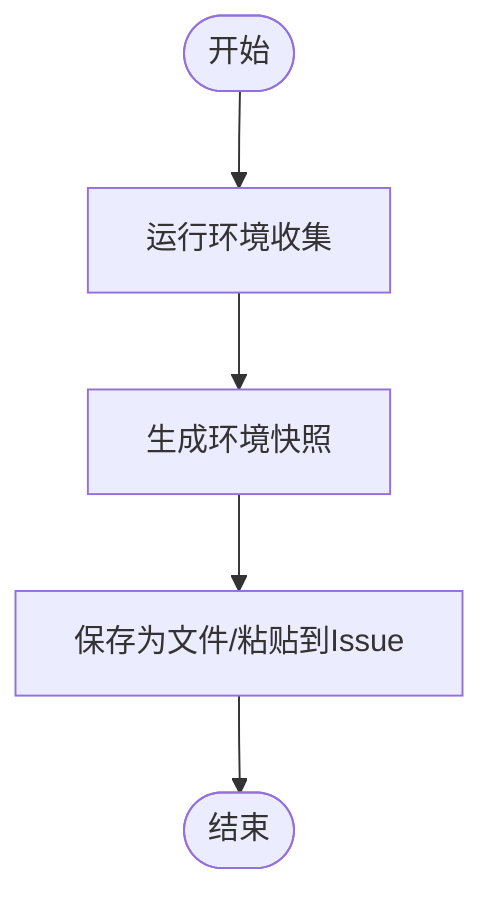
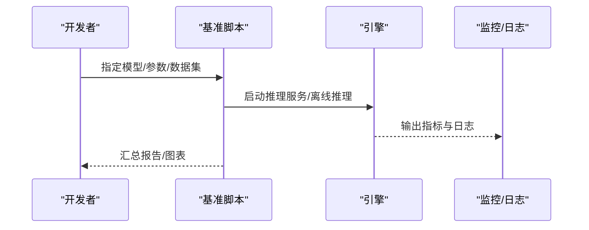
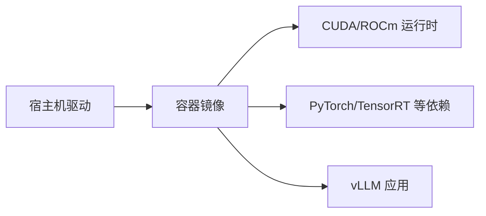
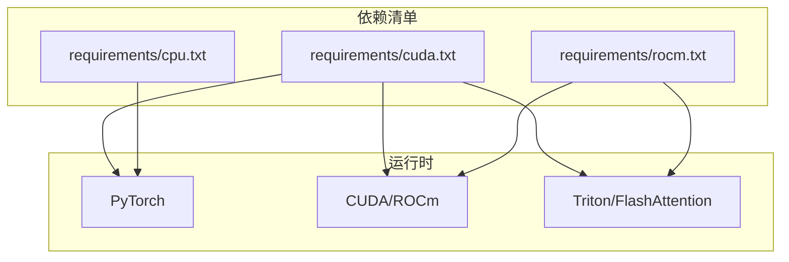

# 故障排除和常见问题

<cite>
**本文引用的文件**   
- [README.md](file://README.md)
- [CONTRIBUTING.md](file://CONTRIBUTING.md)
- [SECURITY.md](file://SECURITY.md)
- [docs/usage/troubleshooting.md](file://docs/usage/troubleshooting.md)
- [docs/usage/faq.md](file://docs/usage/faq.md)
- [docs/configuration/env_vars.md](file://docs/configuration/env_vars.md)
- [docs/getting_started/installation/README.md](file://docs/getting_started/installation/README.md)
- [requirements/cuda.txt](file://requirements/cuda.txt)
- [requirements/cpu.txt](file://requirements/cpu.txt)
- [requirements/rocm.txt](file://requirements/rocm.txt)
- [vllm/logger.py](file://vllm/logger.py)
- [vllm/exceptions.py](file://vllm/exceptions.py)
- [vllm/collect_env.py](file://vllm/collect_env.py)
- [docker/Dockerfile](file://docker/Dockerfile)
- [docker/Dockerfile.rocm](file://docker/Dockerfile.rocm)
- [benchmarks/benchmark_serving.py](file://benchmarks/benchmark_serving.py)
- [tests/distributed/test_distributed_oot.py](file://tests/distributed/test_distributed_oot.py)
</cite>

## 目录
1. [简介](#简介)
2. [项目结构](#项目结构)
3. [核心组件](#核心组件)
4. [架构总览](#架构总览)
5. [详细组件分析](#详细组件分析)
6. [依赖关系分析](#依赖关系分析)
7. [性能注意事项](#性能注意事项)
8. [故障排除指南](#故障排除指南)
9. [结论](#结论)
10. [附录](#附录)

## 简介
本指南面向在 vLLM 开发与部署过程中遇到问题的工程师与用户，聚焦环境配置、运行时错误、日志与调试、性能瓶颈定位与优化，以及社区支持与问题报告渠道。内容基于仓库中的文档、脚本与示例进行系统化整理，帮助快速定位并解决问题。

## 项目结构
与故障排除相关的核心位置包括：
- 使用与排错文档：docs/usage/troubleshooting.md、docs/usage/faq.md
- 环境变量与安装说明：docs/configuration/env_vars.md、docs/getting_started/installation/README.md
- 依赖清单：requirements/*.txt（cuda、cpu、rocm）
- 运行环境与诊断工具：vllm/collect_env.py、vllm/logger.py、vllm/exceptions.py
- 容器镜像与环境：docker/Dockerfile、docker/Dockerfile.rocm
- 基准测试与性能用例：benchmarks/benchmark_serving.py
- 分布式与 OOT 相关测试：tests/distributed/test_distributed_oot.py

图表来源
- [docs/usage/troubleshooting.md](file://docs/usage/troubleshooting.md)
- [vllm/collect_env.py](file://vllm/collect_env.py)
- [vllm/logger.py](file://vllm/logger.py)
- [benchmarks/benchmark_serving.py](file://benchmarks/benchmark_serving.py)

章节来源
- [docs/usage/troubleshooting.md](file://docs/usage/troubleshooting.md)
- [docs/usage/faq.md](file://docs/usage/faq.md)
- [docs/configuration/env_vars.md](file://docs/configuration/env_vars.md)
- [docs/getting_started/installation/README.md](file://docs/getting_started/installation/README.md)

## 核心组件
- 日志与异常子系统：提供结构化日志输出与统一异常类型，便于定位错误上下文与堆栈。
- 环境收集工具：用于打印当前 Python、CUDA/ROCm、Torch、依赖版本等关键信息，辅助复现与排查。
- 基准与性能工具：提供吞吐、延迟、显存占用等指标采集，帮助识别性能瓶颈。
- 容器化镜像：封装 CUDA/ROCm 等依赖，减少环境差异导致的兼容性问题。

章节来源
- [vllm/logger.py](file://vllm/logger.py)
- [vllm/exceptions.py](file://vllm/exceptions.py)
- [vllm/collect_env.py](file://vllm/collect_env.py)
- [benchmarks/benchmark_serving.py](file://benchmarks/benchmark_serving.py)
- [docker/Dockerfile](file://docker/Dockerfile)
- [docker/Dockerfile.rocm](file://docker/Dockerfile.rocm)

## 架构总览
下图展示从调用入口到内核执行、日志与诊断的交互路径，有助于理解错误传播与性能观测点。

图表来源
- [benchmarks/benchmark_serving.py](file://benchmarks/benchmark_serving.py)
- [vllm/logger.py](file://vllm/logger.py)
- [vllm/collect_env.py](file://vllm/collect_env.py)

## 详细组件分析

### 日志与异常系统
- 日志模块负责统一输出格式、级别控制与上下文注入，便于在复杂多进程/多线程环境中追踪问题。
- 异常模块定义统一的错误类型与消息规范，确保上层能捕获并给出可操作提示。

图表来源
- [vllm/logger.py](file://vllm/logger.py)
- [vllm/exceptions.py](file://vllm/exceptions.py)

章节来源
- [vllm/logger.py](file://vllm/logger.py)
- [vllm/exceptions.py](file://vllm/exceptions.py)

### 环境收集与诊断
- 环境收集脚本汇总 Python、CUDA/ROCm、Torch、依赖包版本与设备能力，是复现问题的第一步。
- 建议将输出保存为附件提交至 Issue，以便社区快速定位。

图表来源
- [vllm/collect_env.py](file://vllm/collect_env.py)

章节来源
- [vllm/collect_env.py](file://vllm/collect_env.py)

### 基准与性能工具
- 基准脚本提供吞吐、延迟、显存等指标，可用于验证不同配置下的性能表现。
- 通过对比不同参数（批大小、序列长度、量化方式、注意力后端）找到瓶颈点。

图表来源
- [benchmarks/benchmark_serving.py](file://benchmarks/benchmark_serving.py)

章节来源
- [benchmarks/benchmark_serving.py](file://benchmarks/benchmark_serving.py)

### 容器化与依赖隔离
- Dockerfile 封装了 CUDA/ROCm 等依赖，降低本地与 CI 环境差异。
- 针对 ROCm/XPU/TPU 等不同硬件平台提供专用镜像，避免驱动/库冲突。

图表来源
- [docker/Dockerfile](file://docker/Dockerfile)
- [docker/Dockerfile.rocm](file://docker/Dockerfile.rocm)

章节来源
- [docker/Dockerfile](file://docker/Dockerfile)
- [docker/Dockerfile.rocm](file://docker/Dockerfile.rocm)

## 依赖关系分析
- 依赖清单按平台划分：cuda、cpu、rocm、tpu、xpu 等，确保在不同硬件上安装正确的版本集合。
- 常见冲突来源于 PyTorch、CUDA/ROCm、Trition、FlashAttention 等版本不匹配。

图表来源
- [requirements/cuda.txt](file://requirements/cuda.txt)
- [requirements/cpu.txt](file://requirements/cpu.txt)
- [requirements/rocm.txt](file://requirements/rocm.txt)

章节来源
- [requirements/cuda.txt](file://requirements/cuda.txt)
- [requirements/cpu.txt](file://requirements/cpu.txt)
- [requirements/rocm.txt](file://requirements/rocm.txt)

## 性能注意事项
- 关注批大小、序列长度、KV Cache 策略、注意力后端选择对吞吐与延迟的影响。
- 使用基准脚本对比不同配置，结合日志与监控定位热点路径。
- 量化、融合算子、编译选项（如 torch.compile）可能带来显著收益，但需验证正确性与稳定性。

[本节为通用指导，不直接分析具体文件]

## 故障排除指南

### 环境配置问题
- 依赖冲突与版本不兼容
  - 检查 requirements 文件与实际安装的版本是否一致。
  - 使用环境收集脚本输出完整快照，确认 CUDA/ROCm、Torch、Trition 等版本组合。
  - 优先使用官方 Docker 镜像以减少差异。
- 安装失败或导入错误
  - 确认操作系统、CPU/GPU 架构与依赖要求匹配。
  - 清理缓存后重新安装，必要时切换镜像源。
- 容器内环境问题
  - 核对宿主驱动与容器内运行时版本一致性。
  - 使用对应平台的 Dockerfile 构建镜像。

章节来源
- [docs/getting_started/installation/README.md](file://docs/getting_started/installation/README.md)
- [docs/configuration/env_vars.md](file://docs/configuration/env_vars.md)
- [requirements/cuda.txt](file://requirements/cuda.txt)
- [requirements/cpu.txt](file://requirements/cpu.txt)
- [requirements/rocm.txt](file://requirements/rocm.txt)
- [docker/Dockerfile](file://docker/Dockerfile)
- [docker/Dockerfile.rocm](file://docker/Dockerfile.rocm)
- [vllm/collect_env.py](file://vllm/collect_env.py)

### 运行时错误排查
- 内存溢出（OOM）
  - 降低批大小或序列长度；启用 KV Cache 优化与量化。
  - 检查是否存在未释放的张量或循环引用。
  - 使用基准脚本逐步放大负载观察拐点。
- CUDA/ROCm 错误
  - 核对驱动与运行时版本；确认设备可用性与权限。
  - 查看日志中底层算子报错，尝试禁用特定后端或回退路径。
- 性能退化
  - 检查数据预处理与 IO 瓶颈；评估网络通信开销（分布式场景）。
  - 调整并行策略（张量/流水线/专家并行）与通信后端。

章节来源
- [docs/usage/troubleshooting.md](file://docs/usage/troubleshooting.md)
- [vllm/logger.py](file://vllm/logger.py)
- [benchmarks/benchmark_serving.py](file://benchmarks/benchmark_serving.py)

### 日志分析与错误信息解读
- 开启更详细的日志级别，捕获关键路径的事件与异常。
- 关注异常类型与堆栈，定位到具体模块与函数。
- 将日志与错误信息连同环境快照一起提交，提高复现效率。

章节来源
- [vllm/logger.py](file://vllm/logger.py)
- [vllm/exceptions.py](file://vllm/exceptions.py)
- [docs/usage/troubleshooting.md](file://docs/usage/troubleshooting.md)

### 使用调试工具定位问题根源
- 使用环境收集脚本生成快照，作为问题报告的一部分。
- 借助基准脚本进行最小化复现，逐步缩小范围。
- 在分布式场景中，检查节点间通信与资源分配情况。

章节来源
- [vllm/collect_env.py](file://vllm/collect_env.py)
- [benchmarks/benchmark_serving.py](file://benchmarks/benchmark_serving.py)
- [tests/distributed/test_distributed_oot.py](file://tests/distributed/test_distributed_oot.py)

### 性能瓶颈识别与优化建议
- 通过基准脚本采集吞吐、延迟、显存占用等指标。
- 对比不同注意力后端、量化方案与编译选项的效果。
- 关注数据加载、序列化/反序列化、通信开销等热点。

章节来源
- [benchmarks/benchmark_serving.py](file://benchmarks/benchmark_serving.py)
- [docs/configuration/env_vars.md](file://docs/configuration/env_vars.md)

### 社区支持和问题报告渠道
- 阅读贡献与安全文档，了解如何提交 Issue、PR 与安全漏洞报告。
- 提供最小复现代码、日志与环境快照，便于社区快速响应。

章节来源
- [CONTRIBUTING.md](file://CONTRIBUTING.md)
- [SECURITY.md](file://SECURITY.md)
- [README.md](file://README.md)

## 结论
通过系统化的环境检查、日志与异常分析、基准测试与容器化隔离，大多数 vLLM 相关问题都能被快速定位与解决。建议在问题报告中附带环境快照与最小复现，以加速社区支持流程。

[本节为总结性内容，不直接分析具体文件]

## 附录

### 常见问题解答（FAQ）
- 为什么安装依赖时报版本冲突？
  - 检查 requirements 文件与已安装包版本；使用虚拟环境或容器隔离。
- 为什么出现 CUDA/ROCm 初始化失败？
  - 核对驱动与运行时版本；确认设备可用性与权限；查看日志中的底层错误。
- 为什么推理时频繁 OOM？
  - 降低批大小或序列长度；启用 KV Cache 优化与量化；检查内存泄漏。
- 如何获取环境快照？
  - 运行环境收集脚本并保存输出，随问题报告一并提交。

章节来源
- [docs/usage/faq.md](file://docs/usage/faq.md)
- [docs/usage/troubleshooting.md](file://docs/usage/troubleshooting.md)
- [vllm/collect_env.py](file://vllm/collect_env.py)