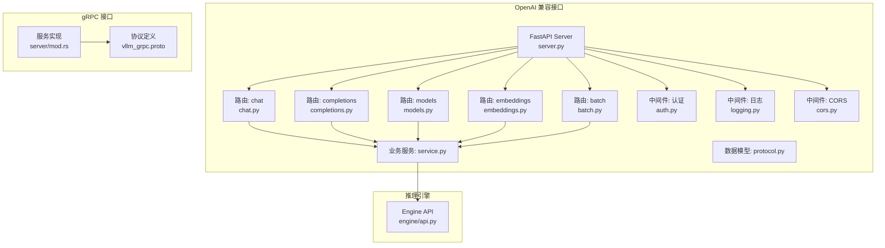
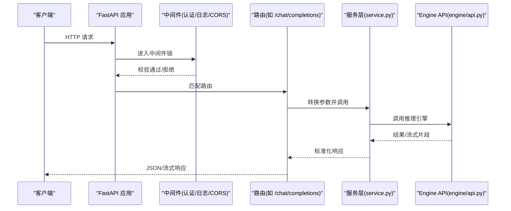
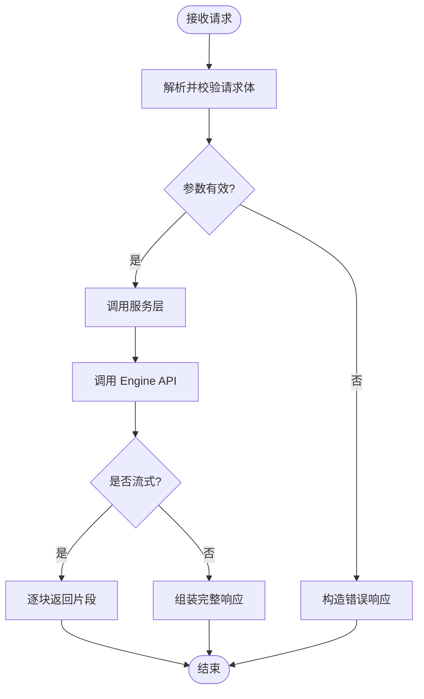
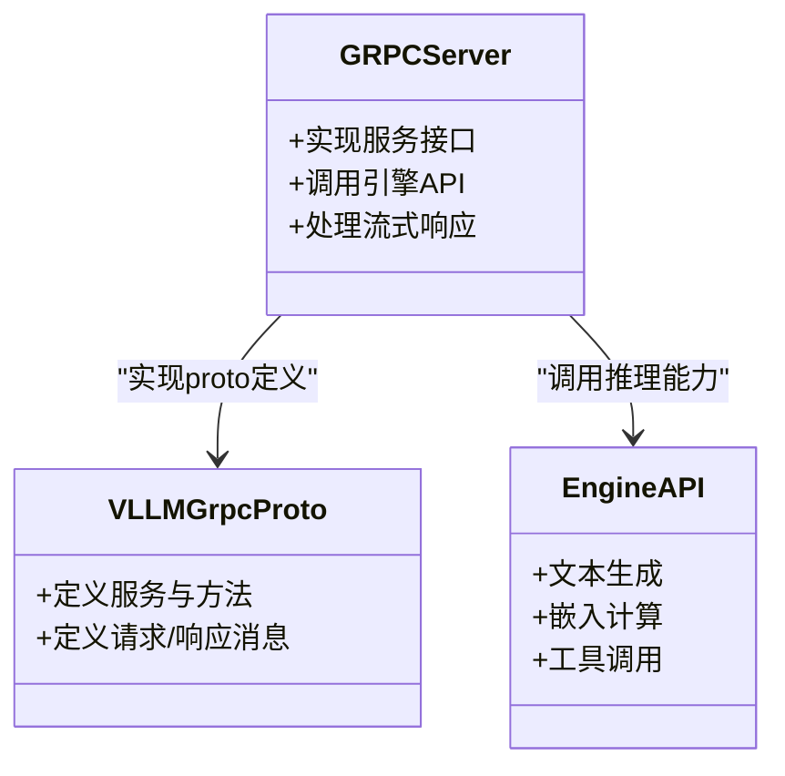
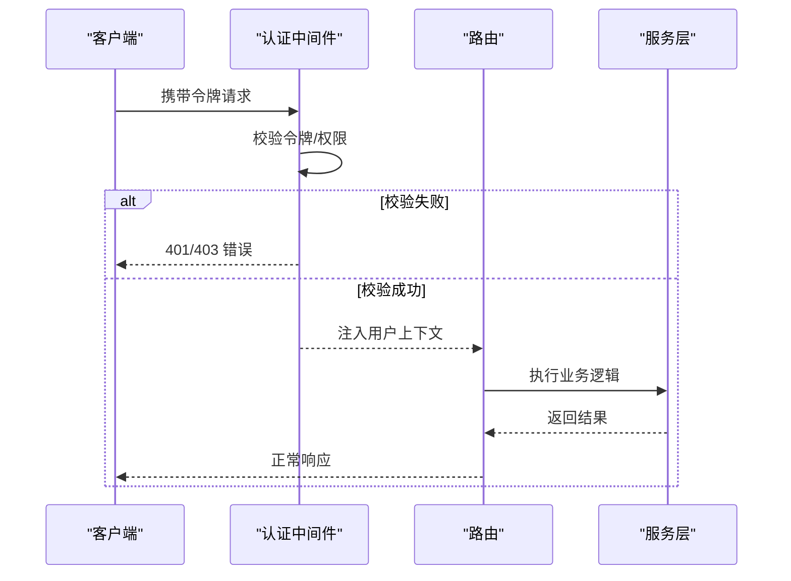
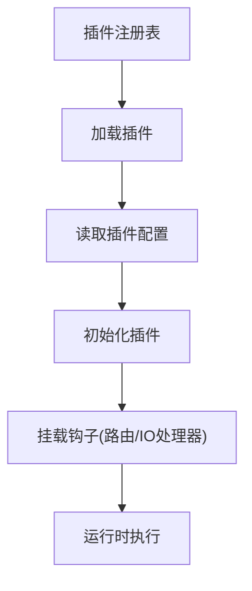
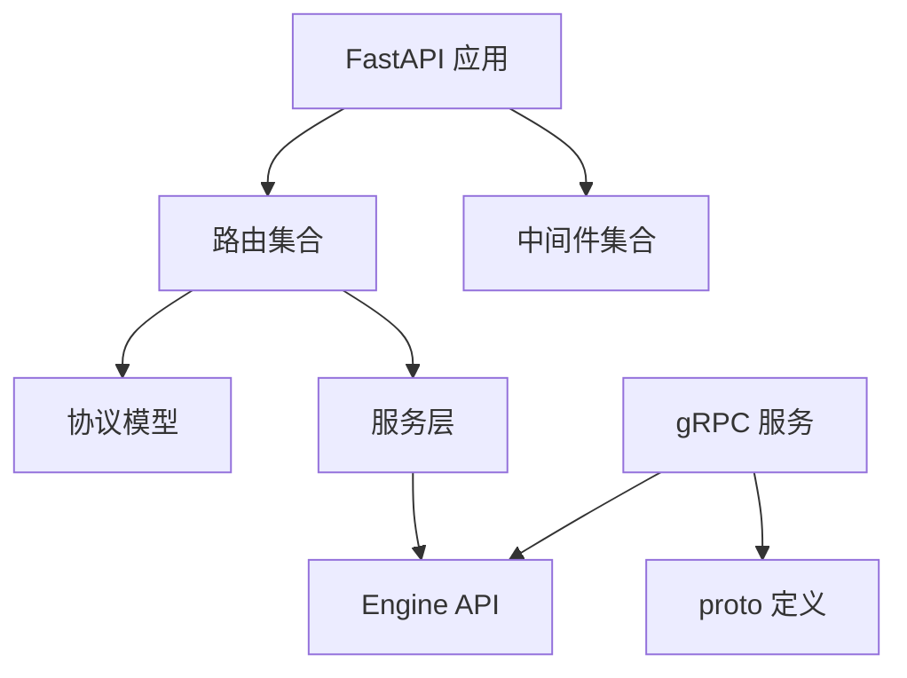

# API扩展开发

<cite>
**本文档引用的文件**   
- [vllm/entrypoints/openai/server.py](file://vllm/entrypoints/openai/server.py)
- [vllm/entrypoints/openai/api_server.py](file://vllm/entrypoints/openai/api_server.py)
- [vllm/entrypoints/openai/protocol.py](file://vllm/entrypoints/openai/protocol.py)
- [vllm/entrypoints/openai/routers/chat.py](file://vllm/entrypoints/openai/routers/chat.py)
- [vllm/entrypoints/openai/routers/completions.py](file://vllm/entrypoints/openai/routers/completions.py)
- [vllm/entrypoints/openai/routers/models.py](file://vllm/entrypoints/openai/routers/models.py)
- [vllm/entrypoints/openai/routers/embeddings.py](file://vllm/entrypoints/openai/routers/embeddings.py)
- [vllm/entrypoints/openai/routers/batch.py](file://vllm/entrypoints/openai/routers/batch.py)
- [vllm/entrypoints/openai/middleware/auth.py](file://vllm/entrypoints/openai/middleware/auth.py)
- [vllm/entrypoints/openai/middleware/logging.py](file://vllm/entrypoints/openai/middleware/logging.py)
- [vllm/entrypoints/openai/middleware/cors.py](file://vllm/entrypoints/openai/middleware/cors.py)
- [vllm/entrypoints/openai/service.py](file://vllm/entrypoints/openai/service.py)
- [vllm/engine/api.py](file://vllm/engine/api.py)
- [rust/proto/vllm_grpc.proto](file://rust/proto/vllm_grpc.proto)
- [rust/src/server/mod.rs](file://rust/src/server/mod.rs)
- [examples/features/openai_batch/main.py](file://examples/features/openai_batch/main.py)
- [examples/tool_calling/openai_chat_completion_client_with_tools.py](file://examples/tool_calling/openai_chat_completion_client_with_tools.py)
- [docs/design/endpoint_plugins.md](file://docs/design/endpoint_plugins.md)
- [docs/design/io_processor_plugins.md](file://docs/design/io_processor_plugins.md)
- [docs/design/plugin_system.md](file://docs/design/plugin_system.md)
</cite>

## 目录
1. [简介](#简介)
2. [项目结构](#项目结构)
3. [核心组件](#核心组件)
4. [架构总览](#架构总览)
5. [详细组件分析](#详细组件分析)
6. [依赖关系分析](#依赖关系分析)
7. [性能考虑](#性能考虑)
8. [故障排查指南](#故障排查指南)
9. [结论](#结论)
10. [附录](#附录)

## 简介
本指南面向需要在 vLLM 中扩展 OpenAI 兼容接口与 gRPC 接口的开发者，系统讲解如何新增自定义端点、定义协议、实现路由与请求处理、格式化响应，以及如何在现有服务中集成认证、鉴权、日志与监控。文档同时提供 RESTful API 最佳实践（错误处理、版本管理、文档生成），并给出从简单查询到复杂批处理的完整示例路径，帮助快速落地。

## 项目结构
vLLM 的 OpenAI 兼容接口位于 Python 入口层，采用 FastAPI 构建；gRPC 接口由 Rust 侧提供。关键目录与职责如下：
- OpenAI 服务端与协议：server、api_server、protocol、routers、middleware、service
- Engine API：engine/api.py 暴露推理引擎能力
- gRPC：rust/proto 定义协议，rust/src/server 提供服务实现
- 示例与插件设计文档：examples 与 docs/design

图表来源
- [vllm/entrypoints/openai/server.py](file://vllm/entrypoints/openai/server.py)
- [vllm/entrypoints/openai/routers/chat.py](file://vllm/entrypoints/openai/routers/chat.py)
- [vllm/entrypoints/openai/routers/completions.py](file://vllm/entrypoints/openai/routers/completions.py)
- [vllm/entrypoints/openai/routers/models.py](file://vllm/entrypoints/openai/routers/models.py)
- [vllm/entrypoints/openai/routers/embeddings.py](file://vllm/entrypoints/openai/routers/embeddings.py)
- [vllm/entrypoints/openai/routers/batch.py](file://vllm/entrypoints/openai/routers/batch.py)
- [vllm/entrypoints/openai/middleware/auth.py](file://vllm/entrypoints/openai/middleware/auth.py)
- [vllm/entrypoints/openai/middleware/logging.py](file://vllm/entrypoints/openai/middleware/logging.py)
- [vllm/entrypoints/openai/middleware/cors.py](file://vllm/entrypoints/openai/middleware/cors.py)
- [vllm/entrypoints/openai/service.py](file://vllm/entrypoints/openai/service.py)
- [vllm/entrypoints/openai/protocol.py](file://vllm/entrypoints/openai/protocol.py)
- [vllm/engine/api.py](file://vllm/engine/api.py)
- [rust/proto/vllm_grpc.proto](file://rust/proto/vllm_grpc.proto)
- [rust/src/server/mod.rs](file://rust/src/server/mod.rs)

章节来源
- [vllm/entrypoints/openai/server.py](file://vllm/entrypoints/openai/server.py)
- [vllm/entrypoints/openai/api_server.py](file://vllm/entrypoints/openai/api_server.py)
- [vllm/entrypoints/openai/protocol.py](file://vllm/entrypoints/openai/protocol.py)
- [vllm/entrypoints/openai/routers/chat.py](file://vllm/entrypoints/openai/routers/chat.py)
- [vllm/entrypoints/openai/routers/completions.py](file://vllm/entrypoints/openai/routers/completions.py)
- [vllm/entrypoints/openai/routers/models.py](file://vllm/entrypoints/openai/routers/models.py)
- [vllm/entrypoints/openai/routers/embeddings.py](file://vllm/entrypoints/openai/routers/embeddings.py)
- [vllm/entrypoints/openai/routers/batch.py](file://vllm/entrypoints/openai/routers/batch.py)
- [vllm/entrypoints/openai/middleware/auth.py](file://vllm/entrypoints/openai/middleware/auth.py)
- [vllm/entrypoints/openai/middleware/logging.py](file://vllm/entrypoints/openai/middleware/logging.py)
- [vllm/entrypoints/openai/middleware/cors.py](file://vllm/entrypoints/openai/middleware/cors.py)
- [vllm/entrypoints/openai/service.py](file://vllm/entrypoints/openai/service.py)
- [vllm/engine/api.py](file://vllm/engine/api.py)
- [rust/proto/vllm_grpc.proto](file://rust/proto/vllm_grpc.proto)
- [rust/src/server/mod.rs](file://rust/src/server/mod.rs)

## 核心组件
- OpenAI 兼容服务器与路由：FastAPI 应用装配路由，统一处理请求生命周期
- 协议与数据模型：Pydantic 模型定义请求/响应结构，保证校验与序列化一致性
- 业务服务层：封装调用 engine API 的逻辑，集中处理参数映射、流式与非流式输出
- 中间件：认证、日志、CORS 等横切关注点
- Engine API：对外暴露推理能力（文本生成、嵌入、工具调用等）
- gRPC 协议与服务：Rust 侧定义 proto，提供高性能二进制接口

章节来源
- [vllm/entrypoints/openai/server.py](file://vllm/entrypoints/openai/server.py)
- [vllm/entrypoints/openai/protocol.py](file://vllm/entrypoints/openai/protocol.py)
- [vllm/entrypoints/openai/service.py](file://vllm/entrypoints/openai/service.py)
- [vllm/engine/api.py](file://vllm/engine/api.py)
- [rust/proto/vllm_grpc.proto](file://rust/proto/vllm_grpc.proto)
- [rust/src/server/mod.rs](file://rust/src/server/mod.rs)

## 架构总览
OpenAI 兼容接口通过 FastAPI 暴露 REST 端点，请求经中间件（认证、日志、CORS）进入路由，路由将请求转换为内部协议对象，交由服务层调用 engine API，最终返回结构化响应或流式片段。gRPC 接口独立于 Python 服务，使用 Rust 实现，遵循 proto 定义。

图表来源
- [vllm/entrypoints/openai/server.py](file://vllm/entrypoints/openai/server.py)
- [vllm/entrypoints/openai/middleware/auth.py](file://vllm/entrypoints/openai/middleware/auth.py)
- [vllm/entrypoints/openai/middleware/logging.py](file://vllm/entrypoints/openai/middleware/logging.py)
- [vllm/entrypoints/openai/middleware/cors.py](file://vllm/entrypoints/openai/middleware/cors.py)
- [vllm/entrypoints/openai/routers/chat.py](file://vllm/entrypoints/openai/routers/chat.py)
- [vllm/entrypoints/openai/service.py](file://vllm/entrypoints/openai/service.py)
- [vllm/engine/api.py](file://vllm/engine/api.py)

## 详细组件分析

### OpenAI 兼容接口扩展流程
- 路由定义：在 routers 下新增模块，注册到 FastAPI 应用
- 请求处理：解析请求体为 Pydantic 模型，进行参数校验
- 响应格式化：统一返回 OpenAI 兼容结构，支持流式与非流式
- 错误处理：异常转标准错误响应，包含状态码与消息

图表来源
- [vllm/entrypoints/openai/routers/chat.py](file://vllm/entrypoints/openai/routers/chat.py)
- [vllm/entrypoints/openai/service.py](file://vllm/entrypoints/openai/service.py)
- [vllm/engine/api.py](file://vllm/engine/api.py)

章节来源
- [vllm/entrypoints/openai/routers/chat.py](file://vllm/entrypoints/openai/routers/chat.py)
- [vllm/entrypoints/openai/routers/completions.py](file://vllm/entrypoints/openai/routers/completions.py)
- [vllm/entrypoints/openai/routers/models.py](file://vllm/entrypoints/openai/routers/models.py)
- [vllm/entrypoints/openai/routers/embeddings.py](file://vllm/entrypoints/openai/routers/embeddings.py)
- [vllm/entrypoints/openai/routers/batch.py](file://vllm/entrypoints/openai/routers/batch.py)
- [vllm/entrypoints/openai/protocol.py](file://vllm/entrypoints/openai/protocol.py)
- [vllm/entrypoints/openai/service.py](file://vllm/entrypoints/openai/service.py)
- [vllm/engine/api.py](file://vllm/engine/api.py)

### gRPC 接口扩展方法
- 协议定义：在 rust/proto 下新增 .proto 文件，定义服务与方法
- 代码生成：使用 protoc 生成 Rust 客户端/服务端桩代码
- 服务实现：在 rust/src/server 中实现具体逻辑，调用底层引擎能力
- 集成启动：在服务主进程中注册 gRPC 服务并监听端口

图表来源
- [rust/proto/vllm_grpc.proto](file://rust/proto/vllm_grpc.proto)
- [rust/src/server/mod.rs](file://rust/src/server/mod.rs)
- [vllm/engine/api.py](file://vllm/engine/api.py)

章节来源
- [rust/proto/vllm_grpc.proto](file://rust/proto/vllm_grpc.proto)
- [rust/src/server/mod.rs](file://rust/src/server/mod.rs)

### 认证与授权机制
- 中间件拦截：在认证中间件中解析令牌、验证签名或查询权限
- 上下文注入：将用户信息注入请求上下文，供路由与服务层使用
- 访问控制：基于角色或策略限制端点访问
- 审计日志：记录认证事件与访问行为

图表来源
- [vllm/entrypoints/openai/middleware/auth.py](file://vllm/entrypoints/openai/middleware/auth.py)
- [vllm/entrypoints/openai/routers/chat.py](file://vllm/entrypoints/openai/routers/chat.py)
- [vllm/entrypoints/openai/service.py](file://vllm/entrypoints/openai/service.py)

章节来源
- [vllm/entrypoints/openai/middleware/auth.py](file://vllm/entrypoints/openai/middleware/auth.py)

### 日志与监控集成
- 请求日志：记录入站请求、参数摘要、耗时与状态码
- 指标采集：暴露 Prometheus 指标（QPS、延迟分布、错误率）
- 链路追踪：集成 OpenTelemetry，生成 Trace 与 Span
- 告警规则：基于指标阈值触发告警

图表来源
- [vllm/entrypoints/openai/middleware/logging.py](file://vllm/entrypoints/openai/middleware/logging.py)

章节来源
- [vllm/entrypoints/openai/middleware/logging.py](file://vllm/entrypoints/openai/middleware/logging.py)

### RESTful API 最佳实践
- 错误处理：统一异常捕获，返回标准错误结构，区分客户端与服务器错误
- 版本管理：URL 前缀或请求头版本控制，保持向后兼容
- 文档生成：自动生成 OpenAPI/Swagger 文档，便于前端联调
- 幂等性：对写操作设计幂等键，避免重复提交
- 分页与限流：大数据集分页返回，按 IP/用户限流

章节来源
- [vllm/entrypoints/openai/server.py](file://vllm/entrypoints/openai/server.py)
- [vllm/entrypoints/openai/protocol.py](file://vllm/entrypoints/openai/protocol.py)

### 插件化扩展点
- 端点插件：通过插件机制注册新端点，无需修改核心路由
- IO 处理器插件：扩展输入输出处理逻辑，适配不同数据格式
- 插件系统：统一的加载、配置与生命周期管理

图表来源
- [docs/design/endpoint_plugins.md](file://docs/design/endpoint_plugins.md)
- [docs/design/io_processor_plugins.md](file://docs/design/io_processor_plugins.md)
- [docs/design/plugin_system.md](file://docs/design/plugin_system.md)

章节来源
- [docs/design/endpoint_plugins.md](file://docs/design/endpoint_plugins.md)
- [docs/design/io_processor_plugins.md](file://docs/design/io_processor_plugins.md)
- [docs/design/plugin_system.md](file://docs/design/plugin_system.md)

## 依赖关系分析
- FastAPI 应用依赖路由模块、中间件与服务层
- 路由依赖协议模型与服务层
- 服务层依赖 Engine API 与外部资源（如缓存、队列）
- gRPC 服务依赖 proto 定义与底层引擎能力

图表来源
- [vllm/entrypoints/openai/server.py](file://vllm/entrypoints/openai/server.py)
- [vllm/entrypoints/openai/routers/chat.py](file://vllm/entrypoints/openai/routers/chat.py)
- [vllm/entrypoints/openai/protocol.py](file://vllm/entrypoints/openai/protocol.py)
- [vllm/entrypoints/openai/service.py](file://vllm/entrypoints/openai/service.py)
- [vllm/engine/api.py](file://vllm/engine/api.py)
- [rust/proto/vllm_grpc.proto](file://rust/proto/vllm_grpc.proto)
- [rust/src/server/mod.rs](file://rust/src/server/mod.rs)

章节来源
- [vllm/entrypoints/openai/server.py](file://vllm/entrypoints/openai/server.py)
- [vllm/entrypoints/openai/protocol.py](file://vllm/entrypoints/openai/protocol.py)
- [vllm/entrypoints/openai/service.py](file://vllm/entrypoints/openai/service.py)
- [vllm/engine/api.py](file://vllm/engine/api.py)
- [rust/proto/vllm_grpc.proto](file://rust/proto/vllm_grpc.proto)
- [rust/src/server/mod.rs](file://rust/src/server/mod.rs)

## 性能考虑
- 流式响应：优先使用流式传输降低首字节延迟
- 批处理：合并相似请求，提高吞吐
- 缓存：KV 缓存与结果缓存减少重复计算
- 异步 I/O：非阻塞调用提升并发能力
- 资源隔离：多租户场景下隔离 CPU/GPU 资源
- 监控：实时观察 QPS、延迟、错误率与资源利用率

[本节为通用指导，不直接分析具体文件]

## 故障排查指南
- 常见错误：参数校验失败、引擎调用超时、内存不足、权限拒绝
- 日志定位：查看中间件日志与引擎日志，定位请求轨迹
- 指标诊断：通过 Prometheus 指标分析瓶颈
- 复现步骤：最小化请求用例，逐步增加复杂度
- 恢复策略：重试、降级、熔断与回滚

章节来源
- [vllm/entrypoints/openai/middleware/logging.py](file://vllm/entrypoints/openai/middleware/logging.py)
- [vllm/entrypoints/openai/middleware/auth.py](file://vllm/entrypoints/openai/middleware/auth.py)

## 结论
通过在 vLLM 中扩展 OpenAI 兼容接口与 gRPC 接口，可以灵活地添加新功能并保持与生态兼容。建议遵循插件化设计、统一协议与错误处理、完善监控与日志，确保可维护性与可扩展性。结合示例与最佳实践，可快速实现从简单查询到复杂批处理的多样化 API。

[本节为总结，不直接分析具体文件]

## 附录
- 示例路径：
  - 简单查询接口：参考聊天补全路由与协议模型
  - 工具调用示例：tool_calling 下的客户端示例
  - 批处理 API：openai_batch 示例展示批量任务管理
- 文档生成：启用 FastAPI 自动文档，导出 OpenAPI 规范
- 部署建议：容器化部署，配置环境变量与资源限制

章节来源
- [examples/tool_calling/openai_chat_completion_client_with_tools.py](file://examples/tool_calling/openai_chat_completion_client_with_tools.py)
- [examples/features/openai_batch/main.py](file://examples/features/openai_batch/main.py)
- [vllm/entrypoints/openai/routers/chat.py](file://vllm/entrypoints/openai/routers/chat.py)
- [vllm/entrypoints/openai/protocol.py](file://vllm/entrypoints/openai/protocol.py)