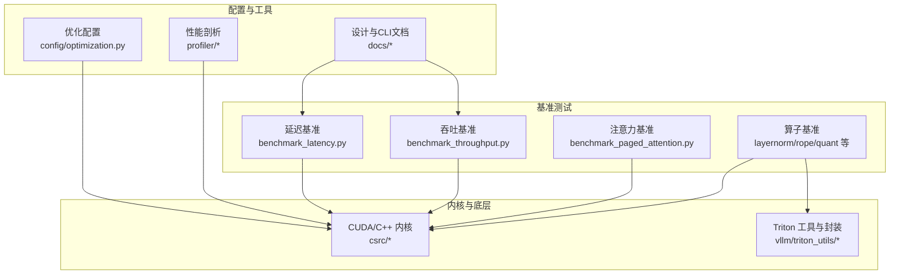
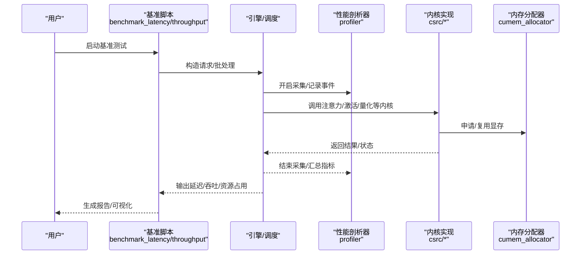
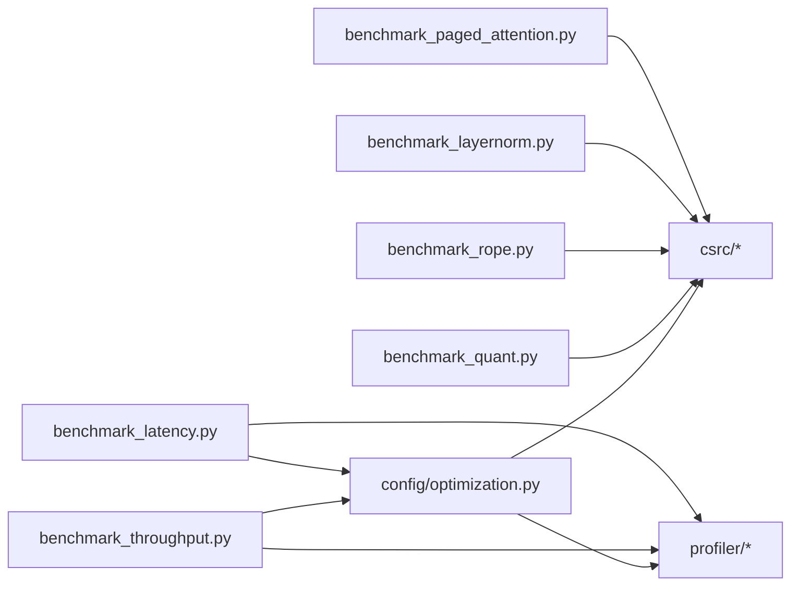

# 性能优化开发

<cite>
**本文引用的文件**   
- [benchmarks/README.md](file://benchmarks/README.md)
- [benchmarks/benchmark_latency.py](file://benchmarks/benchmark_latency.py)
- [benchmarks/benchmark_throughput.py](file://benchmarks/benchmark_throughput.py)
- [benchmarks/kernels/benchmark_paged_attention.py](file://benchmarks/kernels/benchmark_paged_attention.py)
- [benchmarks/kernels/benchmark_layernorm.py](file://benchmarks/kernels/benchmark_layernorm.py)
- [benchmarks/kernels/benchmark_rope.py](file://benchmarks/kernels/benchmark_rope.py)
- [benchmarks/kernels/benchmark_quant.py](file://benchmarks/kernels/benchmark_quant.py)
- [benchmarks/fused_kernels/layernorm_rms_benchmarks.py](file://benchmarks/fused_kernels/layernorm_rms_benchmarks.py)
- [benchmarks/cutlass_benchmarks/w8a8_benchmarks.py](file://benchmarks/cutlass_benchmarks/w8a8_benchmarks.py)
- [vllm/profiler/__init__.py](file://vllm/profiler/__init__.py)
- [vllm/profiler/profiler.py](file://vllm/profiler/profiler.py)
- [vllm/config/optimization.py](file://vllm/config/optimization.py)
- [vllm/device_allocator/cumem_allocator.py](file://vllm/device_allocator/cumem_allocator.py)
- [csrc/cuda_utils.h](file://csrc/cuda_utils.h)
- [csrc/cache.h](file://csrc/cache.h)
- [csrc/custom_all_reduce.cuh](file://csrc/custom_all_reduce.cuh)
- [csrc/custom_quickreduce.cu](file://csrc/custom_quickreduce.cu)
- [scripts/autotune_helion_kernels.py](file://scripts/autotune_helion_kernels.py)
- [scripts/benchmark_helion_kernels.py](file://scripts/benchmark_helion_kernels.py)
- [docs/benchmarking/cli.md](file://docs/benchmarking/cli.md)
- [docs/configuration/optimization.md](file://docs/configuration/optimization.md)
- [docs/design/cuda_graphs.md](file://docs/design/cuda_graphs.md)
- [docs/design/torch_compile.md](file://docs/design/torch_compile.md)
- [docs/design/prefix_caching.md](file://docs/design/prefix_caching.md)
- [docs/design/hybrid_kv_cache_manager.md](file://docs/design/hybrid_kv_cache_manager.md)
- [examples/features/profiling/profiling_example.py](file://examples/features/profiling/profiling_example.py)
</cite>

## 目录
1. [引言](#引言)
2. [项目结构](#项目结构)
3. [核心组件](#核心组件)
4. [架构总览](#架构总览)
5. [详细组件分析](#详细组件分析)
6. [依赖关系分析](#依赖关系分析)
7. [性能考量](#性能考量)
8. [故障排查指南](#故障排查指南)
9. [结论](#结论)
10. [附录](#附录)

## 引言
本指南面向希望在 vLLM 代码库中进行性能优化的工程师与研究者，覆盖从性能分析与瓶颈识别、CPU/GPU 工具使用、CUDA/Triton 内核优化、模型量化与编译优化、基准测试构建与运行、内存与缓存策略、并行通信优化到端到端系统级调优的完整流程。文档以仓库内现有实现为依据，提供可操作的步骤、图示与参考路径，帮助读者快速定位关键优化点并落地实践。

## 项目结构
vLLM 在性能相关方面形成了“基准测试 + 内核实现 + 配置与工具”三位一体的结构：
- 基准测试层：位于 benchmarks/ 与 tests/benchmarks/，提供延迟、吞吐、注意力、量化、MoE、RMSNorm、RoPE 等广泛场景的基准脚本。
- 内核与底层实现：csrc/ 下包含 CUDA/C++/Triton 相关的内核与工具头文件；vllm/kernels/ 与 vllm/triton_utils/ 提供 Python 侧封装与调度。
- 配置与工具：vllm/config/optimization.py 提供优化开关；vllm/profiler/ 提供性能剖析能力；docs/ 提供 CLI 与设计文档。

图表来源
- [benchmarks/benchmark_latency.py:1-100](file://benchmarks/benchmark_latency.py#L1-L100)
- [benchmarks/benchmark_throughput.py:1-100](file://benchmarks/benchmark_throughput.py#L1-L100)
- [benchmarks/kernels/benchmark_paged_attention.py:1-100](file://benchmarks/kernels/benchmark_paged_attention.py#L1-L100)
- [benchmarks/kernels/benchmark_layernorm.py:1-100](file://benchmarks/kernels/benchmark_layernorm.py#L1-L100)
- [benchmarks/kernels/benchmark_rope.py:1-100](file://benchmarks/kernels/benchmark_rope.py#L1-L100)
- [benchmarks/kernels/benchmark_quant.py:1-100](file://benchmarks/kernels/benchmark_quant.py#L1-L100)
- [vllm/config/optimization.py:1-100](file://vllm/config/optimization.py#L1-L100)
- [vllm/profiler/__init__.py:1-100](file://vllm/profiler/__init__.py#L1-L100)
- [vllm/profiler/profiler.py:1-100](file://vllm/profiler/profiler.py#L1-L100)

章节来源
- [benchmarks/README.md:1-200](file://benchmarks/README.md#L1-L200)
- [docs/benchmarking/cli.md:1-200](file://docs/benchmarking/cli.md#L1-L200)

## 核心组件
- 性能剖析器（Profiler）
  - 提供统一的性能采集入口，支持事件埋点、时间线统计与导出，便于定位热点函数与同步点。
  - 典型用法：在推理或训练的关键阶段开启/关闭采集，结合命令行参数输出报告。
- 优化配置（Optimization Config）
  - 集中管理 CUDA Graph、Torch Compile、KV Cache、量化、注意力后端等开关，影响运行时行为与性能。
- 设备内存分配器（cuMem Allocator）
  - 针对 GPU 显存的分配策略与碎片控制，减少分配开销与提升复用率。
- 内核与工具头（CUDA/C++/Triton）
  - csrc 下的通用工具头与内核接口，配合 Python 侧封装形成高性能计算路径。

章节来源
- [vllm/profiler/__init__.py:1-100](file://vllm/profiler/__init__.py#L1-L100)
- [vllm/profiler/profiler.py:1-100](file://vllm/profiler/profiler.py#L1-L100)
- [vllm/config/optimization.py:1-100](file://vllm/config/optimization.py#L1-L100)
- [vllm/device_allocator/cumem_allocator.py:1-100](file://vllm/device_allocator/cumem_allocator.py#L1-L100)
- [csrc/cuda_utils.h:1-100](file://csrc/cuda_utils.h#L1-L100)

## 架构总览
下图展示从基准测试到内核执行与配置/剖析的调用链，体现“测试驱动优化”的闭环。

图表来源
- [benchmarks/benchmark_latency.py:1-100](file://benchmarks/benchmark_latency.py#L1-L100)
- [benchmarks/benchmark_throughput.py:1-100](file://benchmarks/benchmark_throughput.py#L1-L100)
- [vllm/profiler/profiler.py:1-100](file://vllm/profiler/profiler.py#L1-L100)
- [csrc/cuda_utils.h:1-100](file://csrc/cuda_utils.h#L1-L100)
- [vllm/device_allocator/cumem_allocator.py:1-100](file://vllm/device_allocator/cumem_allocator.py#L1-L100)

## 详细组件分析

### 性能分析与瓶颈识别
- CPU/GPU 工具
  - 使用系统级与厂商工具进行采样与火焰图分析，定位热点函数、内存带宽瓶颈与同步等待。
  - 在 vLLM 中，建议先通过 profiler 获取高层时间线，再结合外部工具深入内核细节。
- 剖析器使用要点
  - 在推理前/后开启采集，避免引入过大开销；对关键路径（如注意力、MoE、量化）单独埋点。
  - 导出结构化数据，结合时序与调用栈定位热点。

章节来源
- [vllm/profiler/profiler.py:1-100](file://vllm/profiler/profiler.py#L1-L100)
- [examples/features/profiling/profiling_example.py:1-100](file://examples/features/profiling/profiling_example.py#L1-L100)

### CUDA 内核优化方法
- 内存访问模式
  - 优先合并访问、对齐与连续布局，减少 bank conflict 与跨线程束访问。
  - 利用共享内存做 tile 化读写，降低全局内存带宽压力。
- 计算优化
  - 使用寄存器重排、指令融合、向量化与半精度/FP8 加速，提高算术强度。
  - 合理设置 launch bounds 与 warp-level primitives，提升 SM 利用率。
- 参考实现位置
  - csrc 下的 attention、layernorm、pos_encoding、cache 等内核为典型优化样例。

章节来源
- [csrc/cuda_utils.h:1-100](file://csrc/cuda_utils.h#L1-L100)
- [csrc/cache.h:1-100](file://csrc/cache.h#L1-L100)

### Triton 内核开发与优化技巧
- 开发流程
  - 使用 Triton 编写 kernel，结合 autotuner 自动搜索最优 block size、num_warps、num_stages 等超参。
  - 将 Triton kernel 与 Python 侧封装集成，便于在 vLLM 中直接调用。
- 优化要点
  - 控制访存步长与分块大小，避免越界与冗余计算；合理使用 epilogue fusion 减少中间存储。
  - 借助 benchmark 脚本对比不同配置的性能，选择稳定且高效的组合。

章节来源
- [scripts/autotune_helion_kernels.py:1-100](file://scripts/autotune_helion_kernels.py#L1-L100)
- [scripts/benchmark_helion_kernels.py:1-100](file://scripts/benchmark_helion_kernels.py#L1-L100)

### 模型量化与编译优化
- 量化
  - 支持 W8A8、INT8、FP8 等格式，结合 per-token/per-channel 缩放策略，平衡精度与速度。
  - 量化内核与算子融合可减少转换开销，提升整体吞吐。
- 编译优化
  - Torch Compile 与 CUDA Graph 能显著降低 Python 开销与内核启动成本，需关注图构建稳定性与动态形状兼容。
  - 通过配置开关按需启用，并在基准中验证收益。

章节来源
- [benchmarks/cutlass_benchmarks/w8a8_benchmarks.py:1-100](file://benchmarks/cutlass_benchmarks/w8a8_benchmarks.py#L1-L100)
- [benchmarks/kernels/benchmark_quant.py:1-100](file://benchmarks/kernels/benchmark_quant.py#L1-L100)
- [docs/design/torch_compile.md:1-200](file://docs/design/torch_compile.md#L1-L200)
- [docs/design/cuda_graphs.md:1-200](file://docs/design/cuda_graphs.md#L1-L200)
- [vllm/config/optimization.py:1-100](file://vllm/config/optimization.py#L1-L100)

### 基准测试的开发与运行
- 设计原则
  - 明确目标（延迟/吞吐/资源），固定输入分布与随机种子，确保可重复性。
  - 预热、多次迭代、剔除冷启动，统计 P50/P95/P99 与均值方差。
- 常用脚本
  - 延迟基准：benchmark_latency.py
  - 吞吐基准：benchmark_throughput.py
  - 注意力与算子：kernels 目录下各 benchmark_* 文件
- 运行方式
  - 通过 CLI 或 Python API 传入批大小、序列长度、后端与量化选项，输出指标与可选可视化。

章节来源
- [benchmarks/benchmark_latency.py:1-100](file://benchmarks/benchmark_latency.py#L1-L100)
- [benchmarks/benchmark_throughput.py:1-100](file://benchmarks/benchmark_throughput.py#L1-L100)
- [benchmarks/kernels/benchmark_paged_attention.py:1-100](file://benchmarks/kernels/benchmark_paged_attention.py#L1-L100)
- [benchmarks/kernels/benchmark_layernorm.py:1-100](file://benchmarks/kernels/benchmark_layernorm.py#L1-L100)
- [benchmarks/kernels/benchmark_rope.py:1-100](file://benchmarks/kernels/benchmark_rope.py#L1-L100)
- [benchmarks/kernels/benchmark_quant.py:1-100](file://benchmarks/kernels/benchmark_quant.py#L1-L100)
- [docs/benchmarking/cli.md:1-200](file://docs/benchmarking/cli.md#L1-L200)

### 内存使用优化与缓存策略
- 显存分配
  - 使用 cuMem 分配器与池化策略，减少频繁分配带来的碎片与同步开销。
- KV Cache
  - 采用分页式 KV Cache、前缀缓存与混合管理器，提升复用率与降低峰值显存。
- 策略选择
  - 根据工作负载调整 watermark、block size、reuse 阈值，平衡命中率与延迟。

章节来源
- [vllm/device_allocator/cumem_allocator.py:1-100](file://vllm/device_allocator/cumem_allocator.py#L1-L100)
- [docs/design/prefix_caching.md:1-200](file://docs/design/prefix_caching.md#L1-L200)
- [docs/design/hybrid_kv_cache_manager.md:1-200](file://docs/design/hybrid_kv_cache_manager.md#L1-L200)
- [csrc/cache.h:1-100](file://csrc/cache.h#L1-L100)

### 并行计算与通信优化
- 并行策略
  - 张量并行、流水线并行与专家并行（MoE）的组合，需关注负载均衡与通信开销。
- 通信内核
  - 自定义 AllReduce/QuickReduce 内核减少拷贝与同步，提升多卡扩展效率。
- 评估方法
  - 通过分布式基准与通信 benchmark 验证 scaling 曲线与瓶颈节点。

章节来源
- [csrc/custom_all_reduce.cuh:1-100](file://csrc/custom_all_reduce.cuh#L1-L100)
- [csrc/custom_quickreduce.cu:1-100](file://csrc/custom_quickreduce.cu#L1-L100)

### 端到端性能优化示例
- 简单算法优化
  - 以 RMSNorm/LayerNorm 为例：通过 fused kernel 与内存合并访问，减少中间缓冲与访存次数。
- 复杂系统级调优
  - 结合 CUDA Graph、Torch Compile、KV Cache 前缀命中与量化，逐步消除 Python 开销与内存瓶颈，最终达到高吞吐低延迟。

章节来源
- [benchmarks/fused_kernels/layernorm_rms_benchmarks.py:1-100](file://benchmarks/fused_kernels/layernorm_rms_benchmarks.py#L1-L100)
- [benchmarks/kernels/benchmark_layernorm.py:1-100](file://benchmarks/kernels/benchmark_layernorm.py#L1-L100)
- [docs/design/cuda_graphs.md:1-200](file://docs/design/cuda_graphs.md#L1-L200)
- [docs/design/torch_compile.md:1-200](file://docs/design/torch_compile.md#L1-L200)
- [docs/design/prefix_caching.md:1-200](file://docs/design/prefix_caching.md#L1-L200)

## 依赖关系分析
下图展示基准脚本与内核、配置、剖析器的依赖关系，帮助理解优化影响的传播路径。

图表来源
- [benchmarks/benchmark_latency.py:1-100](file://benchmarks/benchmark_latency.py#L1-L100)
- [benchmarks/benchmark_throughput.py:1-100](file://benchmarks/benchmark_throughput.py#L1-L100)
- [benchmarks/kernels/benchmark_paged_attention.py:1-100](file://benchmarks/kernels/benchmark_paged_attention.py#L1-L100)
- [benchmarks/kernels/benchmark_layernorm.py:1-100](file://benchmarks/kernels/benchmark_layernorm.py#L1-L100)
- [benchmarks/kernels/benchmark_rope.py:1-100](file://benchmarks/kernels/benchmark_rope.py#L1-L100)
- [benchmarks/kernels/benchmark_quant.py:1-100](file://benchmarks/kernels/benchmark_quant.py#L1-L100)
- [vllm/config/optimization.py:1-100](file://vllm/config/optimization.py#L1-L100)
- [vllm/profiler/profiler.py:1-100](file://vllm/profiler/profiler.py#L1-L100)
- [csrc/cuda_utils.h:1-100](file://csrc/cuda_utils.h#L1-L100)

章节来源
- [benchmarks/README.md:1-200](file://benchmarks/README.md#L1-L200)
- [docs/benchmarking/cli.md:1-200](file://docs/benchmarking/cli.md#L1-L200)

## 性能考量
- 测量一致性
  - 固定硬件与环境，预热足够轮次，剔除异常值，报告置信区间。
- 热点优先级
  - 先解决占时最长与最频繁的热点，再考虑次要路径。
- 权衡取舍
  - 量化与图优化可能带来稳定性与兼容性成本，需在基准中验证。
- 可扩展性
  - 多卡场景下关注通信占比与负载均衡，避免单点瓶颈。

[本节为通用指导，不直接分析具体文件]

## 故障排查指南
- 常见问题
  - CUDA Graph 构建失败：检查动态形状与不支持的操作，回退到 eager 模式定位问题。
  - 量化精度下降：核对缩放因子与数据类型转换路径，必要时回退至更高精度。
  - 内存泄漏/碎片：监控显存增长趋势，检查临时对象释放与分配器策略。
- 诊断手段
  - 使用 profiler 导出时间线与事件，结合外部工具查看内核耗时与内存访问模式。
  - 通过最小复现用例隔离问题，逐步启用/禁用优化开关定位根因。

章节来源
- [vllm/profiler/profiler.py:1-100](file://vllm/profiler/profiler.py#L1-L100)
- [examples/features/profiling/profiling_example.py:1-100](file://examples/features/profiling/profiling_example.py#L1-L100)

## 结论
通过在 vLLM 中系统化地应用性能剖析、内核优化、量化与编译技术，并结合完善的基准测试与内存/缓存策略，可以显著提升推理延迟与吞吐。建议以“基准驱动”的方式持续迭代，确保每次优化都有可衡量的收益与稳定的质量保障。

[本节为总结性内容，不直接分析具体文件]

## 附录
- 实用命令与参考
  - 使用 CLI 运行延迟/吞吐基准，详见 docs/benchmarking/cli.md。
  - 查阅优化配置项与默认值，详见 docs/configuration/optimization.md。
  - 了解 CUDA Graph 与 Torch Compile 的设计与限制，详见对应设计文档。

章节来源
- [docs/benchmarking/cli.md:1-200](file://docs/benchmarking/cli.md#L1-L200)
- [docs/configuration/optimization.md:1-200](file://docs/configuration/optimization.md#L1-L200)
- [docs/design/cuda_graphs.md:1-200](file://docs/design/cuda_graphs.md#L1-L200)
- [docs/design/torch_compile.md:1-200](file://docs/design/torch_compile.md#L1-L200)