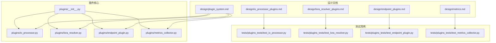
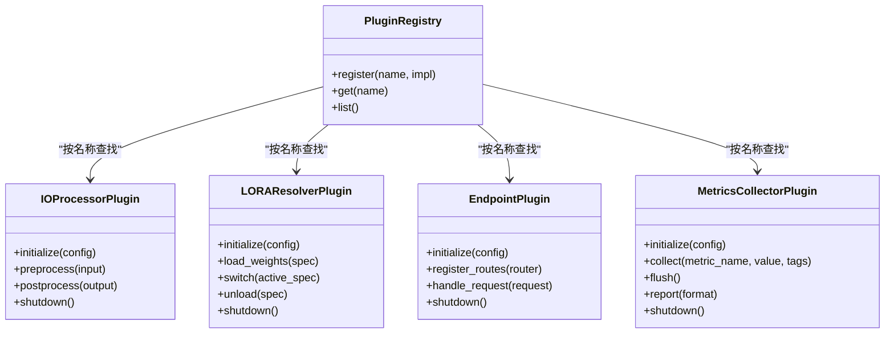
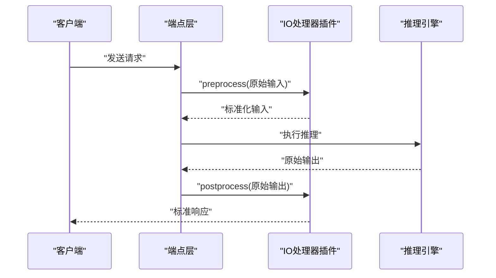
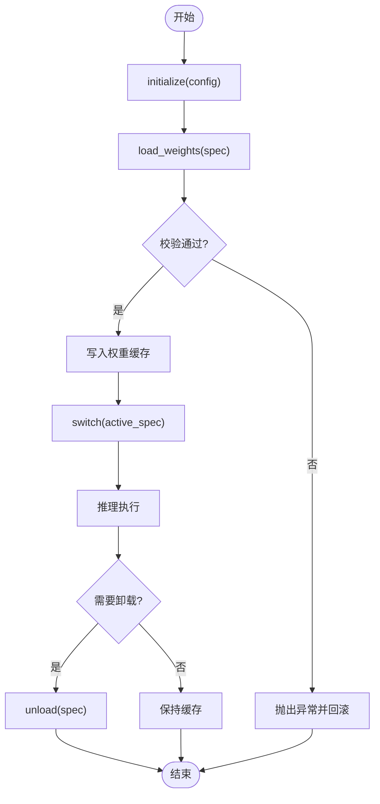
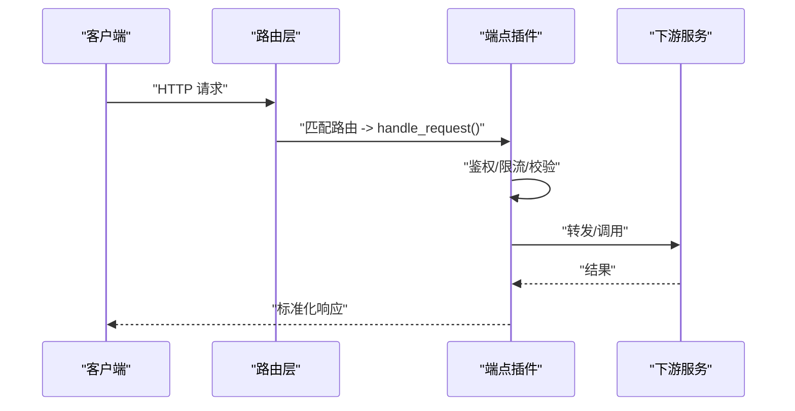
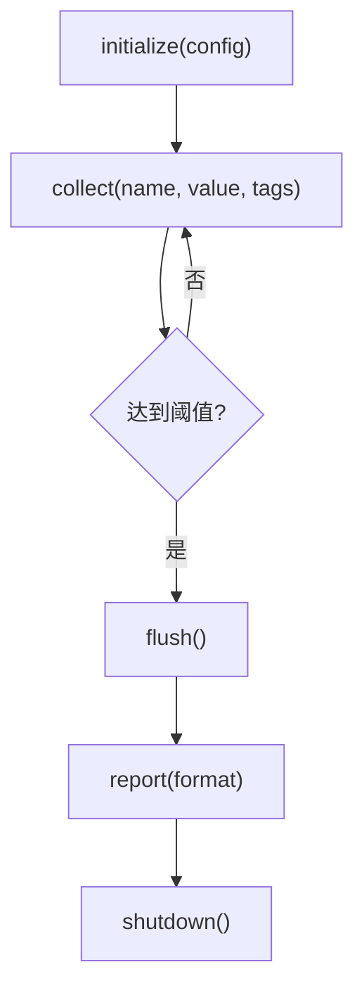
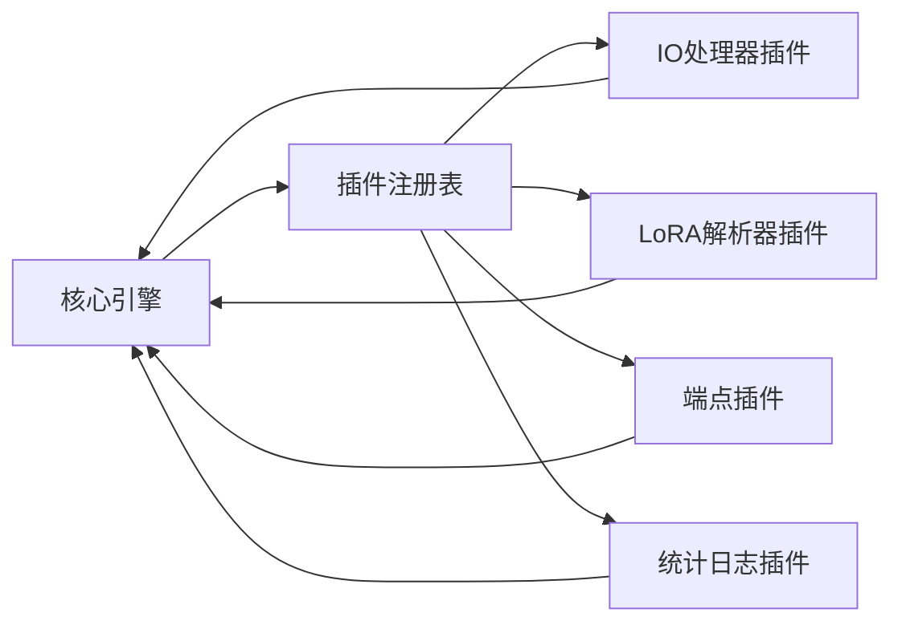

# 插件开发指南

<cite>
**本文档引用的文件**   
- [vllm/plugins/__init__.py](file://vllm/plugins/__init__.py)
- [vllm/plugins/io_processor.py](file://vllm/plugins/io_processor.py)
- [vllm/plugins/lora_resolver.py](file://vllm/plugins/lora_resolver.py)
- [vllm/plugins/endpoint_plugin.py](file://vllm/plugins/endpoint_plugin.py)
- [vllm/plugins/metrics_collector.py](file://vllm/plugins/metrics_collector.py)
- [docs/design/plugin_system.md](file://docs/design/plugin_system.md)
- [docs/design/io_processor_plugins.md](file://docs/design/io_processor_plugins.md)
- [docs/design/lora_resolver_plugins.md](file://docs/design/lora_resolver_plugins.md)
- [docs/design/endpoint_plugins.md](file://docs/design/endpoint_plugins.md)
- [docs/design/metrics.md](file://docs/design/metrics.md)
- [tests/plugins_tests/test_io_processor.py](file://tests/plugins_tests/test_io_processor.py)
- [tests/plugins_tests/test_lora_resolver.py](file://tests/plugins_tests/test_lora_resolver.py)
- [tests/plugins_tests/test_endpoint_plugin.py](file://tests/plugins_tests/test_endpoint_plugin.py)
- [tests/plugins_tests/test_metrics_collector.py](file://tests/plugins_tests/test_metrics_collector.py)
</cite>

## 目录
1. [简介](#简介)
2. [项目结构](#项目结构)
3. [核心组件](#核心组件)
4. [架构总览](#架构总览)
5. [详细组件分析](#详细组件分析)
6. [依赖关系分析](#依赖关系分析)
7. [性能考虑](#性能考虑)
8. [故障排查指南](#故障排查指南)
9. [结论](#结论)
10. [附录](#附录)

## 简介
本指南面向希望在 vLLM 中开发插件的工程师，覆盖插件系统整体设计、生命周期管理以及四类关键插件的开发方法：自定义 IO 处理器、LoRA 解析器、端点插件与统计日志插件。文档同时给出打包分发与安装机制、版本管理与兼容性策略，并提供从简单数据处理到复杂业务逻辑的完整示例路径指引。

## 项目结构
vLLM 的插件体系集中在 vllm/plugins 目录下，并通过统一的注册与发现机制暴露给引擎与运行时。设计文档位于 docs/design 下，测试用例位于 tests/plugins_tests 下，便于参考实现与行为约束。

图表来源
- [vllm/plugins/__init__.py](file://vllm/plugins/__init__.py)
- [vllm/plugins/io_processor.py](file://vllm/plugins/io_processor.py)
- [vllm/plugins/lora_resolver.py](file://vllm/plugins/lora_resolver.py)
- [vllm/plugins/endpoint_plugin.py](file://vllm/plugins/endpoint_plugin.py)
- [vllm/plugins/metrics_collector.py](file://vllm/plugins/metrics_collector.py)
- [docs/design/plugin_system.md](file://docs/design/plugin_system.md)
- [docs/design/io_processor_plugins.md](file://docs/design/io_processor_plugins.md)
- [docs/design/lora_resolver_plugins.md](file://docs/design/lora_resolver_plugins.md)
- [docs/design/endpoint_plugins.md](file://docs/design/endpoint_plugins.md)
- [docs/design/metrics.md](file://docs/design/metrics.md)
- [tests/plugins_tests/test_io_processor.py](file://tests/plugins_tests/test_io_processor.py)
- [tests/plugins_tests/test_lora_resolver.py](file://tests/plugins_tests/test_lora_resolver.py)
- [tests/plugins_tests/test_endpoint_plugin.py](file://tests/plugins_tests/test_endpoint_plugin.py)
- [tests/plugins_tests/test_metrics_collector.py](file://tests/plugins_tests/test_metrics_collector.py)

章节来源
- [docs/design/plugin_system.md](file://docs/design/plugin_system.md)

## 核心组件
- IO 处理器插件：负责输入输出格式的标准化与转换，屏蔽上游数据源差异，为推理管线提供统一的数据契约。
- LoRA 解析器插件：负责 LoRA 权重的加载、校验与动态切换，支持多权重组合与热更新。
- 端点插件：扩展 API 路由与请求处理流程，允许在不侵入核心服务的前提下新增或改写接口行为。
- 统计日志插件：采集指标与事件，聚合生成报告，支撑可观测性与运维告警。

章节来源
- [vllm/plugins/io_processor.py](file://vllm/plugins/io_processor.py)
- [vllm/plugins/lora_resolver.py](file://vllm/plugins/lora_resolver.py)
- [vllm/plugins/endpoint_plugin.py](file://vllm/plugins/endpoint_plugin.py)
- [vllm/plugins/metrics_collector.py](file://vllm/plugins/metrics_collector.py)

## 架构总览
插件系统采用“定义接口 + 注册发现 + 生命周期钩子”的模式。各插件通过统一入口进行声明式注册，运行时在合适的阶段调用其生命周期方法，完成初始化、预热、执行与销毁。

图表来源
- [vllm/plugins/__init__.py](file://vllm/plugins/__init__.py)
- [vllm/plugins/io_processor.py](file://vllm/plugins/io_processor.py)
- [vllm/plugins/lora_resolver.py](file://vllm/plugins/lora_resolver.py)
- [vllm/plugins/endpoint_plugin.py](file://vllm/plugins/endpoint_plugin.py)
- [vllm/plugins/metrics_collector.py](file://vllm/plugins/metrics_collector.py)

## 详细组件分析

### IO 处理器插件
职责与边界
- 输入预处理：将不同来源的请求体（文本、图像、音频等）转换为模型期望的内部表示。
- 输出后处理：将模型输出解码为标准格式（如 OpenAI 兼容结构），并附加元数据。
- 错误与降级：对非法输入返回明确错误码；在资源紧张时启用降级策略。

生命周期
- initialize：读取配置、建立缓存或连接。
- preprocess/postprocess：无状态或轻量有状态处理，保证线程安全。
- shutdown：释放资源。

图表来源
- [vllm/plugins/io_processor.py](file://vllm/plugins/io_processor.py)
- [docs/design/io_processor_plugins.md](file://docs/design/io_processor_plugins.md)

开发与集成要点
- 输入校验：类型、长度、字段完整性检查，失败快速返回。
- 批量优化：合并小请求、复用临时缓冲区。
- 可观测性：埋点记录耗时与错误率。

章节来源
- [vllm/plugins/io_processor.py](file://vllm/plugins/io_processor.py)
- [docs/design/io_processor_plugins.md](file://docs/design/io_processor_plugins.md)
- [tests/plugins_tests/test_io_processor.py](file://tests/plugins_tests/test_io_processor.py)

### LoRA 解析器插件
职责与边界
- 权重加载：从本地或远程存储加载 LoRA 权重，校验形状与精度。
- 动态切换：在运行期切换激活的 LoRA 集，保证并发安全与一致性。
- 卸载与回收：按需卸载未使用权重，降低显存占用。

生命周期
- initialize：解析配置、建立权重索引。
- load_weights：加载指定规格权重，构建映射表。
- switch：原子切换激活集合，必要时做内存重排。
- unload：释放指定权重。
- shutdown：清理全局状态。

图表来源
- [vllm/plugins/lora_resolver.py](file://vllm/plugins/lora_resolver.py)
- [docs/design/lora_resolver_plugins.md](file://docs/design/lora_resolver_plugins.md)

开发与集成要点
- 并发控制：读写锁保护权重映射表。
- 版本兼容：权重 schema 版本检测与迁移。
- 性能：预取与懒加载结合，避免冷启动抖动。

章节来源
- [vllm/plugins/lora_resolver.py](file://vllm/plugins/lora_resolver.py)
- [docs/design/lora_resolver_plugins.md](file://docs/design/lora_resolver_plugins.md)
- [tests/plugins_tests/test_lora_resolver.py](file://tests/plugins_tests/test_lora_resolver.py)

### 端点插件
职责与边界
- 路由注册：向 HTTP 框架注册新路径与处理方法。
- 请求处理：鉴权、限流、参数校验、转发与响应封装。
- 中间件能力：插入通用横切逻辑（如审计、追踪）。

生命周期
- initialize：解析配置、准备上下文。
- register_routes：绑定路由与处理器。
- handle_request：处理单个请求。
- shutdown：关闭监听器、释放资源。

图表来源
- [vllm/plugins/endpoint_plugin.py](file://vllm/plugins/endpoint_plugin.py)
- [docs/design/endpoint_plugins.md](file://docs/design/endpoint_plugins.md)

开发与集成要点
- 幂等与安全：严格校验输入，防止注入与越权。
- 超时与重试：合理设置超时与退避策略。
- 可插拔：通过配置开关启用/禁用特定端点。

章节来源
- [vllm/plugins/endpoint_plugin.py](file://vllm/plugins/endpoint_plugin.py)
- [docs/design/endpoint_plugins.md](file://docs/design/endpoint_plugins.md)
- [tests/plugins_tests/test_endpoint_plugin.py](file://tests/plugins_tests/test_endpoint_plugin.py)

### 统计日志插件
职责与边界
- 指标采集：计数、直方图、仪表盘指标上报。
- 事件记录：关键操作与异常事件持久化。
- 报告生成：定时汇总与导出（Prometheus、日志、文件等）。

生命周期
- initialize：初始化后端（内存/外部系统）、配置采样率。
- collect：增量记录指标与标签。
- flush：批量刷新至后端。
- report：生成可读报告（JSON/CSV/Prometheus 文本）。
- shutdown：关闭连接与缓冲。

图表来源
- [vllm/plugins/metrics_collector.py](file://vllm/plugins/metrics_collector.py)
- [docs/design/metrics.md](file://docs/design/metrics.md)

开发与集成要点
- 低开销：异步落盘、批量化上报。
- 高可用：后端不可用时的降级与重试。
- 可观测：内置健康检查与自监控。

章节来源
- [vllm/plugins/metrics_collector.py](file://vllm/plugins/metrics_collector.py)
- [docs/design/metrics.md](file://docs/design/metrics.md)
- [tests/plugins_tests/test_metrics_collector.py](file://tests/plugins_tests/test_metrics_collector.py)

## 依赖关系分析
插件之间通过注册表解耦，核心引擎仅依赖抽象接口。以下为典型依赖关系示意：

图表来源
- [vllm/plugins/__init__.py](file://vllm/plugins/__init__.py)
- [vllm/plugins/io_processor.py](file://vllm/plugins/io_processor.py)
- [vllm/plugins/lora_resolver.py](file://vllm/plugins/lora_resolver.py)
- [vllm/plugins/endpoint_plugin.py](file://vllm/plugins/endpoint_plugin.py)
- [vllm/plugins/metrics_collector.py](file://vllm/plugins/metrics_collector.py)

章节来源
- [vllm/plugins/__init__.py](file://vllm/plugins/__init__.py)

## 性能考虑
- IO 处理器：尽量无拷贝转换，使用零拷贝视图；批量合并减少函数调用开销。
- LoRA 解析器：权重分块加载、延迟初始化、LRU 缓存；切换时使用原子指针交换。
- 端点插件：连接池复用、超时短路、异步 I/O；避免阻塞热点路径。
- 统计日志：采样与聚合、异步队列、背压控制；避免高频写放大。

[本节为通用指导，不直接分析具体文件]

## 故障排查指南
常见问题与定位步骤
- 插件未加载：检查注册名是否重复、模块导入路径是否正确、配置文件键名是否一致。
- IO 转换失败：核对输入 schema 与必填字段，查看预处理阶段的断言与异常堆栈。
- LoRA 切换失败：确认权重版本与模型头信息匹配，检查显存不足与锁竞争日志。
- 端点 4xx/5xx：审查鉴权规则、限流阈值、下游超时与重试策略。
- 指标缺失：确认采集开关、采样率与后端连通性，检查 flush 周期。

建议的调试手段
- 开启详细日志级别，过滤插件命名空间。
- 使用单元测试与最小复现用例隔离问题。
- 借助性能剖析工具定位热点与锁争用。

章节来源
- [tests/plugins_tests/test_io_processor.py](file://tests/plugins_tests/test_io_processor.py)
- [tests/plugins_tests/test_lora_resolver.py](file://tests/plugins_tests/test_lora_resolver.py)
- [tests/plugins_tests/test_endpoint_plugin.py](file://tests/plugins_tests/test_endpoint_plugin.py)
- [tests/plugins_tests/test_metrics_collector.py](file://tests/plugins_tests/test_metrics_collector.py)

## 结论
vLLM 插件系统以清晰的接口与生命周期为核心，配合注册发现机制，使 IO 处理、LoRA 权重管理、API 扩展与可观测性得以模块化与可插拔。遵循本指南的规范与实践，可在不侵入核心代码的前提下快速交付高质量插件，并保障稳定性与性能。

[本节为总结性内容，不直接分析具体文件]

## 附录

### 插件打包、分发与安装
- 打包：将插件模块组织为独立包，包含 __init__.py 与必要的配置模板。
- 分发：通过内部仓库或 PyPI 发布，附带版本与依赖声明。
- 安装：在服务启动前安装依赖包，并在配置中声明插件名与参数。
- 验证：启动后检查注册表是否包含插件，执行冒烟测试用例。

[本节为通用指导，不直接分析具体文件]

### 版本管理与兼容性
- 语义化版本：主版本变更需评估破坏性，次版本增加功能，补丁修复缺陷。
- 向后兼容：保留旧版接口别名与迁移脚本，逐步废弃旧字段。
- 运行时检查：插件启动时校验依赖版本与配置 schema，失败即拒绝加载。
- 灰度发布：通过特性开关与流量比例逐步放量。

[本节为通用指导，不直接分析具体文件]

### 完整开发示例指引
- 简单数据处理插件：参考 IO 处理器插件的最小实现，完成输入校验与输出格式化。
- 复杂业务逻辑插件：基于端点插件扩展鉴权、计费与审计链路，串联下游服务。
- LoRA 动态切换：实现权重缓存与原子切换，结合统计日志插件度量切换耗时与命中率。
- 端到端验证：使用 tests/plugins_tests 下的单测模板构造场景，覆盖正常与异常路径。

章节来源
- [docs/design/io_processor_plugins.md](file://docs/design/io_processor_plugins.md)
- [docs/design/lora_resolver_plugins.md](file://docs/design/lora_resolver_plugins.md)
- [docs/design/endpoint_plugins.md](file://docs/design/endpoint_plugins.md)
- [docs/design/metrics.md](file://docs/design/metrics.md)
- [tests/plugins_tests/test_io_processor.py](file://tests/plugins_tests/test_io_processor.py)
- [tests/plugins_tests/test_lora_resolver.py](file://tests/plugins_tests/test_lora_resolver.py)
- [tests/plugins_tests/test_endpoint_plugin.py](file://tests/plugins_tests/test_endpoint_plugin.py)
- [tests/plugins_tests/test_metrics_collector.py](file://tests/plugins_tests/test_metrics_collector.py)