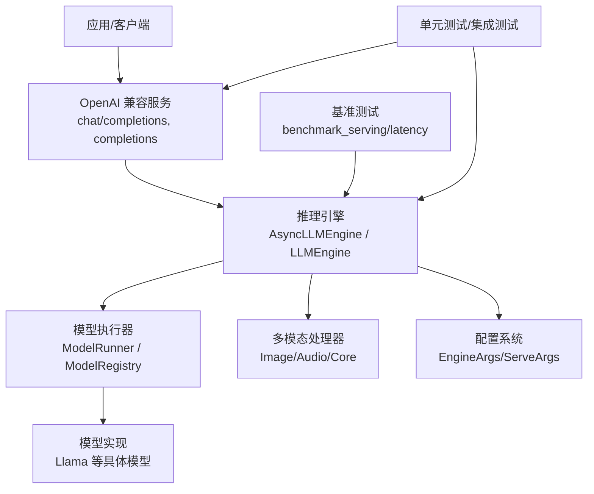
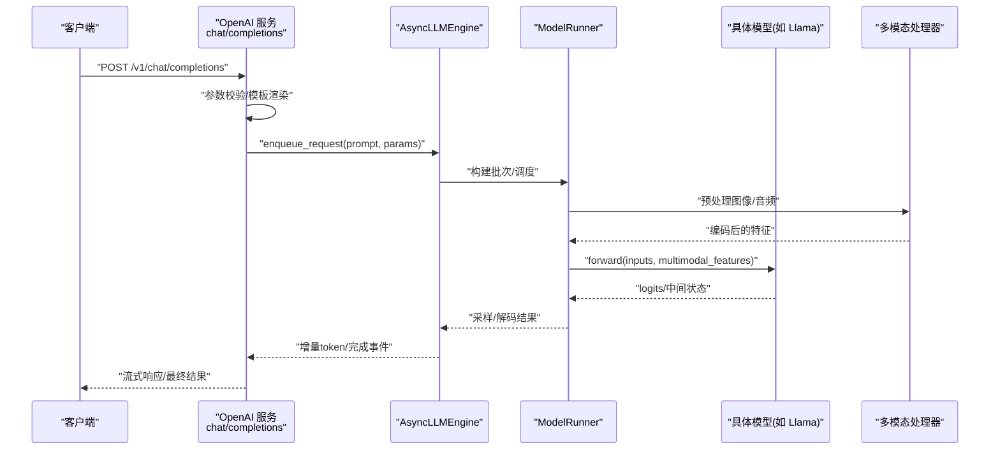
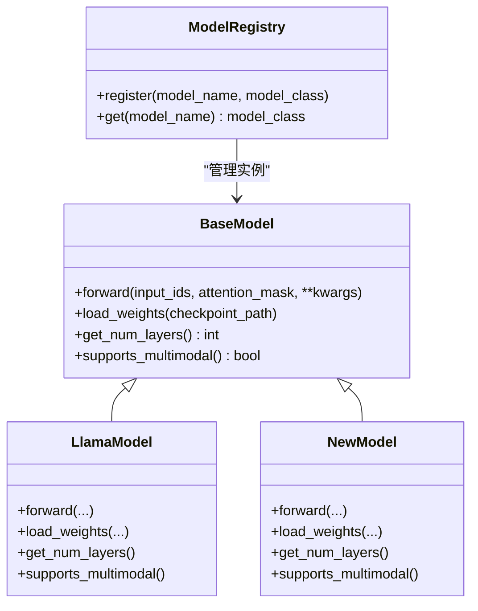
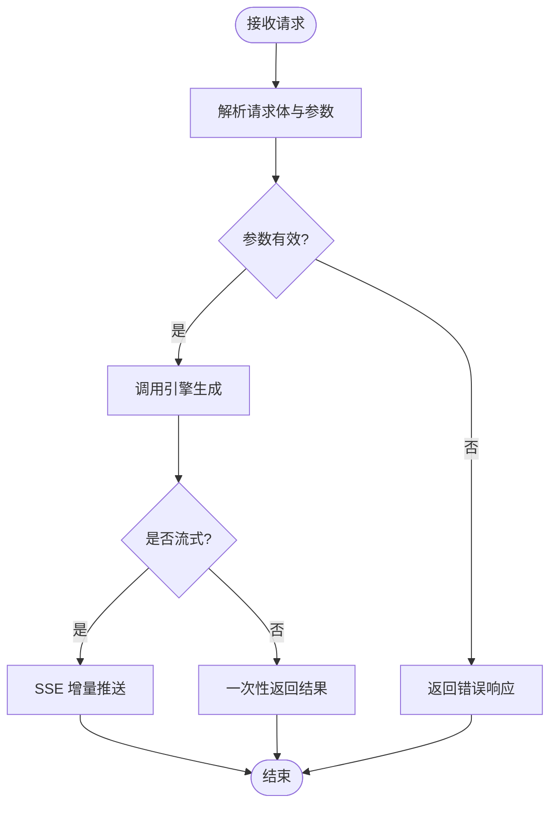
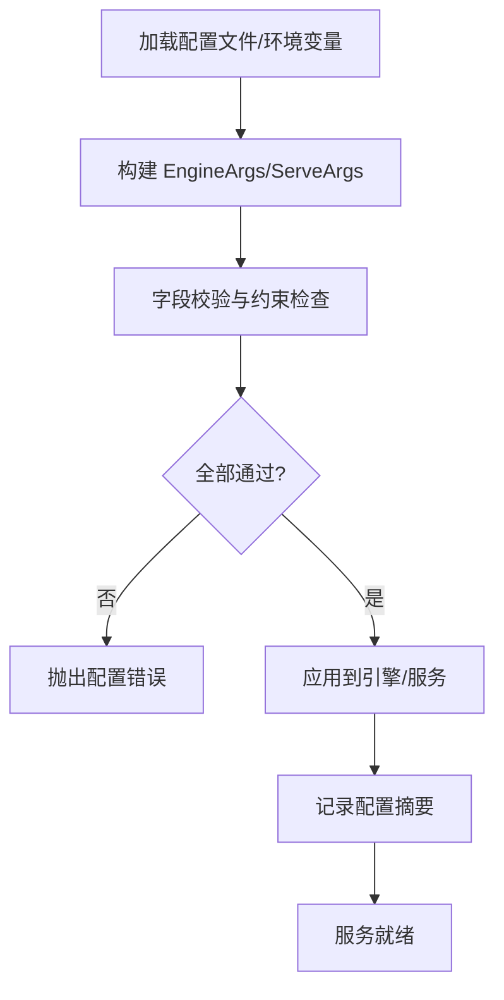
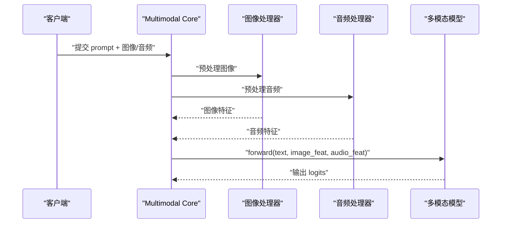
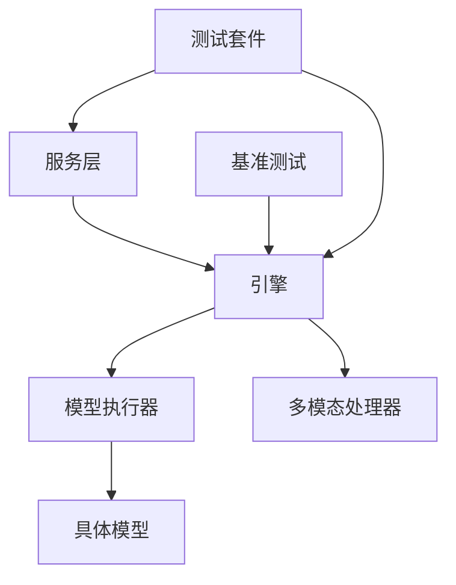

# 新功能开发指南

<cite>
**本文引用的文件**   
- [README.md](file://README.md)
- [pyproject.toml](file://pyproject.toml)
- [setup.py](file://setup.py)
- [vllm/__init__.py](file://vllm/__init__.py)
- [vllm/config/engine_args.py](file://vllm/config/engine_args.py)
- [vllm/config/serve_args.py](file://vllm/config/serve_args.py)
- [vllm/model_executor/models/__init__.py](file://vllm/model_executor/models/__init__.py)
- [vllm/model_executor/models/base.py](file://vllm/model_executor/models/base.py)
- [vllm/model_executor/models/llama.py](file://vllm/model_executor/models/llama.py)
- [vllm/entrypoints/openai/api_server.py](file://vllm/entrypoints/openai/api_server.py)
- [vllm/entrypoints/openai/endpoints/chat.py](file://vllm/entrypoints/openai/endpoints/chat.py)
- [vllm/entrypoints/openai/endpoints/completions.py](file://vllm/entrypoints/openai/endpoints/completions.py)
- [vllm/entrypoints/pooling/api_server.py](file://vllm/entrypoints/pooling/api_server.py)
- [vllm/multimodal/core.py](file://vllm/multimodal/core.py)
- [vllm/multimodal/image.py](file://vllm/multimodal/image.py)
- [vllm/multimodal/audio.py](file://vllm/multimodal/audio.py)
- [vllm/engine/async_llm_engine.py](file://vllm/engine/async_llm_engine.py)
- [vllm/engine/llm_engine.py](file://vllm/engine/llm_engine.py)
- [benchmarks/benchmark_serving.py](file://benchmarks/benchmark_serving.py)
- [benchmarks/benchmark_latency.py](file://benchmarks/benchmark_latency.py)
- [tests/entrypoints/openai/test_chat_completions.py](file://tests/entrypoints/openai/test_chat_completions.py)
- [tests/entrypoints/openai/test_completions.py](file://tests/entrypoints/openai/test_completions.py)
- [tests/v1/test_model_runner_v2.py](file://tests/v1/test_model_runner_v2.py)
- [docs/design/arch_overview.md](file://docs/design/arch_overview.md)
- [docs/configuration/engine_args.md](file://docs/configuration/engine_args.md)
- [docs/configuration/serve_args.md](file://docs/configuration/serve_args.md)
- [docs/features/multimodal_inputs.md](file://docs/features/multimodal_inputs.md)
- [examples/basic/offline_inference/generate.py](file://examples/basic/offline_inference/generate.py)
- [examples/basic/online_serving/server.py](file://examples/basic/online_serving/server.py)
</cite>

## 目录
1. [简介](#简介)
2. [项目结构](#项目结构)
3. [核心组件](#核心组件)
4. [架构总览](#架构总览)
5. [详细组件分析](#详细组件分析)
6. [依赖关系分析](#依赖关系分析)
7. [性能考量](#性能考量)
8. [故障排查指南](#故障排查指南)
9. [结论](#结论)
10. [附录](#附录)

## 简介
本指南面向希望在 vLLM 中新增功能与特性的开发者，覆盖从需求分析、技术选型到模型支持、API 扩展、配置验证、测试与基准、以及重构优化的完整流程。文档以仓库实际代码为依据，提供循序渐进的说明与图示，帮助不同背景的读者快速上手并高质量交付。

## 项目结构
vLLM 采用分层模块化设计：
- 顶层入口与包初始化：定义对外 API、版本信息与关键注册点
- 引擎层：异步与同步推理引擎，负责调度、批处理与执行流
- 模型层：模型注册、基类抽象与各具体模型实现
- 多模态层：图像、音频等输入的统一处理与对齐
- 服务层：OpenAI 兼容接口与自定义端点
- 配置层：引擎参数与服务参数的解析与校验
- 基准与测试：性能基准与单元/集成测试
- 示例与文档：使用示例与设计文档

图表来源
- [vllm/__init__.py](file://vllm/__init__.py)
- [vllm/engine/async_llm_engine.py](file://vllm/engine/async_llm_engine.py)
- [vllm/engine/llm_engine.py](file://vllm/engine/llm_engine.py)
- [vllm/model_executor/models/__init__.py](file://vllm/model_executor/models/__init__.py)
- [vllm/model_executor/models/base.py](file://vllm/model_executor/models/base.py)
- [vllm/model_executor/models/llama.py](file://vllm/model_executor/models/llama.py)
- [vllm/multimodal/core.py](file://vllm/multimodal/core.py)
- [vllm/multimodal/image.py](file://vllm/multimodal/image.py)
- [vllm/multimodal/audio.py](file://vllm/multimodal/audio.py)
- [vllm/config/engine_args.py](file://vllm/config/engine_args.py)
- [vllm/config/serve_args.py](file://vllm/config/serve_args.py)
- [benchmarks/benchmark_serving.py](file://benchmarks/benchmark_serving.py)
- [benchmarks/benchmark_latency.py](file://benchmarks/benchmark_latency.py)

章节来源
- [README.md](file://README.md)
- [pyproject.toml](file://pyproject.toml)
- [setup.py](file://setup.py)

## 核心组件
- 推理引擎（Engine）
  - 异步引擎 AsyncLLMEngine：提供异步请求处理、流式输出、任务编排
  - 同步引擎 LLMEngine：用于离线推理与批量任务
- 模型执行器与注册表（ModelExecutor & Registry）
  - 基类抽象：统一模型接口、权重加载、前向计算
  - 具体模型：如 Llama 系列实现
  - 注册机制：通过包内 __init__ 或显式注册函数将新模型接入
- 多模态处理（Multimodal）
  - 图像、音频等输入类型解析、编码与对齐
  - 与模型前向的融合策略
- 服务层（EntryPoints）
  - OpenAI 兼容接口：chat/completions、completions 等
  - 自定义端点：可扩展新的 HTTP 路由与业务逻辑
- 配置系统（Config）
  - EngineArgs：控制推理行为、并行度、KV Cache、量化等
  - ServeArgs：控制服务端口、并发、日志、监控等

章节来源
- [vllm/engine/async_llm_engine.py](file://vllm/engine/async_llm_engine.py)
- [vllm/engine/llm_engine.py](file://vllm/engine/llm_engine.py)
- [vllm/model_executor/models/base.py](file://vllm/model_executor/models/base.py)
- [vllm/model_executor/models/__init__.py](file://vllm/model_executor/models/__init__.py)
- [vllm/model_executor/models/llama.py](file://vllm/model_executor/models/llama.py)
- [vllm/multimodal/core.py](file://vllm/multimodal/core.py)
- [vllm/multimodal/image.py](file://vllm/multimodal/image.py)
- [vllm/multimodal/audio.py](file://vllm/multimodal/audio.py)
- [vllm/config/engine_args.py](file://vllm/config/engine_args.py)
- [vllm/config/serve_args.py](file://vllm/config/serve_args.py)

## 架构总览
下图展示了从客户端请求到模型执行的端到端流程，包括 OpenAI 兼容接口的调用路径、引擎调度、模型前向与多模态处理的协作。

图表来源
- [vllm/entrypoints/openai/endpoints/chat.py](file://vllm/entrypoints/openai/endpoints/chat.py)
- [vllm/engine/async_llm_engine.py](file://vllm/engine/async_llm_engine.py)
- [vllm/model_executor/models/base.py](file://vllm/model_executor/models/base.py)
- [vllm/multimodal/core.py](file://vllm/multimodal/core.py)

章节来源
- [docs/design/arch_overview.md](file://docs/design/arch_overview.md)

## 详细组件分析

### 模型支持与注册机制
- 目标：为新模型添加支持，使其可被引擎加载与执行
- 步骤概览：
  - 在 models 目录下创建新模型实现文件，继承基类并实现必要接口
  - 在模型包的 __init__.py 中注册新模型名称与类映射
  - 确保权重加载、分词器适配、多模态输入处理正确对接
  - 编写单元测试验证前向一致性与数值稳定性
- 关键点：
  - 基类约定：统一的 forward、load_weights、get_num_layers 等方法
  - 注册表：通过字典映射 model_type -> class，便于动态查找
  - 多模态：若涉及图像/音频，需实现对应的编码器与对齐逻辑

图表来源
- [vllm/model_executor/models/base.py](file://vllm/model_executor/models/base.py)
- [vllm/model_executor/models/llama.py](file://vllm/model_executor/models/llama.py)
- [vllm/model_executor/models/__init__.py](file://vllm/model_executor/models/__init__.py)

章节来源
- [vllm/model_executor/models/base.py](file://vllm/model_executor/models/base.py)
- [vllm/model_executor/models/__init__.py](file://vllm/model_executor/models/__init__.py)
- [vllm/model_executor/models/llama.py](file://vllm/model_executor/models/llama.py)

### API 接口扩展（OpenAI 兼容与自定义端点）
- 目标：扩展 OpenAI 兼容接口或新增自定义端点
- 步骤概览：
  - 在 entrypoints/openai 下新增或修改路由文件（如 chat.py、completions.py）
  - 解析请求体、校验参数、调用引擎生成
  - 对于自定义端点，新增路由与处理器，复用引擎能力
- 关键点：
  - 参数校验：遵循 OpenAI 规范，保证兼容性
  - 流式输出：使用 SSE 或异步迭代返回增量 token
  - 错误处理：统一异常码与消息格式

图表来源
- [vllm/entrypoints/openai/endpoints/chat.py](file://vllm/entrypoints/openai/endpoints/chat.py)
- [vllm/entrypoints/openai/endpoints/completions.py](file://vllm/entrypoints/openai/endpoints/completions.py)
- [vllm/entrypoints/openai/api_server.py](file://vllm/entrypoints/openai/api_server.py)

章节来源
- [vllm/entrypoints/openai/api_server.py](file://vllm/entrypoints/openai/api_server.py)
- [vllm/entrypoints/openai/endpoints/chat.py](file://vllm/entrypoints/openai/endpoints/chat.py)
- [vllm/entrypoints/openai/endpoints/completions.py](file://vllm/entrypoints/openai/endpoints/completions.py)

### 配置选项的添加与验证
- 目标：为引擎或服务新增配置项并确保安全可用
- 步骤概览：
  - 在 engine_args.py 或 serve_args.py 中添加字段与默认值
  - 实现类型检查、范围校验与互斥约束
  - 在启动时打印配置摘要，便于调试
- 关键点：
  - 使用 Pydantic 或类似库进行强类型校验
  - 对敏感参数（如密钥）做脱敏处理
  - 提供环境变量覆盖机制

图表来源
- [vllm/config/engine_args.py](file://vllm/config/engine_args.py)
- [vllm/config/serve_args.py](file://vllm/config/serve_args.py)

章节来源
- [docs/configuration/engine_args.md](file://docs/configuration/engine_args.md)
- [docs/configuration/serve_args.md](file://docs/configuration/serve_args.md)

### 多模态支持开发
- 目标：为文本+图像/音频等多模态模型提供支持
- 步骤概览：
  - 在 multimodal 模块中新增输入类型处理器（如 image.py、audio.py）
  - 实现编码器与特征对齐逻辑
  - 在模型前向中融合多模态特征
- 关键点：
  - 输入标准化：统一图像分辨率、音频采样率等
  - 内存优化：避免重复编码与缓存中间结果
  - 兼容性：与现有引擎批处理与 KV Cache 协同

图表来源
- [vllm/multimodal/core.py](file://vllm/multimodal/core.py)
- [vllm/multimodal/image.py](file://vllm/multimodal/image.py)
- [vllm/multimodal/audio.py](file://vllm/multimodal/audio.py)

章节来源
- [docs/features/multimodal_inputs.md](file://docs/features/multimodal_inputs.md)

### 开发示例：从简单功能到复杂多模态
- 简单功能示例：新增一个自定义 logits processor
  - 在对应目录下实现处理器类，注册到引擎
  - 编写单元测试验证其对概率分布的影响
- 复杂多模态示例：支持图像理解
  - 实现图像编码器与对齐逻辑
  - 在模型前向中注入图像特征
  - 编写端到端测试，覆盖常见场景

章节来源
- [examples/basic/offline_inference/generate.py](file://examples/basic/offline_inference/generate.py)
- [examples/basic/online_serving/server.py](file://examples/basic/online_serving/server.py)

## 依赖关系分析
- 组件耦合：
  - 引擎依赖模型执行器与多模态处理器
  - 服务层依赖引擎与配置系统
  - 基准与测试依赖引擎与服务接口
- 外部依赖：
  - 深度学习框架（PyTorch）、CUDA/ROCm、通信库（NCCL）
  - 第三方加速库（FlashAttention、Cutlass 等）

图表来源
- [vllm/engine/async_llm_engine.py](file://vllm/engine/async_llm_engine.py)
- [vllm/model_executor/models/__init__.py](file://vllm/model_executor/models/__init__.py)
- [vllm/multimodal/core.py](file://vllm/multimodal/core.py)
- [benchmarks/benchmark_serving.py](file://benchmarks/benchmark_serving.py)

章节来源
- [vllm/__init__.py](file://vllm/__init__.py)
- [pyproject.toml](file://pyproject.toml)

## 性能考量
- 批处理与调度：合理设置 batch size、max tokens、KV Cache 大小
- 算子优化：启用 FlashAttention、Fused Kernels、量化（FP8/INT8）
- 内存管理：分页注意力、Offloading、图编译（Torch Compile）
- 监控与调优：使用内置指标与 Profiler 定位瓶颈

章节来源
- [benchmarks/benchmark_serving.py](file://benchmarks/benchmark_serving.py)
- [benchmarks/benchmark_latency.py](file://benchmarks/benchmark_latency.py)

## 故障排查指南
- 常见问题：
  - 模型加载失败：检查权重路径、格式与权限
  - 多模态输入错误：确认图像/音频格式与尺寸
  - 服务启动失败：端口占用、依赖缺失、配置错误
- 调试方法：
  - 启用详细日志与指标收集
  - 使用最小复现用例隔离问题
  - 借助 Profiler 分析 GPU/CPU 热点

章节来源
- [tests/entrypoints/openai/test_chat_completions.py](file://tests/entrypoints/openai/test_chat_completions.py)
- [tests/entrypoints/openai/test_completions.py](file://tests/entrypoints/openai/test_completions.py)

## 结论
通过遵循本指南，开发者可以系统化地在 vLLM 中新增模型、扩展 API、完善配置与测试，并持续优化性能。建议从简单功能入手，逐步过渡到复杂多模态场景，保持代码质量与可维护性。

## 附录
- 参考文档：
  - 架构总览：[docs/design/arch_overview.md](file://docs/design/arch_overview.md)
  - 配置说明：[docs/configuration/engine_args.md](file://docs/configuration/engine_args.md), [docs/configuration/serve_args.md](file://docs/configuration/serve_args.md)
  - 多模态特性：[docs/features/multimodal_inputs.md](file://docs/features/multimodal_inputs.md)
- 示例代码：
  - 离线推理：[examples/basic/offline_inference/generate.py](file://examples/basic/offline_inference/generate.py)
  - 在线服务：[examples/basic/online_serving/server.py](file://examples/basic/online_serving/server.py)