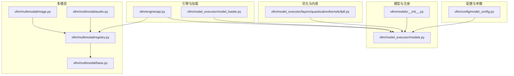
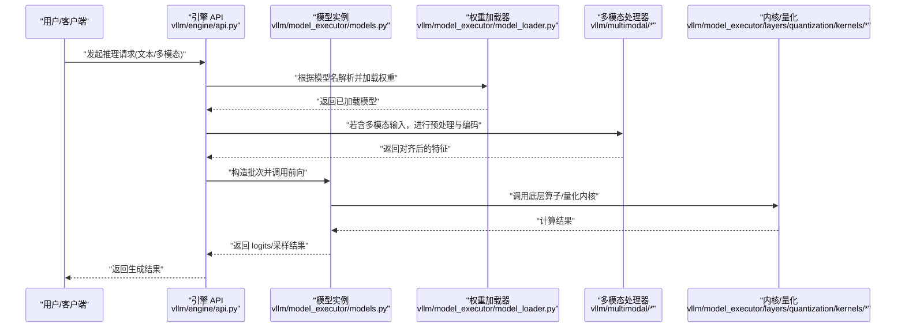
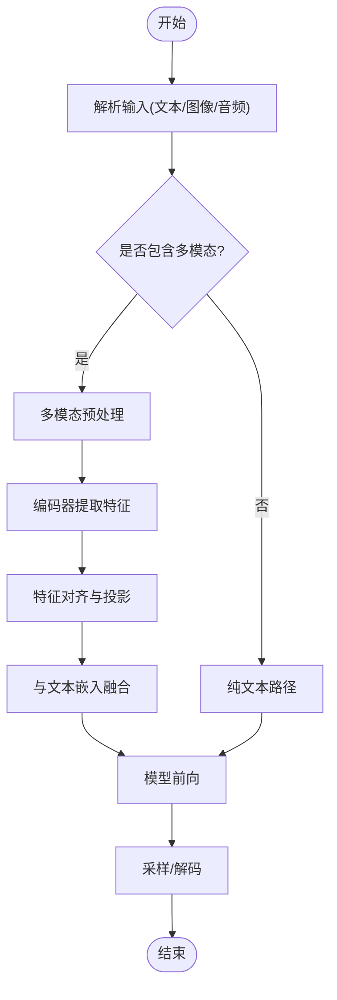
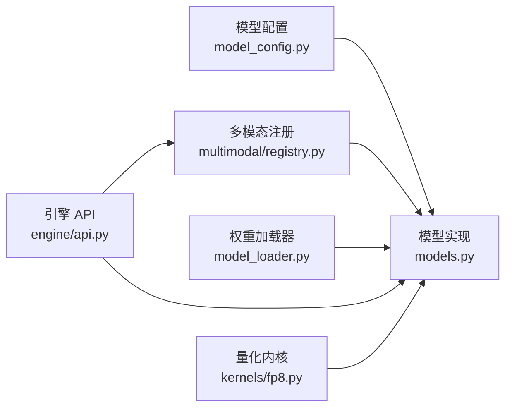

# 模型开发指南

<cite>
**本文引用的文件**   
- [vllm/models/__init__.py](file://vllm/models/__init__.py)
- [vllm/model_executor/models.py](file://vllm/model_executor/models.py)
- [vllm/config/model_config.py](file://vllm/config/model_config.py)
- [vllm/multimodal/registry.py](file://vllm/multimodal/registry.py)
- [vllm/multimodal/base.py](file://vllm/multimodal/base.py)
- [vllm/multimodal/image.py](file://vllm/multimodal/image.py)
- [vllm/multimodal/audio.py](file://vllm/multimodal/audio.py)
- [vllm/engine/api.py](file://vllm/engine/api.py)
- [vllm/model_executor/model_loader.py](file://vllm/model_executor/model_loader.py)
- [vllm/model_executor/layers/quantization/kernels/fp8.py](file://vllm/model_executor/layers/quantization/kernels/fp8.py)
- [examples/generate/multimodal/vision_example.py](file://examples/generate/multimodal/vision_example.py)
- [tests/models/test_multimodal_config.py](file://tests/models/test_multimodal_config.py)
</cite>

## 目录
1. [简介](#简介)
2. [项目结构](#项目结构)
3. [核心组件](#核心组件)
4. [架构总览](#架构总览)
5. [详细组件分析](#详细组件分析)
6. [依赖关系分析](#依赖关系分析)
7. [性能考虑](#性能考虑)
8. [故障排查指南](#故障排查指南)
9. [结论](#结论)
10. [附录](#附录)

## 简介
本指南面向希望在 vLLM 中实现新模型架构的开发者，涵盖以下主题：
- 如何继承与重写模型基类，完成前向传播、权重加载与推理优化
- 如何在 vLLM 中注册新模型（包括文本与多模态）
- 模型配置文件的编写与参数映射
- 多模态输入（图像、音频等）的处理流程与最佳实践
- 从简单文本生成到复杂多模态模型的完整示例路径
- 与现有模型的集成方法与兼容性注意事项

## 项目结构
vLLM 的模型相关代码主要分布在以下模块：
- 模型定义与注册：vllm/models、vllm/model_executor/models.py
- 模型配置与参数映射：vllm/config/model_config.py
- 多模态框架与注册：vllm/multimodal/*
- 引擎入口与调用链：vllm/engine/api.py
- 权重加载器：vllm/model_executor/model_loader.py
- 量化与内核优化：vllm/model_executor/layers/quantization/kernels/*
- 示例与测试：examples/generate/multimodal/*、tests/models/*

图表来源 
- [vllm/models/__init__.py](file://vllm/models/__init__.py)
- [vllm/model_executor/models.py](file://vllm/model_executor/models.py)
- [vllm/config/model_config.py](file://vllm/config/model_config.py)
- [vllm/multimodal/registry.py](file://vllm/multimodal/registry.py)
- [vllm/multimodal/base.py](file://vllm/multimodal/base.py)
- [vllm/multimodal/image.py](file://vllm/multimodal/image.py)
- [vllm/multimodal/audio.py](file://vllm/multimodal/audio.py)
- [vllm/engine/api.py](file://vllm/engine/api.py)
- [vllm/model_executor/model_loader.py](file://vllm/model_executor/model_loader.py)
- [vllm/model_executor/layers/quantization/kernels/fp8.py](file://vllm/model_executor/layers/quantization/kernels/fp8.py)

章节来源
- [vllm/models/__init__.py](file://vllm/models/__init__.py)
- [vllm/model_executor/models.py](file://vllm/model_executor/models.py)
- [vllm/config/model_config.py](file://vllm/config/model_config.py)
- [vllm/multimodal/registry.py](file://vllm/multimodal/registry.py)
- [vllm/multimodal/base.py](file://vllm/multimodal/base.py)
- [vllm/multimodal/image.py](file://vllm/multimodal/image.py)
- [vllm/multimodal/audio.py](file://vllm/multimodal/audio.py)
- [vllm/engine/api.py](file://vllm/engine/api.py)
- [vllm/model_executor/model_loader.py](file://vllm/model_executor/model_loader.py)
- [vllm/model_executor/layers/quantization/kernels/fp8.py](file://vllm/model_executor/layers/quantization/kernels/fp8.py)

## 核心组件
- 模型基类与注册表
  - 通过统一的模型基类抽象出权重加载、前向传播接口与批处理逻辑
  - 在模型包初始化时完成模型类的自动发现与注册，便于按名称解析
- 模型配置
  - 将 HuggingFace 或自定义配置映射为 vLLM 内部参数，支持覆盖与校验
- 多模态框架
  - 提供统一的输入类型抽象（图像、音频等），以及编码器与特征对齐策略
- 引擎与加载器
  - 引擎负责调度请求、构建批次、执行前向；加载器负责从磁盘/仓库加载权重并分片

章节来源
- [vllm/model_executor/models.py](file://vllm/model_executor/models.py)
- [vllm/config/model_config.py](file://vllm/config/model_config.py)
- [vllm/multimodal/base.py](file://vllm/multimodal/base.py)
- [vllm/multimodal/registry.py](file://vllm/multimodal/registry.py)
- [vllm/engine/api.py](file://vllm/engine/api.py)
- [vllm/model_executor/model_loader.py](file://vllm/model_executor/model_loader.py)

## 架构总览
下图展示了从用户调用到模型执行的端到端流程，包含文本与多模态分支。

图表来源 
- [vllm/engine/api.py](file://vllm/engine/api.py)
- [vllm/model_executor/models.py](file://vllm/model_executor/models.py)
- [vllm/model_executor/model_loader.py](file://vllm/model_executor/model_loader.py)
- [vllm/multimodal/registry.py](file://vllm/multimodal/registry.py)
- [vllm/multimodal/base.py](file://vllm/multimodal/base.py)
- [vllm/multimodal/image.py](file://vllm/multimodal/image.py)
- [vllm/multimodal/audio.py](file://vllm/multimodal/audio.py)
- [vllm/model_executor/layers/quantization/kernels/fp8.py](file://vllm/model_executor/layers/quantization/kernels/fp8.py)

## 详细组件分析

### 模型基类与继承重写
- 目标
  - 定义统一的模型接口：权重加载、前向传播、批处理、缓存管理
- 关键步骤
  - 继承模型基类，实现必要的抽象方法（如 forward、get_weights、build_cache 等）
  - 在 __init__ 中完成层初始化与设备分配
  - 在前向中组合注意力、FFN、归一化等模块，遵循 vLLM 的批处理约定
- 优化建议
  - 使用 vLLM 提供的 KV Cache、Paged Attention、CUDA Graph 等能力
  - 对热点路径采用融合算子或自定义内核

章节来源
- [vllm/model_executor/models.py](file://vllm/model_executor/models.py)

### 模型注册机制
- 目标
  - 让 vLLM 能按名称解析并实例化模型
- 关键步骤
  - 在模型包的 __init__ 中导入并注册模型类
  - 确保模型名与配置文件中的 model_name_or_path 一致
- 多模态注册
  - 在多模态 registry 中声明支持的输入类型与编码器

章节来源
- [vllm/models/__init__.py](file://vllm/models/__init__.py)
- [vllm/multimodal/registry.py](file://vllm/multimodal/registry.py)

### 模型配置与参数映射
- 目标
  - 将外部配置（HuggingFace config.json 或自定义 YAML）映射为 vLLM 内部参数
- 关键步骤
  - 在 model_config 中定义字段映射、默认值与校验规则
  - 支持运行时覆盖（engine_args、serve_args）
- 多模态配置
  - 指定图像/音频编码器的分辨率、采样率、对齐方式等

章节来源
- [vllm/config/model_config.py](file://vllm/config/model_config.py)
- [tests/models/test_multimodal_config.py](file://tests/models/test_multimodal_config.py)

### 多模态模型实现（图像、音频）
- 目标
  - 统一处理图像、音频等多模态输入，并与文本流对齐
- 关键步骤
  - 实现多模态编码器（图像/音频）与特征投影
  - 在模型前向中将多模态特征与 token 嵌入拼接或注入
  - 注册输入类型与处理器，确保引擎正确分发
- 典型流程
  - 输入预处理 → 编码器 → 特征对齐 → 与文本融合 → 解码生成

章节来源
- [vllm/multimodal/base.py](file://vllm/multimodal/base.py)
- [vllm/multimodal/image.py](file://vllm/multimodal/image.py)
- [vllm/multimodal/audio.py](file://vllm/multimodal/audio.py)
- [vllm/multimodal/registry.py](file://vllm/multimodal/registry.py)

### 权重加载与分片
- 目标
  - 从本地或远程仓库加载权重，并按并行策略切分
- 关键步骤
  - 选择合适的数据源与格式（safetensors、bin 等）
  - 依据张量形状与并行度进行切分与广播
  - 支持量化权重与混合精度加载

章节来源
- [vllm/model_executor/model_loader.py](file://vllm/model_executor/model_loader.py)

### 推理优化与内核
- 目标
  - 利用量化与融合内核提升吞吐与降低延迟
- 关键步骤
  - 启用 FP8/INT8 等量化路径
  - 使用 CUDA Graph、FlashAttention、Fused MoE 等加速
  - 针对热点层定制内核或替换为高效实现

章节来源
- [vllm/model_executor/layers/quantization/kernels/fp8.py](file://vllm/model_executor/layers/quantization/kernels/fp8.py)

### 端到端示例路径
- 文本生成示例
  - 参考 examples/generate 下的离线/在线示例脚本
- 多模态示例
  - 参考 examples/generate/multimodal/vision_example.py 以了解图像输入的处理流程

章节来源
- [examples/generate/multimodal/vision_example.py](file://examples/generate/multimodal/vision_example.py)

## 依赖关系分析
- 耦合与内聚
  - 模型与配置强耦合（参数映射），与多模态框架松耦合（通过注册表）
  - 引擎与加载器解耦，便于替换数据源与并行策略
- 外部依赖
  - HuggingFace 配置与权重格式
  - 量化与注意力后端（如 FlashAttention、FP8 内核）

图表来源 
- [vllm/config/model_config.py](file://vllm/config/model_config.py)
- [vllm/model_executor/models.py](file://vllm/model_executor/models.py)
- [vllm/multimodal/registry.py](file://vllm/multimodal/registry.py)
- [vllm/model_executor/model_loader.py](file://vllm/model_executor/model_loader.py)
- [vllm/engine/api.py](file://vllm/engine/api.py)
- [vllm/model_executor/layers/quantization/kernels/fp8.py](file://vllm/model_executor/layers/quantization/kernels/fp8.py)

章节来源
- [vllm/config/model_config.py](file://vllm/config/model_config.py)
- [vllm/model_executor/models.py](file://vllm/model_executor/models.py)
- [vllm/multimodal/registry.py](file://vllm/multimodal/registry.py)
- [vllm/model_executor/model_loader.py](file://vllm/model_executor/model_loader.py)
- [vllm/engine/api.py](file://vllm/engine/api.py)
- [vllm/model_executor/layers/quantization/kernels/fp8.py](file://vllm/model_executor/layers/quantization/kernels/fp8.py)

## 性能考虑
- 批处理与内存
  - 合理设置 batch size、max_seq_len，避免 OOM
  - 使用 Paged Attention 与 KV Cache 减少碎片
- 量化与精度
  - 优先启用 FP8/INT8 路径，结合校准数据保证质量
- 编译与图优化
  - 启用 CUDA Graph、Torch Compile 等特性，减少 Python 开销
- 多模态预处理
  - 预计算图像/音频特征，复用共享编码器输出

[本节为通用指导，不直接分析具体文件]

## 故障排查指南
- 常见错误
  - 模型名未注册：检查 models/__init__.py 是否正确导入并注册
  - 配置不匹配：核对 model_config 映射与 HF 配置字段
  - 多模态输入失败：确认 multimodal registry 中已声明对应类型与处理器
  - 权重加载失败：检查路径、权限、格式与并行度一致性
- 调试建议
  - 打印引擎日志与模型初始化信息
  - 逐步验证预处理、编码、融合与前向各阶段
  - 使用最小可复现示例定位问题

章节来源
- [vllm/models/__init__.py](file://vllm/models/__init__.py)
- [vllm/config/model_config.py](file://vllm/config/model_config.py)
- [vllm/multimodal/registry.py](file://vllm/multimodal/registry.py)
- [vllm/model_executor/model_loader.py](file://vllm/model_executor/model_loader.py)

## 结论
通过遵循本指南，开发者可以：
- 快速实现并注册新的文本或多模态模型
- 正确编写与映射模型配置，确保兼容性与可维护性
- 充分利用 vLLM 的批处理、KV Cache、量化与内核优化能力
- 以最小改动集成到现有引擎与生态中

[本节为总结性内容，不直接分析具体文件]

## 附录
- 推荐实践
  - 保持模型接口稳定，向后兼容
  - 完善单元测试与回归测试，覆盖边界条件
  - 提供清晰的文档与示例，便于社区贡献

[本节为补充说明，不直接分析具体文件]