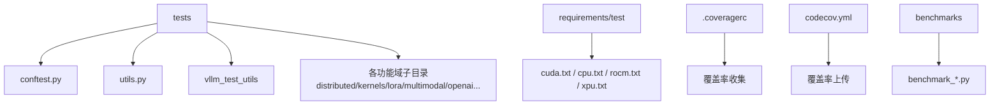
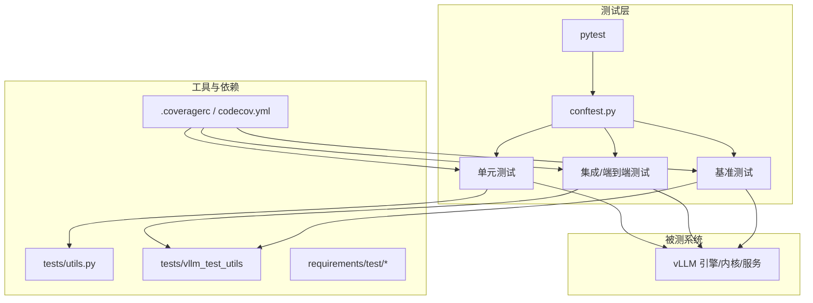
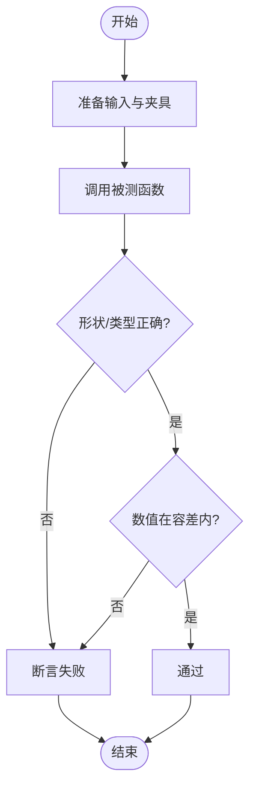
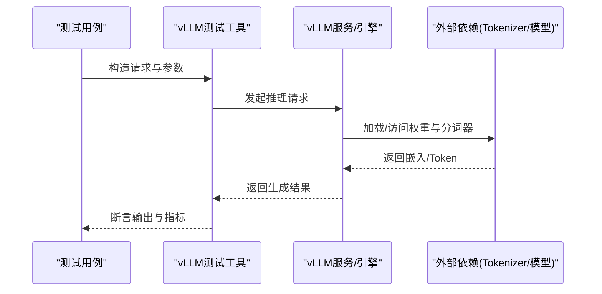
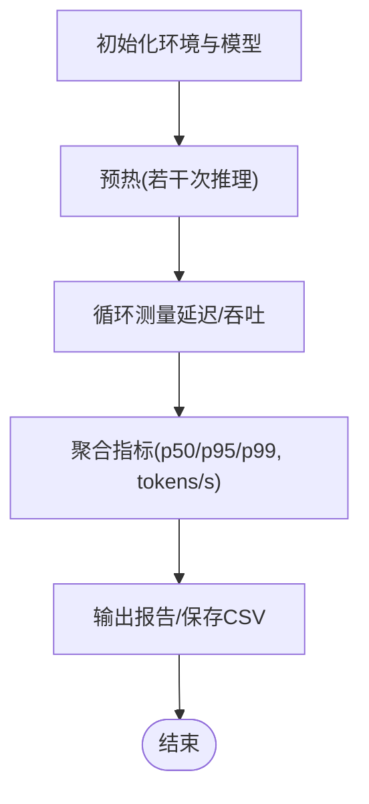
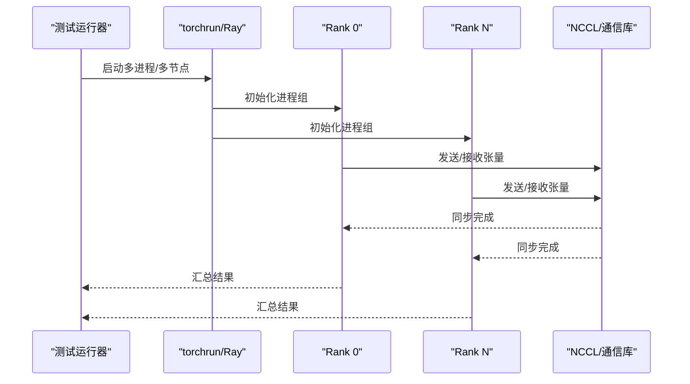
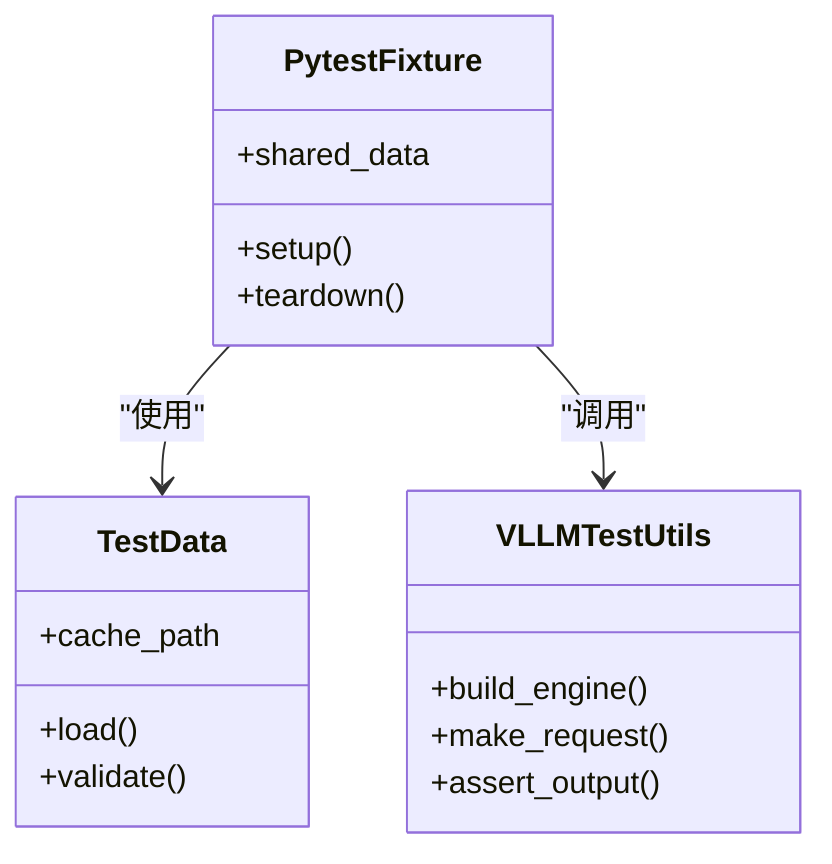
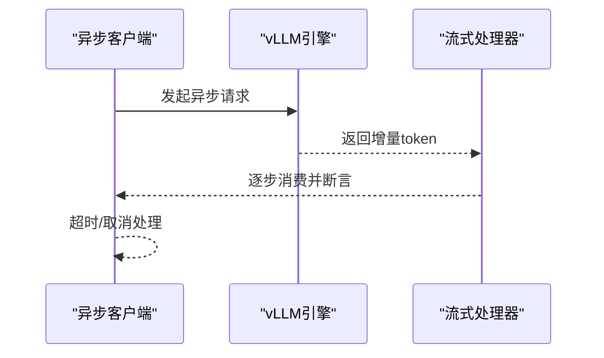
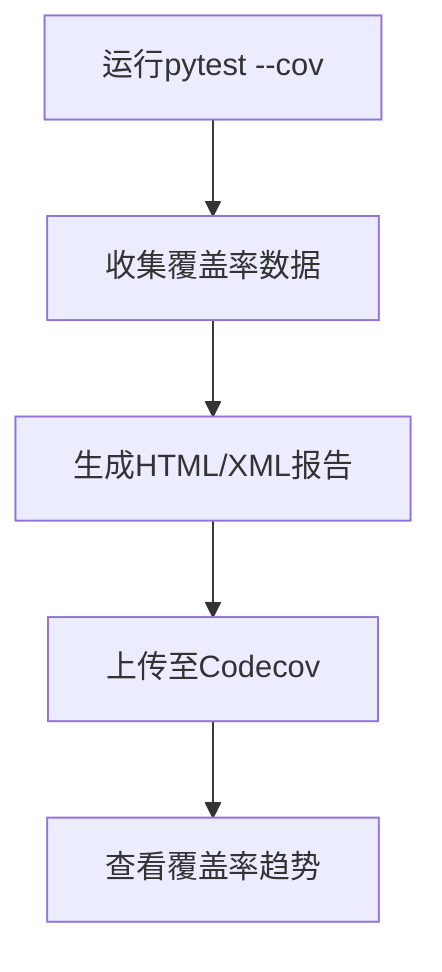
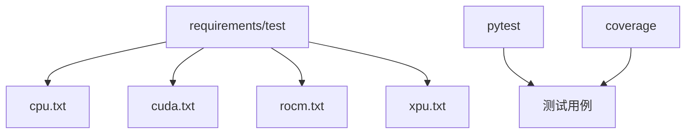

# 测试框架开发

<cite>
**本文引用的文件**   
- [tests/conftest.py](file://tests/conftest.py)
- [tests/utils.py](file://tests/utils.py)
- [tests/vllm_test_utils/__init__.py](file://tests/vllm_test_utils/__init__.py)
- [requirements/test/cuda.txt](file://requirements/test/cuda.txt)
- [requirements/test/cpu.txt](file://requirements/test/cpu.txt)
- [.coveragerc](file://.coveragerc)
- [codecov.yml](file://codecov.yml)
- [benchmarks/benchmark_latency.py](file://benchmarks/benchmark_latency.py)
- [benchmarks/benchmark_throughput.py](file://benchmarks/benchmark_throughput.py)
- [benchmarks/benchmark_serving.py](file://benchmarks/benchmark_serving.py)
- [benchmarks/benchmark_bench_startup.py](file://benchmarks/benchmarks/test_bench_startup.py)
- [tests/distributed/conftest.py](file://tests/distributed/conftest.py)
- [tests/compile/conftest.py](file://tests/compile/conftest.py)
- [tests/engine/test_arg_utils.py](file://tests/engine/test_arg_utils.py)
- [tests/kernels/test_cache_kernels.py](file://tests/kernels/test_cache_kernels.py)
- [tests/lora/test_lora_functions.py](file://tests/lora/test_lora_functions.py)
- [tests/multimodal/test_multimodal.py](file://tests/multimodal/test_multimodal.py)
- [tests/openai/test_openai_api.py](file://tests/entrypoints/openai/test_openai_api.py)
- [tests/basic_correctness/test_basic_correctness.py](file://tests/basic_correctness/test_basic_correctness.py)
- [tests/benchmarks/test_latency_cli.py](file://tests/benchmarks/test_latency_cli.py)
- [tests/benchmarks/test_throughput_cli.py](file://tests/benchmarks/test_throughput_cli.py)
</cite>

## 目录
1. [简介](#简介)
2. [项目结构](#项目结构)
3. [核心组件](#核心组件)
4. [架构总览](#架构总览)
5. [详细组件分析](#详细组件分析)
6. [依赖分析](#依赖分析)
7. [性能考虑](#性能考虑)
8. [故障排查指南](#故障排查指南)
9. [结论](#结论)
10. [附录](#附录)

## 简介
本指南面向希望在 vLLM 项目中编写高质量测试的工程师，覆盖单元测试、集成测试、端到端测试、系统级测试、基准测试、多GPU与多节点测试、测试数据与fixture管理、异步与并发测试、覆盖率统计与质量检查工具等主题。文档基于仓库现有测试组织方式与示例，提供从简单函数到复杂分布式系统的完整实践路径。

## 项目结构
vLLM 的测试代码集中在 tests 目录，按功能域划分（如 distributed、kernels、lora、multimodal、openai 等），并辅以通用配置与工具：
- 顶层 conftest.py：全局 pytest 配置、插件、标记与环境变量控制。
- utils.py：常用断言、随机种子、设备初始化、进程/线程辅助方法。
- vllm_test_utils：封装 vLLM 特定的测试工具（例如引擎构造、请求构造、结果校验）。
- requirements/test：测试环境依赖（CPU/CUDA/ROCm/XPU 等）。
- .coveragerc 与 codecov.yml：覆盖率收集与上传配置。
- benchmarks：独立基准脚本集合，用于吞吐、延迟、启动开销等指标采集。

**章节来源**
- [tests/conftest.py](file://tests/conftest.py)
- [tests/utils.py](file://tests/utils.py)
- [tests/vllm_test_utils/__init__.py](file://tests/vllm_test_utils/__init__.py)
- [requirements/test/cuda.txt](file://requirements/test/cuda.txt)
- [requirements/test/cpu.txt](file://requirements/test/cpu.txt)
- [.coveragerc](file://.coveragerc)
- [codecov.yml](file://codecov.yml)
- [benchmarks/benchmark_latency.py](file://benchmarks/benchmark_latency.py)

## 核心组件
- 测试运行器与配置：pytest + 自定义 conftest，支持标记过滤、并行执行、环境变量注入。
- 断言与工具：在 tests/utils.py 中集中实现数值比较、形状校验、设备一致性检查、随机性控制。
- vLLM 专用工具：tests/vllm_test_utils 提供引擎实例化、请求构造、流式响应处理、结果对齐等能力。
- 基准套件：benchmarks 下包含延迟、吞吐、服务启动、结构化输出等基准脚本，便于性能回归检测。
- 覆盖率与CI：.coveragerc 与 codecov.yml 配合 CI 完成覆盖率统计与上报。

**章节来源**
- [tests/conftest.py](file://tests/conftest.py)
- [tests/utils.py](file://tests/utils.py)
- [tests/vllm_test_utils/__init__.py](file://tests/vllm_test_utils/__init__.py)
- [.coveragerc](file://.coveragerc)
- [codecov.yml](file://codecov.yml)

## 架构总览
下图展示测试体系的整体交互关系：测试用例通过 pytest 发现并执行；conftest 提供夹具与钩子；vLLM 测试工具负责构建引擎与请求；基准脚本独立运行以采集性能指标；覆盖率工具对 Python 代码进行插桩与统计。

**图表来源**
- [tests/conftest.py](file://tests/conftest.py)
- [tests/utils.py](file://tests/utils.py)
- [tests/vllm_test_utils/__init__.py](file://tests/vllm_test_utils/__init__.py)
- [.coveragerc](file://.coveragerc)
- [codecov.yml](file://codecov.yml)

## 详细组件分析

### 单元测试开发与断言方法
- 设计要点
  - 单一职责：每个测试聚焦一个函数或模块行为。
  - 输入输出明确：使用 fixtures 准备输入，断言输出结构与数值范围。
  - 随机性与确定性：固定随机种子，避免非确定性失败。
  - 设备无关性：在 CPU/GPU 上均可运行，必要时跳过不兼容场景。
- 断言建议
  - 数值近似：使用相对/绝对误差阈值比较浮点结果。
  - 形状与类型：校验张量维度、数据类型与内存布局。
  - 边界条件：空输入、极小/极大值、特殊 token 序列。
- 参考实现位置
  - 通用断言与工具：tests/utils.py
  - 示例：kernels 与 lora 的功能单元验证

**章节来源**
- [tests/utils.py](file://tests/utils.py)
- [tests/kernels/test_cache_kernels.py](file://tests/kernels/test_cache_kernels.py)
- [tests/lora/test_lora_functions.py](file://tests/lora/test_lora_functions.py)

### 集成测试与端到端测试
- 目标
  - 验证引擎与服务在真实工作负载下的正确性。
  - 覆盖多模态、OpenAI API、流式生成、错误恢复等关键路径。
- 设计要点
  - 使用 vLLM 测试工具构造最小可复现请求集。
  - 模拟外部依赖（如 tokenizer、模型权重）时尽量贴近真实环境。
  - 设置合理的超时与重试策略，处理网络抖动。
- 参考实现位置
  - OpenAI API 端到端：tests/entrypoints/openai/test_openai_api.py
  - 基础正确性：tests/basic_correctness/test_basic_correctness.py
  - 多模态：tests/multimodal/test_multimodal.py

**图表来源**
- [tests/vllm_test_utils/__init__.py](file://tests/vllm_test_utils/__init__.py)
- [tests/entrypoints/openai/test_openai_api.py](file://tests/entrypoints/openai/test_openai_api.py)
- [tests/basic_correctness/test_basic_correctness.py](file://tests/basic_correctness/test_basic_correctness.py)
- [tests/multimodal/test_multimodal.py](file://tests/multimodal/test_multimodal.py)

**章节来源**
- [tests/entrypoints/openai/test_openai_api.py](file://tests/entrypoints/openai/test_openai_api.py)
- [tests/basic_correctness/test_basic_correctness.py](file://tests/basic_correctness/test_basic_correctness.py)
- [tests/multimodal/test_multimodal.py](file://tests/multimodal/test_multimodal.py)

### 基准测试与性能指标
- 目标
  - 量化延迟、吞吐、启动开销、显存占用等关键指标。
  - 建立回归基线，监控优化效果。
- 设计要点
  - 预热阶段：确保 JIT/图编译、缓存命中稳定。
  - 采样策略：固定批次大小、上下文长度、采样参数。
  - 指标采集：记录 p50/p95/p99 延迟、tokens/s、GPU 利用率。
- 参考实现位置
  - 延迟基准：benchmarks/benchmark_latency.py
  - 吞吐基准：benchmarks/benchmark_throughput.py
  - 服务启动开销：benchmarks/benchmarks/test_bench_startup.py
  - CLI 基准测试：tests/benchmarks/test_latency_cli.py、tests/benchmarks/test_throughput_cli.py

**图表来源**
- [benchmarks/benchmark_latency.py](file://benchmarks/benchmark_latency.py)
- [benchmarks/benchmark_throughput.py](file://benchmarks/benchmark_throughput.py)
- [benchmarks/benchmark_serving.py](file://benchmarks/benchmark_serving.py)
- [benchmarks/benchmarks/test_bench_startup.py](file://benchmarks/benchmarks/test_bench_startup.py)

**章节来源**
- [benchmarks/benchmark_latency.py](file://benchmarks/benchmark_latency.py)
- [benchmarks/benchmark_throughput.py](file://benchmarks/benchmark_throughput.py)
- [benchmarks/benchmark_serving.py](file://benchmarks/benchmark_serving.py)
- [tests/benchmarks/test_latency_cli.py](file://tests/benchmarks/test_latency_cli.py)
- [tests/benchmarks/test_throughput_cli.py](file://tests/benchmarks/test_throughput_cli.py)

### 多GPU与多节点测试
- 目标
  - 验证张量并行、流水线并行、专家并行、通信原语在多卡/多机上的正确性。
- 设计要点
  - 使用 torchrun 或 Ray 启动多进程/多节点。
  - 合理设置 NCCL/RDMA 环境变量，避免通信瓶颈。
  - 针对特定后端（CUDA/ROCm/XPU）做条件跳过或适配。
- 参考实现位置
  - 分布式测试夹具与工具：tests/distributed/conftest.py
  - 编译相关分布式场景：tests/compile/conftest.py
  - 具体用例：tests/distributed/test_*（如 test_pipeline_parallel.py、test_expert_parallel.py）

**图表来源**
- [tests/distributed/conftest.py](file://tests/distributed/conftest.py)
- [tests/compile/conftest.py](file://tests/compile/conftest.py)

**章节来源**
- [tests/distributed/conftest.py](file://tests/distributed/conftest.py)
- [tests/compile/conftest.py](file://tests/compile/conftest.py)

### 测试数据管理与Fixture
- 目标
  - 统一管理测试数据、模型权重、配置与共享夹具。
- 设计要点
  - 使用 pytest fixture 按需加载数据，避免重复 IO。
  - 将大型数据放在外部存储，按需下载或缓存。
  - 为不同平台（CPU/GPU/ROCm/XPU）提供差异化 fixture。
- 参考实现位置
  - 全局配置与夹具：tests/conftest.py
  - 通用工具：tests/utils.py
  - vLLM 专用夹具：tests/vllm_test_utils/__init__.py

**图表来源**
- [tests/conftest.py](file://tests/conftest.py)
- [tests/utils.py](file://tests/utils.py)
- [tests/vllm_test_utils/__init__.py](file://tests/vllm_test_utils/__init__.py)

**章节来源**
- [tests/conftest.py](file://tests/conftest.py)
- [tests/utils.py](file://tests/utils.py)
- [tests/vllm_test_utils/__init__.py](file://tests/vllm_test_utils/__init__.py)

### 异步测试与并发测试
- 目标
  - 验证异步接口、流式生成、并发请求的正确性与稳定性。
- 设计要点
  - 使用 asyncio 与事件循环驱动异步调用。
  - 限制并发度，避免资源耗尽；设置超时与取消语义。
  - 对服务端流式响应进行逐块断言。
- 参考实现位置
  - OpenAI 异步与流式：tests/entrypoints/openai/test_openai_api.py
  - 引擎参数与异步入口：tests/engine/test_arg_utils.py

**图表来源**
- [tests/entrypoints/openai/test_openai_api.py](file://tests/entrypoints/openai/test_openai_api.py)
- [tests/engine/test_arg_utils.py](file://tests/engine/test_arg_utils.py)

**章节来源**
- [tests/entrypoints/openai/test_openai_api.py](file://tests/entrypoints/openai/test_openai_api.py)
- [tests/engine/test_arg_utils.py](file://tests/engine/test_arg_utils.py)

### 覆盖率统计与质量检查
- 目标
  - 统计 Python 代码覆盖率，持续集成中自动上报。
- 设计要点
  - 使用 .coveragerc 配置收集范围与忽略规则。
  - 在 CI 中运行 pytest --cov，生成报告并上传至 codecov。
- 参考实现位置
  - 覆盖率配置：.coveragerc
  - Codecov 配置：codecov.yml

**图表来源**
- [.coveragerc](file://.coveragerc)
- [codecov.yml](file://codecov.yml)

**章节来源**
- [.coveragerc](file://.coveragerc)
- [codecov.yml](file://codecov.yml)

## 依赖分析
测试依赖通过 requirements/test 下的文件管理，区分 CPU、CUDA、ROCm、XPU 等环境。pytest、coverage、asyncio 等为核心运行时依赖。

**图表来源**
- [requirements/test/cpu.txt](file://requirements/test/cpu.txt)
- [requirements/test/cuda.txt](file://requirements/test/cuda.txt)

**章节来源**
- [requirements/test/cpu.txt](file://requirements/test/cpu.txt)
- [requirements/test/cuda.txt](file://requirements/test/cuda.txt)

## 性能考虑
- 基准设计
  - 预热与稳定期：避免首次编译/加载影响指标。
  - 批大小与上下文长度：覆盖典型与极端场景。
  - 指标选择：延迟分位、吞吐、显存峰值、GPU利用率。
- 执行策略
  - 单测与基准分离：单测关注正确性，基准关注性能。
  - 隔离资源：避免与其他任务争抢 GPU/CPU。
  - 结果可复现：固定随机种子与输入数据。

[本节为通用指导，不直接分析具体文件]

## 故障排查指南
- 常见问题
  - CUDA/ROCm/XPU 不可用：检查驱动与设备枚举。
  - 通信失败：确认 NCCL 环境变量与网络拓扑。
  - 内存不足：降低批次大小或启用分页注意力。
  - 异步超时：调整超时阈值与并发度。
- 定位方法
  - 增加日志与断点：在关键路径打印状态。
  - 简化用例：最小化复现场景。
  - 对比基线：与已知通过的版本对比差异。

[本节为通用指导，不直接分析具体文件]

## 结论
通过统一的 pytest 配置、完善的工具与夹具、清晰的基准套件与覆盖率流程，vLLM 的测试体系能够支撑从单元到分布式端到端的全面验证。遵循本指南的实践，可显著提升测试质量与可维护性，并为性能优化提供可靠依据。

[本节为总结，不直接分析具体文件]

## 附录
- 快速开始
  - 安装测试依赖：根据平台选择 requirements/test 中的文件。
  - 运行单测：pytest -v tests/<domain>/
  - 运行基准：python benchmarks/benchmark_*.py
  - 覆盖率：pytest --cov=vllm tests/ && coverage report
- 参考用例
  - 简单函数测试：tests/engine/test_arg_utils.py
  - 内核正确性：tests/kernels/test_cache_kernels.py
  - LoRA 功能：tests/lora/test_lora_functions.py
  - 多模态：tests/multimodal/test_multimodal.py
  - OpenAI API：tests/entrypoints/openai/test_openai_api.py
  - 基础正确性：tests/basic_correctness/test_basic_correctness.py

**章节来源**
- [tests/engine/test_arg_utils.py](file://tests/engine/test_arg_utils.py)
- [tests/kernels/test_cache_kernels.py](file://tests/kernels/test_cache_kernels.py)
- [tests/lora/test_lora_functions.py](file://tests/lora/test_lora_functions.py)
- [tests/multimodal/test_multimodal.py](file://tests/multimodal/test_multimodal.py)
- [tests/entrypoints/openai/test_openai_api.py](file://tests/entrypoints/openai/test_openai_api.py)
- [tests/basic_correctness/test_basic_correctness.py](file://tests/basic_correctness/test_basic_correctness.py)