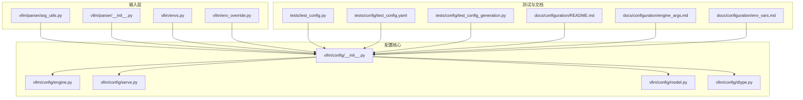
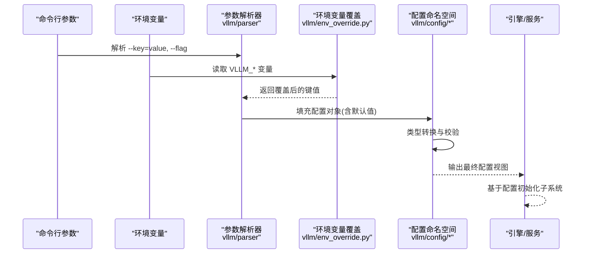
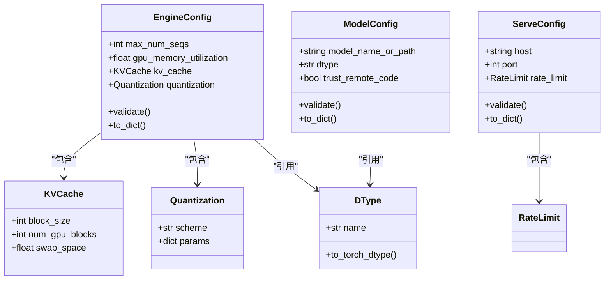
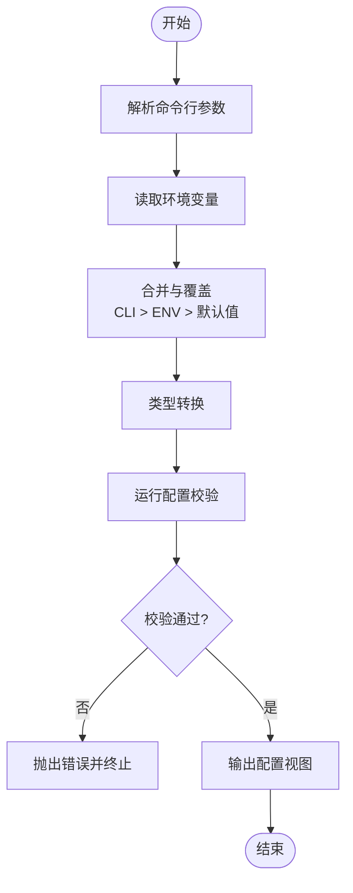
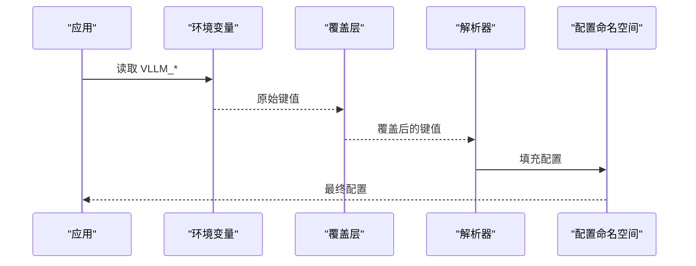
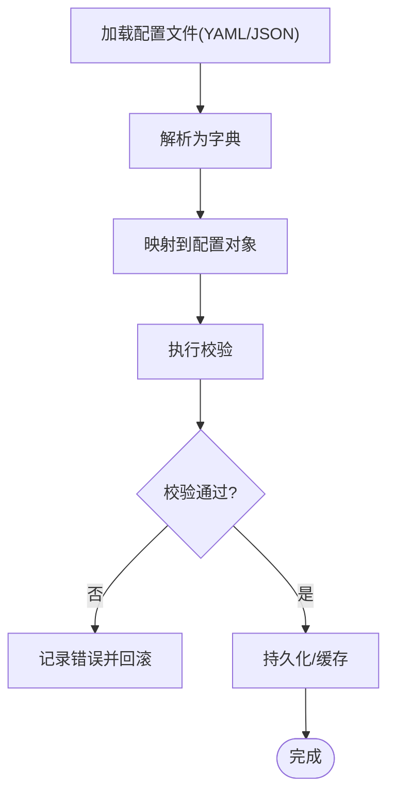
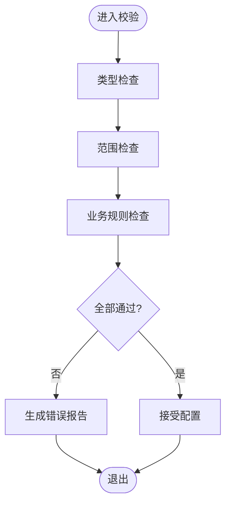
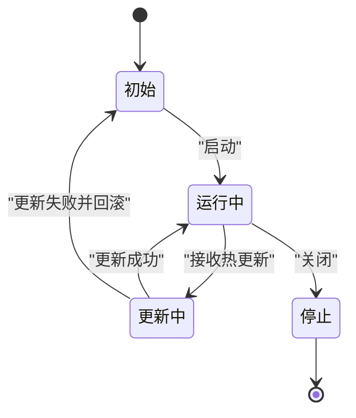
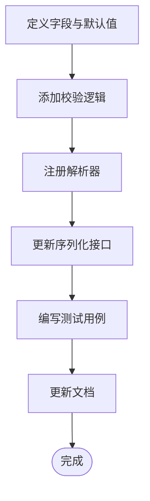
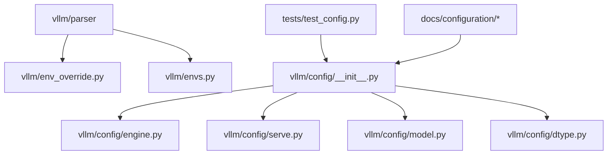

# 配置系统开发

<cite>
**本文档引用的文件**   
- [vllm/config/__init__.py](file://vllm/config/__init__.py)
- [vllm/config/engine.py](file://vllm/config/engine.py)
- [vllm/config/serve.py](file://vllm/config/serve.py)
- [vllm/config/model.py](file://vllm/config/model.py)
- [vllm/config/dtype.py](file://vllm/config/dtype.py)
- [vllm/envs.py](file://vllm/envs.py)
- [vllm/env_override.py](file://vllm/env_override.py)
- [vllm/parser/arg_utils.py](file://vllm/parser/arg_utils.py)
- [vllm/parser/__init__.py](file://vllm/parser/__init__.py)
- [tests/test_config.py](file://tests/test_config.py)
- [tests/config/test_config.yaml](file://tests/config/test_config.yaml)
- [tests/config/test_config_with_model.yaml](file://tests/config/test_config_with_model.yaml)
- [tests/config/test_config_generation.py](file://tests/config/test_config_generation.py)
- [tests/config/test_config_utils.py](file://tests/config/test_config_utils.py)
- [docs/configuration/README.md](file://docs/configuration/README.md)
- [docs/configuration/engine_args.md](file://docs/configuration/engine_args.md)
- [docs/configuration/env_vars.md](file://docs/configuration/env_vars.md)
</cite>

## 目录
1. [简介](#简介)
2. [项目结构](#项目结构)
3. [核心组件](#核心组件)
4. [架构总览](#架构总览)
5. [详细组件分析](#详细组件分析)
6. [依赖关系分析](#依赖关系分析)
7. [性能考虑](#性能考虑)
8. [故障排查指南](#故障排查指南)
9. [结论](#结论)
10. [附录](#附录)

## 简介
本指南面向希望在 vLLM 中扩展与完善配置系统的开发者，系统性说明如何添加新的配置项、定义参数类型与默认值、实现校验与错误处理、支持配置文件与序列化、以及环境变量与命令行参数的解析优先级。文档同时覆盖配置层次结构与继承机制、动态更新与热重载能力，并提供从简单到复杂的完整示例路径，帮助读者快速上手并高质量地落地配置功能。

## 项目结构
vLLM 的配置系统围绕以下关键目录与模块组织：
- vllm/config：集中管理引擎、服务、模型、数据类型等配置对象与验证逻辑
- vllm/parser：命令行参数解析与工具函数
- vllm/envs.py / vllm/env_override.py：环境变量定义与覆盖策略
- tests/config：配置相关测试用例与样例配置文件
- docs/configuration：官方配置文档（引擎参数、环境变量等）

图表来源
- [vllm/config/__init__.py](file://vllm/config/__init__.py)
- [vllm/config/engine.py](file://vllm/config/engine.py)
- [vllm/config/serve.py](file://vllm/config/serve.py)
- [vllm/config/model.py](file://vllm/config/model.py)
- [vllm/config/dtype.py](file://vllm/config/dtype.py)
- [vllm/parser/arg_utils.py](file://vllm/parser/arg_utils.py)
- [vllm/parser/__init__.py](file://vllm/parser/__init__.py)
- [vllm/envs.py](file://vllm/envs.py)
- [vllm/env_override.py](file://vllm/env_override.py)
- [tests/test_config.py](file://tests/test_config.py)
- [tests/config/test_config.yaml](file://tests/config/test_config.yaml)
- [tests/config/test_config_generation.py](file://tests/config/test_config_generation.py)
- [docs/configuration/README.md](file://docs/configuration/README.md)
- [docs/configuration/engine_args.md](file://docs/configuration/engine_args.md)
- [docs/configuration/env_vars.md](file://docs/configuration/env_vars.md)

章节来源
- [vllm/config/__init__.py](file://vllm/config/__init__.py)
- [vllm/config/engine.py](file://vllm/config/engine.py)
- [vllm/config/serve.py](file://vllm/config/serve.py)
- [vllm/config/model.py](file://vllm/config/model.py)
- [vllm/config/dtype.py](file://vllm/config/dtype.py)
- [vllm/parser/arg_utils.py](file://vllm/parser/arg_utils.py)
- [vllm/parser/__init__.py](file://vllm/parser/__init__.py)
- [vllm/envs.py](file://vllm/envs.py)
- [vllm/env_override.py](file://vllm/env_override.py)
- [tests/test_config.py](file://tests/test_config.py)
- [tests/config/test_config.yaml](file://tests/config/test_config.yaml)
- [tests/config/test_config_generation.py](file://tests/config/test_config_generation.py)
- [docs/configuration/README.md](file://docs/configuration/README.md)
- [docs/configuration/engine_args.md](file://docs/configuration/engine_args.md)
- [docs/configuration/env_vars.md](file://docs/configuration/env_vars.md)

## 核心组件
- 配置对象与命名空间：通过配置模块统一暴露 EngineConfig、ServeConfig、ModelConfig、DType 等命名空间，提供默认值、类型约束与校验钩子
- 参数解析器：将命令行参数与环境变量合并为统一的配置视图，支持嵌套结构与列表/字典类型
- 环境变量与覆盖：集中定义环境变量键名与默认行为，支持运行时覆盖与优先级控制
- 校验与错误处理：在加载与初始化阶段进行强类型校验、范围检查与业务规则校验，失败时给出明确错误信息
- 序列化与反序列化：支持 YAML/JSON 等格式的配置读写，便于持久化与调试
- 动态更新与热重载：对可热更新的配置项提供增量更新接口与一致性保障

章节来源
- [vllm/config/__init__.py](file://vllm/config/__init__.py)
- [vllm/config/engine.py](file://vllm/config/engine.py)
- [vllm/config/serve.py](file://vllm/config/serve.py)
- [vllm/config/model.py](file://vllm/config/model.py)
- [vllm/config/dtype.py](file://vllm/config/dtype.py)
- [vllm/parser/arg_utils.py](file://vllm/parser/arg_utils.py)
- [vllm/envs.py](file://vllm/envs.py)
- [vllm/env_override.py](file://vllm/env_override.py)

## 架构总览
下图展示了配置系统在启动时的数据流与交互关系：命令行参数与环境变量被解析后合并为中间表示，随后映射到各配置命名空间，完成类型转换与校验，最终生成不可变或受控的可变配置对象供引擎使用。

图表来源
- [vllm/parser/arg_utils.py](file://vllm/parser/arg_utils.py)
- [vllm/env_override.py](file://vllm/env_override.py)
- [vllm/config/engine.py](file://vllm/config/engine.py)
- [vllm/config/serve.py](file://vllm/config/serve.py)
- [vllm/config/model.py](file://vllm/config/model.py)
- [vllm/config/dtype.py](file://vllm/config/dtype.py)

## 详细组件分析

### 配置命名空间与层次结构
- 顶层命名空间：EngineConfig、ServeConfig、ModelConfig、DType 等分别承载不同域的配置
- 层次结构：通过嵌套对象表达复杂配置（如 engine.kv_cache、engine.quantization），支持按层级访问与局部覆盖
- 继承机制：子类可继承父类字段与默认值，并在子类中进行增强校验或覆盖默认值

图表来源
- [vllm/config/engine.py](file://vllm/config/engine.py)
- [vllm/config/serve.py](file://vllm/config/serve.py)
- [vllm/config/model.py](file://vllm/config/model.py)
- [vllm/config/dtype.py](file://vllm/config/dtype.py)

章节来源
- [vllm/config/engine.py](file://vllm/config/engine.py)
- [vllm/config/serve.py](file://vllm/config/serve.py)
- [vllm/config/model.py](file://vllm/config/model.py)
- [vllm/config/dtype.py](file://vllm/config/dtype.py)

### 命令行参数解析流程
- 参数注册：在 parser 模块中声明参数名称、类型、默认值与帮助信息
- 合并策略：命令行参数优先于环境变量；同层级键名冲突时，后者覆盖前者
- 类型转换：解析器自动将字符串转换为目标类型（如 int、float、list、dict）
- 校验入口：解析完成后调用配置的 validate 方法执行范围与业务规则校验

图表来源
- [vllm/parser/arg_utils.py](file://vllm/parser/arg_utils.py)
- [vllm/env_override.py](file://vllm/env_override.py)
- [vllm/config/engine.py](file://vllm/config/engine.py)

章节来源
- [vllm/parser/arg_utils.py](file://vllm/parser/arg_utils.py)
- [vllm/env_override.py](file://vllm/env_override.py)

### 环境变量配置方法与优先级
- 环境变量定义：在 envs.py 中集中定义所有 VLLM_* 变量及其默认值与类型提示
- 覆盖策略：env_override.py 提供运行时覆盖能力，支持进程内动态调整
- 优先级顺序：命令行参数 > 环境变量 > 配置默认值
- 安全建议：敏感参数避免直接写入环境变量，建议使用密钥管理服务注入

图表来源
- [vllm/envs.py](file://vllm/envs.py)
- [vllm/env_override.py](file://vllm/env_override.py)
- [vllm/parser/arg_utils.py](file://vllm/parser/arg_utils.py)

章节来源
- [vllm/envs.py](file://vllm/envs.py)
- [vllm/env_override.py](file://vllm/env_override.py)

### 配置文件格式支持与序列化机制
- 支持格式：YAML、JSON（可通过测试样例与文档确认）
- 序列化接口：配置对象提供 to_dict()/from_dict() 或等价方法，便于导出与导入
- 校验集成：反序列化后立即执行 validate，确保数据完整性
- 版本兼容：通过 schema 版本字段保证向后兼容

图表来源
- [tests/config/test_config.yaml](file://tests/config/test_config.yaml)
- [tests/config/test_config_with_model.yaml](file://tests/config/test_config_with_model.yaml)
- [tests/config/test_config_generation.py](file://tests/config/test_config_generation.py)

章节来源
- [tests/config/test_config.yaml](file://tests/config/test_config.yaml)
- [tests/config/test_config_with_model.yaml](file://tests/config/test_config_with_model.yaml)
- [tests/config/test_config_generation.py](file://tests/config/test_config_generation.py)

### 配置验证与错误处理
- 类型校验：严格检查字段类型，拒绝非法类型
- 范围校验：数值范围、枚举值、必填字段检查
- 业务规则：跨字段一致性校验（如内存分配与块大小匹配）
- 错误信息：提供清晰的错误定位与修复建议

图表来源
- [vllm/config/engine.py](file://vllm/config/engine.py)
- [vllm/config/serve.py](file://vllm/config/serve.py)
- [vllm/config/model.py](file://vllm/config/model.py)

章节来源
- [vllm/config/engine.py](file://vllm/config/engine.py)
- [vllm/config/serve.py](file://vllm/config/serve.py)
- [vllm/config/model.py](file://vllm/config/model.py)

### 动态配置更新与热重载
- 可热更新项：仅对无状态或可安全切换的选项启用热重载（如日志级别、采样参数）
- 更新接口：提供 update(key, value) 或 patch(config_delta) 方法
- 一致性保障：更新前后保持内部状态一致，必要时触发重建或迁移
- 回滚机制：更新失败时自动回滚到上一版本

图表来源
- [vllm/config/engine.py](file://vllm/config/engine.py)
- [vllm/config/serve.py](file://vllm/config/serve.py)

章节来源
- [vllm/config/engine.py](file://vllm/config/engine.py)
- [vllm/config/serve.py](file://vllm/config/serve.py)

### 添加新配置项的完整步骤
- 定义参数：在对应配置命名空间中新增字段，指定类型与默认值
- 类型验证：在 validate 中增加范围与业务规则检查
- 解析支持：在 parser 中注册命令行参数与环境变量映射
- 序列化：确保 to_dict/from_dict 能正确序列化和反序列化新字段
- 测试覆盖：编写单元测试与端到端测试，覆盖正常与异常路径
- 文档更新：在 docs/configuration 中补充说明与示例

图表来源
- [vllm/config/engine.py](file://vllm/config/engine.py)
- [vllm/parser/arg_utils.py](file://vllm/parser/arg_utils.py)
- [tests/test_config.py](file://tests/test_config.py)

章节来源
- [vllm/config/engine.py](file://vllm/config/engine.py)
- [vllm/parser/arg_utils.py](file://vllm/parser/arg_utils.py)
- [tests/test_config.py](file://tests/test_config.py)

### 从简单到复杂的配置示例
- 简单参数：标量类型（int、float、bool）、枚举类型
- 列表与字典：数组、键值对、嵌套结构
- 嵌套配置：多层级对象组合，父子继承与覆盖
- 示例参考：
  - 简单参数与环境变量：[tests/test_config.py](file://tests/test_config.py)、[docs/configuration/env_vars.md](file://docs/configuration/env_vars.md)
  - 配置文件与序列化：[tests/config/test_config.yaml](file://tests/config/test_config.yaml)、[tests/config/test_config_generation.py](file://tests/config/test_config_generation.py)
  - 复杂嵌套结构：[tests/config/test_config_with_model.yaml](file://tests/config/test_config_with_model.yaml)、[docs/configuration/engine_args.md](file://docs/configuration/engine_args.md)

章节来源
- [tests/test_config.py](file://tests/test_config.py)
- [tests/config/test_config.yaml](file://tests/config/test_config.yaml)
- [tests/config/test_config_with_model.yaml](file://tests/config/test_config_with_model.yaml)
- [tests/config/test_config_generation.py](file://tests/config/test_config_generation.py)
- [docs/configuration/engine_args.md](file://docs/configuration/engine_args.md)
- [docs/configuration/env_vars.md](file://docs/configuration/env_vars.md)

## 依赖关系分析
配置系统各模块之间的依赖关系如下：
- parser 依赖 env_override 与 envs 以获取环境变量与覆盖策略
- config 模块相互独立但共享通用校验与序列化逻辑
- 测试与文档作为消费方，验证配置的正确性与可用性

图表来源
- [vllm/parser/arg_utils.py](file://vllm/parser/arg_utils.py)
- [vllm/env_override.py](file://vllm/env_override.py)
- [vllm/envs.py](file://vllm/envs.py)
- [vllm/config/__init__.py](file://vllm/config/__init__.py)
- [vllm/config/engine.py](file://vllm/config/engine.py)
- [vllm/config/serve.py](file://vllm/config/serve.py)
- [vllm/config/model.py](file://vllm/config/model.py)
- [vllm/config/dtype.py](file://vllm/config/dtype.py)
- [tests/test_config.py](file://tests/test_config.py)
- [docs/configuration/README.md](file://docs/configuration/README.md)

章节来源
- [vllm/parser/arg_utils.py](file://vllm/parser/arg_utils.py)
- [vllm/env_override.py](file://vllm/env_override.py)
- [vllm/envs.py](file://vllm/envs.py)
- [vllm/config/__init__.py](file://vllm/config/__init__.py)
- [tests/test_config.py](file://tests/test_config.py)
- [docs/configuration/README.md](file://docs/configuration/README.md)

## 性能考虑
- 配置解析开销：避免在热路径频繁解析配置，建议在启动阶段一次性完成
- 校验成本：将昂贵校验延迟到必要时机，或使用懒校验
- 序列化效率：大对象序列化应使用高效格式（如 JSON）并避免重复拷贝
- 热更新影响：热更新需最小化锁竞争与状态迁移成本

## 故障排查指南
- 常见错误：
  - 类型不匹配：检查字段类型与默认值定义
  - 范围越界：确认数值范围与业务约束
  - 缺失必填字段：核对必填项是否提供
  - 环境变量冲突：检查覆盖优先级与键名拼写
- 诊断方法：
  - 启用详细日志，查看解析与校验过程
  - 使用最小化配置复现问题
  - 对比测试用例中的期望行为

章节来源
- [tests/test_config.py](file://tests/test_config.py)
- [docs/configuration/README.md](file://docs/configuration/README.md)

## 结论
vLLM 的配置系统以模块化、强类型与可扩展为核心设计原则，提供了完善的参数解析、环境变量覆盖、校验与序列化能力。通过遵循本文档的步骤与实践，开发者可以安全、高效地扩展配置项，并确保在生产环境中的稳定性与可维护性。

## 附录
- 最佳实践：
  - 为每个配置项提供清晰文档与示例
  - 在测试中覆盖边界条件与异常路径
  - 谨慎启用热重载，确保状态一致性
- 参考资源：
  - 引擎参数说明：[docs/configuration/engine_args.md](file://docs/configuration/engine_args.md)
  - 环境变量说明：[docs/configuration/env_vars.md](file://docs/configuration/env_vars.md)
  - 配置总览：[docs/configuration/README.md](file://docs/configuration/README.md)