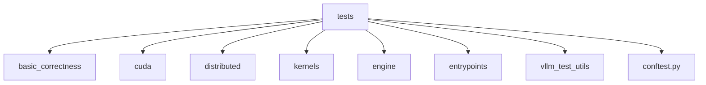
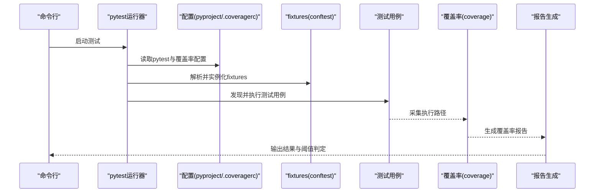
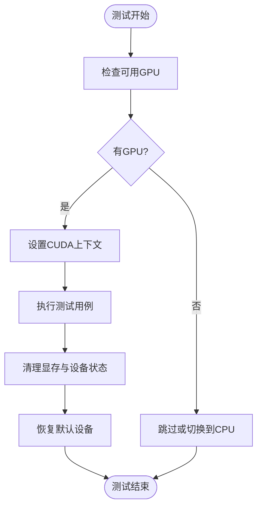
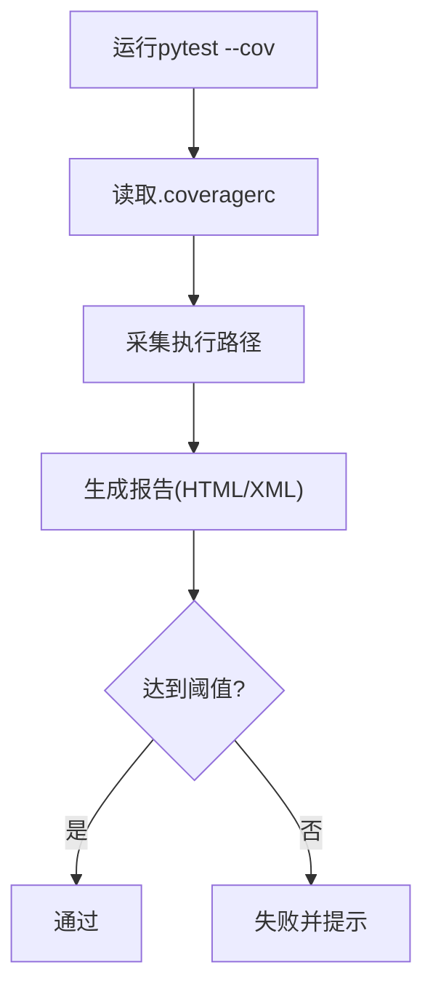
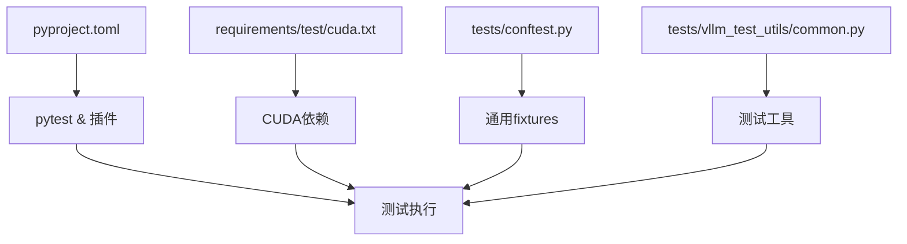

# 单元测试

<cite>
**本文引用的文件**   
- [tests/conftest.py](file://tests/conftest.py)
- [tests/cuda/test_cuda_context.py](file://tests/cuda/test_cuda_context.py)
- [tests/distributed/conftest.py](file://tests/distributed/conftest.py)
- [tests/kernels/utils.py](file://tests/kernels/utils.py)
- [tests/vllm_test_utils/common.py](file://tests/vllm_test_utils/common.py)
- [.coveragerc](file://.coveragerc)
- [codecov.yml](file://codecov.yml)
- [pyproject.toml](file://pyproject.toml)
- [requirements/test/cuda.txt](file://requirements/test/cuda.txt)
</cite>

## 目录
1. [简介](#简介)
2. [项目结构](#项目结构)
3. [核心组件](#核心组件)
4. [架构总览](#架构总览)
5. [详细组件分析](#详细组件分析)
6. [依赖分析](#依赖分析)
7. [性能考虑](#性能考虑)
8. [故障排查指南](#故障排查指南)
9. [结论](#结论)
10. [附录](#附录)

## 简介
本文件面向vLLM项目的单元测试实践，聚焦pytest框架的使用与最佳实践。内容涵盖测试用例的组织结构、fixtures使用、参数化测试、异步测试、高质量测试编写规范（命名、断言、数据准备）、GPU相关测试的特殊处理（CUDA上下文管理与设备资源清理），以及测试覆盖率统计的配置与使用（报告生成与阈值设置）。同时提供常见测试场景的示例指引，包括模型推理测试、API接口测试和性能回归测试。

## 项目结构
vLLM的测试代码集中在tests目录下，按功能域划分模块，例如：
- 基础正确性与内存/预取等：basic_correctness
- CUDA与平台相关：cuda
- 分布式通信与并行策略：distributed
- 内核级算子验证：kernels
- 引擎与入口点：engine、entrypoints
- 工具与通用fixture：vllm_test_utils
- 顶层配置与公共fixture：conftest.py

**章节来源**
- [tests/conftest.py](file://tests/conftest.py)
- [tests/cuda/test_cuda_context.py](file://tests/cuda/test_cuda_context.py)
- [tests/distributed/conftest.py](file://tests/distributed/conftest.py)
- [tests/kernels/utils.py](file://tests/kernels/utils.py)
- [tests/vllm_test_utils/common.py](file://tests/vllm_test_utils/common.py)

## 核心组件
- pytest主配置与插件：通过pyproject.toml集中管理pytest行为与插件依赖；测试依赖在requirements/test下按平台拆分。
- 全局与模块级fixtures：tests/conftest.py定义跨模块可用的夹具，如设备选择、随机种子、临时目录、日志级别等。
- GPU/CUDA专用夹具：tests/cuda/test_cuda_context.py展示如何管理CUDA上下文、设备切换与资源释放。
- 分布式测试夹具：tests/distributed/conftest.py提供进程组初始化、rank/world大小等分布式环境准备。
- 内核测试工具：tests/kernels/utils.py封装数值比较、容差控制、设备一致性校验等常用方法。
- 通用测试工具：tests/vllm_test_utils/common.py提供统一的测试辅助函数与数据构造器。

**章节来源**
- [pyproject.toml](file://pyproject.toml)
- [requirements/test/cuda.txt](file://requirements/test/cuda.txt)
- [tests/conftest.py](file://tests/conftest.py)
- [tests/cuda/test_cuda_context.py](file://tests/cuda/test_cuda_context.py)
- [tests/distributed/conftest.py](file://tests/distributed/conftest.py)
- [tests/kernels/utils.py](file://tests/kernels/utils.py)
- [tests/vllm_test_utils/common.py](file://tests/vllm_test_utils/common.py)

## 架构总览
下图展示了pytest执行流程与关键组件交互关系，包括配置文件加载、fixtures解析、测试发现与执行、覆盖率收集与报告生成。

**图示来源**
- [pyproject.toml](file://pyproject.toml)
- [.coveragerc](file://.coveragerc)
- [codecov.yml](file://codecov.yml)
- [tests/conftest.py](file://tests/conftest.py)

## 详细组件分析

### 测试组织与命名规范
- 文件命名：以test_前缀或_tests后缀标识测试文件，便于pytest自动发现。
- 类与函数命名：
  - 测试函数以test_开头，描述具体行为，如“当输入为空时应返回空列表”。
  - 测试类用于分组相关用例，类名建议以Test开头。
- 分层组织：
  - 单元层：针对函数/类的最小可测单元。
  - 集成层：组合多个模块进行端到端验证（如引擎+模型）。
  - 系统层：覆盖服务/接口/性能回归。

**章节来源**
- [tests/conftest.py](file://tests/conftest.py)
- [tests/kernels/utils.py](file://tests/kernels/utils.py)

### fixtures使用与最佳实践
- 作用域选择：
  - function：每个测试函数独立实例化，适合隔离性要求高的场景。
  - class/module/session：共享对象，减少重复开销，但需注意状态污染。
- 生命周期管理：
  - 使用yield实现teardown逻辑，确保资源释放。
  - 对GPU/CPU设备切换、临时文件、网络端口等进行显式清理。
- 参数化fixtures：
  - 结合@pytest.mark.parametrize为同一fixture提供多组输入。
- 条件跳过与标记：
  - 使用pytest.mark.skipif根据环境（如是否GPU）动态跳过。

**章节来源**
- [tests/conftest.py](file://tests/conftest.py)
- [tests/cuda/test_cuda_context.py](file://tests/cuda/test_cuda_context.py)
- [tests/distributed/conftest.py](file://tests/distributed/conftest.py)

### 参数化测试
- 使用@pytest.mark.parametrize传入多组参数，覆盖边界值、典型值与异常值。
- 结合fixture实现复杂数据结构的多组合。
- 对长耗时用例添加标记以便选择性执行。

**章节来源**
- [tests/kernels/utils.py](file://tests/kernels/utils.py)
- [tests/vllm_test_utils/common.py](file://tests/vllm_test_utils/common.py)

### 异步测试
- 使用pytest-asyncio支持async def测试函数。
- 合理设置事件循环与超时，避免阻塞。
- 对异步I/O（如网络请求、GPU异步调用）进行mock或隔离。

**章节来源**
- [pyproject.toml](file://pyproject.toml)

### 高质量测试用例编写
- 命名规范：清晰表达意图，避免模糊名称。
- 断言方法：
  - 优先使用pytest内置断言（assert），配合自定义异常类型。
  - 数值比较使用近似相等（如allclose）并明确容差。
- 测试数据准备：
  - 使用固定种子保证可重复性。
  - 小数据集快速验证，大数据集用于回归与性能测试。
- 可维护性：
  - 将通用逻辑抽取到fixtures或工具模块。
  - 避免硬编码路径与敏感信息。

**章节来源**
- [tests/kernels/utils.py](file://tests/kernels/utils.py)
- [tests/vllm_test_utils/common.py](file://tests/vllm_test_utils/common.py)

### GPU相关测试特殊处理
- CUDA上下文管理：
  - 在测试开始前设置设备，避免隐式初始化导致的状态污染。
  - 使用torch.cuda.empty_cache()或等效方法释放显存。
- 设备资源清理：
  - 确保每个测试结束后恢复默认设备。
  - 对分布式场景，需清理进程组与NCCL通信资源。
- 条件执行：
  - 检测可用GPU数量，无GPU时跳过或降级为CPU模式。

**图示来源**
- [tests/cuda/test_cuda_context.py](file://tests/cuda/test_cuda_context.py)
- [tests/distributed/conftest.py](file://tests/distributed/conftest.py)

**章节来源**
- [tests/cuda/test_cuda_context.py](file://tests/cuda/test_cuda_context.py)
- [tests/distributed/conftest.py](file://tests/distributed/conftest.py)

### 测试覆盖率统计配置与使用
- 配置文件：
  - .coveragerc：定义覆盖率采集范围、忽略规则、阈值。
  - codecov.yml：上传覆盖率至Codecov平台，设置分支与PR策略。
  - pyproject.toml：集成pytest-cov插件，统一命令与参数。
- 报告生成：
  - 本地生成HTML/XML报告，便于CI/CD集成。
  - 设置最低覆盖率阈值，未达标则失败。
- 最佳实践：
  - 排除第三方库与生成代码。
  - 区分单元测试与集成测试的覆盖率目标。

**图示来源**
- [.coveragerc](file://.coveragerc)
- [codecov.yml](file://codecov.yml)
- [pyproject.toml](file://pyproject.toml)

**章节来源**
- [.coveragerc](file://.coveragerc)
- [codecov.yml](file://codecov.yml)
- [pyproject.toml](file://pyproject.toml)

### 常见测试场景示例指引
- 模型推理测试：
  - 使用轻量模型与短序列验证基本正确性。
  - 对比不同后端（如CUDA vs CPU）的输出一致性。
  - 参考路径：tests/basic_correctness、tests/models。
- API接口测试：
  - 模拟HTTP请求，验证响应结构与状态码。
  - 覆盖错误路径（非法输入、超时、限流）。
  - 参考路径：tests/entrypoints/openai、tests/entrypoints/serve。
- 性能回归测试：
  - 固定批大小、序列长度与采样参数。
  - 记录延迟与吞吐指标，设定回归阈值。
  - 参考路径：benchmarks、tests/benchmarks。

**章节来源**
- [tests/basic_correctness](file://tests/basic_correctness)
- [tests/entrypoints/openai](file://tests/entrypoints/openai)
- [tests/entrypoints/serve](file://tests/entrypoints/serve)
- [benchmarks](file://benchmarks)
- [tests/benchmarks](file://tests/benchmarks)

## 依赖分析
- 测试依赖管理：
  - requirements/test/cuda.txt：CUDA相关测试依赖。
  - pyproject.toml：pytest、pytest-cov、pytest-asyncio等插件声明。
- 模块耦合：
  - tests/conftest.py被广泛引用，提供全局fixtures。
  - tests/vllm_test_utils/common.py作为通用工具，降低重复代码。
- 外部依赖：
  - torch、transformers、httpx等用于模型与API测试。
  - coverage、codecov用于覆盖率采集与上报。

**图示来源**
- [pyproject.toml](file://pyproject.toml)
- [requirements/test/cuda.txt](file://requirements/test/cuda.txt)
- [tests/conftest.py](file://tests/conftest.py)
- [tests/vllm_test_utils/common.py](file://tests/vllm_test_utils/common.py)

**章节来源**
- [pyproject.toml](file://pyproject.toml)
- [requirements/test/cuda.txt](file://requirements/test/cuda.txt)
- [tests/conftest.py](file://tests/conftest.py)
- [tests/vllm_test_utils/common.py](file://tests/vllm_test_utils/common.py)

## 性能考虑
- 测试数据规模：
  - 单元测试使用最小数据集，集成测试逐步放大。
- 并行执行：
  - 使用pytest-xdist加速，注意资源竞争与状态隔离。
- GPU内存管理：
  - 避免显存泄漏，及时释放中间结果。
  - 对长耗时测试添加超时与重试机制。
- 缓存与复用：
  - 复用已构建的模型权重与tokenizer，减少重复加载。

[本节为通用指导，不直接分析具体文件]

## 故障排查指南
- 常见问题：
  - CUDA未初始化或设备不可用：检查环境变量与驱动版本。
  - 分布式测试失败：确认进程组初始化与端口占用。
  - 覆盖率阈值失败：调整忽略规则或优化低覆盖代码。
- 调试技巧：
  - 使用pytest -v查看详细输出。
  - 添加logging与断点定位问题。
  - 隔离单条用例复现问题。

**章节来源**
- [tests/cuda/test_cuda_context.py](file://tests/cuda/test_cuda_context.py)
- [tests/distributed/conftest.py](file://tests/distributed/conftest.py)
- [.coveragerc](file://.coveragerc)

## 结论
通过规范的pytest实践、合理的fixtures设计、严格的GPU资源管理与覆盖率监控，vLLM的测试体系能够有效保障代码质量与稳定性。建议持续优化测试结构、完善边缘场景覆盖，并结合CI/CD实现自动化质量门禁。

[本节为总结性内容，不直接分析具体文件]

## 附录
- 推荐命令：
  - 运行全部测试：pytest
  - 指定目录：pytest tests/kernels
  - 生成覆盖率：pytest --cov=vllm --cov-report=html
  - 异步测试：pytest --asyncio-mode=auto
- 参考文件：
  - 配置：.coveragerc、codecov.yml、pyproject.toml
  - 夹具：tests/conftest.py、tests/distributed/conftest.py
  - 工具：tests/kernels/utils.py、tests/vllm_test_utils/common.py

**章节来源**
- [.coveragerc](file://.coveragerc)
- [codecov.yml](file://codecov.yml)
- [pyproject.toml](file://pyproject.toml)
- [tests/conftest.py](file://tests/conftest.py)
- [tests/distributed/conftest.py](file://tests/distributed/conftest.py)
- [tests/kernels/utils.py](file://tests/kernels/utils.py)
- [tests/vllm_test_utils/common.py](file://tests/vllm_test_utils/common.py)