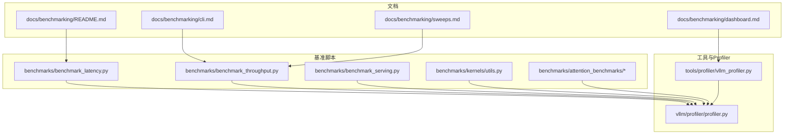
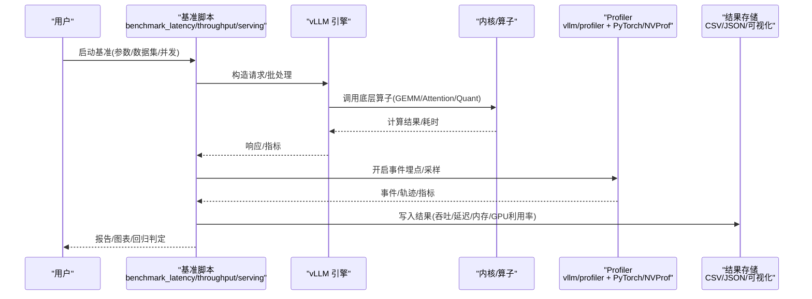
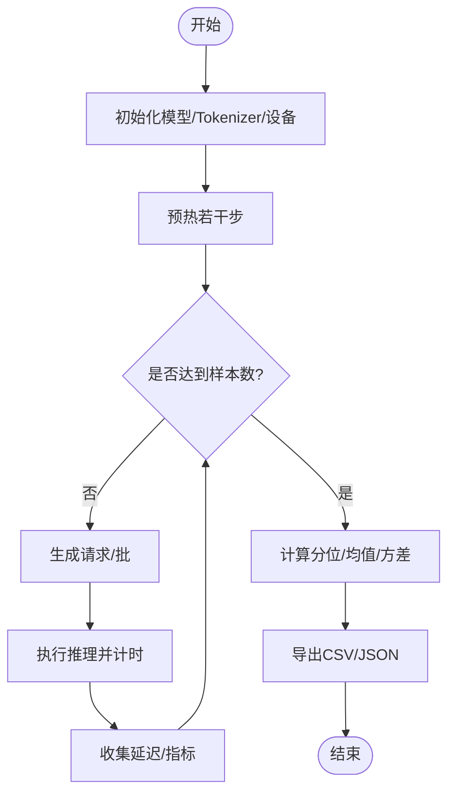
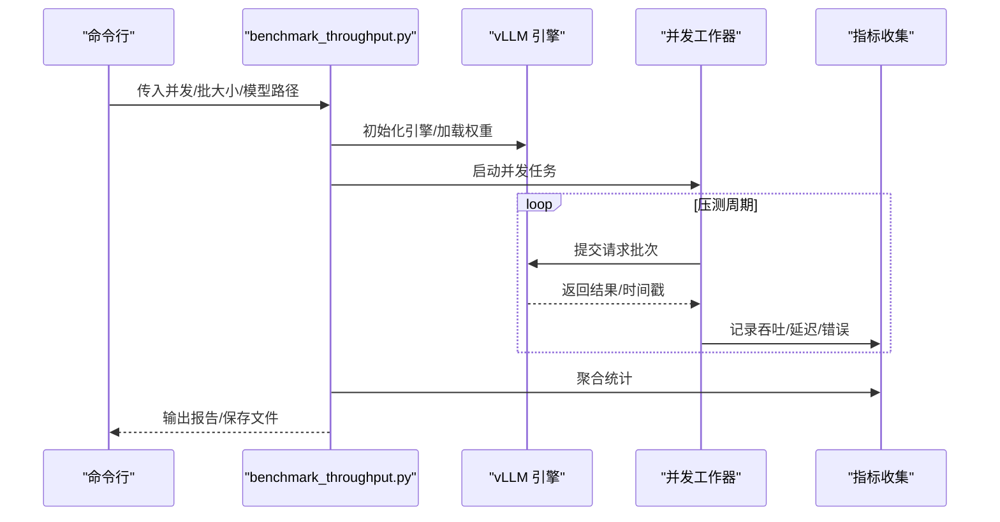
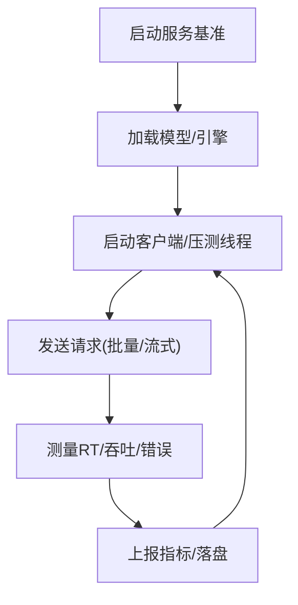
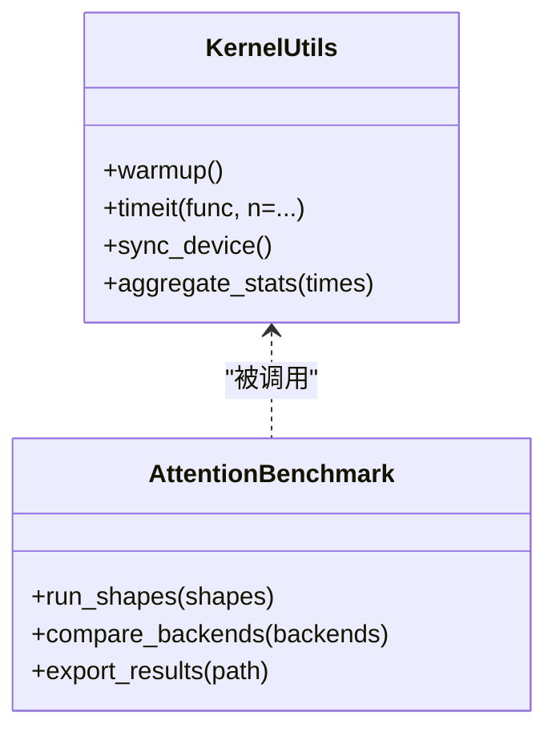
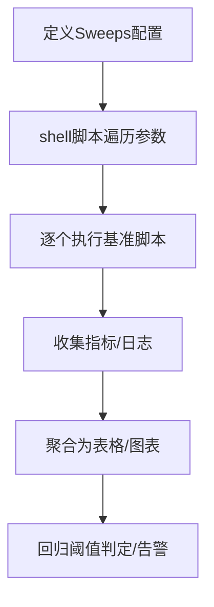
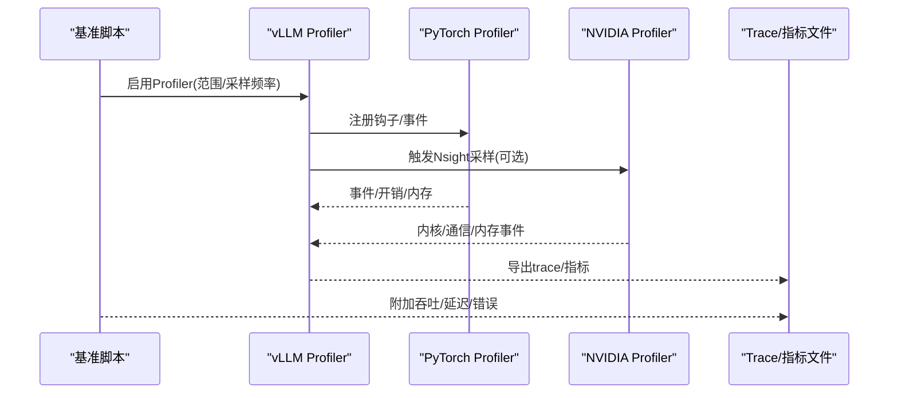
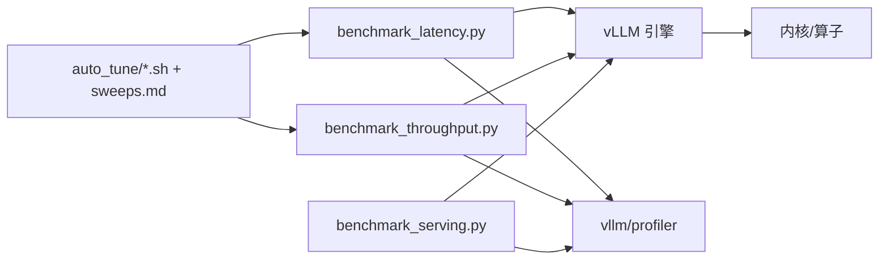

# 性能基准测试

<cite>
**本文引用的文件**   
- [benchmarks/README.md](file://benchmarks/README.md)
- [benchmarks/benchmark_latency.py](file://benchmarks/benchmark_latency.py)
- [benchmarks/benchmark_throughput.py](file://benchmarks/benchmark_throughput.py)
- [benchmarks/benchmark_serving.py](file://benchmarks/benchmark_serving.py)
- [benchmarks/benchmark_utils.py](file://benchmarks/benchmark_utils.py)
- [benchmarks/kernels/utils.py](file://benchmarks/kernels/utils.py)
- [benchmarks/attention_benchmarks/README.md](file://benchmarks/attention_benchmarks/README.md)
- [benchmarks/attention_benchmarks/benchmark.py](file://benchmarks/attention_benchmarks/benchmark.py)
- [benchmarks/attention_benchmarks/runner.py](file://benchmarks/attention_benchmarks/runner.py)
- [benchmarks/auto_tune/auto_tune.sh](file://benchmarks/auto_tune/auto_tune.sh)
- [benchmarks/auto_tune/batch_auto_tune.sh](file://benchmarks/auto_tune/batch_auto_tune.sh)
- [scripts/benchmark_helion_kernels.py](file://scripts/benchmark_helion_kernels.py)
- [tools/profiler/vllm_profiler.py](file://tools/profiler/vllm_profiler.py)
- [vllm/profiler/profiler.py](file://vllm/profiler/profiler.py)
- [docs/benchmarking/README.md](file://docs/benchmarking/README.md)
- [docs/benchmarking/cli.md](file://docs/benchmarking/cli.md)
- [docs/benchmarking/dashboard.md](file://docs/benchmarking/dashboard.md)
- [docs/benchmarking/sweeps.md](file://docs/benchmarking/sweeps.md)
</cite>

## 目录
1. [简介](#简介)
2. [项目结构](#项目结构)
3. [核心组件](#核心组件)
4. [架构总览](#架构总览)
5. [详细组件分析](#详细组件分析)
6. [依赖关系分析](#依赖关系分析)
7. [性能考量](#性能考量)
8. [故障排查指南](#故障排查指南)
9. [结论](#结论)
10. [附录](#附录)

## 简介
本文件面向 vLLM 的性能基准与优化实践，覆盖以下目标：
- 基准框架使用方法：内置脚本执行、参数说明、结果输出与可视化。
- 自定义基准编写：如何扩展新的场景与指标采集。
- 关键性能指标测量：吞吐量、延迟、内存使用率、GPU 利用率等。
- 性能分析工具：NVIDIA Profiler、PyTorch Profiler、vLLM 内置 profiler 及自定义计数器。
- 结果分析方法：回归检测、优化效果评估、趋势对比。
- 常见问题诊断：内存泄漏、GPU 内存碎片、计算瓶颈识别。
- 优化最佳实践与调优建议。

## 项目结构
vLLM 的基准与性能相关代码主要分布在以下位置：
- benchmarks：Python 基准脚本集合（端到端吞吐/延迟、内核级基准、注意力基准、自动调参脚本等）。
- scripts：辅助脚本（如 Helion 内核基准）。
- tools/profiler：性能分析工具入口与集成。
- vllm/profiler：vLLM 内部 profiler 实现。
- docs/benchmarking：官方基准文档（CLI、Dashboard、Sweeps）。

图表来源
- [benchmarks/benchmark_latency.py](file://benchmarks/benchmark_latency.py)
- [benchmarks/benchmark_throughput.py](file://benchmarks/benchmark_throughput.py)
- [benchmarks/benchmark_serving.py](file://benchmarks/benchmark_serving.py)
- [benchmarks/kernels/utils.py](file://benchmarks/kernels/utils.py)
- [benchmarks/attention_benchmarks/benchmark.py](file://benchmarks/attention_benchmarks/benchmark.py)
- [tools/profiler/vllm_profiler.py](file://tools/profiler/vllm_profiler.py)
- [vllm/profiler/profiler.py](file://vllm/profiler/profiler.py)
- [docs/benchmarking/README.md](file://docs/benchmarking/README.md)
- [docs/benchmarking/cli.md](file://docs/benchmarking/cli.md)
- [docs/benchmarking/dashboard.md](file://docs/benchmarking/dashboard.md)
- [docs/benchmarking/sweeps.md](file://docs/benchmarking/sweeps.md)

章节来源
- [benchmarks/README.md](file://benchmarks/README.md)
- [docs/benchmarking/README.md](file://docs/benchmarking/README.md)

## 核心组件
- 端到端基准脚本
  - 延迟基准：benchmark_latency.py，用于测量请求级延迟分布与分位值。
  - 吞吐基准：benchmark_throughput.py，用于测量不同并发下的吞吐与延迟。
  - 服务基准：benchmark_serving.py，模拟在线服务负载，评估端到端 QPS/TPS。
- 内核与算子基准
  - kernels/utils.py：通用计时、设备同步、重复预热、统计汇总等工具。
  - attention_benchmarks：注意力算子级基准，支持多配置扫描与结果导出。
- 自动调参与扫描
  - auto_tune/*.sh：批量参数扫描与结果聚合脚本。
  - docs/benchmarking/sweeps.md：Sweeps 配置与运行方法。
- 性能分析工具
  - tools/profiler/vllm_profiler.py：vLLM 专用 Profiler 入口，集成 PyTorch/NVProf。
  - vllm/profiler/profiler.py：内部 Profiler 实现，提供事件埋点与指标收集。

章节来源
- [benchmarks/benchmark_latency.py](file://benchmarks/benchmark_latency.py)
- [benchmarks/benchmark_throughput.py](file://benchmarks/benchmark_throughput.py)
- [benchmarks/benchmark_serving.py](file://benchmarks/benchmark_serving.py)
- [benchmarks/kernels/utils.py](file://benchmarks/kernels/utils.py)
- [benchmarks/attention_benchmarks/README.md](file://benchmarks/attention_benchmarks/README.md)
- [benchmarks/attention_benchmarks/benchmark.py](file://benchmarks/attention_benchmarks/benchmark.py)
- [benchmarks/auto_tune/auto_tune.sh](file://benchmarks/auto_tune/auto_tune.sh)
- [benchmarks/auto_tune/batch_auto_tune.sh](file://benchmarks/auto_tune/batch_auto_tune.sh)
- [tools/profiler/vllm_profiler.py](file://tools/profiler/vllm_profiler.py)
- [vllm/profiler/profiler.py](file://vllm/profiler/profiler.py)
- [docs/benchmarking/sweeps.md](file://docs/benchmarking/sweeps.md)

## 架构总览
下图展示从“基准脚本”到“引擎/内核”再到“Profiler/工具链”的整体数据流与控制流。

图表来源
- [benchmarks/benchmark_latency.py](file://benchmarks/benchmark_latency.py)
- [benchmarks/benchmark_throughput.py](file://benchmarks/benchmark_throughput.py)
- [benchmarks/benchmark_serving.py](file://benchmarks/benchmark_serving.py)
- [vllm/profiler/profiler.py](file://vllm/profiler/profiler.py)
- [tools/profiler/vllm_profiler.py](file://tools/profiler/vllm_profiler.py)

## 详细组件分析

### 端到端延迟基准（benchmark_latency.py）
- 功能要点
  - 生成随机或真实文本输入，控制序列长度与批大小。
  - 多次预热后测量首 token 延迟、每 token 延迟、P50/P90/P99。
  - 可选开启 Profiler 以采集 GPU/CPU 事件。
- 关键流程
  - 初始化模型与 tokenizer -> 构建请求 -> 预热 -> 循环测量 -> 统计分位 -> 输出 CSV/JSON。
- 适用场景
  - 离线推理、批大小敏感性分析、不同后端/量化策略对比。

图表来源
- [benchmarks/benchmark_latency.py](file://benchmarks/benchmark_latency.py)

章节来源
- [benchmarks/benchmark_latency.py](file://benchmarks/benchmark_latency.py)

### 端到端吞吐基准（benchmark_throughput.py）
- 功能要点
  - 支持多种并发度与请求到达模式（均匀/突发）。
  - 测量整体吞吐（tokens/s）、请求吞吐（req/s）、延迟分布。
  - 可结合 Sweeps 进行参数扫描（batch_size、max_tokens、num_workers 等）。
- 关键流程
  - 参数解析 -> 加载模型 -> 创建并发工作器 -> 压测循环 -> 指标聚合 -> 结果导出。
- 适用场景
  - 容量规划、最大并发选择、不同并行策略（张量/流水线/上下文）对比。

图表来源
- [benchmarks/benchmark_throughput.py](file://benchmarks/benchmark_throughput.py)
- [docs/benchmarking/sweeps.md](file://docs/benchmarking/sweeps.md)

章节来源
- [benchmarks/benchmark_throughput.py](file://benchmarks/benchmark_throughput.py)
- [docs/benchmarking/sweeps.md](file://docs/benchmarking/sweeps.md)

### 服务基准（benchmark_serving.py）
- 功能要点
  - 模拟在线服务场景（OpenAI/HTTP），支持流式与非流式。
  - 测量 QPS、P95/P99 延迟、错误率、资源占用。
  - 可与 Prometheus/Grafana 集成，持续观测。
- 关键流程
  - 启动服务端/客户端 -> 发送请求 -> 统计响应时间 -> 周期性上报指标。

图表来源
- [benchmarks/benchmark_serving.py](file://benchmarks/benchmark_serving.py)

章节来源
- [benchmarks/benchmark_serving.py](file://benchmarks/benchmark_serving.py)

### 内核与算子基准（kernels/utils.py 与 attention_benchmarks）
- kernels/utils.py
  - 提供统一计时、设备同步、重复执行、统计汇总等基础能力。
  - 适合封装任意 CUDA/Triton/自定义算子的基准。
- attention_benchmarks
  - 针对注意力变体（FlashAttention/FA3/MLA 等）的多配置基准。
  - 支持形状扫描、精度/速度权衡、结果导出。

图表来源
- [benchmarks/kernels/utils.py](file://benchmarks/kernels/utils.py)
- [benchmarks/attention_benchmarks/benchmark.py](file://benchmarks/attention_benchmarks/benchmark.py)
- [benchmarks/attention_benchmarks/runner.py](file://benchmarks/attention_benchmarks/runner.py)

章节来源
- [benchmarks/kernels/utils.py](file://benchmarks/kernels/utils.py)
- [benchmarks/attention_benchmarks/README.md](file://benchmarks/attention_benchmarks/README.md)
- [benchmarks/attention_benchmarks/benchmark.py](file://benchmarks/attention_benchmarks/benchmark.py)
- [benchmarks/attention_benchmarks/runner.py](file://benchmarks/attention_benchmarks/runner.py)

### 自动调参与 Sweeps
- auto_tune/*.sh
  - 批量遍历参数组合（如 batch_size、max_num_seqs、gpu_memory_utilization 等）。
  - 聚合结果并生成对比表格。
- docs/benchmarking/sweeps.md
  - 定义 Sweeps 配置文件格式与运行方式，支持自动化回归检查。

图表来源
- [benchmarks/auto_tune/auto_tune.sh](file://benchmarks/auto_tune/auto_tune.sh)
- [benchmarks/auto_tune/batch_auto_tune.sh](file://benchmarks/auto_tune/batch_auto_tune.sh)
- [docs/benchmarking/sweeps.md](file://docs/benchmarking/sweeps.md)

章节来源
- [benchmarks/auto_tune/auto_tune.sh](file://benchmarks/auto_tune/auto_tune.sh)
- [benchmarks/auto_tune/batch_auto_tune.sh](file://benchmarks/auto_tune/batch_auto_tune.sh)
- [docs/benchmarking/sweeps.md](file://docs/benchmarking/sweeps.md)

### 性能分析工具（Profiler）
- tools/profiler/vllm_profiler.py
  - vLLM 专用 Profiler 入口，支持 PyTorch Profiler、NVIDIA Nsight Systems/Compute 集成。
  - 可指定事件范围、导出 trace、合并多进程轨迹。
- vllm/profiler/profiler.py
  - 内部事件埋点、指标收集、GPU/CPU 利用率采样。
  - 与基准脚本联动，输出结构化结果供后续分析。

图表来源
- [tools/profiler/vllm_profiler.py](file://tools/profiler/vllm_profiler.py)
- [vllm/profiler/profiler.py](file://vllm/profiler/profiler.py)

章节来源
- [tools/profiler/vllm_profiler.py](file://tools/profiler/vllm_profiler.py)
- [vllm/profiler/profiler.py](file://vllm/profiler/profiler.py)

## 依赖关系分析
- 基准脚本依赖 vLLM 引擎与内核库，通过统一的接口发起推理。
- Profiler 作为横切关注点，被各基准脚本按需启用，不影响主路径性能（默认关闭）。
- Sweeps 与 shell 脚本负责参数化执行与结果聚合，形成闭环的回归检测。

图表来源
- [benchmarks/benchmark_latency.py](file://benchmarks/benchmark_latency.py)
- [benchmarks/benchmark_throughput.py](file://benchmarks/benchmark_throughput.py)
- [benchmarks/benchmark_serving.py](file://benchmarks/benchmark_serving.py)
- [vllm/profiler/profiler.py](file://vllm/profiler/profiler.py)
- [benchmarks/auto_tune/auto_tune.sh](file://benchmarks/auto_tune/auto_tune.sh)
- [docs/benchmarking/sweeps.md](file://docs/benchmarking/sweeps.md)

章节来源
- [benchmarks/benchmark_latency.py](file://benchmarks/benchmark_latency.py)
- [benchmarks/benchmark_throughput.py](file://benchmarks/benchmark_throughput.py)
- [benchmarks/benchmark_serving.py](file://benchmarks/benchmark_serving.py)
- [vllm/profiler/profiler.py](file://vllm/profiler/profiler.py)
- [benchmarks/auto_tune/auto_tune.sh](file://benchmarks/auto_tune/auto_tune.sh)
- [docs/benchmarking/sweeps.md](file://docs/benchmarking/sweeps.md)

## 性能考量
- 指标定义与采集
  - 吞吐量：tokens/s、req/s；注意区分预填充与解码阶段。
  - 延迟：首 token 延迟、每 token 延迟、P50/P90/P99。
  - 资源：CPU/GPU 利用率、显存峰值/均值、带宽占用。
- 实验设计
  - 预热充分、重复多次取稳健统计；固定随机种子保证可复现。
  - 控制变量：模型版本、权重、CUDA/cuDNN/TensorRT-LLM 版本一致。
- 结果解读
  - 关注长尾延迟（P95/P99）而非仅均值；结合系统负载观察抖动。
  - 将吞吐与延迟共同绘制，避免“高吞吐但不可接受延迟”的陷阱。

[本节为通用指导，不直接分析具体文件]

## 故障排查指南
- 内存泄漏检测
  - 使用 vLLM Profiler 与 PyTorch Profiler 跟踪分配/释放；对比基线显存曲线。
  - 在长时间压测中监控显存增长斜率，定位未释放对象。
- GPU 内存碎片分析
  - 借助 NVIDIA Profiler 查看内存分配热点与碎片化程度。
  - 调整缓存池大小、减少频繁小对象分配。
- 计算瓶颈识别
  - 通过 Profiler 的 kernel 时间占比排序，定位 GEMM/Attention/Quant 热点。
  - 结合内核基准（kernels/utils.py）验证单核性能变化。
- 常见症状与对策
  - 吞吐下降：检查 I/O 瓶颈、序列化开销、通信开销（多卡/多机）。
  - 延迟尖刺：关注 GC、锁竞争、调度不均、网络抖动。
  - OOM：降低 batch_size、启用 KV Cache 压缩/卸载、增大显存上限。

章节来源
- [tools/profiler/vllm_profiler.py](file://tools/profiler/vllm_profiler.py)
- [vllm/profiler/profiler.py](file://vllm/profiler/profiler.py)
- [benchmarks/kernels/utils.py](file://benchmarks/kernels/utils.py)

## 结论
- vLLM 提供了完善的基准与 Profiler 体系，覆盖端到端与内核级场景。
- 通过 Sweeps 与自动化脚本可实现稳定的回归检测与优化评估。
- 建议将基准纳入 CI/CD，结合 Dashboard 长期追踪性能趋势。
- 优化应围绕“吞吐-延迟-资源”三角平衡展开，基于数据驱动决策。

[本节为总结性内容，不直接分析具体文件]

## 附录
- 常用命令与参考
  - 延迟基准：参考 benchmark_latency.py 的参数与示例。
  - 吞吐基准：参考 benchmark_throughput.py 与 docs/benchmarking/sweeps.md。
  - 服务基准：参考 benchmark_serving.py 与 docs/benchmarking/dashboard.md。
  - 内核基准：参考 benchmarks/kernels/utils.py 与 attention_benchmarks。
  - Profiler：参考 tools/profiler/vllm_profiler.py 与 vllm/profiler/profiler.py。
- 最佳实践清单
  - 固定环境、充分预热、多次重复、记录随机种子。
  - 分层基准（端到端+内核）结合，定位问题更精准。
  - 建立基线与阈值，自动化回归检测与告警。
  - 定期更新依赖（CUDA/Torch/TrtLLM），确保可比性。

[本节为补充信息，不直接分析具体文件]