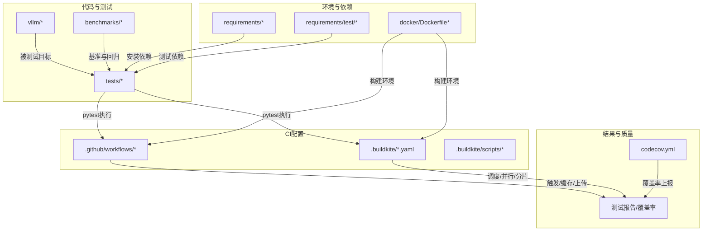
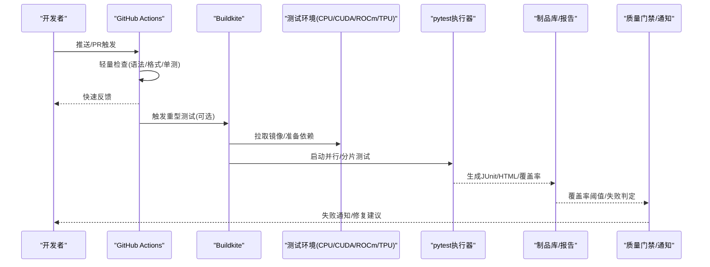
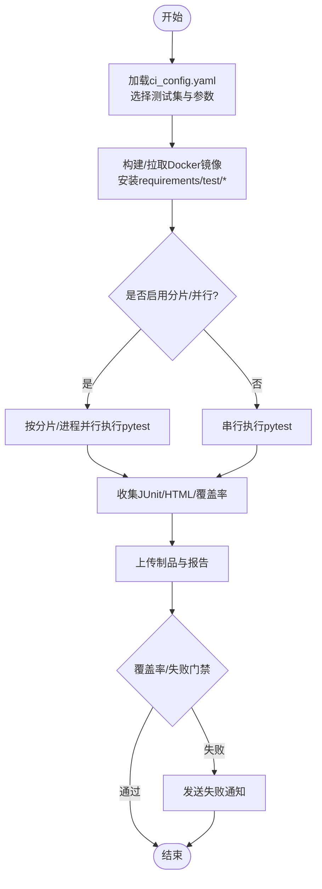
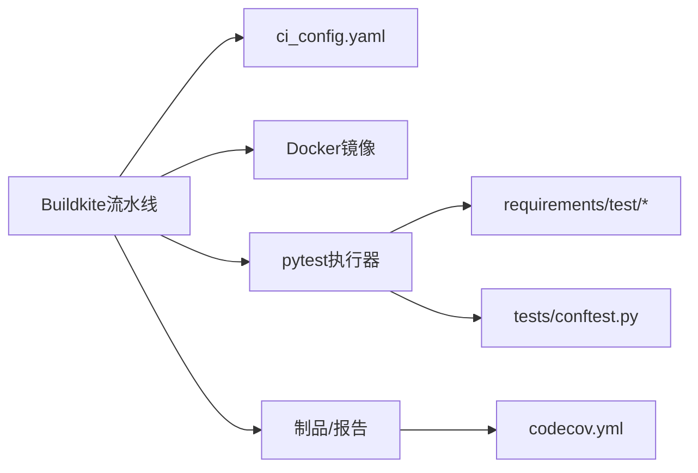

# 持续集成测试

<cite>
**本文引用的文件**   
- [.buildkite/ci_config.yaml](file://.buildkite/ci_config.yaml)
- [.buildkite/test-pipeline.yaml](file://.buildkite/test-pipeline.yaml)
- [.buildkite/test-amd.yaml](file://.buildkite/test-amd.yaml)
- [.buildkite/ci_config_rocm.yaml](file://.buildkite/ci_config_rocm.yaml)
- [.buildkite/ci_config_intel.yaml](file://.buildkite/ci_config_intel.yaml)
- [.github/workflows](file://.github/workflows)
- [requirements/test/cuda.txt](file://requirements/test/cuda.txt)
- [requirements/test/rocm.txt](file://requirements/test/rocm.txt)
- [requirements/test/cpu.txt](file://requirements/test/cpu.txt)
- [requirements/tpu.txt](file://requirements/tpu.txt)
- [docker/Dockerfile.rocm](file://docker/Dockerfile.rocm)
- [docker/Dockerfile.tpu](file://docker/Dockerfile.tpu)
- [tests/conftest.py](file://tests/conftest.py)
- [codecov.yml](file://codecov.yml)
</cite>

## 目录
1. [简介](#简介)
2. [项目结构](#项目结构)
3. [核心组件](#核心组件)
4. [架构总览](#架构总览)
5. [详细组件分析](#详细组件分析)
6. [依赖关系分析](#依赖关系分析)
7. [性能考虑](#性能考虑)
8. [故障排除指南](#故障排除指南)
9. [结论](#结论)
10. [附录](#附录)

## 简介
本指南面向vLLM项目的持续集成（CI）与持续交付（CD），聚焦于GitHub Actions与Buildkite的流水线配置与管理，覆盖自动化测试策略（并行、分片、增量）、多环境测试（CPU、CUDA、ROCm、TPU）、测试结果收集与分析（报告、失败通知、质量门禁）、依赖与环境隔离最佳实践、自定义测试任务开发部署，以及性能优化与故障排除方法。目标是帮助贡献者与平台工程师快速搭建、维护并优化稳定高效的CI/CD体系。

## 项目结构
仓库将CI相关配置集中在两处：
- .github/workflows：GitHub Actions工作流定义
- .buildkite：Buildkite流水线与脚本、配置、子任务编排

此外，测试依赖通过requirements/test与顶层requirements管理；Docker镜像用于构建与运行不同硬件环境的测试容器；测试用例位于tests目录，并通过pytest框架组织执行。

图表来源
- [.buildkite/test-pipeline.yaml](file://.buildkite/test-pipeline.yaml)
- [.buildkite/ci_config.yaml](file://.buildkite/ci_config.yaml)
- [.github/workflows](file://.github/workflows)
- [requirements/test/cuda.txt](file://requirements/test/cuda.txt)
- [requirements/test/rocm.txt](file://requirements/test/rocm.txt)
- [requirements/test/cpu.txt](file://requirements/test/cpu.txt)
- [requirements/tpu.txt](file://requirements/tpu.txt)
- [docker/Dockerfile.rocm](file://docker/Dockerfile.rocm)
- [docker/Dockerfile.tpu](file://docker/Dockerfile.tpu)
- [codecov.yml](file://codecov.yml)

章节来源
- [.buildkite/ci_config.yaml](file://.buildkite/ci_config.yaml)
- [.buildkite/test-pipeline.yaml](file://.buildkite/test-pipeline.yaml)
- [.github/workflows](file://.github/workflows)
- [requirements/test/cuda.txt](file://requirements/test/cuda.txt)
- [requirements/test/rocm.txt](file://requirements/test/rocm.txt)
- [requirements/test/cpu.txt](file://requirements/test/cpu.txt)
- [requirements/tpu.txt](file://requirements/tpu.txt)
- [docker/Dockerfile.rocm](file://docker/Dockerfile.rocm)
- [docker/Dockerfile.tpu](file://docker/Dockerfile.tpu)
- [codecov.yml](file://codecov.yml)

## 核心组件
- Buildkite流水线与配置
  - test-pipeline.yaml：定义测试阶段、作业编排、并行度、分片策略、环境变量与产物上传
  - ci_config.yaml / ci_config_intel.yaml / ci_config_rocm.yaml：按硬件或厂商维度聚合测试集、选择器与参数
  - test-amd.yaml：AMD/ROCm相关测试任务编排
- GitHub Actions工作流
  - .github/workflows下包含PR检查、发布、文档构建等流程，通常与Buildkite互补（例如轻量校验在GH Actions，重型GPU测试在Buildkite）
- 测试框架与配置
  - pytest + tests/conftest.py：全局夹具、标记、设备检测、并行选项
  - requirements/test/*：按设备类型划分的依赖清单（CPU/CUDA/ROCm/TPU）
- Docker镜像
  - docker/Dockerfile.*：为不同硬件提供基础镜像（如rocm、tpu），确保环境一致性与可重复性
- 覆盖率与质量门禁
  - codecov.yml：覆盖率阈值、忽略规则、上报配置

章节来源
- [.buildkite/test-pipeline.yaml](file://.buildkite/test-pipeline.yaml)
- [.buildkite/ci_config.yaml](file://.buildkite/ci_config.yaml)
- [.buildkite/ci_config_intel.yaml](file://.buildkite/ci_config_intel.yaml)
- [.buildkite/ci_config_rocm.yaml](file://.buildkite/ci_config_rocm.yaml)
- [.buildkite/test-amd.yaml](file://.buildkite/test-amd.yaml)
- [tests/conftest.py](file://tests/conftest.py)
- [requirements/test/cuda.txt](file://requirements/test/cuda.txt)
- [requirements/test/rocm.txt](file://requirements/test/rocm.txt)
- [requirements/test/cpu.txt](file://requirements/test/cpu.txt)
- [requirements/tpu.txt](file://requirements/tpu.txt)
- [docker/Dockerfile.rocm](file://docker/Dockerfile.rocm)
- [docker/Dockerfile.tpu](file://docker/Dockerfile.tpu)
- [codecov.yml](file://codecov.yml)

## 架构总览
下图展示从代码提交到测试结果产出的端到端流程，涵盖GitHub Actions与Buildkite的双通道协作、多硬件环境、并行与分片执行、覆盖率上报与质量门禁。

图表来源
- [.buildkite/test-pipeline.yaml](file://.buildkite/test-pipeline.yaml)
- [.buildkite/ci_config.yaml](file://.buildkite/ci_config.yaml)
- [.github/workflows](file://.github/workflows)
- [codecov.yml](file://codecov.yml)

## 详细组件分析

### Buildkite流水线与配置
- 测试编排
  - 使用test-pipeline.yaml定义阶段（如构建、单元测试、集成测试、基准测试），每个阶段内可按设备类型拆分作业
  - 通过ci_config系列文件集中管理测试集、过滤条件与参数化变量，便于按硬件维度复用
- 并行与分片
  - 基于作业矩阵与pytest-xdist实现进程级并行
  - 通过pytest分片（如--numprocesses、--shard）将测试集均匀分配到多个节点，缩短整体耗时
- 环境隔离
  - 使用Docker镜像封装CUDA/ROCm/TPU驱动与依赖，保证一致性
  - 通过requirements/test/*精确控制Python包版本，避免漂移
- 产物与报告
  - 上传JUnit XML、HTML报告与覆盖率数据，供后续分析与门禁

图表来源
- [.buildkite/test-pipeline.yaml](file://.buildkite/test-pipeline.yaml)
- [.buildkite/ci_config.yaml](file://.buildkite/ci_config.yaml)
- [requirements/test/cuda.txt](file://requirements/test/cuda.txt)
- [requirements/test/rocm.txt](file://requirements/test/rocm.txt)
- [requirements/test/cpu.txt](file://requirements/test/cpu.txt)
- [requirements/tpu.txt](file://requirements/tpu.txt)
- [docker/Dockerfile.rocm](file://docker/Dockerfile.rocm)
- [docker/Dockerfile.tpu](file://docker/Dockerfile.tpu)

章节来源
- [.buildkite/test-pipeline.yaml](file://.buildkite/test-pipeline.yaml)
- [.buildkite/ci_config.yaml](file://.buildkite/ci_config.yaml)
- [.buildkite/ci_config_intel.yaml](file://.buildkite/ci_config_intel.yaml)
- [.buildkite/ci_config_rocm.yaml](file://.buildkite/ci_config_rocm.yaml)
- [.buildkite/test-amd.yaml](file://.buildkite/test-amd.yaml)

### GitHub Actions工作流
- 职责划分
  - PR/分支事件触发轻量检查（lint、格式化、快速单测），必要时触发Buildkite重型测试
  - 发布流程负责构建wheel、签名、上传制品
- 缓存与加速
  - 使用actions/cache或pip缓存层加速依赖安装
  - 对常用模型权重与数据集进行预缓存，减少下载时间
- 与Buildkite联动
  - 通过API或Webhook触发Buildkite流水线，统一入口与权限管理

章节来源
- [.github/workflows](file://.github/workflows)

### 测试框架与配置（pytest）
- 全局夹具与设备检测
  - tests/conftest.py中定义设备可用性检测、跳过逻辑与共享资源管理
- 标记与筛选
  - 使用pytest标记区分CPU/CUDA/ROCm/TPU测试，结合--mark表达式精准执行
- 并行与分片
  - 通过pytest-xdist与--numprocesses提升吞吐
  - 使用--shard-by-time或--shard-by-node均衡负载

章节来源
- [tests/conftest.py](file://tests/conftest.py)

### 依赖管理与环境隔离
- 分层依赖
  - requirements/common.txt：通用依赖
  - requirements/test/*：测试专用依赖（按设备分类）
  - requirements/{cpu,cuda,rocm,tpu}.txt：运行时依赖（按设备分类）
- 镜像隔离
  - docker/Dockerfile.*：针对不同硬件的基础镜像，固化驱动与系统库版本
- 版本锁定
  - 使用*.in与*.txt配合pip-tools锁定依赖，避免上游变更导致不稳定

章节来源
- [requirements/test/cuda.txt](file://requirements/test/cuda.txt)
- [requirements/test/rocm.txt](file://requirements/test/rocm.txt)
- [requirements/test/cpu.txt](file://requirements/test/cpu.txt)
- [requirements/tpu.txt](file://requirements/tpu.txt)
- [docker/Dockerfile.rocm](file://docker/Dockerfile.rocm)
- [docker/Dockerfile.tpu](file://docker/Dockerfile.tpu)

### 测试结果收集与分析
- 报告格式
  - JUnit XML：兼容CI平台与第三方工具
  - HTML报告：可读性强的测试详情
  - 覆盖率：通过coverage.py与codecov.yml配置阈值与忽略规则
- 失败通知
  - 在Buildkite/GitHub Actions中配置Slack/邮件/企业微信等通知渠道
- 质量门禁
  - 覆盖率阈值、关键路径测试通过率、回归基准阈值

章节来源
- [codecov.yml](file://codecov.yml)

### 自定义测试任务的开发与部署
- 新增测试集
  - 在tests目录下按功能域组织模块，添加pytest标记与夹具
  - 在ci_config系列文件中注册新测试集与执行参数
- 自定义作业
  - 在.test-pipeline.yaml中添加新阶段或作业，复用现有Docker镜像与依赖
- 本地验证
  - 使用pytest本地运行，确认标记、分片与并行行为符合预期

章节来源
- [.buildkite/test-pipeline.yaml](file://.buildkite/test-pipeline.yaml)
- [.buildkite/ci_config.yaml](file://.buildkite/ci_config.yaml)

## 依赖关系分析
下图展示测试执行过程中各组件之间的依赖关系，包括流水线、配置、依赖清单、镜像与测试框架。

图表来源
- [.buildkite/test-pipeline.yaml](file://.buildkite/test-pipeline.yaml)
- [.buildkite/ci_config.yaml](file://.buildkite/ci_config.yaml)
- [requirements/test/cuda.txt](file://requirements/test/cuda.txt)
- [requirements/test/rocm.txt](file://requirements/test/rocm.txt)
- [requirements/test/cpu.txt](file://requirements/test/cpu.txt)
- [requirements/tpu.txt](file://requirements/tpu.txt)
- [tests/conftest.py](file://tests/conftest.py)
- [codecov.yml](file://codecov.yml)

章节来源
- [.buildkite/test-pipeline.yaml](file://.buildkite/test-pipeline.yaml)
- [.buildkite/ci_config.yaml](file://.buildkite/ci_config.yaml)
- [tests/conftest.py](file://tests/conftest.py)
- [codecov.yml](file://codecov.yml)

## 性能考虑
- 并行与分片
  - 合理设置--numprocesses与分片粒度，避免内存溢出与上下文切换开销
- 缓存策略
  - 缓存Python包、模型权重与数据集，显著缩短冷启动时间
- I/O优化
  - 使用SSD与高带宽网络，减少磁盘与网络瓶颈
- GPU/TPU利用率
  - 针对CUDA/ROCm/TPU调整批大小与并发度，避免显存不足或设备空闲
- 增量测试
  - 基于git diff与pytest标记仅执行受影响模块，降低CI时长

[本节为通用指导，不直接分析具体文件]

## 故障排除指南
- 常见环境问题
  - CUDA/ROCm驱动版本不匹配：检查Docker镜像与主机驱动版本一致性
  - 依赖冲突：使用requirements/test/*锁定版本，避免上游变更
- 测试失败定位
  - 查看JUnit XML与HTML报告，定位失败用例与堆栈
  - 启用详细日志与重试机制，捕获偶发失败
- 覆盖率门禁失败
  - 根据codecov.yml调整阈值与忽略规则，确保关键路径覆盖
- 资源不足
  - 增加节点规格或减少并行度，避免OOM或超时

章节来源
- [codecov.yml](file://codecov.yml)
- [tests/conftest.py](file://tests/conftest.py)

## 结论
通过合理的流水线编排、严格的环境隔离、精细的依赖管理与完善的报告与门禁机制，vLLM的CI/CD体系能够在多硬件环境下高效、稳定地保障代码质量。建议持续优化并行与分片策略、完善增量测试与缓存机制，并建立完善的失败通知与回溯流程，以进一步提升研发效率与交付质量。

[本节为总结性内容，不直接分析具体文件]

## 附录
- 最佳实践清单
  - 使用Docker镜像隔离硬件依赖
  - 分层管理依赖，锁定版本
  - 通过pytest标记与分片提升执行效率
  - 配置覆盖率门禁与失败通知
  - 定期回顾与优化流水线配置

[本节为补充信息，不直接分析具体文件]