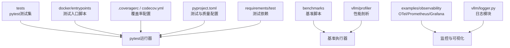
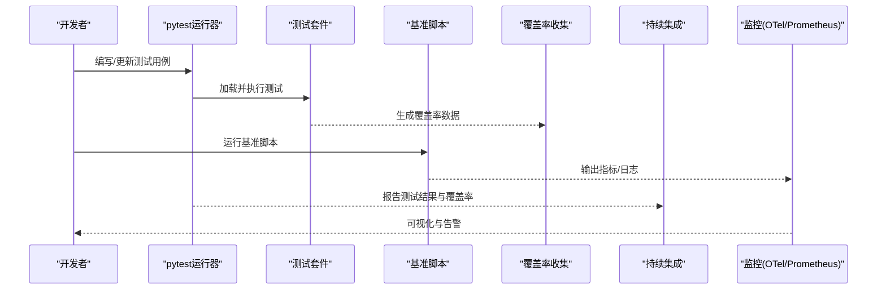
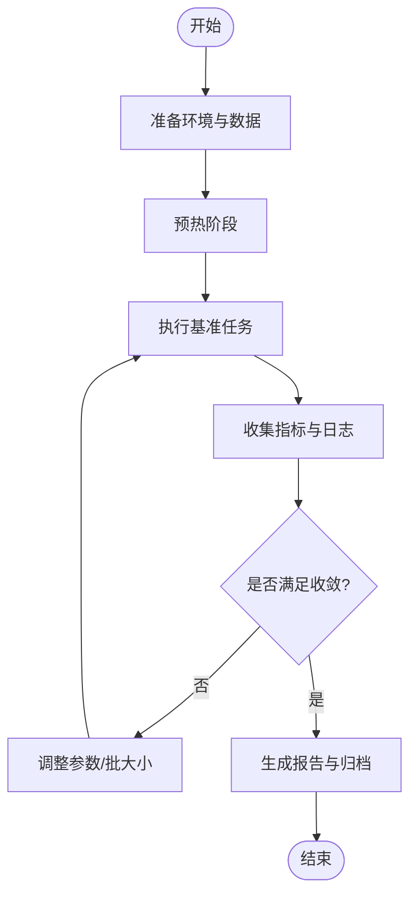
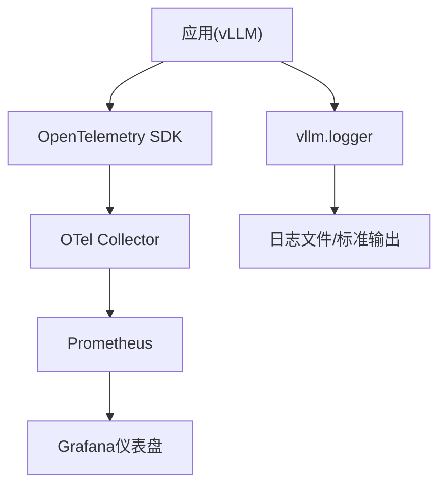
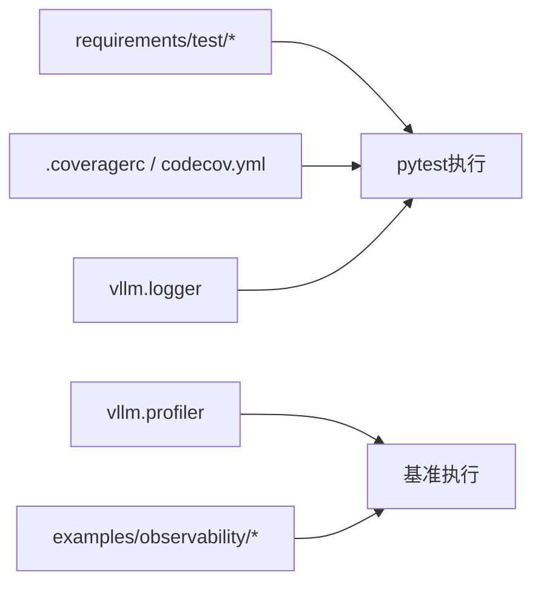

# 测试和调试指南

<cite>
**本文档引用的文件**
- [tests/conftest.py](file://tests/conftest.py)
- [tests/utils.py](file://tests/utils.py)
- [benchmarks/benchmark_serving.py](file://benchmarks/benchmark_serving.py)
- [benchmarks/benchmark_latency.py](file://benchmarks/benchmark_latency.py)
- [benchmarks/benchmark_throughput.py](file://benchmarks/benchmark_throughput.py)
- [.coveragerc](file://.coveragerc)
- [codecov.yml](file://codecov.yml)
- [pyproject.toml](file://pyproject.toml)
- [requirements/test/cuda.txt](file://requirements/test/cuda.txt)
- [requirements/test/cpu.txt](file://requirements/test/cpu.txt)
- [docker/entrypoints/test_vllm_nonroot_entrypoint.sh](file://docker/entrypoints/test_vllm_nonroot_entrypoint.sh)
- [examples/observability/prometheus_grafana/grafana-dashboards/vLLM.json](file://examples/observability/prometheus_grafana/grafana-dashboards/vLLM.json)
- [examples/observability/opentelemetry/otel-collector-config.yaml](file://examples/observability/opentelemetry/otel-collector-config.yaml)
- [vllm/logger.py](file://vllm/logger.py)
- [vllm/profiler/profiler.py](file://vllm/profiler/profiler.py)
- [scripts/benchmark_helion_kernels.py](file://scripts/benchmark_helion_kernels.py)
- [benchmarks/fused_kernels/layernorm_rms_benchmarks.py](file://benchmarks/fused_kernels/layernorm_rms_benchmarks.py)
</cite>

## 目录
1. [简介](#简介)
2. [项目结构](#项目结构)
3. [核心组件](#核心组件)
4. [架构总览](#架构总览)
5. [详细组件分析](#详细组件分析)
6. [依赖分析](#依赖分析)
7. [性能考虑](#性能考虑)
8. [故障排查指南](#故障排查指南)
9. [结论](#结论)
10. [附录](#附录)

## 简介
本指南面向vLLM的测试与调试实践，覆盖单元测试、集成测试、端到端测试、性能基准、调试技术（GPU调试、内存泄漏检测、性能分析）、日志与监控配置、常见问题诊断、持续集成自动化以及代码覆盖率与质量检查。目标是帮助开发者快速搭建可靠的测试体系并高效定位问题。

## 项目结构
vLLM在仓库中提供了完善的测试与基准基础设施：
- tests：按功能域组织的pytest测试集，包含conftest与通用工具。
- benchmarks：丰富的Python基准脚本，涵盖服务吞吐、延迟、算子级基准等。
- docker：测试入口脚本，便于容器化执行测试。
- .coveragerc与codecov.yml：覆盖率收集与上报配置。
- pyproject.toml：测试与质量工具的配置入口。
- requirements/test：测试环境依赖管理。
- examples/observability：OpenTelemetry与Prometheus/Grafana示例，用于日志与指标观测。
- vllm/logger.py与vllm/profiler：运行时日志与性能剖析能力。

图表来源
- [tests/conftest.py](file://tests/conftest.py)
- [benchmarks/benchmark_serving.py](file://benchmarks/benchmark_serving.py)
- [.coveragerc](file://.coveragerc)
- [codecov.yml](file://codecov.yml)
- [pyproject.toml](file://pyproject.toml)
- [requirements/test/cuda.txt](file://requirements/test/cuda.txt)
- [requirements/test/cpu.txt](file://requirements/test/cpu.txt)
- [docker/entrypoints/test_vllm_nonroot_entrypoint.sh](file://docker/entrypoints/test_vllm_nonroot_entrypoint.sh)
- [examples/observability/prometheus_grafana/grafana-dashboards/vLLM.json](file://examples/observability/prometheus_grafana/grafana-dashboards/vLLM.json)
- [examples/observability/opentelemetry/otel-collector-config.yaml](file://examples/observability/opentelemetry/otel-collector-config.yaml)
- [vllm/logger.py](file://vllm/logger.py)
- [vllm/profiler/profiler.py](file://vllm/profiler/profiler.py)

章节来源
- [tests/conftest.py](file://tests/conftest.py)
- [benchmarks/benchmark_serving.py](file://benchmarks/benchmark_serving.py)
- [.coveragerc](file://.coveragerc)
- [codecov.yml](file://codecov.yml)
- [pyproject.toml](file://pyproject.toml)
- [requirements/test/cuda.txt](file://requirements/test/cuda.txt)
- [requirements/test/cpu.txt](file://requirements/test/cpu.txt)
- [docker/entrypoints/test_vllm_nonroot_entrypoint.sh](file://docker/entrypoints/test_vllm_nonroot_entrypoint.sh)
- [examples/observability/prometheus_grafana/grafana-dashboards/vLLM.json](file://examples/observability/prometheus_grafana/grafana-dashboards/vLLM.json)
- [examples/observability/opentelemetry/otel-collector-config.yaml](file://examples/observability/opentelemetry/otel-collector-config.yaml)
- [vllm/logger.py](file://vllm/logger.py)
- [vllm/profiler/profiler.py](file://vllm/profiler/profiler.py)

## 核心组件
- pytest框架与测试组织
  - 使用pytest作为统一测试运行器，通过conftest集中管理夹具、标记与环境变量。
  - 测试用例按功能域分目录组织，便于并行执行与选择性运行。
- 基准与性能测试
  - benchmarks目录提供多类基准脚本，支持服务级吞吐/延迟、算子级性能评估。
  - 可结合自定义脚本进行参数扫描与结果汇总。
- 覆盖率与质量检查
  - .coveragerc定义覆盖率采集范围与忽略规则；codecov.yml用于CI上报。
  - pyproject.toml集成lint、格式化与测试命令。
- 日志与监控
  - vllm.logger提供结构化日志；examples/observability提供OTel与Prometheus/Grafana示例。
- 容器化测试
  - docker/entrypoints提供非root用户测试入口，确保环境一致性。

章节来源
- [tests/conftest.py](file://tests/conftest.py)
- [benchmarks/benchmark_serving.py](file://benchmarks/benchmark_serving.py)
- [.coveragerc](file://.coveragerc)
- [codecov.yml](file://codecov.yml)
- [pyproject.toml](file://pyproject.toml)
- [vllm/logger.py](file://vllm/logger.py)
- [docker/entrypoints/test_vllm_nonroot_entrypoint.sh](file://docker/entrypoints/test_vllm_nonroot_entrypoint.sh)

## 架构总览
下图展示了从测试编写到执行、覆盖率收集与监控可视化的整体流程。

图表来源
- [tests/conftest.py](file://tests/conftest.py)
- [benchmarks/benchmark_serving.py](file://benchmarks/benchmark_serving.py)
- [.coveragerc](file://.coveragerc)
- [codecov.yml](file://codecov.yml)
- [examples/observability/opentelemetry/otel-collector-config.yaml](file://examples/observability/opentelemetry/otel-collector-config.yaml)
- [examples/observability/prometheus_grafana/grafana-dashboards/vLLM.json](file://examples/observability/prometheus_grafana/grafana-dashboards/vLLM.json)

## 详细组件分析

### 单元测试与pytest最佳实践
- 测试组织
  - 将测试按模块划分至tests下对应子目录，保持高内聚低耦合。
  - 使用conftest.py集中定义共享夹具、参数化与全局设置。
- 常用技巧
  - 使用pytest.mark.parametrize进行参数化测试。
  - 使用fixture隔离资源（如模型、引擎实例），避免状态污染。
  - 利用skip/skipif根据硬件或环境条件跳过测试。
- 断言与错误处理
  - 优先使用精确断言库（如assertAlmostEqual）比较数值。
  - 对异常路径使用pytest.raises捕获并验证错误信息。

章节来源
- [tests/conftest.py](file://tests/conftest.py)
- [tests/utils.py](file://tests/utils.py)

### 集成测试与端到端测试策略
- 集成测试
  - 针对多组件协作场景（如推理引擎、分布式通信、量化模块）设计用例。
  - 使用轻量模型与最小数据集缩短执行时间。
- 端到端测试
  - 模拟真实请求流（如OpenAI兼容接口），验证输入输出与稳定性。
  - 结合服务基准脚本进行压力与回归测试。

章节来源
- [benchmarks/benchmark_serving.py](file://benchmarks/benchmark_serving.py)
- [benchmarks/benchmark_latency.py](file://benchmarks/benchmark_latency.py)
- [benchmarks/benchmark_throughput.py](file://benchmarks/benchmark_throughput.py)

### 性能基准测试创建与执行
- 内置基准
  - 服务级：benchmark_serving、benchmark_latency、benchmark_throughput。
  - 算子级：fused_kernels下的各类基准（如layernorm_rms）。
- 自定义基准
  - 基于现有脚本模板扩展，增加参数扫描、结果导出与对比。
  - 使用scripts/benchmark_helion_kernels.py作为参考实现。
- 执行建议
  - 固定随机种子保证可重复性。
  - 预热阶段后统计稳定区间，避免冷启动偏差。
  - 记录硬件、驱动、CUDA版本等元数据以便复现。

图表来源
- [benchmarks/benchmark_serving.py](file://benchmarks/benchmark_serving.py)
- [benchmarks/benchmark_latency.py](file://benchmarks/benchmark_latency.py)
- [benchmarks/benchmark_throughput.py](file://benchmarks/benchmark_throughput.py)
- [benchmarks/fused_kernels/layernorm_rms_benchmarks.py](file://benchmarks/fused_kernels/layernorm_rms_benchmarks.py)
- [scripts/benchmark_helion_kernels.py](file://scripts/benchmark_helion_kernels.py)

章节来源
- [benchmarks/benchmark_serving.py](file://benchmarks/benchmark_serving.py)
- [benchmarks/benchmark_latency.py](file://benchmarks/benchmark_latency.py)
- [benchmarks/benchmark_throughput.py](file://benchmarks/benchmark_throughput.py)
- [benchmarks/fused_kernels/layernorm_rms_benchmarks.py](file://benchmarks/fused_kernels/layernorm_rms_benchmarks.py)
- [scripts/benchmark_helion_kernels.py](file://scripts/benchmark_helion_kernels.py)

### 调试工具与技术
- GPU调试
  - 使用CUDA/GPU相关环境变量启用详细日志与错误追踪。
  - 借助NVIDIA Nsight Systems/Compute进行内核级剖析。
- 内存泄漏检测
  - 使用valgrind（CPU）或memory_profiler（Python层）定位泄漏点。
  - 在测试中注入强制GC与显存清理步骤，观察释放行为。
- 性能分析
  - 使用vllm.profiler进行运行时剖析，结合火焰图定位热点。
  - 对关键路径添加计时与指标埋点，形成时序分析。

章节来源
- [vllm/profiler/profiler.py](file://vllm/profiler/profiler.py)
- [requirements/test/cuda.txt](file://requirements/test/cuda.txt)

### 日志记录与监控配置
- 日志
  - 通过vllm.logger统一输出结构化日志，便于检索与分析。
  - 在测试中降低日志级别，减少噪声。
- 指标与追踪
  - 使用OpenTelemetry导出追踪与指标，配合Prometheus抓取与Grafana可视化。
  - 示例配置文件位于examples/observability，可直接复用。

图表来源
- [vllm/logger.py](file://vllm/logger.py)
- [examples/observability/opentelemetry/otel-collector-config.yaml](file://examples/observability/opentelemetry/otel-collector-config.yaml)
- [examples/observability/prometheus_grafana/grafana-dashboards/vLLM.json](file://examples/observability/prometheus_grafana/grafana-dashboards/vLLM.json)

章节来源
- [vllm/logger.py](file://vllm/logger.py)
- [examples/observability/opentelemetry/otel-collector-config.yaml](file://examples/observability/opentelemetry/otel-collector-config.yaml)
- [examples/observability/prometheus_grafana/grafana-dashboards/vLLM.json](file://examples/observability/prometheus_grafana/grafana-dashboards/vLLM.json)

### 持续集成中的测试自动化
- 测试命令
  - 在pyproject.toml中定义pytest命令与参数，支持并行与过滤。
- 覆盖率上报
  - 使用.coveragerc与codecov.yml在CI中生成并上传覆盖率。
- 容器化执行
  - 通过docker/entrypoints/test_vllm_nonroot_entrypoint.sh在非root环境下运行测试，提升安全性与一致性。

章节来源
- [pyproject.toml](file://pyproject.toml)
- [.coveragerc](file://.coveragerc)
- [codecov.yml](file://codecov.yml)
- [docker/entrypoints/test_vllm_nonroot_entrypoint.sh](file://docker/entrypoints/test_vllm_nonroot_entrypoint.sh)

### 代码覆盖率统计与质量检查
- 覆盖率
  - .coveragerc指定采集范围与忽略规则，确保关键路径被覆盖。
  - 在CI中聚合各平台覆盖率并上报至codecov。
- 质量检查
  - 在pyproject.toml中集成lint、格式化与类型检查，保证代码风格一致。
  - 使用requirements/test中的依赖清单安装必要工具。

章节来源
- [.coveragerc](file://.coveragerc)
- [codecov.yml](file://codecov.yml)
- [pyproject.toml](file://pyproject.toml)
- [requirements/test/cuda.txt](file://requirements/test/cuda.txt)
- [requirements/test/cpu.txt](file://requirements/test/cpu.txt)

## 依赖分析
测试与基准的执行依赖如下：
- 测试依赖：requirements/test/{cuda,cpu}.txt管理不同平台的测试包。
- 覆盖率与CI：.coveragerc与codecov.yml控制覆盖率采集与上报。
- 运行期能力：vllm.logger与vllm.profiler提供日志与剖析能力。
- 监控示例：examples/observability提供OTel与Prometheus/Grafana配置。

图表来源
- [requirements/test/cuda.txt](file://requirements/test/cuda.txt)
- [requirements/test/cpu.txt](file://requirements/test/cpu.txt)
- [.coveragerc](file://.coveragerc)
- [codecov.yml](file://codecov.yml)
- [vllm/logger.py](file://vllm/logger.py)
- [vllm/profiler/profiler.py](file://vllm/profiler/profiler.py)
- [examples/observability/opentelemetry/otel-collector-config.yaml](file://examples/observability/opentelemetry/otel-collector-config.yaml)

章节来源
- [requirements/test/cuda.txt](file://requirements/test/cuda.txt)
- [requirements/test/cpu.txt](file://requirements/test/cpu.txt)
- [.coveragerc](file://.coveragerc)
- [codecov.yml](file://codecov.yml)
- [vllm/logger.py](file://vllm/logger.py)
- [vllm/profiler/profiler.py](file://vllm/profiler/profiler.py)
- [examples/observability/opentelemetry/otel-collector-config.yaml](file://examples/observability/opentelemetry/otel-collector-config.yaml)

## 性能考虑
- 基准设计
  - 合理设置批大小、序列长度与并发度，避免资源争用。
  - 多次迭代取稳定值，剔除异常波动。
- 资源隔离
  - 在CI或容器中限制GPU/CPU与内存，确保公平比较。
- 可重复性
  - 固定随机种子与模型权重，记录完整环境元数据。
- 热点优化
  - 结合profiler识别瓶颈，针对性优化算子或调度逻辑。

[本节为通用指导，不直接分析具体文件]

## 故障排查指南
- 常见测试失败
  - 环境不一致：核对CUDA/驱动版本与依赖清单。
  - 资源不足：降低并发或批大小，检查显存占用。
  - 模型加载失败：确认权重路径与权限。
- 调试步骤
  - 开启详细日志，缩小问题范围。
  - 使用最小用例复现，逐步引入复杂度。
  - 借助profiler与内存检测工具定位热点与泄漏。
- 监控与告警
  - 通过Prometheus/Grafana观察服务健康与指标异常。
  - 配置阈值告警，及时发现问题。

章节来源
- [vllm/logger.py](file://vllm/logger.py)
- [vllm/profiler/profiler.py](file://vllm/profiler/profiler.py)
- [examples/observability/prometheus_grafana/grafana-dashboards/vLLM.json](file://examples/observability/prometheus_grafana/grafana-dashboards/vLLM.json)

## 结论
通过系统化的测试组织、完善的基准体系、严格的覆盖率与质量检查，以及健壮的日志与监控配置，vLLM能够保障高质量交付与稳定运行。建议在新功能开发时同步补充测试与基准，并在CI中固化执行流程，持续提升可靠性与性能。

[本节为总结，不直接分析具体文件]

## 附录
- 快速开始
  - 安装测试依赖：requirements/test/{cuda,cpu}.txt。
  - 运行单元测试：使用pytest命令（见pyproject.toml）。
  - 执行基准：进入benchmarks目录选择合适脚本。
  - 查看覆盖率：运行覆盖率命令并查看.html报告。
  - 启用监控：部署OTel Collector与Prometheus/Grafana，导入示例配置。

[本节为操作指引，不直接分析具体文件]