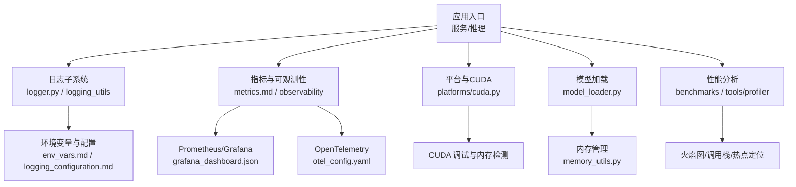
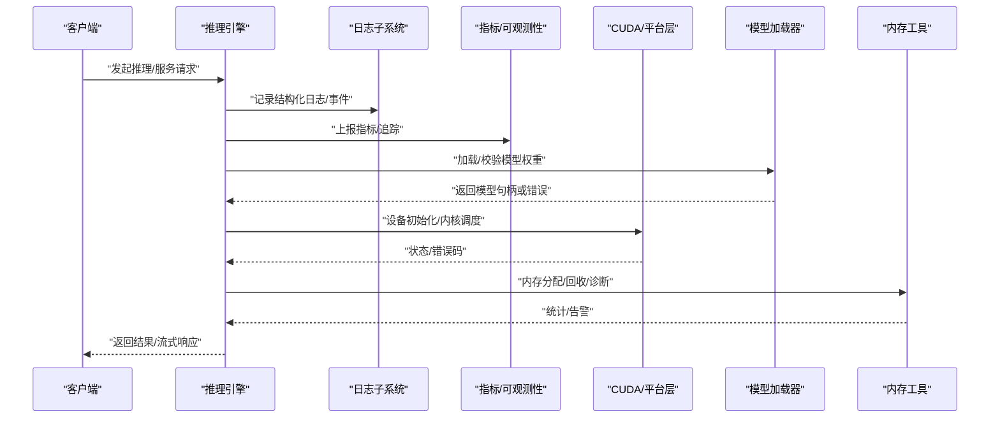
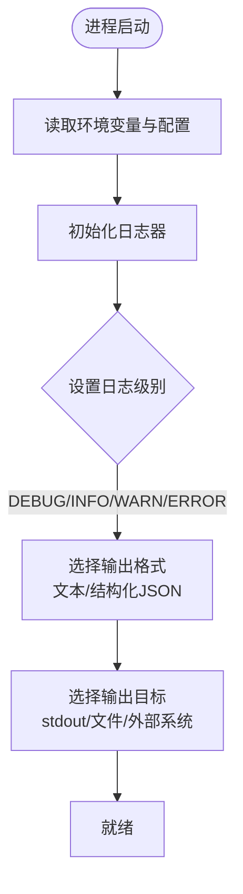
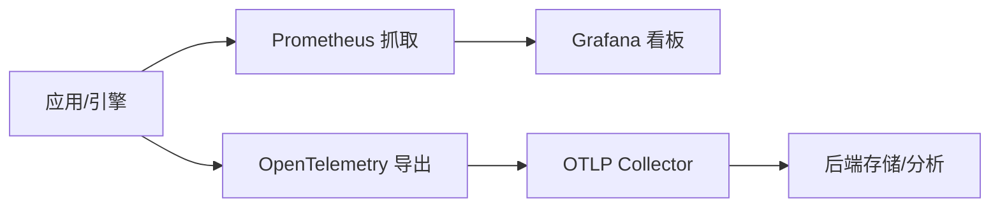
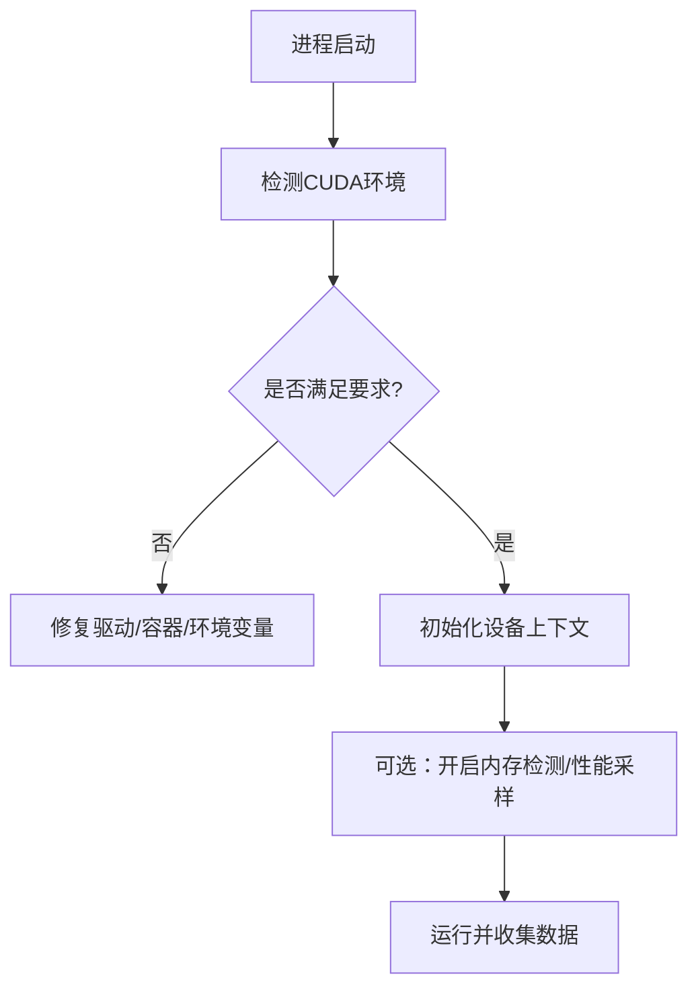
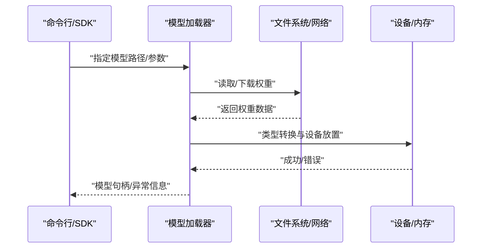
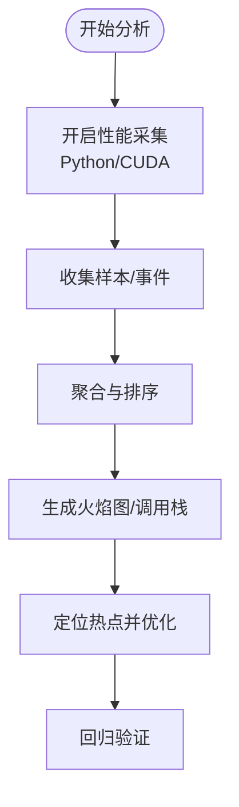
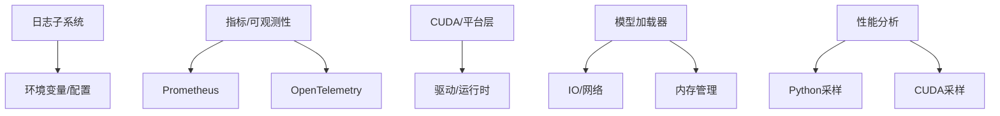

# 调试工具和技巧

<cite>
**本文引用的文件**   
- [vllm/logger.py](file://vllm/logger.py)
- [vllm/logging_utils/__init__.py](file://vllm/logging_utils/__init__.py)
- [vllm/logging_utils/structured_logger.py](file://vllm/logging_utils/structured_logger.py)
- [examples/features/logging_configuration.md](file://examples/features/logging_configuration.md)
- [docs/configuration/env_vars.md](file://docs/configuration/env_vars.md)
- [docs/design/debug_vllm_compile.md](file://docs/design/debug_vllm_compile.md)
- [docs/design/metrics.md](file://docs/design/metrics.md)
- [examples/observability/prometheus_grafana/grafana_dashboard.json](file://examples/observability/prometheus_grafana/grafana_dashboard.json)
- [examples/observability/opentelemetry/otel_config.yaml](file://examples/observability/opentelemetry/otel_config.yaml)
- [tests/test_logger.py](file://tests/test_logger.py)
- [tests/config/test_structured_logging.py](file://tests/config/test_structured_logging.py)
- [benchmarks/benchmark_serving.py](file://benchmarks/benchmark_serving.py)
- [vllm/profiler/__init__.py](file://vllm/profiler/__init__.py)
- [tools/profiler/vllm_profiler.py](file://tools/profiler/vllm_profiler.py)
- [vllm/engine/arg_utils.py](file://vllm/engine/arg_utils.py)
- [vllm/platforms/cuda.py](file://vllm/platforms/cuda.py)
- [vllm/model_executor/model_loader.py](file://vllm/model_executor/model_loader.py)
- [vllm/utils/memory_utils.py](file://vllm/utils/memory_utils.py)
- [vllm/distributed/communication_utils.py](file://vllm/distributed/communication_utils.py)
</cite>

## 目录
1. [简介](#简介)
2. [项目结构](#项目结构)
3. [核心组件](#核心组件)
4. [架构总览](#架构总览)
5. [详细组件分析](#详细组件分析)
6. [依赖关系分析](#依赖关系分析)
7. [性能注意事项](#性能注意事项)
8. [故障排查指南](#故障排查指南)
9. [结论](#结论)
10. [附录](#附录)

## 简介
本指南面向使用 vLLM 的工程师与运维人员，系统介绍调试工具与技巧，覆盖：
- Python 调试器（pdb）与 IDE 调试配置、远程调试设置
- GPU/CUDA 调试技术（CUDA 调试器、内存错误检测、内核性能分析）
- 日志记录与监控（结构化日志、日志级别控制、日志聚合）
- 性能分析工具集成（火焰图生成、调用栈分析、热点代码定位）
- 常见问题定位方法（内存溢出、CUDA 错误、性能下降、模型加载失败）
- 调试最佳实践与系统性问题排查流程

## 项目结构
围绕“调试与可观测性”的关键位置包括：
- 日志子系统：vllm/logger.py、vllm/logging_utils/*
- 配置与环境变量：docs/configuration/env_vars.md、examples/features/logging_configuration.md
- 指标与可观测性：docs/design/metrics.md、examples/observability/*
- 编译与内核调试：docs/design/debug_vllm_compile.md
- 基准与性能：benchmarks/*、tools/profiler/*
- 平台与 CUDA：vllm/platforms/cuda.py
- 模型加载与内存：vllm/model_executor/model_loader.py、vllm/utils/memory_utils.py
- 分布式通信：vllm/distributed/communication_utils.py

图表来源
- [vllm/logger.py](file://vllm/logger.py)
- [vllm/logging_utils/__init__.py](file://vllm/logging_utils/__init__.py)
- [docs/design/metrics.md](file://docs/design/metrics.md)
- [examples/observability/prometheus_grafana/grafana_dashboard.json](file://examples/observability/prometheus_grafana/grafana_dashboard.json)
- [examples/observability/opentelemetry/otel_config.yaml](file://examples/observability/opentelemetry/otel_config.yaml)
- [vllm/platforms/cuda.py](file://vllm/platforms/cuda.py)
- [vllm/model_executor/model_loader.py](file://vllm/model_executor/model_loader.py)
- [vllm/utils/memory_utils.py](file://vllm/utils/memory_utils.py)
- [benchmarks/benchmark_serving.py](file://benchmarks/benchmark_serving.py)
- [tools/profiler/vllm_profiler.py](file://tools/profiler/vllm_profiler.py)

章节来源
- [docs/configuration/env_vars.md](file://docs/configuration/env_vars.md)
- [examples/features/logging_configuration.md](file://examples/features/logging_configuration.md)
- [docs/design/metrics.md](file://docs/design/metrics.md)

## 核心组件
- 日志子系统
  - 统一日志入口与格式化：vllm/logger.py
  - 结构化日志能力与扩展点：vllm/logging_utils/*
  - 测试用例验证行为：tests/test_logger.py、tests/config/test_structured_logging.py
- 指标与可观测性
  - 指标设计与采集：docs/design/metrics.md
  - Prometheus/Grafana 面板：examples/observability/prometheus_grafana/grafana_dashboard.json
  - OpenTelemetry 配置：examples/observability/opentelemetry/otel_config.yaml
- 平台与 CUDA
  - CUDA 初始化与设备信息：vllm/platforms/cuda.py
- 模型加载与内存
  - 权重加载流程与错误处理：vllm/model_executor/model_loader.py
  - 内存工具与诊断辅助：vllm/utils/memory_utils.py
- 性能分析
  - 基准脚本与运行方式：benchmarks/benchmark_serving.py
  - 专用 Profiler 工具：tools/profiler/vllm_profiler.py、vllm/profiler/__init__.py

章节来源
- [vllm/logger.py](file://vllm/logger.py)
- [vllm/logging_utils/__init__.py](file://vllm/logging_utils/__init__.py)
- [tests/test_logger.py](file://tests/test_logger.py)
- [tests/config/test_structured_logging.py](file://tests/config/test_structured_logging.py)
- [docs/design/metrics.md](file://docs/design/metrics.md)
- [examples/observability/prometheus_grafana/grafana_dashboard.json](file://examples/observability/prometheus_grafana/grafana_dashboard.json)
- [examples/observability/opentelemetry/otel_config.yaml](file://examples/observability/opentelemetry/otel_config.yaml)
- [vllm/platforms/cuda.py](file://vllm/platforms/cuda.py)
- [vllm/model_executor/model_loader.py](file://vllm/model_executor/model_loader.py)
- [vllm/utils/memory_utils.py](file://vllm/utils/memory_utils.py)
- [benchmarks/benchmark_serving.py](file://benchmarks/benchmark_serving.py)
- [tools/profiler/vllm_profiler.py](file://tools/profiler/vllm_profiler.py)
- [vllm/profiler/__init__.py](file://vllm/profiler/__init__.py)

## 架构总览
下图展示从请求到执行、再到日志与指标输出的关键路径，以及调试与性能分析的接入点。

图表来源
- [vllm/logger.py](file://vllm/logger.py)
- [docs/design/metrics.md](file://docs/design/metrics.md)
- [vllm/platforms/cuda.py](file://vllm/platforms/cuda.py)
- [vllm/model_executor/model_loader.py](file://vllm/model_executor/model_loader.py)
- [vllm/utils/memory_utils.py](file://vllm/utils/memory_utils.py)

## 详细组件分析

### 日志子系统与结构化日志
- 统一日志入口与级别控制
  - 通过环境变量与配置文件调整日志级别、输出格式与目标
  - 支持结构化日志字段，便于聚合与分析
- 结构化日志扩展点
  - 提供统一的 JSON/键值对输出，便于 ELK/Loki/Prometheus 等生态集成
- 测试保障
  - 单元测试覆盖日志级别、输出格式与结构化字段

图表来源
- [vllm/logger.py](file://vllm/logger.py)
- [vllm/logging_utils/__init__.py](file://vllm/logging_utils/__init__.py)
- [examples/features/logging_configuration.md](file://examples/features/logging_configuration.md)
- [docs/configuration/env_vars.md](file://docs/configuration/env_vars.md)

章节来源
- [vllm/logger.py](file://vllm/logger.py)
- [vllm/logging_utils/__init__.py](file://vllm/logging_utils/__init__.py)
- [examples/features/logging_configuration.md](file://examples/features/logging_configuration.md)
- [docs/configuration/env_vars.md](file://docs/configuration/env_vars.md)
- [tests/test_logger.py](file://tests/test_logger.py)
- [tests/config/test_structured_logging.py](file://tests/config/test_structured_logging.py)

### 指标与可观测性（Prometheus/Grafana/OpenTelemetry）
- 指标设计
  - 定义关键运行时指标（吞吐、延迟、队列长度、显存占用等）
- 可视化与告警
  - 提供 Grafana 面板模板，快速搭建监控看板
- 分布式追踪
  - 基于 OpenTelemetry 的配置示例，实现端到端链路追踪

图表来源
- [docs/design/metrics.md](file://docs/design/metrics.md)
- [examples/observability/prometheus_grafana/grafana_dashboard.json](file://examples/observability/prometheus_grafana/grafana_dashboard.json)
- [examples/observability/opentelemetry/otel_config.yaml](file://examples/observability/opentelemetry/otel_config.yaml)

章节来源
- [docs/design/metrics.md](file://docs/design/metrics.md)
- [examples/observability/prometheus_grafana/grafana_dashboard.json](file://examples/observability/prometheus_grafana/grafana_dashboard.json)
- [examples/observability/opentelemetry/otel_config.yaml](file://examples/observability/opentelemetry/otel_config.yaml)

### 平台与 CUDA 调试
- 设备初始化与状态检查
  - 查看可用设备、驱动版本、CUDA 能力
- CUDA 调试建议
  - 使用 CUDA 调试器进行断点与单步
  - 启用内存错误检测（如 cuda-memcheck）定位越界与未初始化访问
  - 使用 nvprof/nsys 进行内核性能分析与热点定位

图表来源
- [vllm/platforms/cuda.py](file://vllm/platforms/cuda.py)

章节来源
- [vllm/platforms/cuda.py](file://vllm/platforms/cuda.py)

### 模型加载与内存诊断
- 权重加载流程
  - 解析配置、分片下载、类型转换、设备放置
- 常见错误
  - 权限不足、网络超时、权重损坏、形状不匹配
- 内存诊断
  - 显存碎片、OOM 根因定位、缓存策略调优

图表来源
- [vllm/model_executor/model_loader.py](file://vllm/model_executor/model_loader.py)
- [vllm/utils/memory_utils.py](file://vllm/utils/memory_utils.py)

章节来源
- [vllm/model_executor/model_loader.py](file://vllm/model_executor/model_loader.py)
- [vllm/utils/memory_utils.py](file://vllm/utils/memory_utils.py)

### 性能分析与火焰图
- 基准与压测
  - 使用基准脚本模拟真实负载，采集吞吐与延迟
- 火焰图与调用栈
  - 结合 Python 与 CUDA 工具链生成火焰图，定位 CPU/GPU 热点
- 热点代码定位
  - 关注注意力计算、量化/反量化、通信与同步开销

图表来源
- [benchmarks/benchmark_serving.py](file://benchmarks/benchmark_serving.py)
- [tools/profiler/vllm_profiler.py](file://tools/profiler/vllm_profiler.py)
- [vllm/profiler/__init__.py](file://vllm/profiler/__init__.py)

章节来源
- [benchmarks/benchmark_serving.py](file://benchmarks/benchmark_serving.py)
- [tools/profiler/vllm_profiler.py](file://tools/profiler/vllm_profiler.py)
- [vllm/profiler/__init__.py](file://vllm/profiler/__init__.py)

### 编译与内核调试
- 编译期调试开关
  - 针对 TorchCompile 与自定义算子的调试选项
- 内核级问题
  - 使用 CUDA 调试器与性能分析工具定位内核瓶颈

章节来源
- [docs/design/debug_vllm_compile.md](file://docs/design/debug_vllm_compile.md)

## 依赖关系分析
- 日志子系统依赖环境变量与配置模块，为上层模块提供统一输出
- 指标与可观测性依赖 Prometheus/OpenTelemetry 生态
- CUDA 平台层依赖驱动与运行时，影响内核行为与性能
- 模型加载器依赖 IO、序列化与设备内存管理
- 性能分析工具依赖 Python/CUDA 采样接口

图表来源
- [vllm/logger.py](file://vllm/logger.py)
- [docs/design/metrics.md](file://docs/design/metrics.md)
- [vllm/platforms/cuda.py](file://vllm/platforms/cuda.py)
- [vllm/model_executor/model_loader.py](file://vllm/model_executor/model_loader.py)
- [vllm/utils/memory_utils.py](file://vllm/utils/memory_utils.py)
- [benchmarks/benchmark_serving.py](file://benchmarks/benchmark_serving.py)
- [tools/profiler/vllm_profiler.py](file://tools/profiler/vllm_profiler.py)

章节来源
- [vllm/logger.py](file://vllm/logger.py)
- [docs/design/metrics.md](file://docs/design/metrics.md)
- [vllm/platforms/cuda.py](file://vllm/platforms/cuda.py)
- [vllm/model_executor/model_loader.py](file://vllm/model_executor/model_loader.py)
- [vllm/utils/memory_utils.py](file://vllm/utils/memory_utils.py)
- [benchmarks/benchmark_serving.py](file://benchmarks/benchmark_serving.py)
- [tools/profiler/vllm_profiler.py](file://tools/profiler/vllm_profiler.py)

## 性能注意事项
- 合理设置批大小与序列长度，避免显存抖动
- 启用合适的量化与注意力后端，减少计算与内存压力
- 使用异步 I/O 与预取降低等待时间
- 在分布式场景下关注通信开销与同步点
- 定期采集指标与日志，建立基线与阈值告警

[本节为通用指导，不直接分析具体文件]

## 故障排查指南
- 内存溢出（OOM）
  - 现象：进程崩溃、显存耗尽
  - 排查：检查批大小、上下文长度、KV Cache；使用内存工具与 CUDA 内存检测
  - 参考：vllm/utils/memory_utils.py、CUDA 内存检测工具
- CUDA 错误
  - 现象：内核启动失败、非法地址访问
  - 排查：使用 CUDA 调试器、nvprof/nsys；检查驱动与设备状态
  - 参考：vllm/platforms/cuda.py
- 性能下降
  - 现象：吞吐降低、延迟升高
  - 排查：火焰图定位热点；检查量化、注意力后端、通信瓶颈
  - 参考：benchmarks/benchmark_serving.py、tools/profiler/vllm_profiler.py
- 模型加载失败
  - 现象：权限错误、网络超时、权重损坏
  - 排查：检查路径权限、网络连通性、权重完整性与形状
  - 参考：vllm/model_executor/model_loader.py
- 日志与指标缺失
  - 现象：无法定位问题、无监控数据
  - 排查：确认日志级别与输出目标；检查 Prometheus/OpenTelemetry 配置
  - 参考：vllm/logger.py、docs/design/metrics.md、examples/observability/*

章节来源
- [vllm/utils/memory_utils.py](file://vllm/utils/memory_utils.py)
- [vllm/platforms/cuda.py](file://vllm/platforms/cuda.py)
- [benchmarks/benchmark_serving.py](file://benchmarks/benchmark_serving.py)
- [tools/profiler/vllm_profiler.py](file://tools/profiler/vllm_profiler.py)
- [vllm/model_executor/model_loader.py](file://vllm/model_executor/model_loader.py)
- [vllm/logger.py](file://vllm/logger.py)
- [docs/design/metrics.md](file://docs/design/metrics.md)
- [examples/observability/prometheus_grafana/grafana_dashboard.json](file://examples/observability/prometheus_grafana/grafana_dashboard.json)
- [examples/observability/opentelemetry/otel_config.yaml](file://examples/observability/opentelemetry/otel_config.yaml)

## 结论
通过统一的日志子系统、完善的指标与可观测性、CUDA 平台调试能力以及系统的性能分析工具，vLLM 提供了从 Python 到 GPU 内核的全栈调试支持。建议在生产环境中持续采集指标与结构化日志，结合基准与火焰图进行性能优化，并建立标准化的问题排查流程，以提升稳定性与效率。

[本节为总结，不直接分析具体文件]

## 附录
- 常用环境变量与配置项
  - 日志级别、输出格式、目标路径
  - CUDA 相关开关与性能采样选项
  - 指标导出与追踪配置
- 推荐工具链
  - Python：pdb、cProfile、line_profiler
  - CUDA：cuda-gdb、cuda-memcheck、nsys/nvprof
  - 指标：Prometheus、Grafana、OpenTelemetry Collector
- 参考文档与示例
  - 日志配置示例：examples/features/logging_configuration.md
  - 指标与面板：docs/design/metrics.md、examples/observability/prometheus_grafana/grafana_dashboard.json
  - 追踪配置：examples/observability/opentelemetry/otel_config.yaml
  - 编译调试：docs/design/debug_vllm_compile.md

[本节为补充信息，不直接分析具体文件]