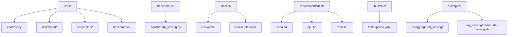
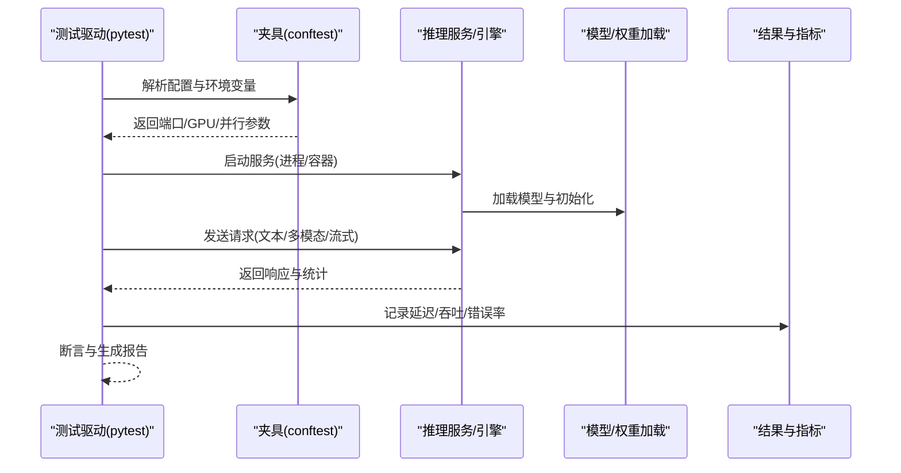
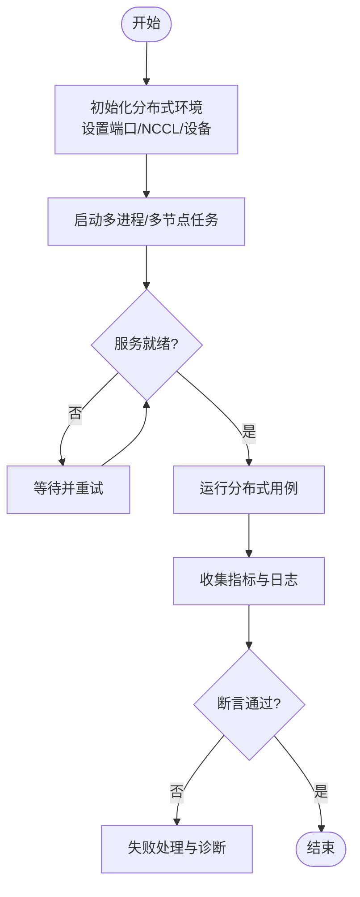
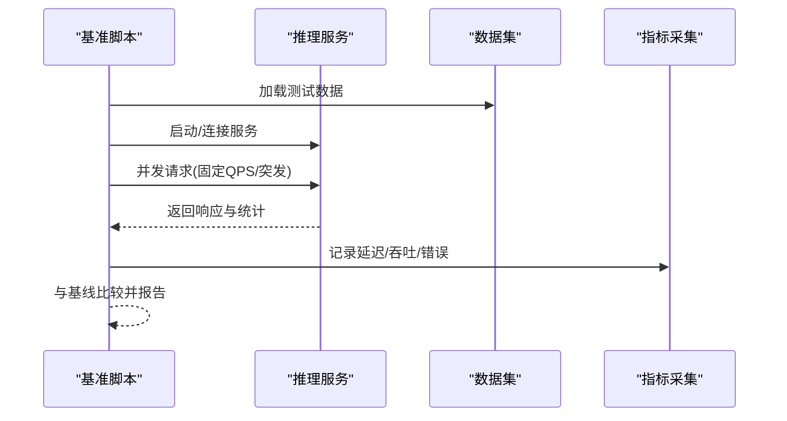
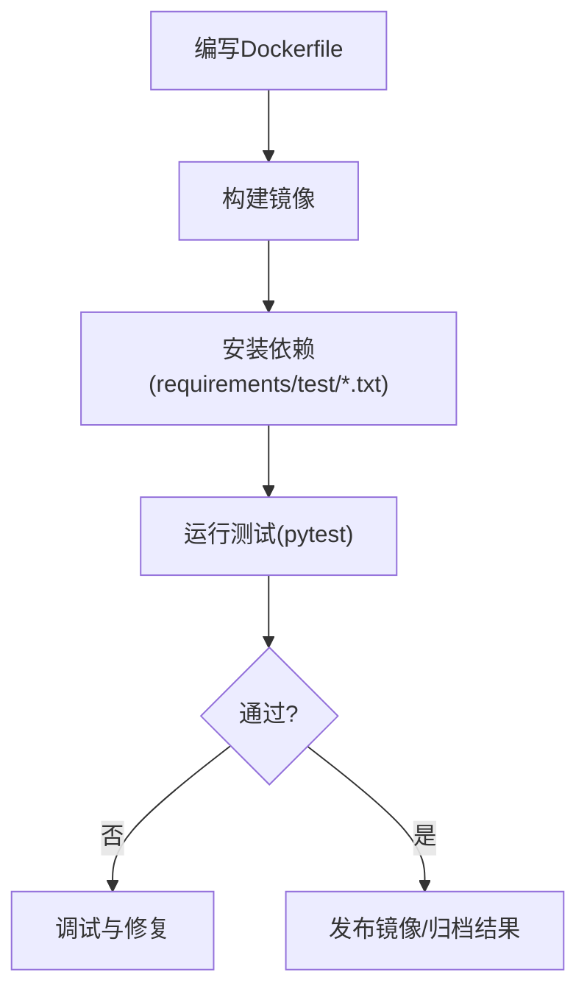
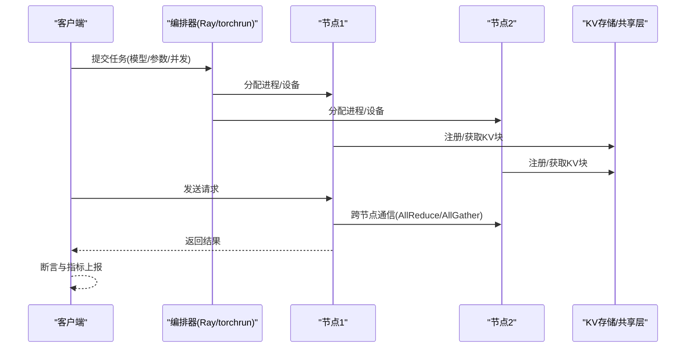
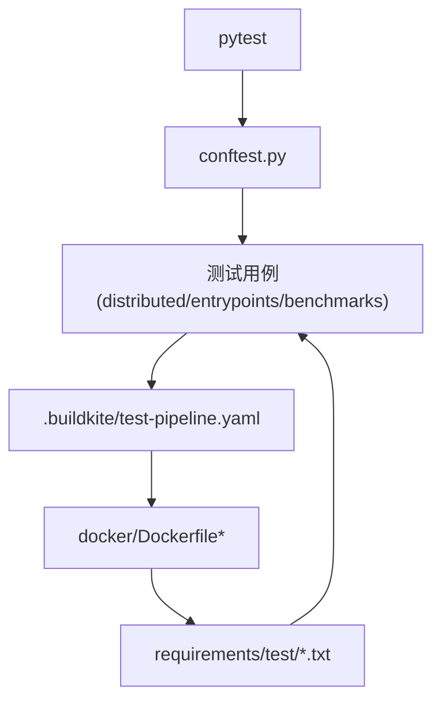

# 集成测试

<cite>
**本文引用的文件**   
- [tests/conftest.py](file://tests/conftest.py)
- [tests/distributed/conftest.py](file://tests/distributed/conftest.py)
- [tests/entrypoints/conftest.py](file://tests/entrypoints/conftest.py)
- [tests/benchmarks/test_bench_startup.py](file://tests/benchmarks/test_bench_startup.py)
- [tests/distributed/test_ray_v2_executor_e2e.py](file://tests/distributed/test_ray_v2_executor_e2e.py)
- [tests/distributed/test_multi_node_assignment.py](file://tests/distributed/test_multi_node_assignment.py)
- [tests/distributed/test_torchrun_example.py](file://tests/distributed/test_torchrun_example.py)
- [tests/distributed/test_torchrun_example_moe.py](file://tests/distributed/test_torchrun_example_moe.py)
- [docker/Dockerfile](file://docker/Dockerfile)
- [docker/Dockerfile.rocm](file://docker/Dockerfile.rocm)
- [requirements/test/cuda.txt](file://requirements/test/cuda.txt)
- [requirements/test/cpu.txt](file://requirements/test/cpu.txt)
- [requirements/test/rocm.txt](file://requirements/test/rocm.txt)
- [benchmarks/benchmark_serving.py](file://benchmarks/benchmark_serving.py)
- [examples/disaggregated/disaggregated_serving/example_disagg_serving.py](file://examples/disaggregated/disaggregated_serving/example_disagg_serving.py)
- [examples/ray_serving/multi-node-serving.sh](file://examples/ray_serving/multi-node-serving.sh)
- [.buildkite/test-pipeline.yaml](file://.buildkite/test-pipeline.yaml)
</cite>

## 目录
1. [简介](#简介)
2. [项目结构](#项目结构)
3. [核心组件](#核心组件)
4. [架构总览](#架构总览)
5. [详细组件分析](#详细组件分析)
6. [依赖关系分析](#依赖关系分析)
7. [性能考量](#性能考量)
8. [故障排查指南](#故障排查指南)
9. [结论](#结论)
10. [附录](#附录)

## 简介
本指南面向需要在 vLLM 项目中设计与实施高质量集成测试的工程师，覆盖端到端测试、多组件交互、分布式环境（含多 GPU/多节点）、真实数据与性能回归、容器化测试环境与依赖管理、外部依赖模拟与测试数据库管理、以及分布式推理的集成测试示例。文档以仓库现有测试与构建配置为依据，提供可操作的实践建议与可视化流程图，帮助读者快速搭建并维护稳定可靠的集成测试体系。

## 项目结构
vLLM 的测试与基准分布在多个目录中：
- tests：按功能域组织的大量 Python 测试用例，包含分布式、编译、模型、量化、工具等子目录；顶层 conftest.py 提供全局夹具与配置。
- benchmarks：性能与吞吐基准脚本，可用于回归与容量规划。
- docker：多种平台 Dockerfile，用于构建一致的测试镜像。
- requirements/test：各平台的测试依赖清单。
- .buildkite：CI/CD 流水线定义，驱动不同环境的测试执行。
- examples：示例代码，包括分布式推理与服务编排，可作为集成测试场景参考。

**图表来源**
- [tests/conftest.py](file://tests/conftest.py)
- [tests/distributed/conftest.py](file://tests/distributed/conftest.py)
- [tests/entrypoints/conftest.py](file://tests/entrypoints/conftest.py)
- [tests/benchmarks/test_bench_startup.py](file://tests/benchmarks/test_bench_startup.py)
- [docker/Dockerfile](file://docker/Dockerfile)
- [docker/Dockerfile.rocm](file://docker/Dockerfile.rocm)
- [requirements/test/cuda.txt](file://requirements/test/cuda.txt)
- [requirements/test/cpu.txt](file://requirements/test/cpu.txt)
- [requirements/test/rocm.txt](file://requirements/test/rocm.txt)
- [.buildkite/test-pipeline.yaml](file://.buildkite/test-pipeline.yaml)
- [benchmarks/benchmark_serving.py](file://benchmarks/benchmark_serving.py)
- [examples/disaggregated/disaggregated_serving/example_disagg_serving.py](file://examples/disaggregated/disaggregated_serving/example_disagg_serving.py)
- [examples/ray_serving/multi-node-serving.sh](file://examples/ray_serving/multi-node-serving.sh)

**章节来源**
- [tests/conftest.py](file://tests/conftest.py)
- [tests/distributed/conftest.py](file://tests/distributed/conftest.py)
- [tests/entrypoints/conftest.py](file://tests/entrypoints/conftest.py)
- [requirements/test/cuda.txt](file://requirements/test/cuda.txt)
- [requirements/test/cpu.txt](file://requirements/test/cpu.txt)
- [requirements/test/rocm.txt](file://requirements/test/rocm.txt)
- [docker/Dockerfile](file://docker/Dockerfile)
- [docker/Dockerfile.rocm](file://docker/Dockerfile.rocm)
- [.buildkite/test-pipeline.yaml](file://.buildkite/test-pipeline.yaml)

## 核心组件
- 测试夹具与全局配置：通过 pytest 的 conftest.py 集中管理测试环境、端口分配、GPU/CPU 选择、分布式初始化参数等，确保测试的一致性与可重复性。
- 分布式测试套件：位于 tests/distributed，涵盖通信原语、并行策略、调度器、Ray 执行器、多节点分配等场景。
- 入口点测试：位于 tests/entrypoints，覆盖 OpenAI/Anthropic/serve 等接口行为与兼容性。
- 基准与回归：benchmarks 目录下的脚本用于吞吐、延迟、启动开销等指标采集，便于性能回归检测。
- 容器化与依赖：docker 与 requirements/test 提供跨平台镜像与依赖锁定，保证 CI 与本地环境一致。
- 示例与编排：examples 提供多节点服务编排与解耦推理示例，可作为集成测试场景蓝本。

**章节来源**
- [tests/conftest.py](file://tests/conftest.py)
- [tests/distributed/conftest.py](file://tests/distributed/conftest.py)
- [tests/entrypoints/conftest.py](file://tests/entrypoints/conftest.py)
- [tests/benchmarks/test_bench_startup.py](file://tests/benchmarks/test_bench_startup.py)
- [requirements/test/cuda.txt](file://requirements/test/cuda.txt)
- [requirements/test/cpu.txt](file://requirements/test/cpu.txt)
- [requirements/test/rocm.txt](file://requirements/test/rocm.txt)
- [docker/Dockerfile](file://docker/Dockerfile)
- [docker/Dockerfile.rocm](file://docker/Dockerfile.rocm)

## 架构总览
下图展示了一个典型的端到端集成测试流程：测试驱动通过 pytest 启动，根据 conftest 配置拉起服务或引擎实例，构造请求（OpenAI/自定义协议），调用后端推理服务，收集响应与指标，最后进行断言与报告。

[此图为概念性流程图，不直接映射具体源码文件]

## 详细组件分析

### 端到端测试设计（多组件交互）
- 目标：验证从客户端到推理引擎再到模型的全链路正确性，包括输入预处理、KV缓存、采样、输出后处理与指标上报。
- 关键步骤：
  - 使用 conftest 统一设置端口、设备、并行度、日志级别。
  - 启动服务或引擎实例，等待就绪探针（如健康检查）。
  - 构造多样化请求（短上下文、长上下文、批处理、流式）。
  - 校验输出一致性（数值容差、停止条件、token 序列）。
  - 采集并断言指标（首 token 延迟、吞吐、显存占用）。
- 建议：
  - 将“服务启动”和“请求发送”拆分为独立夹具，便于复用与组合。
  - 对失败路径（超时、OOM、网络抖动）增加重试与降级策略。

**章节来源**
- [tests/conftest.py](file://tests/conftest.py)
- [tests/entrypoints/conftest.py](file://tests/entrypoints/conftest.py)
- [tests/benchmarks/test_bench_startup.py](file://tests/benchmarks/test_bench_startup.py)

### 分布式环境测试（多 GPU/多节点）
- 目标：验证张量并行、专家并行、流水线并行、上下文并行等在多卡/多机上的正确性与稳定性。
- 关键步骤：
  - 使用 torchrun 或 Ray 启动多进程/多节点任务。
  - 通过 conftest 注入环境变量（如 NCCL 参数、端口范围）。
  - 在测试中检查通信拓扑、负载均衡、错误恢复。
- 建议：
  - 为不同并行策略建立独立测试集，避免相互干扰。
  - 引入轻量级监控（进程存活、NCCL 状态、显存水位）以便定位问题。

**图表来源**
- [tests/distributed/conftest.py](file://tests/distributed/conftest.py)
- [tests/distributed/test_torchrun_example.py](file://tests/distributed/test_torchrun_example.py)
- [tests/distributed/test_torchrun_example_moe.py](file://tests/distributed/test_torchrun_example_moe.py)
- [tests/distributed/test_multi_node_assignment.py](file://tests/distributed/test_multi_node_assignment.py)

**章节来源**
- [tests/distributed/conftest.py](file://tests/distributed/conftest.py)
- [tests/distributed/test_torchrun_example.py](file://tests/distributed/test_torchrun_example.py)
- [tests/distributed/test_torchrun_example_moe.py](file://tests/distributed/test_torchrun_example_moe.py)
- [tests/distributed/test_multi_node_assignment.py](file://tests/distributed/test_multi_node_assignment.py)

### 真实数据与性能回归测试
- 目标：基于真实数据集与负载模式，评估吞吐、延迟、资源利用率，并检测回归。
- 关键步骤：
  - 准备代表性数据集（长文本、多模态、结构化输出）。
  - 使用 benchmark 脚本发起持续压测，记录关键指标。
  - 与基线对比，设定阈值触发告警。
- 建议：
  - 将基准用例纳入 CI，定期执行并归档结果。
  - 对热点路径（注意力、MoE、量化内核）单独做微基准。

**图表来源**
- [benchmarks/benchmark_serving.py](file://benchmarks/benchmark_serving.py)
- [tests/benchmarks/test_bench_startup.py](file://tests/benchmarks/test_bench_startup.py)

**章节来源**
- [benchmarks/benchmark_serving.py](file://benchmarks/benchmark_serving.py)
- [tests/benchmarks/test_bench_startup.py](file://tests/benchmarks/test_bench_startup.py)

### 容器化测试环境与依赖管理
- 目标：确保测试环境在不同机器与 CI 上完全一致。
- 关键步骤：
  - 使用 docker/Dockerfile 构建基础镜像，安装 CUDA/ROCm/XPU 运行时与依赖。
  - 通过 requirements/test/*.txt 锁定版本，避免漂移。
  - 在 CI 中拉取镜像并执行测试，挂载必要资源（模型权重、数据集）。
- 建议：
  - 为不同平台（CUDA/ROCm/XPU）维护独立镜像与依赖清单。
  - 使用分层构建与缓存加速 CI 速度。

**图表来源**
- [docker/Dockerfile](file://docker/Dockerfile)
- [docker/Dockerfile.rocm](file://docker/Dockerfile.rocm)
- [requirements/test/cuda.txt](file://requirements/test/cuda.txt)
- [requirements/test/cpu.txt](file://requirements/test/cpu.txt)
- [requirements/test/rocm.txt](file://requirements/test/rocm.txt)

**章节来源**
- [docker/Dockerfile](file://docker/Dockerfile)
- [docker/Dockerfile.rocm](file://docker/Dockerfile.rocm)
- [requirements/test/cuda.txt](file://requirements/test/cuda.txt)
- [requirements/test/cpu.txt](file://requirements/test/cpu.txt)
- [requirements/test/rocm.txt](file://requirements/test/rocm.txt)

### 外部依赖与服务模拟（Mock）
- 目标：隔离外部系统（向量库、对象存储、鉴权服务）的不确定性。
- 关键步骤：
  - 使用 pytest-mock 或 unittest.mock 替换外部调用。
  - 对 KV 连接器、分片状态、外部 API 提供轻量 Mock。
  - 在分布式测试中，用本地回环地址与随机端口模拟远程节点。
- 建议：
  - 将 Mock 逻辑集中在 fixtures 中，便于复用与切换。
  - 对关键路径保留“真实依赖”开关，支持混合模式测试。

**章节来源**
- [tests/conftest.py](file://tests/conftest.py)
- [tests/entrypoints/conftest.py](file://tests/entrypoints/conftest.py)

### 分布式推理集成测试示例（多 GPU/多节点）
- 目标：验证多卡/多节点推理的正确性与可扩展性。
- 关键步骤：
  - 使用 torchrun 或 Ray 启动多进程/多节点服务。
  - 构造跨节点请求，验证负载均衡与容错。
  - 采集指标并断言一致性。
- 建议：
  - 为不同并行策略（TP/EP/PP/CP）建立独立用例。
  - 引入健康检查与自动重启机制提升鲁棒性。

**图表来源**
- [tests/distributed/test_ray_v2_executor_e2e.py](file://tests/distributed/test_ray_v2_executor_e2e.py)
- [tests/distributed/test_multi_node_assignment.py](file://tests/distributed/test_multi_node_assignment.py)
- [examples/ray_serving/multi-node-serving.sh](file://examples/ray_serving/multi-node-serving.sh)
- [examples/disaggregated/disaggregated_serving/example_disagg_serving.py](file://examples/disaggregated/disaggregated_serving/example_disagg_serving.py)

**章节来源**
- [tests/distributed/test_ray_v2_executor_e2e.py](file://tests/distributed/test_ray_v2_executor_e2e.py)
- [tests/distributed/test_multi_node_assignment.py](file://tests/distributed/test_multi_node_assignment.py)
- [examples/ray_serving/multi-node-serving.sh](file://examples/ray_serving/multi-node-serving.sh)
- [examples/disaggregated/disaggregated_serving/example_disagg_serving.py](file://examples/disaggregated/disaggregated_serving/example_disagg_serving.py)

### 测试数据准备与管理策略
- 目标：确保测试数据的可重现性、可版本化与高效访问。
- 关键步骤：
  - 将小型数据集与种子固定放入仓库或受控存储。
  - 大型数据集采用哈希校验与增量下载。
  - 使用数据快照与元数据描述（长度分布、领域标签）。
- 建议：
  - 为每个测试用例声明所需数据及其版本。
  - 在 CI 中缓存常用数据集以减少 IO 开销。

**章节来源**
- [tests/benchmarks/test_bench_startup.py](file://tests/benchmarks/test_bench_startup.py)
- [benchmarks/benchmark_serving.py](file://benchmarks/benchmark_serving.py)

## 依赖关系分析
下图展示了测试与依赖之间的主要关系：pytest 驱动测试，conftest 提供夹具，docker 构建镜像，requirements/test 锁定依赖，.buildkite 编排执行。

**图表来源**
- [tests/conftest.py](file://tests/conftest.py)
- [tests/distributed/conftest.py](file://tests/distributed/conftest.py)
- [tests/entrypoints/conftest.py](file://tests/entrypoints/conftest.py)
- [.buildkite/test-pipeline.yaml](file://.buildkite/test-pipeline.yaml)
- [docker/Dockerfile](file://docker/Dockerfile)
- [docker/Dockerfile.rocm](file://docker/Dockerfile.rocm)
- [requirements/test/cuda.txt](file://requirements/test/cuda.txt)
- [requirements/test/cpu.txt](file://requirements/test/cpu.txt)
- [requirements/test/rocm.txt](file://requirements/test/rocm.txt)

**章节来源**
- [tests/conftest.py](file://tests/conftest.py)
- [tests/distributed/conftest.py](file://tests/distributed/conftest.py)
- [tests/entrypoints/conftest.py](file://tests/entrypoints/conftest.py)
- [.buildkite/test-pipeline.yaml](file://.buildkite/test-pipeline.yaml)
- [docker/Dockerfile](file://docker/Dockerfile)
- [docker/Dockerfile.rocm](file://docker/Dockerfile.rocm)
- [requirements/test/cuda.txt](file://requirements/test/cuda.txt)
- [requirements/test/cpu.txt](file://requirements/test/cpu.txt)
- [requirements/test/rocm.txt](file://requirements/test/rocm.txt)

## 性能考量
- 启动开销：通过预热模型与缓存图优化减少冷启动时间。
- 吞吐与延迟：调整批大小、序列长度、并行策略，观察瓶颈（内存带宽、通信、I/O）。
- 资源利用：监控 GPU 利用率、显存峰值、CPU 占用，识别热点路径。
- 回归检测：建立基线与阈值，自动化比对并告警。

[本节为通用指导，不直接分析具体文件]

## 故障排查指南
- 常见问题：
  - 端口冲突：在 conftest 中动态分配端口，避免硬编码。
  - NCCL 初始化失败：检查环境变量与网络连通性。
  - 模型加载超时：增加超时阈值与重试，检查权重路径与权限。
  - 内存不足：降低批大小或启用分页注意力/KV 卸载。
- 诊断手段：
  - 开启详细日志与追踪，收集堆栈与指标。
  - 使用容器内调试工具（nvidia-smi、rocminfo、dmesg）。
  - 回放最小可复现用例，逐步缩小范围。

**章节来源**
- [tests/conftest.py](file://tests/conftest.py)
- [tests/distributed/conftest.py](file://tests/distributed/conftest.py)
- [tests/entrypoints/conftest.py](file://tests/entrypoints/conftest.py)

## 结论
通过统一的夹具与配置、容器化环境、严格的依赖管理与完善的分布式测试套件，vLLM 能够支撑高质量的端到端与性能回归测试。结合示例与最佳实践，团队可以快速构建稳定的集成测试流水线，保障多组件交互与分布式推理的正确性与可靠性。

[本节为总结性内容，不直接分析具体文件]

## 附录
- 快速上手：
  - 使用 pytest 运行单模块测试，指定设备与并行参数。
  - 通过 docker 构建镜像并在容器中执行测试。
  - 使用 .buildkite 流水线批量执行不同平台测试。
- 扩展建议：
  - 引入更丰富的 Mock 服务（向量库、对象存储、鉴权）。
  - 增加混沌工程用例（网络分区、节点宕机、KV 丢失）。
  - 完善指标看板与告警规则，形成闭环反馈。

[本节为补充信息，不直接分析具体文件]