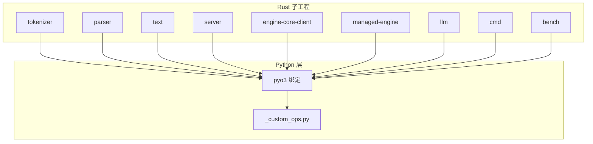
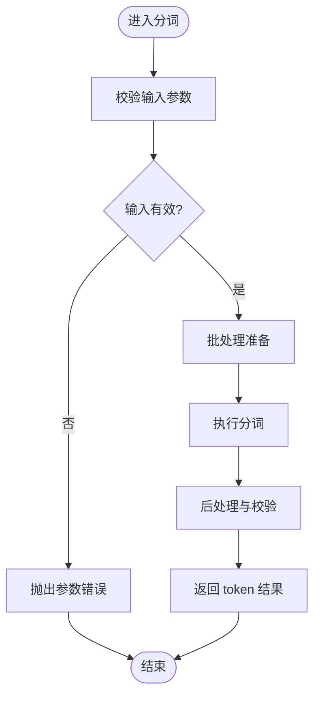
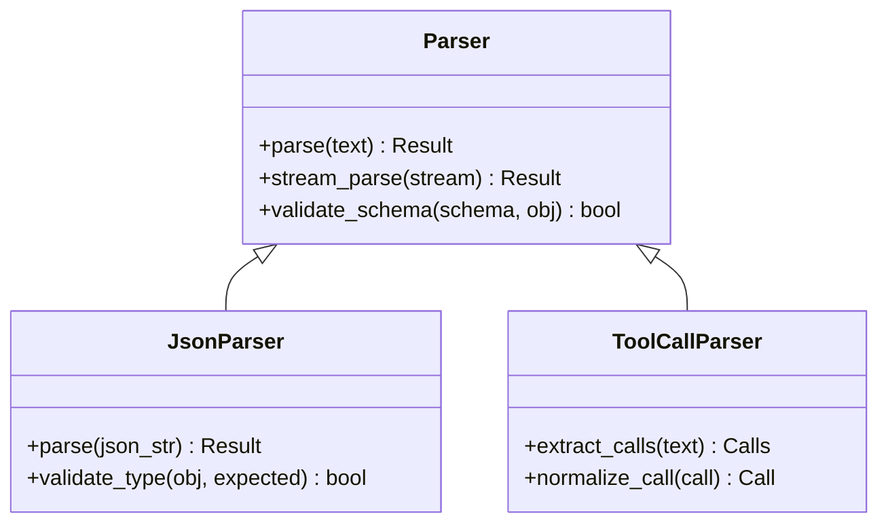
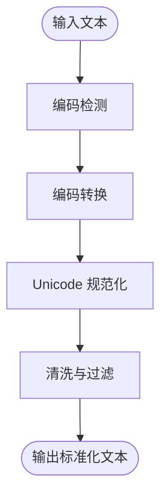
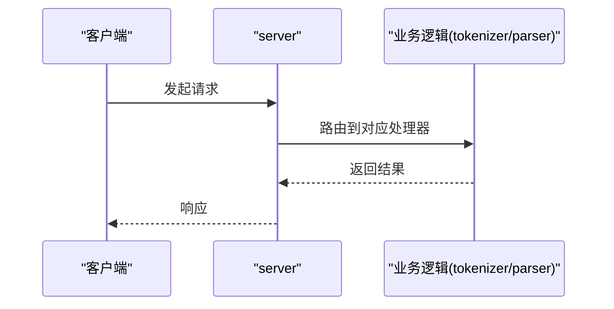
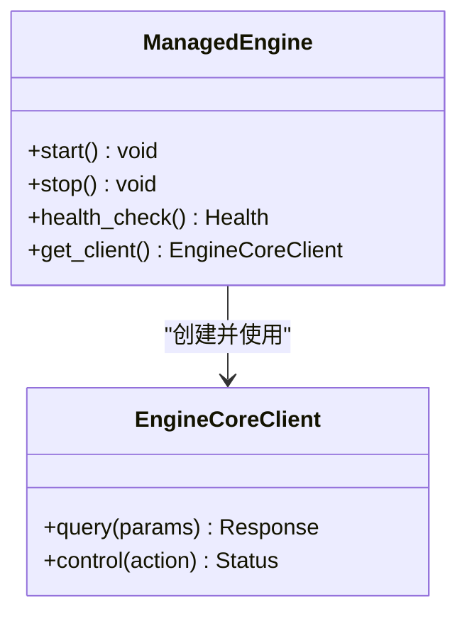
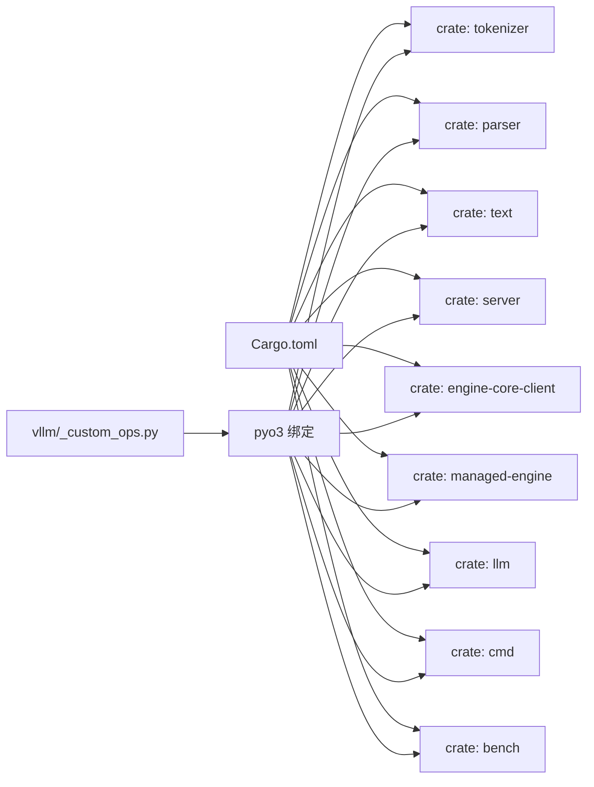

# Rust组件集成

<cite>
**本文引用的文件**   
- [rust/Cargo.toml](file://rust/Cargo.toml)
- [rust/README.md](file://rust/README.md)
- [rust/src/tokenizer/mod.rs](file://rust/src/tokenizer/mod.rs)
- [rust/src/parser/mod.rs](file://rust/src/parser/mod.rs)
- [rust/src/text/mod.rs](file://rust/src/text/mod.rs)
- [rust/src/server/mod.rs](file://rust/src/server/mod.rs)
- [rust/src/engine-core-client/mod.rs](file://rust/src/engine-core-client/mod.rs)
- [rust/src/managed-engine/mod.rs](file://rust/src/managed-engine/mod.rs)
- [rust/src/llm/mod.rs](file://rust/src/llm/mod.rs)
- [rust/src/cmd/mod.rs](file://rust/src/cmd/mod.rs)
- [rust/src/bench/mod.rs](file://rust/src/bench/mod.rs)
- [tools/build_rust.py](file://tools/build_rust.py)
- [build_rust.sh](file://build_rust.sh)
- [pyproject.toml](file://pyproject.toml)
- [setup.py](file://setup.py)
- [vllm/_custom_ops.py](file://vllm/_custom_ops.py)
- [tests/tool_parsers/test_json_parser.py](file://tests/tool_parsers/test_json_parser.py)
</cite>

## 目录
1. [简介](#简介)
2. [项目结构](#项目结构)
3. [核心组件](#核心组件)
4. [架构总览](#架构总览)
5. [详细组件分析](#详细组件分析)
6. [依赖关系分析](#依赖关系分析)
7. [性能考量](#性能考量)
8. [故障排查指南](#故障排查指南)
9. [结论](#结论)
10. [附录](#附录)

## 简介
本文件系统性梳理 vLLM 中 Rust 组件的设计目的、与 Python 的集成方式、构建流程与依赖管理，以及测试策略与错误处理机制。重点覆盖 tokenization、解析器与部分计算任务等性能敏感场景，并给出扩展开发与最佳实践建议，辅以性能对比与适用场景分析，帮助读者快速理解如何在 vLLM 中安全高效地引入 Rust 能力。

## 项目结构
Rust 子工程位于仓库根目录下的 rust 目录，采用多 crate 组织，按功能域划分模块：
- tokenizer：高性能分词相关能力
- parser：结构化输出与工具调用解析
- text：文本处理与转换
- server：gRPC/HTTP 服务与进程间通信
- engine-core-client：与引擎核心的客户端封装
- managed-engine：受管引擎生命周期管理
- llm：大模型推理接口抽象
- cmd：命令行入口
- bench：基准测试套件

Python 侧通过 pyo3/cython 绑定暴露 Rust 能力，并在构建阶段由 tools/build_rust.py 与 build_rust.sh 驱动编译与打包。



图表来源
- [rust/Cargo.toml](file://rust/Cargo.toml)
- [vllm/_custom_ops.py](file://vllm/_custom_ops.py)

章节来源
- [rust/README.md](file://rust/README.md)
- [rust/Cargo.toml](file://rust/Cargo.toml)

## 核心组件
- tokenizer：面向高频 tokenization 路径，提供低延迟、零拷贝或最小拷贝的数据交换接口，适配多种 Tokenizer 后端。
- parser：对结构化输出（JSON/函数调用）进行高吞吐解析，支持严格模式与容错降级。
- text：文本清洗、编码转换、字符边界处理等通用能力。
- server：对外暴露 gRPC/HTTP 接口，承载跨进程/跨语言调用，便于与 Python 服务解耦部署。
- engine-core-client：对引擎核心能力的轻量客户端封装，屏蔽网络与序列化细节。
- managed-engine：负责引擎实例的生命周期、资源管理与健康检查。
- llm：统一推理接口抽象，屏蔽具体实现差异。
- cmd：CLI 入口，用于本地调试、压测与运维。
- bench：基准测试，覆盖关键路径的性能回归与对比。

章节来源
- [rust/src/tokenizer/mod.rs](file://rust/src/tokenizer/mod.rs)
- [rust/src/parser/mod.rs](file://rust/src/parser/mod.rs)
- [rust/src/text/mod.rs](file://rust/src/text/mod.rs)
- [rust/src/server/mod.rs](file://rust/src/server/mod.rs)
- [rust/src/engine-core-client/mod.rs](file://rust/src/engine-core-client/mod.rs)
- [rust/src/managed-engine/mod.rs](file://rust/src/managed-engine/mod.rs)
- [rust/src/llm/mod.rs](file://rust/src/llm/mod.rs)
- [rust/src/cmd/mod.rs](file://rust/src/cmd/mod.rs)
- [rust/src/bench/mod.rs](file://rust/src/bench/mod.rs)

## 架构总览
下图展示 Python 与 Rust 之间的典型调用链：Python 通过 pyo3 绑定调用 Rust 模块；Rust 内部按职责拆分到各 crate；在需要时通过 server 暴露远程接口，或由 engine-core-client 访问引擎核心。

```mermaid
sequenceDiagram
participant Py as "Python 应用"
participant Bind as "pyo3 绑定"
participant Tok as "tokenizer"
participant Par as "parser"
participant Txt as "text"
participant Srv as "server"
participant Eng as "engine-core-client"
Py->>Bind : 调用分词/解析接口
Bind->>Tok : 执行 tokenization
Tok-->>Bind : 返回 token 序列
Bind->>Par : 解析结构化输出
Par-->>Bind : 返回解析结果
Bind->>Txt : 文本预处理/后处理
Txt-->>Bind : 返回处理后的文本
Py->>Srv : 发起远程请求(可选)
Srv-->>Py : 返回响应
Py->>Eng : 访问引擎核心(可选)
Eng-->>Py : 返回引擎状态/结果
```

图表来源
- [vllm/_custom_ops.py](file://vllm/_custom_ops.py)
- [rust/src/tokenizer/mod.rs](file://rust/src/tokenizer/mod.rs)
- [rust/src/parser/mod.rs](file://rust/src/parser/mod.rs)
- [rust/src/text/mod.rs](file://rust/src/text/mod.rs)
- [rust/src/server/mod.rs](file://rust/src/server/mod.rs)
- [rust/src/engine-core-client/mod.rs](file://rust/src/engine-core-client/mod.rs)

## 详细组件分析

### tokenizer 组件
- 设计目标：在高并发、低延迟的 tokenization 路径上减少 Python/Rust 数据拷贝与序列化开销，提升吞吐。
- 关键特性：
  - 批量输入处理与内存池复用
  - 与主流 Tokenizer 库的桥接
  - 错误码与异常映射到 Python 异常
- 数据流：
  - Python 传入字符串或字节数组
  - Rust 完成分词并返回 token id 列表与元信息
  - 通过 pyo3 将结果转回 Python 对象



图表来源
- [rust/src/tokenizer/mod.rs](file://rust/src/tokenizer/mod.rs)

章节来源
- [rust/src/tokenizer/mod.rs](file://rust/src/tokenizer/mod.rs)

### parser 组件
- 设计目标：为结构化输出与工具调用提供高性能、强类型解析，支持严格模式与降级策略。
- 关键特性：
  - JSON Schema/函数签名匹配
  - 增量解析与流式处理
  - 错误恢复与诊断信息
- 数据流：
  - 接收原始文本或 token 流
  - 解析为结构化对象
  - 返回解析结果与位置信息



图表来源
- [rust/src/parser/mod.rs](file://rust/src/parser/mod.rs)

章节来源
- [rust/src/parser/mod.rs](file://rust/src/parser/mod.rs)
- [tests/tool_parsers/test_json_parser.py](file://tests/tool_parsers/test_json_parser.py)

### text 组件
- 设计目标：提供高效的文本清洗、编码转换与字符边界处理，避免 Python 层的频繁切换。
- 关键特性：
  - Unicode 规范化与归一化
  - 编码检测与转换
  - 批量文本操作



图表来源
- [rust/src/text/mod.rs](file://rust/src/text/mod.rs)

章节来源
- [rust/src/text/mod.rs](file://rust/src/text/mod.rs)

### server 组件
- 设计目标：对外暴露稳定接口，支持跨进程/跨语言调用，便于与 Python 服务解耦。
- 关键特性：
  - gRPC/HTTP 双协议支持
  - 连接池与限流
  - 健康检查与指标上报



图表来源
- [rust/src/server/mod.rs](file://rust/src/server/mod.rs)

章节来源
- [rust/src/server/mod.rs](file://rust/src/server/mod.rs)

### engine-core-client 与 managed-engine
- engine-core-client：封装与引擎核心的交互，屏蔽网络与序列化细节，提供统一的查询/控制接口。
- managed-engine：管理引擎实例生命周期，包括启动、停止、重启与健康检查。



图表来源
- [rust/src/engine-core-client/mod.rs](file://rust/src/engine-core-client/mod.rs)
- [rust/src/managed-engine/mod.rs](file://rust/src/managed-engine/mod.rs)

章节来源
- [rust/src/engine-core-client/mod.rs](file://rust/src/engine-core-client/mod.rs)
- [rust/src/managed-engine/mod.rs](file://rust/src/managed-engine/mod.rs)

### llm 与 cmd、bench
- llm：统一推理接口抽象，屏蔽不同后端差异，便于上层调用。
- cmd：命令行入口，提供本地调试、压测与运维命令。
- bench：基准测试套件，覆盖关键路径的性能回归与对比。

章节来源
- [rust/src/llm/mod.rs](file://rust/src/llm/mod.rs)
- [rust/src/cmd/mod.rs](file://rust/src/cmd/mod.rs)
- [rust/src/bench/mod.rs](file://rust/src/bench/mod.rs)

## 依赖关系分析
- Cargo 工作区与包定义：通过 rust/Cargo.toml 声明各 crate 及其依赖版本，确保可重复构建。
- Python 绑定：通过 pyo3 暴露 Rust API，Python 侧在 vllm/_custom_ops.py 中导入并封装。
- 构建脚本：tools/build_rust.py 与 build_rust.sh 协调 Rust 与 Python 构建流程，生成 wheel 并安装。



图表来源
- [rust/Cargo.toml](file://rust/Cargo.toml)
- [vllm/_custom_ops.py](file://vllm/_custom_ops.py)

章节来源
- [rust/Cargo.toml](file://rust/Cargo.toml)
- [tools/build_rust.py](file://tools/build_rust.py)
- [build_rust.sh](file://build_rust.sh)
- [pyproject.toml](file://pyproject.toml)
- [setup.py](file://setup.py)
- [vllm/_custom_ops.py](file://vllm/_custom_ops.py)

## 性能考量
- 数据交换：优先使用零拷贝或最小拷贝策略，避免在 Python/Rust 之间频繁复制大对象。
- 批处理：对 tokenization、解析等热点路径进行批处理，提高 CPU/GPU 利用率。
- 内存管理：使用内存池与对象复用，降低分配/释放开销。
- 并行与异步：在 server 与 bench 中使用异步 I/O 与线程池，提升吞吐。
- 缓存与索引：对常用文本与解析结果进行缓存，减少重复计算。
- 监控与度量：内置指标上报，便于定位瓶颈与回归。

[本节为通用指导，不直接分析具体文件]

## 故障排查指南
- 常见错误：
  - 参数校验失败：检查输入类型与范围，确认编码与格式正确。
  - 解析失败：启用严格模式与诊断信息，定位问题片段。
  - 服务不可用：检查端口占用、权限与依赖服务状态。
- 调试方法：
  - 开启详细日志与追踪
  - 使用 bench 复现性能问题
  - 通过 server 的健康检查接口确认状态
- 错误处理：
  - Rust 侧返回明确错误码与消息
  - Python 侧转换为异常并提供上下文

章节来源
- [rust/src/parser/mod.rs](file://rust/src/parser/mod.rs)
- [rust/src/server/mod.rs](file://rust/src/server/mod.rs)
- [tests/tool_parsers/test_json_parser.py](file://tests/tool_parsers/test_json_parser.py)

## 结论
vLLM 的 Rust 组件围绕性能敏感路径展开，涵盖 tokenization、解析与文本处理等关键环节，并通过 pyo3 与 Python 无缝集成。合理的模块划分、清晰的依赖管理与完善的构建流程，使得扩展与维护更加便捷。建议在新增 Rust 能力时遵循现有模式，注重数据交换效率、错误处理与测试覆盖，并结合基准测试持续优化性能。

[本节为总结性内容，不直接分析具体文件]

## 附录
- 开发指南：
  - 新增 crate：在 rust/Cargo.toml 中声明，并在 Python 侧通过 _custom_ops.py 暴露接口。
  - 构建与测试：使用 tools/build_rust.py 与 build_rust.sh 驱动构建，运行 bench 验证性能。
  - 最佳实践：保持接口稳定、错误信息清晰、日志与指标完善。
- 适用场景：
  - 高吞吐 tokenization
  - 结构化输出解析
  - 文本预处理与后处理
  - 跨进程/跨语言服务

[本节为补充说明，不直接分析具体文件]