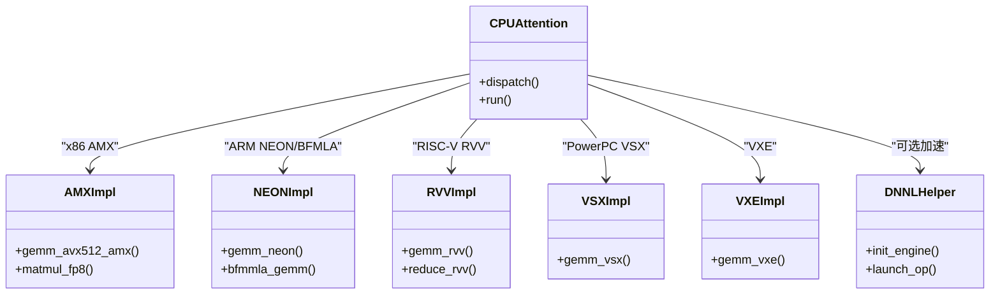
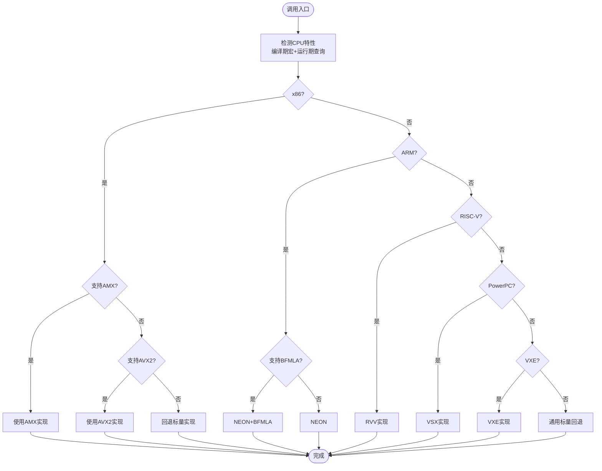
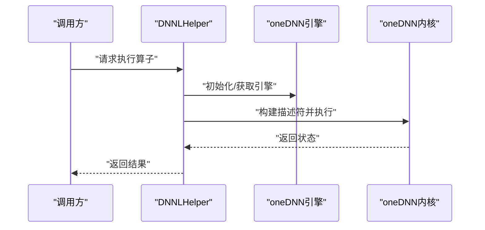
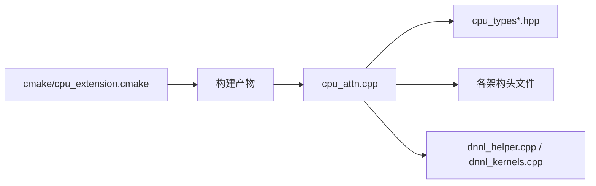

# CPU内核优化

<cite>
**本文引用的文件**   
- [csrc/cpu/cpu_attn.cpp](file://csrc/cpu/cpu_attn.cpp)
- [csrc/cpu/cpu_attn_amx.hpp](file://csrc/cpu/cpu_attn_amx.hpp)
- [csrc/cpu/cpu_attn_neon.hpp](file://csrc/cpu/cpu_attn_neon.hpp)
- [csrc/cpu/cpu_attn_neon_bfmmla.hpp](file://csrc/cpu/cpu_attn_neon_bfmmla.hpp)
- [csrc/cpu/cpu_attn_rvv.hpp](file://csrc/cpu/cpu_attn_rvv.hpp)
- [csrc/cpu/cpu_attn_vsx.hpp](file://csrc/cpu/cpu_attn_vsx.hpp)
- [csrc/cpu/cpu_attn_vxe.hpp](file://csrc/cpu/cpu_attn_vxe.hpp)
- [csrc/cpu/cpu_attn_vec.hpp](file://csrc/cpu/cpu_attn_vec.hpp)
- [csrc/cpu/cpu_attn_vec16.hpp](file://csrc/cpu/cpu_attn_vec16.hpp)
- [csrc/cpu/cpu_arch_macros.h](file://csrc/cpu/cpu_arch_macros.h)
- [csrc/cpu/cpu_types.hpp](file://csrc/cpu/cpu_types.hpp)
- [csrc/cpu/cpu_types_x86.hpp](file://csrc/cpu/cpu_types_x86.hpp)
- [csrc/cpu/cpu_types_arm.hpp](file://csrc/cpu/cpu_types_arm.hpp)
- [csrc/cpu/cpu_types_riscv.hpp](file://csrc/cpu/cpu_types_riscv.hpp)
- [csrc/cpu/cpu_types_riscv_defs.hpp](file://csrc/cpu/cpu_types_riscv_defs.hpp)
- [csrc/cpu/cpu_types_riscv_impl.hpp](file://csrc/cpu/cpu_types_riscv_impl.hpp)
- [csrc/cpu/cpu_types_scalar.hpp](file://csrc/cpu/cpu_types_scalar.hpp)
- [csrc/cpu/cpu_types_vsx.hpp](file://csrc/cpu/cpu_types_vsx.hpp)
- [csrc/cpu/cpu_types_vxe.hpp](file://csrc/cpu/cpu_types_vxe.hpp)
- [csrc/cpu/dnnl_helper.cpp](file://csrc/cpu/dnnl_helper.cpp)
- [csrc/cpu/dnnl_helper.h](file://csrc/cpu/dnnl_helper.h)
- [csrc/cpu/dnnl_kernels.cpp](file://csrc/cpu/dnnl_kernels.cpp)
- [cmake/cpu_extension.cmake](file://cmake/cpu_extension.cmake)
- [benchmarks/kernels/cpu/README.md](file://benchmarks/kernels/cpu/README.md)
- [tests/test_zen_cpu_platform_detection.py](file://tests/test_zen_cpu_platform_detection.py)
</cite>

## 目录
1. [简介](#简介)
2. [项目结构](#项目结构)
3. [核心组件](#核心组件)
4. [架构总览](#架构总览)
5. [详细组件分析](#详细组件分析)
6. [依赖关系分析](#依赖关系分析)
7. [性能考量](#性能考量)
8. [故障排查指南](#故障排查指南)
9. [结论](#结论)
10. [附录](#附录)

## 简介
本文件系统性梳理 vLLM 在 CPU 端的内核实现与优化技术，重点覆盖：
- 多架构（x86、ARM、RISC-V、PowerPC/VSX、VXE）的特定优化策略
- SIMD 指令集使用（AVX2/AMX、NEON/BFMLA、RVV、VSX/VXE）与向量化计算
- 多线程并行处理与内存对齐优化
- Zen 平台特殊优化与 DNNL（oneDNN）集成
- CPU 内核基准测试与调优方法

目标是帮助读者快速理解 vLLM CPU 后端的设计思路、关键路径与可优化点，并提供实践指导。

## 项目结构
CPU 相关代码主要位于 csrc/cpu 目录，按“通用接口 + 架构专用实现”组织：
- 通用类型与宏定义：cpu_types.hpp、cpu_arch_macros.h、cpu_types_* 系列
- 注意力算子：cpu_attn.cpp 及多种架构头文件（AMX、NEON、RVV、VSX、VXE）
- DNNL 集成：dnnl_helper.*、dnnl_kernels.cpp
- 构建配置：cmake/cpu_extension.cmake
- 基准与测试：benchmarks/kernels/cpu、tests/test_zen_cpu_platform_detection.py

```mermaid
graph TB
A["csrc/cpu/cpu_attn.cpp"] --> B["csrc/cpu/cpu_attn_amx.hpp"]
A --> C["csrc/cpu/cpu_attn_neon.hpp"]
A --> D["csrc/cpu/cpu_attn_neon_bfmmla.hpp"]
A --> E["csrc/cpu/cpu_attn_rvv.hpp"]
A --> F["csrc/cpu/cpu_attn_vsx.hpp"]
A --> G["csrc/cpu/cpu_attn_vxe.hpp"]
A --> H["csrc/cpu/cpu_attn_vec.hpp"]
A --> I["csrc/cpu/cpu_attn_vec16.hpp"]
A --> J["csrc/cpu/cpu_types.hpp"]
A --> K["csrc/cpu/cpu_arch_macros.h"]
A --> L["csrc/cpu/dnnl_helper.cpp"]
A --> M["csrc/cpu/dnnl_kernels.cpp"]
```

图表来源
- [csrc/cpu/cpu_attn.cpp](file://csrc/cpu/cpu_attn.cpp)
- [csrc/cpu/cpu_attn_amx.hpp](file://csrc/cpu/cpu_attn_amx.hpp)
- [csrc/cpu/cpu_attn_neon.hpp](file://csrc/cpu/cpu_attn_neon.hpp)
- [csrc/cpu/cpu_attn_neon_bfmmla.hpp](file://csrc/cpu/cpu_attn_neon_bfmmla.hpp)
- [csrc/cpu/cpu_attn_rvv.hpp](file://csrc/cpu/cpu_attn_rvv.hpp)
- [csrc/cpu/cpu_attn_vsx.hpp](file://csrc/cpu/cpu_attn_vsx.hpp)
- [csrc/cpu/cpu_attn_vxe.hpp](file://csrc/cpu/cpu_attn_vxe.hpp)
- [csrc/cpu/cpu_attn_vec.hpp](file://csrc/cpu/cpu_attn_vec.hpp)
- [csrc/cpu/cpu_attn_vec16.hpp](file://csrc/cpu/cpu_attn_vec16.hpp)
- [csrc/cpu/cpu_types.hpp](file://csrc/cpu/cpu_types.hpp)
- [csrc/cpu/cpu_arch_macros.h](file://csrc/cpu/cpu_arch_macros.h)
- [csrc/cpu/dnnl_helper.cpp](file://csrc/cpu/dnnl_helper.cpp)
- [csrc/cpu/dnnl_kernels.cpp](file://csrc/cpu/dnnl_kernels.cpp)

章节来源
- [csrc/cpu/cpu_attn.cpp](file://csrc/cpu/cpu_attn.cpp)
- [csrc/cpu/cpu_types.hpp](file://csrc/cpu/cpu_types.hpp)
- [csrc/cpu/cpu_arch_macros.h](file://csrc/cpu/cpu_arch_macros.h)
- [cmake/cpu_extension.cmake](file://cmake/cpu_extension.cmake)

## 核心组件
- 注意力内核调度与分发：通过统一入口选择不同架构实现，并依据运行时特性启用最优路径。
- 向量类型抽象：为 x86/ARM/RISC-V/PowerPC/VXE 提供统一的向量宽度与数据类型映射，屏蔽底层差异。
- DNNL 集成层：将部分算子委托给 oneDNN，以获得跨厂商的高性能实现。
- 构建与特性检测：编译期宏控制与运行期 CPU 特性探测，确保正确启用 AVX2/AMX、NEON/BFMLA、RVV、VSX/VXE 等。

章节来源
- [csrc/cpu/cpu_attn.cpp](file://csrc/cpu/cpu_attn.cpp)
- [csrc/cpu/cpu_types.hpp](file://csrc/cpu/cpu_types.hpp)
- [csrc/cpu/cpu_types_x86.hpp](file://csrc/cpu/cpu_types_x86.hpp)
- [csrc/cpu/cpu_types_arm.hpp](file://csrc/cpu/cpu_types_arm.hpp)
- [csrc/cpu/cpu_types_riscv.hpp](file://csrc/cpu/cpu_types_riscv.hpp)
- [csrc/cpu/cpu_types_riscv_defs.hpp](file://csrc/cpu/cpu_types_riscv_defs.hpp)
- [csrc/cpu/cpu_types_riscv_impl.hpp](file://csrc/cpu/cpu_types_riscv_impl.hpp)
- [csrc/cpu/cpu_types_vsx.hpp](file://csrc/cpu/cpu_types_vsx.hpp)
- [csrc/cpu/cpu_types_vxe.hpp](file://csrc/cpu/cpu_types_vxe.hpp)
- [csrc/cpu/cpu_types_scalar.hpp](file://csrc/cpu/cpu_types_scalar.hpp)
- [csrc/cpu/dnnl_helper.h](file://csrc/cpu/dnnl_helper.h)
- [csrc/cpu/dnnl_helper.cpp](file://csrc/cpu/dnnl_helper.cpp)
- [csrc/cpu/dnnl_kernels.cpp](file://csrc/cpu/dnnl_kernels.cpp)

## 架构总览
下图展示了 CPU 注意力内核的分发与多架构实现的关系，以及 DNNL 的可选加速路径。

图表来源
- [csrc/cpu/cpu_attn.cpp](file://csrc/cpu/cpu_attn.cpp)
- [csrc/cpu/cpu_attn_amx.hpp](file://csrc/cpu/cpu_attn_amx.hpp)
- [csrc/cpu/cpu_attn_neon.hpp](file://csrc/cpu/cpu_attn_neon.hpp)
- [csrc/cpu/cpu_attn_neon_bfmmla.hpp](file://csrc/cpu/cpu_attn_neon_bfmmla.hpp)
- [csrc/cpu/cpu_attn_rvv.hpp](file://csrc/cpu/cpu_attn_rvv.hpp)
- [csrc/cpu/cpu_attn_vsx.hpp](file://csrc/cpu/cpu_attn_vsx.hpp)
- [csrc/cpu/cpu_attn_vxe.hpp](file://csrc/cpu/cpu_attn_vxe.hpp)
- [csrc/cpu/dnnl_helper.cpp](file://csrc/cpu/dnnl_helper.cpp)

## 详细组件分析

### 注意力内核分发与多架构实现
- 统一入口根据编译期宏与运行期 CPU 能力选择最优实现：
  - x86：优先 AMX/GEMM 路径，回退到 AVX2/标量
  - ARM：NEON 路径，支持 BFMLA 矩阵乘加速
  - RISC-V：RVV 路径，按向量宽度自适应
  - PowerPC：VSX 路径
  - VXE：VXE 专用路径
- 向量类型抽象层统一了不同架构的向量宽度与数据类型，便于模板化与内联展开。

图表来源
- [csrc/cpu/cpu_attn.cpp](file://csrc/cpu/cpu_attn.cpp)
- [csrc/cpu/cpu_arch_macros.h](file://csrc/cpu/cpu_arch_macros.h)
- [csrc/cpu/cpu_types.hpp](file://csrc/cpu/cpu_types.hpp)

章节来源
- [csrc/cpu/cpu_attn.cpp](file://csrc/cpu/cpu_attn.cpp)
- [csrc/cpu/cpu_arch_macros.h](file://csrc/cpu/cpu_arch_macros.h)
- [csrc/cpu/cpu_types.hpp](file://csrc/cpu/cpu_types.hpp)

### x86 架构优化（AVX2/AMX）
- AMX：针对大矩阵乘与注意力计算的块级加速，显著降低访存压力并提升吞吐。
- AVX2：通用向量化路径，适用于中等规模矩阵与逐元素操作。
- 内存对齐：权重与激活张量按 32/64 字节对齐，减少缓存未命中。
- 线程并行：按行/块划分任务，结合 OpenMP/TBB 进行多线程并行。

章节来源
- [csrc/cpu/cpu_attn_amx.hpp](file://csrc/cpu/cpu_attn_amx.hpp)
- [csrc/cpu/cpu_types_x86.hpp](file://csrc/cpu/cpu_types_x86.hpp)
- [csrc/cpu/cpu_attn_vec.hpp](file://csrc/cpu/cpu_attn_vec.hpp)
- [csrc/cpu/cpu_attn_vec16.hpp](file://csrc/cpu/cpu_attn_vec16.hpp)

### ARM 架构优化（NEON/BFMLA）
- NEON：广泛支持的 SIMD 指令集，用于通用向量化计算。
- BFMLA：专为低精度矩阵乘设计的硬件加速，适合量化注意力与 MoE 路由。
- 内存布局：采用列主序或分块布局以匹配 NEON 加载模式。
- 线程模型：按 tile 切分，配合系统线程池提高并发度。

章节来源
- [csrc/cpu/cpu_attn_neon.hpp](file://csrc/cpu/cpu_attn_neon.hpp)
- [csrc/cpu/cpu_attn_neon_bfmmla.hpp](file://csrc/cpu/cpu_attn_neon_bfmmla.hpp)
- [csrc/cpu/cpu_types_arm.hpp](file://csrc/cpu/cpu_types_arm.hpp)

### RISC-V 架构优化（RVV）
- RVV：可变长向量寄存器，按目标芯片向量宽度动态适配。
- 数据规约：利用 RVV 的聚合指令高效实现 softmax、归一化等。
- 内存访问：对齐与合并访问，减少总线占用。
- 并行策略：tile 级别并行与流水线重叠。

章节来源
- [csrc/cpu/cpu_attn_rvv.hpp](file://csrc/cpu/cpu_attn_rvv.hpp)
- [csrc/cpu/cpu_types_riscv.hpp](file://csrc/cpu/cpu_types_riscv.hpp)
- [csrc/cpu/cpu_types_riscv_defs.hpp](file://csrc/cpu/cpu_types_riscv_defs.hpp)
- [csrc/cpu/cpu_types_riscv_impl.hpp](file://csrc/cpu/cpu_types_riscv_impl.hpp)

### PowerPC 与 VXE 优化（VSX/VXE）
- VSX：PowerPC 的 128/256 位 SIMD，用于通用向量化。
- VXE：面向 AI 的扩展指令集，提供专用矩阵与激活加速。
- 内存与线程：与 x86/ARM 类似的 tile 划分与并行策略。

章节来源
- [csrc/cpu/cpu_attn_vsx.hpp](file://csrc/cpu/cpu_attn_vsx.hpp)
- [csrc/cpu/cpu_types_vsx.hpp](file://csrc/cpu/cpu_types_vsx.hpp)
- [csrc/cpu/cpu_attn_vxe.hpp](file://csrc/cpu/cpu_attn_vxe.hpp)
- [csrc/cpu/cpu_types_vxe.hpp](file://csrc/cpu/cpu_types_vxe.hpp)

### DNNL（oneDNN）集成
- 作用：将部分算子（如 GEMM、卷积、归一化）委托给 oneDNN，获得跨厂商优化。
- 初始化：按需创建引擎与流，避免重复开销。
- 调用流程：参数校验 → 描述符构建 → 执行原语 → 结果拷贝。
- 回退机制：当 oneDNN 不可用或不满足约束时，回退到原生实现。

图表来源
- [csrc/cpu/dnnl_helper.h](file://csrc/cpu/dnnl_helper.h)
- [csrc/cpu/dnnl_helper.cpp](file://csrc/cpu/dnnl_helper.cpp)
- [csrc/cpu/dnnl_kernels.cpp](file://csrc/cpu/dnnl_kernels.cpp)

章节来源
- [csrc/cpu/dnnl_helper.h](file://csrc/cpu/dnnl_helper.h)
- [csrc/cpu/dnnl_helper.cpp](file://csrc/cpu/dnnl_helper.cpp)
- [csrc/cpu/dnnl_kernels.cpp](file://csrc/cpu/dnnl_kernels.cpp)

### Zen 平台特殊优化
- 平台检测：识别 Zen 微架构，启用相应优化开关（如缓存大小、预取策略）。
- 内存布局：针对 Zen 的 L1/L2/L3 层级调整 tile 尺寸与步幅。
- 线程亲和：绑定线程到物理核，减少上下文切换与 NUMA 影响。

章节来源
- [tests/test_zen_cpu_platform_detection.py](file://tests/test_zen_cpu_platform_detection.py)

## 依赖关系分析
- 编译期依赖：CMake 配置决定启用哪些架构路径与第三方库（如 oneDNN）。
- 运行期依赖：CPU 特性探测与平台检测决定实际执行路径。
- 模块耦合：注意力内核与类型抽象紧密耦合；DNNL 作为可选加速层，保持松耦合。

图表来源
- [cmake/cpu_extension.cmake](file://cmake/cpu_extension.cmake)
- [csrc/cpu/cpu_attn.cpp](file://csrc/cpu/cpu_attn.cpp)
- [csrc/cpu/cpu_types.hpp](file://csrc/cpu/cpu_types.hpp)
- [csrc/cpu/dnnl_helper.cpp](file://csrc/cpu/dnnl_helper.cpp)
- [csrc/cpu/dnnl_kernels.cpp](file://csrc/cpu/dnnl_kernels.cpp)

章节来源
- [cmake/cpu_extension.cmake](file://cmake/cpu_extension.cmake)
- [csrc/cpu/cpu_attn.cpp](file://csrc/cpu/cpu_attn.cpp)
- [csrc/cpu/dnnl_helper.cpp](file://csrc/cpu/dnnl_helper.cpp)

## 性能考量
- 向量化与指令集：
  - x86：优先 AMX，其次 AVX2；注意 FP8/INT8 路径的选择
  - ARM：NEON + BFMLA 对量化路径增益明显
  - RISC-V：按 RVV 宽度自适应，充分利用聚合指令
- 内存对齐与布局：
  - 权重与激活按 32/64 字节对齐，减少未对齐访存惩罚
  - 分块（tile）与转置以减少缓存缺失
- 多线程并行：
  - 按 tile/行切分，结合线程池与亲和性设置
  - 避免过度并行导致竞争与伪共享
- DNNL 使用：
  - 仅在算子规模与格式匹配时启用，避免额外拷贝
  - 合理设置线程数与内存池
- Zen 平台：
  - 调整 tile 尺寸与预取策略，匹配缓存层次
  - 使用 NUMA 感知分配与绑核

[本节为通用指导，不直接分析具体文件]

## 故障排查指南
- 构建问题：
  - 检查 cmake/cpu_extension.cmake 中是否启用了目标架构与 oneDNN
  - 确认编译器版本与目标平台标志（如 -mavx2、-mfma、-march=native）
- 运行期崩溃：
  - 确认 CPU 特性探测逻辑是否正确（AMX/NEON/RVV/VSX/VXE）
  - 检查内存对齐与张量形状是否符合要求
- 性能异常：
  - 验证线程数与亲和性设置
  - 对比 oneDNN 与原生实现的耗时，定位瓶颈
- Zen 平台：
  - 使用平台检测脚本确认识别结果
  - 调整 tile 尺寸与预取策略

章节来源
- [cmake/cpu_extension.cmake](file://cmake/cpu_extension.cmake)
- [tests/test_zen_cpu_platform_detection.py](file://tests/test_zen_cpu_platform_detection.py)

## 结论
vLLM 的 CPU 内核通过统一的类型抽象与分发机制，在多架构上实现了高效的注意力与相关算子实现。借助 AMX、NEON/BFMLA、RVV、VSX/VXE 等指令集，以及 oneDNN 的跨厂商优化，系统在 x86、ARM、RISC-V、PowerPC 与 VXE 平台上均能获得良好性能。合理的内存对齐、tile 划分与多线程策略是关键。Zen 平台的特殊优化进一步提升了能效。建议在实际部署中结合基准测试与平台特性进行细粒度调优。

[本节为总结，不直接分析具体文件]

## 附录
- 基准测试与调优方法：
  - 使用 benchmarks/kernels/cpu 下的脚本对不同形状与精度进行回归测试
  - 记录不同线程数、tile 尺寸与指令集组合的性能曲线
  - 结合 perf/vtune/arm profiling 工具定位热点与内存瓶颈
  - 逐步启用 oneDNN 与平台优化开关，评估收益与稳定性

章节来源
- [benchmarks/kernels/cpu/README.md](file://benchmarks/kernels/cpu/README.md)