# CUDA内核实现

<cite>
**本文引用的文件**   
- [CMakeLists.txt](file://CMakeLists.txt)
- [setup.py](file://setup.py)
- [csrc/torch_bindings.cpp](file://csrc/torch_bindings.cpp)
- [csrc/ops.h](file://csrc/ops.h)
- [csrc/cuda_utils.h](file://csrc/cuda_utils.h)
- [csrc/cumem_allocator.cpp](file://csrc/cumem_allocator.cpp)
- [csrc/custom_quickreduce.cu](file://csrc/custom_quickreduce.cu)
- [csrc/libtorch_stable/activation_kernels.cu](file://csrc/libtorch_stable/activation_kernels.cu)
- [csrc/libtorch_stable/layernorm_kernels.cu](file://csrc/libtorch_stable/layernorm_kernels.cu)
- [csrc/libtorch_stable/cache_kernels.cu](file://csrc/libtorch_stable/cache_kernels.cu)
- [csrc/libtorch_stable/cache_kernels_fused.cu](file://csrc/libtorch_stable/cache_kernels_fused.cu)
- [csrc/libtorch_stable/pos_encoding_kernels.cu](file://csrc/libtorch_stable/pos_encoding_kernels.cu)
- [csrc/libtorch_stable/sampler.cu](file://csrc/libtorch_stable/sampler.cu)
- [csrc/libtorch_stable/topk.cu](file://csrc/libtorch_stable/topk.cu)
- [csrc/libtorch_stable/nvfp4_kv_cache_kernels.cu](file://csrc/libtorch_stable/nvfp4_kv_cache_kernels.cu)
- [csrc/attention/attention_generic.cuh](file://csrc/attention/attention_generic.cuh)
- [csrc/attention/dtype_bfloat16.cuh](file://csrc/attention/dtype_bfloat16.cuh)
- [csrc/attention/dtype_float16.cuh](file://csrc/attention/dtype_float16.cuh)
- [csrc/attention/dtype_float32.cuh](file://csrc/attention/dtype_float32.cuh)
- [csrc/attention/dtype_fp8.cuh](file://csrc/attention/dtype_fp8.cuh)
- [csrc/cutlass_extensions/vllm_cutlass_library_extension.py](file://csrc/cutlass_extensions/vllm_cutlass_library_extension.py)
- [csrc/cutlass_extensions/cute_utils.cuh](file://csrc/cutlass_extensions/cute_utils.cuh)
- [benchmarks/kernels/benchmark_paged_attention.py](file://benchmarks/kernels/benchmark_paged_attention.py)
- [benchmarks/kernels/benchmark_activation.py](file://benchmarks/kernels/benchmark_activation.py)
- [benchmarks/kernels/benchmark_layernorm.py](file://benchmarks/kernels/benchmark_layernorm.py)
- [benchmarks/kernels/benchmark_rmsnorm.py](file://benchmarks/kernels/benchmark_rmsnorm.py)
- [benchmarks/kernels/benchmark_rope.py](file://benchmarks/kernels/benchmark_rope.py)
- [benchmarks/kernels/benchmark_quant.py](file://benchmarks/kernels/benchmark_quant.py)
- [benchmarks/kernels/benchmark_block_fp8_gemm.py](file://benchmarks/kernels/benchmark_block_fp8_gemm.py)
- [docs/design/paged_attention.md](file://docs/design/paged_attention.md)
- [docs/design/attention_backends.md](file://docs/design/attention_backends.md)
</cite>

## 目录
1. [简介](#简介)
2. [项目结构](#项目结构)
3. [核心组件](#核心组件)
4. [架构总览](#架构总览)
5. [详细组件分析](#详细组件分析)
6. [依赖关系分析](#依赖关系分析)
7. [性能考量](#性能考量)
8. [故障排查指南](#故障排查指南)
9. [结论](#结论)
10. [附录](#附录)

## 简介
本文件系统性梳理 vLLM 中 CUDA 内核的实现架构，重点覆盖：
- C++/CUDA 自定义算子的设计模式与调用路径
- 内存分配策略、线程块组织、共享内存使用与 GPU 同步机制
- 注意力机制的 CUDA 实现（FlashAttention、PagedAttention）的核心算法与优化
- 量化算子、激活函数、归一化层等常用算子的 CUDA 实现细节
- CUDA 内核的编译配置、调试方法与性能分析技巧

## 项目结构
vLLM 的 CUDA 内核主要位于 csrc 目录，Python 绑定与构建脚本在根目录与 tools 下。关键目录说明：
- csrc/libtorch_stable: 大量 .cu/.cuh 实现的通用算子（激活、归一化、位置编码、采样、TopK、KV Cache 等）
- csrc/attention: 注意力相关类型与通用模板
- csrc/cutlass_extensions: CUTLASS/CUTE 扩展与类型工具
- csrc/cumem_allocator.cpp: 基于 CUDA Memory API 的分配器
- csrc/custom_quickreduce.cu: 自定义快速规约内核
- benchmarks/kernels: 针对各内核的基准测试脚本
- docs/design: 注意力后端与 PagedAttention 的设计文档
- setup.py, CMakeLists.txt: 构建与打包入口

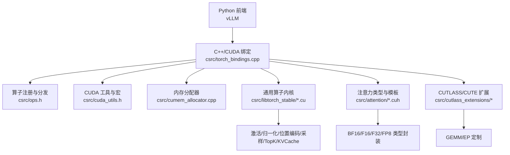

图表来源 
- [csrc/torch_bindings.cpp](file://csrc/torch_bindings.cpp)
- [csrc/ops.h](file://csrc/ops.h)
- [csrc/cuda_utils.h](file://csrc/cuda_utils.h)
- [csrc/cumem_allocator.cpp](file://csrc/cumem_allocator.cpp)
- [csrc/libtorch_stable/activation_kernels.cu](file://csrc/libtorch_stable/activation_kernels.cu)
- [csrc/attention/dtype_bfloat16.cuh](file://csrc/attention/dtype_bfloat16.cuh)
- [csrc/cutlass_extensions/vllm_cutlass_library_extension.py](file://csrc/cutlass_extensions/vllm_cutlass_library_extension.py)

章节来源
- [CMakeLists.txt](file://CMakeLists.txt)
- [setup.py](file://setup.py)
- [csrc/torch_bindings.cpp](file://csrc/torch_bindings.cpp)
- [csrc/ops.h](file://csrc/ops.h)
- [csrc/cuda_utils.h](file://csrc/cuda_utils.h)
- [csrc/cumem_allocator.cpp](file://csrc/cumem_allocator.cpp)
- [csrc/libtorch_stable/activation_kernels.cu](file://csrc/libtorch_stable/activation_kernels.cu)
- [csrc/attention/dtype_bfloat16.cuh](file://csrc/attention/dtype_bfloat16.cuh)
- [csrc/cutlass_extensions/vllm_cutlass_library_extension.py](file://csrc/cutlass_extensions/vllm_cutlass_library_extension.py)

## 核心组件
- 绑定与注册层
  - torch_bindings.cpp 负责将 Python 接口暴露给 PyTorch，并调度到具体 C++/CUDA 实现
  - ops.h 定义算子签名与注册宏，统一参数校验与设备管理
- CUDA 工具与内存
  - cuda_utils.h 提供线程块/网格尺寸计算、错误检查、流管理等基础能力
  - cumem_allocator.cpp 基于 CUDA Memory API 的分配器，支持池化与统计
- 通用算子内核
  - activation_kernels.cu: SiLU/GELU/ReLU 等激活
  - layernorm_kernels.cu / rmsnorm 相关: LayerNorm/RMSNorm
  - pos_encoding_kernels.cu: RoPE 旋转位置编码
  - sampler.cu: 采样（Top-k/p、温度缩放等）
  - topk.cu: Top-K 选择
  - cache_kernels.cu / cache_kernels_fused.cu: KV Cache 读写与融合操作
  - nvfp4_kv_cache_kernels.cu: NVFP4 格式的 KV Cache 内核
- 注意力与类型
  - attention_generic.cuh 及 dtype_* 头文件提供注意力数据类型与通用模板
  - cutlass_extensions 提供 CUTLASS/CUTE 的扩展与类型转换工具

章节来源
- [csrc/torch_bindings.cpp](file://csrc/torch_bindings.cpp)
- [csrc/ops.h](file://csrc/ops.h)
- [csrc/cuda_utils.h](file://csrc/cuda_utils.h)
- [csrc/cumem_allocator.cpp](file://csrc/cumem_allocator.cpp)
- [csrc/libtorch_stable/activation_kernels.cu](file://csrc/libtorch_stable/activation_kernels.cu)
- [csrc/libtorch_stable/layernorm_kernels.cu](file://csrc/libtorch_stable/layernorm_kernels.cu)
- [csrc/libtorch_stable/pos_encoding_kernels.cu](file://csrc/libtorch_stable/pos_encoding_kernels.cu)
- [csrc/libtorch_stable/sampler.cu](file://csrc/libtorch_stable/sampler.cu)
- [csrc/libtorch_stable/topk.cu](file://csrc/libtorch_stable/topk.cu)
- [csrc/libtorch_stable/cache_kernels.cu](file://csrc/libtorch_stable/cache_kernels.cu)
- [csrc/libtorch_stable/cache_kernels_fused.cu](file://csrc/libtorch_stable/cache_kernels_fused.cu)
- [csrc/libtorch_stable/nvfp4_kv_cache_kernels.cu](file://csrc/libtorch_stable/nvfp4_kv_cache_kernels.cu)
- [csrc/attention/attention_generic.cuh](file://csrc/attention/attention_generic.cuh)
- [csrc/attention/dtype_bfloat16.cuh](file://csrc/attention/dtype_bfloat16.cuh)
- [csrc/attention/dtype_float16.cuh](file://csrc/attention/dtype_float16.cuh)
- [csrc/attention/dtype_float32.cuh](file://csrc/attention/dtype_float32.cuh)
- [csrc/attention/dtype_fp8.cuh](file://csrc/attention/dtype_fp8.cuh)
- [csrc/cutlass_extensions/vllm_cutlass_library_extension.py](file://csrc/cutlass_extensions/vllm_cutlass_library_extension.py)

## 架构总览
下图展示从 Python 调用到 CUDA 内核执行的端到端流程，以及关键模块间的依赖关系。

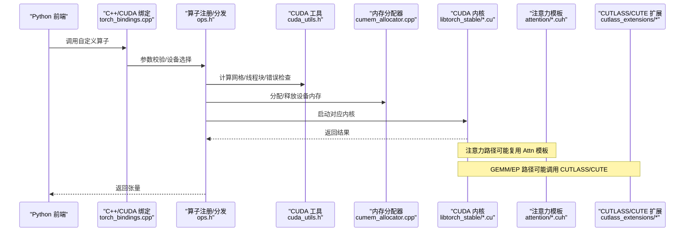

图表来源 
- [csrc/torch_bindings.cpp](file://csrc/torch_bindings.cpp)
- [csrc/ops.h](file://csrc/ops.h)
- [csrc/cuda_utils.h](file://csrc/cuda_utils.h)
- [csrc/cumem_allocator.cpp](file://csrc/cumem_allocator.cpp)
- [csrc/libtorch_stable/activation_kernels.cu](file://csrc/libtorch_stable/activation_kernels.cu)
- [csrc/attention/attention_generic.cuh](file://csrc/attention/attention_generic.cuh)
- [csrc/cutlass_extensions/vllm_cutlass_library_extension.py](file://csrc/cutlass_extensions/vllm_cutlass_library_extension.py)

## 详细组件分析

### 自定义算子与绑定层
- 绑定层职责
  - 解析 Python 参数，转换为 C++/CUDA 可接受的类型与布局
  - 处理设备切换、流管理与错误传播
- 算子注册
  - 通过 ops.h 中的注册宏统一声明算子签名，便于集中维护与扩展
- 典型调用链
  - Python -> torch_bindings.cpp -> ops.h -> 具体 .cu 内核

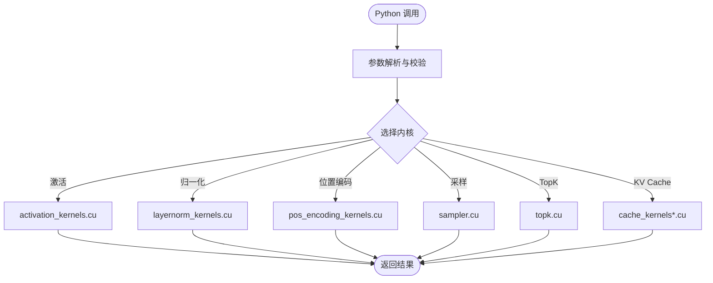

图表来源 
- [csrc/torch_bindings.cpp](file://csrc/torch_bindings.cpp)
- [csrc/ops.h](file://csrc/ops.h)
- [csrc/libtorch_stable/activation_kernels.cu](file://csrc/libtorch_stable/activation_kernels.cu)
- [csrc/libtorch_stable/layernorm_kernels.cu](file://csrc/libtorch_stable/layernorm_kernels.cu)
- [csrc/libtorch_stable/pos_encoding_kernels.cu](file://csrc/libtorch_stable/pos_encoding_kernels.cu)
- [csrc/libtorch_stable/sampler.cu](file://csrc/libtorch_stable/sampler.cu)
- [csrc/libtorch_stable/topk.cu](file://csrc/libtorch_stable/topk.cu)
- [csrc/libtorch_stable/cache_kernels.cu](file://csrc/libtorch_stable/cache_kernels.cu)
- [csrc/libtorch_stable/cache_kernels_fused.cu](file://csrc/libtorch_stable/cache_kernels_fused.cu)

章节来源
- [csrc/torch_bindings.cpp](file://csrc/torch_bindings.cpp)
- [csrc/ops.h](file://csrc/ops.h)

### 内存分配策略
- 分配器实现
  - cumem_allocator.cpp 基于 CUDA Memory API，支持池化、统计与对齐
- 使用场景
  - 内核前临时缓冲、中间结果缓存、KV Cache 存储
- 最佳实践
  - 按块大小对齐、避免频繁分配/释放、复用缓冲区

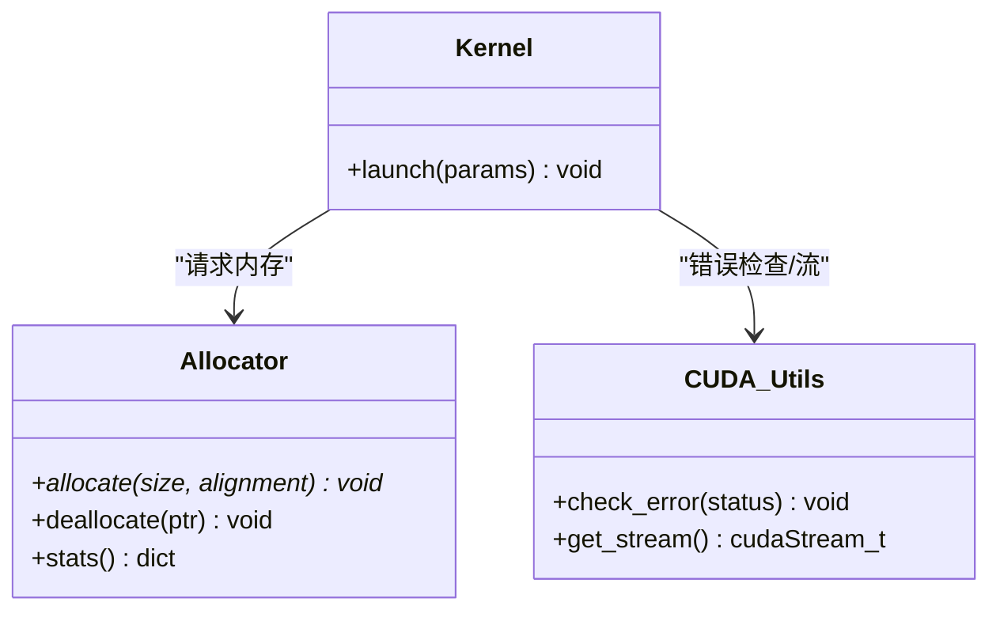

图表来源 
- [csrc/cumem_allocator.cpp](file://csrc/cumem_allocator.cpp)
- [csrc/cuda_utils.h](file://csrc/cuda_utils.h)

章节来源
- [csrc/cumem_allocator.cpp](file://csrc/cumem_allocator.cpp)
- [csrc/cuda_utils.h](file://csrc/cuda_utils.h)

### 线程块组织与共享内存
- 线程块组织
  - 依据数据形状动态计算 grid/block 维度，保证充分并行度与访存合并
- 共享内存使用
  - 对热点数据（如权重分块、KV 片段）进行片内缓存，减少全局内存访问
- 同步机制
  - __syncthreads() 用于块内同步；跨块同步通过原子或后续内核完成

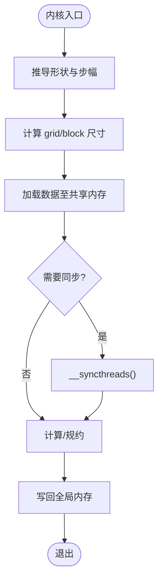

图表来源 
- [csrc/cuda_utils.h](file://csrc/cuda_utils.h)
- [csrc/libtorch_stable/activation_kernels.cu](file://csrc/libtorch_stable/activation_kernels.cu)
- [csrc/libtorch_stable/layernorm_kernels.cu](file://csrc/libtorch_stable/layernorm_kernels.cu)

章节来源
- [csrc/cuda_utils.h](file://csrc/cuda_utils.h)
- [csrc/libtorch_stable/activation_kernels.cu](file://csrc/libtorch_stable/activation_kernels.cu)
- [csrc/libtorch_stable/layernorm_kernels.cu](file://csrc/libtorch_stable/layernorm_kernels.cu)

### 注意力机制（FlashAttention、PagedAttention）
- FlashAttention
  - 以分块扫描与在线 softmax 为核心，显著降低显存占用并提升吞吐
  - 利用共享内存与寄存器堆叠，最大化带宽利用率
- PagedAttention
  - 将 KV Cache 分页管理，支持长上下文与高并发
  - 结合页表索引与块级访存优化，减少碎片与拷贝

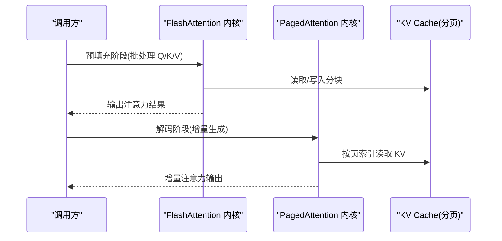

图表来源 
- [csrc/attention/attention_generic.cuh](file://csrc/attention/attention_generic.cuh)
- [csrc/attention/dtype_bfloat16.cuh](file://csrc/attention/dtype_bfloat16.cuh)
- [csrc/attention/dtype_float16.cuh](file://csrc/attention/dtype_float16.cuh)
- [csrc/attention/dtype_float32.cuh](file://csrc/attention/dtype_float32.cuh)
- [csrc/attention/dtype_fp8.cuh](file://csrc/attention/dtype_fp8.cuh)
- [docs/design/paged_attention.md](file://docs/design/paged_attention.md)
- [docs/design/attention_backends.md](file://docs/design/attention_backends.md)

章节来源
- [csrc/attention/attention_generic.cuh](file://csrc/attention/attention_generic.cuh)
- [csrc/attention/dtype_bfloat16.cuh](file://csrc/attention/dtype_bfloat16.cuh)
- [csrc/attention/dtype_float16.cuh](file://csrc/attention/dtype_float16.cuh)
- [csrc/attention/dtype_float32.cuh](file://csrc/attention/dtype_float32.cuh)
- [csrc/attention/dtype_fp8.cuh](file://csrc/attention/dtype_fp8.cuh)
- [docs/design/paged_attention.md](file://docs/design/paged_attention.md)
- [docs/design/attention_backends.md](file://docs/design/attention_backends.md)

### 量化算子与 FP8/GEMM
- 量化路径
  - per-token/per-channel 量化、W8A8/W4A16 等格式
  - FP8 参与 GEMM 与 KV Cache 存储，降低带宽压力
- GEMM 加速
  - 借助 CUTLASS/CUTE 扩展，适配不同精度与矩阵形状
  - 核选择与自动调参由 benchmark 驱动

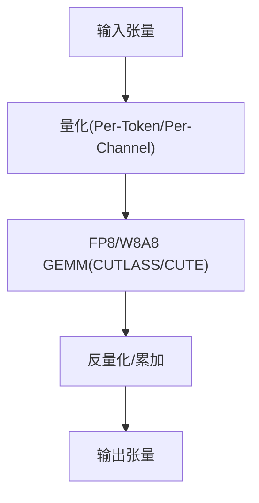

图表来源 
- [csrc/cutlass_extensions/vllm_cutlass_library_extension.py](file://csrc/cutlass_extensions/vllm_cutlass_library_extension.py)
- [csrc/cutlass_extensions/cute_utils.cuh](file://csrc/cutlass_extensions/cute_utils.cuh)
- [csrc/libtorch_stable/nvfp4_kv_cache_kernels.cu](file://csrc/libtorch_stable/nvfp4_kv_cache_kernels.cu)
- [benchmarks/kernels/benchmark_quant.py](file://benchmarks/kernels/benchmark_quant.py)
- [benchmarks/kernels/benchmark_block_fp8_gemm.py](file://benchmarks/kernels/benchmark_block_fp8_gemm.py)

章节来源
- [csrc/cutlass_extensions/vllm_cutlass_library_extension.py](file://csrc/cutlass_extensions/vllm_cutlass_library_extension.py)
- [csrc/cutlass_extensions/cute_utils.cuh](file://csrc/cutlass_extensions/cute_utils.cuh)
- [csrc/libtorch_stable/nvfp4_kv_cache_kernels.cu](file://csrc/libtorch_stable/nvfp4_kv_cache_kernels.cu)
- [benchmarks/kernels/benchmark_quant.py](file://benchmarks/kernels/benchmark_quant.py)
- [benchmarks/kernels/benchmark_block_fp8_gemm.py](file://benchmarks/kernels/benchmark_block_fp8_gemm.py)

### 激活函数与归一化层
- 激活函数
  - SiLU、GELU、ReLU 等，采用向量化访存与分支预测优化
- 归一化
  - LayerNorm/RMSNorm 使用块内规约与共享内存缓存均值/方差
  - 融合变体减少内核启动开销

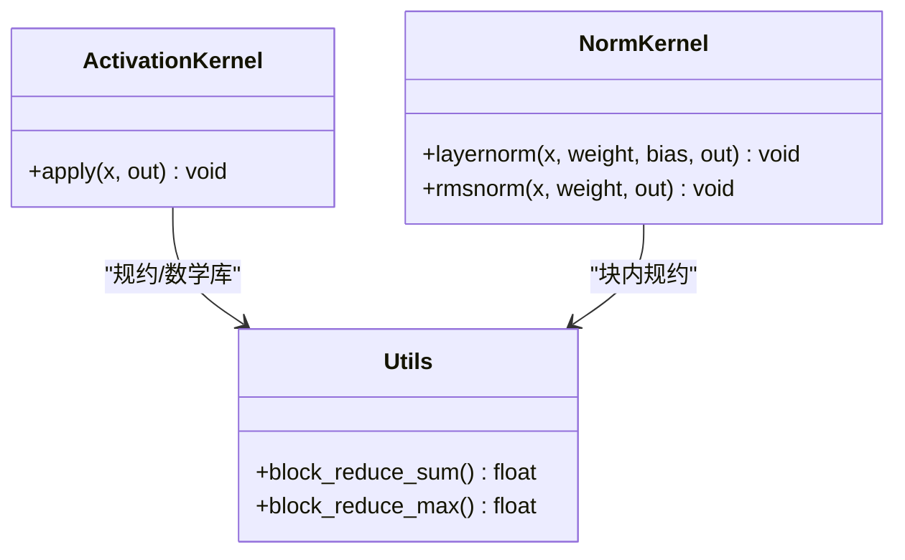

图表来源 
- [csrc/libtorch_stable/activation_kernels.cu](file://csrc/libtorch_stable/activation_kernels.cu)
- [csrc/libtorch_stable/layernorm_kernels.cu](file://csrc/libtorch_stable/layernorm_kernels.cu)

章节来源
- [csrc/libtorch_stable/activation_kernels.cu](file://csrc/libtorch_stable/activation_kernels.cu)
- [csrc/libtorch_stable/layernorm_kernels.cu](file://csrc/libtorch_stable/layernorm_kernels.cu)

### 位置编码与采样
- 位置编码（RoPE）
  - 原地更新 Q/K 向量，避免额外内存分配
- 采样（Top-k/p、温度缩放）
  - 使用高效排序与概率变换，减少 CPU-GPU 往返

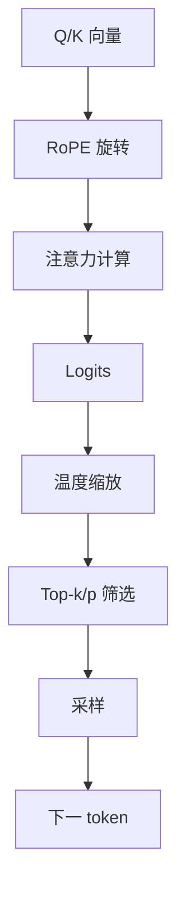

图表来源 
- [csrc/libtorch_stable/pos_encoding_kernels.cu](file://csrc/libtorch_stable/pos_encoding_kernels.cu)
- [csrc/libtorch_stable/sampler.cu](file://csrc/libtorch_stable/sampler.cu)
- [csrc/libtorch_stable/topk.cu](file://csrc/libtorch_stable/topk.cu)

章节来源
- [csrc/libtorch_stable/pos_encoding_kernels.cu](file://csrc/libtorch_stable/pos_encoding_kernels.cu)
- [csrc/libtorch_stable/sampler.cu](file://csrc/libtorch_stable/sampler.cu)
- [csrc/libtorch_stable/topk.cu](file://csrc/libtorch_stable/topk.cu)

### KV Cache 与分页管理
- KV Cache 内核
  - 读写、拼接、替换与融合操作，支持多种数据类型
- 分页管理
  - 页表映射、块级分配与回收，减少碎片与拷贝

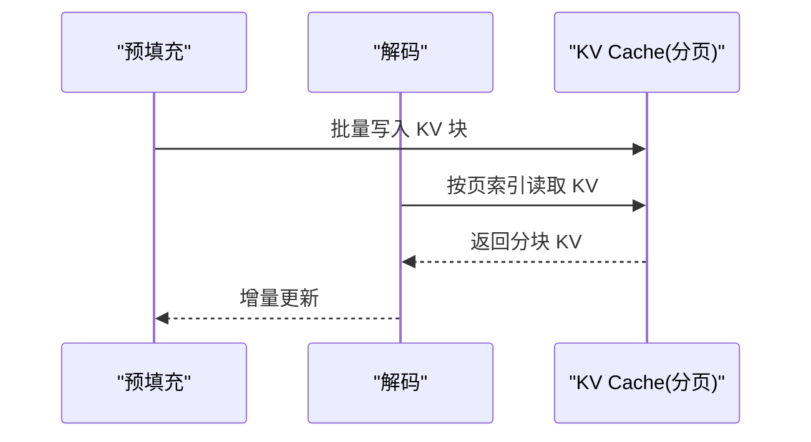

图表来源 
- [csrc/libtorch_stable/cache_kernels.cu](file://csrc/libtorch_stable/cache_kernels.cu)
- [csrc/libtorch_stable/cache_kernels_fused.cu](file://csrc/libtorch_stable/cache_kernels_fused.cu)
- [csrc/libtorch_stable/nvfp4_kv_cache_kernels.cu](file://csrc/libtorch_stable/nvfp4_kv_cache_kernels.cu)

章节来源
- [csrc/libtorch_stable/cache_kernels.cu](file://csrc/libtorch_stable/cache_kernels.cu)
- [csrc/libtorch_stable/cache_kernels_fused.cu](file://csrc/libtorch_stable/cache_kernels_fused.cu)
- [csrc/libtorch_stable/nvfp4_kv_cache_kernels.cu](file://csrc/libtorch_stable/nvfp4_kv_cache_kernels.cu)

### 自定义快速规约
- custom_quickreduce.cu
  - 针对特定规约模式的优化实现，减少通信与同步开销
  - 适用于分布式场景下的聚合操作

章节来源
- [csrc/custom_quickreduce.cu](file://csrc/custom_quickreduce.cu)

## 依赖关系分析
- 模块耦合
  - 绑定层与算子注册强耦合；内核与工具库松耦合
- 外部依赖
  - CUTLASS/CUTE 用于高性能 GEMM；CUDA Runtime/Memory API 用于内存与流管理
- 潜在循环依赖
  - 通过头文件抽象与模板解耦，避免直接循环引用

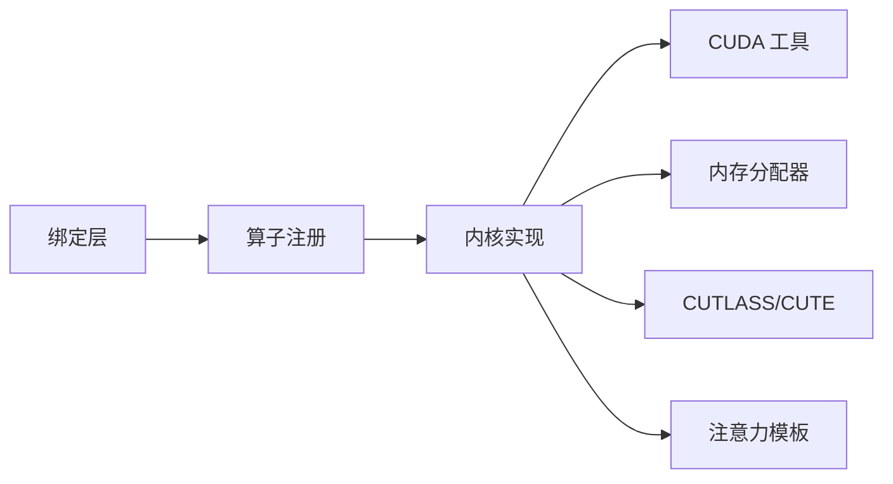

图表来源 
- [csrc/torch_bindings.cpp](file://csrc/torch_bindings.cpp)
- [csrc/ops.h](file://csrc/ops.h)
- [csrc/cuda_utils.h](file://csrc/cuda_utils.h)
- [csrc/cumem_allocator.cpp](file://csrc/cumem_allocator.cpp)
- [csrc/cutlass_extensions/vllm_cutlass_library_extension.py](file://csrc/cutlass_extensions/vllm_cutlass_library_extension.py)
- [csrc/attention/attention_generic.cuh](file://csrc/attention/attention_generic.cuh)

章节来源
- [csrc/torch_bindings.cpp](file://csrc/torch_bindings.cpp)
- [csrc/ops.h](file://csrc/ops.h)
- [csrc/cuda_utils.h](file://csrc/cuda_utils.h)
- [csrc/cumem_allocator.cpp](file://csrc/cumem_allocator.cpp)
- [csrc/cutlass_extensions/vllm_cutlass_library_extension.py](file://csrc/cutlass_extensions/vllm_cutlass_library_extension.py)
- [csrc/attention/attention_generic.cuh](file://csrc/attention/attention_generic.cuh)

## 性能考量
- 访存优化
  - 合并访问、向量化加载、共享内存缓存热点数据
- 并行度与粒度
  - 合理划分 block/grid，避免 warp 分歧与空转
- 内核融合
  - 减少内核启动与中间结果写回，提高带宽利用率
- 精度与吞吐权衡
  - FP8/W8A8 等低精度路径在保持精度的前提下提升吞吐
- 基准与调优
  - 使用 benchmarks/kernels 下的脚本进行形状扫描与参数搜索

[本节为通用指导，不直接分析具体文件]

## 故障排查指南
- 常见错误
  - 非法内存访问、未对齐分配、流不同步导致的数据竞争
- 定位方法
  - 启用 CUDA 错误检查宏；使用 nsight-compute/nsys 采集内核时序与访存行为
- 调试建议
  - 逐步缩小问题形状；打印关键中间状态；验证边界条件与步幅计算

章节来源
- [csrc/cuda_utils.h](file://csrc/cuda_utils.h)
- [csrc/cumem_allocator.cpp](file://csrc/cumem_allocator.cpp)

## 结论
vLLM 的 CUDA 内核体系围绕“绑定-注册-内核”三层展开，配合统一的工具库与内存分配器，形成可扩展、高性能的算子生态。注意力路径通过 FlashAttention 与 PagedAttention 兼顾吞吐与显存效率；量化与 GEMM 借助 CUTLASS/CUTE 实现多精度加速。通过系统化的基准与调试手段，可在复杂模型与大规模部署中持续优化性能。

[本节为总结性内容，不直接分析具体文件]

## 附录
- 编译与构建
  - 使用 setup.py 与 CMakeLists.txt 进行构建；根据目标平台选择 CUDA/ROCm/XPU 后端
- 调试与分析
  - 使用 CUDA 工具链与 vLLM 提供的基准脚本进行性能剖析与回归测试

章节来源
- [CMakeLists.txt](file://CMakeLists.txt)
- [setup.py](file://setup.py)
- [benchmarks/kernels/benchmark_paged_attention.py](file://benchmarks/kernels/benchmark_paged_attention.py)
- [benchmarks/kernels/benchmark_activation.py](file://benchmarks/kernels/benchmark_activation.py)
- [benchmarks/kernels/benchmark_layernorm.py](file://benchmarks/kernels/benchmark_layernorm.py)
- [benchmarks/kernels/benchmark_rmsnorm.py](file://benchmarks/kernels/benchmark_rmsnorm.py)
- [benchmarks/kernels/benchmark_rope.py](file://benchmarks/kernels/benchmark_rope.py)
- [benchmarks/kernels/benchmark_quant.py](file://benchmarks/kernels/benchmark_quant.py)
- [benchmarks/kernels/benchmark_block_fp8_gemm.py](file://benchmarks/kernels/benchmark_block_fp8_gemm.py)