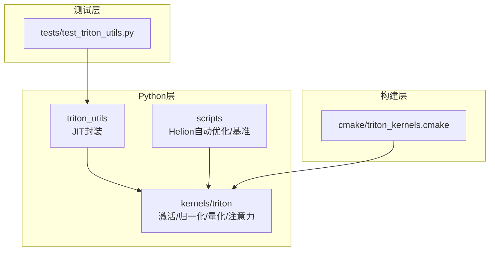
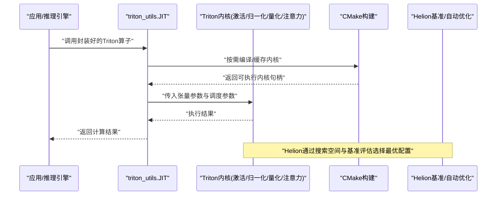
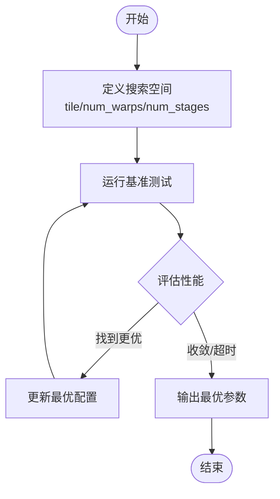
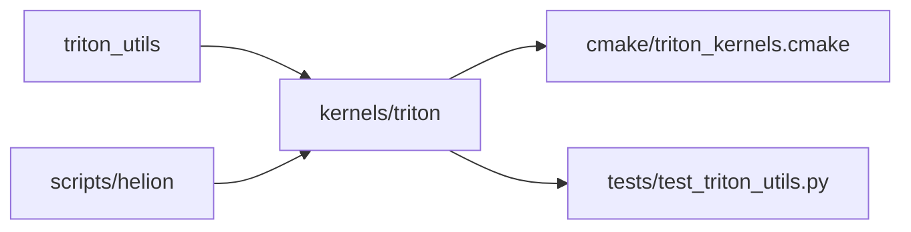

# Triton内核开发

<cite>
**本文引用的文件**   
- [vllm/triton_utils/__init__.py](file://vllm/triton_utils/__init__.py)
- [vllm/triton_utils/jit.py](file://vllm/triton_utils/jit.py)
- [vllm/kernels/triton/activation.py](file://vllm/kernels/triton/activation.py)
- [vllm/kernels/triton/layernorm.py](file://vllm/kernels/triton/layernorm.py)
- [vllm/kernels/triton/quantization.py](file://vllm/kernels/triton/quantization.py)
- [vllm/kernels/triton/attention.py](file://vllm/kernels/triton/attention.py)
- [scripts/autotune_helion_kernels.py](file://scripts/autotune_helion_kernels.py)
- [scripts/benchmark_helion_kernels.py](file://scripts/benchmark_helion_kernels.py)
- [cmake/triton_kernels.cmake](file://cmake/triton_kernels.cmake)
- [tests/test_triton_utils.py](file://tests/test_triton_utils.py)
</cite>

## 目录
1. [简介](#简介)
2. [项目结构](#项目结构)
3. [核心组件](#核心组件)
4. [架构总览](#架构总览)
5. [详细组件分析](#详细组件分析)
6. [依赖关系分析](#依赖关系分析)
7. [性能考量](#性能考量)
8. [故障排查指南](#故障排查指南)
9. [结论](#结论)
10. [附录](#附录)

## 简介
本文件面向希望在vLLM中使用和开发Triton内核的工程师与研究者，系统阐述：
- Triton语言在GPU编程中的优势与适用场景
- vLLM中Triton内核的组织方式、内存模型与并行执行机制
- Helion自动优化框架的工作原理与使用方法
- Aiter算子在ROCm生态中的集成与优化策略
- Triton内核的性能调优、调试技巧与最佳实践
- 结合仓库内示例与基准脚本的实践路径

## 项目结构
vLLM中与Triton相关的代码主要分布在以下位置：
- triton工具与JIT封装：vllm/triton_utils
- Triton内核实现：vllm/kernels/triton（激活、归一化、量化、注意力等）
- Helion自动优化与基准脚本：scripts
- CMake构建配置：cmake/triton_kernels.cmake
- 测试用例：tests/test_triton_utils.py

图表来源
- [vllm/triton_utils/__init__.py](file://vllm/triton_utils/__init__.py)
- [vllm/kernels/triton/activation.py](file://vllm/kernels/triton/activation.py)
- [scripts/autotune_helion_kernels.py](file://scripts/autotune_helion_kernels.py)
- [cmake/triton_kernels.cmake](file://cmake/triton_kernels.cmake)
- [tests/test_triton_utils.py](file://tests/test_triton_utils.py)

章节来源
- [vllm/triton_utils/__init__.py](file://vllm/triton_utils/__init__.py)
- [vllm/kernels/triton/activation.py](file://vllm/kernels/triton/activation.py)
- [scripts/autotune_helion_kernels.py](file://scripts/autotune_helion_kernels.py)
- [cmake/triton_kernels.cmake](file://cmake/triton_kernels.cmake)
- [tests/test_triton_utils.py](file://tests/test_triton_utils.py)

## 核心组件
- Triton JIT封装与工具函数：提供统一的编译、缓存与调用入口，屏蔽底层差异，便于上层模块直接调用。
- Triton内核集合：覆盖激活函数、LayerNorm/RMSNorm、量化相关操作、注意力子核等典型高性能算子。
- Helion自动优化：通过搜索空间定义与自动调参，生成针对目标硬件的最优内核配置。
- 构建集成：CMake脚本负责Triton内核的编译与链接，确保在不同平台与CUDA/ROCm环境下可用。
- 测试与验证：单元测试与基准脚本保障正确性与性能回归。

章节来源
- [vllm/triton_utils/jit.py](file://vllm/triton_utils/jit.py)
- [vllm/kernels/triton/activation.py](file://vllm/kernels/triton/activation.py)
- [vllm/kernels/triton/layernorm.py](file://vllm/kernels/triton/layernorm.py)
- [vllm/kernels/triton/quantization.py](file://vllm/kernels/triton/quantization.py)
- [vllm/kernels/triton/attention.py](file://vllm/kernels/triton/attention.py)
- [cmake/triton_kernels.cmake](file://cmake/triton_kernels.cmake)
- [tests/test_triton_utils.py](file://tests/test_triton_utils.py)

## 架构总览
下图展示了从Python调用到Triton内核执行的总体流程，以及Helion自动优化的介入点。

图表来源
- [vllm/triton_utils/jit.py](file://vllm/triton_utils/jit.py)
- [cmake/triton_kernels.cmake](file://cmake/triton_kernels.cmake)
- [scripts/benchmark_helion_kernels.py](file://scripts/benchmark_helion_kernels.py)

## 详细组件分析

### Triton内核编写规范与内存模型
- 线程与块映射：使用Triton的block维度组织数据分块，合理划分网格以匹配GPU流多处理器数量。
- 内存访问模式：优先顺序访问与向量化加载，减少bank冲突；对共享内存进行显式同步。
- 数据类型与精度：根据硬件特性选择fp16/bf16/fp8等，注意数值稳定性与溢出处理。
- 边界条件：处理非对齐长度、动态形状与越界访问，保证鲁棒性。
- 资源限制：控制寄存器与共享内存占用，避免阻塞过多线程块。

章节来源
- [vllm/kernels/triton/activation.py](file://vllm/kernels/triton/activation.py)
- [vllm/kernels/triton/layernorm.py](file://vllm/kernels/triton/layernorm.py)
- [vllm/kernels/triton/quantization.py](file://vllm/kernels/triton/quantization.py)

### 并行执行机制
- 网格与块：通过grid-stride循环与tile大小调节，最大化吞吐并降低延迟。
- 归约与同步：使用Triton内置归约原语与barrier同步，确保跨线程一致性。
- 流水线与融合：将多个操作融合为单一内核，减少访存开销与中间结果写入。

章节来源
- [vllm/kernels/triton/attention.py](file://vllm/kernels/triton/attention.py)
- [vllm/kernels/triton/layernorm.py](file://vllm/kernels/triton/layernorm.py)

### Helion自动优化框架
- 工作原理：定义搜索空间（如tile size、num_stages、num_warps），基于基准运行时间自动选择最优配置。
- 使用方法：通过脚本驱动搜索与评估，输出最优参数集并回写到内核或配置文件。
- 集成方式：与vLLM的构建与测试流程结合，确保不同硬件上的稳定性能。

图表来源
- [scripts/autotune_helion_kernels.py](file://scripts/autotune_helion_kernels.py)
- [scripts/benchmark_helion_kernels.py](file://scripts/benchmark_helion_kernels.py)

章节来源
- [scripts/autotune_helion_kernels.py](file://scripts/autotune_helion_kernels.py)
- [scripts/benchmark_helion_kernels.py](file://scripts/benchmark_helion_kernels.py)

### Aiter算子的集成与优化策略
- 背景：Aiter是ROCm生态中的高性能算子库，vLLM在AMD平台上通过特定路径集成。
- 集成要点：在构建阶段启用Aiter后端，按设备能力选择合适内核版本。
- 优化策略：与Triton内核互补，针对GEMM、归约、通信等操作进行专门优化。

章节来源
- [cmake/triton_kernels.cmake](file://cmake/triton_kernels.cmake)

### Triton内核性能调优与调试技巧
- 性能调优：
  - 调整tile大小与num_warps，平衡吞吐与延迟
  - 减少不必要的内存拷贝与类型转换
  - 利用共享内存与向量化加载提升带宽利用率
- 调试技巧：
  - 使用最小复现用例定位问题
  - 打印关键中间变量与统计信息
  - 借助NVIDIA/AMD厂商工具进行profiling

章节来源
- [vllm/kernels/triton/activation.py](file://vllm/kernels/triton/activation.py)
- [vllm/kernels/triton/layernorm.py](file://vllm/kernels/triton/layernorm.py)
- [vllm/kernels/triton/quantization.py](file://vllm/kernels/triton/quantization.py)

### 具体代码示例与性能对比分析
- 示例路径：参考vLLM中Triton内核实现与测试文件，理解典型用法与参数设置。
- 性能对比：通过基准脚本对不同配置进行评估，比较Triton与原生实现或替代内核的性能差异。

章节来源
- [vllm/kernels/triton/activation.py](file://vllm/kernels/triton/activation.py)
- [vllm/kernels/triton/layernorm.py](file://vllm/kernels/triton/layernorm.py)
- [vllm/kernels/triton/quantization.py](file://vllm/kernels/triton/quantization.py)
- [scripts/benchmark_helion_kernels.py](file://scripts/benchmark_helion_kernels.py)

## 依赖关系分析
Triton内核与工具、构建与测试之间的依赖关系如下：

图表来源
- [vllm/triton_utils/__init__.py](file://vllm/triton_utils/__init__.py)
- [vllm/kernels/triton/activation.py](file://vllm/kernels/triton/activation.py)
- [cmake/triton_kernels.cmake](file://cmake/triton_kernels.cmake)
- [tests/test_triton_utils.py](file://tests/test_triton_utils.py)
- [scripts/autotune_helion_kernels.py](file://scripts/autotune_helion_kernels.py)

章节来源
- [vllm/triton_utils/__init__.py](file://vllm/triton_utils/__init__.py)
- [vllm/kernels/triton/activation.py](file://vllm/kernels/triton/activation.py)
- [cmake/triton_kernels.cmake](file://cmake/triton_kernels.cmake)
- [tests/test_triton_utils.py](file://tests/test_triton_utils.py)
- [scripts/autotune_helion_kernels.py](file://scripts/autotune_helion_kernels.py)

## 性能考量
- 访存优化：合并读写、避免bank冲突、使用向量化指令
- 计算密度：提高算术强度，减少内存带宽瓶颈
- 并行度：合理设置线程块与网格，充分利用SM资源
- 精度与稳定性：在低精度下保持数值稳定，必要时引入混合精度
- 平台差异：针对不同GPU架构（NVIDIA/AMD）进行差异化优化

[本节为通用指导，不直接分析具体文件]

## 故障排查指南
- 常见问题：
  - 编译失败：检查Triton版本与CUDA/ROCm环境兼容性
  - 运行时错误：核对张量形状、数据类型与边界条件
  - 性能退化：重新评估搜索空间与基准设置
- 调试步骤：
  - 简化输入与内核逻辑，逐步定位问题
  - 使用日志与profiler收集关键指标
  - 对比参考实现验证正确性

章节来源
- [tests/test_triton_utils.py](file://tests/test_triton_utils.py)

## 结论
vLLM通过模块化设计将Triton内核与上层推理引擎解耦，借助Helion自动优化与完善的构建与测试体系，实现了高性能、可移植且易维护的GPU内核生态。遵循本文的编写规范、调优方法与调试技巧，可在不同硬件平台上获得稳定优异的性能表现。

[本节为总结性内容，不直接分析具体文件]

## 附录
- 术语表：Triton、Helion、Aiter、SM、Bank冲突、Tile等
- 参考链接：Triton官方文档、Helion文档、ROCm/Aiter文档
- 扩展阅读：注意力内核优化、量化内核设计与实现

[本节为补充信息，不直接分析具体文件]