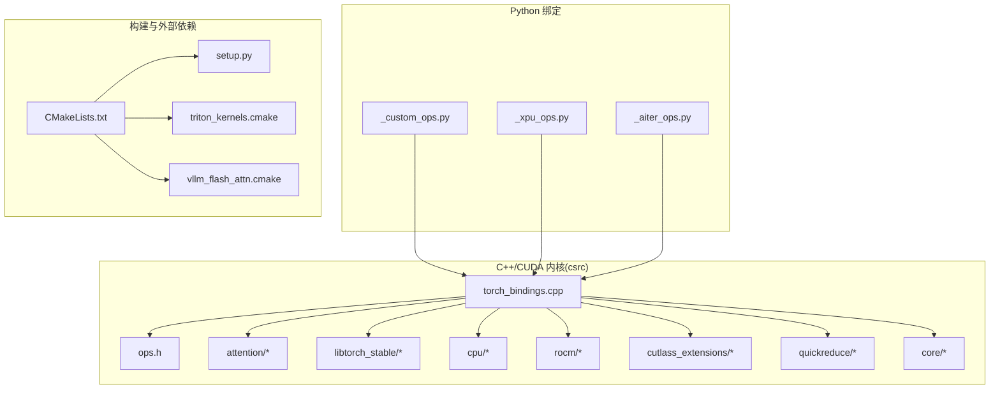
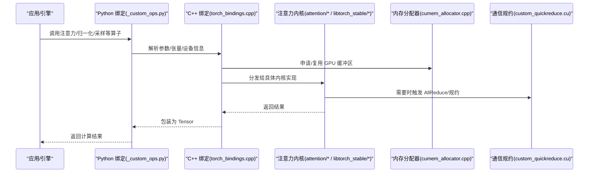
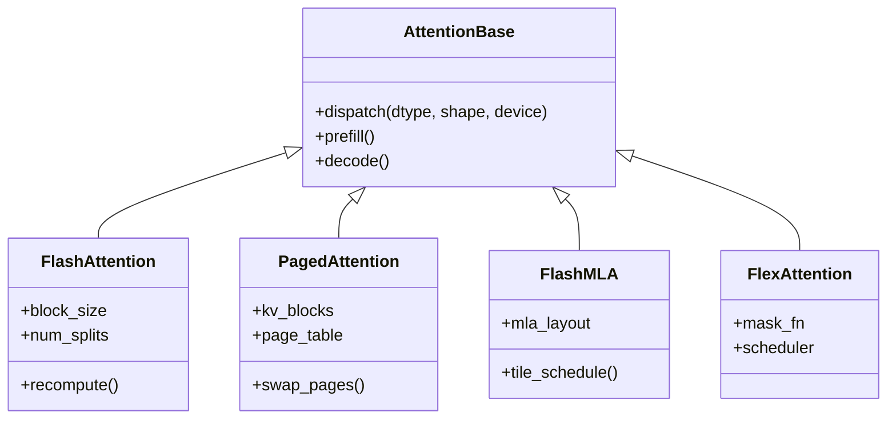
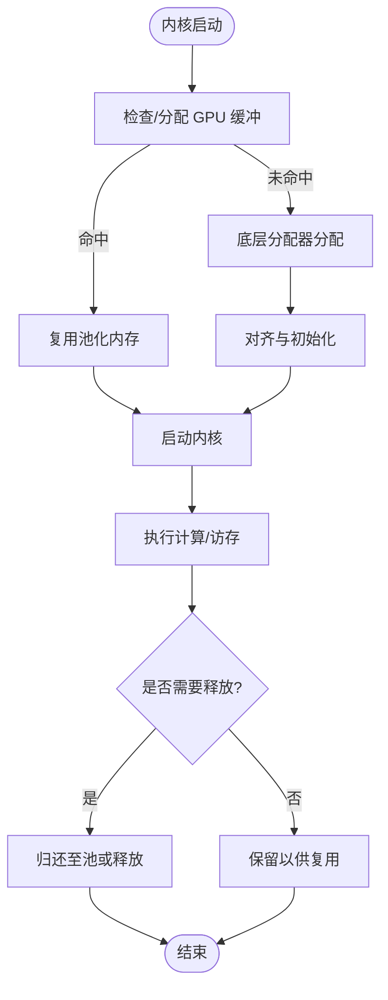
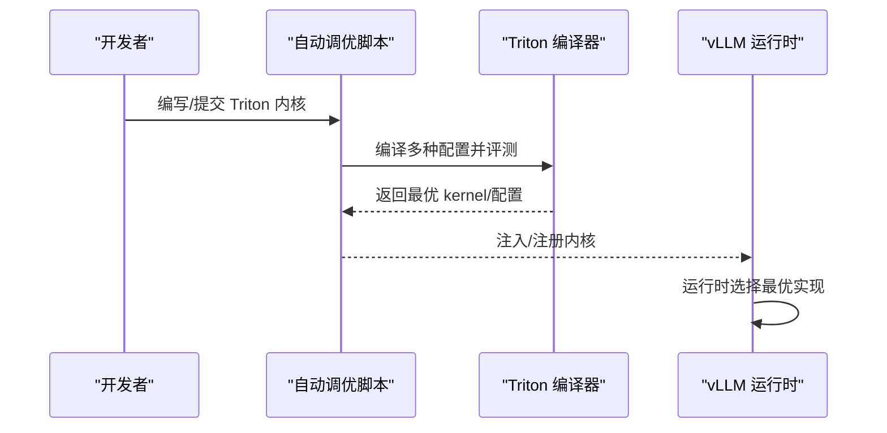
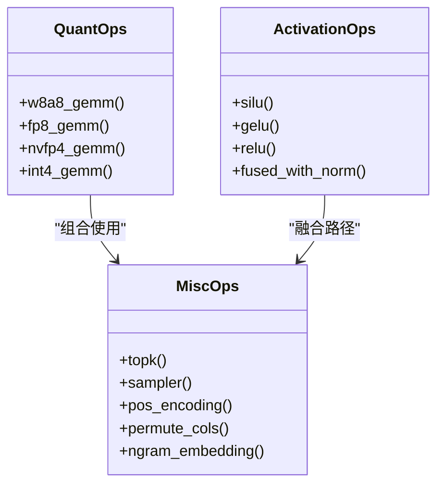
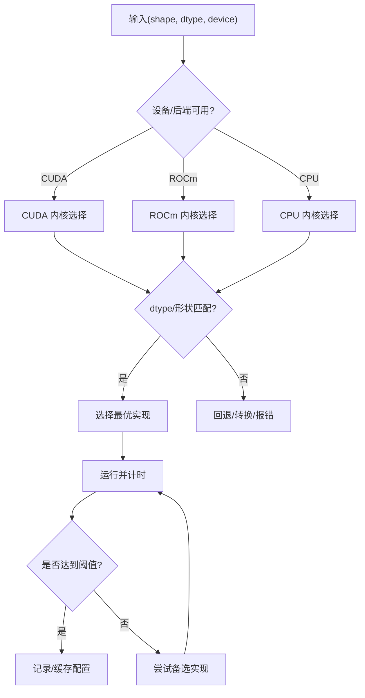
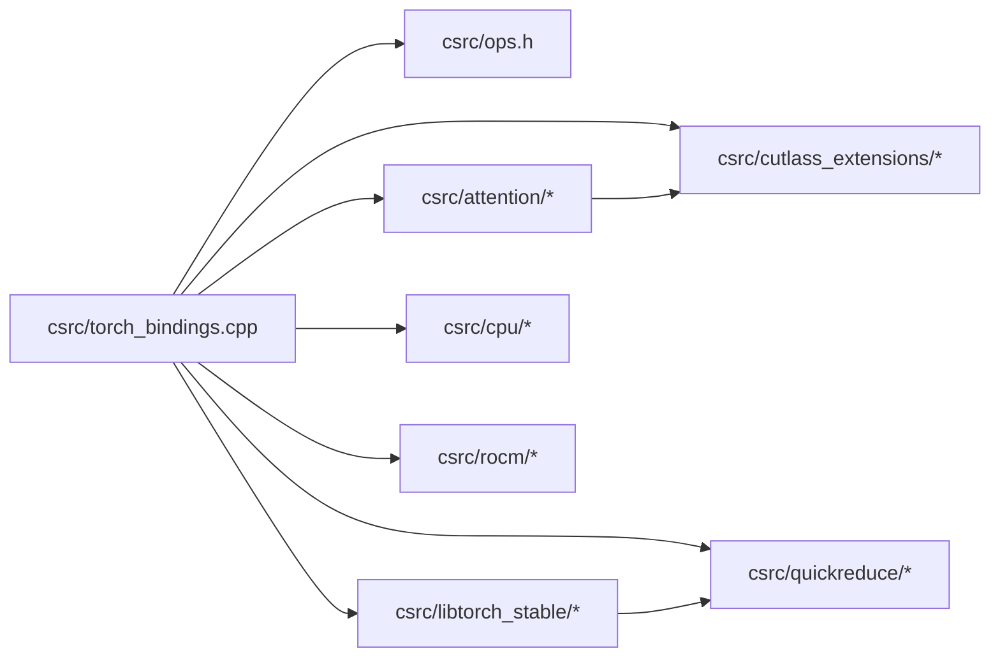

# 内核层设计

<cite>
**本文引用的文件**   
- [CMakeLists.txt](file://CMakeLists.txt)
- [setup.py](file://setup.py)
- [csrc/torch_bindings.cpp](file://csrc/torch_bindings.cpp)
- [csrc/ops.h](file://csrc/ops.h)
- [csrc/cuda_utils.h](file://csrc/cuda_utils.h)
- [csrc/dispatch_utils.h](file://csrc/dispatch_utils.h)
- [csrc/custom_all_reduce.cuh](file://csrc/custom_all_reduce.cuh)
- [csrc/custom_quickreduce.cu](file://csrc/custom_quickreduce.cu)
- [csrc/cumem_allocator.cpp](file://csrc/cumem_allocator.cpp)
- [csrc/fs_io.cpp](file://csrc/fs_io.cpp)
- [csrc/spinloop.cpp](file://csrc/spinloop.cpp)
- [csrc/libtorch_stable/torch_bindings.cpp](file://csrc/libtorch_stable/torch_bindings.cpp)
- [csrc/libtorch_stable/ops.h](file://csrc/libtorch_stable/ops.h)
- [csrc/libtorch_stable/cache_kernels.cu](file://csrc/libtorch_stable/cache_kernels.cu)
- [csrc/libtorch_stable/cache_kernels_fused.cu](file://csrc/libtorch_stable/cache_kernels_fused.cu)
- [csrc/libtorch_stable/layernorm_kernels.cu](file://csrc/libtorch_stable/layernorm_kernels.cu)
- [csrc/libtorch_stable/layernorm_quant_kernels.cu](file://csrc/libtorch_stable/layernorm_quant_kernels.cu)
- [csrc/libtorch_stable/activation_kernels.cu](file://csrc/libtorch_stable/activation_kernels.cu)
- [csrc/libtorch_stable/sampler.cu](file://csrc/libtorch_stable/sampler.cu)
- [csrc/libtorch_stable/topk.cu](file://csrc/libtorch_stable/topk.cu)
- [csrc/libtorch_stable/ngram_embedding_kernels.cu](file://csrc/libtorch_stable/ngram_embedding_kernels.cu)
- [csrc/libtorch_stable/pos_encoding_kernels.cu](file://csrc/libtorch_stable/pos_encoding_kernels.cu)
- [csrc/libtorch_stable/fused_qknorm_rope_kernel.cu](file://csrc/libtorch_stable/fused_qknorm_rope_kernel.cu)
- [csrc/libtorch_stable/fused_deepseek_v4_qnorm_rope_kv_insert_kernel.cu](file://csrc/libtorch_stable/fused_deepseek_v4_qnorm_rope_kv_insert_kernel.cu)
- [csrc/libtorch_stable/fused_minimax_m3_qknorm_rope_kv_insert_kernel.cu](file://csrc/libtorch_stable/fused_minimax_m3_qknorm_rope_kv_insert_kernel.cu)
- [csrc/libtorch_stable/dsv3_fused_a_gemm.cu](file://csrc/libtorch_stable/dsv3_fused_a_gemm.cu)
- [csrc/libtorch_stable/fp32_router_gemm.cu](file://csrc/libtorch_stable/fp32_router_gemm.cu)
- [csrc/libtorch_stable/fp32_router_gemm_entry.cu](file://csrc/libtorch_stable/fp32_router_gemm_entry.cu)
- [csrc/libtorch_stable/persistent_topk.cuh](file://csrc/libtorch_stable/persistent_topk.cuh)
- [csrc/libtorch_stable/cooperative_topk.cu](file://csrc/libtorch_stable/cooperative_topk.cu)
- [csrc/libtorch_stable/cooperative_topk.cuh](file://csrc/libtorch_stable/cooperative_topk.cuh)
- [csrc/libtorch_stable/permute_cols.cu](file://csrc/libtorch_stable/permute_cols.cu)
- [csrc/libtorch_stable/cuda_vec_utils.cuh](file://csrc/libtorch_stable/cuda_vec_utils.cuh)
- [csrc/libtorch_stable/cub_helpers.h](file://csrc/libtorch_stable/cub_helpers.h)
- [csrc/libtorch_stable/launch_bounds_utils.h](file://csrc/libtorch_stable/launch_bounds_utils.h)
- [csrc/libtorch_stable/type_convert.cuh](file://csrc/libtorch_stable/type_convert.cuh)
- [csrc/libtorch_stable/async_util.cuh](file://csrc/libtorch_stable/async_util.cuh)
- [csrc/libtorch_stable/nvfp4_kv_cache_kernels.cu](file://csrc/libtorch_stable/nvfp4_kv_cache_kernels.cu)
- [csrc/attention/attention_dtypes.h](file://csrc/attention/attention_dtypes.h)
- [csrc/attention/attention_generic.cuh](file://csrc/attention/attention_generic.cuh)
- [csrc/attention/dtype_bfloat16.cuh](file://csrc/attention/dtype_bfloat16.cuh)
- [csrc/attention/dtype_float16.cuh](file://csrc/attention/dtype_float16.cuh)
- [csrc/attention/dtype_float32.cuh](file://csrc/attention/dtype_float32.cuh)
- [csrc/attention/dtype_fp8.cuh](file://csrc/attention/dtype_fp8.cuh)
- [csrc/cpu/torch_bindings.cpp](file://csrc/cpu/torch_bindings.cpp)
- [csrc/cpu/cpu_attn.cpp](file://csrc/cpu/cpu_attn.cpp)
- [csrc/cpu/cpu_attn_impl.hpp](file://csrc/cpu/cpu_attn_impl.hpp)
- [csrc/cpu/layernorm.cpp](file://csrc/cpu/layernorm.cpp)
- [csrc/cpu/activation.cpp](file://csrc/cpu/activation.cpp)
- [csrc/cpu/pos_encoding.cpp](file://csrc/cpu/pos_encoding.cpp)
- [csrc/cpu/cpu_types.hpp](file://csrc/cpu/cpu_types.hpp)
- [csrc/rocm/torch_bindings.cpp](file://csrc/rocm/torch_bindings.cpp)
- [csrc/rocm/attention.cu](file://csrc/rocm/attention.cu)
- [csrc/rocm/q_gemm_rdna3.cu](file://csrc/rocm/q_gemm_rdna3.cu)
- [csrc/rocm/q_gemm_rdna3_wmma.cu](file://csrc/rocm/q_gemm_rdna3_wmma.cu)
- [csrc/rocm/skinny_gemms.cu](file://csrc/rocm/skinny_gemms.cu)
- [csrc/rocm/skinny_gemms_int4.cu](file://csrc/rocm/skinny_gemms_int4.cu)
- [csrc/rocm/moe_q_gemm_rdna3.cu](file://csrc/rocm/moe_q_gemm_rdna3.cu)
- [csrc/rocm/qdq_4_rdna3.cuh](file://csrc/rocm/qdq_4_rdna3.cuh)
- [csrc/quickreduce/base.h](file://csrc/quickreduce/base.h)
- [csrc/quickreduce/quick_reduce.h](file://csrc/quickreduce/quick_reduce.h)
- [csrc/quickreduce/quick_reduce_impl.cuh](file://csrc/quickreduce/quick_reduce_impl.cuh)
- [csrc/core/registration.h](file://csrc/core/registration.h)
- [csrc/core/scalar_type.hpp](file://csrc/core/scalar_type.hpp)
- [csrc/core/batch_invariant.hpp](file://csrc/core/batch_invariant.hpp)
- [csrc/core/exception.hpp](file://csrc/core/exception.hpp)
- [csrc/cutlass_extensions/vllm_cutlass_library_extension.py](file://csrc/cutlass_extensions/vllm_cutlass_library_extension.py)
- [csrc/cutlass_extensions/cute_utils.cuh](file://csrc/cutlass_extensions/cute_utils.cuh)
- [csrc/cutlass_extensions/vllm_custom_types.cuh](file://csrc/cutlass_extensions/vllm_custom_types.cuh)
- [csrc/cutlass_extensions/vllm_type_utils.cuh](file://csrc/cutlass_extensions/vllm_type_utils.cuh)
- [vllm/_custom_ops.py](file://vllm/_custom_ops.py)
- [vllm/_xpu_ops.py](file://vllm/_xpu_ops.py)
- [vllm/_aiter_ops.py](file://vllm/_aiter_ops.py)
- [vllm/kernels/triton_utils.py](file://vllm/kernels/triton_utils.py)
- [vllm/platforms/__init__.py](file://vllm/platforms/__init__.py)
- [vllm/config/quantization_config.py](file://vllm/config/quantization_config.py)
- [vllm/model_executor/layers/attention/flash_attention.py](file://vllm/model_executor/layers/attention/flash_attention.py)
- [vllm/model_executor/layers/attention/paged_attention.py](file://vllm/model_executor/layers/attention/paged_attention.py)
- [vllm/model_executor/layers/attention/flashmla.py](file://vllm/model_executor/layers/attention/flashmla.py)
- [vllm/model_executor/layers/attention/flex_attention.py](file://vllm/model_executor/layers/attention/flex_attention.py)
- [vllm/model_executor/layers/attention/utils.py](file://vllm/model_executor/layers/attention/utils.py)
- [benchmarks/kernels/benchmark_paged_attention.py](file://benchmarks/kernels/benchmark_paged_attention.py)
- [benchmarks/kernels/benchmark_activation.py](file://benchmarks/kernels/benchmark_activation.py)
- [benchmarks/kernels/benchmark_layernorm.py](file://benchmarks/kernels/benchmark_layernorm.py)
- [scripts/autotune_helion_kernels.py](file://scripts/autotune_helion_kernels.py)
- [cmake/external_projects/triton_kernels.cmake](file://cmake/external_projects/triton_kernels.cmake)
- [cmake/external_projects/vllm_flash_attn.cmake](file://cmake/external_projects/vllm_flash_attn.cmake)
</cite>

## 目录
1. [引言](#引言)
2. [项目结构](#项目结构)
3. [核心组件](#核心组件)
4. [架构总览](#架构总览)
5. [详细组件分析](#详细组件分析)
6. [依赖关系分析](#依赖关系分析)
7. [性能考量](#性能考量)
8. [故障排查指南](#故障排查指南)
9. [结论](#结论)
10. [附录](#附录)

## 引言
本文件聚焦 vLLM 的内核层设计与实现，系统梳理 C++/CUDA 自定义算子、Triton 内核使用场景与优化策略、注意力机制（FlashAttention、PagedAttention、FlashMLA、FlexAttention）的技术细节，以及量化算子、激活函数等常用 CUDA 实现的工程化组织。同时给出内核选择机制、编译流程、调试技巧与性能调优方法，帮助读者从“代码级”到“系统级”全面理解 vLLM 的高性能推理内核体系。

## 项目结构
vLLM 的内核层由多语言混合构成：
- C++/CUDA 原生内核位于 csrc 目录，按功能划分为 attention、libtorch_stable、cpu、rocm、cutlass_extensions、quickreduce、core 等模块；
- Python 侧通过 torch 扩展绑定暴露算子接口，位于 vllm/_custom_ops.py 等；
- Triton 内核与自动调优脚本位于 vllm/kernels 与 scripts；
- 构建系统由 CMake 与 setup.py 协同完成，外部依赖（如 triton_kernels、flash_attn）通过 cmake/external_projects 管理。

图表来源
- [CMakeLists.txt](file://CMakeLists.txt)
- [setup.py](file://setup.py)
- [csrc/torch_bindings.cpp](file://csrc/torch_bindings.cpp)
- [csrc/ops.h](file://csrc/ops.h)
- [cmake/external_projects/triton_kernels.cmake](file://cmake/external_projects/triton_kernels.cmake)
- [cmake/external_projects/vllm_flash_attn.cmake](file://cmake/external_projects/vllm_flash_attn.cmake)

章节来源
- [CMakeLists.txt](file://CMakeLists.txt)
- [setup.py](file://setup.py)
- [csrc/torch_bindings.cpp](file://csrc/torch_bindings.cpp)
- [csrc/ops.h](file://csrc/ops.h)

## 核心组件
- 统一注册与分发：通过 ops.h 定义算子签名，torch_bindings.cpp 将 C++/CUDA 内核注册为 PyTorch 扩展，并在运行时根据设备、数据类型、形状进行分发。
- 内存与资源管理：cumem_allocator.cpp 提供 GPU 内存分配器封装，fs_io.cpp 负责 IO，spinloop.cpp 提供轻量同步原语。
- 注意力内核族：attention/* 提供 dtype 抽象与通用模板；libtorch_stable 下包含大量融合内核（QKNORM+ROPE、KV Cache、采样、TopK、GEMM 等）。
- 平台适配：cpu/* 与 rocm/* 分别提供 CPU 与 ROCm 后端实现；cutlass_extensions/* 提供 CUTLASS 扩展工具。
- 通信与规约：quickreduce/* 与 custom_quickreduce.cu 提供高性能 AllReduce/规约内核。
- 类型与异常：core/* 提供标量类型、批不变性、异常处理等基础能力。

章节来源
- [csrc/ops.h](file://csrc/ops.h)
- [csrc/torch_bindings.cpp](file://csrc/torch_bindings.cpp)
- [csrc/cumem_allocator.cpp](file://csrc/cumem_allocator.cpp)
- [csrc/fs_io.cpp](file://csrc/fs_io.cpp)
- [csrc/spinloop.cpp](file://csrc/spinloop.cpp)
- [csrc/attention/attention_dtypes.h](file://csrc/attention/attention_dtypes.h)
- [csrc/attention/attention_generic.cuh](file://csrc/attention/attention_generic.cuh)
- [csrc/libtorch_stable/cache_kernels.cu](file://csrc/libtorch_stable/cache_kernels.cu)
- [csrc/libtorch_stable/layernorm_kernels.cu](file://csrc/libtorch_stable/layernorm_kernels.cu)
- [csrc/libtorch_stable/activation_kernels.cu](file://csrc/libtorch_stable/activation_kernels.cu)
- [csrc/libtorch_stable/sampler.cu](file://csrc/libtorch_stable/sampler.cu)
- [csrc/libtorch_stable/topk.cu](file://csrc/libtorch_stable/topk.cu)
- [csrc/quickreduce/quick_reduce.h](file://csrc/quickreduce/quick_reduce.h)
- [csrc/custom_quickreduce.cu](file://csrc/custom_quickreduce.cu)
- [csrc/core/scalar_type.hpp](file://csrc/core/scalar_type.hpp)
- [csrc/core/exception.hpp](file://csrc/core/exception.hpp)

## 架构总览
下图展示从 Python 调用到 CUDA 内核执行的端到端路径，包括注意力前向的关键调用链。

图表来源
- [vllm/_custom_ops.py](file://vllm/_custom_ops.py)
- [csrc/torch_bindings.cpp](file://csrc/torch_bindings.cpp)
- [csrc/attention/attention_generic.cuh](file://csrc/attention/attention_generic.cuh)
- [csrc/libtorch_stable/cache_kernels.cu](file://csrc/libtorch_stable/cache_kernels.cu)
- [csrc/custom_quickreduce.cu](file://csrc/custom_quickreduce.cu)
- [csrc/cumem_allocator.cpp](file://csrc/cumem_allocator.cpp)

## 详细组件分析

### 注意力内核族（FlashAttention、PagedAttention、FlashMLA、FlexAttention）
- FlashAttention：基于分块与重计算减少 HBM 访问，提升吞吐并降低显存占用。
- PagedAttention：以分页式 KV Cache 管理碎片化请求，提高并发与缓存命中率。
- FlashMLA：面向 MLA 结构的注意力变体，结合特定模型布局优化访存与并行度。
- FlexAttention：利用 PyTorch 的灵活注意力框架，在可组合的掩码与调度下获得良好性能。

图表来源
- [vllm/model_executor/layers/attention/flash_attention.py](file://vllm/model_executor/layers/attention/flash_attention.py)
- [vllm/model_executor/layers/attention/paged_attention.py](file://vllm/model_executor/layers/attention/paged_attention.py)
- [vllm/model_executor/layers/attention/flashmla.py](file://vllm/model_executor/layers/attention/flashmla.py)
- [vllm/model_executor/layers/attention/flex_attention.py](file://vllm/model_executor/layers/attention/flex_attention.py)
- [csrc/attention/attention_generic.cuh](file://csrc/attention/attention_generic.cuh)
- [csrc/attention/attention_dtypes.h](file://csrc/attention/attention_dtypes.h)

章节来源
- [vllm/model_executor/layers/attention/flash_attention.py](file://vllm/model_executor/layers/attention/flash_attention.py)
- [vllm/model_executor/layers/attention/paged_attention.py](file://vllm/model_executor/layers/attention/paged_attention.py)
- [vllm/model_executor/layers/attention/flashmla.py](file://vllm/model_executor/layers/attention/flashmla.py)
- [vllm/model_executor/layers/attention/flex_attention.py](file://vllm/model_executor/layers/attention/flex_attention.py)
- [csrc/attention/attention_generic.cuh](file://csrc/attention/attention_generic.cuh)
- [csrc/attention/attention_dtypes.h](file://csrc/attention/attention_dtypes.h)
- [benchmarks/kernels/benchmark_paged_attention.py](file://benchmarks/kernels/benchmark_paged_attention.py)

### 内存管理与 GPU 资源调度
- cumem_allocator.cpp：封装 CUDA 内存分配策略，支持池化与对齐，减少分配开销与碎片。
- fs_io.cpp：异步 IO 与文件读写，用于权重加载与检查点。
- spinloop.cpp：轻量忙等原语，用于低延迟同步与等待条件满足。
- cache_kernels.cu / cache_kernels_fused.cu：KV Cache 的写入、合并、交换与持久化，配合分页策略提升并发。

图表来源
- [csrc/cumem_allocator.cpp](file://csrc/cumem_allocator.cpp)
- [csrc/fs_io.cpp](file://csrc/fs_io.cpp)
- [csrc/spinloop.cpp](file://csrc/spinloop.cpp)
- [csrc/libtorch_stable/cache_kernels.cu](file://csrc/libtorch_stable/cache_kernels.cu)
- [csrc/libtorch_stable/cache_kernels_fused.cu](file://csrc/libtorch_stable/cache_kernels_fused.cu)

章节来源
- [csrc/cumem_allocator.cpp](file://csrc/cumem_allocator.cpp)
- [csrc/fs_io.cpp](file://csrc/fs_io.cpp)
- [csrc/spinloop.cpp](file://csrc/spinloop.cpp)
- [csrc/libtorch_stable/cache_kernels.cu](file://csrc/libtorch_stable/cache_kernels.cu)
- [csrc/libtorch_stable/cache_kernels_fused.cu](file://csrc/libtorch_stable/cache_kernels_fused.cu)

### Triton 内核的使用场景与优化策略
- 使用场景：逐 token 采样、部分激活融合、动态形状下的轻量算子、快速原型验证。
- 优化策略：分块并行、寄存器压力控制、访存合并、常量折叠、循环展开、自动调参。
- 集成方式：通过 vllm/kernels/triton_utils.py 与 autotune 脚本生成/选择最优配置。

图表来源
- [vllm/kernels/triton_utils.py](file://vllm/kernels/triton_utils.py)
- [scripts/autotune_helion_kernels.py](file://scripts/autotune_helion_kernels.py)
- [cmake/external_projects/triton_kernels.cmake](file://cmake/external_projects/triton_kernels.cmake)

章节来源
- [vllm/kernels/triton_utils.py](file://vllm/kernels/triton_utils.py)
- [scripts/autotune_helion_kernels.py](file://scripts/autotune_helion_kernels.py)
- [cmake/external_projects/triton_kernels.cmake](file://cmake/external_projects/triton_kernels.cmake)

### 量化算子、激活函数与其他常用算子
- 量化：w8a8、FP8/NVFP4、INT4 等量化 GEMM 与量化感知归一化，见 cutlass_extensions 与 libtorch_stable 中的相关实现。
- 激活：SiLU/GELU/ReLU 等融合于 QKNORM/ROPE/KV 插入等路径中，减少中间张量与访存。
- 其他：TopK、采样、位置编码、列置换、N-gram Embedding 等高频算子均提供 CUDA 实现。

图表来源
- [csrc/cutlass_extensions/vllm_cutlass_library_extension.py](file://csrc/cutlass_extensions/vllm_cutlass_library_extension.py)
- [csrc/libtorch_stable/layernorm_quant_kernels.cu](file://csrc/libtorch_stable/layernorm_quant_kernels.cu)
- [csrc/libtorch_stable/activation_kernels.cu](file://csrc/libtorch_stable/activation_kernels.cu)
- [csrc/libtorch_stable/topk.cu](file://csrc/libtorch_stable/topk.cu)
- [csrc/libtorch_stable/sampler.cu](file://csrc/libtorch_stable/sampler.cu)
- [csrc/libtorch_stable/pos_encoding_kernels.cu](file://csrc/libtorch_stable/pos_encoding_kernels.cu)
- [csrc/libtorch_stable/permute_cols.cu](file://csrc/libtorch_stable/permute_cols.cu)
- [csrc/libtorch_stable/ngram_embedding_kernels.cu](file://csrc/libtorch_stable/ngram_embedding_kernels.cu)

章节来源
- [csrc/cutlass_extensions/vllm_cutlass_library_extension.py](file://csrc/cutlass_extensions/vllm_cutlass_library_extension.py)
- [csrc/libtorch_stable/layernorm_quant_kernels.cu](file://csrc/libtorch_stable/layernorm_quant_kernels.cu)
- [csrc/libtorch_stable/activation_kernels.cu](file://csrc/libtorch_stable/activation_kernels.cu)
- [csrc/libtorch_stable/topk.cu](file://csrc/libtorch_stable/topk.cu)
- [csrc/libtorch_stable/sampler.cu](file://csrc/libtorch_stable/sampler.cu)
- [csrc/libtorch_stable/pos_encoding_kernels.cu](file://csrc/libtorch_stable/pos_encoding_kernels.cu)
- [csrc/libtorch_stable/permute_cols.cu](file://csrc/libtorch_stable/permute_cols.cu)
- [csrc/libtorch_stable/ngram_embedding_kernels.cu](file://csrc/libtorch_stable/ngram_embedding_kernels.cu)

### 内核选择机制与性能调优
- 选择机制：依据设备（CUDA/ROCm/CPU）、数据类型（BF16/FP16/FP8/INT4）、形状（batch/seq_len/head_dim）与后端可用性，在 torch_bindings.cpp 与各模块内部分发。
- 调优手段：
  - 分块大小、线程块维度、寄存器占用、共享内存容量权衡；
  - 融合路径（QKNORM+ROPE+KV Insert）减少中间存储；
  - 自动调优（Triton/Helion）针对目标硬件搜索最优配置；
  - 使用 benchmark 套件评估不同形状与后端组合的性能。

图表来源
- [csrc/torch_bindings.cpp](file://csrc/torch_bindings.cpp)
- [csrc/dispatch_utils.h](file://csrc/dispatch_utils.h)
- [csrc/cuda_utils.h](file://csrc/cuda_utils.h)
- [vllm/platforms/__init__.py](file://vllm/platforms/__init__.py)
- [benchmarks/kernels/benchmark_activation.py](file://benchmarks/kernels/benchmark_activation.py)
- [benchmarks/kernels/benchmark_layernorm.py](file://benchmarks/kernels/benchmark_layernorm.py)

章节来源
- [csrc/torch_bindings.cpp](file://csrc/torch_bindings.cpp)
- [csrc/dispatch_utils.h](file://csrc/dispatch_utils.h)
- [csrc/cuda_utils.h](file://csrc/cuda_utils.h)
- [vllm/platforms/__init__.py](file://vllm/platforms/__init__.py)
- [benchmarks/kernels/benchmark_activation.py](file://benchmarks/kernels/benchmark_activation.py)
- [benchmarks/kernels/benchmark_layernorm.py](file://benchmarks/kernels/benchmark_layernorm.py)

### 内核编译流程与调试技巧
- 编译流程：
  - CMake 管理外部依赖（triton_kernels、flash_attn），setup.py 驱动 Python 扩展构建；
  - 各模块 .cu/.cpp 经 nvcc/g++ 编译为二进制，链接为 PyTorch 扩展；
  - 运行时按需加载对应平台与版本的后端。
- 调试技巧：
  - 使用 NVTX/TensorBoard/PyTorch Profiler 定位热点；
  - 对关键路径添加日志与断言，校验张量形状与数据类型；
  - 借助 benchmarks 套件回归验证性能与正确性；
  - 针对 Triton 内核，使用 autotune 脚本输出不同配置的耗时对比。

章节来源
- [CMakeLists.txt](file://CMakeLists.txt)
- [setup.py](file://setup.py)
- [cmake/external_projects/triton_kernels.cmake](file://cmake/external_projects/triton_kernels.cmake)
- [cmake/external_projects/vllm_flash_attn.cmake](file://cmake/external_projects/vllm_flash_attn.cmake)
- [scripts/autotune_helion_kernels.py](file://scripts/autotune_helion_kernels.py)

## 依赖关系分析
- Python 绑定与 C++/CUDA 内核耦合紧密，通过 ops.h 定义接口契约；
- 注意力模块依赖 dtype 抽象与通用模板，便于跨数据类型复用；
- quickreduce 与 custom_all_reduce 为分布式通信提供高性能规约；
- cutlass_extensions 为 GEMM/量化路径提供底层加速；
- cpu/rocm 分支保证跨平台一致性。

图表来源
- [csrc/torch_bindings.cpp](file://csrc/torch_bindings.cpp)
- [csrc/ops.h](file://csrc/ops.h)
- [csrc/attention/attention_generic.cuh](file://csrc/attention/attention_generic.cuh)
- [csrc/libtorch_stable/cache_kernels.cu](file://csrc/libtorch_stable/cache_kernels.cu)
- [csrc/quickreduce/quick_reduce.h](file://csrc/quickreduce/quick_reduce.h)
- [csrc/cutlass_extensions/vllm_cutlass_library_extension.py](file://csrc/cutlass_extensions/vllm_cutlass_library_extension.py)

章节来源
- [csrc/torch_bindings.cpp](file://csrc/torch_bindings.cpp)
- [csrc/ops.h](file://csrc/ops.h)
- [csrc/attention/attention_generic.cuh](file://csrc/attention/attention_generic.cuh)
- [csrc/libtorch_stable/cache_kernels.cu](file://csrc/libtorch_stable/cache_kernels.cu)
- [csrc/quickreduce/quick_reduce.h](file://csrc/quickreduce/quick_reduce.h)
- [csrc/cutlass_extensions/vllm_cutlass_library_extension.py](file://csrc/cutlass_extensions/vllm_cutlass_library_extension.py)

## 性能考量
- 访存优化：分块、合并访问、共享内存重用、避免 bank conflict；
- 并行粒度：线程块/网格划分与 warp 级协作，最大化 SM 利用率；
- 融合策略：将多个小算子融合为单一内核，减少中间张量与同步开销；
- 内存池化：预分配与复用，降低分配/释放抖动；
- 自动调优：针对不同硬件与形状搜索最优内核参数；
- 基准回归：持续用 benchmarks 验证改动对吞吐与延迟的影响。

[本节为通用指导，不直接分析具体文件]

## 故障排查指南
- 常见错误：
  - 数据类型不匹配导致内核回退或崩溃；
  - 形状越界或步长不一致引发访存异常；
  - 设备不可用或后端缺失导致绑定失败；
  - 内存不足或碎片化导致分配失败。
- 排查步骤：
  - 打印/断言输入张量的 dtype、shape、stride、device；
  - 使用 Profiler 定位热点与同步瓶颈；
  - 逐步缩小问题范围，最小复现实例；
  - 对照 benchmarks 确认是否为回归问题。

章节来源
- [csrc/core/exception.hpp](file://csrc/core/exception.hpp)
- [csrc/cuda_utils.h](file://csrc/cuda_utils.h)
- [csrc/dispatch_utils.h](file://csrc/dispatch_utils.h)
- [csrc/cumem_allocator.cpp](file://csrc/cumem_allocator.cpp)

## 结论
vLLM 的内核层通过清晰的模块化设计、统一的绑定与分发机制、丰富的 CUDA/Triton 实现与完善的构建/调优体系，实现了高吞吐、低延迟的大模型推理。注意力内核族、量化与激活融合、内存与通信优化共同构成了其高性能基石。建议在实际工程中结合基准测试与自动调优，持续迭代内核参数与融合策略，以获得最佳性能。

[本节为总结性内容，不直接分析具体文件]

## 附录
- 参考文档与设计说明：
  - [vllm/design/attention_backends.md](file://docs/design/attention_backends.md)
  - [vllm/design/paged_attention.md](file://docs/design/paged_attention.md)
  - [vllm/design/fusions.md](file://docs/design/fusions.md)
  - [vllm/design/custom_op.md](file://docs/design/custom_op.md)
  - [vllm/design/debug_vllm_compile.md](file://docs/design/debug_vllm_compile.md)

[本节为补充材料，不直接分析具体文件]