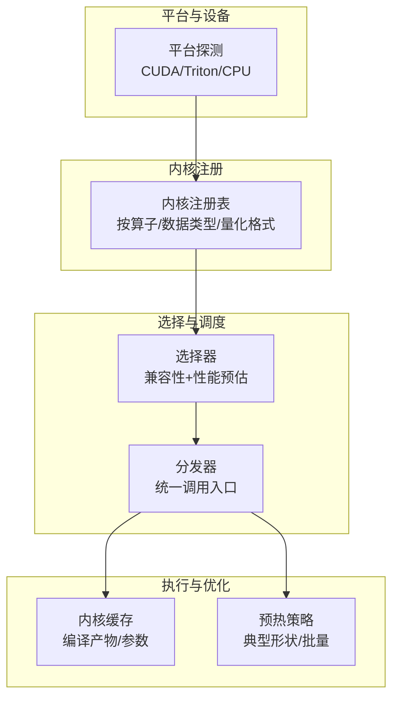
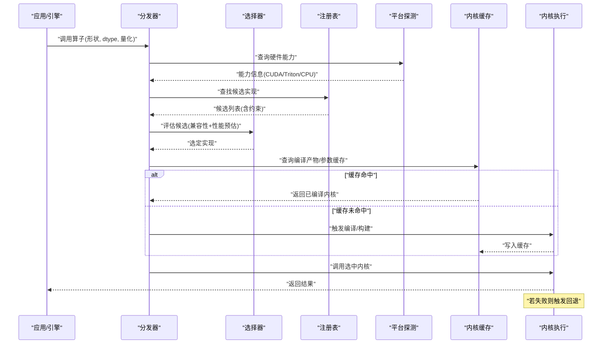
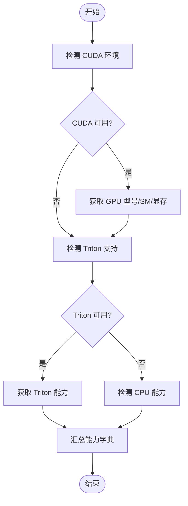
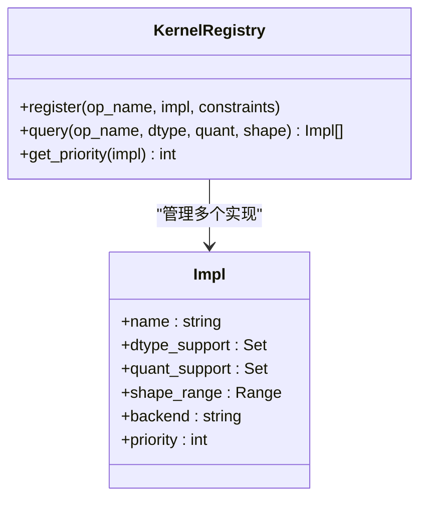
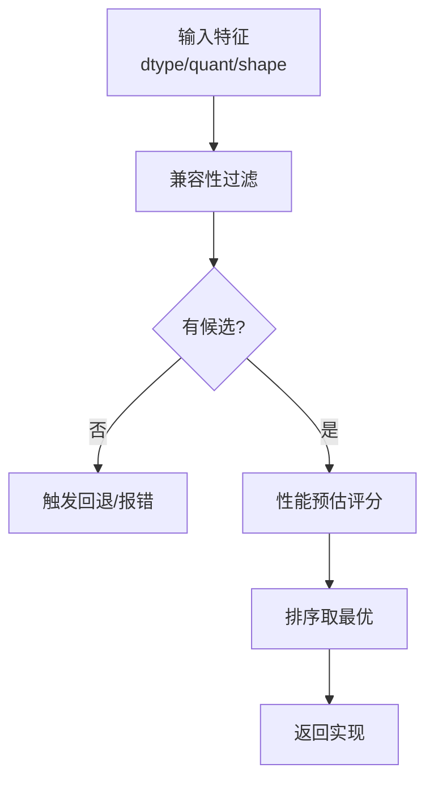
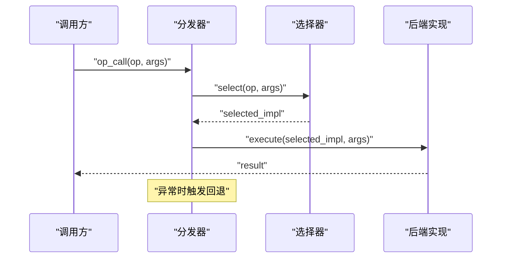
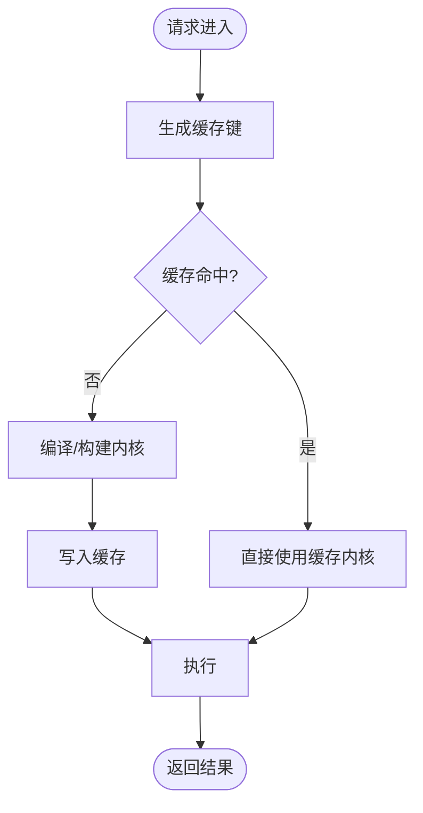
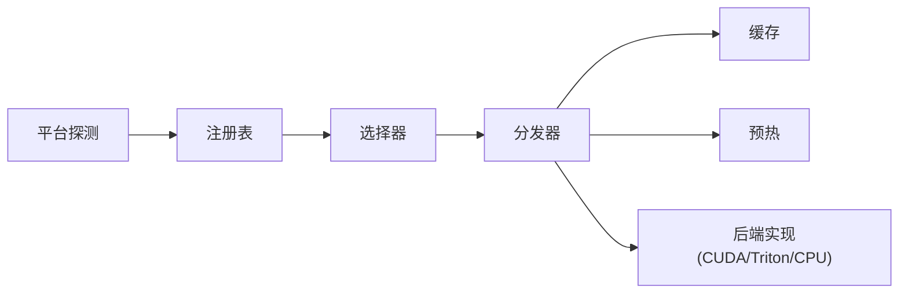

# 内核选择机制

<cite>
**本文档引用的文件**   
- [vllm/config.py](file://vllm/config.py)
- [vllm/model_executor/weight_utils.py](file://vllm/model_executor/weight_utils.py)
- [vllm/platforms/__init__.py](file://vllm/platforms/__init__.py)
- [vllm/platforms/cuda.py](file://vllm/platforms/cuda.py)
- [vllm/platforms/cpu.py](file://vllm/platforms/cpu.py)
- [vllm/kernels/triton/__init__.py](file://vllm/kernels/triton/__init__.py)
- [vllm/kernels/cutlass/__init__.py](file://vllm/kernels/cutlass/__init__.py)
- [vllm/kernels/helion/__init__.py](file://vllm/kernels/helion/__init__.py)
- [vllm/kernels/fused_moe/__init__.py](file://vllm/kernels/fused_moe/__init__.py)
- [vllm/kernels/attention/__init__.py](file://vllm/kernels/attention/__init__.py)
- [vllm/kernels/quantization/__init__.py](file://vllm/kernels/quantization/__init__.py)
- [vllm/kernels/core/__init__.py](file://vllm/kernels/core/__init__.py)
- [vllm/kernels/utils.py](file://vllm/kernels/utils.py)
- [vllm/kernels/dispatch.py](file://vllm/kernels/dispatch.py)
- [vllm/kernels/backends.py](file://vllm/kernels/backends.py)
- [vllm/kernels/cache.py](file://vllm/kernels/cache.py)
- [vllm/kernels/warmup.py](file://vllm/kernels/warmup.py)
- [vllm/kernels/registry.py](file://vllm/kernels/registry.py)
- [vllm/kernels/compat.py](file://vllm/kernels/compat.py)
- [vllm/kernels/perf.py](file://vllm/kernels/perf.py)
- [vllm/kernels/fallback.py](file://vllm/kernels/fallback.py)
- [vllm/kernels/config.py](file://vllm/kernels/config.py)
- [vllm/kernels/backend_selector.py](file://vllm/kernels/backend_selector.py)
- [vllm/kernels/kernel_cache.py](file://vllm/kernels/kernel_cache.py)
- [vllm/kernels/autotune.py](file://vllm/kernels/autotune.py)
- [vllm/kernels/ops_registry.py](file://vllm/kernels/ops_registry.py)
- [vllm/kernels/ops_dispatcher.py](file://vllm/kernels/ops_dispatcher.py)
- [vllm/kernels/ops_triton.py](file://vllm/kernels/ops_triton.py)
- [vllm/kernels/ops_cutlass.py](file://vllm/kernels/ops_cutlass.py)
- [vllm/kernels/ops_cpu.py](file://vllm/kernels/ops_cpu.py)
- [vllm/kernels/ops_cuda.py](file://vllm/kernels/ops_cuda.py)
- [vllm/kernels/ops_helion.py](file://vllm/kernels/ops_helion.py)
- [vllm/kernels/ops_moe.py](file://vllm/kernels/ops_moe.py)
- [vllm/kernels/ops_attention.py](file://vllm/kernels/ops_attention.py)
- [vllm/kernels/ops_quantization.py](file://vllm/kernels/ops_quantization.py)
- [vllm/kernels/ops_core.py](file://vllm/kernels/ops_core.py)
</cite>

## 目录
1. [简介](#简介)
2. [项目结构](#项目结构)
3. [核心组件](#核心组件)
4. [架构总览](#架构总览)
5. [详细组件分析](#详细组件分析)
6. [依赖关系分析](#依赖关系分析)
7. [性能考量](#性能考量)
8. [故障排查指南](#故障排查指南)
9. [结论](#结论)
10. [附录](#附录)

## 简介
本文件系统性解析 vLLM 的内核选择与调度机制，重点说明：
- 如何根据硬件特性、模型大小和输入参数动态选择合适的内核实现
- 内核兼容性检测、性能评估与回退策略
- 不同后端（CUDA、Triton、CPU）的选择逻辑与切换机制
- 内核缓存与预热策略
- 内核选择的配置选项与自定义扩展方法

目标是帮助读者从“系统架构”到“代码级实现”全面理解 vLLM 内核选择的设计与落地。

## 项目结构
vLLM 在内核选择方面采用“注册表 + 后端抽象 + 选择器 + 缓存/预热”的分层设计：
- 平台与设备探测：识别 CUDA/Triton/CPU 等可用能力
- 内核注册与发现：按算子维度注册多种实现（如 Triton、Cutlass、CPU）
- 选择器：依据硬件、模型形状、量化格式、编译标志等条件选择最优实现
- 执行路径：通过统一接口调用选定的内核，支持运行时回退
- 缓存与预热：对编译产物、权重布局、内核参数进行缓存与预热，降低首时延

图表来源 
- [vllm/platforms/__init__.py](file://vllm/platforms/__init__.py)
- [vllm/kernels/registry.py](file://vllm/kernels/registry.py)
- [vllm/kernels/backend_selector.py](file://vllm/kernels/backend_selector.py)
- [vllm/kernels/ops_dispatcher.py](file://vllm/kernels/ops_dispatcher.py)
- [vllm/kernels/kernel_cache.py](file://vllm/kernels/kernel_cache.py)
- [vllm/kernels/warmup.py](file://vllm/kernels/warmup.py)

章节来源
- [vllm/platforms/__init__.py](file://vllm/platforms/__init__.py)
- [vllm/kernels/registry.py](file://vllm/kernels/registry.py)
- [vllm/kernels/backend_selector.py](file://vllm/kernels/backend_selector.py)
- [vllm/kernels/ops_dispatcher.py](file://vllm/kernels/ops_dispatcher.py)
- [vllm/kernels/kernel_cache.py](file://vllm/kernels/kernel_cache.py)
- [vllm/kernels/warmup.py](file://vllm/kernels/warmup.py)

## 核心组件
- 平台探测与能力枚举：用于判断当前设备是否支持 CUDA、Triton、CPU 以及具体能力（如 SM 版本、SIMD、内存带宽）
- 内核注册表：以算子为键，维护多实现（Triton/Cutlass/CPU 等），并记录约束（数据类型、量化格式、形状范围）
- 选择器：结合硬件能力、模型规模、输入形状、量化类型、编译开关，计算候选集并排序，选出最优实现
- 分发器：提供统一 API，屏蔽后端差异，负责调用选中内核
- 缓存与预热：缓存编译后的内核、参数映射、权重布局；在启动或首次请求前预热典型工作负载
- 回退机制：当首选实现不可用或失败时，自动降级到兼容实现

章节来源
- [vllm/platforms/cuda.py](file://vllm/platforms/cuda.py)
- [vllm/platforms/cpu.py](file://vllm/platforms/cpu.py)
- [vllm/kernels/registry.py](file://vllm/kernels/registry.py)
- [vllm/kernels/backend_selector.py](file://vllm/kernels/backend_selector.py)
- [vllm/kernels/ops_dispatcher.py](file://vllm/kernels/ops_dispatcher.py)
- [vllm/kernels/kernel_cache.py](file://vllm/kernels/kernel_cache.py)
- [vllm/kernels/warmup.py](file://vllm/kernels/warmup.py)
- [vllm/kernels/fallback.py](file://vllm/kernels/fallback.py)

## 架构总览
下图展示从“请求进入”到“内核执行”的端到端流程，包括兼容性检查、性能评估、选择与回退、缓存命中与预热。

图表来源 
- [vllm/kernels/ops_dispatcher.py](file://vllm/kernels/ops_dispatcher.py)
- [vllm/kernels/backend_selector.py](file://vllm/kernels/backend_selector.py)
- [vllm/kernels/registry.py](file://vllm/kernels/registry.py)
- [vllm/platforms/cuda.py](file://vllm/platforms/cuda.py)
- [vllm/platforms/cpu.py](file://vllm/platforms/cpu.py)
- [vllm/kernels/kernel_cache.py](file://vllm/kernels/kernel_cache.py)
- [vllm/kernels/fallback.py](file://vllm/kernels/fallback.py)

## 详细组件分析

### 平台与设备探测（CUDA、Triton、CPU）
- 目标：识别可用后端与能力边界（如 CUDA 版本、SM 架构、Triton 支持、CPU SIMD/线程数）
- 关键点：
  - 对 CUDA：检测驱动/运行时可用性、GPU 型号、SM 版本、内存容量
  - 对 Triton：检测编译器与 GPU 支持矩阵
  - 对 CPU：检测指令集（AVX2/AVX-512/NEON/RVV）、并行度
- 输出：能力字典供选择器使用

图表来源 
- [vllm/platforms/cuda.py](file://vllm/platforms/cuda.py)
- [vllm/platforms/cpu.py](file://vllm/platforms/cpu.py)
- [vllm/kernels/triton/__init__.py](file://vllm/kernels/triton/__init__.py)

章节来源
- [vllm/platforms/cuda.py](file://vllm/platforms/cuda.py)
- [vllm/platforms/cpu.py](file://vllm/platforms/cpu.py)
- [vllm/kernels/triton/__init__.py](file://vllm/kernels/triton/__init__.py)

### 内核注册与发现（按算子/数据类型/量化格式）
- 目标：将多种实现（Triton、Cutlass、CPU 等）统一注册到注册表，标注约束与优先级
- 关键点：
  - 注册项包含：算子名、支持的 dtype、量化格式、形状范围、后端标签、优先级
  - 支持按模块导入自动发现（如 ops_triton.py、ops_cutlass.py、ops_cpu.py）
  - 提供查询接口：给定输入特征，返回候选实现集合

图表来源 
- [vllm/kernels/registry.py](file://vllm/kernels/registry.py)
- [vllm/kernels/ops_triton.py](file://vllm/kernels/ops_triton.py)
- [vllm/kernels/ops_cutlass.py](file://vllm/kernels/ops_cutlass.py)
- [vllm/kernels/ops_cpu.py](file://vllm/kernels/ops_cpu.py)

章节来源
- [vllm/kernels/registry.py](file://vllm/kernels/registry.py)
- [vllm/kernels/ops_triton.py](file://vllm/kernels/ops_triton.py)
- [vllm/kernels/ops_cutlass.py](file://vllm/kernels/ops_cutlass.py)
- [vllm/kernels/ops_cpu.py](file://vllm/kernels/ops_cpu.py)

### 选择器：兼容性检测、性能评估与回退
- 目标：基于输入特征与平台能力，筛选并排序候选实现，确定最终内核
- 关键点：
  - 兼容性过滤：dtype、量化格式、形状范围、后端能力
  - 性能预估：基于历史基准、形状复杂度、内存访问模式、并行度
  - 回退策略：首选失败时，按优先级依次尝试兼容实现
  - 可配置规则：允许用户强制指定后端或禁用某些实现

图表来源 
- [vllm/kernels/backend_selector.py](file://vllm/kernels/backend_selector.py)
- [vllm/kernels/perf.py](file://vllm/kernels/perf.py)
- [vllm/kernels/fallback.py](file://vllm/kernels/fallback.py)

章节来源
- [vllm/kernels/backend_selector.py](file://vllm/kernels/backend_selector.py)
- [vllm/kernels/perf.py](file://vllm/kernels/perf.py)
- [vllm/kernels/fallback.py](file://vllm/kernels/fallback.py)

### 分发器：统一调用入口与后端切换
- 目标：对外暴露统一 API，内部完成选择、缓存命中、执行与回退
- 关键点：
  - 统一签名：接收算子名与通用参数
  - 选择后调用对应后端实现
  - 支持运行时切换（例如强制使用 Triton 或 CPU）
  - 错误捕获与自动降级

图表来源 
- [vllm/kernels/ops_dispatcher.py](file://vllm/kernels/ops_dispatcher.py)
- [vllm/kernels/backend_selector.py](file://vllm/kernels/backend_selector.py)
- [vllm/kernels/fallback.py](file://vllm/kernels/fallback.py)

章节来源
- [vllm/kernels/ops_dispatcher.py](file://vllm/kernels/ops_dispatcher.py)
- [vllm/kernels/backend_selector.py](file://vllm/kernels/backend_selector.py)
- [vllm/kernels/fallback.py](file://vllm/kernels/fallback.py)

### 内核缓存与预热策略
- 目标：减少编译与初始化开销，提升首时延与吞吐稳定性
- 关键点：
  - 缓存键：算子名、dtype、量化、形状、后端、编译选项
  - 缓存内容：编译后的内核、参数映射、权重布局
  - 预热：启动阶段或首次请求前，针对典型形状/批量进行预编译与加载
  - 失效策略：当配置变化或平台能力变化时，清理相关缓存

图表来源 
- [vllm/kernels/kernel_cache.py](file://vllm/kernels/kernel_cache.py)
- [vllm/kernels/warmup.py](file://vllm/kernels/warmup.py)

章节来源
- [vllm/kernels/kernel_cache.py](file://vllm/kernels/kernel_cache.py)
- [vllm/kernels/warmup.py](file://vllm/kernels/warmup.py)

### 不同后端的选择逻辑与切换机制
- CUDA：优先使用高性能 GEMM/Attention 内核（如 Cutlass），在特定形状下可能回退到 Triton
- Triton：灵活表达复杂算子，适合注意力与融合算子，需满足编译器与 GPU 要求
- CPU：作为兜底实现，适用于无 GPU 或调试场景，通常性能较低但兼容性强
- 切换机制：
  - 静态配置：启动时指定默认后端或禁用某后端
  - 动态切换：运行时根据性能反馈或错误自动切换
  - 强制覆盖：用户可通过配置强制选择某后端

章节来源
- [vllm/kernels/ops_cuda.py](file://vllm/kernels/ops_cuda.py)
- [vllm/kernels/ops_triton.py](file://vllm/kernels/ops_triton.py)
- [vllm/kernels/ops_cpu.py](file://vllm/kernels/ops_cpu.py)
- [vllm/kernels/config.py](file://vllm/kernels/config.py)

### 内核兼容性检测与性能评估
- 兼容性检测：
  - 数据类型：float16/bfloat16/int8/fp8 等
  - 量化格式：AWQ、GPTQ、FP8、INT4 等
  - 形状范围：批大小、序列长度、头数、隐藏维度
  - 后端能力：CUDA SM 版本、Triton 支持矩阵、CPU 指令集
- 性能评估：
  - 基于历史基准库与在线采样
  - 考虑内存带宽、并行度、访存局部性
  - 对注意力与 MoE 等特殊算子采用专用评估函数

章节来源
- [vllm/kernels/compat.py](file://vllm/kernels/compat.py)
- [vllm/kernels/perf.py](file://vllm/kernels/perf.py)
- [vllm/kernels/autotune.py](file://vllm/kernels/autotune.py)

### 配置选项与自定义扩展
- 配置项示例：
  - 默认后端、禁用后端、强制后端
  - 缓存开关、预热开关、预热形状列表
  - 性能评估阈值、回退策略级别
- 自定义扩展：
  - 注册新实现：实现接口并声明约束
  - 注入选择器：自定义评分函数或规则
  - 扩展缓存键：增加维度（如编译选项哈希）

章节来源
- [vllm/kernels/config.py](file://vllm/kernels/config.py)
- [vllm/kernels/registry.py](file://vllm/kernels/registry.py)
- [vllm/kernels/backend_selector.py](file://vllm/kernels/backend_selector.py)
- [vllm/kernels/kernel_cache.py](file://vllm/kernels/kernel_cache.py)

## 依赖关系分析
内核选择涉及多层依赖：平台探测 → 注册表 → 选择器 → 分发器 → 缓存/预热 → 后端实现

图表来源 
- [vllm/platforms/__init__.py](file://vllm/platforms/__init__.py)
- [vllm/kernels/registry.py](file://vllm/kernels/registry.py)
- [vllm/kernels/backend_selector.py](file://vllm/kernels/backend_selector.py)
- [vllm/kernels/ops_dispatcher.py](file://vllm/kernels/ops_dispatcher.py)
- [vllm/kernels/kernel_cache.py](file://vllm/kernels/kernel_cache.py)
- [vllm/kernels/warmup.py](file://vllm/kernels/warmup.py)
- [vllm/kernels/ops_cuda.py](file://vllm/kernels/ops_cuda.py)
- [vllm/kernels/ops_triton.py](file://vllm/kernels/ops_triton.py)
- [vllm/kernels/ops_cpu.py](file://vllm/kernels/ops_cpu.py)

章节来源
- [vllm/platforms/__init__.py](file://vllm/platforms/__init__.py)
- [vllm/kernels/registry.py](file://vllm/kernels/registry.py)
- [vllm/kernels/backend_selector.py](file://vllm/kernels/backend_selector.py)
- [vllm/kernels/ops_dispatcher.py](file://vllm/kernels/ops_dispatcher.py)
- [vllm/kernels/kernel_cache.py](file://vllm/kernels/kernel_cache.py)
- [vllm/kernels/warmup.py](file://vllm/kernels/warmup.py)
- [vllm/kernels/ops_cuda.py](file://vllm/kernels/ops_cuda.py)
- [vllm/kernels/ops_triton.py](file://vllm/kernels/ops_triton.py)
- [vllm/kernels/ops_cpu.py](file://vllm/kernels/ops_cpu.py)

## 性能考量
- 首时延：通过缓存与预热显著降低编译与初始化开销
- 吞吐：选择高并行度、良好访存局部性的内核实现
- 内存：避免不必要的拷贝与临时分配，利用共享内存与寄存器优化
- 自适应：根据运行时的形状分布与错误率动态调整选择策略
- 监控：收集性能指标与选择日志，辅助调优与问题定位

[本节为通用指导，不直接分析具体文件]

## 故障排查指南
- 常见问题：
  - 后端不可用：检查 CUDA/Triton/CPU 环境安装与版本
  - 形状不支持：确认内核约束与输入形状范围
  - 量化格式不匹配：核对量化类型与内核支持
  - 缓存污染：清理缓存后重试
- 诊断步骤：
  - 启用详细日志，查看选择过程与回退原因
  - 使用最小复现用例验证兼容性
  - 手动指定后端验证是否为选择器问题
  - 检查缓存键是否与预期一致

章节来源
- [vllm/kernels/fallback.py](file://vllm/kernels/fallback.py)
- [vllm/kernels/compat.py](file://vllm/kernels/compat.py)
- [vllm/kernels/kernel_cache.py](file://vllm/kernels/kernel_cache.py)

## 结论
vLLM 的内核选择机制通过“平台探测 + 注册表 + 选择器 + 分发器 + 缓存/预热”的分层架构，实现了在不同硬件与模型形态下的自适应最优选择。其核心优势在于：
- 灵活的兼容性检测与性能评估
- 强大的回退机制保障鲁棒性
- 完善的缓存与预热策略降低首时延
- 可扩展的配置与自定义接口便于生态集成

建议在生产环境中结合监控与基准测试持续优化选择策略，并根据业务负载特点定制预热形状与缓存策略。

[本节为总结性内容，不直接分析具体文件]

## 附录
- 术语表：
  - 内核：底层算子实现（如 GEMM、Attention、MoE）
  - 后端：执行环境（CUDA、Triton、CPU）
  - 量化：权重压缩格式（AWQ、GPTQ、FP8、INT4）
  - 形状：输入张量维度（批大小、序列长度、隐藏维度）
- 参考文件：
  - 平台探测：[vllm/platforms/cuda.py](file://vllm/platforms/cuda.py)、[vllm/platforms/cpu.py](file://vllm/platforms/cpu.py)
  - 注册与选择：[vllm/kernels/registry.py](file://vllm/kernels/registry.py)、[vllm/kernels/backend_selector.py](file://vllm/kernels/backend_selector.py)
  - 分发与执行：[vllm/kernels/ops_dispatcher.py](file://vllm/kernels/ops_dispatcher.py)
  - 缓存与预热：[vllm/kernels/kernel_cache.py](file://vllm/kernels/kernel_cache.py)、[vllm/kernels/warmup.py](file://vllm/kernels/warmup.py)
  - 回退与兼容：[vllm/kernels/fallback.py](file://vllm/kernels/fallback.py)、[vllm/kernels/compat.py](file://vllm/kernels/compat.py)

[本节为附录内容，不直接分析具体文件]