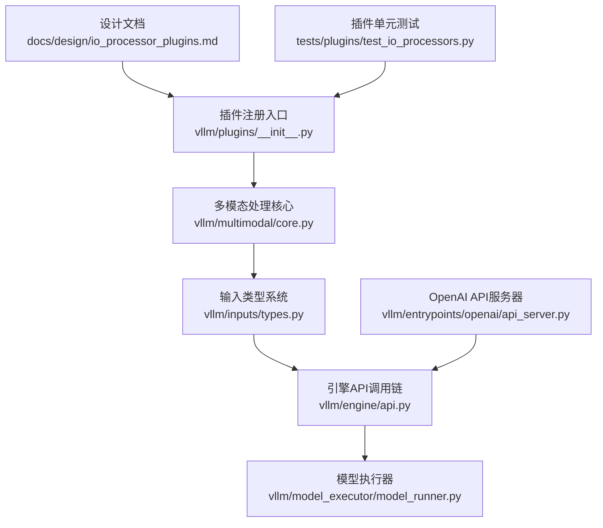
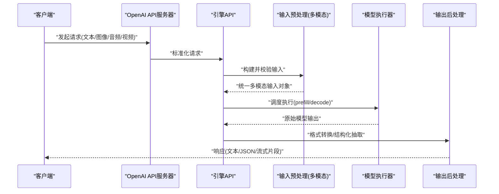
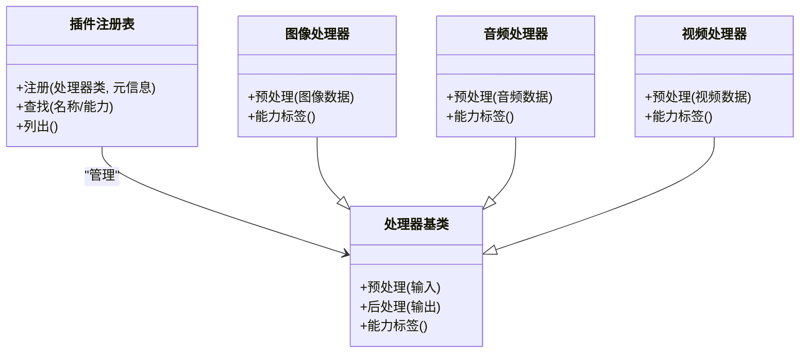
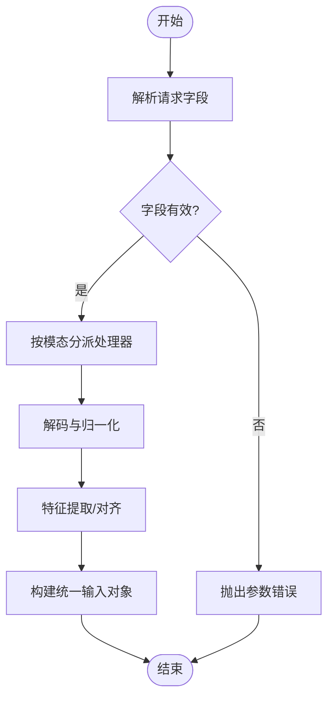
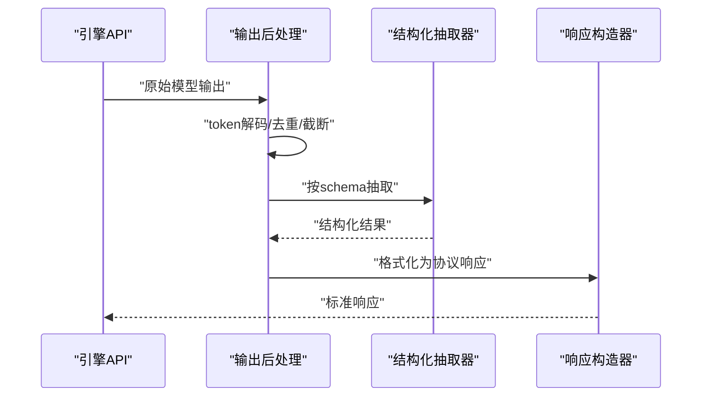
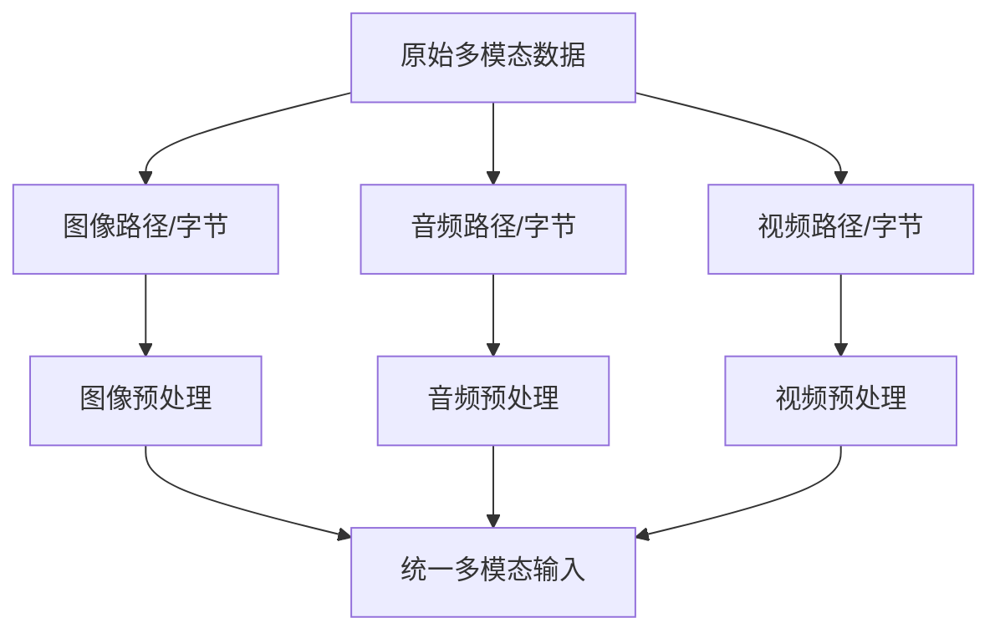
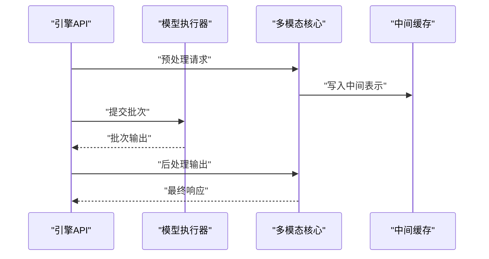
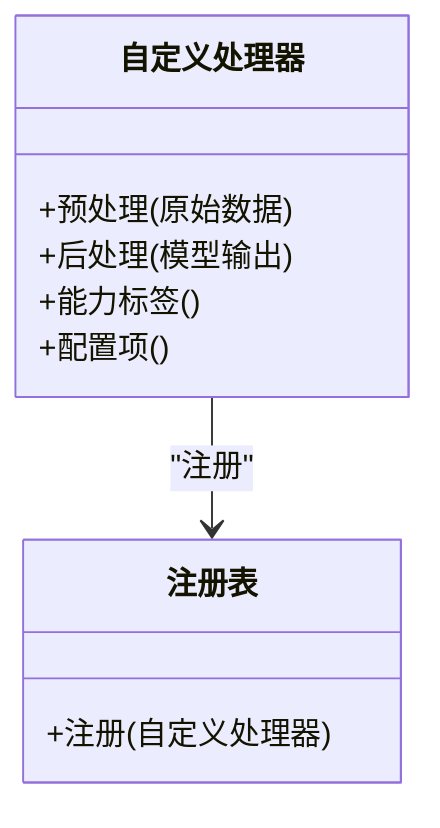
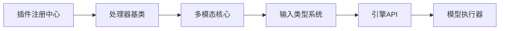

# IO处理器插件

<cite>
**本文引用的文件**   
- [io_processor_plugins.md](file://docs/design/io_processor_plugins.md)
- [mm_processing.md](file://docs/design/mm_processing.md)
- [vllm/plugins/__init__.py](file://vllm/plugins/__init__.py)
- [vllm/multimodal/core.py](file://vllm/multimodal/core.py)
- [vllm/inputs/types.py](file://vllm/inputs/types.py)
- [vllm/engine/api.py](file://vllm/engine/api.py)
- [vllm/model_executor/model_runner.py](file://vllm/model_executor/model_runner.py)
- [vllm/entrypoints/openai/api_server.py](file://vllm/entrypoints/openai/api_server.py)
- [tests/plugins/test_io_processors.py](file://tests/plugins/test_io_processors.py)
</cite>

## 目录
1. [简介](#简介)
2. [项目结构](#项目结构)
3. [核心组件](#核心组件)
4. [架构总览](#架构总览)
5. [详细组件分析](#详细组件分析)
6. [依赖关系分析](#依赖关系分析)
7. [性能考虑](#性能考虑)
8. [故障排查指南](#故障排查指南)
9. [结论](#结论)
10. [附录](#附录)

## 简介
本文件系统化阐述 vLLM 的 IO 处理器插件体系，覆盖其作用、工作原理与扩展点。重点包括：
- 输入预处理：将原始多模态数据（文本、图像、音频、视频等）转换为模型可消费的统一中间表示。
- 输出后处理：对模型推理结果进行格式转换、结构化抽取、解码与渲染。
- 插件接口与注册机制：如何定义自定义处理器、注册到框架、并通过配置启用。
- 与模型执行器的集成方式与关键优化策略。
- 错误处理、日志记录与调试技巧。

## 项目结构
IO 处理器插件相关的设计文档位于 docs/design 目录；运行时实现分布在 vllm/plugins、vllm/multimodal、vllm/inputs、vllm/engine、vllm/model_executor 等模块；测试用例位于 tests/plugins。

**图表来源** 
- [io_processor_plugins.md](file://docs/design/io_processor_plugins.md)
- [vllm/plugins/__init__.py](file://vllm/plugins/__init__.py)
- [vllm/multimodal/core.py](file://vllm/multimodal/core.py)
- [vllm/inputs/types.py](file://vllm/inputs/types.py)
- [vllm/engine/api.py](file://vllm/engine/api.py)
- [vllm/model_executor/model_runner.py](file://vllm/model_executor/model_runner.py)
- [vllm/entrypoints/openai/api_server.py](file://vllm/entrypoints/openai/api_server.py)
- [tests/plugins/test_io_processors.py](file://tests/plugins/test_io_processors.py)

**章节来源**
- [io_processor_plugins.md](file://docs/design/io_processor_plugins.md)
- [mm_processing.md](file://docs/design/mm_processing.md)

## 核心组件
- 插件注册中心：提供统一的注册表与发现机制，支持按名称或能力维度查找处理器。
- 输入预处理管线：负责解析原始请求、校验参数、分派到对应模态处理器，生成统一的多模态输入对象。
- 输出后处理管线：接收模型输出，执行解码、格式化、结构化抽取、流式组装等。
- 类型系统与中间表示：定义标准化的输入/输出数据结构，确保跨模态一致性与可扩展性。
- 引擎集成点：在请求生命周期中插入预处理与后处理钩子，保证低开销与高吞吐。

**章节来源**
- [vllm/plugins/__init__.py](file://vllm/plugins/__init__.py)
- [vllm/multimodal/core.py](file://vllm/multimodal/core.py)
- [vllm/inputs/types.py](file://vllm/inputs/types.py)
- [vllm/engine/api.py](file://vllm/engine/api.py)

## 架构总览
下图展示从请求进入到模型执行的端到端流程，以及 IO 处理器在其中的位置与作用。

**图表来源** 
- [vllm/entrypoints/openai/api_server.py](file://vllm/entrypoints/openai/api_server.py)
- [vllm/engine/api.py](file://vllm/engine/api.py)
- [vllm/multimodal/core.py](file://vllm/multimodal/core.py)
- [vllm/model_executor/model_runner.py](file://vllm/model_executor/model_runner.py)

## 详细组件分析

### 插件注册与发现
- 注册表：集中管理处理器类与其元信息（名称、能力标签、版本兼容性）。
- 发现机制：通过配置键或自动扫描加载已注册的处理器。
- 生命周期：初始化时完成注册，运行期按需实例化与复用。

**图表来源** 
- [vllm/plugins/__init__.py](file://vllm/plugins/__init__.py)
- [vllm/multimodal/core.py](file://vllm/multimodal/core.py)

**章节来源**
- [vllm/plugins/__init__.py](file://vllm/plugins/__init__.py)

### 输入预处理管线
- 解析与校验：识别模态类型、校验字段、补齐默认值。
- 分派与转换：根据模态选择对应处理器，执行解码、归一化、特征提取。
- 统一表示：生成多模态输入对象，包含各模态张量与元数据。

**图表来源** 
- [vllm/multimodal/core.py](file://vllm/multimodal/core.py)
- [vllm/inputs/types.py](file://vllm/inputs/types.py)

**章节来源**
- [vllm/multimodal/core.py](file://vllm/multimodal/core.py)
- [vllm/inputs/types.py](file://vllm/inputs/types.py)

### 输出后处理管线
- 解码与拼接：将 token 序列解码为可读文本，支持流式增量输出。
- 结构化抽取：依据 schema 抽取 JSON/XML/函数调用等结构化内容。
- 格式转换：适配不同前端协议（如 OpenAI Chat Completions），返回标准响应。

**图表来源** 
- [vllm/engine/api.py](file://vllm/engine/api.py)
- [vllm/entrypoints/openai/api_server.py](file://vllm/entrypoints/openai/api_server.py)

**章节来源**
- [vllm/engine/api.py](file://vllm/engine/api.py)
- [vllm/entrypoints/openai/api_server.py](file://vllm/entrypoints/openai/api_server.py)

### 多模态数据处理
- 图像：解码、缩放、裁剪、归一化、嵌入对齐。
- 音频：采样率转换、声道处理、分帧/特征提取。
- 视频：抽帧、时序对齐、时空特征融合。

**图表来源** 
- [mm_processing.md](file://docs/design/mm_processing.md)
- [vllm/multimodal/core.py](file://vllm/multimodal/core.py)

**章节来源**
- [mm_processing.md](file://docs/design/mm_processing.md)
- [vllm/multimodal/core.py](file://vllm/multimodal/core.py)

### 与模型执行器的集成
- 插桩点：在预填充与解码阶段前后插入预处理与后处理逻辑。
- 批处理：保持批内一致性，避免重复解码与特征计算。
- 内存与缓存：复用中间表示，减少拷贝与序列化开销。

**图表来源** 
- [vllm/engine/api.py](file://vllm/engine/api.py)
- [vllm/model_executor/model_runner.py](file://vllm/model_executor/model_runner.py)
- [vllm/multimodal/core.py](file://vllm/multimodal/core.py)

**章节来源**
- [vllm/engine/api.py](file://vllm/engine/api.py)
- [vllm/model_executor/model_runner.py](file://vllm/model_executor/model_runner.py)

### 自定义 IO 处理器开发示例
- 目标：实现一个自定义处理器，支持特定模态或业务逻辑。
- 步骤：
  - 定义处理器类，继承基类，实现预处理/后处理方法。
  - 声明能力标签与配置项。
  - 在注册表中注册处理器。
  - 通过配置启用并在请求中使用。
- 示例场景：
  - 音频转写：音频预处理→语音特征→文本输出。
  - 视频理解：视频预处理→时空特征→描述/问答。
  - 图像增强：图像预处理→增强→视觉问答。

**图表来源** 
- [vllm/plugins/__init__.py](file://vllm/plugins/__init__.py)
- [vllm/multimodal/core.py](file://vllm/multimodal/core.py)

**章节来源**
- [vllm/plugins/__init__.py](file://vllm/plugins/__init__.py)
- [vllm/multimodal/core.py](file://vllm/multimodal/core.py)

### 配置选项与启用方式
- 全局配置：在引擎启动时加载处理器清单与默认参数。
- 请求级配置：在请求体中指定处理器名称或能力标签。
- 动态切换：支持热更新处理器实现（需保证兼容性与幂等）。

**章节来源**
- [vllm/plugins/__init__.py](file://vllm/plugins/__init__.py)
- [vllm/engine/api.py](file://vllm/engine/api.py)

## 依赖关系分析
- 模块耦合：
  - 插件注册中心依赖处理器基类与元信息。
  - 多模态核心依赖输入类型系统与处理器实现。
  - 引擎API串联预处理与后处理，并与模型执行器交互。
- 外部依赖：
  - 解码库（图像/音频/视频）。
  - 序列化/反序列化库（JSON/XML）。
  - 日志与监控组件。

**图表来源** 
- [vllm/plugins/__init__.py](file://vllm/plugins/__init__.py)
- [vllm/multimodal/core.py](file://vllm/multimodal/core.py)
- [vllm/inputs/types.py](file://vllm/inputs/types.py)
- [vllm/engine/api.py](file://vllm/engine/api.py)
- [vllm/model_executor/model_runner.py](file://vllm/model_executor/model_runner.py)

**章节来源**
- [vllm/plugins/__init__.py](file://vllm/plugins/__init__.py)
- [vllm/multimodal/core.py](file://vllm/multimodal/core.py)
- [vllm/inputs/types.py](file://vllm/inputs/types.py)
- [vllm/engine/api.py](file://vllm/engine/api.py)
- [vllm/model_executor/model_runner.py](file://vllm/model_executor/model_runner.py)

## 性能考虑
- 批内一致性：避免在批处理中进行昂贵的重复操作（如重复解码）。
- 零拷贝与内存池：尽量使用共享内存与缓冲区，减少数据迁移。
- 异步与流水线：将 I/O 与计算解耦，提升吞吐。
- 缓存与复用：缓存中间表示与特征，降低重复计算。
- 资源隔离：为不同模态处理器分配独立线程/进程，避免阻塞。

[本节为通用指导，不直接分析具体文件]

## 故障排查指南
- 常见错误：
  - 参数校验失败：检查字段类型、必填项与范围。
  - 处理器未注册：确认注册表与配置是否正确。
  - 解码异常：验证输入数据完整性与编码格式。
- 日志定位：
  - 开启详细日志级别，捕获预处理/后处理关键节点。
  - 打印中间表示的形状与数据类型，辅助定位问题。
- 调试技巧：
  - 使用最小复现用例，逐步缩小问题范围。
  - 模拟请求注入，验证处理器行为。
  - 对比参考实现，检查差异点。

**章节来源**
- [tests/plugins/test_io_processors.py](file://tests/plugins/test_io_processors.py)

## 结论
IO 处理器插件体系为 vLLM 提供了灵活、可扩展的多模态数据处理能力。通过清晰的接口设计与注册机制，开发者可以便捷地扩展新的模态与业务逻辑。结合性能优化策略与完善的调试手段，可在复杂场景中实现高效稳定的推理服务。

[本节为总结性内容，不直接分析具体文件]

## 附录
- 参考设计文档：
  - [IO 处理器插件设计](file://docs/design/io_processor_plugins.md)
  - [多模态处理设计](file://docs/design/mm_processing.md)
- 关键实现文件：
  - [插件注册入口](file://vllm/plugins/__init__.py)
  - [多模态核心](file://vllm/multimodal/core.py)
  - [输入类型系统](file://vllm/inputs/types.py)
  - [引擎API](file://vllm/engine/api.py)
  - [模型执行器](file://vllm/model_executor/model_runner.py)
  - [OpenAI API服务器](file://vllm/entrypoints/openai/api_server.py)
  - [插件单元测试](file://tests/plugins/test_io_processors.py)