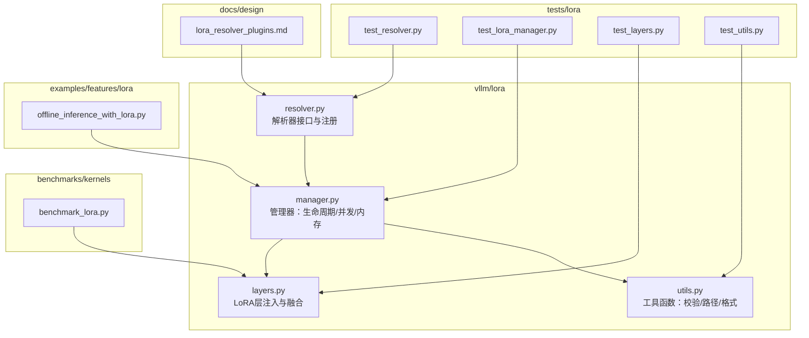
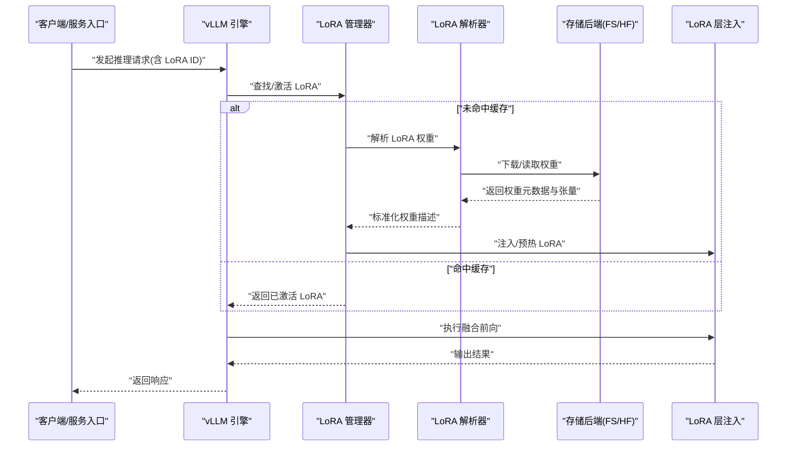
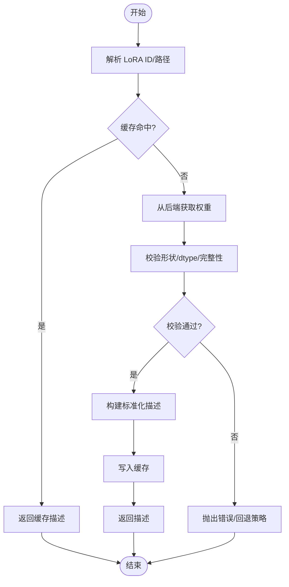
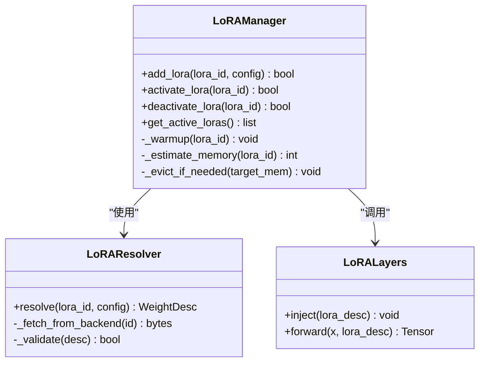
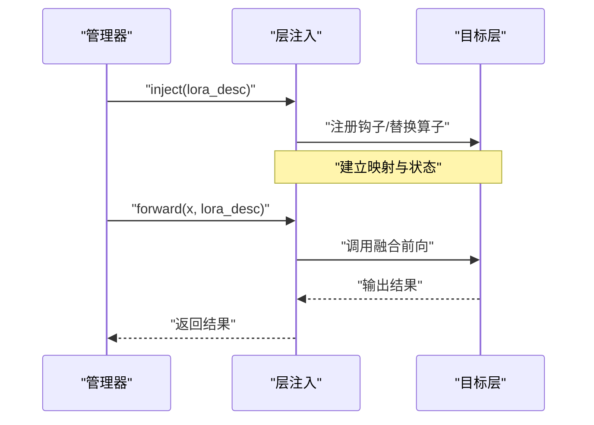
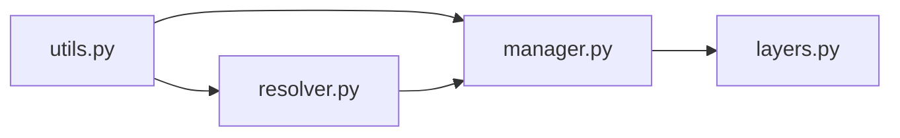

# LoRA解析器插件

<cite>
**本文引用的文件**   
- [vllm/lora/resolver.py](file://vllm/lora/resolver.py)
- [vllm/lora/manager.py](file://vllm/lora/manager.py)
- [vllm/lora/layers.py](file://vllm/lora/layers.py)
- [vllm/lora/utils.py](file://vllm/lora/utils.py)
- [tests/lora/test_resolver.py](file://tests/lora/test_resolver.py)
- [tests/lora/test_lora_manager.py](file://tests/lora/test_lora_manager.py)
- [tests/lora/test_layers.py](file://tests/lora/test_layers.py)
- [tests/lora/test_utils.py](file://tests/lora/test_utils.py)
- [docs/design/lora_resolver_plugins.md](file://docs/design/lora_resolver_plugins.md)
- [examples/features/lora/offline_inference_with_lora.py](file://examples/features/lora/offline_inference_with_lora.py)
- [benchmarks/kernels/benchmark_lora.py](file://benchmarks/kernels/benchmark_lora.py)
</cite>

## 目录
1. [简介](#简介)
2. [项目结构](#项目结构)
3. [核心组件](#核心组件)
4. [架构总览](#架构总览)
5. [详细组件分析](#详细组件分析)
6. [依赖关系分析](#依赖关系分析)
7. [性能考量](#性能考量)
8. [故障排查指南](#故障排查指南)
9. [结论](#结论)
10. [附录](#附录)

## 简介
本文件系统性介绍 vLLM 的 LoRA（Low-Rank Adaptation）解析器插件系统。LoRA 通过在预训练模型权重旁注入低秩矩阵进行参数高效微调，推理时以极小开销叠加到主干权重上，实现多任务、多风格的动态适配。vLLM 将 LoRA 的加载、管理、切换与调度抽象为“解析器插件”，支持多种存储后端（如本地文件系统、Hugging Face Hub），并提供统一的接口供上层引擎调用。

本文重点包括：
- LoRA 基本概念及其在 vLLM 中的角色
- 解析器的职责边界：权重发现、下载/读取、校验、缓存、映射到层
- 管理与调度：并发加载、内存优化、动态切换
- 开发接口与配置项说明
- 最佳实践与常见问题排查

## 项目结构
围绕 LoRA 的核心代码位于 vllm/lora 目录，测试位于 tests/lora，设计文档位于 docs/design，示例与基准分别位于 examples/features/lora 与 benchmarks/kernels。

图表来源
- [vllm/lora/resolver.py](file://vllm/lora/resolver.py)
- [vllm/lora/manager.py](file://vllm/lora/manager.py)
- [vllm/lora/layers.py](file://vllm/lora/layers.py)
- [vllm/lora/utils.py](file://vllm/lora/utils.py)
- [docs/design/lora_resolver_plugins.md](file://docs/design/lora_resolver_plugins.md)
- [examples/features/lora/offline_inference_with_lora.py](file://examples/features/lora/offline_inference_with_lora.py)
- [benchmarks/kernels/benchmark_lora.py](file://benchmarks/kernels/benchmark_lora.py)

章节来源
- [docs/design/lora_resolver_plugins.md](file://docs/design/lora_resolver_plugins.md)

## 核心组件
- 解析器（Resolver）
  - 职责：根据 LoRA ID 或路径定位权重，从不同后端（文件系统、HF Hub 等）拉取并缓存；对权重元数据与形状进行校验；返回标准化的权重描述以便后续注入。
  - 关键点：统一接口、可插拔后端、幂等加载、错误回退与重试策略。
- 管理器（Manager）
  - 职责：维护 LoRA 实例的生命周期（创建、预热、激活、停用、销毁）；协调并发加载与内存占用；提供按请求路由的激活策略。
  - 关键点：线程安全、LRU/引用计数、显存估算与限流、热切换。
- 层注入（Layers）
  - 职责：将 LoRA 权重以低秩形式注入到目标层（如线性层、注意力门控等），并在前向中融合计算。
  - 关键点：形状对齐、dtype 转换、算子融合、零拷贝路径。
- 工具（Utils）
  - 职责：路径解析、格式识别、校验、哈希、缓存键生成、日志与指标上报。
  - 关键点：健壮性、可观测性、跨平台兼容。

章节来源
- [vllm/lora/resolver.py](file://vllm/lora/resolver.py)
- [vllm/lora/manager.py](file://vllm/lora/manager.py)
- [vllm/lora/layers.py](file://vllm/lora/layers.py)
- [vllm/lora/utils.py](file://vllm/lora/utils.py)

## 架构总览
下图展示了 LoRA 解析器插件系统与 vLLM 引擎的交互流程：请求进入后，管理器根据请求指定的 LoRA ID 选择已激活的解析器实例，解析器从后端获取权重并交由层注入模块完成融合。

图表来源
- [vllm/lora/manager.py](file://vllm/lora/manager.py)
- [vllm/lora/resolver.py](file://vllm/lora/resolver.py)
- [vllm/lora/layers.py](file://vllm/lora/layers.py)

## 详细组件分析

### 解析器（Resolver）
- 设计要点
  - 统一接口：定义解析器基类与注册机制，便于扩展新的存储后端。
  - 后端抽象：文件系统、Hugging Face Hub、私有仓库等通过适配器接入。
  - 幂等与缓存：基于哈希的缓存键，避免重复下载与重复解析。
  - 校验与容错：权重形状、dtype、缺失键检测与友好错误信息。
- 典型流程
  - 输入：LoRA ID 或路径、可选配置（如分片、量化）。
  - 处理：定位资源、下载/读取、校验、构建权重描述。
  - 输出：标准化权重描述（包含层名映射、张量形状、dtype、缩放因子等）。

图表来源
- [vllm/lora/resolver.py](file://vllm/lora/resolver.py)
- [vllm/lora/utils.py](file://vllm/lora/utils.py)

章节来源
- [vllm/lora/resolver.py](file://vllm/lora/resolver.py)
- [tests/lora/test_resolver.py](file://tests/lora/test_resolver.py)

### 管理器（Manager）
- 设计要点
  - 生命周期管理：创建、预热、激活、停用、销毁 LoRA 实例。
  - 并发控制：多线程/进程安全的访问控制，避免竞态条件。
  - 内存优化：显存估算、LRU 淘汰、按需加载、共享权重。
  - 路由策略：按请求维度（用户/租户/会话）绑定 LoRA，支持热切换。
- 关键操作
  - add_lora：注册新 LoRA，触发解析与预热。
  - activate_lora：将 LoRA 应用到当前请求上下文。
  - deactivate_lora：释放或切换 LoRA。
  - get_active_loras：查询当前生效的 LoRA 集合。

图表来源
- [vllm/lora/manager.py](file://vllm/lora/manager.py)
- [vllm/lora/resolver.py](file://vllm/lora/resolver.py)
- [vllm/lora/layers.py](file://vllm/lora/layers.py)

章节来源
- [vllm/lora/manager.py](file://vllm/lora/manager.py)
- [tests/lora/test_lora_manager.py](file://tests/lora/test_lora_manager.py)

### 层注入（Layers）
- 设计要点
  - 目标层识别：自动匹配需要注入 LoRA 的层（如 Linear、Attention Gate）。
  - 低秩融合：将 LoRA 权重与主干权重在前向中融合，减少额外开销。
  - dtype/形状对齐：确保 LoRA 与主干层一致，必要时进行转换。
  - 可插拔：支持不同模型结构的适配。
- 典型行为
  - inject：将 LoRA 描述映射到具体层，建立前向钩子或替换算子。
  - forward：在推理过程中应用 LoRA 增量，保持主权重不变。

图表来源
- [vllm/lora/layers.py](file://vllm/lora/layers.py)

章节来源
- [vllm/lora/layers.py](file://vllm/lora/layers.py)
- [tests/lora/test_layers.py](file://tests/lora/test_layers.py)

### 工具（Utils）
- 功能范围
  - 路径解析：相对/绝对路径、URL、HF 仓库名解析。
  - 格式识别：识别 .safetensors、.bin、.json 等格式。
  - 校验与哈希：SHA/MD5、形状一致性检查、dtype 验证。
  - 缓存键生成：基于 ID、版本、配置的稳定键。
  - 日志与指标：记录加载耗时、失败原因、命中率。

章节来源
- [vllm/lora/utils.py](file://vllm/lora/utils.py)
- [tests/lora/test_utils.py](file://tests/lora/test_utils.py)

## 依赖关系分析
- 内部依赖
  - manager 依赖 resolver 与 layers，形成“管理-解析-注入”的三层解耦。
  - utils 被 resolver 与 manager 共用，提供通用能力。
- 外部依赖
  - 存储后端：文件系统、Hugging Face Hub、对象存储等。
  - 张量框架：PyTorch/TensorFlow（以 PyTorch 为主）。
- 潜在风险
  - 循环依赖：需避免 manager/resolver/layers 之间的循环 import。
  - 后端耦合：通过适配器隔离，降低变更影响面。

图表来源
- [vllm/lora/resolver.py](file://vllm/lora/resolver.py)
- [vllm/lora/manager.py](file://vllm/lora/manager.py)
- [vllm/lora/layers.py](file://vllm/lora/layers.py)
- [vllm/lora/utils.py](file://vllm/lora/utils.py)

章节来源
- [vllm/lora/resolver.py](file://vllm/lora/resolver.py)
- [vllm/lora/manager.py](file://vllm/lora/manager.py)
- [vllm/lora/layers.py](file://vllm/lora/layers.py)
- [vllm/lora/utils.py](file://vllm/lora/utils.py)

## 性能考量
- 内存优化
  - 显存估算与阈值控制：在添加/激活 LoRA 前预估显存占用，超限则触发 LRU 淘汰。
  - 共享权重：相同 LoRA 的多实例共享底层张量，减少重复拷贝。
  - 延迟加载：仅在首次使用前加载必要张量。
- 计算优化
  - 算子融合：LoRA 与前向融合，减少内核启动与中间张量分配。
  - dtype 选择：优先使用较低精度（如 FP16/BF16）以降低带宽压力。
- 并发与吞吐
  - 批量预热：启动阶段并行预热常用 LoRA，降低冷启动延迟。
  - 请求级路由：按租户/会话固定 LoRA，减少切换开销。
- 监控与调优
  - 指标：加载耗时、命中率、显存峰值、切换次数。
  - 基准：参考 benchmark_lora.py 进行端到端压测与瓶颈定位。

章节来源
- [benchmarks/kernels/benchmark_lora.py](file://benchmarks/kernels/benchmark_lora.py)

## 故障排查指南
- 常见错误
  - 权重缺失或形状不匹配：检查 LoRA 版本与模型架构是否一致。
  - 后端不可达：确认网络权限、代理设置与仓库可见性。
  - 显存不足：降低并发、减少同时激活的 LoRA 数量或启用更激进的 LRU 策略。
  - 切换失败：确认目标 LoRA 已预热且未被其他请求独占。
- 诊断步骤
  - 查看日志：关注解析器与管理器日志，定位失败阶段。
  - 校验权重：使用工具函数对权重进行完整性与形状检查。
  - 复现实验：通过离线脚本最小化复现问题。
- 参考用例
  - 离线推理示例可用于快速验证 LoRA 加载与注入流程。

章节来源
- [examples/features/lora/offline_inference_with_lora.py](file://examples/features/lora/offline_inference_with_lora.py)
- [tests/lora/test_resolver.py](file://tests/lora/test_resolver.py)
- [tests/lora/test_lora_manager.py](file://tests/lora/test_lora_manager.py)

## 结论
vLLM 的 LoRA 解析器插件系统将 LoRA 的加载、管理与注入解耦为清晰的责任边界，并通过统一接口与可插拔后端实现了灵活性与可扩展性。结合高效的内存与并发策略，能够在高吞吐场景下稳定支持多 LoRA 的动态切换与复用。建议在生产环境中结合监控与基准测试持续优化，确保稳定性与性能达到预期。

## 附录
- 开发接口要点
  - 解析器：实现 resolve 方法，返回标准化权重描述；支持缓存键与错误码。
  - 管理器：实现 add/activate/deactivate 生命周期方法；提供内存估算与淘汰策略。
  - 层注入：实现 inject/forward，保证 dtype/形状对齐与融合正确性。
- 配置参数建议
  - 后端：选择 FS/HF/自定义，配置认证与超时。
  - 缓存：设置缓存目录、最大条目数与过期策略。
  - 并发：限制预热线程数与最大激活 LoRA 数量。
  - 精度：指定 dtype 与量化策略（如适用）。
- 最佳实践
  - 启动预热常用 LoRA，减少首请求延迟。
  - 使用稳定的 LoRA ID 与版本标签，便于缓存命中。
  - 定期清理无用 LoRA 与缓存，避免显存泄漏。
  - 结合指标与日志持续观察热点与瓶颈。