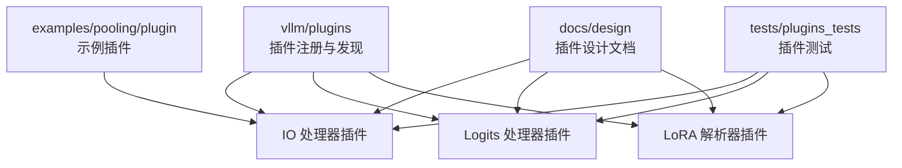
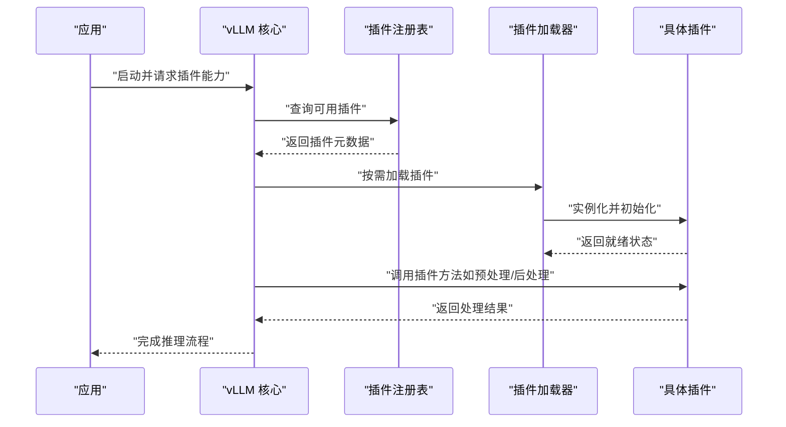
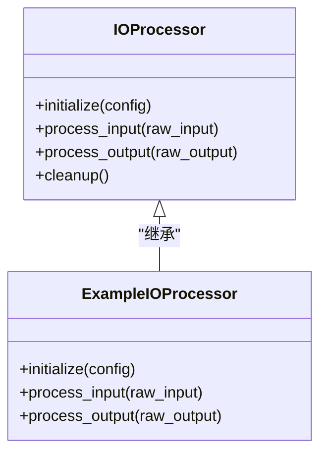
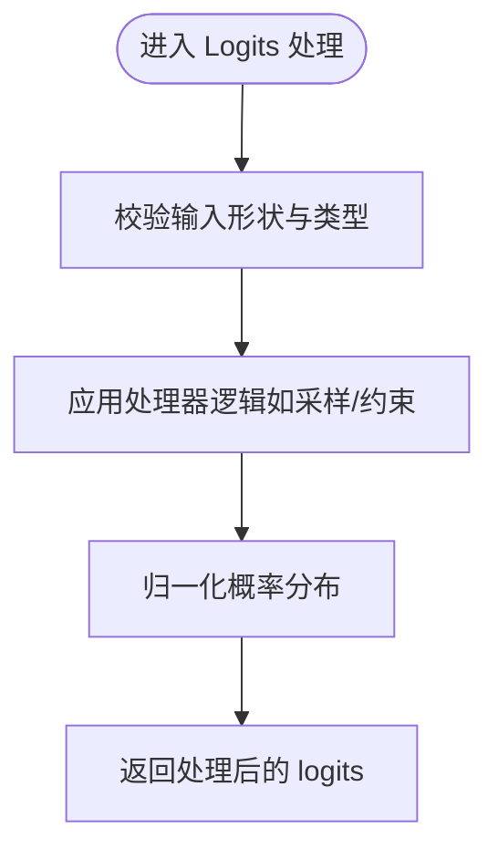
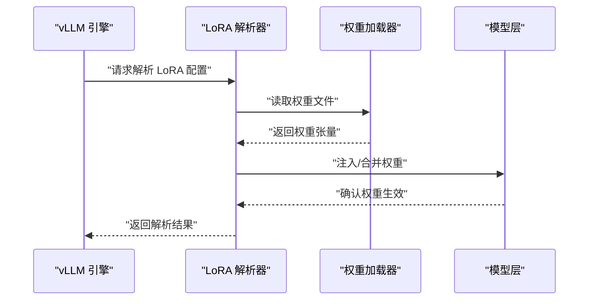
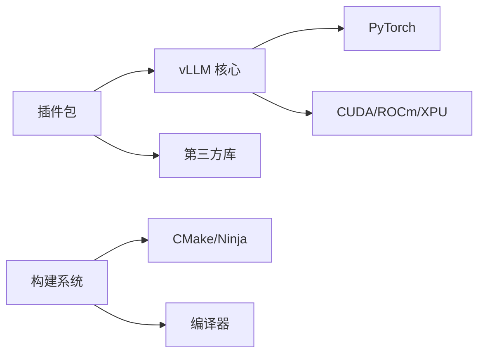

# 插件开发指南

<cite>
**本文档引用的文件**
- [vllm/plugins/__init__.py](file://vllm/plugins/__init__.py)
- [vllm/plugins/README.md](file://vllm/plugins/README.md)
- [docs/design/plugin_system.md](file://docs/design/plugin_system.md)
- [docs/design/io_processor_plugins.md](file://docs/design/io_processor_plugins.md)
- [docs/design/logits_processors.md](file://docs/design/logits_processors.md)
- [docs/design/lora_resolver_plugins.md](file://docs/design/lora_resolver_plugins.md)
- [examples/pooling/plugin/example_pooling_plugin.py](file://examples/pooling/plugin/example_pooling_plugin.py)
- [tests/plugins_tests/test_io_processor_plugin.py](file://tests/plugins_tests/test_io_processor_plugin.py)
- [tests/plugins_tests/test_logits_processor_plugin.py](file://tests/plugins_tests/test_logits_processor_plugin.py)
- [tests/plugins_tests/test_lora_resolver_plugin.py](file://tests/plugins_tests/test_lora_resolver_plugin.py)
- [requirements/dev.txt](file://requirements/dev.txt)
- [setup.py](file://setup.py)
- [pyproject.toml](file://pyproject.toml)
</cite>

## 目录
1. [简介](#简介)
2. [项目结构](#项目结构)
3. [核心组件](#核心组件)
4. [架构总览](#架构总览)
5. [详细组件分析](#详细组件分析)
6. [依赖分析](#依赖分析)
7. [性能考虑](#性能考虑)
8. [故障排查指南](#故障排查指南)
9. [结论](#结论)
10. [附录](#附录)

## 简介
本指南面向希望在 vLLM 中开发插件的工程师与研究者，覆盖从环境搭建、依赖配置、开发工具使用，到插件标准结构与命名规范；并提供由浅入深的示例（Hello World、数据处理、计算优化），以及测试、调试、性能分析与发布、版本管理与社区贡献的最佳实践。同时解释插件与 vLLM 核心版本的兼容性要求与迁移策略，帮助你在不同 vLLM 版本间平滑演进。

## 项目结构
vLLM 的插件体系围绕“可插拔”的设计思想组织，核心入口位于 vllm/plugins 目录，配套设计文档在 docs/design 下，示例与测试分别在 examples 和 tests 中。典型结构如下：
- vllm/plugins：插件注册与发现机制、通用基类与接口定义
- docs/design：插件系统设计文档（如 IO 处理器、Logits 处理器、LoRA 解析器等）
- examples/pooling/plugin：示例插件实现
- tests/plugins_tests：插件单元测试与集成测试
- requirements 与 setup/pyproject：依赖与构建配置

图表来源
- [vllm/plugins/__init__.py](file://vllm/plugins/__init__.py)
- [docs/design/plugin_system.md](file://docs/design/plugin_system.md)
- [docs/design/io_processor_plugins.md](file://docs/design/io_processor_plugins.md)
- [docs/design/logits_processors.md](file://docs/design/logits_processors.md)
- [docs/design/lora_resolver_plugins.md](file://docs/design/lora_resolver_plugins.md)
- [examples/pooling/plugin/example_pooling_plugin.py](file://examples/pooling/plugin/example_pooling_plugin.py)
- [tests/plugins_tests/test_io_processor_plugin.py](file://tests/plugins_tests/test_io_processor_plugin.py)
- [tests/plugins_tests/test_logits_processor_plugin.py](file://tests/plugins_tests/test_logits_processor_plugin.py)
- [tests/plugins_tests/test_lora_resolver_plugin.py](file://tests/plugins_tests/test_lora_resolver_plugin.py)

章节来源
- [vllm/plugins/__init__.py](file://vllm/plugins/__init__.py)
- [docs/design/plugin_system.md](file://docs/design/plugin_system.md)

## 核心组件
- 插件注册与发现：提供统一的注册表与加载机制，支持按类型（如 IO 处理器、Logits 处理器、LoRA 解析器）动态发现与实例化。
- 插件接口与基类：为每类插件定义清晰的抽象接口，确保与 vLLM 核心交互的一致性。
- 配置与参数：插件通过配置对象或环境变量注入参数，保持与引擎解耦。
- 生命周期管理：初始化、预热、运行、清理等阶段的生命周期钩子。
- 错误处理与诊断：统一异常类型、日志与指标上报，便于定位问题。

章节来源
- [vllm/plugins/__init__.py](file://vllm/plugins/__init__.py)
- [docs/design/plugin_system.md](file://docs/design/plugin_system.md)

## 架构总览
下图展示了插件系统与 vLLM 核心的交互关系，包括注册、加载、调用与数据流。

图表来源
- [docs/design/plugin_system.md](file://docs/design/plugin_system.md)
- [vllm/plugins/__init__.py](file://vllm/plugins/__init__.py)

## 详细组件分析

### IO 处理器插件
IO 处理器负责输入输出的预处理与后处理，例如文本编码、图像解码、音频转码等。其典型职责包括：
- 输入校验与标准化
- 多模态数据的格式转换
- 输出格式化与序列化

图表来源
- [docs/design/io_processor_plugins.md](file://docs/design/io_processor_plugins.md)
- [examples/pooling/plugin/example_pooling_plugin.py](file://examples/pooling/plugin/example_pooling_plugin.py)

章节来源
- [docs/design/io_processor_plugins.md](file://docs/design/io_processor_plugins.md)
- [tests/plugins_tests/test_io_processor_plugin.py](file://tests/plugins_tests/test_io_processor_plugin.py)

### Logits 处理器插件
Logits 处理器用于对模型输出的 logits 进行后处理，如温度缩放、Top-K/Top-P 采样、重复惩罚、结构化输出约束等。

图表来源
- [docs/design/logits_processors.md](file://docs/design/logits_processors.md)
- [tests/plugins_tests/test_logits_processor_plugin.py](file://tests/plugins_tests/test_logits_processor_plugin.py)

章节来源
- [docs/design/logits_processors.md](file://docs/design/logits_processors.md)
- [tests/plugins_tests/test_logits_processor_plugin.py](file://tests/plugins_tests/test_logits_processor_plugin.py)

### LoRA 解析器插件
LoRA 解析器负责加载与合并 LoRA 权重，支持多种权重格式与动态路由策略。

图表来源
- [docs/design/lora_resolver_plugins.md](file://docs/design/lora_resolver_plugins.md)
- [tests/plugins_tests/test_lora_resolver_plugin.py](file://tests/plugins_tests/test_lora_resolver_plugin.py)

章节来源
- [docs/design/lora_resolver_plugins.md](file://docs/design/lora_resolver_plugins.md)
- [tests/plugins_tests/test_lora_resolver_plugin.py](file://tests/plugins_tests/test_lora_resolver_plugin.py)

### Hello World 插件示例
- 目标：展示最小可用的插件实现，包含注册、初始化与简单调用。
- 步骤：
  - 定义插件类并继承对应基类
  - 实现必要的方法（如 initialize、process）
  - 在注册表中注册插件名称与类映射
  - 编写单元测试验证行为

章节来源
- [examples/pooling/plugin/example_pooling_plugin.py](file://examples/pooling/plugin/example_pooling_plugin.py)
- [tests/plugins_tests/test_io_processor_plugin.py](file://tests/plugins_tests/test_io_processor_plugin.py)

### 数据处理插件示例
- 目标：实现一个通用的数据预处理插件，支持批量输入校验、格式转换与缓存。
- 关键点：
  - 输入校验与容错
  - 批处理优化（避免逐条循环）
  - 缓存命中与失效策略

章节来源
- [docs/design/io_processor_plugins.md](file://docs/design/io_processor_plugins.md)
- [tests/plugins_tests/test_io_processor_plugin.py](file://tests/plugins_tests/test_io_processor_plugin.py)

### 计算优化插件示例
- 目标：封装高性能算子（如自定义量化、融合算子）作为插件暴露给 vLLM。
- 关键点：
  - 算子接口对齐 vLLM 内核约定
  - 设备亲和性（CPU/GPU/TPU）与内存布局
  - 性能基准与回归测试

章节来源
- [docs/design/plugin_system.md](file://docs/design/plugin_system.md)
- [tests/plugins_tests/test_logits_processor_plugin.py](file://tests/plugins_tests/test_logits_processor_plugin.py)

## 依赖分析
- 运行时依赖：Python 版本、PyTorch、CUDA/ROCm/XPU 驱动、第三方库（如 transformers、accelerate）。
- 构建依赖：CMake、编译器（GCC/Clang）、Ninja、可选的 Triton/CUTLASS。
- 插件依赖隔离：建议使用虚拟环境或容器，避免与主工程冲突。

图表来源
- [requirements/dev.txt](file://requirements/dev.txt)
- [setup.py](file://setup.py)
- [pyproject.toml](file://pyproject.toml)

章节来源
- [requirements/dev.txt](file://requirements/dev.txt)
- [setup.py](file://setup.py)
- [pyproject.toml](file://pyproject.toml)

## 性能考虑
- 批处理与向量化：优先使用批量操作减少 Python 开销。
- 内存与显存：避免不必要的拷贝，使用共享内存或零拷贝技术。
- 异步与并行：合理拆分 I/O 与计算，利用多线程/进程池。
- 基准与回归：建立性能基准集，监控回归变化。
- 硬件亲和：根据设备特性选择最优路径（如 GPU 核函数、CPU SIMD）。

[本节为通用指导，不直接分析具体文件]

## 故障排查指南
- 常见问题：
  - 插件未注册或无法发现：检查注册表与导入路径
  - 初始化失败：核对配置项与依赖库版本
  - 运行时崩溃：查看日志与堆栈，复现最小用例
  - 性能退化：对比基准，定位热点路径
- 调试技巧：
  - 启用详细日志与断点
  - 使用性能剖析工具（如 py-spy、torch.profiler）
  - 逐步缩小问题范围（单测 vs 集成）
- 恢复策略：
  - 回滚到已知稳定版本
  - 禁用可疑插件，逐步启用定位
  - 收集环境与依赖信息以便复现

章节来源
- [tests/plugins_tests/test_io_processor_plugin.py](file://tests/plugins_tests/test_io_processor_plugin.py)
- [tests/plugins_tests/test_logits_processor_plugin.py](file://tests/plugins_tests/test_logits_processor_plugin.py)
- [tests/plugins_tests/test_lora_resolver_plugin.py](file://tests/plugins_tests/test_lora_resolver_plugin.py)

## 结论
通过遵循本指南，你可以高效地开发、测试与发布 vLLM 插件，确保与核心版本的兼容性与可维护性。建议从简单的 Hello World 开始，逐步引入数据处理与计算优化能力，并在每个阶段完善测试与基准。持续参与社区讨论与贡献，将推动插件生态的繁荣。

[本节为总结性内容，不直接分析具体文件]

## 附录
- 环境搭建：
  - 安装 Python 与虚拟环境
  - 安装 vLLM 与依赖（参考 requirements）
  - 配置 CUDA/ROCm/XPU 驱动与工具链
- 插件标准结构：
  - 模块命名：vllm.plugins.<type>.<name>
  - 文件组织：接口定义、实现、注册、测试分离
  - 配置与文档：README、API 说明、示例
- 测试与调试：
  - 单元测试：覆盖正常与异常路径
  - 集成测试：端到端验证插件与核心交互
  - 性能测试：基准与回归
- 发布与版本管理：
  - 语义化版本控制
  - 变更日志与兼容性矩阵
  - CI/CD 流水线自动化
- 兼容性要求与迁移策略：
  - 关注 vLLM 核心 API 变更
  - 提供向后兼容层与弃用警告
  - 分阶段迁移与灰度发布

[本节为补充信息，不直接分析具体文件]