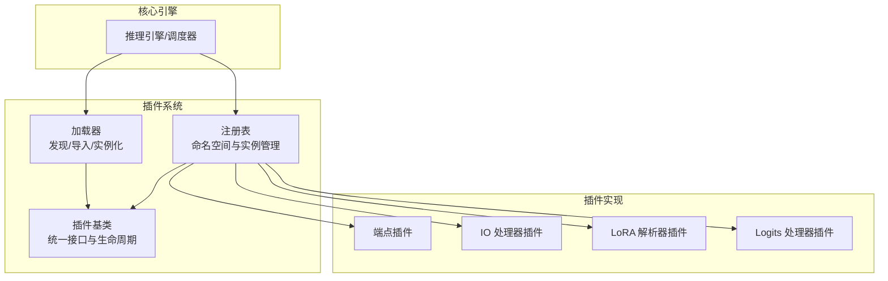
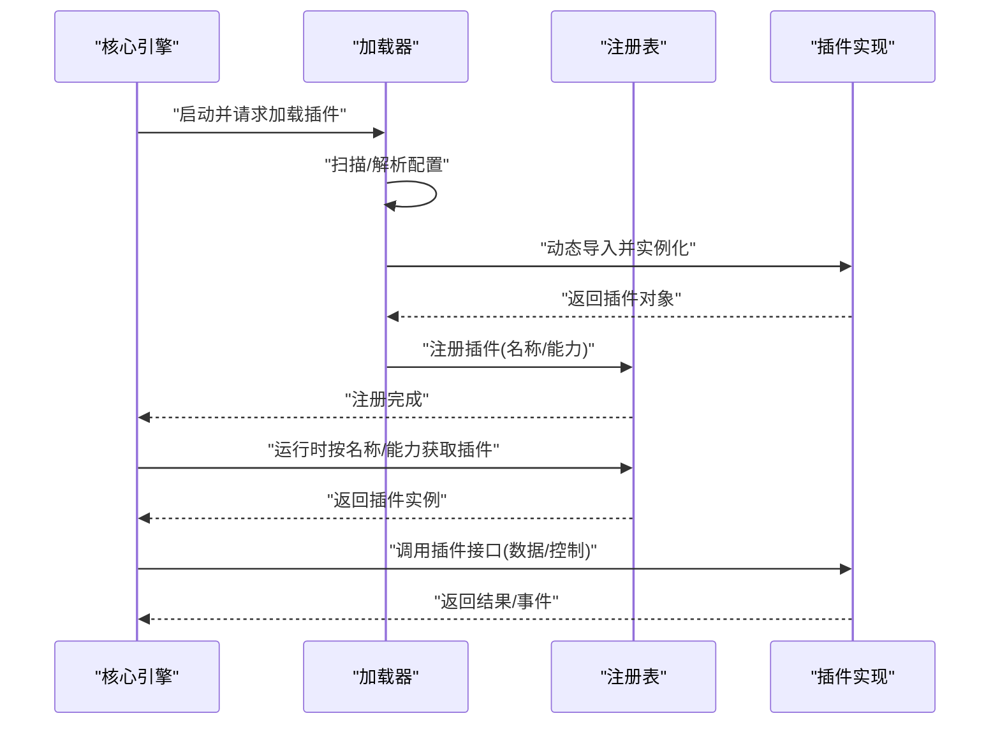
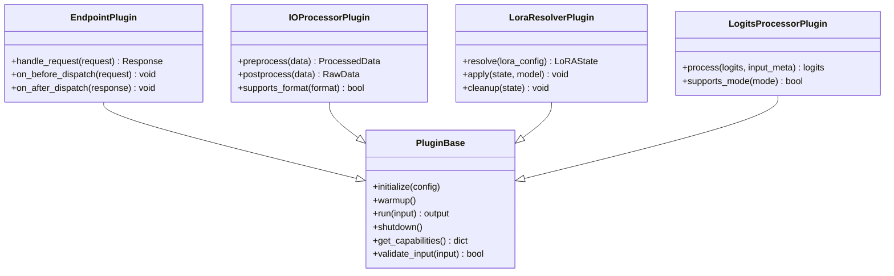
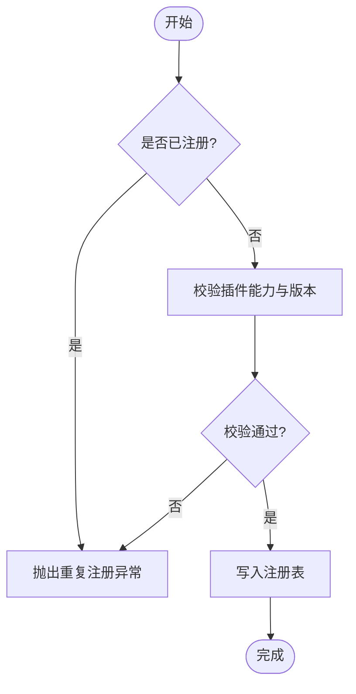
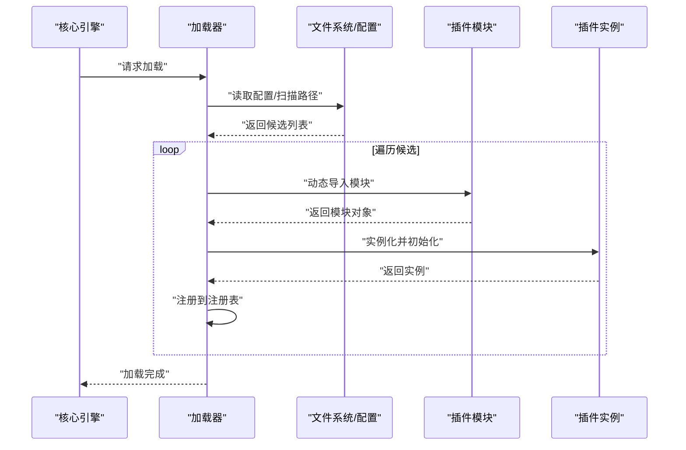
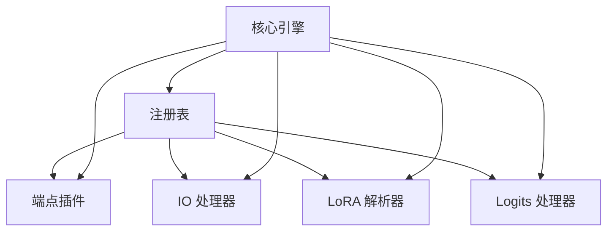
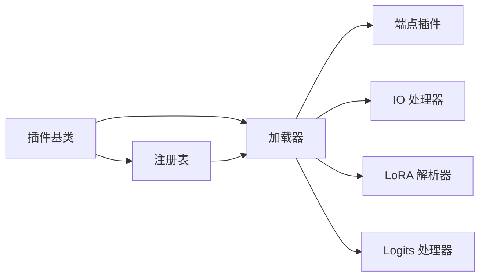

# 插件架构概览

<cite>
**本文引用的文件**   
- [vllm/plugins/__init__.py](file://vllm/plugins/__init__.py)
- [vllm/plugins/base.py](file://vllm/plugins/base.py)
- [vllm/plugins/registry.py](file://vllm/plugins/registry.py)
- [vllm/plugins/loader.py](file://vllm/plugins/loader.py)
- [docs/design/plugin_system.md](file://docs/design/plugin_system.md)
- [docs/design/endpoint_plugins.md](file://docs/design/endpoint_plugins.md)
- [docs/design/io_processor_plugins.md](file://docs/design/io_processor_plugins.md)
- [docs/design/lora_resolver_plugins.md](file://docs/design/lora_resolver_plugins.md)
- [docs/design/logits_processors.md](file://docs/design/logits_processors.md)
- [tests/plugins_tests/test_registry.py](file://tests/plugins_tests/test_registry.py)
- [tests/plugins_tests/test_loader.py](file://tests/plugins_tests/test_loader.py)
</cite>

## 目录
1. [简介](#简介)
2. [项目结构](#项目结构)
3. [核心组件](#核心组件)
4. [架构总览](#架构总览)
5. [详细组件分析](#详细组件分析)
6. [依赖关系分析](#依赖关系分析)
7. [性能考量](#性能考量)
8. [故障排查指南](#故障排查指南)
9. [结论](#结论)
10. [附录](#附录)

## 简介
本文件面向希望理解并扩展 vLLM 插件系统的开发者，系统性阐述插件体系的设计理念、分类与生命周期、注册与加载流程、与核心引擎的交互方式（数据流与控制流），以及扩展点与钩子机制。文档同时给出插件开发的基本概念与术语定义，为后续深入学习具体插件类型（如端点插件、IO 处理器、LoRA 解析器、Logits 处理器等）奠定基础。

## 项目结构
vLLM 的插件系统以“接口抽象 + 统一注册表 + 动态加载”为核心组织方式：
- 接口抽象层：定义插件基类与通用契约，确保不同类别插件具备一致的生命周期与调用约定。
- 注册表：集中管理插件元数据与实例映射，提供按名称或能力查找、校验与获取的能力。
- 加载器：负责从配置或入口发现插件实现，按需导入并实例化，完成初始化与生命周期管理。
- 设计文档：对各类插件的职责边界、扩展点与使用方式进行规范说明。

图表来源
- [vllm/plugins/base.py](file://vllm/plugins/base.py)
- [vllm/plugins/registry.py](file://vllm/plugins/registry.py)
- [vllm/plugins/loader.py](file://vllm/plugins/loader.py)

章节来源
- [vllm/plugins/__init__.py](file://vllm/plugins/__init__.py)
- [docs/design/plugin_system.md](file://docs/design/plugin_system.md)

## 核心组件
- 插件基类（Base）
  - 职责：定义插件的统一接口、生命周期回调（初始化、预热、运行、销毁）、参数校验与错误处理约定。
  - 关键点：所有插件必须继承该基类，遵循其方法签名与语义；通过基类暴露统一的扩展点。
- 注册表（Registry）
  - 职责：维护插件名称到实现的映射，支持按名称检索、重复注册保护、版本与兼容性校验。
  - 关键点：提供线程安全的注册与查询接口；支持插件能力标签与筛选。
- 加载器（Loader）
  - 职责：根据配置或入口扫描插件模块，动态导入并实例化；协调初始化顺序与依赖注入。
  - 关键点：支持懒加载与按需启用；在失败时提供清晰的诊断信息。

章节来源
- [vllm/plugins/base.py](file://vllm/plugins/base.py)
- [vllm/plugins/registry.py](file://vllm/plugins/registry.py)
- [vllm/plugins/loader.py](file://vllm/plugins/loader.py)

## 架构总览
插件系统与核心引擎通过“注册表 + 加载器”解耦：
- 控制流：引擎启动时由加载器发现并加载插件，随后将插件实例注册至注册表；运行时引擎通过注册表按名称或能力获取插件实例进行调用。
- 数据流：插件之间通过标准化的输入/输出结构与事件进行通信；核心引擎负责编排与序列化/反序列化。

图表来源
- [vllm/plugins/loader.py](file://vllm/plugins/loader.py)
- [vllm/plugins/registry.py](file://vllm/plugins/registry.py)
- [vllm/plugins/base.py](file://vllm/plugins/base.py)

## 详细组件分析

### 插件基类与生命周期
- 生命周期阶段
  - 初始化：接收配置参数，建立内部状态与资源。
  - 预热：可选阶段，用于缓存或预计算以提升首次调用性能。
  - 运行：执行核心逻辑，接受标准化输入，返回结构化输出。
  - 销毁：释放资源，清理状态。
- 扩展点
  - 钩子方法：允许子类在关键阶段插入自定义行为（如日志、监控、权限检查）。
  - 能力声明：通过元数据描述插件支持的输入/输出格式与约束。

图表来源
- [vllm/plugins/base.py](file://vllm/plugins/base.py)

章节来源
- [vllm/plugins/base.py](file://vllm/plugins/base.py)

### 注册表与命名空间
- 命名空间隔离：按插件类别划分命名空间，避免名称冲突。
- 注册与发现：支持显式注册与自动发现；提供按能力筛选与版本兼容检查。
- 线程安全：并发访问下的注册与查询一致性。

图表来源
- [vllm/plugins/registry.py](file://vllm/plugins/registry.py)

章节来源
- [vllm/plugins/registry.py](file://vllm/plugins/registry.py)
- [tests/plugins_tests/test_registry.py](file://tests/plugins_tests/test_registry.py)

### 加载器与动态导入
- 发现策略：基于配置文件、环境变量或约定路径扫描插件模块。
- 动态导入：使用安全导入机制，捕获并上报导入错误。
- 实例化与初始化：按依赖顺序创建实例，调用初始化与预热钩子。
- 错误处理：提供详细的失败原因与修复建议。

图表来源
- [vllm/plugins/loader.py](file://vllm/plugins/loader.py)

章节来源
- [vllm/plugins/loader.py](file://vllm/plugins/loader.py)
- [tests/plugins_tests/test_loader.py](file://tests/plugins_tests/test_loader.py)

### 插件分类与职责边界
- 端点插件（Endpoint Plugins）
  - 职责：封装 HTTP/gRPC 等外部接口的请求处理与响应生成。
  - 扩展点：请求预处理、路由分发、响应后处理、鉴权与限流。
- IO 处理器插件（IO Processor Plugins）
  - 职责：数据的预处理与后处理（如文本/图像/音频编解码、格式转换）。
  - 扩展点：格式支持声明、批量优化、内存布局适配。
- LoRA 解析器插件（LoRA Resolver Plugins）
  - 职责：解析 LoRA 配置、应用权重更新、生命周期管理。
  - 扩展点：权重融合策略、热切换、回滚机制。
- Logits 处理器插件（Logits Processors）
  - 职责：对模型输出的 logits 进行后处理（如惩罚、采样策略、约束解码）。
  - 扩展点：模式开关、性能优化、可插拔算法。

章节来源
- [docs/design/endpoint_plugins.md](file://docs/design/endpoint_plugins.md)
- [docs/design/io_processor_plugins.md](file://docs/design/io_processor_plugins.md)
- [docs/design/lora_resolver_plugins.md](file://docs/design/lora_resolver_plugins.md)
- [docs/design/logits_processors.md](file://docs/design/logits_processors.md)

### 与核心引擎的交互
- 控制流
  - 引擎在启动阶段通过加载器加载插件，并将其实例注册至注册表。
  - 运行时，引擎依据请求上下文选择合适插件，调用其标准接口。
- 数据流
  - 插件间通过标准化数据结构传递信息；引擎负责序列化和跨进程/设备传输。
  - 事件与指标通过统一通道上报，便于观测与调试。

图表来源
- [vllm/plugins/registry.py](file://vllm/plugins/registry.py)
- [vllm/plugins/loader.py](file://vllm/plugins/loader.py)

## 依赖关系分析
- 内聚性
  - 基类、注册表与加载器职责清晰，耦合度低，便于独立演进。
- 外部依赖
  - 插件实现可能依赖第三方库（如网络框架、编解码库），需通过加载器进行条件导入与降级处理。
- 循环依赖
  - 通过延迟导入与接口抽象避免循环依赖；注册表仅持有轻量引用。

图表来源
- [vllm/plugins/base.py](file://vllm/plugins/base.py)
- [vllm/plugins/registry.py](file://vllm/plugins/registry.py)
- [vllm/plugins/loader.py](file://vllm/plugins/loader.py)

章节来源
- [vllm/plugins/__init__.py](file://vllm/plugins/__init__.py)
- [docs/design/plugin_system.md](file://docs/design/plugin_system.md)

## 性能考量
- 懒加载与按需启用：减少启动开销与内存占用。
- 批处理与零拷贝：IO 处理器应尽可能采用批处理与共享内存。
- 缓存与预热：对昂贵操作进行缓存，并在预热阶段完成必要准备。
- 异步与并行：在不破坏一致性的前提下提升吞吐。

[本节为通用指导，不直接分析具体文件]

## 故障排查指南
- 常见问题
  - 重复注册：检查插件名称唯一性与命名空间隔离。
  - 导入失败：确认依赖安装与环境变量配置。
  - 能力不匹配：核对插件声明的能力与引擎期望是否一致。
- 定位手段
  - 启用详细日志，查看加载与注册过程。
  - 使用测试套件验证插件接口与生命周期。
  - 逐步禁用插件以隔离问题。

章节来源
- [tests/plugins_tests/test_registry.py](file://tests/plugins_tests/test_registry.py)
- [tests/plugins_tests/test_loader.py](file://tests/plugins_tests/test_loader.py)

## 结论
vLLM 插件系统通过“基类契约 + 统一注册表 + 动态加载”实现了高内聚、低耦合的可扩展架构。各类插件围绕明确的生命周期与扩展点协作，既保证了核心引擎的稳定性，又为生态扩展提供了灵活机制。遵循本文档的分类与流程，开发者可以高效地构建与维护高质量插件。

[本节为总结性内容，不直接分析具体文件]

## 附录
- 术语定义
  - 插件：实现特定功能的可插拔模块，遵循统一接口与生命周期。
  - 注册表：集中管理插件实例与元数据的命名空间。
  - 加载器：负责发现、导入与实例化插件的组件。
  - 扩展点：允许插件在关键阶段插入自定义行为的钩子。
  - 能力声明：插件对外暴露的支持特性与约束。

[本节为概念性内容，不直接分析具体文件]