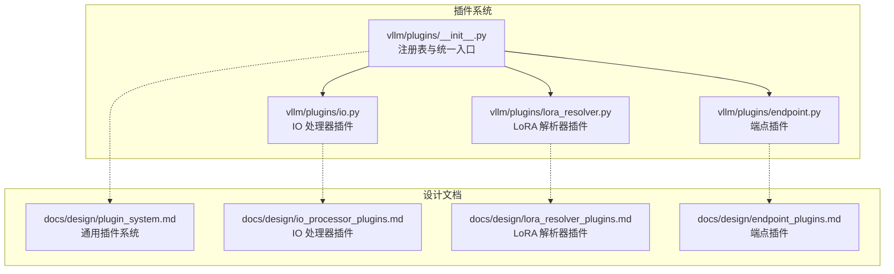
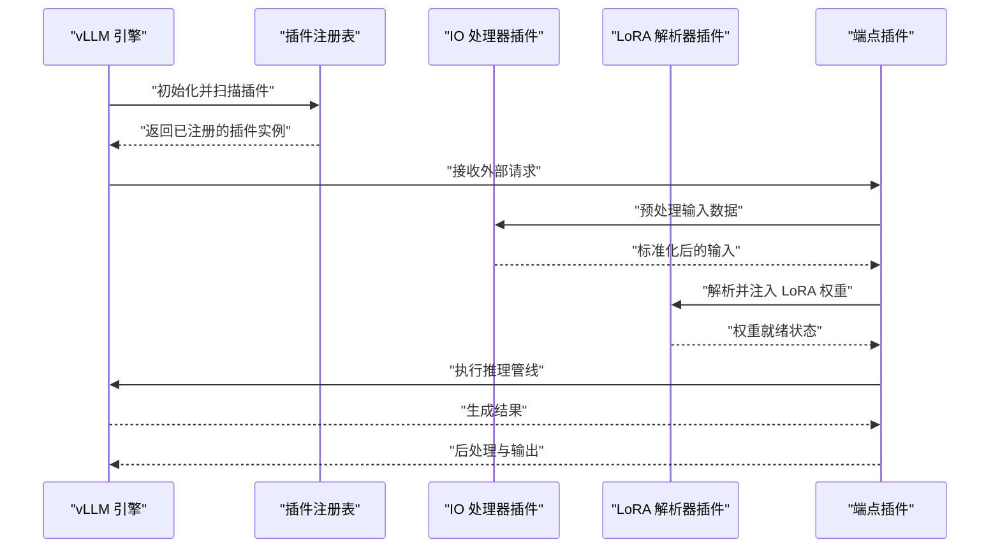
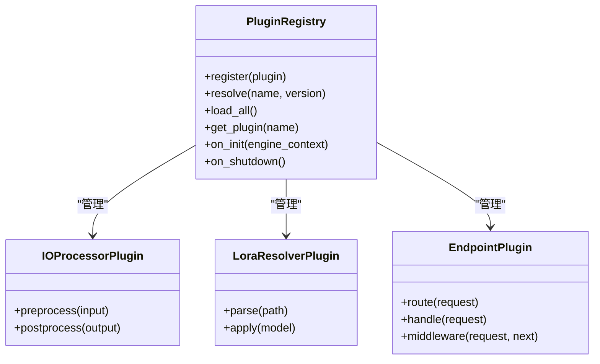
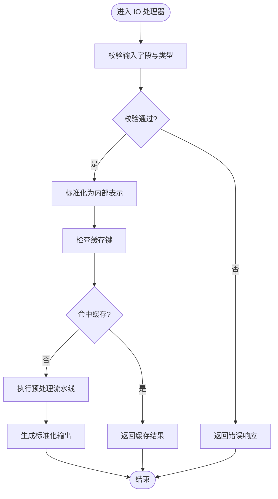
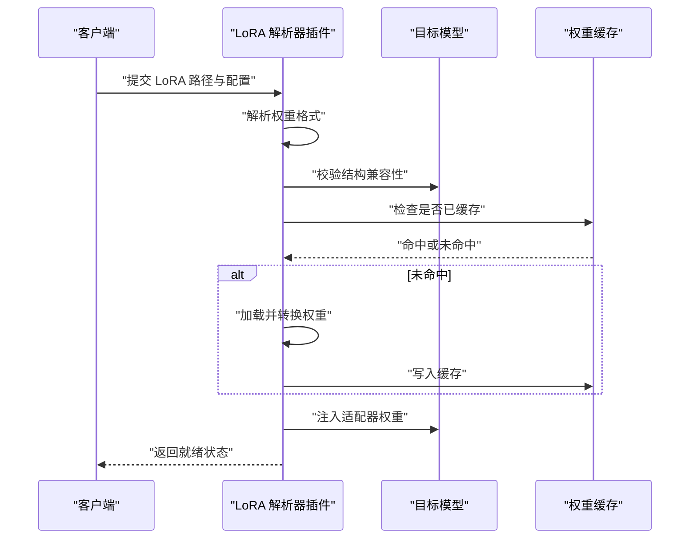
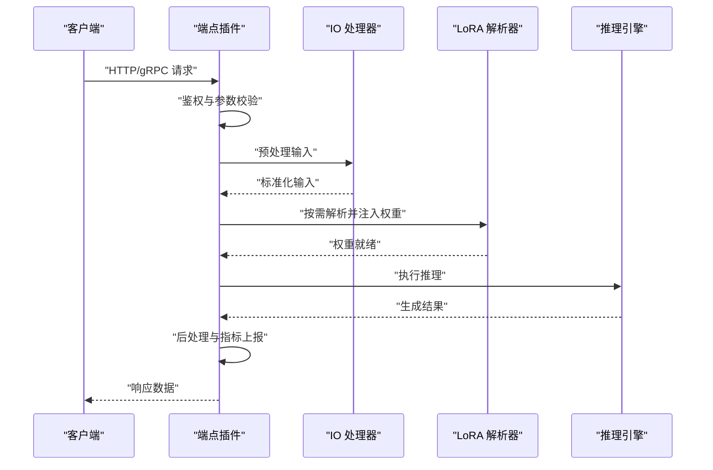
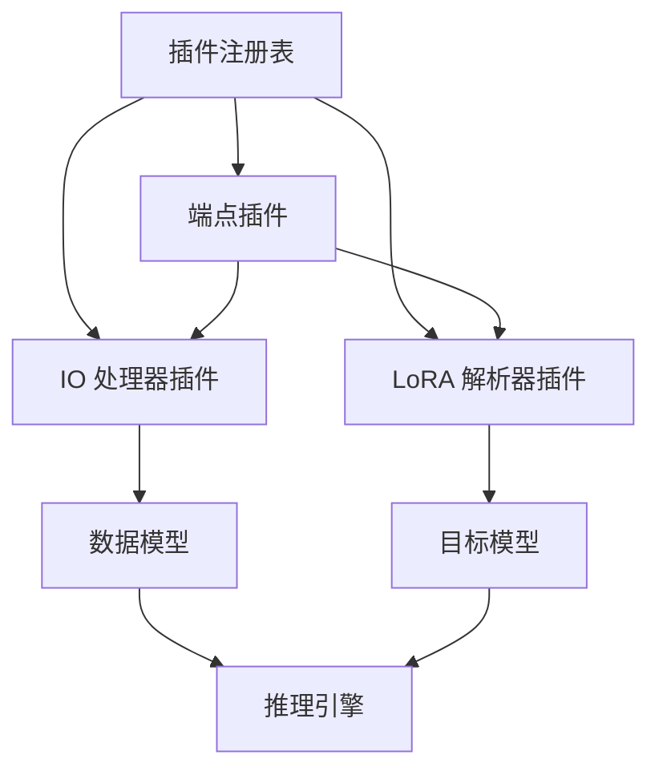

# 插件系统架构

<cite>
**本文引用的文件**   
- [vllm/plugins/__init__.py](file://vllm/plugins/__init__.py)
- [vllm/plugins/io.py](file://vllm/plugins/io.py)
- [vllm/plugins/lora_resolver.py](file://vllm/plugins/lora_resolver.py)
- [vllm/plugins/endpoint.py](file://vllm/plugins/endpoint.py)
- [docs/design/plugin_system.md](file://docs/design/plugin_system.md)
- [docs/design/io_processor_plugins.md](file://docs/design/io_processor_plugins.md)
- [docs/design/lora_resolver_plugins.md](file://docs/design/lora_resolver_plugins.md)
- [docs/design/endpoint_plugins.md](file://docs/design/endpoint_plugins.md)
</cite>

## 目录
1. [简介](#简介)
2. [项目结构](#项目结构)
3. [核心组件](#核心组件)
4. [架构总览](#架构总览)
5. [详细组件分析](#详细组件分析)
6. [依赖关系分析](#依赖关系分析)
7. [性能考量](#性能考量)
8. [故障排查指南](#故障排查指南)
9. [结论](#结论)
10. [附录](#附录)

## 简介
本文件系统性解析 vLLM 插件系统的架构设计与扩展机制，覆盖插件生命周期管理、注册与加载流程，以及 IO 处理器、LoRA 解析器、端点插件等典型插件类型的实现模式。同时给出插件间通信协议与数据传递方式、插件开发框架与 API 规范、自定义插件开发示例与最佳实践，并介绍插件性能监控与调试工具的使用方法。文档面向不同技术背景的读者，力求以循序渐进的方式呈现从概念到代码级细节的完整知识体系。

## 项目结构
vLLM 的插件系统围绕统一的注册与发现机制组织，核心位于 vllm/plugins 包，配套的设计文档位于 docs/design。整体结构如下：
- vllm/plugins：插件基类、注册表与具体插件类型（IO 处理器、LoRA 解析器、端点插件）的实现入口
- docs/design：插件系统设计文档，涵盖通用插件系统、IO 处理器、LoRA 解析器、端点插件等专题

图表来源
- [vllm/plugins/__init__.py](file://vllm/plugins/__init__.py)
- [vllm/plugins/io.py](file://vllm/plugins/io.py)
- [vllm/plugins/lora_resolver.py](file://vllm/plugins/lora_resolver.py)
- [vllm/plugins/endpoint.py](file://vllm/plugins/endpoint.py)
- [docs/design/plugin_system.md](file://docs/design/plugin_system.md)
- [docs/design/io_processor_plugins.md](file://docs/design/io_processor_plugins.md)
- [docs/design/lora_resolver_plugins.md](file://docs/design/lora_resolver_plugins.md)
- [docs/design/endpoint_plugins.md](file://docs/design/endpoint_plugins.md)

章节来源
- [vllm/plugins/__init__.py](file://vllm/plugins/__init__.py)
- [docs/design/plugin_system.md](file://docs/design/plugin_system.md)

## 核心组件
- 插件注册表与统一入口：提供插件的发现、注册、加载与生命周期钩子，确保不同类型插件遵循一致的契约
- IO 处理器插件：负责输入输出的预处理与后处理，如文本/多模态数据的标准化、格式转换、流式输出封装等
- LoRA 解析器插件：负责 LoRA 权重文件的解析、适配与注入，支持多种格式与后端
- 端点插件：扩展服务端的 HTTP/gRPC 端点能力，定义请求/响应模型、鉴权、限流与路由策略

这些组件通过统一的注册表进行装配，在引擎启动时按配置动态加载，并在运行期按需调用。

章节来源
- [vllm/plugins/io.py](file://vllm/plugins/io.py)
- [vllm/plugins/lora_resolver.py](file://vllm/plugins/lora_resolver.py)
- [vllm/plugins/endpoint.py](file://vllm/plugins/endpoint.py)
- [docs/design/io_processor_plugins.md](file://docs/design/io_processor_plugins.md)
- [docs/design/lora_resolver_plugins.md](file://docs/design/lora_resolver_plugins.md)
- [docs/design/endpoint_plugins.md](file://docs/design/endpoint_plugins.md)

## 架构总览
下图展示了插件系统在 vLLM 中的总体位置与交互关系：引擎初始化阶段扫描并加载插件；运行时根据请求上下文选择并执行相应插件；插件之间通过标准数据结构与事件进行通信。

图表来源
- [vllm/plugins/__init__.py](file://vllm/plugins/__init__.py)
- [vllm/plugins/io.py](file://vllm/plugins/io.py)
- [vllm/plugins/lora_resolver.py](file://vllm/plugins/lora_resolver.py)
- [vllm/plugins/endpoint.py](file://vllm/plugins/endpoint.py)

## 详细组件分析

### 插件注册表与统一入口
- 职责：维护插件命名空间、版本兼容性、依赖声明；提供插件的注册、查找与生命周期管理接口
- 关键行为：
  - 启动时扫描指定路径或模块，自动发现插件
  - 校验插件元数据（名称、版本、依赖）
  - 提供延迟加载与热更新能力
  - 暴露统一的查询与调用接口给上层组件

图表来源
- [vllm/plugins/__init__.py](file://vllm/plugins/__init__.py)

章节来源
- [vllm/plugins/__init__.py](file://vllm/plugins/__init__.py)
- [docs/design/plugin_system.md](file://docs/design/plugin_system.md)

### IO 处理器插件
- 职责：对输入数据进行清洗、标准化、分块与缓存；对输出进行格式化、截断、流式封装
- 典型流程：
  - 接收原始请求体
  - 校验字段与类型
  - 转换为内部表示（如 Token 序列或多模态张量）
  - 可选地应用缓存键计算与去重
  - 将结果传递给下游推理管线
  - 对输出进行编码、采样参数应用与流式推送

图表来源
- [vllm/plugins/io.py](file://vllm/plugins/io.py)
- [docs/design/io_processor_plugins.md](file://docs/design/io_processor_plugins.md)

章节来源
- [vllm/plugins/io.py](file://vllm/plugins/io.py)
- [docs/design/io_processor_plugins.md](file://docs/design/io_processor_plugins.md)

### LoRA 解析器插件
- 职责：解析不同格式的 LoRA 权重文件，将其映射到目标模型的适配器层，并安全地注入到推理图
- 关键步骤：
  - 识别权重格式（如 PEFT、HuggingFace、自定义二进制）
  - 构建权重映射表与形状对齐策略
  - 校验与目标模型结构的兼容性
  - 在推理前完成权重注入或懒加载
  - 支持多 LoRA 切换与优先级管理

图表来源
- [vllm/plugins/lora_resolver.py](file://vllm/plugins/lora_resolver.py)
- [docs/design/lora_resolver_plugins.md](file://docs/design/lora_resolver_plugins.md)

章节来源
- [vllm/plugins/lora_resolver.py](file://vllm/plugins/lora_resolver.py)
- [docs/design/lora_resolver_plugins.md](file://docs/design/lora_resolver_plugins.md)

### 端点插件
- 职责：扩展服务端 API 能力，定义路由、中间件、鉴权、限流与监控
- 典型流程：
  - 注册路由与请求模型
  - 执行前置中间件（鉴权、参数校验、日志）
  - 调用业务逻辑（可能触发 IO 处理器与 LoRA 解析器）
  - 执行后置中间件（指标上报、审计）
  - 返回结构化响应

图表来源
- [vllm/plugins/endpoint.py](file://vllm/plugins/endpoint.py)
- [docs/design/endpoint_plugins.md](file://docs/design/endpoint_plugins.md)

章节来源
- [vllm/plugins/endpoint.py](file://vllm/plugins/endpoint.py)
- [docs/design/endpoint_plugins.md](file://docs/design/endpoint_plugins.md)

### 插件间通信协议与数据传递
- 数据模型：所有插件通过统一的输入/输出数据结构进行通信，包含元数据、张量、控制信号与错误码
- 事件总线：插件可订阅/发布事件（如权重加载完成、缓存失效、请求开始/结束），用于解耦与异步协作
- 上下文对象：每个请求携带上下文，包含用户信息、租户标识、追踪 ID、资源配额等，供各插件读取与修改
- 序列化策略：支持 JSON、Protobuf 与二进制张量混合传输，保证跨进程/跨语言兼容

章节来源
- [docs/design/plugin_system.md](file://docs/design/plugin_system.md)

### 插件开发框架与 API 规范
- 基类约定：每种插件类型继承对应基类，实现必要的方法（如 preprocess/postprocess、parse/apply、route/handle）
- 元数据声明：插件需声明名称、版本、依赖、配置项与能力标签，便于注册表管理与动态装配
- 生命周期钩子：提供 on_init、on_request、on_response、on_shutdown 等钩子，用于资源准备与清理
- 错误处理：统一异常类型与错误码，支持重试、降级与熔断策略
- 测试框架：提供模拟上下文、桩对象与断言工具，便于单元测试与集成测试

章节来源
- [docs/design/plugin_system.md](file://docs/design/plugin_system.md)

### 自定义插件开发示例与最佳实践
- 示例：实现一个自定义 IO 处理器，用于处理特定领域的数据格式（如医疗报告、法律文本）
  - 步骤：定义输入/输出模型、实现预处理与后处理逻辑、注册插件、配置路由
  - 最佳实践：使用缓存键优化重复请求、添加指标上报、编写端到端测试用例
- 示例：实现一个 LoRA 解析器，支持新的权重格式
  - 步骤：解析权重文件、构建映射表、注入模型、验证数值一致性
  - 最佳实践：支持懒加载与增量更新、提供回滚机制、记录加载耗时
- 示例：实现一个端点插件，提供新的 API 接口
  - 步骤：定义路由与中间件、集成 IO 处理器与 LoRA 解析器、添加鉴权与限流
  - 最佳实践：使用结构化日志、接入监控系统、编写压力测试

章节来源
- [docs/design/io_processor_plugins.md](file://docs/design/io_processor_plugins.md)
- [docs/design/lora_resolver_plugins.md](file://docs/design/lora_resolver_plugins.md)
- [docs/design/endpoint_plugins.md](file://docs/design/endpoint_plugins.md)

### 插件性能监控与调试工具
- 指标采集：内置 Prometheus 指标，包括请求延迟、吞吐量、错误率、缓存命中率、权重加载时间等
- 分布式追踪：支持 OpenTelemetry，可追踪跨插件的请求链路，定位瓶颈与异常
- 日志系统：结构化日志，支持按插件、请求、租户维度过滤与聚合
- 调试工具：提供交互式控制台、内存快照、GPU 利用率监控、内核调用栈分析
- 性能调优：建议启用批处理、缓存预热、异步 I/O、量化与编译优化

章节来源
- [docs/design/plugin_system.md](file://docs/design/plugin_system.md)

## 依赖关系分析
插件系统通过注册表统一管理依赖，避免循环引用与版本冲突。下图展示了主要组件之间的依赖关系：

图表来源
- [vllm/plugins/__init__.py](file://vllm/plugins/__init__.py)
- [vllm/plugins/io.py](file://vllm/plugins/io.py)
- [vllm/plugins/lora_resolver.py](file://vllm/plugins/lora_resolver.py)
- [vllm/plugins/endpoint.py](file://vllm/plugins/endpoint.py)

章节来源
- [vllm/plugins/__init__.py](file://vllm/plugins/__init__.py)

## 性能考量
- 插件加载：采用延迟加载与并行初始化，减少启动时间
- 数据拷贝：最小化张量复制，使用零拷贝与共享内存
- 缓存策略：多级缓存（CPU/GPU/磁盘），支持 TTL 与LRU 淘汰
- 并发控制：线程池与协程结合，避免阻塞 I/O
- 资源隔离：按租户或请求分配资源，防止资源争用
- 监控告警：实时采集关键指标，设置阈值告警

[本节为通用指导，无需特定文件来源]

## 故障排查指南
- 常见问题：
  - 插件未加载：检查注册表配置与模块路径
  - 权重解析失败：确认文件格式与模型结构兼容性
  - 请求超时：分析 IO 处理器与推理引擎的延迟分布
  - 内存溢出：检查缓存大小与张量生命周期
- 调试步骤：
  - 启用详细日志与分布式追踪
  - 使用性能剖析工具定位热点
  - 逐步禁用插件隔离问题
  - 复现最小化用例并添加断点

章节来源
- [docs/design/plugin_system.md](file://docs/design/plugin_system.md)

## 结论
vLLM 插件系统通过统一的注册与生命周期管理，实现了高度可扩展的架构。IO 处理器、LoRA 解析器与端点插件各司其职，通过标准数据模型与事件总线协同工作。开发者可基于清晰的 API 规范快速构建自定义插件，并通过完善的监控与调试工具保障系统稳定性与性能。未来可进一步探索插件的热更新、沙箱隔离与自动化测试等方向。

[本节为总结性内容，无需特定文件来源]

## 附录
- 术语表：插件、注册表、生命周期、中间件、缓存键、权重注入等
- 参考链接：官方文档、示例代码、社区贡献指南
- 版本兼容性：插件与 vLLM 版本的对应关系与迁移指南

[本节为补充信息，无需特定文件来源]