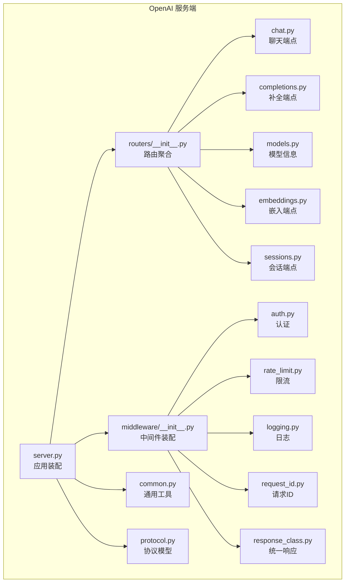
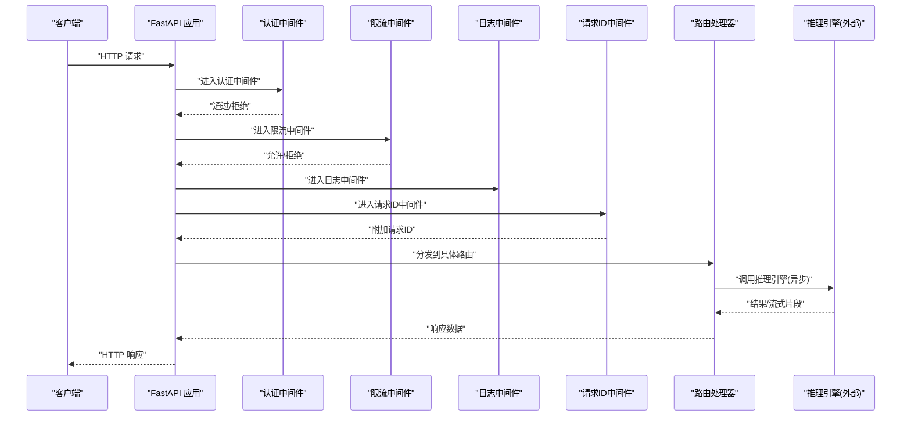
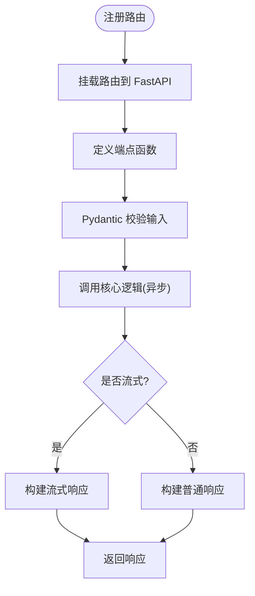
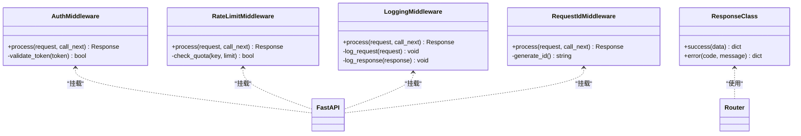
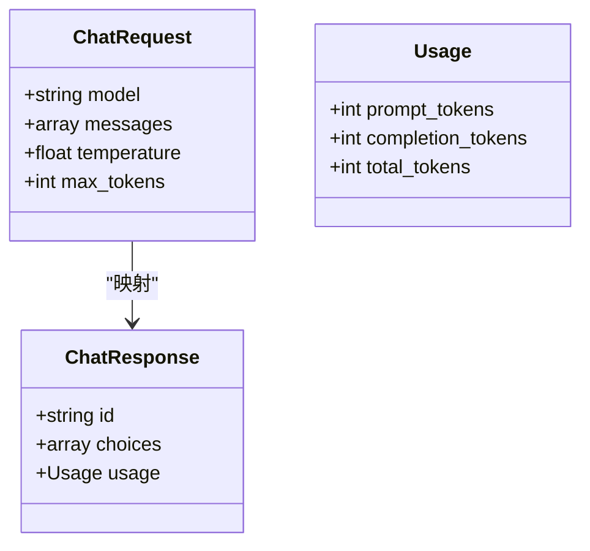
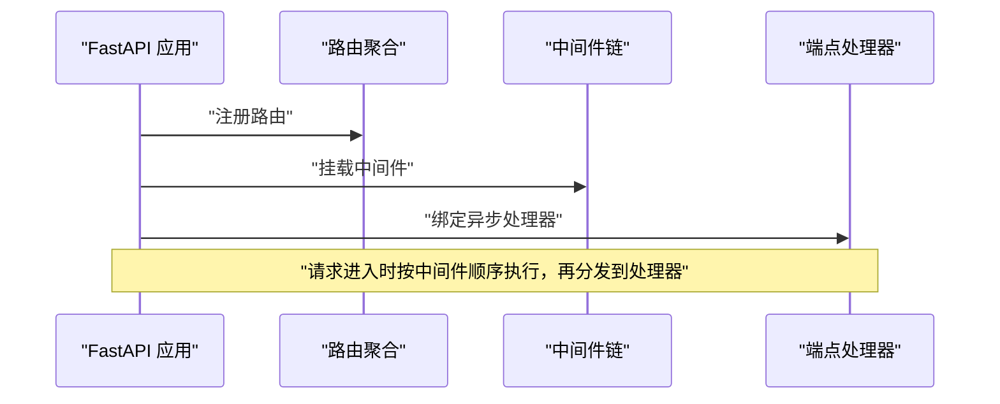
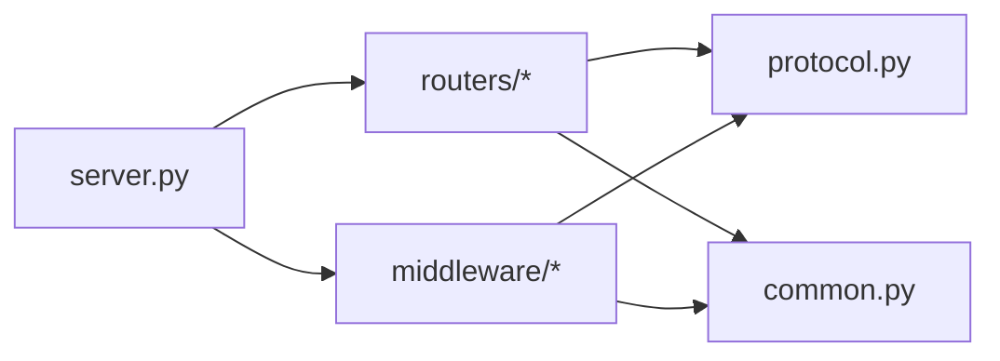

# 端点插件

<cite>
**本文引用的文件**   
- [vllm/entrypoints/openai/server.py](file://vllm/entrypoints/openai/server.py)
- [vllm/entrypoints/openai/api_server.py](file://vllm/entrypoints/openai/api_server.py)
- [vllm/entrypoints/openai/routers/chat.py](file://vllm/entrypoints/openai/routers/chat.py)
- [vllm/entrypoints/openai/routers/completions.py](file://vllm/entrypoints/openai/routers/completions.py)
- [vllm/entrypoints/openai/routers/models.py](file://vllm/entrypoints/openai/routers/models.py)
- [vllm/entrypoints/openai/routers/embeddings.py](file://vllm/entrypoints/openai/routers/embeddings.py)
- [vllm/entrypoints/openai/routers/sessions.py](file://vllm/entrypoints/openai/routers/sessions.py)
- [vllm/entrypoints/openai/routers/__init__.py](file://vllm/entrypoints/openai/routers/__init__.py)
- [vllm/entrypoints/openai/middleware/logging.py](file://vllm/entrypoints/openai/middleware/logging.py)
- [vllm/entrypoints/openai/middleware/auth.py](file://vllm/entrypoints/openai/middleware/auth.py)
- [vllm/entrypoints/openai/middleware/rate_limit.py](file://vllm/entrypoints/openai/middleware/rate_limit.py)
- [vllm/entrypoints/openai/middleware/request_id.py](file://vllm/entrypoints/openai/middleware/request_id.py)
- [vllm/entrypoints/openai/middleware/response_class.py](file://vllm/entrypoints/openai/middleware/response_class.py)
- [vllm/entrypoints/openai/middleware/__init__.py](file://vllm/entrypoints/openai/middleware/__init__.py)
- [vllm/entrypoints/openai/common.py](file://vllm/entrypoints/openai/common.py)
- [vllm/entrypoints/openai/protocol.py](file://vllm/entrypoints/openai/protocol.py)
- [docs/design/endpoint_plugins.md](file://docs/design/endpoint_plugins.md)
</cite>

## 目录
1. [简介](#简介)
2. [项目结构](#项目结构)
3. [核心组件](#核心组件)
4. [架构总览](#架构总览)
5. [详细组件分析](#详细组件分析)
6. [依赖关系分析](#依赖关系分析)
7. [性能考量](#性能考量)
8. [故障排查指南](#故障排查指南)
9. [结论](#结论)
10. [附录](#附录)

## 简介
本文件系统性解析 vLLM 的“端点插件”体系，说明其如何扩展 API 服务功能与自定义 HTTP 端点。内容覆盖：
- 端点插件的作用与定位：在 FastAPI 之上提供可插拔的路由、中间件、协议模型与响应处理机制，便于在不侵入核心引擎的前提下扩展 OpenAI 兼容接口或新增业务端点。
- 开发框架：路由注册、请求处理、响应生成、中间件链（认证、限流、日志、请求ID等）。
- 与 FastAPI 的集成方式与异步处理模式（async/await、流式响应）。
- 安全考虑、错误处理与性能优化建议。
- 完整示例路径指引：如何在现有 OpenAI 服务端基础上添加自定义端点，并集成认证、限流、监控等能力。

## 项目结构
vLLM 的 OpenAI 兼容服务端位于 vllm/entrypoints/openai 目录下，采用“路由 + 中间件 + 协议模型”的分层组织：
- 路由层：按功能划分 chat、completions、models、embeddings、sessions 等模块，每个模块定义一组 HTTP 端点。
- 中间件层：提供认证、限流、日志、请求ID、统一响应类等横切能力。
- 协议层：统一的 Pydantic 模型定义请求/响应结构，保证输入校验与文档生成。
- 启动装配：通过 server.py 组装 FastAPI 应用、注册路由、挂载中间件、配置生命周期钩子。

图表来源
- [vllm/entrypoints/openai/server.py](file://vllm/entrypoints/openai/server.py)
- [vllm/entrypoints/openai/routers/__init__.py](file://vllm/entrypoints/openai/routers/__init__.py)
- [vllm/entrypoints/openai/middleware/__init__.py](file://vllm/entrypoints/openai/middleware/__init__.py)

章节来源
- [docs/design/endpoint_plugins.md](file://docs/design/endpoint_plugins.md)
- [vllm/entrypoints/openai/server.py](file://vllm/entrypoints/openai/server.py)
- [vllm/entrypoints/openai/routers/__init__.py](file://vllm/entrypoints/openai/routers/__init__.py)
- [vllm/entrypoints/openai/middleware/__init__.py](file://vllm/entrypoints/openai/middleware/__init__.py)

## 核心组件
- 应用装配器：负责创建 FastAPI 实例、加载配置、注册路由、挂载中间件、设置异常处理器与生命周期钩子。
- 路由模块：以功能域划分，每个路由文件定义一组端点函数，接收请求体、返回响应体，支持同步与异步实现。
- 中间件：围绕请求-响应周期注入横切逻辑，如鉴权、速率限制、访问日志、请求追踪ID、统一响应包装。
- 协议模型：基于 Pydantic 的请求/响应数据结构，用于参数校验、默认值、序列化与 OpenAPI 文档生成。
- 通用工具：跨模块共享的工具函数、常量、错误码、上下文对象等。

章节来源
- [vllm/entrypoints/openai/server.py](file://vllm/entrypoints/openai/server.py)
- [vllm/entrypoints/openai/routers/chat.py](file://vllm/entrypoints/openai/routers/chat.py)
- [vllm/entrypoints/openai/routers/completions.py](file://vllm/entrypoints/openai/routers/completions.py)
- [vllm/entrypoints/openai/routers/models.py](file://vllm/entrypoints/openai/routers/models.py)
- [vllm/entrypoints/openai/routers/embeddings.py](file://vllm/entrypoints/openai/routers/embeddings.py)
- [vllm/entrypoints/openai/routers/sessions.py](file://vllm/entrypoints/openai/routers/sessions.py)
- [vllm/entrypoints/openai/middleware/auth.py](file://vllm/entrypoints/openai/middleware/auth.py)
- [vllm/entrypoints/openai/middleware/rate_limit.py](file://vllm/entrypoints/openai/middleware/rate_limit.py)
- [vllm/entrypoints/openai/middleware/logging.py](file://vllm/entrypoints/openai/middleware/logging.py)
- [vllm/entrypoints/openai/middleware/request_id.py](file://vllm/entrypoints/openai/middleware/request_id.py)
- [vllm/entrypoints/openai/middleware/response_class.py](file://vllm/entrypoints/openai/middleware/response_class.py)
- [vllm/entrypoints/openai/common.py](file://vllm/entrypoints/openai/common.py)
- [vllm/entrypoints/openai/protocol.py](file://vllm/entrypoints/openai/protocol.py)

## 架构总览
下图展示了从客户端到业务处理的典型调用链，以及中间件在请求-响应周期中的介入位置。

图表来源
- [vllm/entrypoints/openai/server.py](file://vllm/entrypoints/openai/server.py)
- [vllm/entrypoints/openai/middleware/auth.py](file://vllm/entrypoints/openai/middleware/auth.py)
- [vllm/entrypoints/openai/middleware/rate_limit.py](file://vllm/entrypoints/openai/middleware/rate_limit.py)
- [vllm/entrypoints/openai/middleware/logging.py](file://vllm/entrypoints/openai/middleware/logging.py)
- [vllm/entrypoints/openai/middleware/request_id.py](file://vllm/entrypoints/openai/middleware/request_id.py)
- [vllm/entrypoints/openai/routers/chat.py](file://vllm/entrypoints/openai/routers/chat.py)

## 详细组件分析

### 路由注册与端点开发
- 路由聚合：routers/__init__.py 将各功能路由挂载到 FastAPI 应用，形成统一的命名空间与路径前缀。
- 端点函数：每个路由文件定义若干端点，使用 Pydantic 模型进行入参校验，返回标准响应结构；支持 async 函数以实现非阻塞 I/O。
- 流式响应：对于长任务（如聊天补全），可使用流式响应类型，逐步返回增量结果，降低首字节延迟。

图表来源
- [vllm/entrypoints/openai/routers/__init__.py](file://vllm/entrypoints/openai/routers/__init__.py)
- [vllm/entrypoints/openai/routers/chat.py](file://vllm/entrypoints/openai/routers/chat.py)
- [vllm/entrypoints/openai/routers/completions.py](file://vllm/entrypoints/openai/routers/completions.py)
- [vllm/entrypoints/openai/protocol.py](file://vllm/entrypoints/openai/protocol.py)

章节来源
- [vllm/entrypoints/openai/routers/__init__.py](file://vllm/entrypoints/openai/routers/__init__.py)
- [vllm/entrypoints/openai/routers/chat.py](file://vllm/entrypoints/openai/routers/chat.py)
- [vllm/entrypoints/openai/routers/completions.py](file://vllm/entrypoints/openai/routers/completions.py)
- [vllm/entrypoints/openai/protocol.py](file://vllm/entrypoints/openai/protocol.py)

### 中间件机制
- 认证中间件：解析请求头、令牌或签名，验证身份与权限，失败则快速返回 401/403。
- 限流中间件：基于 IP、用户或全局配额进行速率控制，超限返回 429。
- 日志中间件：记录请求方法、路径、状态码、耗时等关键指标，便于审计与排障。
- 请求ID中间件：为每个请求分配唯一 ID，贯穿日志与链路追踪。
- 统一响应类：封装成功/失败响应格式，确保一致的 JSON 结构与字段。

图表来源
- [vllm/entrypoints/openai/middleware/auth.py](file://vllm/entrypoints/openai/middleware/auth.py)
- [vllm/entrypoints/openai/middleware/rate_limit.py](file://vllm/entrypoints/openai/middleware/rate_limit.py)
- [vllm/entrypoints/openai/middleware/logging.py](file://vllm/entrypoints/openai/middleware/logging.py)
- [vllm/entrypoints/openai/middleware/request_id.py](file://vllm/entrypoints/openai/middleware/request_id.py)
- [vllm/entrypoints/openai/middleware/response_class.py](file://vllm/entrypoints/openai/middleware/response_class.py)

章节来源
- [vllm/entrypoints/openai/middleware/auth.py](file://vllm/entrypoints/openai/middleware/auth.py)
- [vllm/entrypoints/openai/middleware/rate_limit.py](file://vllm/entrypoints/openai/middleware/rate_limit.py)
- [vllm/entrypoints/openai/middleware/logging.py](file://vllm/entrypoints/openai/middleware/logging.py)
- [vllm/entrypoints/openai/middleware/request_id.py](file://vllm/entrypoints/openai/middleware/request_id.py)
- [vllm/entrypoints/openai/middleware/response_class.py](file://vllm/entrypoints/openai/middleware/response_class.py)

### 协议模型与响应生成
- 协议模型：使用 Pydantic 定义请求体、查询参数、响应体的字段、类型、默认值与约束，自动生成 OpenAPI 文档。
- 响应生成：根据业务结果构造标准响应结构，区分成功与错误分支，必要时包含额外元数据（如请求ID、耗时）。

图表来源
- [vllm/entrypoints/openai/protocol.py](file://vllm/entrypoints/openai/protocol.py)
- [vllm/entrypoints/openai/routers/chat.py](file://vllm/entrypoints/openai/routers/chat.py)

章节来源
- [vllm/entrypoints/openai/protocol.py](file://vllm/entrypoints/openai/protocol.py)
- [vllm/entrypoints/openai/routers/chat.py](file://vllm/entrypoints/openai/routers/chat.py)

### 与 FastAPI 的集成与异步处理
- 应用装配：在 server.py 中创建 FastAPI 实例，设置 CORS、超时、根路径等基础配置。
- 路由挂载：通过 routers/__init__.py 将各功能路由挂载到应用，支持路径前缀与版本隔离。
- 中间件挂载：在应用初始化阶段依次挂载认证、限流、日志、请求ID等中间件，形成处理链。
- 异步处理：端点函数与中间件均可使用 async/await，避免阻塞事件循环，提升并发吞吐。

图表来源
- [vllm/entrypoints/openai/server.py](file://vllm/entrypoints/openai/server.py)
- [vllm/entrypoints/openai/routers/__init__.py](file://vllm/entrypoints/openai/routers/__init__.py)
- [vllm/entrypoints/openai/middleware/__init__.py](file://vllm/entrypoints/openai/middleware/__init__.py)

章节来源
- [vllm/entrypoints/openai/server.py](file://vllm/entrypoints/openai/server.py)
- [vllm/entrypoints/openai/routers/__init__.py](file://vllm/entrypoints/openai/routers/__init__.py)
- [vllm/entrypoints/openai/middleware/__init__.py](file://vllm/entrypoints/openai/middleware/__init__.py)

### 自定义 API 端点开发示例（含认证、限流、监控）
- 新建路由文件：在 routers/ 下新增模块，定义端点函数与请求/响应模型。
- 注册路由：在 routers/__init__.py 中导入并挂载新路由。
- 集成认证：复用 auth 中间件，或在端点内调用认证工具函数。
- 集成限流：复用 rate_limit 中间件，按用户/IP/接口维度配置配额。
- 集成监控：通过 logging 中间件采集指标，或使用外部监控系统（Prometheus/OpenTelemetry）导出。
- 异步实现：使用 async def 定义端点，内部调用异步 I/O（数据库、缓存、推理引擎）。

章节来源
- [vllm/entrypoints/openai/routers/chat.py](file://vllm/entrypoints/openai/routers/chat.py)
- [vllm/entrypoints/openai/routers/completions.py](file://vllm/entrypoints/openai/routers/completions.py)
- [vllm/entrypoints/openai/middleware/auth.py](file://vllm/entrypoints/openai/middleware/auth.py)
- [vllm/entrypoints/openai/middleware/rate_limit.py](file://vllm/entrypoints/openai/middleware/rate_limit.py)
- [vllm/entrypoints/openai/middleware/logging.py](file://vllm/entrypoints/openai/middleware/logging.py)

## 依赖关系分析
- 低耦合高内聚：路由模块仅依赖协议模型与通用工具，不直接耦合引擎实现，便于替换与测试。
- 中间件解耦：认证、限流、日志等横切逻辑独立实现，通过中间件链组合，不影响业务路由。
- 外部依赖：推理引擎通过异步接口调用，避免阻塞；监控与日志通过标准输出或 SDK 上报。

图表来源
- [vllm/entrypoints/openai/server.py](file://vllm/entrypoints/openai/server.py)
- [vllm/entrypoints/openai/routers/chat.py](file://vllm/entrypoints/openai/routers/chat.py)
- [vllm/entrypoints/openai/protocol.py](file://vllm/entrypoints/openai/protocol.py)
- [vllm/entrypoints/openai/common.py](file://vllm/entrypoints/openai/common.py)
- [vllm/entrypoints/openai/middleware/auth.py](file://vllm/entrypoints/openai/middleware/auth.py)

章节来源
- [vllm/entrypoints/openai/server.py](file://vllm/entrypoints/openai/server.py)
- [vllm/entrypoints/openai/routers/chat.py](file://vllm/entrypoints/openai/routers/chat.py)
- [vllm/entrypoints/openai/protocol.py](file://vllm/entrypoints/openai/protocol.py)
- [vllm/entrypoints/openai/common.py](file://vllm/entrypoints/openai/common.py)
- [vllm/entrypoints/openai/middleware/auth.py](file://vllm/entrypoints/openai/middleware/auth.py)

## 性能考量
- 异步优先：所有 I/O 操作（网络、磁盘、GPU 推理）应使用异步接口，避免阻塞事件循环。
- 流式响应：对长任务启用流式传输，减少首字节延迟与内存占用。
- 中间件开销：精简中间件逻辑，避免在高频路径上进行重型计算或同步 I/O。
- 连接池与缓存：对外部依赖（数据库、缓存、上游服务）使用连接池与本地缓存，降低延迟。
- 资源限制：合理设置超时、最大并发、队列长度，防止雪崩效应。

## 故障排查指南
- 认证失败：检查令牌格式、签名算法、密钥配置；查看认证中间件的错误日志。
- 限流触发：确认配额策略、计数键（IP/用户）、时间窗口；调整阈值或扩容。
- 请求超时：检查下游服务健康状态、队列积压、资源不足；增加超时或降级策略。
- 日志缺失：确认日志中间件已挂载、输出目标可达、采样率配置合理。
- 请求ID丢失：检查请求ID中间件是否在链中、是否被提前返回。

章节来源
- [vllm/entrypoints/openai/middleware/auth.py](file://vllm/entrypoints/openai/middleware/auth.py)
- [vllm/entrypoints/openai/middleware/rate_limit.py](file://vllm/entrypoints/openai/middleware/rate_limit.py)
- [vllm/entrypoints/openai/middleware/logging.py](file://vllm/entrypoints/openai/middleware/logging.py)
- [vllm/entrypoints/openai/middleware/request_id.py](file://vllm/entrypoints/openai/middleware/request_id.py)

## 结论
vLLM 的端点插件系统以 FastAPI 为基础，通过清晰的路由、中间件与协议模型分层，提供了高度可扩展的 API 服务能力。开发者可在不侵入核心引擎的前提下，灵活添加自定义端点，并无缝集成认证、限流、监控等横切能力。遵循异步优先、流式响应、资源限制等最佳实践，可获得高吞吐、低延迟、易维护的服务体验。

## 附录
- 参考设计文档：[docs/design/endpoint_plugins.md](file://docs/design/endpoint_plugins.md)
- 示例路由：[vllm/entrypoints/openai/routers/chat.py](file://vllm/entrypoints/openai/routers/chat.py)
- 示例中间件：[vllm/entrypoints/openai/middleware/auth.py](file://vllm/entrypoints/openai/middleware/auth.py)
- 协议模型：[vllm/entrypoints/openai/protocol.py](file://vllm/entrypoints/openai/protocol.py)