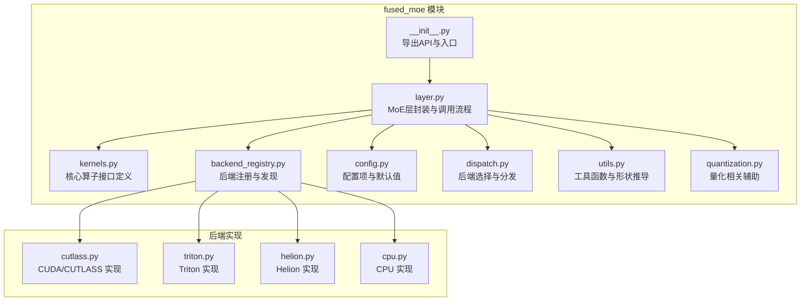
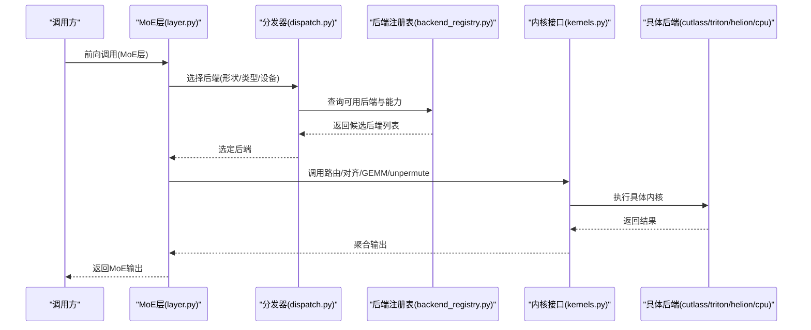
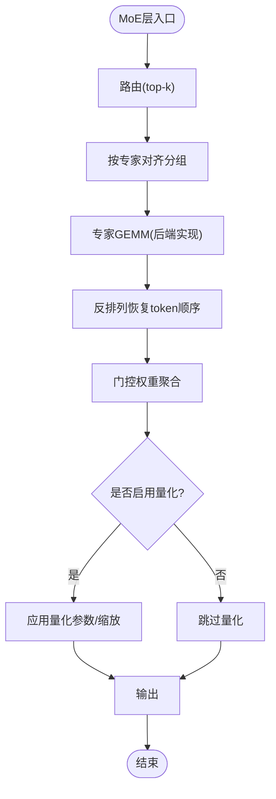
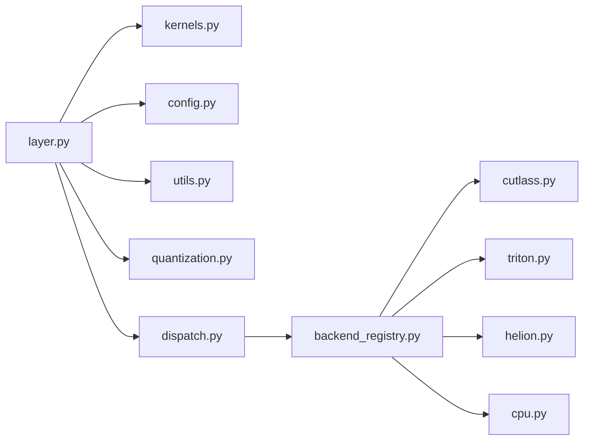

# 融合MoE插件

<cite>
**本文引用的文件**   
- [vllm/model_executor/layers/fused_moe/__init__.py](file://vllm/model_executor/layers/fused_moe/__init__.py)
- [vllm/model_executor/layers/fused_moe/layer.py](file://vllm/model_executor/layers/fused_moe/layer.py)
- [vllm/model_executor/layers/fused_moe/kernels.py](file://vllm/model_executor/layers/fused_moe/kernels.py)
- [vllm/model_executor/layers/fused_moe/backend_registry.py](file://vllm/model_executor/layers/fused_moe/backend_registry.py)
- [vllm/model_executor/layers/fused_moe/config.py](file://vllm/model_executor/layers/fused_moe/config.py)
- [vllm/model_executor/layers/fused_moe/cutlass.py](file://vllm/model_executor/layers/fused_moe/cutlass.py)
- [vllm/model_executor/layers/fused_moe/triton.py](file://vllm/model_executor/layers/fused_moe/triton.py)
- [vllm/model_executor/layers/fused_moe/helion.py](file://vllm/model_executor/layers/fused_moe/helion.py)
- [vllm/model_executor/layers/fused_moe/cpu.py](file://vllm/model_executor/layers/fused_moe/cpu.py)
- [vllm/model_executor/layers/fused_moe/moefy.py](file://vllm/model_executor/layers/fused_moe/moefy.py)
- [vllm/model_executor/layers/fused_moe/utils.py](file://vllm/model_executor/layers/fused_moe/utils.py)
- [vllm/model_executor/layers/fused_moe/dispatch.py](file://vllm/model_executor/layers/fused_moe/dispatch.py)
- [vllm/model_executor/layers/fused_moe/quantization.py](file://vllm/model_executor/layers/fused_moe/quantization.py)
- [benchmarks/kernels/benchmark_moe.py](file://benchmarks/kernels/benchmark_moe.py)
- [tests/kernels/moe/test_fused_moe_layer.py](file://tests/kernels/moe/test_fused_moe_layer.py)
- [docs/design/fused_moe_modular_kernel.md](file://docs/design/fused_moe_modular_kernel.md)
- [docs/design/moe_kernel_features.md](file://docs/design/moe_kernel_features.md)
</cite>

## 目录
1. [简介](#简介)
2. [项目结构](#项目结构)
3. [核心组件](#核心组件)
4. [架构总览](#架构总览)
5. [详细组件分析](#详细组件分析)
6. [依赖分析](#依赖分析)
7. [性能考量](#性能考量)
8. [故障排除指南](#故障排除指南)
9. [结论](#结论)
10. [附录](#附录)

## 简介
本文件系统性介绍 vLLM 的融合 MoE（Mixture of Experts）插件系统。内容涵盖：
- MoE 架构基本原理与在 vLLM 中的实现方式
- 融合 MoE 插件的作用：专家路由、负载均衡与计算优化
- 不同后端（CUDA、Triton、Helion、CPU 等）的实现与选择策略
- 自定义 MoE 后端的开发指南：内核编写、性能调优与测试方法
- MoE 插件的配置选项、监控指标与故障排除方法

## 项目结构
vLLM 的融合 MoE 插件位于模型执行层的 fused_moe 模块，采用“模块化内核 + 后端注册表 + 自动调度”的设计，将路由、对齐、GEMM、反排列等关键步骤解耦为可插拔的后端实现。

图表来源
- [vllm/model_executor/layers/fused_moe/__init__.py](file://vllm/model_executor/layers/fused_moe/__init__.py)
- [vllm/model_executor/layers/fused_moe/layer.py](file://vllm/model_executor/layers/fused_moe/layer.py)
- [vllm/model_executor/layers/fused_moe/kernels.py](file://vllm/model_executor/layers/fused_moe/kernels.py)
- [vllm/model_executor/layers/fused_moe/backend_registry.py](file://vllm/model_executor/layers/fused_moe/backend_registry.py)
- [vllm/model_executor/layers/fused_moe/config.py](file://vllm/model_executor/layers/fused_moe/config.py)
- [vllm/model_executor/layers/fused_moe/dispatch.py](file://vllm/model_executor/layers/fused_moe/dispatch.py)
- [vllm/model_executor/layers/fused_moe/utils.py](file://vllm/model_executor/layers/fused_moe/utils.py)
- [vllm/model_executor/layers/fused_moe/quantization.py](file://vllm/model_executor/layers/fused_moe/quantization.py)
- [vllm/model_executor/layers/fused_moe/cutlass.py](file://vllm/model_executor/layers/fused_moe/cutlass.py)
- [vllm/model_executor/layers/fused_moe/triton.py](file://vllm/model_executor/layers/fused_moe/triton.py)
- [vllm/model_executor/layers/fused_moe/helion.py](file://vllm/model_executor/layers/fused_moe/helion.py)
- [vllm/model_executor/layers/fused_moe/cpu.py](file://vllm/model_executor/layers/fused_moe/cpu.py)

章节来源
- [vllm/model_executor/layers/fused_moe/__init__.py](file://vllm/model_executor/layers/fused_moe/__init__.py)
- [vllm/model_executor/layers/fused_moe/layer.py](file://vllm/model_executor/layers/fused_moe/layer.py)
- [vllm/model_executor/layers/fused_moe/kernels.py](file://vllm/model_executor/layers/fused_moe/kernels.py)
- [vllm/model_executor/layers/fused_moe/backend_registry.py](file://vllm/model_executor/layers/fused_moe/backend_registry.py)
- [vllm/model_executor/layers/fused_moe/config.py](file://vllm/model_executor/layers/fused_moe/config.py)
- [vllm/model_executor/layers/fused_moe/dispatch.py](file://vllm/model_executor/layers/fused_moe/dispatch.py)
- [vllm/model_executor/layers/fused_moe/utils.py](file://vllm/model_executor/layers/fused_moe/utils.py)
- [vllm/model_executor/layers/fused_moe/quantization.py](file://vllm/model_executor/layers/fused_moe/quantization.py)
- [vllm/model_executor/layers/fused_moe/cutlass.py](file://vllm/model_executor/layers/fused_moe/cutlass.py)
- [vllm/model_executor/layers/fused_moe/triton.py](file://vllm/model_executor/layers/fused_moe/triton.py)
- [vllm/model_executor/layers/fused_moe/helion.py](file://vllm/model_executor/layers/fused_moe/helion.py)
- [vllm/model_executor/layers/fused_moe/cpu.py](file://vllm/model_executor/layers/fused_moe/cpu.py)

## 核心组件
- MoE 层封装（layer.py）：负责将输入张量按 token 维度组织，调用路由、对齐、专家 GEMM、反排列与门控聚合等步骤，并处理量化与缓存。
- 内核接口（kernels.py）：定义统一的算子接口（如 top-k 路由、permutation、grouped GEMM、unpermute），供各后端实现。
- 后端注册表（backend_registry.py）：集中管理可用后端，提供能力探测与优先级排序。
- 配置（config.py）：暴露 MoE 相关的配置项（如 top-k、expert 数量、并行度、对齐块大小、量化格式等）。
- 分发器（dispatch.py）：根据运行时环境（设备、数据类型、形状、后端能力）选择最优后端。
- 工具与量化（utils.py, quantization.py）：形状推导、内存布局转换、量化参数管理等。

章节来源
- [vllm/model_executor/layers/fused_moe/layer.py](file://vllm/model_executor/layers/fused_moe/layer.py)
- [vllm/model_executor/layers/fused_moe/kernels.py](file://vllm/model_executor/layers/fused_moe/kernels.py)
- [vllm/model_executor/layers/fused_moe/backend_registry.py](file://vllm/model_executor/layers/fused_moe/backend_registry.py)
- [vllm/model_executor/layers/fused_moe/config.py](file://vllm/model_executor/layers/fused_moe/config.py)
- [vllm/model_executor/layers/fused_moe/dispatch.py](file://vllm/model_executor/layers/fused_moe/dispatch.py)
- [vllm/model_executor/layers/fused_moe/utils.py](file://vllm/model_executor/layers/fused_moe/utils.py)
- [vllm/model_executor/layers/fused_moe/quantization.py](file://vllm/model_executor/layers/fused_moe/quantization.py)

## 架构总览
融合 MoE 插件通过“统一接口 + 多后端实现 + 自动选择”的方式，将 MoE 推理的关键路径抽象为可插拔模块。下图展示了从 MoE 层到具体后端的调用序列。

图表来源
- [vllm/model_executor/layers/fused_moe/layer.py](file://vllm/model_executor/layers/fused_moe/layer.py)
- [vllm/model_executor/layers/fused_moe/dispatch.py](file://vllm/model_executor/layers/fused_moe/dispatch.py)
- [vllm/model_executor/layers/fused_moe/backend_registry.py](file://vllm/model_executor/layers/fused_moe/backend_registry.py)
- [vllm/model_executor/layers/fused_moe/kernels.py](file://vllm/model_executor/layers/fused_moe/kernels.py)
- [vllm/model_executor/layers/fused_moe/cutlass.py](file://vllm/model_executor/layers/fused_moe/cutlass.py)
- [vllm/model_executor/layers/fused_moe/triton.py](file://vllm/model_executor/layers/fused_moe/triton.py)
- [vllm/model_executor/layers/fused_moe/helion.py](file://vllm/model_executor/layers/fused_moe/helion.py)
- [vllm/model_executor/layers/fused_moe/cpu.py](file://vllm/model_executor/layers/fused_moe/cpu.py)

## 详细组件分析

### MoE 层封装（layer.py）
- 职责：将输入张量按 token 维度重组，依次调用路由（top-k）、专家对齐、专家 GEMM、反排列与门控加权求和；支持量化参数注入与缓存复用。
- 关键点：
  - 路由阶段：选择每个 token 的前 k 个专家，生成索引与权重。
  - 对齐阶段：将 token 按专家分组，形成适合 grouped GEMM 的形状。
  - 计算阶段：调用后端实现的专家 GEMM。
  - 反排列与聚合：将专家输出还原至 token 顺序并按门控权重合并。
  - 量化：支持 FP8/INT4 等量化路径的参数传递与精度控制。

图表来源
- [vllm/model_executor/layers/fused_moe/layer.py](file://vllm/model_executor/layers/fused_moe/layer.py)
- [vllm/model_executor/layers/fused_moe/kernels.py](file://vllm/model_executor/layers/fused_moe/kernels.py)
- [vllm/model_executor/layers/fused_moe/quantization.py](file://vllm/model_executor/layers/fused_moe/quantization.py)

章节来源
- [vllm/model_executor/layers/fused_moe/layer.py](file://vllm/model_executor/layers/fused_moe/layer.py)
- [vllm/model_executor/layers/fused_moe/kernels.py](file://vllm/model_executor/layers/fused_moe/kernels.py)
- [vllm/model_executor/layers/fused_moe/quantization.py](file://vllm/model_executor/layers/fused_moe/quantization.py)

### 内核接口（kernels.py）
- 职责：定义统一的算子接口，包括 top-k 路由、permutation、grouped GEMM、unpermute、门控聚合等。
- 设计要点：
  - 接口抽象：屏蔽后端差异，上层仅依赖统一签名。
  - 形状约束：明确输入输出维度与对齐要求，便于后端优化。
  - 错误处理：对非法形状或数据类型进行快速失败。

章节来源
- [vllm/model_executor/layers/fused_moe/kernels.py](file://vllm/model_executor/layers/fused_moe/kernels.py)

### 后端注册表（backend_registry.py）
- 职责：集中注册所有可用的 MoE 后端，提供能力探测（如支持的 dtype、最大 expert 数、并行度）与优先级排序。
- 选择策略：
  - 基于设备类型（CUDA/ROCm/CPU）过滤。
  - 基于数据类型与形状匹配。
  - 基于后端能力评分（吞吐、延迟、内存占用）。
  - 支持用户显式指定后端。

章节来源
- [vllm/model_executor/layers/fused_moe/backend_registry.py](file://vllm/model_executor/layers/fused_moe/backend_registry.py)

### 配置（config.py）
- 主要配置项：
  - top_k：每 token 选择的专家数量。
  - num_experts：专家总数。
  - parallelism：专家并行度（tensor/专家并行）。
  - block_size：对齐块大小，影响 grouped GEMM 效率。
  - quantization：量化格式与参数开关。
  - backend_selection：后端选择策略（auto/manual）。
- 默认值与校验：提供合理默认值并对冲突配置进行校验。

章节来源
- [vllm/model_executor/layers/fused_moe/config.py](file://vllm/model_executor/layers/fused_moe/config.py)

### 分发器（dispatch.py）
- 职责：根据当前运行上下文（设备、dtype、形状、配置）选择最佳后端。
- 决策逻辑：
  - 检查后端可用性（编译状态、驱动版本）。
  - 评估形状与数据类型的兼容性。
  - 结合性能模型或启发式规则选择。
  - 回退机制：当首选后端不可用时，自动降级到次优后端。

章节来源
- [vllm/model_executor/layers/fused_moe/dispatch.py](file://vllm/model_executor/layers/fused_moe/dispatch.py)

### 工具与量化（utils.py, quantization.py）
- utils.py：提供形状推导、内存布局转换、哈希与缓存键生成等工具。
- quantization.py：管理量化参数（缩放因子、零点）、精度切换与混合精度路径。

章节来源
- [vllm/model_executor/layers/fused_moe/utils.py](file://vllm/model_executor/layers/fused_moe/utils.py)
- [vllm/model_executor/layers/fused_moe/quantization.py](file://vllm/model_executor/layers/fused_moe/quantization.py)

### 后端实现

#### CUDA/CUTLASS 后端（cutlass.py）
- 特点：利用 CUTLASS 的高效 GEMM 实现，支持多种数据类型（FP16/BF16/FP8）。
- 适用场景：NVIDIA GPU，高吞吐推理。
- 限制：需要兼容的 CUDA 与 CUTLASS 版本。

章节来源
- [vllm/model_executor/layers/fused_moe/cutlass.py](file://vllm/model_executor/layers/fused_moe/cutlass.py)

#### Triton 后端（triton.py）
- 特点：使用 Triton 编译器生成高性能内核，灵活性强。
- 适用场景：跨厂商 GPU（需 Triton 支持），实验性优化。
- 限制：编译开销较大，首次调用可能较慢。

章节来源
- [vllm/model_executor/layers/fused_moe/triton.py](file://vllm/model_executor/layers/fused_moe/triton.py)

#### Helion 后端（helion.py）
- 特点：基于 Helion 编译器优化，针对特定硬件生成高效代码。
- 适用场景：追求极致性能的部署环境。
- 限制：依赖 Helion 运行时与特定硬件支持。

章节来源
- [vllm/model_executor/layers/fused_moe/helion.py](file://vllm/model_executor/layers/fused_moe/helion.py)

#### CPU 后端（cpu.py）
- 特点：纯 CPU 实现，用于调试与无 GPU 环境。
- 适用场景：开发、测试、小规模推理。
- 限制：性能远低于 GPU 后端。

章节来源
- [vllm/model_executor/layers/fused_moe/cpu.py](file://vllm/model_executor/layers/fused_moe/cpu.py)

### MoE 化改造（moefy.py）
- 职责：将传统 Dense 层自动转换为 MoE 层，注入路由与专家权重。
- 用法：装饰器或工厂函数，支持批量替换模型中的 FFN 层。

章节来源
- [vllm/model_executor/layers/fused_moe/moefy.py](file://vllm/model_executor/layers/fused_moe/moefy.py)

## 依赖分析
融合 MoE 插件的依赖关系如下：

图表来源
- [vllm/model_executor/layers/fused_moe/layer.py](file://vllm/model_executor/layers/fused_moe/layer.py)
- [vllm/model_executor/layers/fused_moe/kernels.py](file://vllm/model_executor/layers/fused_moe/kernels.py)
- [vllm/model_executor/layers/fused_moe/config.py](file://vllm/model_executor/layers/fused_moe/config.py)
- [vllm/model_executor/layers/fused_moe/utils.py](file://vllm/model_executor/layers/fused_moe/utils.py)
- [vllm/model_executor/layers/fused_moe/quantization.py](file://vllm/model_executor/layers/fused_moe/quantization.py)
- [vllm/model_executor/layers/fused_moe/dispatch.py](file://vllm/model_executor/layers/fused_moe/dispatch.py)
- [vllm/model_executor/layers/fused_moe/backend_registry.py](file://vllm/model_executor/layers/fused_moe/backend_registry.py)
- [vllm/model_executor/layers/fused_moe/cutlass.py](file://vllm/model_executor/layers/fused_moe/cutlass.py)
- [vllm/model_executor/layers/fused_moe/triton.py](file://vllm/model_executor/layers/fused_moe/triton.py)
- [vllm/model_executor/layers/fused_moe/helion.py](file://vllm/model_executor/layers/fused_moe/helion.py)
- [vllm/model_executor/layers/fused_moe/cpu.py](file://vllm/model_executor/layers/fused_moe/cpu.py)

章节来源
- [vllm/model_executor/layers/fused_moe/layer.py](file://vllm/model_executor/layers/fused_moe/layer.py)
- [vllm/model_executor/layers/fused_moe/backend_registry.py](file://vllm/model_executor/layers/fused_moe/backend_registry.py)
- [vllm/model_executor/layers/fused_moe/dispatch.py](file://vllm/model_executor/layers/fused_moe/dispatch.py)

## 性能考量
- 路由与对齐：减少不必要的拷贝与转置，使用原地操作降低内存峰值。
- Grouped GEMM：按专家分组调用 GEMM，提高计算密度与缓存命中率。
- 量化路径：FP8/INT4 量化可降低带宽压力，但需注意精度损失与校准。
- 后端选择：优先选择 CUTLASS（NVIDIA GPU），其次 Triton/Helion，最后 CPU。
- 批处理与并发：调整 batch size 与并行度以平衡吞吐与延迟。
- 监控指标：关注路由分布（专家负载）、GEMM 利用率、内存带宽、延迟分位数。

[本节为通用指导，不直接分析具体文件]

## 故障排除指南
- 后端不可用：检查设备类型、驱动版本、依赖库是否安装正确。
- 形状不匹配：确认输入张量维度与对齐块大小是否符合要求。
- 精度异常：检查量化参数是否正确加载，必要时关闭量化验证。
- 性能退化：尝试切换后端或调整 top_k、block_size 等参数。
- 内存不足：减小 batch size 或 expert 数量，启用内存优化选项。

章节来源
- [vllm/model_executor/layers/fused_moe/backend_registry.py](file://vllm/model_executor/layers/fused_moe/backend_registry.py)
- [vllm/model_executor/layers/fused_moe/dispatch.py](file://vllm/model_executor/layers/fused_moe/dispatch.py)
- [vllm/model_executor/layers/fused_moe/config.py](file://vllm/model_executor/layers/fused_moe/config.py)

## 结论
vLLM 的融合 MoE 插件通过模块化设计与多后端支持，实现了高效、可扩展的 MoE 推理框架。开发者可根据硬件与需求选择合适的后端，并通过配置与调优获得最佳性能。未来可进一步扩展更多后端与优化策略，提升 MoE 模型的实用性与竞争力。

[本节为总结性内容，不直接分析具体文件]

## 附录

### 自定义 MoE 后端开发指南
- 步骤概览：
  1. 实现内核接口：遵循 kernels.py 定义的签名。
  2. 注册后端：在 backend_registry.py 中注册新后端。
  3. 能力探测：声明支持的 dtype、形状范围与并行模式。
  4. 性能基准：使用 benchmarks/kernels/benchmark_moe.py 进行基准测试。
  5. 单元测试：参考 tests/kernels/moe/test_fused_moe_layer.py 编写用例。
- 调优建议：
  - 使用编译器优化（如 Triton/Helion）生成高效内核。
  - 避免不必要的内存分配与拷贝。
  - 针对目标硬件调整线程块大小与共享内存使用。
- 测试方法：
  - 正确性测试：与参考实现对比输出。
  - 性能测试：测量延迟、吞吐与内存占用。
  - 回归测试：确保更新不影响现有功能。

章节来源
- [vllm/model_executor/layers/fused_moe/kernels.py](file://vllm/model_executor/layers/fused_moe/kernels.py)
- [vllm/model_executor/layers/fused_moe/backend_registry.py](file://vllm/model_executor/layers/fused_moe/backend_registry.py)
- [benchmarks/kernels/benchmark_moe.py](file://benchmarks/kernels/benchmark_moe.py)
- [tests/kernels/moe/test_fused_moe_layer.py](file://tests/kernels/moe/test_fused_moe_layer.py)

### MoE 插件配置选项
- 常见配置项：
  - top_k：每 token 选择的专家数量。
  - num_experts：专家总数。
  - block_size：对齐块大小。
  - quantization：量化格式开关。
  - backend_selection：后端选择策略（auto/manual）。
- 配置位置：config.py 中定义默认值与校验逻辑。

章节来源
- [vllm/model_executor/layers/fused_moe/config.py](file://vllm/model_executor/layers/fused_moe/config.py)

### 监控指标与诊断
- 关键指标：
  - 路由分布：各专家被选中的频率。
  - GEMM 利用率：GPU 计算单元占用率。
  - 内存带宽：读写带宽使用情况。
  - 延迟分位数：P50/P95/P99 延迟。
- 诊断工具：
  - 内置日志：记录路由与后端选择信息。
  - 性能剖析：使用 PyTorch Profiler 或 Nsight Systems。
  - 可视化：绘制路由热力图与性能曲线。

章节来源
- [vllm/model_executor/layers/fused_moe/layer.py](file://vllm/model_executor/layers/fused_moe/layer.py)
- [vllm/model_executor/layers/fused_moe/dispatch.py](file://vllm/model_executor/layers/fused_moe/dispatch.py)

### 设计文档参考
- 融合 MoE 模块化内核设计：fused_moe_modular_kernel.md
- MoE 内核特性说明：moe_kernel_features.md

章节来源
- [docs/design/fused_moe_modular_kernel.md](file://docs/design/fused_moe_modular_kernel.md)
- [docs/design/moe_kernel_features.md](file://docs/design/moe_kernel_features.md)