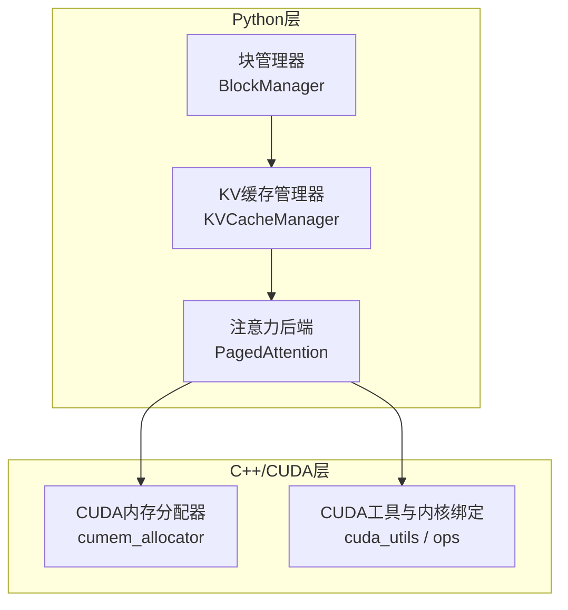
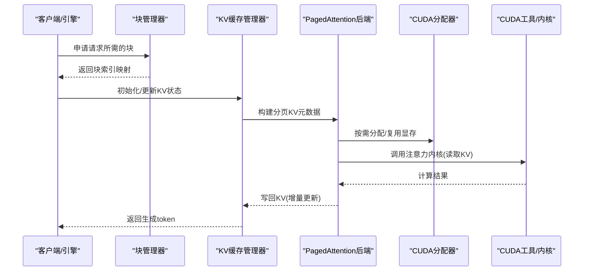
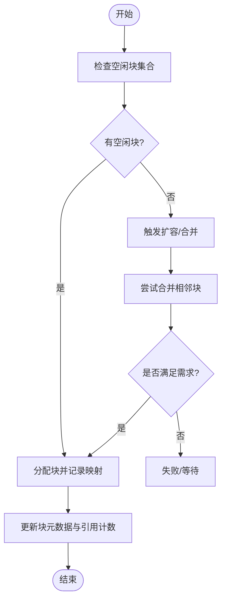
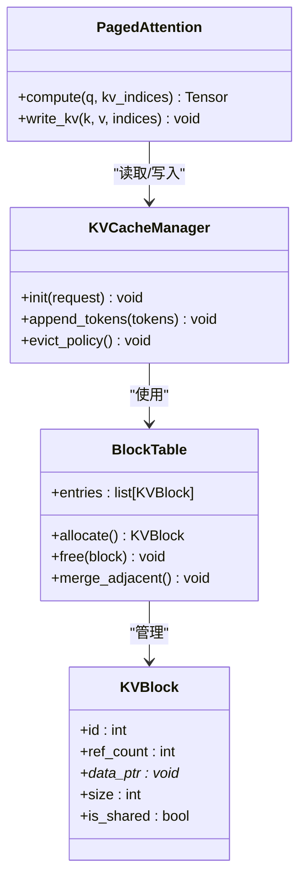
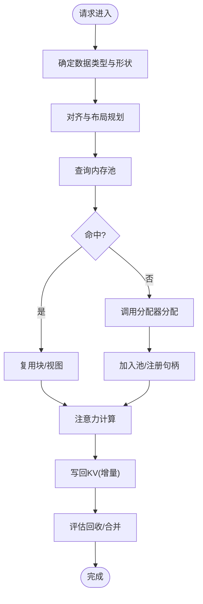
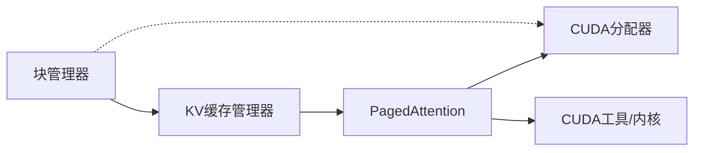

# 内存管理数据流

<cite>
**本文引用的文件**   
- [vllm/core/cache.py](file://vllm/core/cache.py)
- [vllm/core/block_manager.py](file://vllm/core/block_manager.py)
- [vllm/core/kv_cache_manager.py](file://vllm/core/kv_cache_manager.py)
- [vllm/attention/backends/paged_attention.py](file://vllm/attention/backends/paged_attention.py)
- [csrc/cuda_utils.h](file://csrc/cuda_utils.h)
- [csrc/cumem_allocator.cpp](file://csrc/cumem_allocator.cpp)
- [benchmarks/benchmark_block_pool.py](file://benchmarks/benchmark_block_pool.py)
- [tests/basic_correctness/test_mem.py](file://tests/basic_correctness/test_mem.py)
- [docs/design/paged_attention.md](file://docs/design/paged_attention.md)
- [docs/configuration/conserving_memory.md](file://docs/configuration/conserving_memory.md)
</cite>

## 目录
1. [简介](#简介)
2. [项目结构](#项目结构)
3. [核心组件](#核心组件)
4. [架构总览](#架构总览)
5. [详细组件分析](#详细组件分析)
6. [依赖关系分析](#依赖关系分析)
7. [性能考量](#性能考量)
8. [故障排查指南](#故障排查指南)
9. [结论](#结论)
10. [附录](#附录)

## 简介
本文件聚焦 vLLM 的内存管理机制与数据流转，围绕 KV 缓存分配策略、PagedAttention 工作原理、显存优化技术、内存池管理（块分配、合并与回收）、数据类型布局与转换、监控与调试工具、内存泄漏检测与性能调优最佳实践展开。内容基于仓库中的核心实现与文档，力求为不同技术背景的读者提供循序渐进的理解路径。

## 项目结构
vLLM 将 KV 缓存与注意力计算解耦：上层通过块管理器与缓存管理器协调请求级 KV 生命周期，底层由 CUDA/C++ 扩展负责显式显存分配与内核执行。关键目录与职责如下：
- vllm/core：KV 缓存抽象、块管理与调度策略
- vllm/attention/backends：注意力后端实现（含 PagedAttention）
- csrc：CUDA/C++ 扩展（显存分配器、内核绑定）
- benchmarks：基准测试（含块池、前缀缓存等）
- tests：正确性与回归测试（含内存相关用例）
- docs/design：设计文档（含 PagedAttention 详解）

图表来源
- [vllm/core/block_manager.py:1-200](file://vllm/core/block_manager.py#L1-L200)
- [vllm/core/kv_cache_manager.py:1-200](file://vllm/core/kv_cache_manager.py#L1-L200)
- [vllm/attention/backends/paged_attention.py:1-200](file://vllm/attention/backends/paged_attention.py#L1-L200)
- [csrc/cumem_allocator.cpp:1-200](file://csrc/cumem_allocator.cpp#L1-L200)
- [csrc/cuda_utils.h:1-200](file://csrc/cuda_utils.h#L1-L200)

章节来源
- [docs/design/paged_attention.md:1-200](file://docs/design/paged_attention.md#L1-L200)
- [vllm/core/block_manager.py:1-200](file://vllm/core/block_manager.py#L1-L200)
- [vllm/core/kv_cache_manager.py:1-200](file://vllm/core/kv_cache_manager.py#L1-L200)

## 核心组件
- 块管理器（BlockManager）：维护物理块到逻辑块的映射，处理块的分配、合并与回收，支持前缀缓存与共享。
- KV 缓存管理器（KVCacheManager）：面向请求的 KV 生命周期管理，协调预填充与解码阶段的 KV 读写与更新。
- PagedAttention 后端：以分页方式访问 KV 缓存，避免连续大张量拷贝，提升吞吐并降低碎片。
- CUDA 内存分配器（cumem_allocator）：封装 PyTorch 或自定义分配器，控制显存增长策略与释放时机。
- CUDA 工具与内核绑定（cuda_utils / ops）：提供类型转换、视图操作、核函数调用入口。

章节来源
- [vllm/core/block_manager.py:1-200](file://vllm/core/block_manager.py#L1-L200)
- [vllm/core/kv_cache_manager.py:1-200](file://vllm/core/kv_cache_manager.py#L1-L200)
- [vllm/attention/backends/paged_attention.py:1-200](file://vllm/attention/backends/paged_attention.py#L1-L200)
- [csrc/cumem_allocator.cpp:1-200](file://csrc/cumem_allocator.cpp#L1-L200)
- [csrc/cuda_utils.h:1-200](file://csrc/cuda_utils.h#L1-L200)

## 架构总览
下图展示从请求进入、KV 缓存分配到注意力计算的端到端数据流。

图表来源
- [vllm/core/block_manager.py:1-200](file://vllm/core/block_manager.py#L1-L200)
- [vllm/core/kv_cache_manager.py:1-200](file://vllm/core/kv_cache_manager.py#L1-L200)
- [vllm/attention/backends/paged_attention.py:1-200](file://vllm/attention/backends/paged_attention.py#L1-L200)
- [csrc/cumem_allocator.cpp:1-200](file://csrc/cumem_allocator.cpp#L1-L200)
- [csrc/cuda_utils.h:1-200](file://csrc/cuda_utils.h#L1-L200)

## 详细组件分析

### KV 缓存分配策略与块管理
- 块粒度与对齐：按固定大小的块组织 KV 张量，减少碎片并便于跨请求共享。
- 分配策略：优先复用空闲块；当空闲不足时触发扩容；支持前缀缓存命中后直接复用已有块。
- 合并与回收：在请求结束或上下文切换时，对连续块进行合并标记，延迟回收以降低频繁分配开销。
- 并发安全：使用锁或原子操作保护块表与引用计数，确保多请求并发下的正确性。

图表来源
- [vllm/core/block_manager.py:1-200](file://vllm/core/block_manager.py#L1-L200)
- [vllm/core/kv_cache_manager.py:1-200](file://vllm/core/kv_cache_manager.py#L1-L200)

章节来源
- [vllm/core/block_manager.py:1-200](file://vllm/core/block_manager.py#L1-L200)
- [vllm/core/kv_cache_manager.py:1-200](file://vllm/core/kv_cache_manager.py#L1-L200)

### PagedAttention 工作原理
- 分页访问：将 KV 存储为离散块，注意力内核根据页表索引随机访问，避免大块连续拷贝。
- 预填充与解码：预填充阶段批量写入 KV 块；解码阶段逐 token 增量更新，利用分页提高访存效率。
- 前缀缓存：相同前缀的请求可共享 KV 块，显著降低重复计算与显存占用。
- 内核优化：融合归约与访存，减少中间张量与同步开销。

图表来源
- [vllm/core/block_manager.py:1-200](file://vllm/core/block_manager.py#L1-L200)
- [vllm/core/kv_cache_manager.py:1-200](file://vllm/core/kv_cache_manager.py#L1-L200)
- [vllm/attention/backends/paged_attention.py:1-200](file://vllm/attention/backends/paged_attention.py#L1-L200)

章节来源
- [docs/design/paged_attention.md:1-200](file://docs/design/paged_attention.md#L1-L200)
- [vllm/attention/backends/paged_attention.py:1-200](file://vllm/attention/backends/paged_attention.py#L1-L200)

### 显存优化技术与内存池管理
- 显存增长策略：按需分配与阈值触发，避免一次性预留过多显存。
- 池化与复用：块级池化减少分配/释放频率；跨请求共享块降低重复占用。
- 类型与布局：统一数据类型（如 BF16/FP8），按头维度对齐，减少 padding 与碎片。
- 异步与融合：内核融合减少中间缓冲；异步拷贝隐藏延迟。

图表来源
- [csrc/cumem_allocator.cpp:1-200](file://csrc/cumem_allocator.cpp#L1-L200)
- [csrc/cuda_utils.h:1-200](file://csrc/cuda_utils.h#L1-L200)
- [vllm/core/block_manager.py:1-200](file://vllm/core/block_manager.py#L1-L200)

章节来源
- [csrc/cumem_allocator.cpp:1-200](file://csrc/cumem_allocator.cpp#L1-L200)
- [csrc/cuda_utils.h:1-200](file://csrc/cuda_utils.h#L1-L200)
- [vllm/core/block_manager.py:1-200](file://vllm/core/block_manager.py#L1-L200)

### 数据类型布局与转换
- 布局约定：KV 按 [层, 头, 块, 元素] 顺序组织，头维度对齐以提升访存效率。
- 类型选择：BF16/FP8 用于平衡精度与带宽；量化方案在必要时启用。
- 转换路径：输入 token → 嵌入 → 位置编码 → Q/K/V 投影 → KV 写入 → 注意力计算 → 输出投影。
- 视图与拷贝：尽量使用视图与原地操作，减少额外分配与拷贝。

章节来源
- [vllm/core/kv_cache_manager.py:1-200](file://vllm/core/kv_cache_manager.py#L1-L200)
- [vllm/attention/backends/paged_attention.py:1-200](file://vllm/attention/backends/paged_attention.py#L1-L200)
- [csrc/cuda_utils.h:1-200](file://csrc/cuda_utils.h#L1-L200)

### 内存监控与调试工具
- 指标采集：暴露显存使用峰值、块命中率、分配/回收次数等指标。
- 日志与追踪：关键路径打点（分配、合并、回收、内核启动）。
- 基准与压测：块池基准、前缀缓存命中率、长上下文吞吐。
- 诊断用例：内存泄漏与越界访问的单元测试覆盖。

章节来源
- [benchmarks/benchmark_block_pool.py:1-200](file://benchmarks/benchmark_block_pool.py#L1-L200)
- [tests/basic_correctness/test_mem.py:1-200](file://tests/basic_correctness/test_mem.py#L1-L200)

### 内存泄漏检测与性能调优最佳实践
- 泄漏检测：定期校验块引用计数与未释放句柄；结合 Python 与 CUDA 工具定位。
- 参数调优：调整块大小、最大序列长度、前缀缓存阈值、显存增长阈值。
- 负载适配：根据批大小与序列分布动态调整策略；长尾请求隔离。
- 内核优化：关注访存模式与寄存器压力，避免不必要的中间张量。

章节来源
- [docs/configuration/conserving_memory.md:1-200](file://docs/configuration/conserving_memory.md#L1-L200)
- [benchmarks/benchmark_block_pool.py:1-200](file://benchmarks/benchmark_block_pool.py#L1-L200)
- [tests/basic_correctness/test_mem.py:1-200](file://tests/basic_correctness/test_mem.py#L1-L200)

## 依赖关系分析
- 模块耦合：块管理器与 KV 缓存管理器强耦合；注意力后端依赖两者提供的元数据。
- 外部依赖：CUDA 分配器与内核库；PyTorch 张量视图与类型系统。
- 潜在循环：应避免在 Python 层形成循环引用；C++ 侧通过 RAII 管理资源。
- 接口契约：KV 索引与块表格式需严格一致，保证内核正确性。

图表来源
- [vllm/core/block_manager.py:1-200](file://vllm/core/block_manager.py#L1-L200)
- [vllm/core/kv_cache_manager.py:1-200](file://vllm/core/kv_cache_manager.py#L1-L200)
- [vllm/attention/backends/paged_attention.py:1-200](file://vllm/attention/backends/paged_attention.py#L1-L200)
- [csrc/cumem_allocator.cpp:1-200](file://csrc/cumem_allocator.cpp#L1-L200)
- [csrc/cuda_utils.h:1-200](file://csrc/cuda_utils.h#L1-L200)

章节来源
- [vllm/core/block_manager.py:1-200](file://vllm/core/block_manager.py#L1-L200)
- [vllm/core/kv_cache_manager.py:1-200](file://vllm/core/kv_cache_manager.py#L1-L200)
- [vllm/attention/backends/paged_attention.py:1-200](file://vllm/attention/backends/paged_attention.py#L1-L200)

## 性能考量
- 块大小选择：过大会导致碎片与浪费，过小会增加元数据与同步开销。
- 前缀缓存命中率：高命中率场景下显著提升吞吐并降低显存。
- 批大小与序列长度：影响 KV 写入模式与注意力访局部性。
- 类型与量化：BF16/FP8 可降低带宽压力，但需权衡精度。
- 内核融合与异步：减少拷贝与同步，隐藏延迟。

[本节为通用指导，不直接分析具体文件]

## 故障排查指南
- 常见症状：显存溢出、生成卡顿、KV 命中率低、块表不一致。
- 排查步骤：
  - 检查块分配/回收日志与引用计数快照
  - 验证 KV 索引与块表映射一致性
  - 使用基准脚本复现问题并对比正常基线
  - 借助 CUDA 工具链定位内核异常与内存越界
- 修复建议：调整块大小与阈值；修复引用计数逻辑；优化前缀缓存策略。

章节来源
- [tests/basic_correctness/test_mem.py:1-200](file://tests/basic_correctness/test_mem.py#L1-L200)
- [benchmarks/benchmark_block_pool.py:1-200](file://benchmarks/benchmark_block_pool.py#L1-L200)

## 结论
vLLM 通过分页化的 KV 缓存与精细的块管理，实现了高吞吐与低碎片的推理服务。PagedAttention 将注意力计算与离散块访问深度融合，配合显存池化与类型优化，有效提升了长上下文与大规模批处理的性能。实践中应结合监控与基准，持续调优块大小、前缀缓存与内核参数，以获得稳定高效的部署效果。

[本节为总结性内容，不直接分析具体文件]

## 附录
- 配置参考：保守内存设置、环境变量与引擎参数
- 示例与案例：典型工作负载的内存使用与优化前后对比
- 工具清单：监控、基准与调试工具的使用说明

[本节为补充信息，不直接分析具体文件]