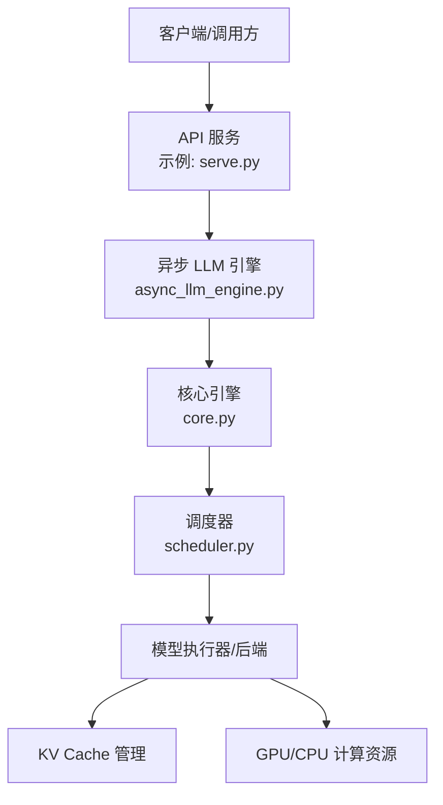
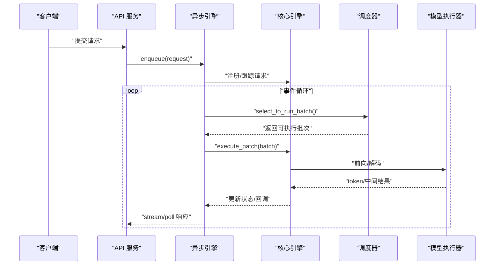
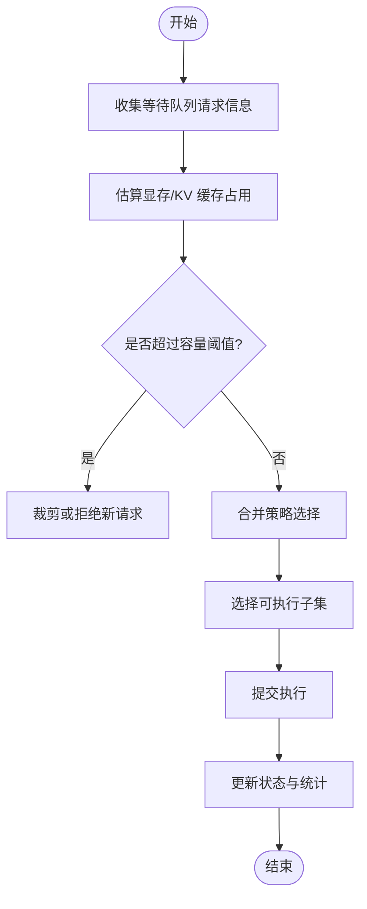
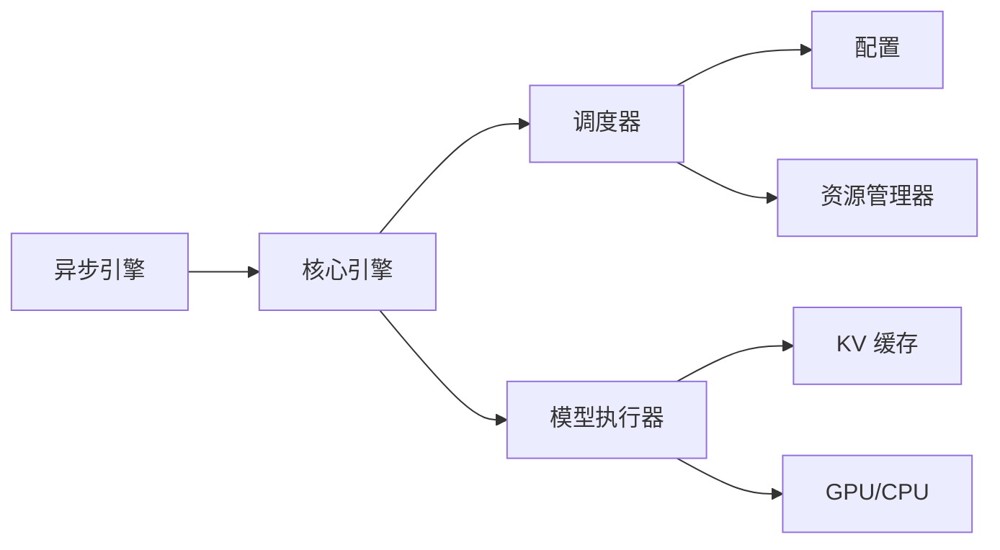

# 批处理与调度控制

<cite>
**本文引用的文件**   
- [vllm/engine/async_llm_engine.py](file://vllm/engine/async_llm_engine.py)
- [vllm/engine/core.py](file://vllm/engine/core.py)
- [vllm/scheduler.py](file://vllm/scheduler.py)
- [vllm/config.py](file://vllm/config.py)
- [benchmarks/benchmark_serving.py](file://benchmarks/benchmark_serving.py)
- [examples/basic/online_serving/serve.py](file://examples/basic/online_serving/serve.py)
</cite>

## 目录
1. [简介](#简介)
2. [项目结构](#项目结构)
3. [核心组件](#核心组件)
4. [架构总览](#架构总览)
5. [详细组件分析](#详细组件分析)
6. [依赖关系分析](#依赖关系分析)
7. [性能考量](#性能考量)
8. [故障排除指南](#故障排除指南)
9. [结论](#结论)
10. [附录](#附录)

## 简介
本文件系统性阐述 vLLM 的批处理算法与调度策略，重点覆盖：
- 动态批处理的实现原理：批次大小决策、请求合并策略与负载均衡机制
- 调度器的内部状态管理与事件驱动架构
- 不同调度算法的适用场景与配置参数
- 优先级调度与公平性保证机制
- 批处理性能优化方法与监控指标
- 实际部署调优经验与故障排除要点

## 项目结构
围绕“请求进入—调度—执行—输出”的主干路径，vLLM 在引擎层（Engine）与调度器（Scheduler）之间解耦，配合异步事件循环完成高吞吐、低延迟的在线推理。

图表来源
- [examples/basic/online_serving/serve.py](file://examples/basic/online_serving/serve.py)
- [vllm/engine/async_llm_engine.py](file://vllm/engine/async_llm_engine.py)
- [vllm/engine/core.py](file://vllm/engine/core.py)
- [vllm/scheduler.py](file://vllm/scheduler.py)

章节来源
- [vllm/engine/async_llm_engine.py](file://vllm/engine/async_llm_engine.py)
- [vllm/engine/core.py](file://vllm/engine/core.py)
- [vllm/scheduler.py](file://vllm/scheduler.py)
- [examples/basic/online_serving/serve.py](file://examples/basic/online_serving/serve.py)

## 核心组件
- 异步 LLM 引擎：对外暴露异步接口，负责接收请求、维护队列、触发调度与结果回传
- 核心引擎：协调多进程/分布式执行、资源分配、生命周期管理
- 调度器：实现动态批处理、请求合并、优先级与公平性策略、事件驱动的状态机
- 配置模块：集中定义调度与批处理相关参数（如最大批次、预填充/解码阈值、缓存水位等）

章节来源
- [vllm/engine/async_llm_engine.py](file://vllm/engine/async_llm_engine.py)
- [vllm/engine/core.py](file://vllm/engine/core.py)
- [vllm/scheduler.py](file://vllm/scheduler.py)
- [vllm/config.py](file://vllm/config.py)

## 架构总览
vLLM 采用“事件驱动的调度 + 动态批处理”的架构：
- 请求到达后进入引擎队列，由事件循环周期性唤醒调度器
- 调度器依据当前系统状态（GPU 内存、KV 缓存、等待队列长度、请求属性）决定本次可执行的子集
- 执行完成后更新状态并触发下一轮调度，形成闭环

图表来源
- [vllm/engine/async_llm_engine.py](file://vllm/engine/async_llm_engine.py)
- [vllm/engine/core.py](file://vllm/engine/core.py)
- [vllm/scheduler.py](file://vllm/scheduler.py)

## 详细组件分析

### 动态批处理与批次大小决策
- 目标：在满足显存/内存约束的前提下，最大化吞吐并降低尾延迟
- 关键要素：
  - 预填充阶段（Prefill）与解码阶段（Decode）的资源占用差异
  - KV 缓存占用估算与水位线（Watermark）
  - 请求长度分布与预估步数
  - 硬件并行度与通信开销
- 决策流程（概念性）：
  - 统计等待队列中请求的输入长度与历史步数
  - 估算当前批次新增请求对显存/KV 缓存的影响
  - 基于阈值与容量上限选择可加入的请求集合
  - 若接近阈值则触发一次执行，避免过度累积导致延迟上升

章节来源
- [vllm/scheduler.py](file://vllm/scheduler.py)
- [vllm/config.py](file://vllm/config.py)

### 请求合并策略
- 动机：将多个短请求合并为一次前向计算，提升 GPU 利用率
- 常见策略：
  - 按输入长度分桶合并
  - 同批次内对齐到块大小（Block Size）以减少碎片
  - 优先合并相似长度的请求以降低 padding 开销
- 注意事项：
  - 避免长尾请求拖慢整体时延
  - 结合超时与优先级进行早退或拆分

章节来源
- [vllm/scheduler.py](file://vllm/scheduler.py)

### 负载均衡机制
- 单节点内：通过调度器在 CPU/GPU、不同并行组间合理分配任务
- 多节点/分布式：核心引擎协调各 worker 的任务分发与结果聚合
- 策略要点：
  - 基于负载感知的任务派发（如最少等待队列、最低显存占用）
  - 亲和性与迁移成本权衡（避免频繁跨设备移动权重/KV）

章节来源
- [vllm/engine/core.py](file://vllm/engine/core.py)
- [vllm/scheduler.py](file://vllm/scheduler.py)

### 调度器的内部状态管理与事件驱动架构
- 状态维度：
  - 请求生命周期（排队、运行中、完成、失败）
  - 资源占用（显存、KV 缓存、CPU 缓冲）
  - 时间维度（到达时间、等待时长、截止时间）
- 事件驱动：
  - 外部事件：新请求到达、取消、超时
  - 内部事件：批次完成、缓存命中/失效、资源释放
- 调度循环：
  - 事件入队 → 事件处理 → 状态更新 → 触发下一次 select_to_run_batch

章节来源
- [vllm/scheduler.py](file://vllm/scheduler.py)
- [vllm/engine/async_llm_engine.py](file://vllm/engine/async_llm_engine.py)

### 调度算法与适用场景
- 常用算法：
  - FIFO：简单公平，适合延迟敏感且请求均匀的场景
  - 优先级调度：按业务等级、SLA、用户类型加权
  - 最短作业优先（SJF）：降低平均等待时间，需估计作业长度
  - 混合策略：按阶段（Prefill/Decode）差异化调度
- 选择建议：
  - 高吞吐优先：SJF/混合策略
  - 公平性优先：FIFO/加权公平队列
  - 实时性优先：优先级+截止时间

章节来源
- [vllm/scheduler.py](file://vllm/scheduler.py)
- [vllm/config.py](file://vllm/config.py)

### 优先级调度与公平性保证
- 优先级来源：
  - 用户/租户级别
  - 请求类型（预填充 vs 解码）
  - SLA 标签（延迟预算、重要性）
- 公平性机制：
  - 加权轮询/公平队列
  - 饥饿保护（最长等待时间阈值）
  - 配额限制（每租户/每队列上限）

章节来源
- [vllm/scheduler.py](file://vllm/scheduler.py)
- [vllm/config.py](file://vllm/config.py)

### 配置参数与调优要点
- 关键参数类别：
  - 批次大小：最大批次、最小批次、增量阈值
  - 缓存水位：KV 缓存阈值、自动扩容/收缩策略
  - 调度策略：算法选择、优先级权重、公平性开关
  - 资源限制：显存上限、CPU 内存上限、并发度
- 调参方法：
  - 基准测试驱动（见 benchmarks）
  - 线上 A/B 对比与滚动发布
  - 监控告警联动（延迟、吞吐、OOM、队列积压）

章节来源
- [vllm/config.py](file://vllm/config.py)
- [benchmarks/benchmark_serving.py](file://benchmarks/benchmark_serving.py)

## 依赖关系分析
- 组件耦合：
  - 引擎依赖调度器进行批次选择
  - 调度器依赖配置与资源管理器
  - 核心引擎协调分布式执行与状态同步
- 外部依赖：
  - 模型执行器（Attention/MLP/MoE 等内核）
  - KV 缓存与分页内存管理
  - 通信库（NCCL/RDMA 等）

图表来源
- [vllm/engine/async_llm_engine.py](file://vllm/engine/async_llm_engine.py)
- [vllm/engine/core.py](file://vllm/engine/core.py)
- [vllm/scheduler.py](file://vllm/scheduler.py)
- [vllm/config.py](file://vllm/config.py)

章节来源
- [vllm/engine/async_llm_engine.py](file://vllm/engine/async_llm_engine.py)
- [vllm/engine/core.py](file://vllm/engine/core.py)
- [vllm/scheduler.py](file://vllm/scheduler.py)
- [vllm/config.py](file://vllm/config.py)

## 性能考量
- 吞吐优化：
  - 增大批次至显存饱和但不溢出
  - 减少 padding 与无效计算（长度对齐、分桶合并）
  - 利用 CUDA Graph/TensorRT 等加速图
- 延迟优化：
  - 缩短调度周期，及时响应短请求
  - 解码阶段小批次高频推进
  - 预取与流水线重叠
- 稳定性：
  - OOM 保护与降级策略
  - 队列长度与超时熔断
  - 资源水位告警与自动扩缩容

[本节为通用指导，不直接分析具体文件]

## 故障排除指南
- 常见问题定位：
  - 吞吐低：检查批次大小、KV 缓存命中率、内核选择
  - 延迟高：观察队列积压、调度周期、长尾请求影响
  - OOM：调整显存阈值、关闭不必要特性、分批执行
  - 不公平：检查优先级权重、配额限制、饥饿保护
- 诊断手段：
  - 使用基准工具验证不同配置下的吞吐/延迟
  - 采集关键指标（队列长度、批次大小、KV 缓存水位、GPU 利用率）
  - 日志与追踪（请求级链路、调度事件）

章节来源
- [benchmarks/benchmark_serving.py](file://benchmarks/benchmark_serving.py)
- [examples/basic/online_serving/serve.py](file://examples/basic/online_serving/serve.py)

## 结论
vLLM 的批处理与调度以“事件驱动 + 动态批处理”为核心，通过精细化的资源估算、灵活的合并策略与可配置的调度算法，在高吞吐与低延迟之间取得平衡。合理的参数调优与完善的监控告警是保障稳定生产的关键。

[本节为总结性内容，不直接分析具体文件]

## 附录
- 推荐实践：
  - 先以保守参数上线，逐步放宽批次与缓存阈值
  - 针对热点请求建立专用队列与优先级
  - 定期回归基准，确保版本升级不影响性能
- 参考入口：
  - 在线服务示例：serve.py
  - 基准测试：benchmark_serving.py

章节来源
- [examples/basic/online_serving/serve.py](file://examples/basic/online_serving/serve.py)
- [benchmarks/benchmark_serving.py](file://benchmarks/benchmark_serving.py)