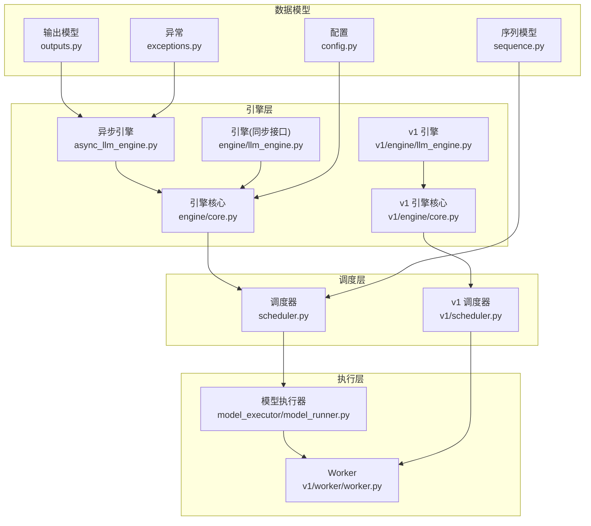
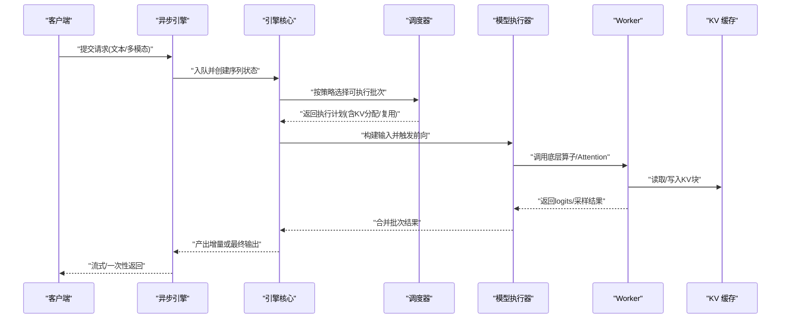
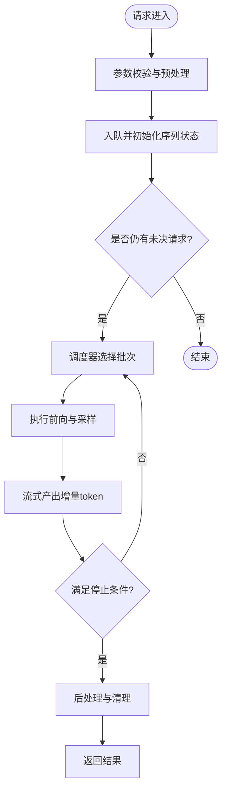
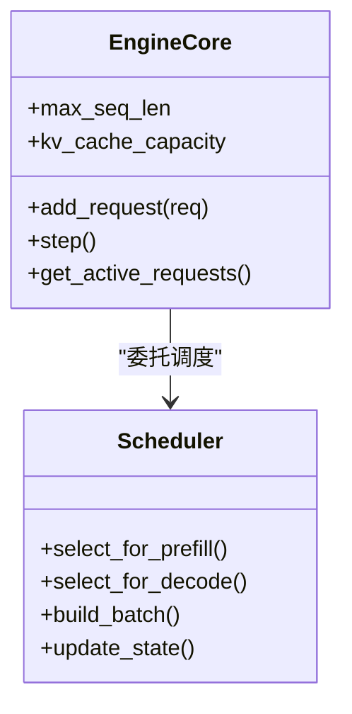
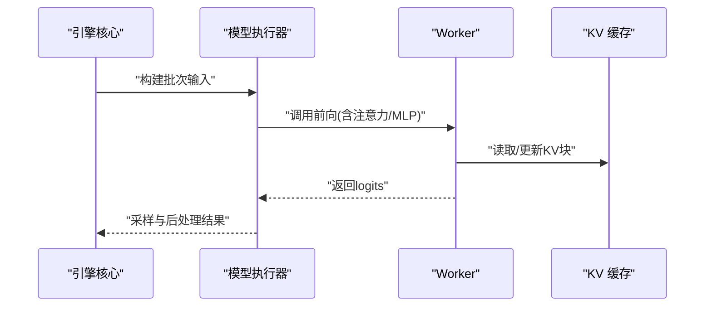
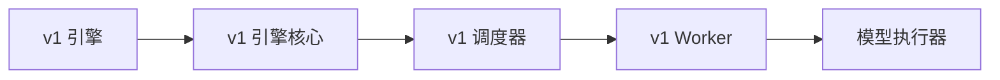
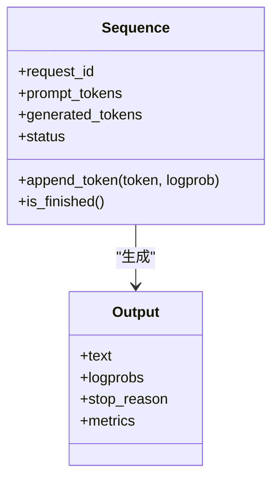
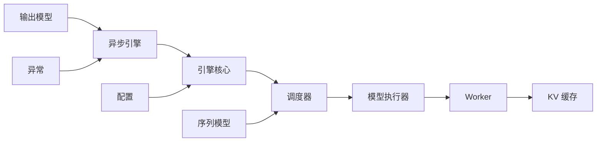

# 数据流与控制流

<cite>
**本文引用的文件**   
- [vllm/engine/async_llm_engine.py](file://vllm/engine/async_llm_engine.py)
- [vllm/engine/core.py](file://vllm/engine/core.py)
- [vllm/engine/llm_engine.py](file://vllm/engine/llm_engine.py)
- [vllm/scheduler.py](file://vllm/scheduler.py)
- [vllm/model_executor/model_runner.py](file://vllm/model_executor/model_runner.py)
- [vllm/v1/engine/llm_engine.py](file://vllm/v1/engine/llm_engine.py)
- [vllm/v1/engine/core.py](file://vllm/v1/engine/core.py)
- [vllm/v1/scheduler.py](file://vllm/v1/scheduler.py)
- [vllm/v1/worker/worker.py](file://vllm/v1/worker/worker.py)
- [vllm/sequence.py](file://vllm/sequence.py)
- [vllm/outputs.py](file://vllm/outputs.py)
- [vllm/config.py](file://vllm/config.py)
- [vllm/exceptions.py](file://vllm/exceptions.py)
- [benchmarks/benchmark_serving.py](file://benchmarks/benchmark_serving.py)
</cite>

## 目录
1. [简介](#简介)
2. [项目结构](#项目结构)
3. [核心组件](#核心组件)
4. [架构总览](#架构总览)
5. [详细组件分析](#详细组件分析)
6. [依赖关系分析](#依赖关系分析)
7. [性能考量](#性能考量)
8. [故障排查指南](#故障排查指南)
9. [结论](#结论)
10. [附录](#附录)

## 简介
本文件聚焦 vLLM 的数据流与控制流设计，系统阐述请求从接入到响应输出的完整链路：预处理、调度、执行与后处理。重点解释异步处理机制与并发控制策略，梳理内存管理中的数据流转（特别是 KV 缓存的分配与回收），并说明批处理算法与动态调度策略。同时给出错误处理与异常恢复机制，配合时序图与状态机图帮助理解关键流程，并提供性能瓶颈分析与优化建议。

## 项目结构
vLLM 将“引擎层”“调度器”“模型执行器”“序列与输出模型”等模块解耦，形成清晰的数据流与控制流边界。核心入口包括异步引擎、引擎核心、调度器与模型执行器；v1 分支进一步细化了调度与执行路径，便于对比新旧实现。

图表来源
- [vllm/engine/async_llm_engine.py](file://vllm/engine/async_llm_engine.py)
- [vllm/engine/core.py](file://vllm/engine/core.py)
- [vllm/engine/llm_engine.py](file://vllm/engine/llm_engine.py)
- [vllm/scheduler.py](file://vllm/scheduler.py)
- [vllm/model_executor/model_runner.py](file://vllm/model_executor/model_runner.py)
- [vllm/v1/engine/llm_engine.py](file://vllm/v1/engine/llm_engine.py)
- [vllm/v1/engine/core.py](file://vllm/v1/engine/core.py)
- [vllm/v1/scheduler.py](file://vllm/v1/scheduler.py)
- [vllm/v1/worker/worker.py](file://vllm/v1/worker/worker.py)
- [vllm/sequence.py](file://vllm/sequence.py)
- [vllm/outputs.py](file://vllm/outputs.py)
- [vllm/config.py](file://vllm/config.py)
- [vllm/exceptions.py](file://vllm/exceptions.py)

章节来源
- [vllm/engine/async_llm_engine.py](file://vllm/engine/async_llm_engine.py)
- [vllm/engine/core.py](file://vllm/engine/core.py)
- [vllm/scheduler.py](file://vllm/scheduler.py)
- [vllm/model_executor/model_runner.py](file://vllm/model_executor/model_runner.py)
- [vllm/v1/engine/llm_engine.py](file://vllm/v1/engine/llm_engine.py)
- [vllm/v1/engine/core.py](file://vllm/v1/engine/core.py)
- [vllm/v1/scheduler.py](file://vllm/v1/scheduler.py)
- [vllm/v1/worker/worker.py](file://vllm/v1/worker/worker.py)
- [vllm/sequence.py](file://vllm/sequence.py)
- [vllm/outputs.py](file://vllm/outputs.py)
- [vllm/config.py](file://vllm/config.py)
- [vllm/exceptions.py](file://vllm/exceptions.py)

## 核心组件
- 异步引擎：对外暴露异步 API，负责请求入队、结果聚合、流式输出与取消语义。
- 引擎核心：维护请求队列、批次生命周期、KV 缓存视图与资源协调。
- 调度器：根据当前可用资源与策略选择可执行的请求子集，生成执行计划。
- 模型执行器：封装底层算子与 CUDA Graph/CUDAGraph-like 执行路径，驱动 Worker 完成前向计算。
- Worker：在独立进程/线程中持有模型实例与显存，执行具体推理步骤。
- 序列与输出模型：统一表示请求上下文、Token 状态与采样结果。
- 配置与异常：集中管理运行参数与错误类型定义。

章节来源
- [vllm/engine/async_llm_engine.py](file://vllm/engine/async_llm_engine.py)
- [vllm/engine/core.py](file://vllm/engine/core.py)
- [vllm/scheduler.py](file://vllm/scheduler.py)
- [vllm/model_executor/model_runner.py](file://vllm/model_executor/model_runner.py)
- [vllm/v1/engine/llm_engine.py](file://vllm/v1/engine/llm_engine.py)
- [vllm/v1/engine/core.py](file://vllm/v1/engine/core.py)
- [vllm/v1/scheduler.py](file://vllm/v1/scheduler.py)
- [vllm/v1/worker/worker.py](file://vllm/v1/worker/worker.py)
- [vllm/sequence.py](file://vllm/sequence.py)
- [vllm/outputs.py](file://vllm/outputs.py)
- [vllm/config.py](file://vllm/config.py)
- [vllm/exceptions.py](file://vllm/exceptions.py)

## 架构总览
下图展示一次典型请求从进入异步引擎到返回结果的端到端流程，涵盖预处理、调度、执行与后处理阶段，以及 KV 缓存的读写路径。

图表来源
- [vllm/engine/async_llm_engine.py](file://vllm/engine/async_llm_engine.py)
- [vllm/engine/core.py](file://vllm/engine/core.py)
- [vllm/scheduler.py](file://vllm/scheduler.py)
- [vllm/model_executor/model_runner.py](file://vllm/model_executor/model_runner.py)
- [vllm/v1/worker/worker.py](file://vllm/v1/worker/worker.py)
- [vllm/sequence.py](file://vllm/sequence.py)

## 详细组件分析

### 异步引擎与请求生命周期
- 请求接入：接收用户请求，进行基础校验与模板化预处理，构造内部请求对象。
- 异步编排：通过事件循环/协程池管理并发，支持流式输出与取消。
- 结果聚合：按序列维度合并增量 token，处理停止条件与采样参数。
- 资源协调：与引擎核心交互，确保 KV 缓存与显存占用受控。

章节来源
- [vllm/engine/async_llm_engine.py](file://vllm/engine/async_llm_engine.py)
- [vllm/sequence.py](file://vllm/sequence.py)
- [vllm/outputs.py](file://vllm/outputs.py)

### 引擎核心与调度器
- 引擎核心：维护全局状态（如最大序列长度、KV 容量）、批次生命周期与跨请求共享视图。
- 调度器：基于启发式策略（如先到先服务、优先级、延迟敏感）选择可执行子集，决定预填充与解码阶段的混合比例。
- 动态调整：根据 GPU 利用率、队列长度与 KV 水位线动态扩容/收缩批次。

图表来源
- [vllm/engine/core.py](file://vllm/engine/core.py)
- [vllm/scheduler.py](file://vllm/scheduler.py)

章节来源
- [vllm/engine/core.py](file://vllm/engine/core.py)
- [vllm/scheduler.py](file://vllm/scheduler.py)

### 模型执行器与 Worker
- 模型执行器：封装输入打包、注意力前向、采样与日志记录，支持多种后端（FlashAttention、Triton 等）。
- Worker：持有模型权重与 KV 缓存，执行具体张量运算，支持 CUDA Graph 加速。
- 通信：与执行器之间通过高效 IPC/NCCL 通道传递张量与元数据。

图表来源
- [vllm/model_executor/model_runner.py](file://vllm/model_executor/model_runner.py)
- [vllm/v1/worker/worker.py](file://vllm/v1/worker/worker.py)

章节来源
- [vllm/model_executor/model_runner.py](file://vllm/model_executor/model_runner.py)
- [vllm/v1/worker/worker.py](file://vllm/v1/worker/worker.py)

### v1 引擎与调度差异
- v1 引擎：更细粒度的控制流，分离调度与执行，增强可观测性与扩展性。
- v1 调度器：支持更灵活的批内混合（prefill/decode 混合）、优先级与公平性策略。
- v1 Worker：与执行器解耦，便于横向扩展与异构设备部署。

图表来源
- [vllm/v1/engine/llm_engine.py](file://vllm/v1/engine/llm_engine.py)
- [vllm/v1/engine/core.py](file://vllm/v1/engine/core.py)
- [vllm/v1/scheduler.py](file://vllm/v1/scheduler.py)
- [vllm/v1/worker/worker.py](file://vllm/v1/worker/worker.py)

章节来源
- [vllm/v1/engine/llm_engine.py](file://vllm/v1/engine/llm_engine.py)
- [vllm/v1/engine/core.py](file://vllm/v1/engine/core.py)
- [vllm/v1/scheduler.py](file://vllm/v1/scheduler.py)
- [vllm/v1/worker/worker.py](file://vllm/v1/worker/worker.py)

### 序列与输出模型
- 序列模型：跟踪每个请求的 Token 历史、位置编码、采样状态与 KV 索引。
- 输出模型：标准化 logprobs、采样结果、停止原因与统计指标。

图表来源
- [vllm/sequence.py](file://vllm/sequence.py)
- [vllm/outputs.py](file://vllm/outputs.py)

章节来源
- [vllm/sequence.py](file://vllm/sequence.py)
- [vllm/outputs.py](file://vllm/outputs.py)

### 配置与异常
- 配置：集中管理模型参数、并行策略、KV 缓存大小、量化与编译选项。
- 异常：定义 OOM、超时、无效输入等错误类型，提供统一错误传播与恢复策略。

章节来源
- [vllm/config.py](file://vllm/config.py)
- [vllm/exceptions.py](file://vllm/exceptions.py)

## 依赖关系分析
- 低耦合高内聚：引擎层不直接操作显存，调度器仅关注批次选择，执行器专注算子效率。
- 明确边界：序列与输出模型作为纯数据结构，避免副作用。
- 可扩展点：Worker 与执行器可通过插件替换不同后端（如不同 Attention 实现）。

图表来源
- [vllm/engine/async_llm_engine.py](file://vllm/engine/async_llm_engine.py)
- [vllm/engine/core.py](file://vllm/engine/core.py)
- [vllm/scheduler.py](file://vllm/scheduler.py)
- [vllm/model_executor/model_runner.py](file://vllm/model_executor/model_runner.py)
- [vllm/v1/worker/worker.py](file://vllm/v1/worker/worker.py)
- [vllm/sequence.py](file://vllm/sequence.py)
- [vllm/outputs.py](file://vllm/outputs.py)
- [vllm/config.py](file://vllm/config.py)
- [vllm/exceptions.py](file://vllm/exceptions.py)

章节来源
- [vllm/engine/async_llm_engine.py](file://vllm/engine/async_llm_engine.py)
- [vllm/engine/core.py](file://vllm/engine/core.py)
- [vllm/scheduler.py](file://vllm/scheduler.py)
- [vllm/model_executor/model_runner.py](file://vllm/model_executor/model_runner.py)
- [vllm/v1/worker/worker.py](file://vllm/v1/worker/worker.py)
- [vllm/sequence.py](file://vllm/sequence.py)
- [vllm/outputs.py](file://vllm/outputs.py)
- [vllm/config.py](file://vllm/config.py)
- [vllm/exceptions.py](file://vllm/exceptions.py)

## 性能考量
- 批处理与动态调度：合理设置最大批次大小与混合比例，减少空闲周期；依据队列长度与 GPU 利用率自适应调整。
- KV 缓存管理：采用分块与页表映射，避免碎片化；利用前缀缓存与复用策略降低重复计算。
- 算子融合与编译：启用 CUDA Graph/Torch Compile 等加速手段，减少内核启动开销。
- I/O 与序列化：最小化 CPU-GPU 数据传输，使用零拷贝与异步 I/O。
- 监控与调优：通过基准测试与指标采集定位热点，结合硬件特性（带宽、显存带宽）优化。

[本节为通用指导，不直接分析具体文件]

## 故障排查指南
- 常见错误类型：OOM、超时、无效输入、采样失败、注意力崩溃等。
- 诊断要点：检查队列积压、KV 水位线、批次大小与采样参数；查看 Worker 日志与显存占用。
- 恢复策略：自动重试与降级（如减小批次）、隔离故障请求、重启 Worker 进程。
- 工具与基准：使用基准脚本复现实验场景，验证配置与参数影响。

章节来源
- [vllm/exceptions.py](file://vllm/exceptions.py)
- [benchmarks/benchmark_serving.py](file://benchmarks/benchmark_serving.py)

## 结论
vLLM 通过清晰的层次化设计与模块化拆分，实现了高效、可扩展的 LLM 推理服务。其数据流与控制流围绕“异步引擎—引擎核心—调度器—执行器—Worker”展开，配合 KV 缓存管理与动态批处理策略，在吞吐与延迟之间取得良好平衡。未来可在调度策略、内存复用与算子融合方面继续优化，以适配更多硬件与负载场景。

[本节为总结性内容，不直接分析具体文件]

## 附录
- 术语表：预填充（Prefill）、解码（Decode）、KV 缓存、CUDA Graph、采样、停止条件等。
- 参考文档：设计文档、配置说明与部署指南。

[本节为补充信息，不直接分析具体文件]