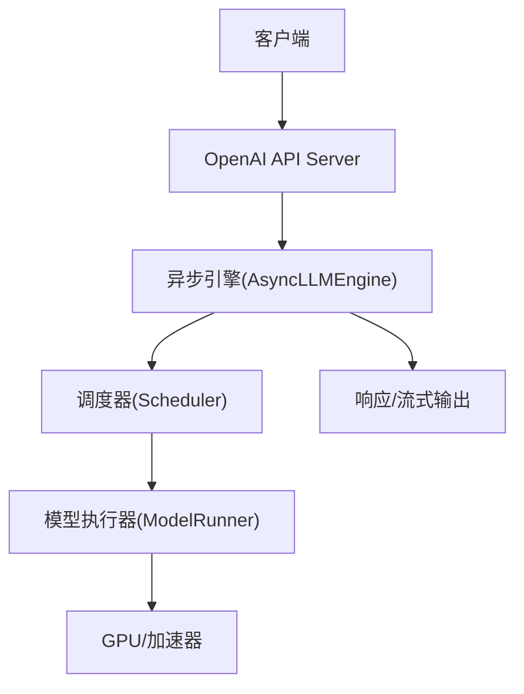
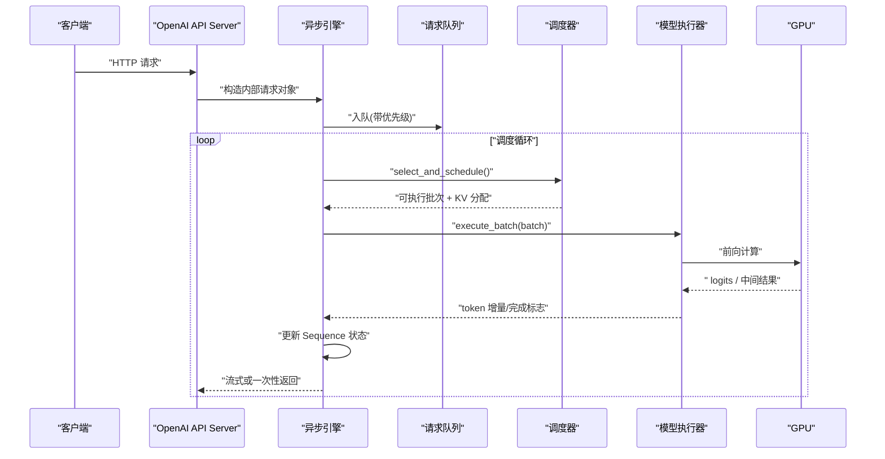
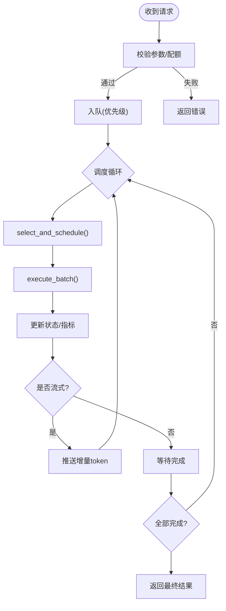
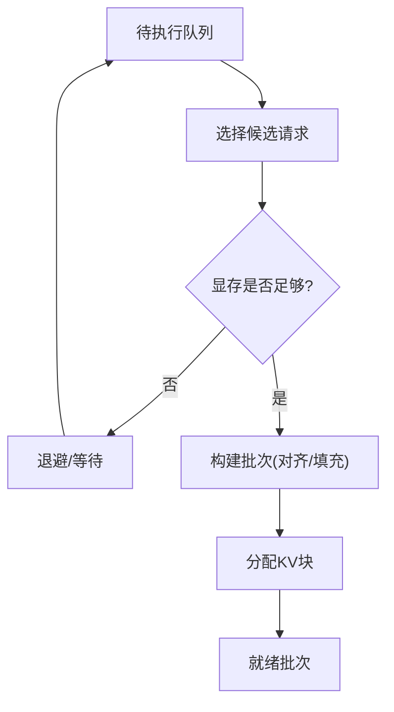
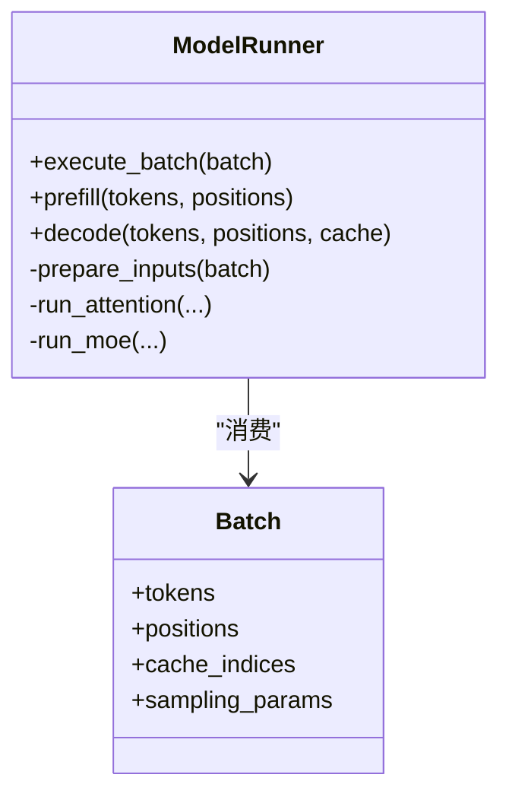
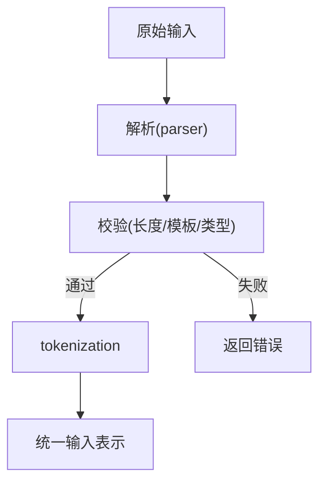
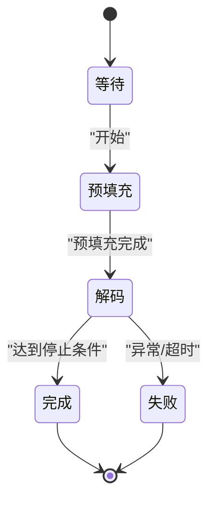
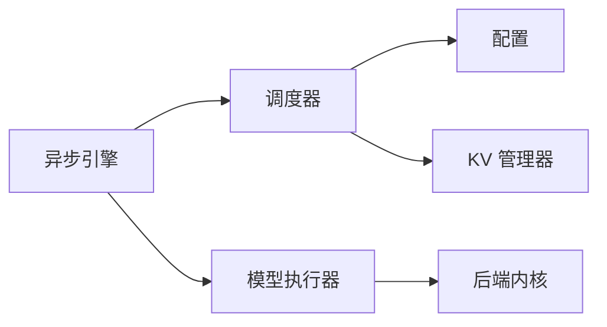

# 请求处理流水线

<cite>
**本文引用的文件**   
- [vllm/engine/async_llm_engine.py](file://vllm/engine/async_llm_engine.py)
- [vllm/engine/llm_engine.py](file://vllm/engine/llm_engine.py)
- [vllm/engine/scheduler.py](file://vllm/engine/scheduler.py)
- [vllm/model_executor/model_runner.py](file://vllm/model_executor/model_runner.py)
- [vllm/inputs/tokenization.py](file://vllm/inputs/tokenization.py)
- [vllm/inputs/parser.py](file://vllm/inputs/parser.py)
- [vllm/entrypoints/openai/api_server.py](file://vllm/entrypoints/openai/api_server.py)
- [vllm/sequence.py](file://vllm/sequence.py)
- [vllm/config.py](file://vllm/config.py)
- [vllm/utils.py](file://vllm/utils.py)
</cite>

## 目录
1. [简介](#简介)
2. [项目结构](#项目结构)
3. [核心组件](#核心组件)
4. [架构总览](#架构总览)
5. [详细组件分析](#详细组件分析)
6. [依赖关系分析](#依赖关系分析)
7. [性能考虑](#性能考虑)
8. [故障排查指南](#故障排查指南)
9. [结论](#结论)
10. [附录：请求生命周期示例](#附录请求生命周期示例)

## 简介
本文件系统性阐述 vLLM 中“请求处理流水线”的完整流程，覆盖从 API 层接收请求、输入预处理与 tokenization、批处理组装、调度器分配、模型执行到响应生成的全过程。重点解释异步引擎如何处理并发请求（队列管理、优先级调度、资源分配），并给出错误处理与重试机制说明。文末提供性能优化建议与常见问题排查方法，帮助读者在生产环境中稳定高效地运行 vLLM。

## 项目结构
围绕请求流水线的关键代码主要分布在以下模块：
- 入口与协议适配：OpenAI API Server 将 HTTP 请求转换为内部请求对象
- 异步引擎：封装请求入队、调度循环、结果回写与流式输出
- 调度器：负责批处理组装、KV Cache 分配、优先级与资源策略
- 模型执行器：统一调用底层推理后端（CUDA/Triton/自定义内核）
- 输入处理：解析与 Tokenize，构建统一的输入表示
- 序列与状态：维护每个请求的生成状态、采样参数、停止条件等

图表来源
- [vllm/entrypoints/openai/api_server.py](file://vllm/entrypoints/openai/api_server.py)
- [vllm/engine/async_llm_engine.py](file://vllm/engine/async_llm_engine.py)
- [vllm/engine/scheduler.py](file://vllm/engine/scheduler.py)
- [vllm/model_executor/model_runner.py](file://vllm/model_executor/model_runner.py)

章节来源
- [vllm/entrypoints/openai/api_server.py](file://vllm/entrypoints/openai/api_server.py)
- [vllm/engine/async_llm_engine.py](file://vllm/engine/async_llm_engine.py)
- [vllm/engine/scheduler.py](file://vllm/engine/scheduler.py)
- [vllm/model_executor/model_runner.py](file://vllm/model_executor/model_runner.py)

## 核心组件
- 异步引擎（AsyncLLMEngine）
  - 职责：接收请求、构造内部任务、入队、驱动调度循环、聚合结果、支持流式返回
  - 并发模型：基于事件循环与协程，使用队列与回调实现高吞吐
- 调度器（Scheduler）
  - 职责：根据策略选择可执行的请求子集，分配 KV Cache，组织批次，触发一次前向计算
  - 策略：优先级、延迟敏感、公平性、显存水位线、预填充/解码阶段分离
- 模型执行器（ModelRunner）
  - 职责：将批次数据喂给模型，处理注意力、MoE、量化、图编译等加速路径
- 输入处理（Tokenization/Parser）
  - 职责：将原始文本/结构化输入转为 tokens，校验长度、模板、多模态对齐
- 序列（Sequence）
  - 职责：维护单请求的状态机（等待/预填充/解码/完成/失败）、采样参数、日志与指标

章节来源
- [vllm/engine/async_llm_engine.py](file://vllm/engine/async_llm_engine.py)
- [vllm/engine/scheduler.py](file://vllm/engine/scheduler.py)
- [vllm/model_executor/model_runner.py](file://vllm/model_executor/model_runner.py)
- [vllm/inputs/tokenization.py](file://vllm/inputs/tokenization.py)
- [vllm/inputs/parser.py](file://vllm/inputs/parser.py)
- [vllm/sequence.py](file://vllm/sequence.py)

## 架构总览
下图展示一次典型请求在 vLLM 中的端到端流转，包括异步引擎的事件驱动调度、调度器的批处理决策与模型执行器的执行。

图表来源
- [vllm/entrypoints/openai/api_server.py](file://vllm/entrypoints/openai/api_server.py)
- [vllm/engine/async_llm_engine.py](file://vllm/engine/async_llm_engine.py)
- [vllm/engine/scheduler.py](file://vllm/engine/scheduler.py)
- [vllm/model_executor/model_runner.py](file://vllm/model_executor/model_runner.py)

## 详细组件分析

### 异步引擎（AsyncLLMEngine）
- 并发与队列
  - 使用事件循环与协程，请求通过队列进入，避免阻塞
  - 支持流式输出：每步 token 生成即推送，降低首字延迟
- 调度循环
  - 周期性唤醒，调用调度器进行批次选择与资源分配
  - 维护请求状态机，跟踪完成/失败/超时
- 错误与重试
  - 捕获执行异常，分类为可重试/不可重试，按策略回退或终止
  - 支持限流与背压：当队列过长时拒绝新请求或降级

图表来源
- [vllm/engine/async_llm_engine.py](file://vllm/engine/async_llm_engine.py)

章节来源
- [vllm/engine/async_llm_engine.py](file://vllm/engine/async_llm_engine.py)

### 调度器（Scheduler）
- 批次选择策略
  - 优先满足低延迟请求（短上下文/早到达）
  - 兼顾公平性与吞吐：限制最大批大小、最小批大小
- KV Cache 管理
  - 动态分配块，合并连续段，回收空闲块
  - 水位线阈值触发压缩/卸载策略（若启用）
- 阶段分离
  - 预填充阶段：大矩阵运算，适合较大批
  - 解码阶段：逐 token 生成，批内长度差异大，需特殊对齐

图表来源
- [vllm/engine/scheduler.py](file://vllm/engine/scheduler.py)

章节来源
- [vllm/engine/scheduler.py](file://vllm/engine/scheduler.py)

### 模型执行器（ModelRunner）
- 执行路径
  - 将批次张量送入模型，处理注意力、MoE、量化、激活融合等
  - 支持 CUDA Graph、Triton 内核、自定义算子
- 结果回传
  - 返回 logits 或采样后的 token，标记完成条件（EOS/长度上限/停止词）

图表来源
- [vllm/model_executor/model_runner.py](file://vllm/model_executor/model_runner.py)

章节来源
- [vllm/model_executor/model_runner.py](file://vllm/model_executor/model_runner.py)

### 输入处理（Tokenization/Parser）
- 解析与校验
  - 解析 OpenAI/原生格式，标准化字段（prompt、messages、tools、stop 等）
  - 校验长度、模板、多模态对齐（图像/音频）
- Tokenization
  - 调用对应 tokenizer，生成 ids、位置信息、注意力掩码
  - 处理特殊 token、系统提示、工具调用模板

图表来源
- [vllm/inputs/parser.py](file://vllm/inputs/parser.py)
- [vllm/inputs/tokenization.py](file://vllm/inputs/tokenization.py)

章节来源
- [vllm/inputs/parser.py](file://vllm/inputs/parser.py)
- [vllm/inputs/tokenization.py](file://vllm/inputs/tokenization.py)

### 序列（Sequence）
- 状态机
  - 等待/预填充/解码/完成/失败
  - 记录采样参数、停止条件、已生成 token、KV 索引
- 指标与日志
  - 统计延迟、吞吐、内存占用、失败原因

图表来源
- [vllm/sequence.py](file://vllm/sequence.py)

章节来源
- [vllm/sequence.py](file://vllm/sequence.py)

## 依赖关系分析
- 组件耦合
  - 异步引擎依赖调度器与模型执行器；调度器依赖配置与 KV 管理器；模型执行器依赖后端内核
- 外部依赖
  - PyTorch/CUDA、Triton、FlashAttention、量化库等
- 潜在环路
  - 通过接口解耦避免循环依赖；引擎与调度器之间以函数调用为主

图表来源
- [vllm/engine/async_llm_engine.py](file://vllm/engine/async_llm_engine.py)
- [vllm/engine/scheduler.py](file://vllm/engine/scheduler.py)
- [vllm/model_executor/model_runner.py](file://vllm/model_executor/model_runner.py)
- [vllm/config.py](file://vllm/config.py)

章节来源
- [vllm/engine/async_llm_engine.py](file://vllm/engine/async_llm_engine.py)
- [vllm/engine/scheduler.py](file://vllm/engine/scheduler.py)
- [vllm/model_executor/model_runner.py](file://vllm/model_executor/model_runner.py)
- [vllm/config.py](file://vllm/config.py)

## 性能考虑
- 批处理与对齐
  - 合理设置最大批大小、最小批大小，减少 padding 开销
  - 使用连续 KV 块与块池化，降低碎片化
- 阶段分离
  - 预填充与解码分开调度，提升吞吐与延迟稳定性
- 图编译与内核
  - 启用 CUDA Graph、Triton 内核、Fused Attention/MoE 融合
- 内存与水印
  - 设置 KV 缓存水位线，触发压缩/卸载，避免 OOM
- 流式输出
  - 降低首字延迟，提高交互体验
- 资源隔离
  - 多租户场景下限制每请求配额，防止争抢

[本节为通用指导，不直接分析具体文件]

## 故障排查指南
- 常见错误
  - OOM：检查 KV 缓存水位线、批大小、模型精度
  - 超时：调整超时阈值、检查队列积压、优化调度策略
  - 非法输入：校验模板、长度、多模态对齐
- 定位手段
  - 查看引擎日志与指标（延迟、吞吐、失败率）
  - 打印批次信息与 KV 分配情况
  - 使用 profiling 工具定位热点内核
- 恢复策略
  - 自动重试（可重试错误）、限流与降级、优雅关闭

章节来源
- [vllm/engine/async_llm_engine.py](file://vllm/engine/async_llm_engine.py)
- [vllm/engine/scheduler.py](file://vllm/engine/scheduler.py)
- [vllm/utils.py](file://vllm/utils.py)

## 结论
vLLM 的请求处理流水线以异步引擎为核心，结合调度器的智能批处理与模型执行器的高效内核，实现了高吞吐、低延迟的推理服务。通过合理的配置与监控，可在生产环境稳定运行并持续优化性能。

[本节为总结，不直接分析具体文件]

## 附录：请求生命周期示例
以下为一次请求从接入到返回的关键步骤概览（不含代码片段，仅路径引用）：
- 接入与解析
  - [vllm/entrypoints/openai/api_server.py](file://vllm/entrypoints/openai/api_server.py)
  - [vllm/inputs/parser.py](file://vllm/inputs/parser.py)
- 预处理与 Tokenization
  - [vllm/inputs/tokenization.py](file://vllm/inputs/tokenization.py)
- 入队与调度
  - [vllm/engine/async_llm_engine.py](file://vllm/engine/async_llm_engine.py)
  - [vllm/engine/scheduler.py](file://vllm/engine/scheduler.py)
- 模型执行
  - [vllm/model_executor/model_runner.py](file://vllm/model_executor/model_runner.py)
- 状态与输出
  - [vllm/sequence.py](file://vllm/sequence.py)
  - [vllm/engine/llm_engine.py](file://vllm/engine/llm_engine.py)

章节来源
- [vllm/entrypoints/openai/api_server.py](file://vllm/entrypoints/openai/api_server.py)
- [vllm/inputs/parser.py](file://vllm/inputs/parser.py)
- [vllm/inputs/tokenization.py](file://vllm/inputs/tokenization.py)
- [vllm/engine/async_llm_engine.py](file://vllm/engine/async_llm_engine.py)
- [vllm/engine/scheduler.py](file://vllm/engine/scheduler.py)
- [vllm/model_executor/model_runner.py](file://vllm/model_executor/model_runner.py)
- [vllm/sequence.py](file://vllm/sequence.py)
- [vllm/engine/llm_engine.py](file://vllm/engine/llm_engine.py)