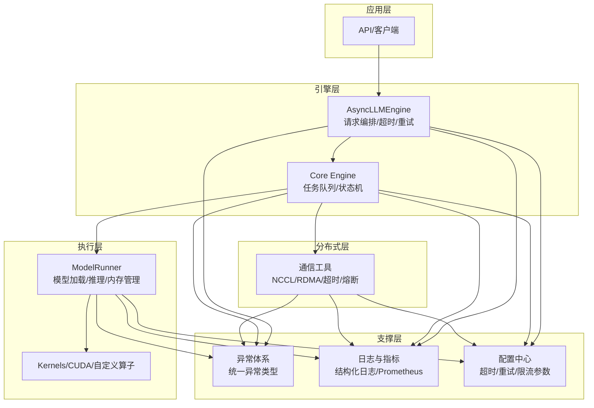
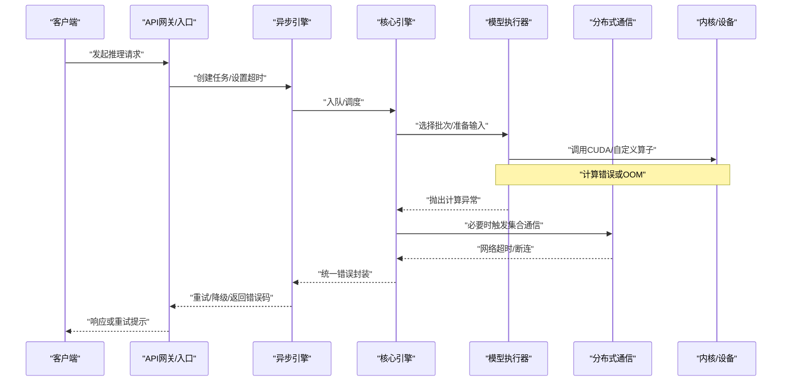
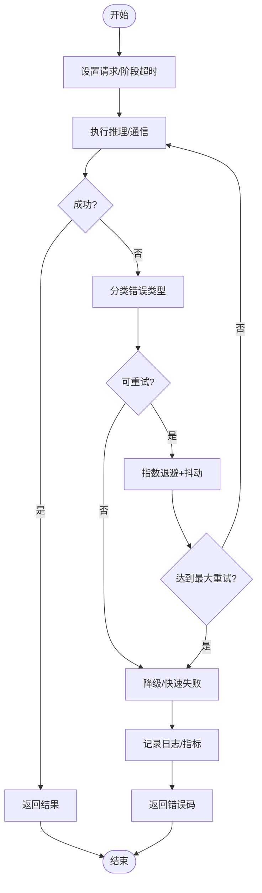
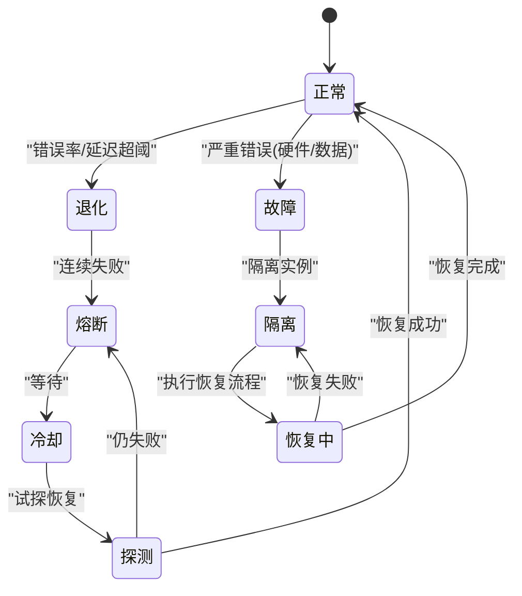
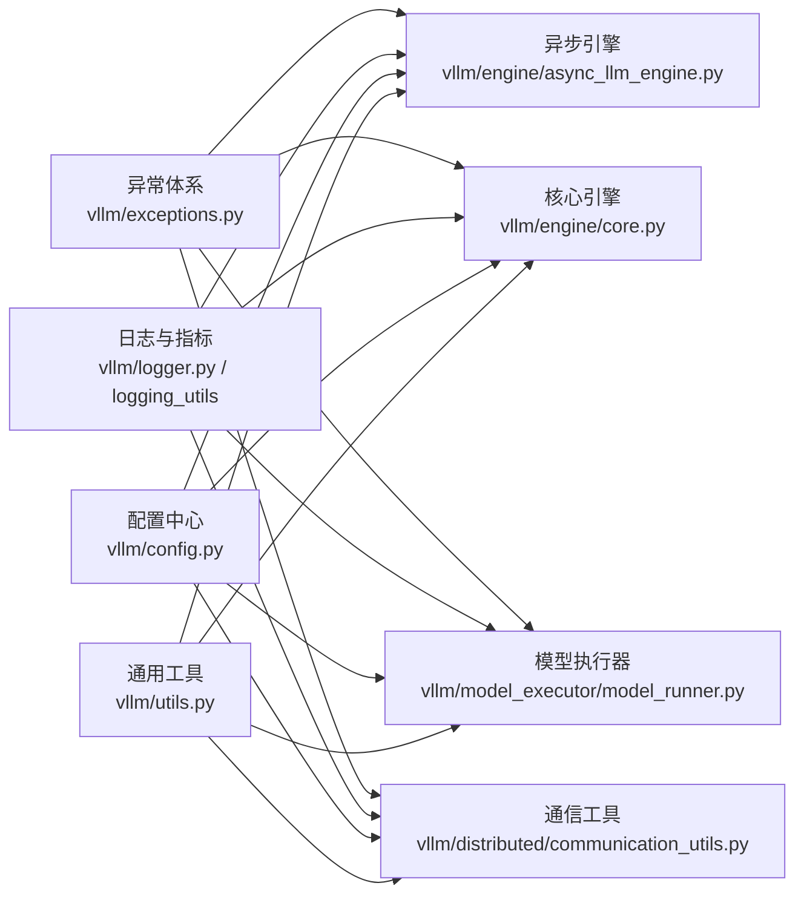

# 错误处理与恢复机制

<cite>
**本文引用的文件**   
- [vllm/exceptions.py](file://vllm/exceptions.py)
- [vllm/logger.py](file://vllm/logger.py)
- [vllm/engine/async_llm_engine.py](file://vllm/engine/async_llm_engine.py)
- [vllm/engine/core.py](file://vllm/engine/core.py)
- [vllm/model_executor/model_runner.py](file://vllm/model_executor/model_runner.py)
- [vllm/distributed/communication_utils.py](file://vllm/distributed/communication_utils.py)
- [vllm/utils.py](file://vllm/utils.py)
- [vllm/config.py](file://vllm/config.py)
- [vllm/logging_utils/__init__.py](file://vllm/logging_utils/__init__.py)
- [examples/observability/prometheus_grafana/metrics.py](file://examples/observability/prometheus_grafana/metrics.py)
- [tests/test_logger.py](file://tests/test_logger.py)
</cite>

## 目录
1. [引言](#引言)
2. [项目结构](#项目结构)
3. [核心组件](#核心组件)
4. [架构总览](#架构总览)
5. [详细组件分析](#详细组件分析)
6. [依赖关系分析](#依赖关系分析)
7. [性能考量](#性能考量)
8. [故障排查指南](#故障排查指南)
9. [结论](#结论)
10. [附录](#附录)

## 引言
本文件系统性梳理 vLLM 的错误处理框架与异常恢复机制，覆盖错误分类（网络、计算、资源不足等）、异步传播与超时控制、系统级错误的检测/隔离/恢复流程、日志与监控告警配置，以及生产环境的容错设计与灾难恢复策略。目标是帮助读者在理解代码实现的同时，快速定位问题并制定可靠的运维方案。

## 项目结构
围绕错误处理与恢复的关键代码主要分布在以下模块：
- 异常类型定义：vllm/exceptions.py
- 日志与结构化记录：vllm/logger.py、vllm/logging_utils/__init__.py
- 引擎与调度：vllm/engine/async_llm_engine.py、vllm/engine/core.py
- 模型执行与内核：vllm/model_executor/model_runner.py
- 分布式通信：vllm/distributed/communication_utils.py
- 通用工具与配置：vllm/utils.py、vllm/config.py
- 可观测性示例：examples/observability/prometheus_grafana/metrics.py
- 测试用例：tests/test_logger.py

图表来源 
- [vllm/engine/async_llm_engine.py](file://vllm/engine/async_llm_engine.py)
- [vllm/engine/core.py](file://vllm/engine/core.py)
- [vllm/model_executor/model_runner.py](file://vllm/model_executor/model_runner.py)
- [vllm/distributed/communication_utils.py](file://vllm/distributed/communication_utils.py)
- [vllm/exceptions.py](file://vllm/exceptions.py)
- [vllm/logger.py](file://vllm/logger.py)
- [vllm/logging_utils/__init__.py](file://vllm/logging_utils/__init__.py)
- [vllm/utils.py](file://vllm/utils.py)
- [vllm/config.py](file://vllm/config.py)

章节来源
- [vllm/exceptions.py](file://vllm/exceptions.py)
- [vllm/logger.py](file://vllm/logger.py)
- [vllm/engine/async_llm_engine.py](file://vllm/engine/async_llm_engine.py)
- [vllm/engine/core.py](file://vllm/engine/core.py)
- [vllm/model_executor/model_runner.py](file://vllm/model_executor/model_runner.py)
- [vllm/distributed/communication_utils.py](file://vllm/distributed/communication_utils.py)
- [vllm/utils.py](file://vllm/utils.py)
- [vllm/config.py](file://vllm/config.py)
- [vllm/logging_utils/__init__.py](file://vllm/logging_utils/__init__.py)
- [examples/observability/prometheus_grafana/metrics.py](file://examples/observability/prometheus_grafana/metrics.py)
- [tests/test_logger.py](file://tests/test_logger.py)

## 核心组件
- 异常体系
  - 统一异常基类与分层派生：用于区分网络、计算、资源、配置、IO 等错误类别，便于上层按类型捕获与决策。
  - 关键职责：提供一致的异常信息结构（错误码、上下文、堆栈），支持序列化与跨进程传播。
- 引擎与调度
  - 异步引擎负责请求生命周期管理、超时控制、重试与降级；核心引擎维护任务队列、状态机与资源分配。
  - 对底层执行器与通信层的异常进行归一化封装，向上暴露稳定接口。
- 模型执行器
  - 负责模型加载、显存管理、批调度与内核调用；对 CUDA/内核失败、OOM、设备不可用等进行捕获与上报。
- 分布式通信
  - 封装 NCCL/集合通信的超时、重试、熔断与回退策略；将通信异常转换为统一的网络错误类型。
- 日志与监控
  - 结构化日志输出（含请求ID、阶段、耗时、错误码）；指标采集（错误率、延迟、资源使用）与告警阈值。
- 配置与工具
  - 集中管理超时、重试、限流、熔断、日志级别、指标开关等参数；提供通用工具函数辅助错误诊断。

章节来源
- [vllm/exceptions.py](file://vllm/exceptions.py)
- [vllm/engine/async_llm_engine.py](file://vllm/engine/async_llm_engine.py)
- [vllm/engine/core.py](file://vllm/engine/core.py)
- [vllm/model_executor/model_runner.py](file://vllm/model_executor/model_runner.py)
- [vllm/distributed/communication_utils.py](file://vllm/distributed/communication_utils.py)
- [vllm/logger.py](file://vllm/logger.py)
- [vllm/logging_utils/__init__.py](file://vllm/logging_utils/__init__.py)
- [vllm/utils.py](file://vllm/utils.py)
- [vllm/config.py](file://vllm/config.py)

## 架构总览
下图展示从请求进入到执行与返回过程中，错误在各层的产生、传播与处理路径。

图表来源 
- [vllm/engine/async_llm_engine.py](file://vllm/engine/async_llm_engine.py)
- [vllm/engine/core.py](file://vllm/engine/core.py)
- [vllm/model_executor/model_runner.py](file://vllm/model_executor/model_runner.py)
- [vllm/distributed/communication_utils.py](file://vllm/distributed/communication_utils.py)

## 详细组件分析

### 异常体系与分类
- 设计要点
  - 分层继承：基础异常 -> 领域异常（网络、计算、资源、配置、IO）-> 具体异常（如显存不足、通信超时）。
  - 标准化字段：错误码、消息、上下文（请求ID、阶段、参数快照）、堆栈追踪。
  - 可序列化：跨进程/节点传递时保持语义一致。
- 典型分类
  - 网络错误：连接失败、超时、协议错误、远端服务不可用。
  - 计算错误：内核崩溃、数值溢出、形状不匹配、设备异常。
  - 资源不足：显存/内存不足、句柄耗尽、队列满。
  - 配置错误：参数非法、版本不兼容、环境缺失。
  - IO 错误：权重加载失败、缓存损坏、磁盘读写异常。
- 处理策略
  - 可重试：短暂网络抖动、临时资源争用。
  - 不可重试：参数错误、模型格式不兼容、硬件损坏。
  - 降级：切换后端、降低并发、关闭可选特性。
  - 熔断：连续失败后快速失败，避免雪崩。

章节来源
- [vllm/exceptions.py](file://vllm/exceptions.py)

### 异步操作中的异常传播与超时
- 传播路径
  - 内核/设备异常 -> 执行器 -> 核心引擎 -> 异步引擎 -> API层 -> 客户端。
  - 每层进行必要包装与上下文补充，确保最终错误具备足够诊断信息。
- 超时控制
  - 请求级超时：防止长尾阻塞，结合心跳与进度上报。
  - 阶段级超时：预填充、解码、通信各阶段独立计时。
  - 超时策略：取消任务、释放资源、记录指标、返回标准错误码。
- 重试与退避
  - 指数退避 + 抖动，限制最大重试次数。
  - 幂等性检查：仅对安全操作重试。
  - 熔断保护：失败率阈值触发熔断，冷却后试探恢复。

图表来源 
- [vllm/engine/async_llm_engine.py](file://vllm/engine/async_llm_engine.py)
- [vllm/engine/core.py](file://vllm/engine/core.py)
- [vllm/distributed/communication_utils.py](file://vllm/distributed/communication_utils.py)

章节来源
- [vllm/engine/async_llm_engine.py](file://vllm/engine/async_llm_engine.py)
- [vllm/engine/core.py](file://vllm/engine/core.py)
- [vllm/distributed/communication_utils.py](file://vllm/distributed/communication_utils.py)

### 系统级错误的检测、隔离与恢复
- 检测
  - 健康检查：设备可用性、显存水位、通信组状态、队列长度。
  - 指标阈值：错误率、延迟P99、GC压力、CPU/GPU利用率。
  - 事件驱动：内核崩溃、OOM、NCCL错误、权重加载失败。
- 隔离
  - 故障域划分：按节点/卡/进程隔离，避免扩散。
  - 资源隔离：配额、限制、抢占；任务优先级与公平调度。
  - 熔断与隔离舱：失败比例高时自动隔离实例。
- 恢复
  - 自动重启：进程/容器自愈，保留最小状态。
  - 数据恢复：权重校验、KV缓存重建、检查点回滚。
  - 流量治理：限流、排队、优雅降级、只读模式。

[此图为概念流程图，无需源码映射]

### 日志记录与监控告警
- 结构化日志
  - 关键字段：请求ID、阶段、耗时、错误码、资源水位、堆栈摘要。
  - 分级输出：DEBUG/INFO/WARN/ERROR/FATAL，按模块与请求维度过滤。
  - 脱敏与安全：屏蔽敏感信息，审计追踪。
- 指标与告警
  - 错误率、延迟分位、吞吐、资源使用、队列深度、重试/熔断计数。
  - Prometheus/Grafana集成，阈值告警与通知渠道。
- 最佳实践
  - 低开销采样：高频日志采样，关键路径全量记录。
  - 关联追踪：跨进程/节点链路ID贯通。
  - 可观测性闭环：日志->指标->告警->工单->复盘。

章节来源
- [vllm/logger.py](file://vllm/logger.py)
- [vllm/logging_utils/__init__.py](file://vllm/logging_utils/__init__.py)
- [examples/observability/prometheus_grafana/metrics.py](file://examples/observability/prometheus_grafana/metrics.py)
- [tests/test_logger.py](file://tests/test_logger.py)

### 常见错误分类与处理策略
- 网络错误
  - 现象：连接超时、握手失败、远端断开。
  - 处理：重试（指数退避）、切换端点、熔断、降级为本地缓存或只读。
- 计算错误
  - 现象：内核崩溃、NaN/Inf、形状不匹配、设备复位。
  - 处理：回退到备用内核、减少批大小、重启设备、上报诊断包。
- 资源不足
  - 现象：显存OOM、内存泄漏、句柄耗尽、队列满。
  - 处理：动态降批、驱逐低优先级任务、扩容、清理缓存、告警扩容。
- 配置与环境
  - 现象：参数非法、版本不兼容、环境变量缺失。
  - 处理：启动前校验、回滚配置、提供修复建议。
- IO与权重
  - 现象：权重加载失败、校验不通过、缓存损坏。
  - 处理：重新下载、校验和比对、回滚到上一版本、启用冗余存储。

章节来源
- [vllm/exceptions.py](file://vllm/exceptions.py)
- [vllm/model_executor/model_runner.py](file://vllm/model_executor/model_runner.py)
- [vllm/distributed/communication_utils.py](file://vllm/distributed/communication_utils.py)

### 生产环境容错设计与灾难恢复
- 容错设计
  - 多副本与负载均衡：跨可用区部署，故障自动切换。
  - 弹性伸缩：基于指标自动扩缩容，预热与冷启动优化。
  - 幂等与一致性：保证重试安全，分布式事务补偿。
  - 灰度发布与回滚：逐步放量，快速回滚。
- 灾难恢复
  - 备份与快照：权重、KV缓存、配置、元数据定期备份。
  - 演练与验证：定期灾备演练，验证RTO/RPO。
  - 应急流程：SOP、责任人、沟通渠道、事后复盘。

[本节为概念性内容，不直接分析具体文件]

## 依赖关系分析
错误处理相关模块之间的依赖关系如下：

图表来源 
- [vllm/exceptions.py](file://vllm/exceptions.py)
- [vllm/engine/async_llm_engine.py](file://vllm/engine/async_llm_engine.py)
- [vllm/engine/core.py](file://vllm/engine/core.py)
- [vllm/model_executor/model_runner.py](file://vllm/model_executor/model_runner.py)
- [vllm/distributed/communication_utils.py](file://vllm/distributed/communication_utils.py)
- [vllm/logger.py](file://vllm/logger.py)
- [vllm/logging_utils/__init__.py](file://vllm/logging_utils/__init__.py)
- [vllm/config.py](file://vllm/config.py)
- [vllm/utils.py](file://vllm/utils.py)

章节来源
- [vllm/exceptions.py](file://vllm/exceptions.py)
- [vllm/engine/async_llm_engine.py](file://vllm/engine/async_llm_engine.py)
- [vllm/engine/core.py](file://vllm/engine/core.py)
- [vllm/model_executor/model_runner.py](file://vllm/model_executor/model_runner.py)
- [vllm/distributed/communication_utils.py](file://vllm/distributed/communication_utils.py)
- [vllm/logger.py](file://vllm/logger.py)
- [vllm/logging_utils/__init__.py](file://vllm/logging_utils/__init__.py)
- [vllm/config.py](file://vllm/config.py)
- [vllm/utils.py](file://vllm/utils.py)

## 性能考量
- 错误处理的开销
  - 异常捕获与包装应避免热点路径频繁触发；采用条件判断与轻量检查。
  - 日志采样与指标聚合需控制写入频率，避免I/O瓶颈。
- 超时与重试
  - 合理设置超时阈值，避免过早取消或过晚释放资源。
  - 重试退避策略需结合负载与错误分布调优。
- 资源隔离
  - 使用配额与限制防止单个任务拖垮整体；优先保障高价值请求。
- 监控与诊断
  - 关键路径埋点，收集错误分布与时序，辅助容量规划与参数调优。

[本节为通用指导，不直接分析具体文件]

## 故障排查指南
- 快速定位
  - 查看结构化日志：按请求ID检索，关注错误码与阶段。
  - 检查指标面板：错误率突增、延迟尖峰、资源水位告警。
  - 复现与隔离：最小化输入、固定种子、单节点验证。
- 常见问题
  - 显存不足：降低批大小、关闭不必要特性、增加显存上限。
  - 通信超时：检查网络拓扑、NCCL配置、防火墙与带宽。
  - 权重加载失败：校验哈希、检查权限与路径、回滚版本。
  - 内核崩溃：更新驱动/库、禁用不稳定特性、收集崩溃转储。
- 工具与脚本
  - 使用内置诊断命令导出环境与运行时信息。
  - 借助Prometheus/Grafana进行趋势分析与根因定位。
  - 自动化巡检脚本定期检查健康状态与潜在风险。

章节来源
- [vllm/logger.py](file://vllm/logger.py)
- [examples/observability/prometheus_grafana/metrics.py](file://examples/observability/prometheus_grafana/metrics.py)
- [tests/test_logger.py](file://tests/test_logger.py)

## 结论
vLLM 的错误处理框架以统一的异常体系为核心，结合引擎层的超时/重试/降级、执行层的健壮性与通信层的容错，构建了端到端的可靠性保障。通过结构化日志与可观测性体系，配合生产环境的容错设计与灾难恢复策略，能够在复杂环境下维持高可用与高性能。建议持续完善错误分类、监控告警与自动化恢复能力，形成闭环的稳定性工程体系。

[本节为总结性内容，不直接分析具体文件]

## 附录
- 术语表
  - OOM：显存/内存溢出
  - RTO/RPO：恢复时间目标/恢复点目标
  - P99：第99百分位延迟
  - NCCL：NVIDIA Collective Communications Library
- 参考链接
  - 可观测性示例与仪表盘配置
  - 分布式调试与性能分析文档

[本节为补充信息，不直接分析具体文件]