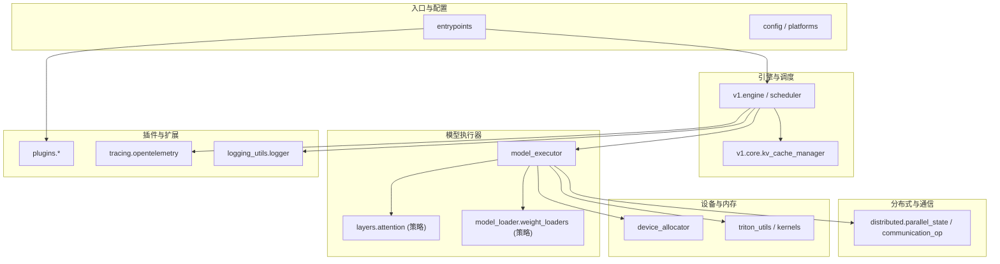
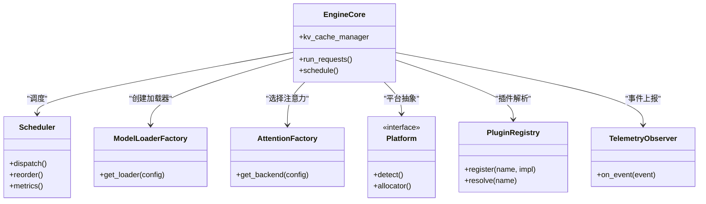
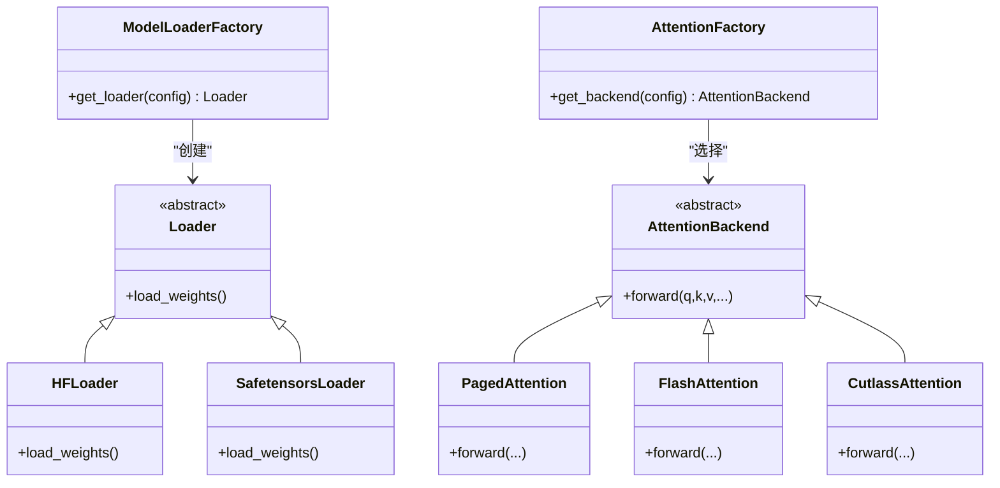
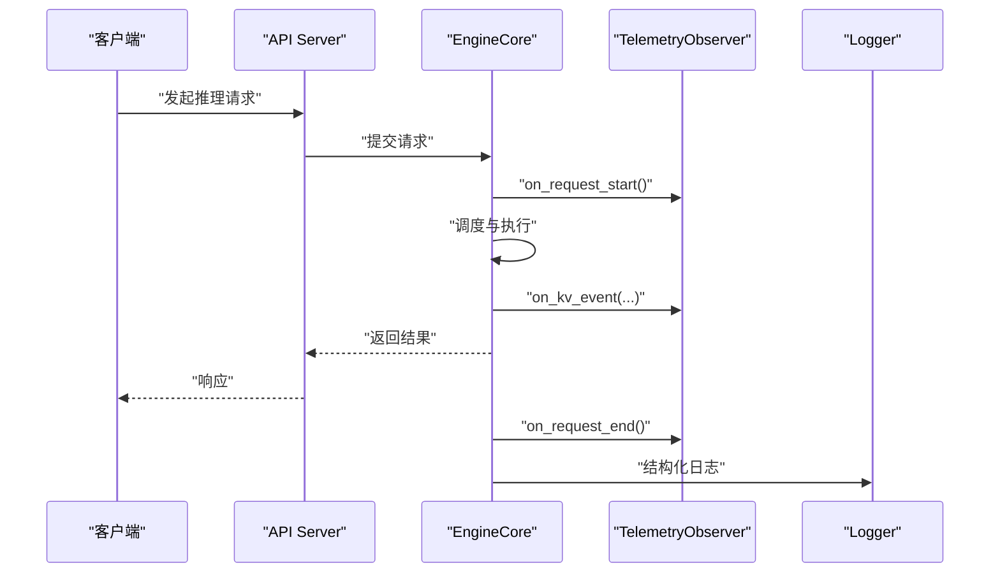
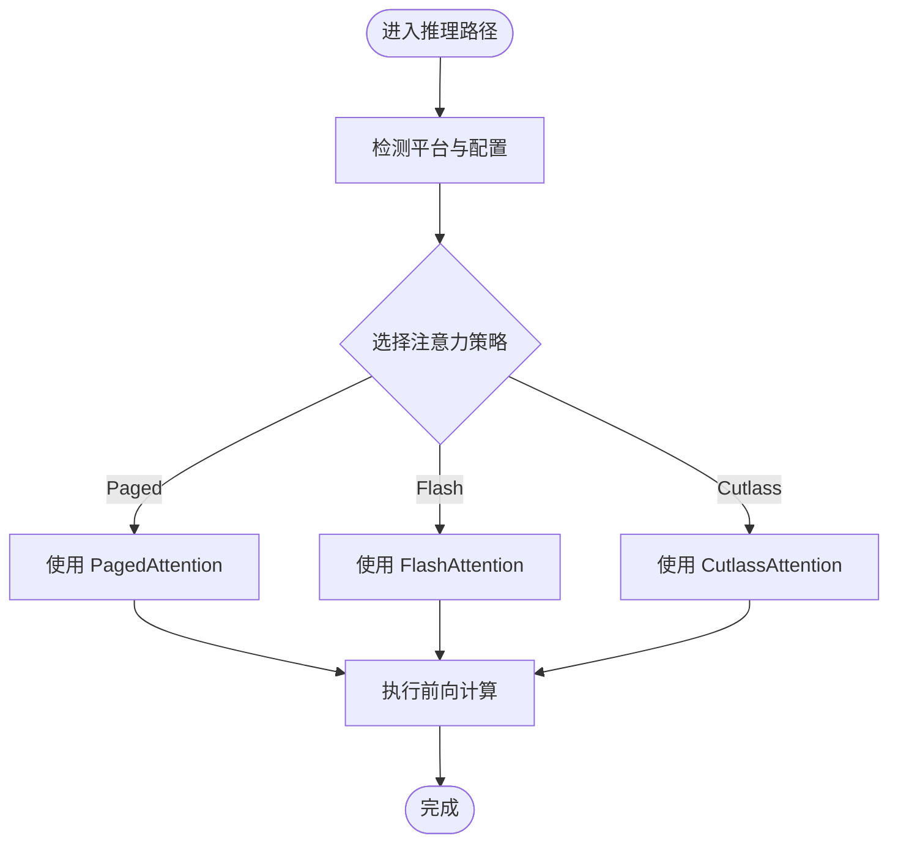
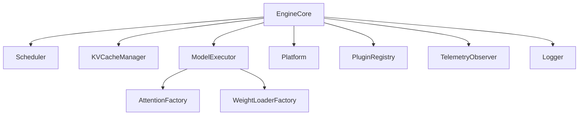

# 架构模式与设计原则

<cite>
**本文引用的文件**   
- [vllm/__init__.py](file://vllm/__init__.py)
- [vllm/engine/llm_engine.py](file://vllm/engine/llm_engine.py)
- [vllm/model_executor/model_loader/factory.py](file://vllm/model_executor/model_loader/factory.py)
- [vllm/model_executor/model_loader/loader.py](file://vllm/model_executor/model_loader/loader.py)
- [vllm/model_executor/model_loader/weight_loaders/base.py](file://vllm/model_executor/model_loader/weight_loaders/base.py)
- [vllm/model_executor/model_loader/weight_loaders/hf.py](file://vllm/model_executor/model_loader/weight_loaders/hf.py)
- [vllm/model_executor/model_loader/weight_loaders/safetensors.py](file://vllm/model_executor/model_loader/weight_loaders/safetensors.py)
- [vllm/model_executor/layers/attention/factory.py](file://vllm/model_executor/layers/attention/factory.py)
- [vllm/model_executor/layers/attention/base.py](file://vllm/model_executor/layers/attention/base.py)
- [vllm/model_executor/layers/attention/paged_attention.py](file://vllm/model_executor/layers/attention/paged_attention.py)
- [vllm/model_executor/layers/attention/flash_attn.py](file://vllm/model_executor/layers/attention/flash_attn.py)
- [vllm/model_executor/layers/attention/cutlass_attention.py](file://vllm/model_executor/layers/attention/cutlass_attention.py)
- [vllm/config.py](file://vllm/config.py)
- [vllm/platforms/__init__.py](file://vllm/platforms/__init__.py)
- [vllm/platforms/cpu.py](file://vllm/platforms/cpu.py)
- [vllm/platforms/cuda.py](file://vllm/platforms/cuda.py)
- [vllm/platforms/rocm.py](file://vllm/platforms/rocm.py)
- [vllm/platforms/xpu.py](file://vllm/platforms/xpu.py)
- [vllm/plugins/__init__.py](file://vllm/plugins/__init__.py)
- [vllm/plugins/io_processor.py](file://vllm/plugins/io_processor.py)
- [vllm/plugins/logits_processor.py](file://vllm/plugins/logits_processor.py)
- [vllm/plugins/lora_resolver.py](file://vllm/plugins/lora_resolver.py)
- [vllm/plugins/endpoint_plugin.py](file://vllm/plugins/endpoint_plugin.py)
- [vllm/tracing/opentelemetry.py](file://vllm/tracing/opentelemetry.py)
- [vllm/logging_utils/logger.py](file://vllm/logging_utils/logger.py)
- [vllm/utils.py](file://vllm/utils.py)
- [vllm/device_allocator/__init__.py](file://vllm/device_allocator/__init__.py)
- [vllm/device_allocator/cumem_allocator.py](file://vllm/device_allocator/cumem_allocator.py)
- [vllm/distributed/parallel_state.py](file://vllm/distributed/parallel_state.py)
- [vllm/distributed/communication_op.py](file://vllm/distributed/communication_op.py)
- [vllm/v1/core/kv_cache_manager.py](file://vllm/v1/core/kv_cache_manager.py)
- [vllm/v1/core/request_scheduler.py](file://vllm/v1/core/request_scheduler.py)
- [vllm/v1/core/scheduler.py](file://vllm/v1/core/scheduler.py)
- [vllm/v1/engine/engine_core.py](file://vllm/v1/engine/engine_core.py)
- [vllm/v1/engine/async_llm_engine.py](file://vllm/v1/engine/async_llm_engine.py)
- [vllm/entrypoints/openai/api_server.py](file://vllm/entrypoints/openai/api_server.py)
- [vllm/entrypoints/generate/generate.py](file://vllm/entrypoints/generate/generate.py)
- [setup.py](file://setup.py)
- [pyproject.toml](file://pyproject.toml)
</cite>

## 目录
1. [简介](#简介)
2. [项目结构](#项目结构)
3. [核心组件](#核心组件)
4. [架构总览](#架构总览)
5. [详细组件分析](#详细组件分析)
6. [依赖关系分析](#依赖关系分析)
7. [性能考量](#性能考量)
8. [故障排查指南](#故障排查指南)
9. [结论](#结论)
10. [附录](#附录)

## 简介
本文件系统性总结 vLLM 的架构模式与设计原则，重点围绕工厂模式在模型与注意力后端创建中的应用、观察者模式在事件与遥测处理中的使用、策略模式在算法选择（如注意力实现、量化、LoRA 解析等）中的体现。同时阐述模块化设计与松耦合的实现方式、可扩展性设计的关键技术与接口抽象、性能优化与内存管理最佳实践、跨平台兼容性方案，以及代码组织规范与命名约定。

## 项目结构
vLLM 采用分层与按功能域划分的组织方式：
- 顶层入口与配置：engine、entrypoints、config、platforms、plugins
- 模型执行器：model_executor（层、注意力、权重加载、调度）
- 分布式与通信：distributed
- 设备与内存：device_allocator、triton_utils、kernels
- v1 引擎与调度：v1（请求调度、KV 缓存、异步引擎）
- 插件体系：io_processor、logits_processor、lora_resolver、endpoint_plugin
- 遥测与日志：tracing、logging_utils
- 构建与依赖：setup.py、pyproject.toml、requirements、docker、cmake

图表来源
- [vllm/entrypoints/openai/api_server.py](file://vllm/entrypoints/openai/api_server.py)
- [vllm/v1/engine/engine_core.py](file://vllm/v1/engine/engine_core.py)
- [vllm/model_executor/layers/attention/factory.py](file://vllm/model_executor/layers/attention/factory.py)
- [vllm/model_executor/model_loader/factory.py](file://vllm/model_executor/model_loader/factory.py)
- [vllm/device_allocator/__init__.py](file://vllm/device_allocator/__init__.py)
- [vllm/tracing/opentelemetry.py](file://vllm/tracing/opentelemetry.py)

章节来源
- [setup.py](file://setup.py)
- [pyproject.toml](file://pyproject.toml)

## 核心组件
- 引擎与调度：v1 引擎负责请求生命周期、批调度、KV 缓存管理与异步接口；旧版 engine 提供兼容能力。
- 模型执行器：封装模型层、注意力实现、权重加载流程，通过工厂与策略解耦具体实现。
- 平台抽象：统一 CPU/CUDA/ROCm/XPU 等平台差异，屏蔽硬件细节。
- 插件体系：IO 处理器、Logits 处理器、LoRA 解析器、端点插件等，通过注册表与接口抽象实现热插拔。
- 分布式与通信：并行状态管理、集合通信操作封装，支持多卡/多进程推理。
- 设备与内存：自定义分配器（如 cuMem）、内存池与缓存策略，提升吞吐并降低碎片。
- 遥测与日志：OpenTelemetry 集成与结构化日志，便于可观测性与排障。

章节来源
- [vllm/v1/engine/engine_core.py](file://vllm/v1/engine/engine_core.py)
- [vllm/v1/core/scheduler.py](file://vllm/v1/core/scheduler.py)
- [vllm/model_executor/model_loader/factory.py](file://vllm/model_executor/model_loader/factory.py)
- [vllm/platforms/__init__.py](file://vllm/platforms/__init__.py)
- [vllm/plugins/__init__.py](file://vllm/plugins/__init__.py)
- [vllm/distributed/parallel_state.py](file://vllm/distributed/parallel_state.py)
- [vllm/device_allocator/cumem_allocator.py](file://vllm/device_allocator/cumem_allocator.py)
- [vllm/tracing/opentelemetry.py](file://vllm/tracing/opentelemetry.py)

## 架构总览
vLLM 以“引擎-执行器-平台-插件”的分层架构为核心，强调：
- 工厂模式：集中化对象创建（模型加载器、注意力后端、权重加载器），隐藏构造细节。
- 策略模式：算法与实现可替换（注意力内核、量化、LoRA 解析、端点）。
- 观察者模式：事件与遥测解耦（OpenTelemetry 钩子、KV 事件、调度事件）。
- 模块化与松耦合：通过接口与注册表组合，避免硬编码依赖。
- 可扩展性：插件注册、配置驱动、运行时切换。

图表来源
- [vllm/v1/engine/engine_core.py](file://vllm/v1/engine/engine_core.py)
- [vllm/v1/core/scheduler.py](file://vllm/v1/core/scheduler.py)
- [vllm/model_executor/model_loader/factory.py](file://vllm/model_executor/model_loader/factory.py)
- [vllm/model_executor/layers/attention/factory.py](file://vllm/model_executor/layers/attention/factory.py)
- [vllm/platforms/__init__.py](file://vllm/platforms/__init__.py)
- [vllm/plugins/__init__.py](file://vllm/plugins/__init__.py)
- [vllm/tracing/opentelemetry.py](file://vllm/tracing/opentelemetry.py)

## 详细组件分析

### 工厂模式：模型与注意力后端的创建
- 模型加载器工厂：根据配置与后端类型返回具体加载器实例，支持 HuggingFace、safetensors 等。
- 注意力后端工厂：依据配置与平台能力选择 paged_attention、flash_attn、cutlass_attention 等实现。
- 权重加载策略：通过基类与子类实现不同格式与路径的权重读取逻辑。

图表来源
- [vllm/model_executor/model_loader/factory.py](file://vllm/model_executor/model_loader/factory.py)
- [vllm/model_executor/model_loader/loader.py](file://vllm/model_executor/model_loader/loader.py)
- [vllm/model_executor/model_loader/weight_loaders/base.py](file://vllm/model_executor/model_loader/weight_loaders/base.py)
- [vllm/model_executor/model_loader/weight_loaders/hf.py](file://vllm/model_executor/model_loader/weight_loaders/hf.py)
- [vllm/model_executor/model_loader/weight_loaders/safetensors.py](file://vllm/model_executor/model_loader/weight_loaders/safetensors.py)
- [vllm/model_executor/layers/attention/factory.py](file://vllm/model_executor/layers/attention/factory.py)
- [vllm/model_executor/layers/attention/base.py](file://vllm/model_executor/layers/attention/base.py)
- [vllm/model_executor/layers/attention/paged_attention.py](file://vllm/model_executor/layers/attention/paged_attention.py)
- [vllm/model_executor/layers/attention/flash_attn.py](file://vllm/model_executor/layers/attention/flash_attn.py)
- [vllm/model_executor/layers/attention/cutlass_attention.py](file://vllm/model_executor/layers/attention/cutlass_attention.py)

章节来源
- [vllm/model_executor/model_loader/factory.py](file://vllm/model_executor/model_loader/factory.py)
- [vllm/model_executor/layers/attention/factory.py](file://vllm/model_executor/layers/attention/factory.py)

### 观察者模式：事件与遥测处理
- OpenTelemetry 集成：在关键路径埋点（请求开始/结束、调度、KV 缓存操作），通过观察者回调上报指标与追踪。
- KV 事件：KV 缓存的命中/缺失、预取、回收等事件由订阅者处理，用于监控与优化。
- 日志与结构化输出：统一日志接口，便于外部系统采集与分析。

图表来源
- [vllm/tracing/opentelemetry.py](file://vllm/tracing/opentelemetry.py)
- [vllm/logging_utils/logger.py](file://vllm/logging_utils/logger.py)
- [vllm/v1/engine/engine_core.py](file://vllm/v1/engine/engine_core.py)
- [vllm/entrypoints/openai/api_server.py](file://vllm/entrypoints/openai/api_server.py)

章节来源
- [vllm/tracing/opentelemetry.py](file://vllm/tracing/opentelemetry.py)
- [vllm/logging_utils/logger.py](file://vllm/logging_utils/logger.py)

### 策略模式：算法选择与可替换实现
- 注意力后端策略：根据配置与平台能力动态选择最优实现（Paged、Flash、Cutlass）。
- 权重加载策略：针对不同格式与存储位置选择合适加载器。
- LoRA 解析策略：按模型与适配器配置选择解析与融合路径。
- 端点插件策略：OpenAI/Anthropic 等端点行为通过插件实现。

图表来源
- [vllm/model_executor/layers/attention/factory.py](file://vllm/model_executor/layers/attention/factory.py)
- [vllm/model_executor/layers/attention/base.py](file://vllm/model_executor/layers/attention/base.py)
- [vllm/model_executor/layers/attention/paged_attention.py](file://vllm/model_executor/layers/attention/paged_attention.py)
- [vllm/model_executor/layers/attention/flash_attn.py](file://vllm/model_executor/layers/attention/flash_attn.py)
- [vllm/model_executor/layers/attention/cutlass_attention.py](file://vllm/model_executor/layers/attention/cutlass_attention.py)

章节来源
- [vllm/model_executor/layers/attention/factory.py](file://vllm/model_executor/layers/attention/factory.py)

### 模块化设计与松耦合架构
- 接口抽象：平台、注意力后端、权重加载器、插件均定义清晰接口，实现与调用方解耦。
- 注册表机制：插件与后端通过注册表动态发现与选择，避免硬编码。
- 配置驱动：通过配置文件与参数控制行为，支持运行时切换。
- 职责分离：引擎、调度、执行器、平台、插件各司其职，降低耦合度。

章节来源
- [vllm/platforms/__init__.py](file://vllm/platforms/__init__.py)
- [vllm/plugins/__init__.py](file://vllm/plugins/__init__.py)
- [vllm/config.py](file://vllm/config.py)

### 可扩展性设计的关键技术与接口抽象
- 插件接口：IO 处理器、Logits 处理器、LoRA 解析器、端点插件均提供标准接口与注册方法。
- 工厂与注册表：集中式创建与查找，支持新增实现无需修改调用方。
- 事件与遥测：通过观察者模式扩展监控与诊断能力。
- 平台抽象：统一 CPU/CUDA/ROCm/XPU 的差异，便于新平台接入。

章节来源
- [vllm/plugins/io_processor.py](file://vllm/plugins/io_processor.py)
- [vllm/plugins/logits_processor.py](file://vllm/plugins/logits_processor.py)
- [vllm/plugins/lora_resolver.py](file://vllm/plugins/lora_resolver.py)
- [vllm/plugins/endpoint_plugin.py](file://vllm/plugins/endpoint_plugin.py)
- [vllm/platforms/cpu.py](file://vllm/platforms/cpu.py)
- [vllm/platforms/cuda.py](file://vllm/platforms/cuda.py)
- [vllm/platforms/rocm.py](file://vllm/platforms/rocm.py)
- [vllm/platforms/xpu.py](file://vllm/platforms/xpu.py)

### 性能优化的设计模式与内存管理最佳实践
- 注意力内核选择：优先选择高性能后端（Flash/Cutlass），回退到通用实现。
- KV 缓存管理：分页与复用减少内存分配，提高吞吐。
- 自定义分配器：cuMem 等分配器优化显存使用，降低碎片。
- 批调度与重排序：最大化 GPU 利用率，减少上下文切换。
- 编译与图优化：Torch Compile、CUDA Graphs 等加速前向路径。

章节来源
- [vllm/v1/core/kv_cache_manager.py](file://vllm/v1/core/kv_cache_manager.py)
- [vllm/device_allocator/cumem_allocator.py](file://vllm/device_allocator/cumem_allocator.py)
- [vllm/v1/core/scheduler.py](file://vllm/v1/core/scheduler.py)
- [vllm/model_executor/layers/attention/factory.py](file://vllm/model_executor/layers/attention/factory.py)

### 跨平台兼容性的设计考虑与技术方案
- 平台抽象层：统一 detect、allocator、特性查询等方法，屏蔽底层差异。
- 条件编译与运行时检测：根据可用库与硬件能力选择实现。
- Docker 与构建脚本：多平台镜像与依赖管理，确保一致性。
- 测试矩阵：覆盖 CPU/CUDA/ROCm/XPU 等多环境验证。

章节来源
- [vllm/platforms/__init__.py](file://vllm/platforms/__init__.py)
- [vllm/platforms/cpu.py](file://vllm/platforms/cpu.py)
- [vllm/platforms/cuda.py](file://vllm/platforms/cuda.py)
- [vllm/platforms/rocm.py](file://vllm/platforms/rocm.py)
- [vllm/platforms/xpu.py](file://vllm/platforms/xpu.py)

### 代码组织规范与命名约定
- 模块划分：按功能域组织（engine、model_executor、platforms、plugins、distributed、device_allocator、tracing、logging_utils）。
- 命名风格：类名大驼峰，函数与变量小写蛇形，常量全大写蛇形。
- 接口设计：抽象基类明确契约，工厂与注册表统一管理。
- 文档与示例：README、docs、examples 提供使用与贡献指南。

章节来源
- [vllm/__init__.py](file://vllm/__init__.py)
- [setup.py](file://setup.py)
- [pyproject.toml](file://pyproject.toml)

## 依赖关系分析
- 引擎依赖调度与 KV 管理器，调度依赖执行器与资源分配器。
- 执行器依赖注意力工厂与权重加载工厂，二者再依赖具体策略实现。
- 平台抽象被引擎与执行器共同使用，插件体系为引擎与端点扩展能力。
- 遥测与日志贯穿各层，提供可观测性。

图表来源
- [vllm/v1/engine/engine_core.py](file://vllm/v1/engine/engine_core.py)
- [vllm/v1/core/scheduler.py](file://vllm/v1/core/scheduler.py)
- [vllm/v1/core/kv_cache_manager.py](file://vllm/v1/core/kv_cache_manager.py)
- [vllm/model_executor/layers/attention/factory.py](file://vllm/model_executor/layers/attention/factory.py)
- [vllm/model_executor/model_loader/factory.py](file://vllm/model_executor/model_loader/factory.py)
- [vllm/platforms/__init__.py](file://vllm/platforms/__init__.py)
- [vllm/plugins/__init__.py](file://vllm/plugins/__init__.py)
- [vllm/tracing/opentelemetry.py](file://vllm/tracing/opentelemetry.py)
- [vllm/logging_utils/logger.py](file://vllm/logging_utils/logger.py)

章节来源
- [vllm/v1/engine/engine_core.py](file://vllm/v1/engine/engine_core.py)
- [vllm/model_executor/layers/attention/factory.py](file://vllm/model_executor/layers/attention/factory.py)
- [vllm/model_executor/model_loader/factory.py](file://vllm/model_executor/model_loader/factory.py)

## 性能考量
- 注意力后端选择：优先 Flash/Cutlass，回退到 Paged，确保在不同硬件上获得最佳性能。
- KV 缓存分页与复用：减少分配开销，提升批处理能力。
- 自定义分配器：利用 cuMem 等高级分配器优化显存使用。
- 批调度与重排序：最大化 GPU 利用率，减少同步与切换成本。
- 编译与图优化：结合 Torch Compile 与 CUDA Graphs 加速热点路径。

[本节为通用指导，不直接分析具体文件]

## 故障排查指南
- 遥测与日志：检查 OpenTelemetry 指标与结构化日志，定位请求瓶颈与异常。
- 平台检测：确认平台识别与能力探测是否正确，必要时调整配置或环境变量。
- 插件注册：验证插件是否成功注册与解析，检查接口契约与依赖。
- 内存与分配器：观察显存占用与碎片情况，调整分配器与缓存策略。
- 分布式通信：检查并行状态与通信操作是否正常，排查网络与进程问题。

章节来源
- [vllm/tracing/opentelemetry.py](file://vllm/tracing/opentelemetry.py)
- [vllm/logging_utils/logger.py](file://vllm/logging_utils/logger.py)
- [vllm/platforms/__init__.py](file://vllm/platforms/__init__.py)
- [vllm/plugins/__init__.py](file://vllm/plugins/__init__.py)
- [vllm/device_allocator/cumem_allocator.py](file://vllm/device_allocator/cumem_allocator.py)
- [vllm/distributed/parallel_state.py](file://vllm/distributed/parallel_state.py)
- [vllm/distributed/communication_op.py](file://vllm/distributed/communication_op.py)

## 结论
vLLM 通过工厂模式、策略模式与观察者模式构建了高内聚、低耦合的可扩展架构。模块化设计与接口抽象使得注意力后端、权重加载、插件与平台均可替换与扩展。性能优化与内存管理策略显著提升了推理吞吐与资源利用率。跨平台兼容性与严格的代码组织规范保障了在多环境与多团队下的可维护性与可演进性。

[本节为总结性内容，不直接分析具体文件]

## 附录
- 入口与示例：openai api_server、generate CLI 等提供使用样例。
- 构建与依赖：setup.py、pyproject.toml、requirements、docker 文件说明构建与部署。
- 文档与贡献：docs、CONTRIBUTING、CODE_OF_CONDUCT 等提供开发与协作指南。

章节来源
- [vllm/entrypoints/openai/api_server.py](file://vllm/entrypoints/openai/api_server.py)
- [vllm/entrypoints/generate/generate.py](file://vllm/entrypoints/generate/generate.py)
- [setup.py](file://setup.py)
- [pyproject.toml](file://pyproject.toml)