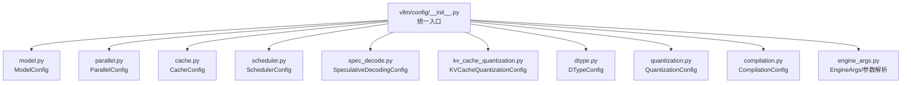
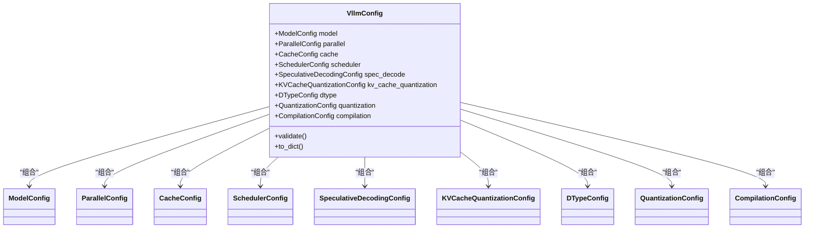
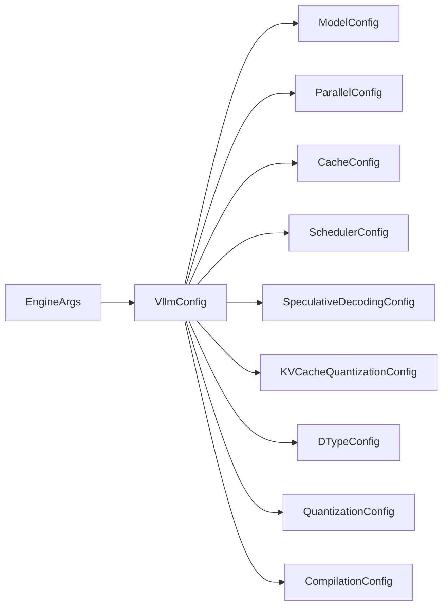

# Config模块架构

<cite>
**本文引用的文件**   
- [vllm/config/__init__.py](file://vllm/config/__init__.py)
- [vllm/config/model.py](file://vllm/config/model.py)
- [vllm/config/parallel.py](file://vllm/config/parallel.py)
- [vllm/config/cache.py](file://vllm/config/cache.py)
- [vllm/config/scheduler.py](file://vllm/config/scheduler.py)
- [vllm/config/spec_decode.py](file://vllm/config/spec_decode.py)
- [vllm/config/kv_cache_quantization.py](file://vllm/config/kv_cache_quantization.py)
- [vllm/config/dtype.py](file://vllm/config/dtype.py)
- [vllm/config/quantization.py](file://vllm/config/quantization.py)
- [vllm/config/compilation.py](file://vllm/config/compilation.py)
- [vllm/config/engine_args.py](file://vllm/config/engine_args.py)
- [tests/test_config.py](file://tests/test_config.py)
- [tests/config/test_config_generation.py](file://tests/config/test_config_generation.py)
- [tests/config/test_config_utils.py](file://tests/config/test_config_utils.py)
</cite>

## 目录
1. [简介](#简介)
2. [项目结构](#项目结构)
3. [核心组件](#核心组件)
4. [架构总览](#架构总览)
5. [详细组件分析](#详细组件分析)
6. [依赖关系分析](#依赖关系分析)
7. [性能考量](#性能考量)
8. [故障排查指南](#故障排查指南)
9. [结论](#结论)
10. [附录](#附录)

## 简介
本文件系统性解析 vLLM 的 Config 模块架构设计，聚焦配置系统的设计模式与参数管理机制。重点说明 VllmConfig、ModelConfig、ParallelConfig 等关键配置类的作用、继承关系、验证规则与默认值处理，并阐述配置参数的优先级与覆盖机制。最后给出最佳实践与常见配置场景示例，帮助读者快速掌握如何正确配置 vLLM 引擎以获得稳定且高性能的运行效果。

## 项目结构
vLLM 的配置体系集中在 vllm/config 目录下，采用“按领域拆分 + 统一聚合”的组织方式：
- 领域化配置类：模型、并行、缓存、调度、推测解码、量化、编译、数据类型等各自独立文件，职责清晰。
- 统一入口：通过 __init__.py 暴露顶层配置对象（如 VllmConfig），对外提供一致的构造与访问接口。
- 测试与生成：tests 下包含对配置生成、校验、工具函数的专项测试，确保配置一致性与可维护性。

图表来源
- [vllm/config/__init__.py](file://vllm/config/__init__.py)
- [vllm/config/model.py](file://vllm/config/model.py)
- [vllm/config/parallel.py](file://vllm/config/parallel.py)
- [vllm/config/cache.py](file://vllm/config/cache.py)
- [vllm/config/scheduler.py](file://vllm/config/scheduler.py)
- [vllm/config/spec_decode.py](file://vllm/config/spec_decode.py)
- [vllm/config/kv_cache_quantization.py](file://vllm/config/kv_cache_quantization.py)
- [vllm/config/dtype.py](file://vllm/config/dtype.py)
- [vllm/config/quantization.py](file://vllm/config/quantization.py)
- [vllm/config/compilation.py](file://vllm/config/compilation.py)
- [vllm/config/engine_args.py](file://vllm/config/engine_args.py)

章节来源
- [vllm/config/__init__.py](file://vllm/config/__init__.py)
- [vllm/config/model.py](file://vllm/config/model.py)
- [vllm/config/parallel.py](file://vllm/config/parallel.py)
- [vllm/config/cache.py](file://vllm/config/cache.py)
- [vllm/config/scheduler.py](file://vllm/config/scheduler.py)
- [vllm/config/spec_decode.py](file://vllm/config/spec_decode.py)
- [vllm/config/kv_cache_quantization.py](file://vllm/config/kv_cache_quantization.py)
- [vllm/config/dtype.py](file://vllm/config/dtype.py)
- [vllm/config/quantization.py](file://vllm/config/quantization.py)
- [vllm/config/compilation.py](file://vllm/config/compilation.py)
- [vllm/config/engine_args.py](file://vllm/config/engine_args.py)

## 核心组件
- VllmConfig：顶层配置聚合器，组合 ModelConfig、ParallelConfig、CacheConfig、SchedulerConfig、SpeculativeDecodingConfig、KVCacheQuantizationConfig、DTypeConfig、QuantizationConfig、CompilationConfig 等子配置，并提供统一的构建、校验与导出能力。
- ModelConfig：描述模型相关参数（如模型路径、上下文长度、注意力后端、权重加载策略等）。
- ParallelConfig：描述分布式并行策略（张量并行、流水线并行、上下文并行、专家并行等）及通信后端。
- CacheConfig：描述 KV 缓存布局、块大小、前缀缓存、GPU/CPU 内存比例等。
- SchedulerConfig：描述请求调度策略、批大小、最大序列长度、延迟优化等。
- SpeculativeDecodingConfig：描述推测解码相关参数（草稿模型、采样策略等）。
- KVCacheQuantizationConfig：描述 KV 缓存量化策略与精度。
- DTypeConfig：描述主计算与中间表示的数据类型。
- QuantizationConfig：描述模型权重量化方案与后端。
- CompilationConfig：描述编译选项（图编译、算子融合、TorchCompile 等）。

这些组件共同构成 vLLM 的配置域模型，遵循“强校验 + 明确默认值 + 可扩展”的设计原则。

章节来源
- [vllm/config/__init__.py](file://vllm/config/__init__.py)
- [vllm/config/model.py](file://vllm/config/model.py)
- [vllm/config/parallel.py](file://vllm/config/parallel.py)
- [vllm/config/cache.py](file://vllm/config/cache.py)
- [vllm/config/scheduler.py](file://vllm/config/scheduler.py)
- [vllm/config/spec_decode.py](file://vllm/config/spec_decode.py)
- [vllm/config/kv_cache_quantization.py](file://vllm/config/kv_cache_quantization.py)
- [vllm/config/dtype.py](file://vllm/config/dtype.py)
- [vllm/config/quantization.py](file://vllm/config/quantization.py)
- [vllm/config/compilation.py](file://vllm/config/compilation.py)

## 架构总览
下图展示了配置系统的整体结构与数据流向：从 EngineArgs/外部输入到各子配置对象的构建、校验与合并，最终形成稳定的运行时配置。

图表来源
- [vllm/config/__init__.py](file://vllm/config/__init__.py)
- [vllm/config/model.py](file://vllm/config/model.py)
- [vllm/config/parallel.py](file://vllm/config/parallel.py)
- [vllm/config/cache.py](file://vllm/config/cache.py)
- [vllm/config/scheduler.py](file://vllm/config/scheduler.py)
- [vllm/config/spec_decode.py](file://vllm/config/spec_decode.py)
- [vllm/config/kv_cache_quantization.py](file://vllm/config/kv_cache_quantization.py)
- [vllm/config/dtype.py](file://vllm/config/dtype.py)
- [vllm/config/quantization.py](file://vllm/config/quantization.py)
- [vllm/config/compilation.py](file://vllm/config/compilation.py)

## 详细组件分析

### VllmConfig：顶层配置聚合器
- 职责：聚合所有子配置，提供统一的构建、校验与序列化接口；协调跨子配置的约束检查（例如并行策略与硬件资源的匹配）。
- 设计要点：
  - 组合优于继承：通过组合多个领域配置对象，避免单一巨型类膨胀。
  - 强校验：在构造或显式调用 validate 时进行一致性检查，尽早失败。
  - 可导出：支持 to_dict 等方法，便于日志记录、调试与持久化。
- 典型流程：
  - 接收来自 EngineArgs/CLI/环境变量 的参数。
  - 实例化各子配置对象，应用默认值与覆盖逻辑。
  - 执行跨字段校验，抛出明确的错误信息。
  - 输出稳定可用的配置对象供引擎使用。

章节来源
- [vllm/config/__init__.py](file://vllm/config/__init__.py)
- [tests/test_config.py](file://tests/test_config.py)

### ModelConfig：模型相关配置
- 职责：管理模型路径、上下文长度、注意力后端、权重加载策略、多模态相关开关等。
- 关键点：
  - 默认值：根据模型特性与平台能力设置合理默认值。
  - 校验：确保上下文长度、注意力后端与模型兼容。
  - 扩展点：预留多模态、LoRA、PEFT 等扩展字段。
- 与其他组件的关系：
  - 与 QuantizationConfig/DTypeConfig 协同决定权重与中间表示精度。
  - 与 ParallelConfig 协同决定模型切分与加载策略。

章节来源
- [vllm/config/model.py](file://vllm/config/model.py)
- [tests/config/test_config_generation.py](file://tests/config/test_config_generation.py)

### ParallelConfig：并行策略配置
- 职责：定义张量并行、流水线并行、上下文并行、专家并行等维度与通信后端。
- 关键点：
  - 默认值：根据可用设备数与拓扑自动推断合理的并行度。
  - 校验：确保并行维度乘积不超过设备总数，避免冲突。
  - 兼容性：与 AttentionBackend、KVCacheLayout 等相互约束。
- 与其他组件的关系：
  - 影响 CacheConfig（KV 分布）、SchedulerConfig（批调度粒度）、CompilationConfig（图编译范围）。

章节来源
- [vllm/config/parallel.py](file://vllm/config/parallel.py)
- [tests/config/test_config_utils.py](file://tests/config/test_config_utils.py)

### CacheConfig：KV 缓存配置
- 职责：管理 KV 缓存布局、块大小、前缀缓存、GPU/CPU 内存比例、压缩策略等。
- 关键点：
  - 默认值：依据模型上下文长度与硬件内存容量设定。
  - 校验：确保块大小与对齐要求、内存上限不越界。
  - 优化：支持前缀缓存命中、动态扩容与卸载策略。
- 与其他组件的关系：
  - 受 ParallelConfig 影响（KV 分布与复制策略）。
  - 与 QuantizationConfig/KVCacheQuantizationConfig 协同控制精度与存储占用。

章节来源
- [vllm/config/cache.py](file://vllm/config/cache.py)
- [tests/config/test_multimodal_config.py](file://tests/config/test_multimodal_config.py)

### SchedulerConfig：调度策略配置
- 职责：定义请求调度算法、批大小、最大序列长度、延迟优化开关等。
- 关键点：
  - 默认值：根据吞吐与延迟目标选择合适策略。
  - 校验：确保批大小与资源限制一致，避免 OOM。
  - 扩展：支持多种调度器实现与插件。
- 与其他组件的关系：
  - 与 CacheConfig 协同决定批内 KV 复用效率。
  - 与 ParallelConfig 协同影响跨进程调度粒度。

章节来源
- [vllm/config/scheduler.py](file://vllm/config/scheduler.py)
- [tests/config/test_speculative_draft_hf_overrides.py](file://tests/config/test_speculative_draft_hf_overrides.py)

### SpeculativeDecodingConfig：推测解码配置
- 职责：管理草稿模型、采样策略、回退策略等。
- 关键点：
  - 默认值：基于主模型与草稿模型的匹配情况设置。
  - 校验：确保草稿模型与主模型 token 空间一致。
  - 性能：权衡加速比与额外开销。
- 与其他组件的关系：
  - 与 ModelConfig 的模型选择紧密相关。
  - 与 SchedulerConfig 协同调整批内推测步长。

章节来源
- [vllm/config/spec_decode.py](file://vllm/config/spec_decode.py)
- [tests/config/test_bailing_mtp_config.py](file://tests/config/test_bailing_mtp_config.py)

### KVCacheQuantizationConfig：KV 缓存量化配置
- 职责：定义 KV 缓存量化方案（如 per-token/per-channel）、精度与校准策略。
- 关键点：
  - 默认值：根据硬件与模型特性选择合适量化格式。
  - 校验：确保与后端内核兼容。
  - 收益：显著降低内存占用与带宽压力。
- 与其他组件的关系：
  - 与 QuantizationConfig 区分（后者针对权重，前者针对 KV）。
  - 与 CacheConfig 协同控制存储布局与访问模式。

章节来源
- [vllm/config/kv_cache_quantization.py](file://vllm/config/kv_cache_quantization.py)
- [tests/config/test_config_utils.py](file://tests/config/test_config_utils.py)

### DTypeConfig：数据类型配置
- 职责：定义主计算与中间表示的数据类型（如 FP16/BF16/FP32）。
- 关键点：
  - 默认值：根据硬件能力与模型需求选择。
  - 校验：确保与 AttentionBackend、Kernels 兼容。
  - 性能：平衡精度与速度。
- 与其他组件的关系：
  - 与 QuantizationConfig、KVCacheQuantizationConfig 协同决定整体精度链。

章节来源
- [vllm/config/dtype.py](file://vllm/config/dtype.py)
- [tests/config/test_config_generation.py](file://tests/config/test_config_generation.py)

### QuantizationConfig：权重量化配置
- 职责：定义模型权重量化方案（如 INT8/AWQ/GPTQ 等）与后端。
- 关键点：
  - 默认值：根据模型与硬件选择最优量化路径。
  - 校验：确保量化方法与模型层结构兼容。
  - 加载：与权重加载器协同完成量化权重读取与转换。
- 与其他组件的关系：
  - 与 ModelConfig 的模型选择、DTypeConfig 的计算精度联动。

章节来源
- [vllm/config/quantization.py](file://vllm/config/quantization.py)
- [tests/config/test_model_arch_config.py](file://tests/config/test_model_arch_config.py)

### CompilationConfig：编译配置
- 职责：管理图编译、算子融合、TorchCompile 等编译选项。
- 关键点：
  - 默认值：根据运行环境与模型复杂度选择保守或激进策略。
  - 校验：确保编译目标与后端内核一致。
  - 性能：减少启动时间 vs 提升推理速度的权衡。
- 与其他组件的关系：
  - 与 ParallelConfig、CacheConfig 的布局与通信模式密切相关。

章节来源
- [vllm/config/compilation.py](file://vllm/config/compilation.py)
- [tests/config/test_config_utils.py](file://tests/config/test_config_utils.py)

### EngineArgs：参数解析与优先级
- 职责：负责从 CLI、环境变量、配置文件等多源输入解析参数，并应用到各子配置。
- 关键点：
  - 优先级：通常顺序为“显式参数 > 配置文件 > 环境变量 > 默认值”。
  - 覆盖机制：后级覆盖前级，确保最终配置确定性。
  - 校验：在解析阶段进行基础合法性检查，减少后续错误。
- 与其他组件的关系：
  - 作为 VllmConfig 的输入源，驱动各子配置的构建与合并。

章节来源
- [vllm/config/engine_args.py](file://vllm/config/engine_args.py)
- [tests/test_config.py](file://tests/test_config.py)

## 依赖关系分析
配置模块内部依赖关系清晰，遵循“低耦合、高内聚”的原则：
- VllmConfig 作为聚合根，依赖各子配置对象，但不反向被依赖。
- 子配置之间尽量避免直接依赖，必要时通过 VllmConfig 进行协调校验。
- EngineArgs 作为输入层，依赖各子配置的构造器与校验方法。

图表来源
- [vllm/config/engine_args.py](file://vllm/config/engine_args.py)
- [vllm/config/__init__.py](file://vllm/config/__init__.py)
- [vllm/config/model.py](file://vllm/config/model.py)
- [vllm/config/parallel.py](file://vllm/config/parallel.py)
- [vllm/config/cache.py](file://vllm/config/cache.py)
- [vllm/config/scheduler.py](file://vllm/config/scheduler.py)
- [vllm/config/spec_decode.py](file://vllm/config/spec_decode.py)
- [vllm/config/kv_cache_quantization.py](file://vllm/config/kv_cache_quantization.py)
- [vllm/config/dtype.py](file://vllm/config/dtype.py)
- [vllm/config/quantization.py](file://vllm/config/quantization.py)
- [vllm/config/compilation.py](file://vllm/config/compilation.py)

章节来源
- [vllm/config/engine_args.py](file://vllm/config/engine_args.py)
- [vllm/config/__init__.py](file://vllm/config/__init__.py)

## 性能考量
- 默认值选择：优先保证稳定性与通用性，同时兼顾常见硬件与模型的性能表现。
- 内存与带宽：通过 KV 缓存量化、前缀缓存、CPU/GPU 内存比例调节等手段降低内存占用与带宽压力。
- 并行与调度：合理设置并行维度与批大小，避免过度切分导致通信开销增大。
- 编译优化：根据模型规模与部署环境选择适当的编译策略，平衡启动时间与推理速度。

[本节为通用指导，无需特定文件引用]

## 故障排查指南
- 常见错误类型：
  - 参数冲突：如并行维度与设备数不一致、注意力后端与模型不兼容。
  - 内存不足：KV 缓存块过大、批大小过高、量化未启用。
  - 类型不匹配：数据类型与后端内核不支持。
- 排查步骤：
  - 检查 EngineArgs 输入优先级与覆盖顺序，确认最终生效参数。
  - 查看 VllmConfig.validate 的错误信息，定位具体字段。
  - 逐步放宽配置（如减小批大小、关闭量化）以隔离问题。
  - 利用测试用例中的断言与日志辅助定位。
- 参考测试：
  - tests/test_config.py：覆盖配置构建与校验的核心用例。
  - tests/config/*：针对特定配置领域的边界条件与异常路径。

章节来源
- [tests/test_config.py](file://tests/test_config.py)
- [tests/config/test_config_generation.py](file://tests/config/test_config_generation.py)
- [tests/config/test_config_utils.py](file://tests/config/test_config_utils.py)

## 结论
vLLM 的 Config 模块通过清晰的领域划分与强校验机制，实现了高内聚、低耦合的配置系统。VllmConfig 作为聚合根，协调各子配置对象，确保参数的一致性与合理性。EngineArgs 提供灵活的输入与优先级覆盖机制，便于在不同部署场景中快速适配。遵循本文的最佳实践与常见场景示例，可有效提升配置的正确性与运行性能。

[本节为总结性内容，无需特定文件引用]

## 附录
- 最佳实践建议：
  - 明确业务目标（吞吐优先/延迟优先），据此选择并行、调度与编译策略。
  - 启用 KV 缓存量化与前缀缓存以降低内存占用。
  - 谨慎调整批大小与上下文长度，避免 OOM。
  - 使用测试用例验证配置变更的影响。
- 常见配置场景示例：
  - 单卡大模型推理：适当提高批大小，启用前缀缓存与 KV 量化。
  - 多卡并行：合理设置张量/流水线并行维度，确保通信效率。
  - 低延迟服务：减小批大小，启用图编译与算子融合。
  - 高吞吐离线推理：增大批大小，启用 KV 缓存压缩与 CPU 卸载。

[本节为概念性内容，无需特定文件引用]