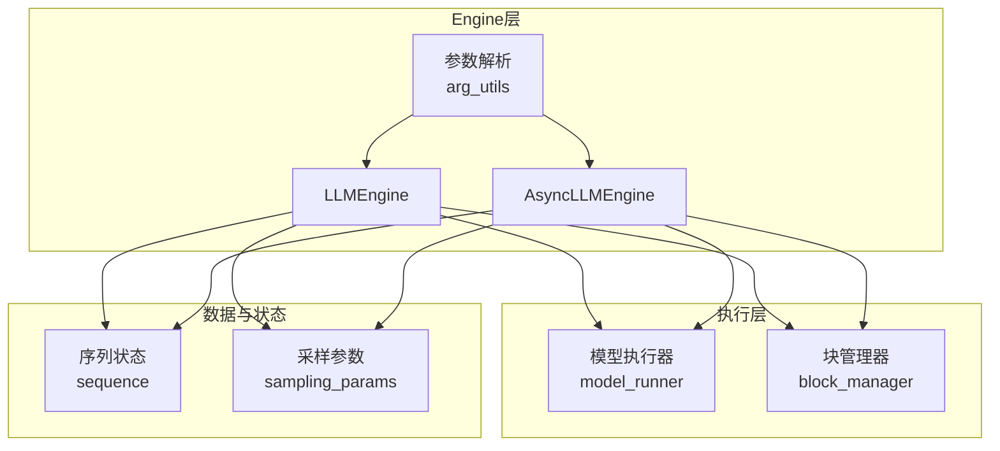
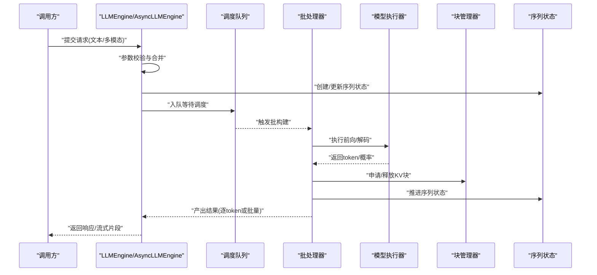
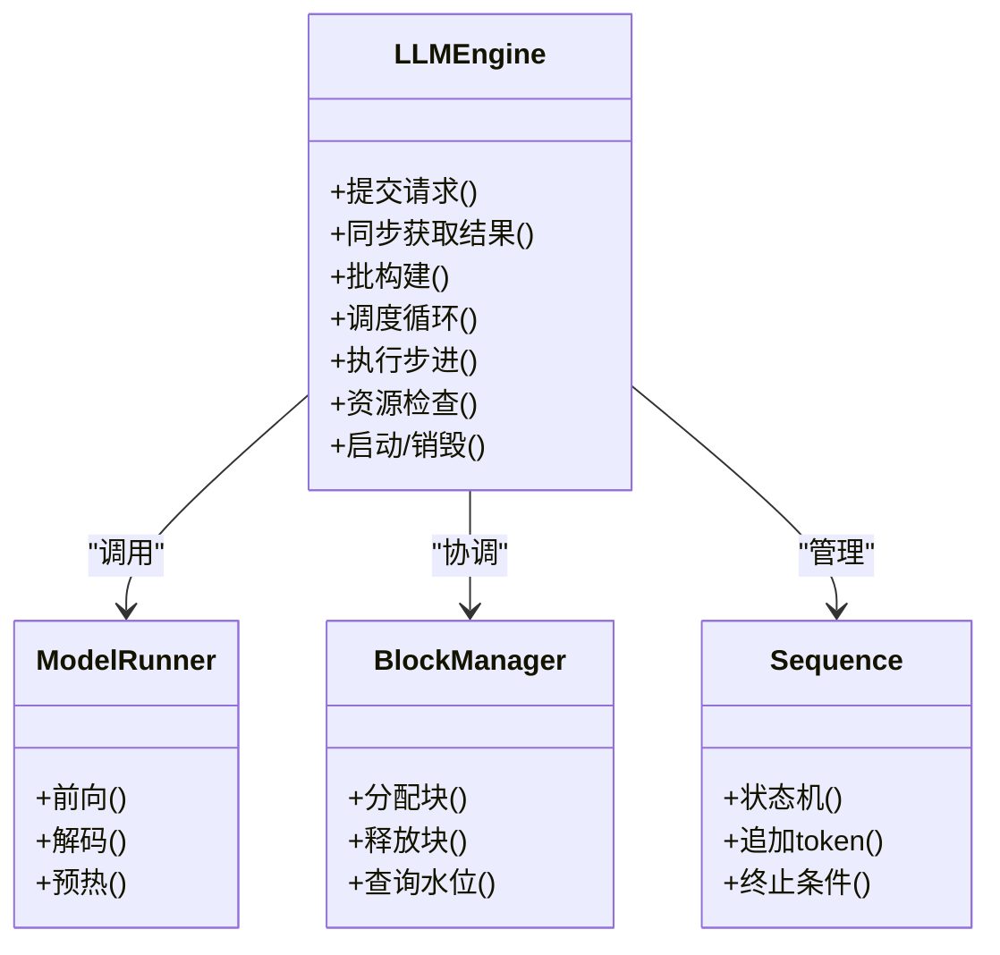
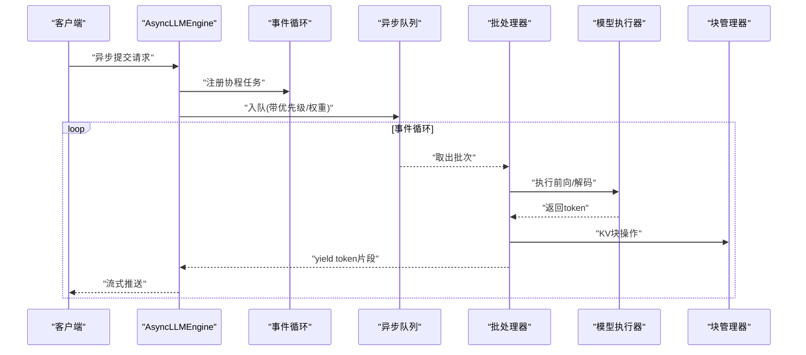
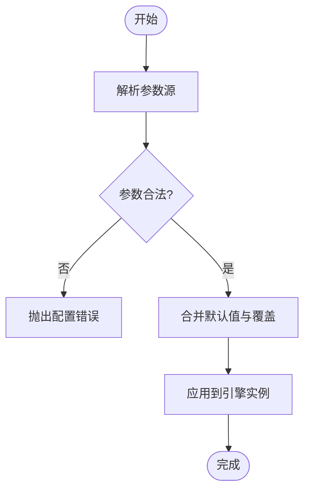
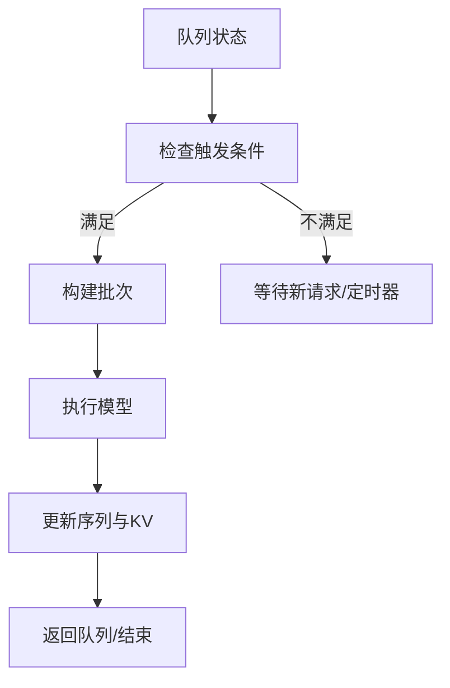
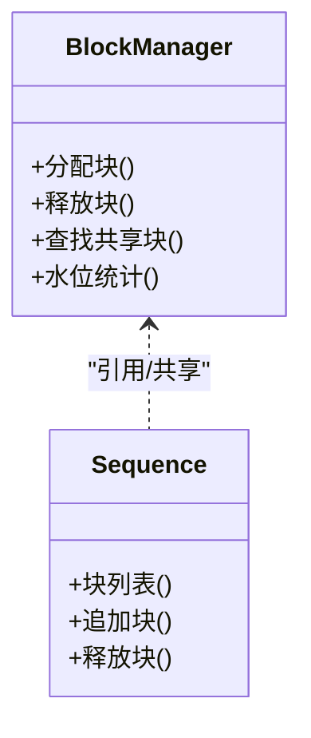
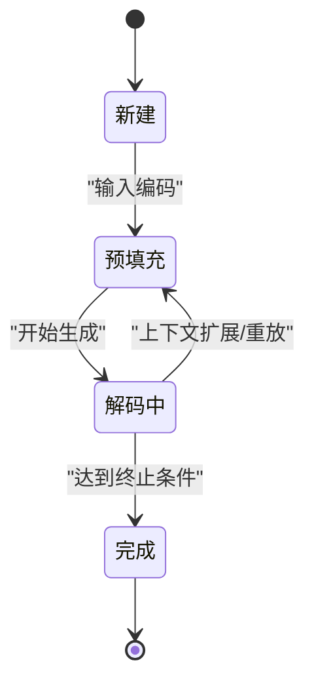
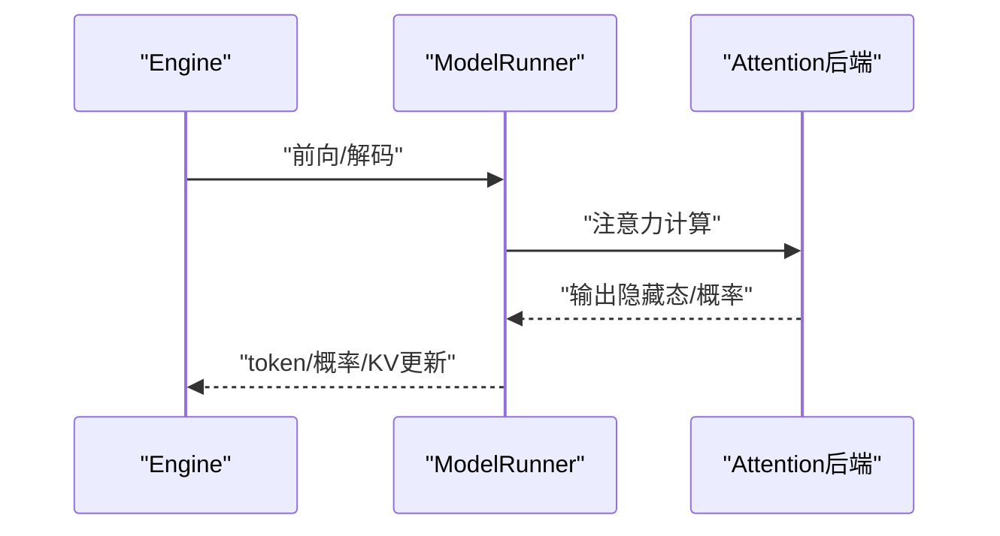
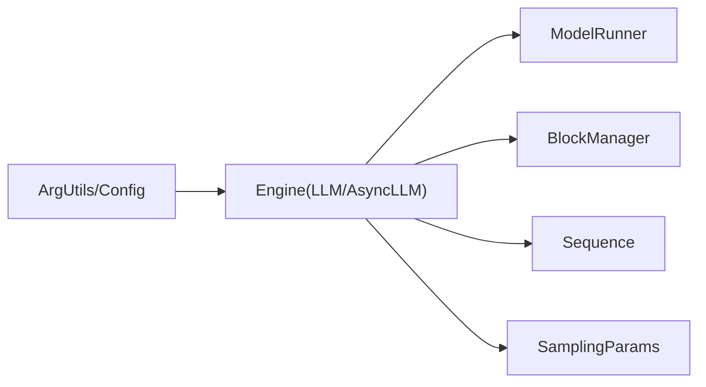

# Engine模块架构

<cite>
**本文引用的文件**   
- [vllm/engine/llm_engine.py](file://vllm/engine/llm_engine.py)
- [vllm/engine/async_llm_engine.py](file://vllm/engine/async_llm_engine.py)
- [vllm/engine/arg_utils.py](file://vllm/engine/arg_utils.py)
- [vllm/config.py](file://vllm/config.py)
- [vllm/model_executor/model_runner.py](file://vllm/model_executor/model_runner.py)
- [vllm/core/block_manager.py](file://vllm/core/block_manager.py)
- [vllm/sampling_params.py](file://vllm/sampling_params.py)
- [vllm/sequence.py](file://vllm/sequence.py)
- [examples/deployment/llm_engine_example.py](file://examples/deployment/llm_engine_example.py)
</cite>

## 目录
1. [简介](#简介)
2. [项目结构](#项目结构)
3. [核心组件](#核心组件)
4. [架构总览](#架构总览)
5. [详细组件分析](#详细组件分析)
6. [依赖关系分析](#依赖关系分析)
7. [性能考量](#性能考量)
8. [故障排查指南](#故障排查指南)
9. [结论](#结论)
10. [附录](#附录)

## 简介
本文件系统性解析 vLLM 的 Engine 模块架构，重点围绕 LLMEngine 与 AsyncLLMEngine 的职责边界、请求调度、批处理管理、内存分配（KV Cache）与生命周期控制展开。文档同时给出从请求接收到响应返回的完整推理流程，解释异步处理机制与并发控制策略，并总结关键方法的调用序列与状态转换，最后提供引擎配置参数说明与性能调优建议，帮助读者快速理解与高效使用。

## 项目结构
Engine 模块位于 vllm/engine 目录下，核心入口为 LLMEngine 与 AsyncLLMEngine；参数解析集中在 arg_utils；模型执行由 model_runner 驱动；块级内存管理由 block_manager 负责；采样与序列状态由 sampling_params 与 sequence 定义。示例代码展示了典型用法。

**图示来源** 
- [vllm/engine/llm_engine.py](file://vllm/engine/llm_engine.py)
- [vllm/engine/async_llm_engine.py](file://vllm/engine/async_llm_engine.py)
- [vllm/engine/arg_utils.py](file://vllm/engine/arg_utils.py)
- [vllm/model_executor/model_runner.py](file://vllm/model_executor/model_runner.py)
- [vllm/core/block_manager.py](file://vllm/core/block_manager.py)
- [vllm/sampling_params.py](file://vllm/sampling_params.py)
- [vllm/sequence.py](file://vllm/sequence.py)

**章节来源**
- [vllm/engine/llm_engine.py](file://vllm/engine/llm_engine.py)
- [vllm/engine/async_llm_engine.py](file://vllm/engine/async_llm_engine.py)
- [vllm/engine/arg_utils.py](file://vllm/engine/arg_utils.py)
- [vllm/model_executor/model_runner.py](file://vllm/model_executor/model_runner.py)
- [vllm/core/block_manager.py](file://vllm/core/block_manager.py)
- [vllm/sampling_params.py](file://vllm/sampling_params.py)
- [vllm/sequence.py](file://vllm/sequence.py)

## 核心组件
- LLMEngine：同步推理引擎，封装请求编排、批处理构建、调度执行与结果聚合，面向进程内同步调用场景。
- AsyncLLMEngine：异步推理引擎，基于事件循环与协程，支持高并发请求接入、流式输出与异步回调。
- 参数解析（arg_utils）：统一解析引擎启动参数，生成配置对象供 Engine 初始化。
- 模型执行器（model_runner）：封装底层计算图、注意力后端、CUDA Graph 等执行细节。
- 块管理器（block_manager）：管理 KV Cache 的分页块分配、复用与回收，支撑前缀缓存与长上下文。
- 采样与序列（sampling_params, sequence）：定义采样策略与序列生命周期状态机。

**章节来源**
- [vllm/engine/llm_engine.py](file://vllm/engine/llm_engine.py)
- [vllm/engine/async_llm_engine.py](file://vllm/engine/async_llm_engine.py)
- [vllm/engine/arg_utils.py](file://vllm/engine/arg_utils.py)
- [vllm/model_executor/model_runner.py](file://vllm/model_executor/model_runner.py)
- [vllm/core/block_manager.py](file://vllm/core/block_manager.py)
- [vllm/sampling_params.py](file://vllm/sampling_params.py)
- [vllm/sequence.py](file://vllm/sequence.py)

## 架构总览
Engine 层作为对外接口，接收用户请求后完成输入校验、采样参数合并、序列创建与状态更新；随后将请求加入调度队列，按批策略组装批次，交由模型执行器运行；执行完成后回写 KV 块、更新序列状态并返回结果。异步引擎通过事件循环与协程实现非阻塞处理，支持流式增量输出。

**图示来源** 
- [vllm/engine/llm_engine.py](file://vllm/engine/llm_engine.py)
- [vllm/engine/async_llm_engine.py](file://vllm/engine/async_llm_engine.py)
- [vllm/model_executor/model_runner.py](file://vllm/model_executor/model_runner.py)
- [vllm/core/block_manager.py](file://vllm/core/block_manager.py)
- [vllm/sequence.py](file://vllm/sequence.py)

## 详细组件分析

### LLMEngine（同步引擎）
- 职责
  - 请求接入与校验：解析输入、合并采样参数、构造序列。
  - 批处理管理：维护待执行队列，按步长/超时/资源水位触发批构建。
  - 调度执行：调用模型执行器进行前向与解码，处理多阶段（prefill/decode）。
  - 内存管理：协调块管理器分配/回收 KV 块，支持前缀缓存与共享。
  - 生命周期：引擎启动、预热、休眠/唤醒、销毁时的资源清理。
- 关键方法
  - 请求提交与同步获取结果
  - 批构建与调度循环
  - 执行步进与结果聚合
  - 资源检查与扩容/缩容
- 错误处理
  - 输入格式校验失败、采样参数冲突、内存不足、执行异常的回退与上报。

**图示来源** 
- [vllm/engine/llm_engine.py](file://vllm/engine/llm_engine.py)
- [vllm/model_executor/model_runner.py](file://vllm/model_executor/model_runner.py)
- [vllm/core/block_manager.py](file://vllm/core/block_manager.py)
- [vllm/sequence.py](file://vllm/sequence.py)

**章节来源**
- [vllm/engine/llm_engine.py](file://vllm/engine/llm_engine.py)

### AsyncLLMEngine（异步引擎）
- 职责
  - 基于事件循环的高并发请求接入，协程化批处理与调度。
  - 流式输出：逐步推送 token，降低首字延迟。
  - 并发控制：限制并发批大小、队列长度与资源水位，避免过载。
  - 取消与超时：支持请求取消、超时中断与优雅降级。
- 关键方法
  - 异步提交请求
  - 异步迭代输出
  - 批构建与调度协程
  - 资源监控与限流
- 错误处理
  - 异步异常捕获、重试策略、部分失败隔离。

**图示来源** 
- [vllm/engine/async_llm_engine.py](file://vllm/engine/async_llm_engine.py)
- [vllm/model_executor/model_runner.py](file://vllm/model_executor/model_runner.py)
- [vllm/core/block_manager.py](file://vllm/core/block_manager.py)

**章节来源**
- [vllm/engine/async_llm_engine.py](file://vllm/engine/async_llm_engine.py)

### 参数与配置（arg_utils 与 config）
- 参数来源
  - 命令行/环境变量/配置文件
  - 运行时覆盖（如动态采样参数）
- 关键配置项
  - 批大小、最大序列长度、KV Cache 容量、GPU/CPU 显存阈值、并行度、后端选择（attention backend）、量化与编译选项。
- 校验与默认值
  - 类型校验、范围约束、兼容性检查（如设备能力、后端支持）。

**图示来源** 
- [vllm/engine/arg_utils.py](file://vllm/engine/arg_utils.py)
- [vllm/config.py](file://vllm/config.py)

**章节来源**
- [vllm/engine/arg_utils.py](file://vllm/engine/arg_utils.py)
- [vllm/config.py](file://vllm/config.py)

### 批处理与调度
- 批构建策略
  - 时间片/步数阈值、队列长度、资源水位（KV 占用率）触发。
  - 优先级与公平性：支持请求优先级、权重与抢占。
- 调度循环
  - 同步引擎：主线程循环拉取批次并执行。
  - 异步引擎：事件循环驱动协程协作。
- 批不变性与优化
  - 形状对齐、CUDA Graph 重用、算子融合。

**图示来源** 
- [vllm/engine/llm_engine.py](file://vllm/engine/llm_engine.py)
- [vllm/engine/async_llm_engine.py](file://vllm/engine/async_llm_engine.py)

**章节来源**
- [vllm/engine/llm_engine.py](file://vllm/engine/llm_engine.py)
- [vllm/engine/async_llm_engine.py](file://vllm/engine/async_llm_engine.py)

### 内存分配与KV Cache（block_manager）
- 分页块管理
  - 块分配、合并、拆分与回收，支持跨请求共享（前缀缓存）。
- 水位监控
  - 显存/内存使用率阈值，触发扩容或拒绝新请求。
- 前缀缓存
  - 哈希索引、块引用计数、失效策略。

**图示来源** 
- [vllm/core/block_manager.py](file://vllm/core/block_manager.py)
- [vllm/sequence.py](file://vllm/sequence.py)

**章节来源**
- [vllm/core/block_manager.py](file://vllm/core/block_manager.py)
- [vllm/sequence.py](file://vllm/sequence.py)

### 采样与序列状态（sampling_params, sequence）
- 采样参数
  - top-k/top-p、温度、重复惩罚、停止词、logprobs 等。
- 序列状态机
  - 新建、预填充、解码中、完成、终止（EOS/长度/停止词）。
- 终止条件
  - 动态评估是否继续生成。

**图示来源** 
- [vllm/sampling_params.py](file://vllm/sampling_params.py)
- [vllm/sequence.py](file://vllm/sequence.py)

**章节来源**
- [vllm/sampling_params.py](file://vllm/sampling_params.py)
- [vllm/sequence.py](file://vllm/sequence.py)

### 模型执行器（model_runner）
- 功能
  - 加载模型、准备执行图、调用注意力后端、处理多模态输入。
  - CUDA Graph 预热与复用，减少内核启动开销。
- 关键流程
  - 前向（prefill）：处理输入序列，生成初始 KV。
  - 解码（decode）：逐步生成 token，更新 KV。

**图示来源** 
- [vllm/model_executor/model_runner.py](file://vllm/model_executor/model_runner.py)

**章节来源**
- [vllm/model_executor/model_runner.py](file://vllm/model_executor/model_runner.py)

### 使用示例（llm_engine_example）
- 展示如何初始化引擎、提交请求、同步获取结果与流式输出。
- 体现参数配置与基本错误处理。

**章节来源**
- [examples/deployment/llm_engine_example.py](file://examples/deployment/llm_engine_example.py)

## 依赖关系分析
Engine 模块依赖执行器、内存管理与序列/采样数据结构，形成清晰的层次耦合：
- Engine 对 ModelRunner 与 BlockManager 为“使用”关系。
- Sequence 与 SamplingParams 为“数据模型”关系。
- arg_utils 与 config 为“配置注入”关系。

**图示来源** 
- [vllm/engine/llm_engine.py](file://vllm/engine/llm_engine.py)
- [vllm/engine/async_llm_engine.py](file://vllm/engine/async_llm_engine.py)
- [vllm/model_executor/model_runner.py](file://vllm/model_executor/model_runner.py)
- [vllm/core/block_manager.py](file://vllm/core/block_manager.py)
- [vllm/sampling_params.py](file://vllm/sampling_params.py)
- [vllm/sequence.py](file://vllm/sequence.py)
- [vllm/engine/arg_utils.py](file://vllm/engine/arg_utils.py)
- [vllm/config.py](file://vllm/config.py)

**章节来源**
- [vllm/engine/llm_engine.py](file://vllm/engine/llm_engine.py)
- [vllm/engine/async_llm_engine.py](file://vllm/engine/async_llm_engine.py)
- [vllm/model_executor/model_runner.py](file://vllm/model_executor/model_runner.py)
- [vllm/core/block_manager.py](file://vllm/core/block_manager.py)
- [vllm/sampling_params.py](file://vllm/sampling_params.py)
- [vllm/sequence.py](file://vllm/sequence.py)
- [vllm/engine/arg_utils.py](file://vllm/engine/arg_utils.py)
- [vllm/config.py](file://vllm/config.py)

## 性能考量
- 批大小与延迟权衡：增大批提升吞吐但增加延迟，需结合负载特征调优。
- KV Cache 水位：合理设置上限与阈值，避免频繁扩容/回收导致的抖动。
- CUDA Graph 与算子融合：启用图编译与融合以减少内核启动与内存拷贝。
- 前缀缓存命中率：提高共享上下文比例，降低重复计算。
- 采样参数影响：top-p/温度过高会增加不确定性，可能影响稳定性与吞吐。
- 异步并发控制：限制并发批大小与队列长度，防止背压与OOM。

[本节为通用指导，无需特定文件来源]

## 故障排查指南
- 常见错误
  - 参数非法：检查 arg_utils 与 config 的校验规则。
  - 内存不足：调整 KV 容量、批大小与显存阈值。
  - 执行异常：查看 model_runner 日志与后端错误信息。
  - 异步超时/取消：确认事件循环状态与协程任务生命周期。
- 诊断步骤
  - 启用详细日志与指标采集。
  - 检查序列状态与 KV 块分配情况。
  - 复现最小用例定位问题。

**章节来源**
- [vllm/engine/llm_engine.py](file://vllm/engine/llm_engine.py)
- [vllm/engine/async_llm_engine.py](file://vllm/engine/async_llm_engine.py)
- [vllm/model_executor/model_runner.py](file://vllm/model_executor/model_runner.py)
- [vllm/core/block_manager.py](file://vllm/core/block_manager.py)

## 结论
vLLM 的 Engine 模块以 LLMEngine 与 AsyncLLMEngine 为核心，通过清晰的职责划分与模块化设计，实现了高效的请求调度、批处理管理、内存分配与生命周期控制。同步与异步双模式满足不同场景需求，配合模型执行器与块管理器，达成高吞吐与低延迟的目标。合理配置参数与调优策略可进一步提升系统性能与稳定性。

[本节为总结，无需特定文件来源]

## 附录
- 配置参数速览
  - 批大小、最大序列长度、KV Cache 容量、显存阈值、并行度、注意力后端、量化与编译选项。
- 最佳实践
  - 根据负载特征选择同步/异步模式。
  - 开启前缀缓存与 CUDA Graph 以提升性能。
  - 监控水位与指标，动态调整批大小与阈值。

[本节为补充信息，无需特定文件来源]