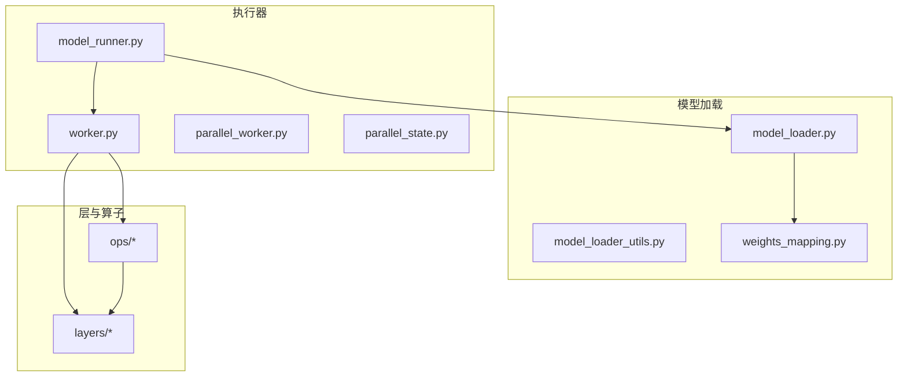
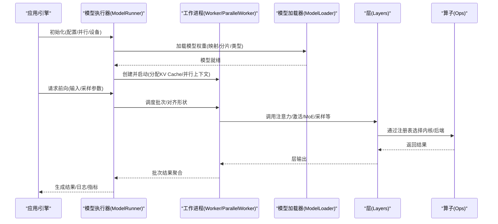
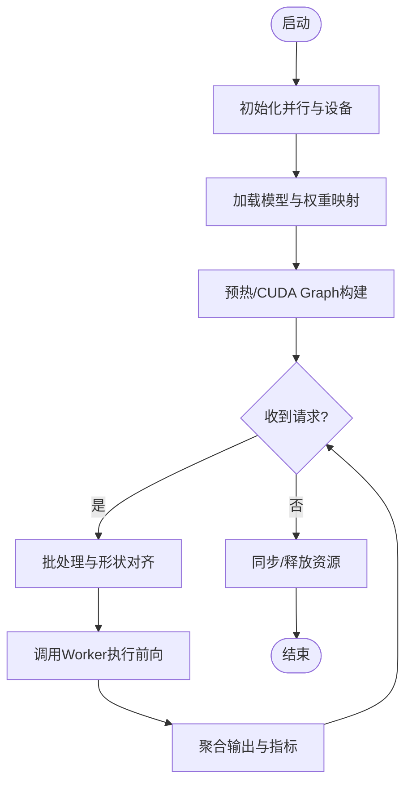
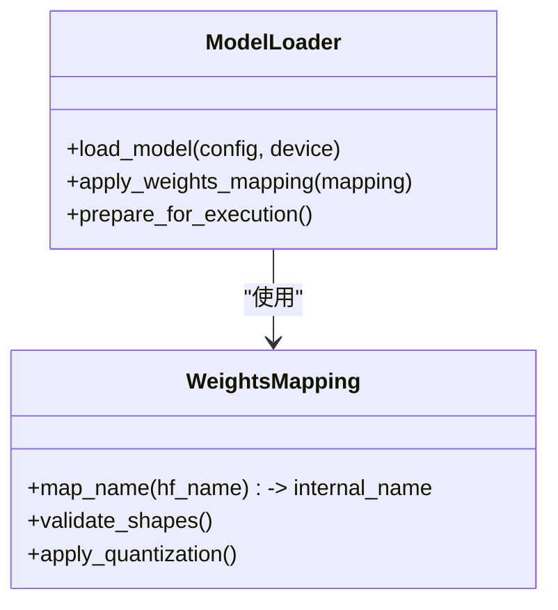
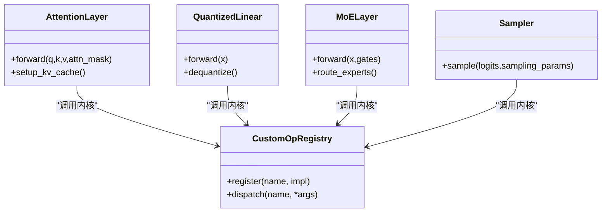
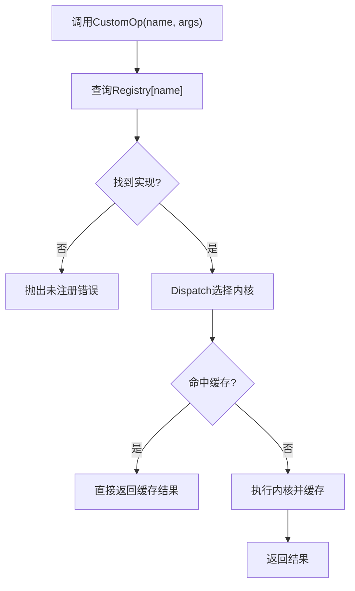
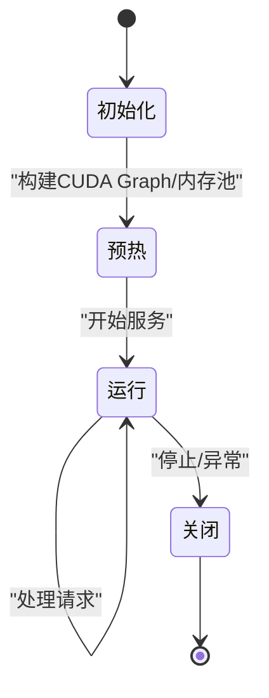
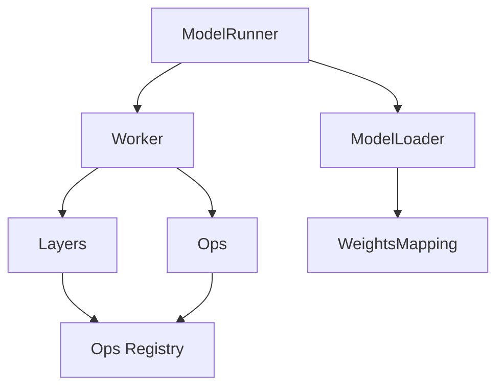

# ModelExecutor模块架构

<cite>
**本文引用的文件**   
- [vllm/model_executor/__init__.py](file://vllm/model_executor/__init__.py)
- [vllm/model_executor/worker.py](file://vllm/model_executor/worker.py)
- [vllm/model_executor/model_loader.py](file://vllm/model_executor/model_loader.py)
- [vllm/model_executor/layers/attention/__init__.py](file://vllm/model_executor/layers/attention/__init__.py)
- [vllm/model_executor/layers/attention/paged_attention.py](file://vllm/model_executor/layers/attention/paged_attention.py)
- [vllm/model_executor/layers/quantization/__init__.py](file://vllm/model_executor/layers/quantization/__init__.py)
- [vllm/model_executor/layers/quantization/gptq.py](file://vllm/model_executor/layers/quantization/gptq.py)
- [vllm/model_executor/layers/quantization/awq.py](file://vllm/model_executor/layers/quantization/awq.py)
- [vllm/model_executor/layers/quantization/weight_only.py](file://vllm/model_executor/layers/quantization/weight_only.py)
- [vllm/model_executor/layers/activation.py](file://vllm/model_executor/layers/activation.py)
- [vllm/model_executor/layers/layernorm.py](file://vllm/model_executor/layers/layernorm.py)
- [vllm/model_executor/layers/moe.py](file://vllm/model_executor/layers/moe.py)
- [vllm/model_executor/layers/sampler.py](file://vllm/model_executor/layers/sampler.py)
- [vllm/model_executor/layers/vocab_parallel_embedding.py](file://vllm/model_executor/layers/vocab_parallel_embedding.py)
- [vllm/model_executor/layers/fused_moe.py](file://vllm/model_executor/layers/fused_moe.py)
- [vllm/model_executor/layers/rotary_embedding.py](file://vllm/model_executor/layers/rotary_embedding.py)
- [vllm/model_executor/layers/mla.py](file://vllm/model_executor/layers/mla.py)
- [vllm/model_executor/layers/cuda_graphs.py](file://vllm/model_executor/layers/cuda_graphs.py)
- [vllm/model_executor/layers/custom_ops.py](file://vllm/model_executor/layers/custom_ops.py)
- [vllm/model_executor/layers/registry.py](file://vllm/model_executor/layers/registry.py)
- [vllm/model_executor/model_runner.py](file://vllm/model_executor/model_runner.py)
- [vllm/model_executor/model_loader_utils.py](file://vllm/model_executor/model_loader_utils.py)
- [vllm/model_executor/parallel_state.py](file://vallm/model_executor/parallel_state.py)
- [vllm/model_executor/parallel_worker.py](file://vllm/model_executor/parallel_worker.py)
- [vllm/model_executor/weights_mapping.py](file://vllm/model_executor/weights_mapping.py)
- [vllm/model_executor/ops/registry.py](file://vllm/model_executor/ops/registry.py)
- [vllm/model_executor/ops/custom_op.py](file://vllm/model_executor/ops/custom_op.py)
- [vllm/model_executor/ops/kernel_registry.py](file://vllm/model_executor/ops/kernel_registry.py)
- [vllm/model_executor/ops/dispatch.py](file://vllm/model_executor/ops/dispatch.py)
- [vllm/model_executor/ops/utils.py](file://vllm/model_executor/ops/utils.py)
- [vllm/model_executor/ops/caching.py](file://vllm/model_executor/ops/caching.py)
- [vllm/model_executor/ops/profiler.py](file://vllm/model_executor/ops/profiler.py)
- [vllm/model_executor/ops/debug.py](file://vllm/model_executor/ops/debug.py)
- [vllm/model_executor/ops/memory_manager.py](file://vllm/model_executor/ops/memory_manager.py)
- [vllm/model_executor/ops/perf_monitor.py](file://vllm/model_executor/ops/perf_monitor.py)
- [vllm/model_executor/ops/resource_cleanup.py](file://vllm/model_executor/ops/resource_cleanup.py)
</cite>

## 目录
1. [简介](#简介)
2. [项目结构](#项目结构)
3. [核心组件](#核心组件)
4. [架构总览](#架构总览)
5. [详细组件分析](#详细组件分析)
6. [依赖关系分析](#依赖关系分析)
7. [性能考量](#性能考量)
8. [故障排查指南](#故障排查指南)
9. [结论](#结论)
10. [附录](#附录)

## 简介
本文件系统性解析 vLLM 的 ModelExecutor 模块架构设计，聚焦模型执行器的核心职责：模型加载、参数管理、计算图构建与优化、自定义操作系统与扩展点、参数加载与优化策略、执行生命周期管理与资源清理，以及性能监控与调试接口。文档面向不同技术背景的读者，提供从高层概览到代码级细节的分层说明，并辅以架构图、时序图和流程图帮助理解。

## 项目结构
ModelExecutor 模块围绕“模型执行器”这一核心抽象展开，按职责划分为若干子包与文件：
- 执行器与调度：model_runner.py、worker.py、parallel_worker.py、parallel_state.py
- 模型加载与权重映射：model_loader.py、model_loader_utils.py、weights_mapping.py
- 层与算子：layers/*（注意力、量化、激活、MoE、采样等）、ops/*（注册、分发、缓存、性能与调试）
- 自定义操作与扩展：custom_ops.py、ops/registry.py、ops/custom_op.py、ops/kernel_registry.py

图表来源
- [vllm/model_executor/model_runner.py](file://vllm/model_executor/model_runner.py)
- [vllm/model_executor/worker.py](file://vllm/model_executor/worker.py)
- [vllm/model_executor/model_loader.py](file://vllm/model_executor/model_loader.py)
- [vllm/model_executor/weights_mapping.py](file://vllm/model_executor/weights_mapping.py)
- [vllm/model_executor/layers/attention/paged_attention.py](file://vllm/model_executor/layers/attention/paged_attention.py)
- [vllm/model_executor/ops/registry.py](file://vllm/model_executor/ops/registry.py)

章节来源
- [vllm/model_executor/model_runner.py](file://vllm/model_executor/model_runner.py)
- [vllm/model_executor/worker.py](file://vllm/model_executor/worker.py)
- [vllm/model_executor/model_loader.py](file://vllm/model_executor/model_loader.py)
- [vllm/model_executor/weights_mapping.py](file://vllm/model_executor/weights_mapping.py)

## 核心组件
- 模型执行器（ModelRunner）：负责编排模型的初始化、前向执行、批处理调度、CUDA Graph 捕获与重放、内存与并行状态协调。
- 工作进程（Worker/ParallelWorker）：封装单卡或多卡的模型实例、KV Cache、并行通信上下文，承载具体层的执行。
- 模型加载器（ModelLoader）：根据配置选择加载策略，解析权重映射，完成权重分片、类型转换与设备放置。
- 层与算子系统（Layers & Ops）：以可插拔方式组织注意力、量化、激活、MoE、采样等关键层；通过注册表与分发机制实现后端适配与扩展。
- 自定义操作系统（CustomOps）：统一注册与分发自定义算子，支持内核选择、缓存与性能采集。

章节来源
- [vllm/model_executor/model_runner.py](file://vllm/model_executor/model_runner.py)
- [vllm/model_executor/worker.py](file://vllm/model_executor/worker.py)
- [vllm/model_executor/model_loader.py](file://vllm/model_executor/model_loader.py)
- [vllm/model_executor/layers/attention/paged_attention.py](file://vllm/model_executor/layers/attention/paged_attention.py)
- [vllm/model_executor/ops/registry.py](file://vllm/model_executor/ops/registry.py)

## 架构总览
下图展示 ModelExecutor 的整体架构与关键交互路径：执行器驱动工作进程，工作进程调用层与算子，模型加载器在启动阶段完成权重装配，运行时通过注册表与分发机制动态选择最优实现。

图表来源
- [vllm/model_executor/model_runner.py](file://vllm/model_executor/model_runner.py)
- [vllm/model_executor/worker.py](file://vllm/model_executor/worker.py)
- [vllm/model_executor/model_loader.py](file://vllm/model_executor/model_loader.py)
- [vllm/model_executor/layers/attention/paged_attention.py](file://vllm/model_executor/layers/attention/paged_attention.py)
- [vllm/model_executor/ops/registry.py](file://vllm/model_executor/ops/registry.py)

## 详细组件分析

### 模型执行器（ModelRunner）
- 职责
  - 生命周期管理：初始化、预热、前向执行、CUDA Graph 捕获与重放、销毁与资源释放。
  - 批处理调度：序列合并、KV Cache 管理、动态形状处理、并发控制。
  - 并行协调：与 parallel_state 协作，确保张量/流水线并行一致性。
- 关键流程
  - 启动阶段：构造并行环境、加载模型、准备 CUDA Graph 元数据。
  - 运行阶段：接收请求、构建批次、调用 worker 执行、收集输出与指标。
  - 关闭阶段：同步设备、释放显存、清理通信句柄。

章节来源
- [vllm/model_executor/model_runner.py](file://vllm/model_executor/model_runner.py)

### 工作进程（Worker / ParallelWorker）
- 职责
  - 维护模型实例、KV Cache、并行通信上下文。
  - 执行各层的前向逻辑，协调层间数据流。
  - 暴露统一的执行接口供 ModelRunner 调用。
- 关键点
  - 多卡场景下，使用分布式通信原语保证张量切分与同步。
  - 针对长上下文与批量增长，动态调整 KV Cache 布局与复用策略。

章节来源
- [vllm/model_executor/worker.py](file://vllm/model_executor/worker.py)
- [vllm/model_executor/parallel_worker.py](file://vllm/model_executor/parallel_worker.py)

### 模型加载器（ModelLoader）与权重映射（WeightsMapping）
- 职责
  - 根据模型类型与配置选择加载策略（如 HuggingFace、Sharded、LoRA）。
  - 解析 weights_mapping，将外部权重名映射到内部参数名，处理分片与类型转换。
  - 处理设备放置、精度转换与可选的量化权重解码。
- 优化点
  - 预取与并行下载、延迟加载、按需加载 LoRA。
  - 权重校验与一致性检查，避免跨设备不一致。

图表来源
- [vllm/model_executor/model_loader.py](file://vllm/model_executor/model_loader.py)
- [vllm/model_executor/weights_mapping.py](file://vllm/model_executor/weights_mapping.py)

章节来源
- [vllm/model_executor/model_loader.py](file://vllm/model_executor/model_loader.py)
- [vllm/model_executor/model_loader_utils.py](file://vllm/model_executor/model_loader_utils.py)
- [vllm/model_executor/weights_mapping.py](file://vllm/model_executor/weights_mapping.py)

### 层与算子系统（Layers & Ops）
- 注意力（PagedAttention）
  - 基于分页的 KV Cache 管理，减少碎片化，提升吞吐。
  - 支持多种注意力后端与融合策略。
- 量化（GPTQ/AWQ/WeightOnly）
  - 权重级量化与运行时反量化，降低显存占用与带宽压力。
  - 与算子内核深度集成，保证低开销。
- 激活与归一化（Activation/LayerNorm）
  - 常用激活函数与 RMS/LayerNorm 的高效实现。
- MoE（Mixture of Experts）
  - 稀疏专家路由与融合内核，支持动态专家选择与负载均衡。
- 采样（Sampler）
  - Top-k/top-p、温度缩放、重复惩罚等采样策略。
- 旋转位置编码（RoPE）
  - 高效位置编码实现，适配不同长度与维度。
- 自定义算子（CustomOps）
  - 统一注册与分发机制，支持内核选择、缓存与性能采集。

图表来源
- [vllm/model_executor/layers/attention/paged_attention.py](file://vllm/model_executor/layers/attention/paged_attention.py)
- [vllm/model_executor/layers/quantization/gptq.py](file://vllm/model_executor/layers/quantization/gptq.py)
- [vllm/model_executor/layers/quantization/awq.py](file://vllm/model_executor/layers/quantization/awq.py)
- [vllm/model_executor/layers/quantization/weight_only.py](file://vllm/model_executor/layers/quantization/weight_only.py)
- [vllm/model_executor/layers/moe.py](file://vllm/model_executor/layers/moe.py)
- [vllm/model_executor/layers/sampler.py](file://vllm/model_executor/layers/sampler.py)
- [vllm/model_executor/layers/custom_ops.py](file://vllm/model_executor/layers/custom_ops.py)
- [vllm/model_executor/ops/registry.py](file://vllm/model_executor/ops/registry.py)

章节来源
- [vllm/model_executor/layers/attention/paged_attention.py](file://vllm/model_executor/layers/attention/paged_attention.py)
- [vllm/model_executor/layers/quantization/gptq.py](file://vllm/model_executor/layers/quantization/gptq.py)
- [vllm/model_executor/layers/quantization/awq.py](file://vllm/model_executor/layers/quantization/awq.py)
- [vllm/model_executor/layers/quantization/weight_only.py](file://vllm/model_executor/layers/quantization/weight_only.py)
- [vllm/model_executor/layers/moe.py](file://vllm/model_executor/layers/moe.py)
- [vllm/model_executor/layers/sampler.py](file://vllm/model_executor/layers/sampler.py)
- [vllm/model_executor/layers/custom_ops.py](file://vllm/model_executor/layers/custom_ops.py)
- [vllm/model_executor/ops/registry.py](file://vllm/model_executor/ops/registry.py)

### 自定义操作系统与扩展点
- 注册表（Registry）
  - 统一注册算子名称与实现，支持多后端与条件选择。
- 分发（Dispatch）
  - 根据输入形状、数据类型与设备选择最优内核。
- 内核注册（KernelRegistry）
  - 为特定硬件或库（如 Triton/CUTLASS）注册高性能内核。
- 自定义算子（CustomOp）
  - 定义算子接口、编译选项与缓存键，便于增量更新与复用。

图表来源
- [vllm/model_executor/ops/registry.py](file://vllm/model_executor/ops/registry.py)
- [vllm/model_executor/ops/dispatch.py](file://vllm/model_executor/ops/dispatch.py)
- [vllm/model_executor/ops/kernel_registry.py](file://vllm/model_executor/ops/kernel_registry.py)
- [vllm/model_executor/ops/custom_op.py](file://vllm/model_executor/ops/custom_op.py)
- [vllm/model_executor/ops/caching.py](file://vllm/model_executor/ops/caching.py)

章节来源
- [vllm/model_executor/ops/registry.py](file://vllm/model_executor/ops/registry.py)
- [vllm/model_executor/ops/dispatch.py](file://vllm/model_executor/ops/dispatch.py)
- [vllm/model_executor/ops/kernel_registry.py](file://vllm/model_executor/ops/kernel_registry.py)
- [vllm/model_executor/ops/custom_op.py](file://vllm/model_executor/ops/custom_op.py)
- [vllm/model_executor/ops/caching.py](file://vllm/model_executor/ops/caching.py)

### 参数加载与优化策略
- 权重映射与分片：通过 weights_mapping 将外部权重名映射到内部参数，支持张量切分与跨设备放置。
- 量化与压缩：GPTQ/AWQ/WeightOnly 等量化方案在加载时进行解码或保持压缩格式，减少显存占用。
- 延迟加载与按需加载：对大型模型采用分块加载与 LoRA 动态挂载，缩短启动时间。
- 类型与精度转换：在加载过程中进行 dtype 转换与数值范围校验，确保稳定性。

章节来源
- [vllm/model_executor/model_loader.py](file://vllm/model_executor/model_loader.py)
- [vllm/model_executor/weights_mapping.py](file://vllm/model_executor/weights_mapping.py)
- [vllm/model_executor/model_loader_utils.py](file://vllm/model_executor/model_loader_utils.py)

### 模型执行的生命周期管理与资源清理
- 生命周期
  - 初始化：并行环境、设备、模型实例、KV Cache。
  - 预热：CUDA Graph 构建、内核预热、内存池初始化。
  - 运行：批处理调度、层调用、指标采集。
  - 关闭：同步设备、释放显存、清理通信句柄。
- 资源清理
  - 显存管理器：统一分配与回收，避免泄漏。
  - 通信上下文：安全断开 NCCL/其他后端连接。
  - 缓存失效：算子缓存与中间结果清理。

章节来源
- [vllm/model_executor/model_runner.py](file://vllm/model_executor/model_runner.py)
- [vllm/model_executor/worker.py](file://vllm/model_executor/worker.py)
- [vllm/model_executor/ops/memory_manager.py](file://vllm/model_executor/ops/memory_manager.py)
- [vllm/model_executor/ops/resource_cleanup.py](file://vllm/model_executor/ops/resource_cleanup.py)

### 性能监控与调试接口
- 性能监控
  - 指标采集：吞吐、延迟、显存占用、内核耗时。
  - 事件追踪：请求级与内核级事件记录。
- 调试接口
  - 断点与日志：分层日志与可配置级别。
  - 可视化：性能曲线与热点分析。
- 工具
  - Profiler：集中式性能剖析与报告生成。
  - Debug：断点、变量快照与回溯信息。

章节来源
- [vllm/model_executor/ops/profiler.py](file://vllm/model_executor/ops/profiler.py)
- [vllm/model_executor/ops/debug.py](file://vllm/model_executor/ops/debug.py)
- [vllm/model_executor/ops/perf_monitor.py](file://vllm/model_executor/ops/perf_monitor.py)

## 依赖关系分析
- 组件耦合
  - ModelRunner 依赖 Worker 与 ModelLoader，解耦执行与加载。
  - Worker 依赖 Layers 与 Ops，通过注册表与分发机制降低耦合。
- 外部依赖
  - 并行通信（NCCL/其他后端）由 parallel_state 统一管理。
  - 量化与注意力内核依赖底层库（如 Triton/CUTLASS）。
- 循环依赖
  - 通过接口与注册表避免直接循环引用，保持模块内聚。

图表来源
- [vllm/model_executor/model_runner.py](file://vllm/model_executor/model_runner.py)
- [vllm/model_executor/worker.py](file://vllm/model_executor/worker.py)
- [vllm/model_executor/model_loader.py](file://vllm/model_executor/model_loader.py)
- [vllm/model_executor/weights_mapping.py](file://vllm/model_executor/weights_mapping.py)
- [vllm/model_executor/ops/registry.py](file://vllm/model_executor/ops/registry.py)

章节来源
- [vllm/model_executor/model_runner.py](file://vllm/model_executor/model_runner.py)
- [vllm/model_executor/worker.py](file://vllm/model_executor/worker.py)
- [vllm/model_executor/model_loader.py](file://vllm/model_executor/model_loader.py)
- [vllm/model_executor/weights_mapping.py](file://vllm/model_executor/weights_mapping.py)
- [vllm/model_executor/ops/registry.py](file://vllm/model_executor/ops/registry.py)

## 性能考量
- 批处理与内存
  - 动态批处理与 KV Cache 复用，减少内存碎片与分配开销。
- 内核选择与缓存
  - 基于形状与类型的内核选择，结合缓存避免重复编译。
- 并行与通信
  - 合理的张量切分与通信拓扑，降低同步开销。
- 量化与精度
  - 量化权重减少带宽压力，注意反量化与数值稳定性。
- CUDA Graph
  - 捕获稳定形状的图，减少 Python/GIL 开销。

[本节为通用指导，不直接分析具体文件]

## 故障排查指南
- 常见问题
  - 权重加载失败：检查映射与分片配置、数据类型与设备一致性。
  - 显存不足：调整批大小、启用量化、检查内存泄漏。
  - 内核未注册：确认注册表与分发逻辑，检查后端可用性。
- 调试步骤
  - 开启详细日志与指标采集，定位热点与瓶颈。
  - 使用断点与变量快照，验证中间结果与形状。
  - 逐步禁用特性（如 CUDA Graph、量化），缩小问题范围。

章节来源
- [vllm/model_executor/ops/profiler.py](file://vllm/model_executor/ops/profiler.py)
- [vllm/model_executor/ops/debug.py](file://vllm/model_executor/ops/debug.py)
- [vllm/model_executor/ops/perf_monitor.py](file://vllm/model_executor/ops/perf_monitor.py)

## 结论
ModelExecutor 模块以清晰的职责划分与可扩展的注册/分发机制，实现了高效的模型执行框架。通过模型加载器与权重映射完成灵活的权重装配，借助层与算子系统提供高性能内核与量化支持，配合生命周期管理与资源清理保障稳定性与可维护性。性能监控与调试接口为优化与排障提供了有力支撑。

[本节为总结性内容，不直接分析具体文件]

## 附录
- 术语
  - KV Cache：键值缓存，用于加速自回归生成。
  - CUDA Graph：NVIDIA 的图执行机制，减少主机开销。
  - 量化：降低权重或激活的精度以减少资源消耗。
- 参考
  - 注意力后端与融合策略文档
  - 量化与 MoE 内核特性说明

[本节为概念性内容，不直接分析具体文件]