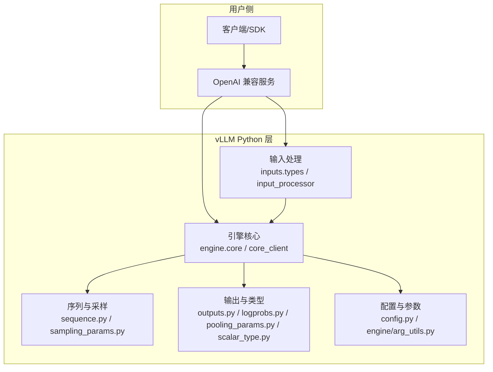
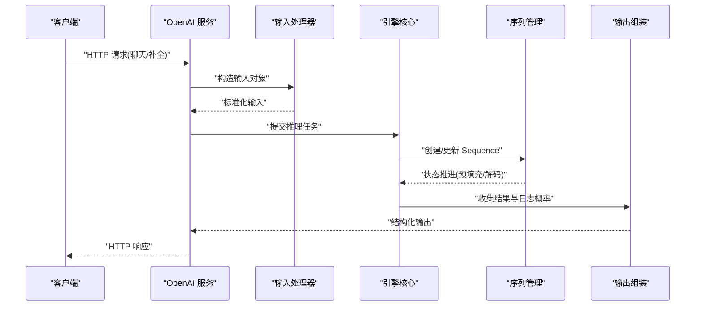
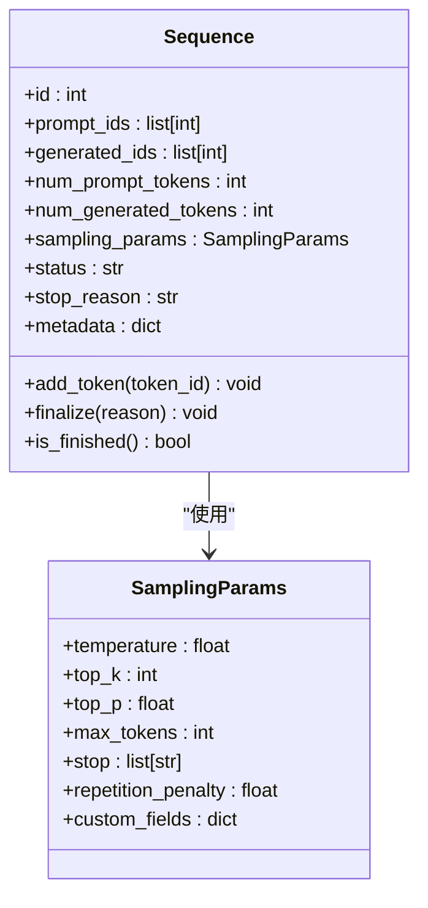
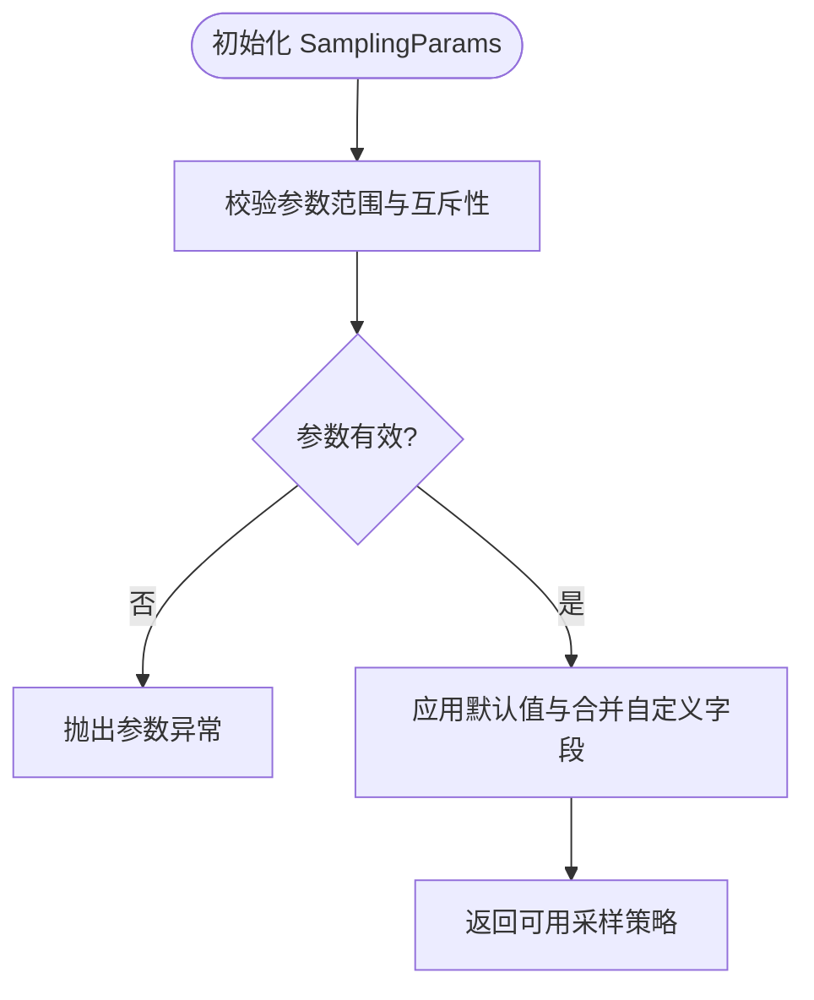
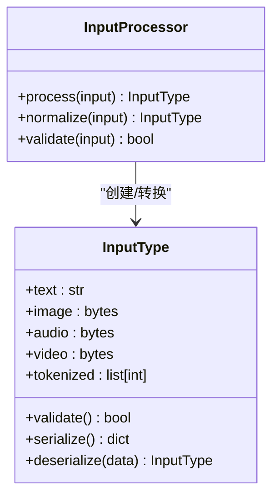
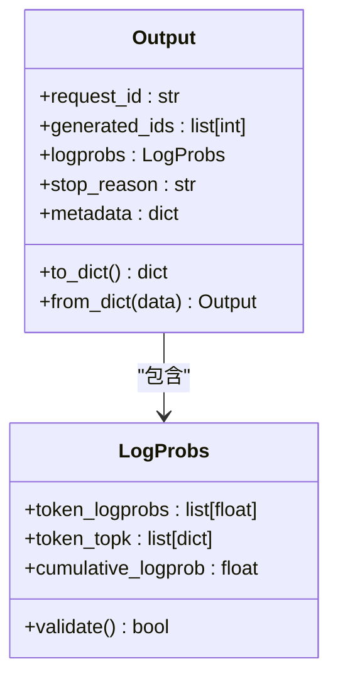
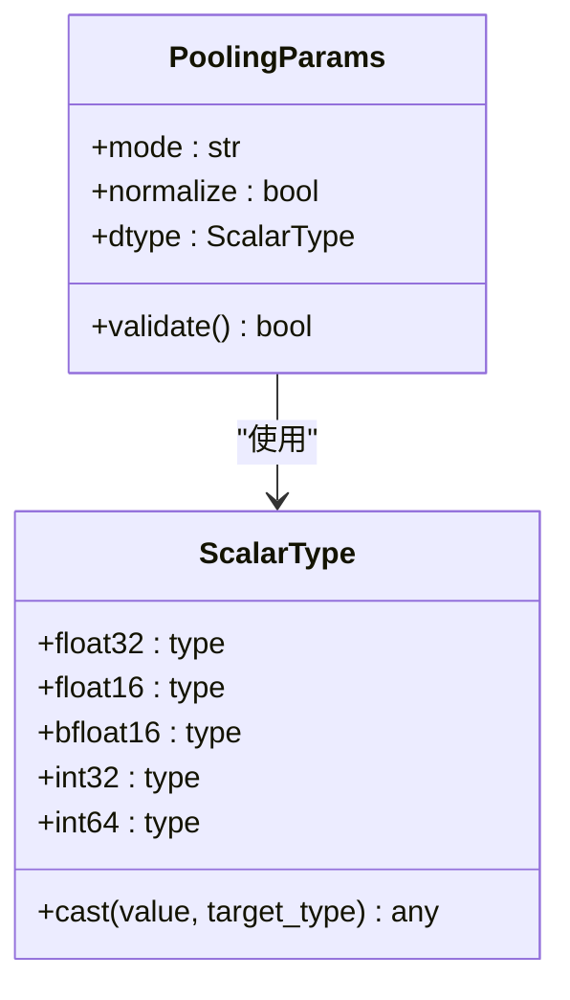
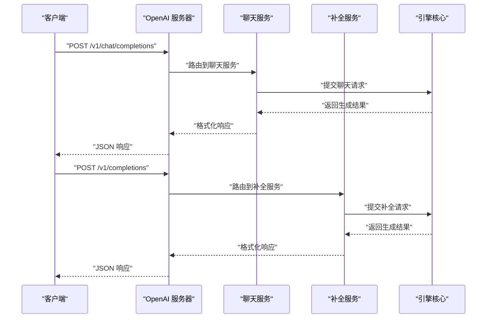
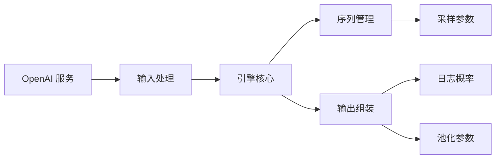

# 核心接口定义

<cite>
**本文引用的文件**   
- [vllm/__init__.py](file://vllm/__init__.py)
- [vllm/sequence.py](file://vllm/sequence.py)
- [vllm/sampling_params.py](file://vllm/sampling_params.py)
- [vllm/outputs.py](file://vllm/outputs.py)
- [vllm/pooling_params.py](file://vllm/pooling_params.py)
- [vllm/logprobs.py](file://vllm/logprobs.py)
- [vllm/scalar_type.py](file://vllm/scalar_type.py)
- [vllm/config.py](file://vllm/config.py)
- [vllm/engine/arg_utils.py](file://vllm/engine/arg_utils.py)
- [vllm/engine/core.py](file://vllm/engine/core.py)
- [vllm/engine/core_client.py](file://vllm/engine/core_client.py)
- [vllm/inputs/input_processor.py](file://vllm/inputs/input_processor.py)
- [vllm/inputs/types.py](file://vllm/inputs/types.py)
- [vllm/entrypoints/openai/api_server.py](file://vllm/entrypoints/openai/api_server.py)
- [vllm/entrypoints/openai/serving_completion.py](file://vllm/entrypoints/openai/serving_completion.py)
- [vllm/entrypoints/openai/serving_chat.py](file://vllm/entrypoints/openai/serving_chat.py)
- [tests/test_sequence.py](file://tests/test_sequence.py)
- [tests/test_sampling_params.py](file://tests/test_sampling_params.py)
- [tests/test_outputs.py](file://tests/test_outputs.py)
</cite>

## 目录
1. [简介](#简介)
2. [项目结构](#项目结构)
3. [核心组件](#核心组件)
4. [架构总览](#架构总览)
5. [详细组件分析](#详细组件分析)
6. [依赖关系分析](#依赖关系分析)
7. [性能考量](#性能考量)
8. [故障排查指南](#故障排查指南)
9. [结论](#结论)
10. [附录](#附录)

## 简介
本文件聚焦 vLLM 的核心接口定义与设计模式，围绕公共 API、抽象层次、输入输出数据结构与序列化机制展开。重点解析 Sequence 与 SamplingParams 的设计原理，并讨论接口的版本兼容性与扩展性策略，最后给出最佳实践与错误处理模式。

## 项目结构
vLLM 的 Python 层将“引擎核心”“输入处理”“采样参数”“输出模型”“OpenAI 兼容服务”等模块分层组织：
- 引擎核心：engine.core 提供统一的推理调度入口；engine.arg_utils 负责参数装配；core_client 提供客户端访问能力。
- 输入处理：inputs.types 与 input_processor 统一多模态与文本输入的表示与预处理。
- 序列与采样：sequence.py 与 sampling_params.py 定义生成过程中的状态与采样控制。
- 输出与日志：outputs.py、logprobs.py、pooling_params.py、scalar_type.py 定义输出结构与数值类型。
- OpenAI 兼容：entrypoints/openai/* 暴露 RESTful 接口，内部调用引擎核心。

图表来源
- [vllm/engine/core.py](file://vllm/engine/core.py)
- [vllm/engine/core_client.py](file://vllm/engine/core_client.py)
- [vllm/inputs/types.py](file://vllm/inputs/types.py)
- [vllm/inputs/input_processor.py](file://vllm/inputs/input_processor.py)
- [vllm/sequence.py](file://vllm/sequence.py)
- [vllm/sampling_params.py](file://vllm/sampling_params.py)
- [vllm/outputs.py](file://vllm/outputs.py)
- [vllm/logprobs.py](file://vllm/logprobs.py)
- [vllm/pooling_params.py](file://vllm/pooling_params.py)
- [vllm/scalar_type.py](file://vllm/scalar_type.py)
- [vllm/config.py](file://vllm/config.py)
- [vllm/engine/arg_utils.py](file://vllm/engine/arg_utils.py)
- [vllm/entrypoints/openai/api_server.py](file://vllm/entrypoints/openai/api_server.py)

章节来源
- [vllm/engine/core.py](file://vllm/engine/core.py)
- [vllm/inputs/types.py](file://vllm/inputs/types.py)
- [vllm/sequence.py](file://vllm/sequence.py)
- [vllm/sampling_params.py](file://vllm/sampling_params.py)
- [vllm/outputs.py](file://vllm/outputs.py)
- [vllm/logprobs.py](file://vllm/logprobs.py)
- [vllm/pooling_params.py](file://vllm/pooling_params.py)
- [vllm/scalar_type.py](file://vllm/scalar_type.py)
- [vllm/config.py](file://vllm/config.py)
- [vllm/engine/arg_utils.py](file://vllm/engine/arg_utils.py)
- [vllm/entrypoints/openai/api_server.py](file://vllm/entrypoints/openai/api_server.py)

## 核心组件
- 公共 API 抽象
  - 引擎核心（engine.core）：对外暴露统一的推理调度接口，屏蔽底层执行细节。
  - 输入处理（inputs.*）：统一文本/多模态输入表示，提供标准化与校验。
  - 序列与采样（sequence.py, sampling_params.py）：描述生成过程的状态机与采样策略。
  - 输出与类型（outputs.py, logprobs.py, pooling_params.py, scalar_type.py）：定义结构化输出、对数概率、池化参数与标量类型。
  - OpenAI 兼容（entrypoints/openai/*）：RESTful 接口适配，内部委托给引擎核心。

- 设计模式
  - 适配器模式：OpenAI 服务将 HTTP 请求转换为内部输入对象。
  - 工厂模式：输入处理器根据输入类型构建对应的输入对象。
  - 策略模式：SamplingParams 封装不同采样策略（top-k/top-p/temperature 等）。
  - 状态机：Sequence 管理 token 生成生命周期（创建、预填充、解码、完成/失败）。

章节来源
- [vllm/engine/core.py](file://vllm/engine/core.py)
- [vllm/inputs/input_processor.py](file://vllm/inputs/input_processor.py)
- [vllm/sequence.py](file://vllm/sequence.py)
- [vllm/sampling_params.py](file://vllm/sampling_params.py)
- [vllm/outputs.py](file://vllm/outputs.py)
- [vllm/logprobs.py](file://vllm/logprobs.py)
- [vllm/pooling_params.py](file://vllm/pooling_params.py)
- [vllm/scalar_type.py](file://vllm/scalar_type.py)
- [vllm/entrypoints/openai/api_server.py](file://vllm/entrypoints/openai/api_server.py)

## 架构总览
下图展示了从 OpenAI 兼容接口到引擎核心的调用链，以及输入/输出数据在模块间的流转。

图表来源
- [vllm/entrypoints/openai/api_server.py](file://vllm/entrypoints/openai/api_server.py)
- [vllm/entrypoints/openai/serving_completion.py](file://vllm/entrypoints/openai/serving_completion.py)
- [vllm/entrypoints/openai/serving_chat.py](file://vllm/entrypoints/openai/serving_chat.py)
- [vllm/inputs/input_processor.py](file://vllm/inputs/input_processor.py)
- [vllm/engine/core.py](file://vllm/engine/core.py)
- [vllm/sequence.py](file://vllm/sequence.py)
- [vllm/outputs.py](file://vllm/outputs.py)

## 详细组件分析

### Sequence 类设计与状态机
Sequence 用于跟踪单个生成任务的完整生命周期，包括 token 列表、上下文长度、停止条件、采样参数关联等。其设计遵循状态机模式，确保在预填充与解码阶段正确推进。

图表来源
- [vllm/sequence.py](file://vllm/sequence.py)
- [vllm/sampling_params.py](file://vllm/sampling_params.py)

章节来源
- [vllm/sequence.py](file://vllm/sequence.py)
- [tests/test_sequence.py](file://tests/test_sequence.py)

### SamplingParams 类设计与策略封装
SamplingParams 封装所有采样相关参数，支持温度、top-k、top-p、最大生成长度、停止词、重复惩罚等。通过默认值与可选字段实现向后兼容与扩展性。

图表来源
- [vllm/sampling_params.py](file://vllm/sampling_params.py)

章节来源
- [vllm/sampling_params.py](file://vllm/sampling_params.py)
- [tests/test_sampling_params.py](file://tests/test_sampling_params.py)

### 输入数据结构与序列化机制
输入处理模块统一多种输入格式（纯文本、多模态），并通过输入处理器进行标准化与校验。序列化通常采用 JSON 或 Pydantic 模型，保证跨进程/网络传输的一致性。

图表来源
- [vllm/inputs/types.py](file://vllm/inputs/types.py)
- [vllm/inputs/input_processor.py](file://vllm/inputs/input_processor.py)

章节来源
- [vllm/inputs/types.py](file://vllm/inputs/types.py)
- [vllm/inputs/input_processor.py](file://vllm/inputs/input_processor.py)

### 输出数据结构与日志概率
输出模块定义结构化响应体，包含生成的 token、对数概率、停止原因、元数据等。LogProbs 提供每个 token 的对数概率分布，便于调试与分析。

图表来源
- [vllm/outputs.py](file://vllm/outputs.py)
- [vllm/logprobs.py](file://vllm/logprobs.py)

章节来源
- [vllm/outputs.py](file://vllm/outputs.py)
- [vllm/logprobs.py](file://vllm/logprobs.py)
- [tests/test_outputs.py](file://tests/test_outputs.py)

### 池化参数与标量类型
PoolingParams 用于嵌入/分类等池化任务的配置，ScalarType 统一数值类型表示，确保在不同后端间的一致性。

图表来源
- [vllm/pooling_params.py](file://vllm/pooling_params.py)
- [vllm/scalar_type.py](file://vllm/scalar_type.py)

章节来源
- [vllm/pooling_params.py](file://vllm/pooling_params.py)
- [vllm/scalar_type.py](file://vllm/scalar_type.py)

### OpenAI 兼容接口与服务层
OpenAI 兼容服务将 HTTP 请求映射为内部输入对象，并调用引擎核心执行推理。服务层负责请求校验、流式响应、错误码映射等。

图表来源
- [vllm/entrypoints/openai/api_server.py](file://vllm/entrypoints/openai/api_server.py)
- [vllm/entrypoints/openai/serving_chat.py](file://vllm/entrypoints/openai/serving_chat.py)
- [vllm/entrypoints/openai/serving_completion.py](file://vllm/entrypoints/openai/serving_completion.py)
- [vllm/engine/core.py](file://vllm/engine/core.py)

章节来源
- [vllm/entrypoints/openai/api_server.py](file://vllm/entrypoints/openai/api_server.py)
- [vllm/entrypoints/openai/serving_chat.py](file://vllm/entrypoints/openai/serving_chat.py)
- [vllm/entrypoints/openai/serving_completion.py](file://vllm/entrypoints/openai/serving_completion.py)

## 依赖关系分析
- 低耦合高内聚：各模块职责清晰，通过明确定义的接口交互。
- 依赖方向：OpenAI 服务 → 输入处理 → 引擎核心 → 序列/采样/输出。
- 扩展点：输入处理器、采样策略、输出格式均可通过插件或子类扩展。

图表来源
- [vllm/entrypoints/openai/api_server.py](file://vllm/entrypoints/openai/api_server.py)
- [vllm/inputs/input_processor.py](file://vllm/inputs/input_processor.py)
- [vllm/engine/core.py](file://vllm/engine/core.py)
- [vllm/sequence.py](file://vllm/sequence.py)
- [vllm/sampling_params.py](file://vllm/sampling_params.py)
- [vllm/outputs.py](file://vllm/outputs.py)
- [vllm/logprobs.py](file://vllm/logprobs.py)
- [vllm/pooling_params.py](file://vllm/pooling_params.py)

章节来源
- [vllm/engine/core.py](file://vllm/engine/core.py)
- [vllm/inputs/input_processor.py](file://vllm/inputs/input_processor.py)
- [vllm/sequence.py](file://vllm/sequence.py)
- [vllm/sampling_params.py](file://vllm/sampling_params.py)
- [vllm/outputs.py](file://vllm/outputs.py)

## 性能考量
- 批处理与内存管理：引擎核心优化批量推理，减少 GPU 内存碎片。
- 流式输出：支持增量返回，降低首字延迟。
- 缓存机制：前缀缓存与 KV 缓存提升重复请求性能。
- 类型优化：使用高效数据类型（如 bfloat16）减少内存带宽压力。

## 故障排查指南
- 参数校验失败：检查 SamplingParams 与输入参数的合法性。
- 序列状态异常：确认 Sequence 的生命周期是否正确推进。
- 输出序列化错误：验证输出对象的字段完整性与类型一致性。
- 网络超时：调整请求超时与重试策略。

章节来源
- [vllm/sampling_params.py](file://vllm/sampling_params.py)
- [vllm/sequence.py](file://vllm/sequence.py)
- [vllm/outputs.py](file://vllm/outputs.py)

## 结论
vLLM 的核心接口设计以清晰的抽象层次、灵活的策略封装和健壮的错误处理为特点。Sequence 与 SamplingParams 作为生成过程的核心，提供了强大的控制能力。通过模块化设计与插件机制，系统具备良好的扩展性与兼容性。

## 附录
- 最佳实践
  - 合理设置采样参数，避免极端值导致不稳定。
  - 使用输入处理器统一处理多模态输入。
  - 启用流式输出以提升用户体验。
  - 监控资源使用，及时调整批大小与缓存策略。
- 错误处理模式
  - 参数校验失败时返回明确的错误信息。
  - 序列状态异常时记录详细日志。
  - 网络请求失败时实现重试与降级策略。