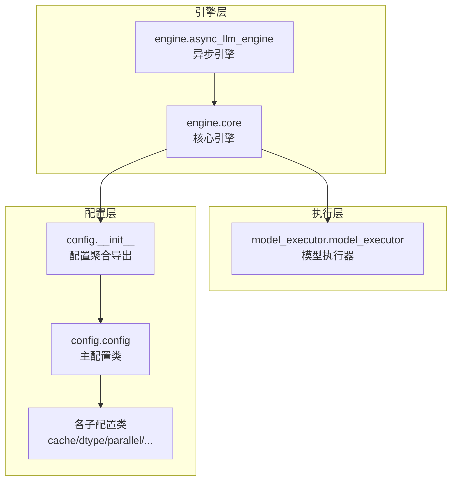
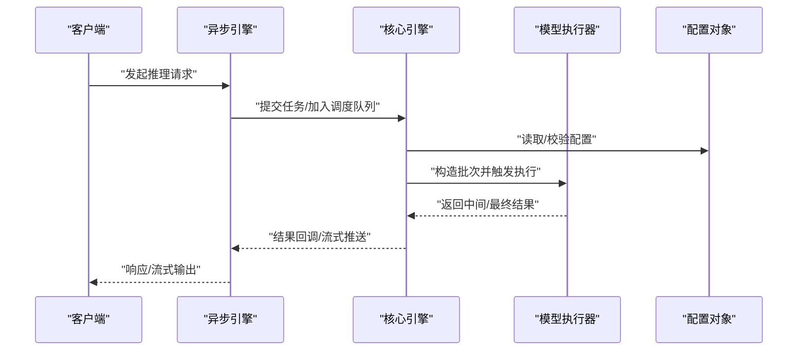
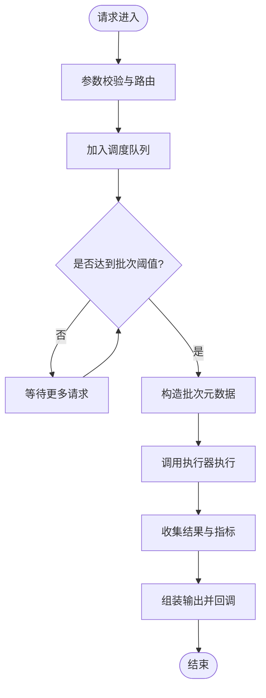
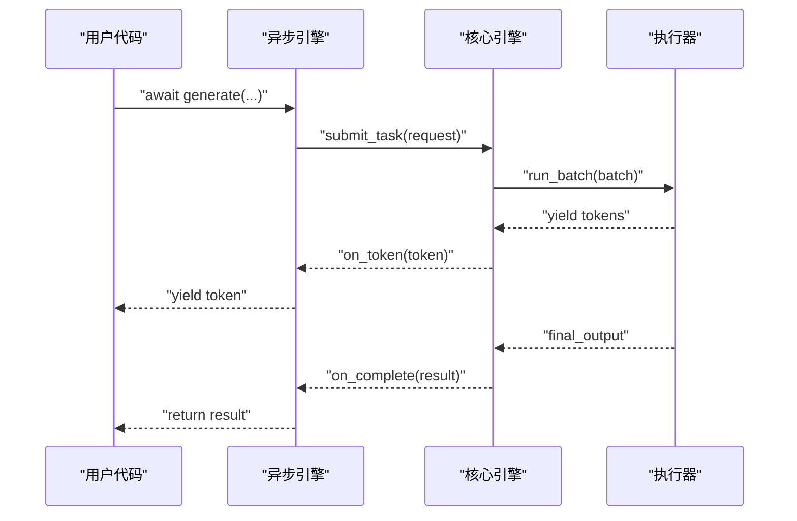
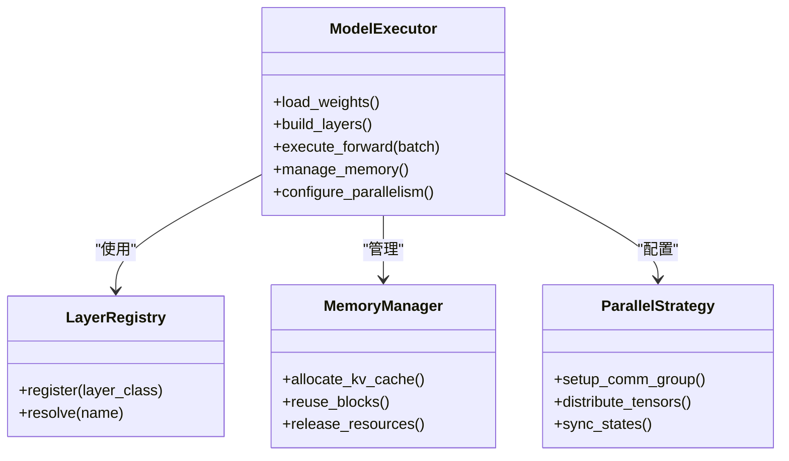
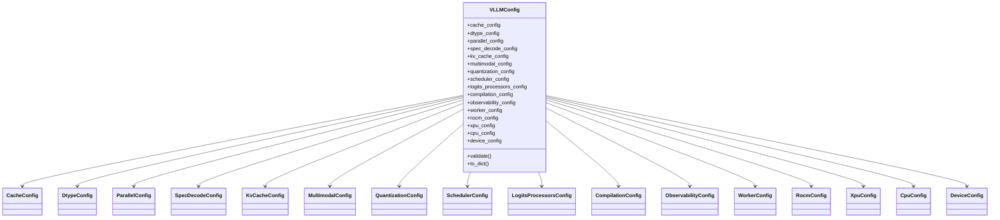
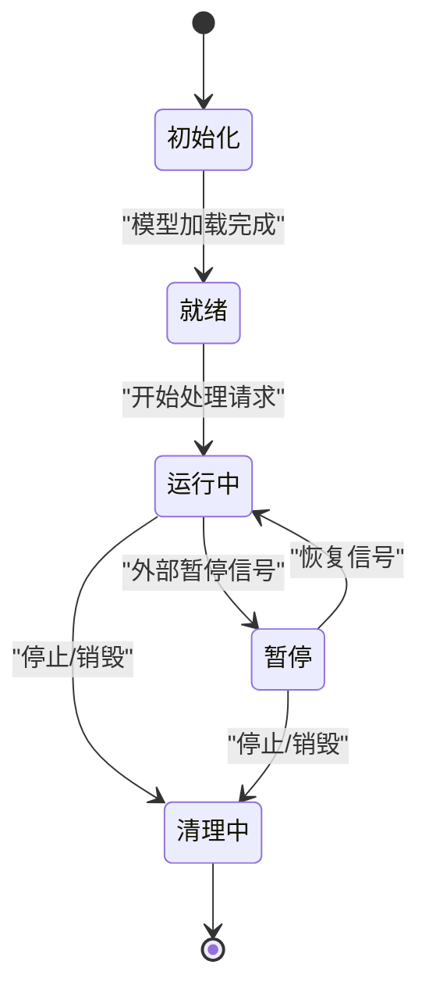
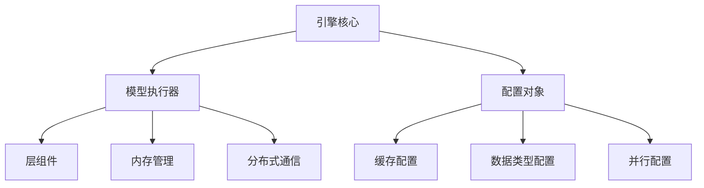

# 核心模块架构

<cite>
**本文引用的文件**   
- [vllm/engine/core.py](file://vllm/engine/core.py)
- [vllm/engine/async_llm_engine.py](file://vllm/engine/async_llm_engine.py)
- [vllm/model_executor/model_executor.py](file://vllm/model_executor/model_executor.py)
- [vllm/config/__init__.py](file://vllm/config/__init__.py)
- [vllm/config/config.py](file://vllm/config/config.py)
- [vllm/config/cache_config.py](file://vllm/config/cache_config.py)
- [vllm/config/dtype_config.py](file://vllm/config/dtype_config.py)
- [vllm/config/parallel_config.py](file://vllm/config/parallel_config.py)
- [vllm/config/spec_decode_config.py](file://vllm/config/spec_decode_config.py)
- [vllm/config/kv_cache_config.py](file://vllm/config/kv_cache_config.py)
- [vllm/config/multimodal_config.py](file://vllm/config/multimodal_config.py)
- [vllm/config/quantization_config.py](file://vllm/config/quantization_config.py)
- [vllm/config/scheduler_config.py](file://vllm/config/scheduler_config.py)
- [vllm/config/logits_processors_config.py](file://vllm/config/logits_processors_config.py)
- [vllm/config/compilation_config.py](file://vllm/config/compilation_config.py)
- [vllm/config/observability_config.py](file://vllm/config/observability_config.py)
- [vllm/config/worker_config.py](file://vllm/config/worker_config.py)
- [vllm/config/rocm_config.py](file://vllm/config/rocm_config.py)
- [vllm/config/xpu_config.py](file://vllm/config/xpu_config.py)
- [vllm/config/cpu_config.py](file://vllm/config/cpu_config.py)
- [vllm/config/device_config.py](file://vllm/config/device_config.py)
</cite>

## 目录
1. [简介](#简介)
2. [项目结构](#项目结构)
3. [核心组件](#核心组件)
4. [架构总览](#架构总览)
5. [详细组件分析](#详细组件分析)
6. [依赖关系分析](#依赖关系分析)
7. [性能考量](#性能考量)
8. [故障排查指南](#故障排查指南)
9. [结论](#结论)
10. [附录](#附录)

## 简介
本文件系统性解析 vLLM 的核心模块架构，重点围绕以下三个关键模块：
- engine：推理引擎核心，负责请求调度、批处理管理与生命周期控制。
- model_executor：模型执行器，协调层组件组织与计算图构建，驱动实际推理。
- config：配置管理，提供参数校验、默认值合并与运行时配置对象。

文档面向不同技术背景的读者，既提供高层概览，也深入到类与方法级别，并辅以时序图、状态图与依赖图帮助理解模块交互与数据流。

## 项目结构
vLLM 的 Python 源码位于 vllm 目录下，核心模块分布如下：
- engine：封装推理引擎对外接口与内部调度逻辑，包含异步引擎与核心引擎实现。
- model_executor：抽象模型执行器，统一多后端（如 CUDA、ROCm、XPU、CPU）的执行细节。
- config：集中式配置体系，按功能域拆分为多个配置类，并在入口聚合导出。

图表来源
- [vllm/engine/core.py:1-200](file://vllm/engine/core.py#L1-L200)
- [vllm/engine/async_llm_engine.py:1-200](file://vllm/engine/async_llm_engine.py#L1-L200)
- [vllm/model_executor/model_executor.py:1-200](file://vllm/model_executor/model_executor.py#L1-L200)
- [vllm/config/__init__.py:1-200](file://vllm/config/__init__.py#L1-L200)
- [vllm/config/config.py:1-200](file://vllm/config/config.py#L1-L200)

章节来源
- [vllm/engine/core.py:1-200](file://vllm/engine/core.py#L1-L200)
- [vllm/engine/async_llm_engine.py:1-200](file://vllm/engine/async_llm_engine.py#L1-L200)
- [vllm/model_executor/model_executor.py:1-200](file://vllm/model_executor/model_executor.py#L1-L200)
- [vllm/config/__init__.py:1-200](file://vllm/config/__init__.py#L1-L200)
- [vllm/config/config.py:1-200](file://vllm/config/config.py#L1-L200)

## 核心组件
- 引擎核心（engine.core）
  - 职责：请求接入、排队与调度、批处理构造、生命周期管理（初始化、运行、清理）、与执行器通信。
  - 关键点：维护请求队列与批次窗口；协调 KV Cache、采样策略与输出收集；保证并发安全与资源隔离。
- 异步引擎（engine.async_llm_engine）
  - 职责：对外暴露异步 API，将用户调用转为内部任务，支持流式输出与错误传播。
  - 关键点：事件循环集成、任务编排、结果回调与取消语义。
- 模型执行器（model_executor.model_executor）
  - 职责：加载与组织模型层、构建计算图、调度内核执行、管理设备内存与并行策略。
  - 关键点：层注册与拓扑、算子融合、CUDA Graph/CPU/XPU 适配、分布式通信。
- 配置系统（config.*）
  - 职责：定义并验证所有运行时参数，提供默认值与类型检查，生成不可变配置对象供引擎与执行器使用。
  - 关键点：分层配置（缓存、数据类型、并行、量化、编译、可观测性等），组合为统一配置对象。

章节来源
- [vllm/engine/core.py:1-200](file://vllm/engine/core.py#L1-L200)
- [vllm/engine/async_llm_engine.py:1-200](file://vllm/engine/async_llm_engine.py#L1-L200)
- [vllm/model_executor/model_executor.py:1-200](file://vllm/model_executor/model_executor.py#L1-L200)
- [vllm/config/config.py:1-200](file://vllm/config/config.py#L1-L200)

## 架构总览
下图展示引擎、执行器与配置之间的交互关系与数据流向。引擎作为入口，接收请求并调度到执行器；执行器依据配置组织模型层并执行；配置在启动阶段被组装并注入到引擎与执行器中。

图表来源
- [vllm/engine/async_llm_engine.py:1-200](file://vllm/engine/async_llm_engine.py#L1-L200)
- [vllm/engine/core.py:1-200](file://vllm/engine/core.py#L1-L200)
- [vllm/model_executor/model_executor.py:1-200](file://vllm/model_executor/model_executor.py#L1-L200)
- [vllm/config/config.py:1-200](file://vllm/config/config.py#L1-L200)

## 详细组件分析

### 引擎核心（engine.core）
- 设计要点
  - 请求调度：基于优先级或公平策略对入队请求进行排序，结合批大小上限与延迟目标动态切分批次。
  - 批处理管理：维护批次窗口，合并短上下文与长上下文，避免 OOM 与尾延迟。
  - 生命周期控制：初始化阶段完成模型加载、KV Cache 分配与通信组建立；运行阶段持续消费队列；清理阶段释放资源。
- 关键流程
  - 请求进入 -> 参数校验 -> 加入调度队列 -> 批次形成 -> 调用执行器 -> 结果回传 -> 输出组装。
- 并发与一致性
  - 通过锁或无锁队列保证线程/协程安全；对共享状态（如 KV Cache）采用细粒度访问控制。

图表来源
- [vllm/engine/core.py:1-200](file://vllm/engine/core.py#L1-L200)

章节来源
- [vllm/engine/core.py:1-200](file://vllm/engine/core.py#L1-L200)

### 异步引擎（engine.async_llm_engine）
- 设计要点
  - 对外暴露异步方法，内部将请求包装为任务，交由核心引擎处理。
  - 支持流式输出：在执行过程中逐步推送 token 或部分结果。
  - 错误处理：捕获异常并转换为统一的错误响应，支持重试与取消。
- 关键流程
  - 用户调用 -> 任务创建 -> 核心引擎调度 -> 结果回调 -> 流式推送 -> 完成通知。

图表来源
- [vllm/engine/async_llm_engine.py:1-200](file://vllm/engine/async_llm_engine.py#L1-L200)
- [vllm/engine/core.py:1-200](file://vllm/engine/core.py#L1-L200)
- [vllm/model_executor/model_executor.py:1-200](file://vllm/model_executor/model_executor.py#L1-L200)

章节来源
- [vllm/engine/async_llm_engine.py:1-200](file://vllm/engine/async_llm_engine.py#L1-L200)

### 模型执行器（model_executor.model_executor）
- 设计要点
  - 层组织：根据模型描述构建层拓扑，注册前向与反向钩子，支持自定义层扩展。
  - 计算图构建：在可能的情况下融合算子、启用 CUDA Graph 或后端特定优化。
  - 设备与并行：管理 GPU/TPU/CPU 内存、张量布局、分布式通信（如张量并行、流水线并行）。
- 关键流程
  - 加载权重 -> 构建层 -> 初始化缓存 -> 执行前向 -> 采样与解码 -> 输出收集。

图表来源
- [vllm/model_executor/model_executor.py:1-200](file://vllm/model_executor/model_executor.py#L1-L200)

章节来源
- [vllm/model_executor/model_executor.py:1-200](file://vllm/model_executor/model_executor.py#L1-L200)

### 配置系统（config.*）
- 设计要点
  - 分层配置：每个关注点一个配置类（如缓存、数据类型、并行、量化、编译、可观测性、设备相关等）。
  - 参数校验：在构造时进行类型与范围检查，失败抛出明确错误信息。
  - 组合导出：入口 __init__ 聚合导出常用配置类，便于上层导入。
- 关键流程
  - 用户参数 -> 配置类实例化 -> 校验与默认值合并 -> 生成只读配置对象 -> 注入引擎与执行器。

图表来源
- [vllm/config/__init__.py:1-200](file://vllm/config/__init__.py#L1-L200)
- [vllm/config/config.py:1-200](file://vllm/config/config.py#L1-L200)
- [vllm/config/cache_config.py:1-200](file://vllm/config/cache_config.py#L1-L200)
- [vllm/config/dtype_config.py:1-200](file://vllm/config/dtype_config.py#L1-L200)
- [vllm/config/parallel_config.py:1-200](file://vllm/config/parallel_config.py#L1-L200)
- [vllm/config/spec_decode_config.py:1-200](file://vllm/config/spec_decode_config.py#L1-L200)
- [vllm/config/kv_cache_config.py:1-200](file://vllm/config/kv_cache_config.py#L1-L200)
- [vllm/config/multimodal_config.py:1-200](file://vllm/config/multimodal_config.py#L1-L200)
- [vllm/config/quantization_config.py:1-200](file://vllm/config/quantization_config.py#L1-L200)
- [vllm/config/scheduler_config.py:1-200](file://vllm/config/scheduler_config.py#L1-L200)
- [vllm/config/logits_processors_config.py:1-200](file://vllm/config/logits_processors_config.py#L1-L200)
- [vllm/config/compilation_config.py:1-200](file://vllm/config/compilation_config.py#L1-L200)
- [vllm/config/observability_config.py:1-200](file://vllm/config/observability_config.py#L1-L200)
- [vllm/config/worker_config.py:1-200](file://vllm/config/worker_config.py#L1-L200)
- [vllm/config/rocm_config.py:1-200](file://vllm/config/rocm_config.py#L1-L200)
- [vllm/config/xpu_config.py:1-200](file://vllm/config/xpu_config.py#L1-L200)
- [vllm/config/cpu_config.py:1-200](file://vllm/config/cpu_config.py#L1-L200)
- [vllm/config/device_config.py:1-200](file://vllm/config/device_config.py#L1-L200)

章节来源
- [vllm/config/__init__.py:1-200](file://vllm/config/__init__.py#L1-L200)
- [vllm/config/config.py:1-200](file://vllm/config/config.py#L1-L200)

### 引擎生命周期状态转换
引擎从初始化到运行再到清理的状态流转如下：

图表来源
- [vllm/engine/core.py:1-200](file://vllm/engine/core.py#L1-L200)

## 依赖关系分析
- 耦合度
  - 引擎与执行器之间通过明确的接口通信，降低耦合；执行器内部对层与内存管理的依赖较高。
  - 配置系统被引擎与执行器共同依赖，但仅以只读对象形式注入，避免双向依赖。
- 外部依赖
  - 执行器依赖底层硬件库（CUDA/ROCm/XPU/CPU）与分布式通信库；引擎依赖事件循环与队列库。
- 潜在循环依赖
  - 通过接口解耦与配置对象注入，避免引擎与执行器之间的直接循环引用。

图表来源
- [vllm/engine/core.py:1-200](file://vllm/engine/core.py#L1-L200)
- [vllm/model_executor/model_executor.py:1-200](file://vllm/model_executor/model_executor.py#L1-L200)
- [vllm/config/config.py:1-200](file://vllm/config/config.py#L1-L200)

章节来源
- [vllm/engine/core.py:1-200](file://vllm/engine/core.py#L1-L200)
- [vllm/model_executor/model_executor.py:1-200](file://vllm/model_executor/model_executor.py#L1-L200)
- [vllm/config/config.py:1-200](file://vllm/config/config.py#L1-L200)

## 性能考量
- 批处理与调度
  - 动态批大小与延迟目标权衡；短序列优先以提升吞吐。
- 内存管理
  - KV Cache 分页与复用；显存水位监控与自动回收。
- 计算图优化
  - 算子融合、CUDA Graph 预热与重用；减少内核启动开销。
- 并行策略
  - 张量并行、流水线并行与专家并行的合理划分；通信与计算的掩盖。
- 量化与精度
  - 选择合适的数据类型与量化方案，平衡精度与速度。

[本节为通用指导，不直接分析具体文件]

## 故障排查指南
- 常见错误
  - 配置校验失败：检查数据类型、范围与兼容性（如并行维度与设备数量）。
  - 内存不足：调整批大小、KV Cache 块大小与卸载策略。
  - 执行超时：检查队列积压、执行器负载与通信瓶颈。
- 诊断步骤
  - 启用可观测性配置，采集指标与日志。
  - 缩小问题范围：单请求复现、关闭可选优化（如 CUDA Graph）。
  - 检查依赖版本与硬件能力（驱动、编译器、库）。

章节来源
- [vllm/config/config.py:1-200](file://vllm/config/config.py#L1-L200)
- [vllm/config/observability_config.py:1-200](file://vllm/config/observability_config.py#L1-L200)

## 结论
vLLM 的核心架构以引擎为调度中枢、执行器为计算主体、配置系统为约束与引导。三者通过清晰接口与只读配置对象协作，实现高吞吐、低延迟与可扩展的推理服务。合理的批处理、内存管理与并行策略是性能的关键；完善的配置校验与可观测性有助于快速定位问题。

[本节为总结，不直接分析具体文件]

## 附录
- 术语表
  - KV Cache：键值缓存，用于加速自回归生成。
  - CUDA Graph：NVIDIA 的图形化执行模式，减少内核启动开销。
  - 张量并行：将张量切分到多个设备协同计算。
  - 流水线并行：将模型层分段在不同设备上流水线执行。
- 参考路径
  - 引擎核心：[vllm/engine/core.py](file://vllm/engine/core.py)
  - 异步引擎：[vllm/engine/async_llm_engine.py](file://vllm/engine/async_llm_engine.py)
  - 模型执行器：[vllm/model_executor/model_executor.py](file://vllm/model_executor/model_executor.py)
  - 配置入口：[vllm/config/__init__.py](file://vllm/config/__init__.py)
  - 主配置类：[vllm/config/config.py](file://vllm/config/config.py)

[本节为附录，不直接分析具体文件]