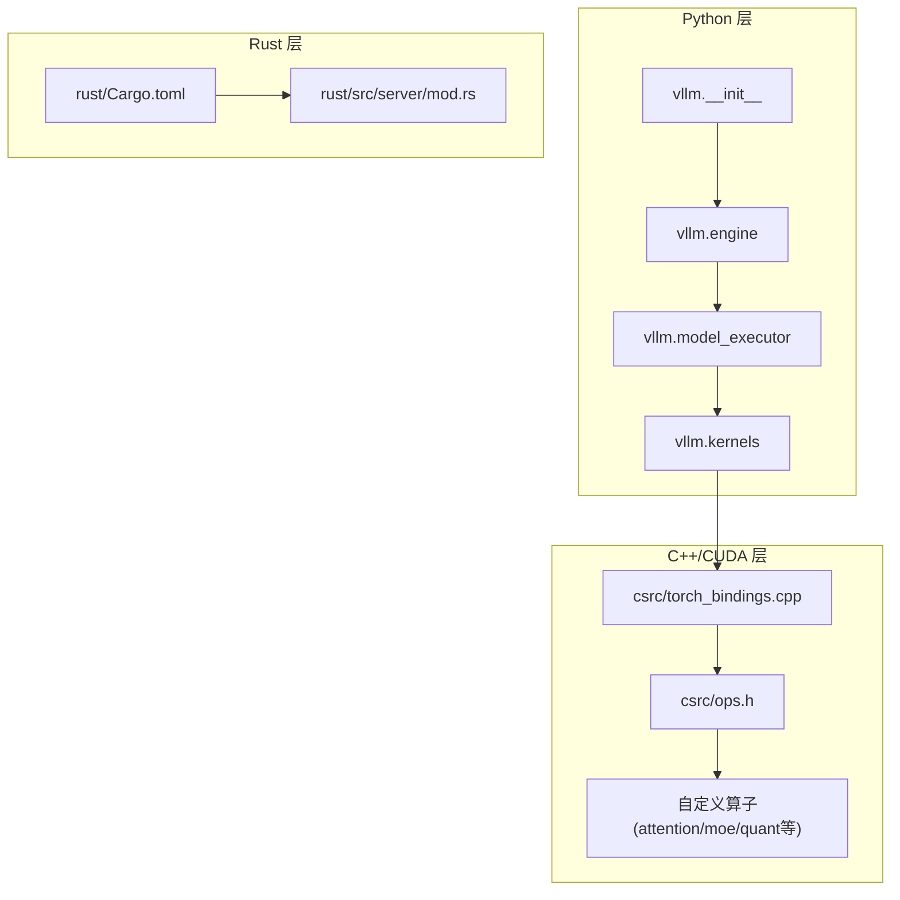
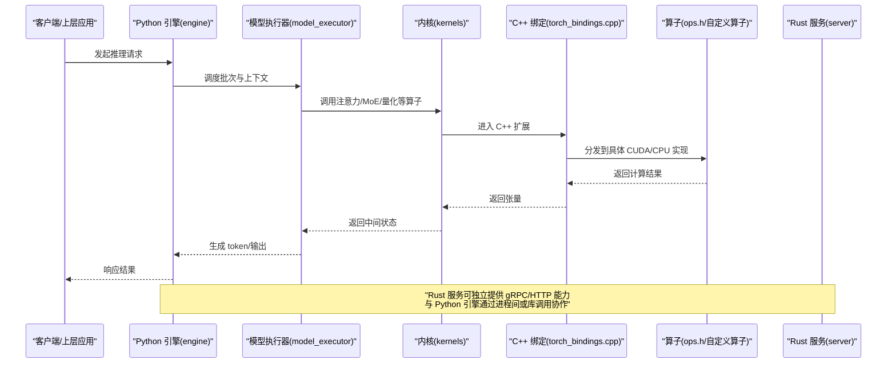
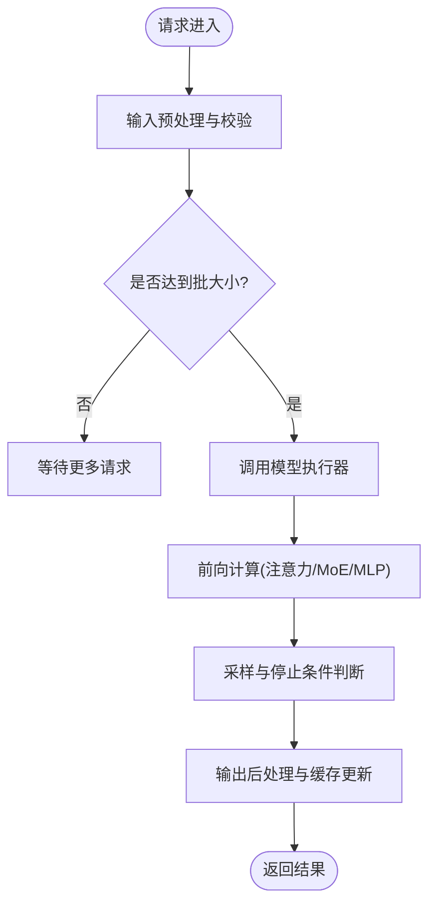
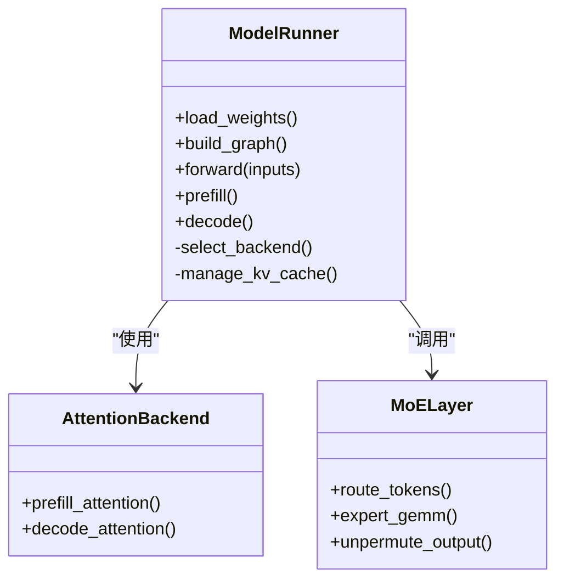
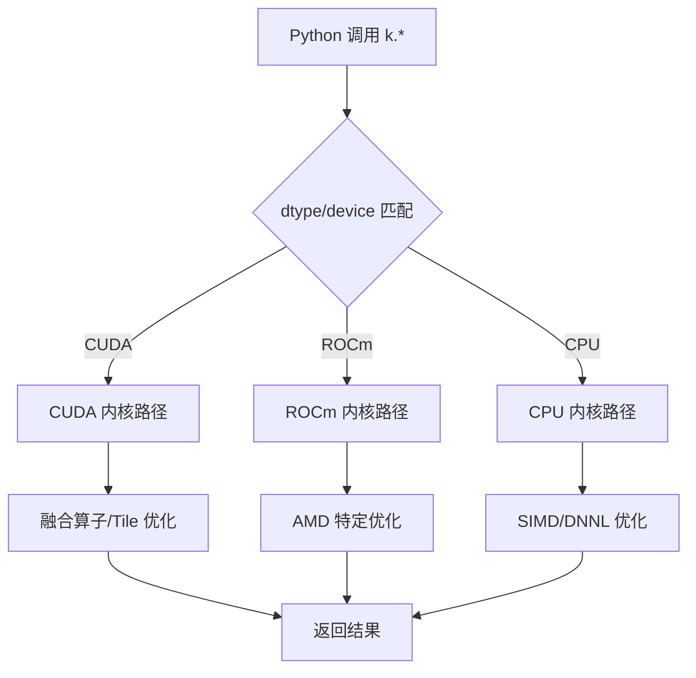
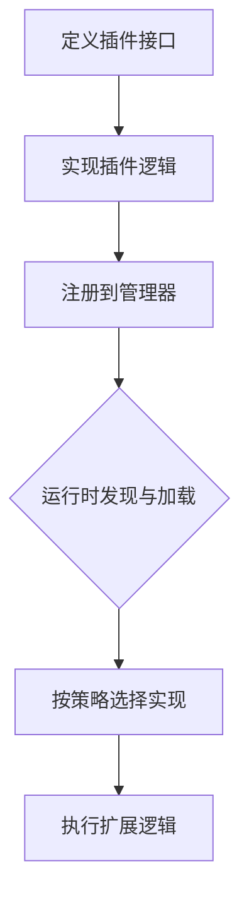
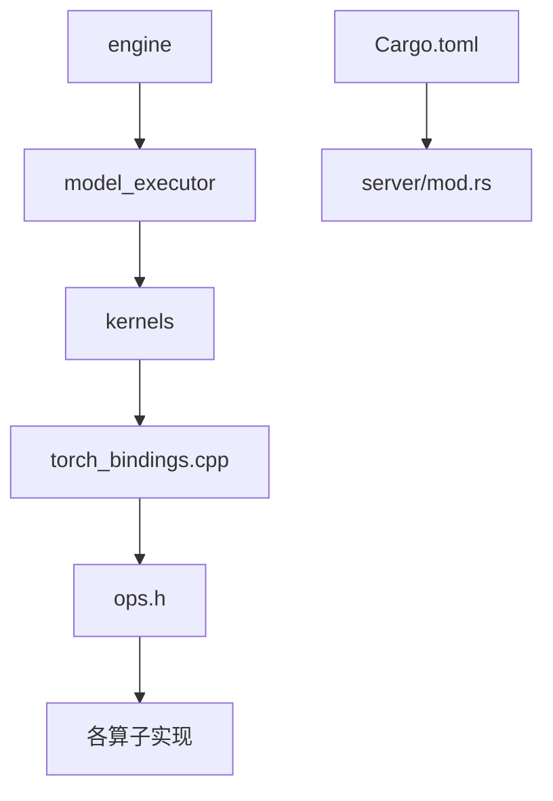

# 项目架构理解

<cite>
**本文引用的文件**   
- [vllm/__init__.py](file://vllm/__init__.py)
- [vllm/engine/__init__.py](file://vllm/engine/__init__.py)
- [vllm/model_executor/__init__.py](file://vllm/model_executor/__init__.py)
- [vllm/kernels/__init__.py](file://vllm/kernels/__init__.py)
- [csrc/torch_bindings.cpp](file://csrc/torch_bindings.cpp)
- [csrc/ops.h](file://csrc/ops.h)
- [rust/Cargo.toml](file://rust/Cargo.toml)
- [rust/src/server/mod.rs](file://rust/src/server/mod.rs)
- [setup.py](file://setup.py)
- [CMakeLists.txt](file://CMakeLists.txt)
- [pyproject.toml](file://pyproject.toml)
</cite>

## 目录
1. [简介](#简介)
2. [项目结构](#项目结构)
3. [核心组件](#核心组件)
4. [架构总览](#架构总览)
5. [详细组件分析](#详细组件分析)
6. [依赖关系分析](#依赖关系分析)
7. [性能考量](#性能考量)
8. [故障排查指南](#故障排查指南)
9. [结论](#结论)
10. [附录](#附录)

## 简介
本文件面向希望深入理解 vLLM 系统架构与模块设计的开发者，重点覆盖：
- Python 层的模块组织（engine、model_executor、kernels 等）的职责与交互
- C++/CUDA 内核层的设计原理、自定义算子实现与性能优化策略
- Rust 组件的作用与集成方式
- 插件系统的架构设计与扩展机制
- 数据流与控制流在系统中的传递过程
- 架构图与组件关系图，帮助快速把握系统结构
- 关键设计决策与技术选型的理由

## 项目结构
vLLM 采用“Python 控制面 + C++/CUDA 计算面 + Rust 服务面”的混合架构。顶层入口由 Python 暴露 API，引擎负责调度与编排；模型执行器承载具体推理流程；内核层提供高性能 CUDA/CPU 算子；Rust 侧提供轻量服务与工具链；构建系统通过 CMake 与 setup.py 统一编译原生扩展。

图表来源
- [vllm/__init__.py](file://vllm/__init__.py)
- [vllm/engine/__init__.py](file://vllm/engine/__init__.py)
- [vllm/model_executor/__init__.py](file://vllm/model_executor/__init__.py)
- [vllm/kernels/__init__.py](file://vllm/kernels/__init__.py)
- [csrc/torch_bindings.cpp](file://csrc/torch_bindings.cpp)
- [csrc/ops.h](file://csrc/ops.h)
- [rust/Cargo.toml](file://rust/Cargo.toml)
- [rust/src/server/mod.rs](file://rust/src/server/mod.rs)

章节来源
- [setup.py](file://setup.py)
- [CMakeLists.txt](file://CMakeLists.txt)
- [pyproject.toml](file://pyproject.toml)

## 核心组件
- engine（引擎）
  - 职责：请求编排、批处理调度、KV Cache 管理、并行策略协调、生命周期管理
  - 关键点：对外暴露统一的推理接口，内部驱动 model_executor 执行前向与采样
- model_executor（模型执行器）
  - 职责：加载模型权重、构建计算图、选择注意力后端、执行层算子、结果回传
  - 关键点：抽象不同硬件后端（CUDA/ROCm/XPU），支持多并行模式（TP/PP/CP/EP）
- kernels（内核）
  - 职责：封装高性能算子（Attention、MoE、量化、归一化、采样等），对接 C++/CUDA 实现
  - 关键点：按设备与数据类型分派，支持 Triton/Helion/AOT 编译路径
- C++/CUDA 绑定与算子
  - 职责：PyTorch 扩展绑定、自定义算子注册、内存分配与通信原语
  - 关键点：统一 ops.h 接口，torch_bindings.cpp 暴露 Python API
- Rust 组件
  - 职责：服务端/客户端工具、gRPC/HTTP 接口、CLI 与基准测试
  - 关键点：与 Python 解耦，便于独立构建与部署

章节来源
- [vllm/engine/__init__.py](file://vllm/engine/__init__.py)
- [vllm/model_executor/__init__.py](file://vllm/model_executor/__init__.py)
- [vllm/kernels/__init__.py](file://vllm/kernels/__init__.py)
- [csrc/torch_bindings.cpp](file://csrc/torch_bindings.cpp)
- [csrc/ops.h](file://csrc/ops.h)
- [rust/Cargo.toml](file://rust/Cargo.toml)
- [rust/src/server/mod.rs](file://rust/src/server/mod.rs)

## 架构总览
下图展示从 Python 调用到 C++/CUDA 内核执行的端到端路径，以及 Rust 服务如何与 Python 侧协作。

图表来源
- [vllm/engine/__init__.py](file://vllm/engine/__init__.py)
- [vllm/model_executor/__init__.py](file://vllm/model_executor/__init__.py)
- [vllm/kernels/__init__.py](file://vllm/kernels/__init__.py)
- [csrc/torch_bindings.cpp](file://csrc/torch_bindings.cpp)
- [csrc/ops.h](file://csrc/ops.h)
- [rust/src/server/mod.rs](file://rust/src/server/mod.rs)

## 详细组件分析

### Python 引擎（engine）
- 设计要点
  - 统一入口：对外暴露 LLM 推理接口，屏蔽底层并行与内存细节
  - 批处理与调度：聚合请求、动态批、预填充/解码阶段分离
  - KV Cache 管理：分页式缓存、前缀缓存、跨会话复用
  - 并行协调：张量并行、流水线并行、上下文并行、专家并行
- 数据流
  - 输入预处理 → 调度队列 → 执行器前向 → 采样/解码 → 输出后处理
- 控制流
  - 生命周期初始化 → 模型加载 → 请求入队 → 循环执行 → 资源回收

章节来源
- [vllm/engine/__init__.py](file://vllm/engine/__init__.py)

### 模型执行器（model_executor）
- 设计要点
  - 模型装载：权重分片、量化格式适配、LoRA/PEFT 注入
  - 后端选择：根据设备与配置选择 FlashAttention、TRT-LLM、自定义后端
  - 层执行：逐层调用内核，维护中间状态（如 KV Cache、激活值）
  - 并行策略：依据拓扑自动划分，减少通信开销
- 数据流
  - 权重/参数 → 层实例 → 算子调用 → 中间态 → 下一层
- 控制流
  - 构建图 → 预热/编译 → 执行循环 → 错误恢复与重试

图表来源
- [vllm/model_executor/__init__.py](file://vllm/model_executor/__init__.py)

章节来源
- [vllm/model_executor/__init__.py](file://vllm/model_executor/__init__.py)

### 内核（kernels）与 C++/CUDA 算子
- 设计要点
  - 算子分层：通用算子（归一化、激活）、领域算子（Attention、MoE、量化）、通信原语（AllReduce/AllGather）
  - 类型与设备分派：按 dtype/device 选择最优实现（CUDA/ROCm/CPU）
  - 编译路径：Triton/Helion/AOT/手写 CUDA，兼顾灵活性与性能
  - 内存与通信：零拷贝、共享内存、异步执行、流同步
- 自定义算子实现
  - 通过 csrc/ops.h 定义接口，csrc/torch_bindings.cpp 暴露给 Python
  - 内核实现位于 csrc/* 下，按功能域组织（attention、moe、quantization、cpu、rocm 等）
- 性能优化策略
  - 融合算子（Fused Kernels）减少内存访问
  - 块级量化与 FP8/BF16 加速
  - 注意力内核的 Tile/Block 优化与寄存器压力控制
  - 批内对齐与内存布局优化（NCHW/NHWC 转换最小化）

图表来源
- [vllm/kernels/__init__.py](file://vllm/kernels/__init__.py)
- [csrc/ops.h](file://csrc/ops.h)
- [csrc/torch_bindings.cpp](file://csrc/torch_bindings.cpp)

章节来源
- [vllm/kernels/__init__.py](file://vllm/kernels/__init__.py)
- [csrc/ops.h](file://csrc/ops.h)
- [csrc/torch_bindings.cpp](file://csrc/torch_bindings.cpp)

### Rust 组件与服务集成
- 作用
  - 提供独立的服务器/客户端能力（gRPC/HTTP），用于服务编排、监控、基准测试
  - 与 Python 引擎解耦，便于容器化与微服务部署
- 集成方式
  - 通过 Cargo 构建，二进制或库形式被上层调用
  - 与 Python 进程间通信（IPC）或通过网络协议交互
- 典型模块
  - server：HTTP/gRPC 服务
  - parser/tokenizer：文本解析与分词
  - bench：性能基准与压测

图表来源
- [rust/Cargo.toml](file://rust/Cargo.toml)
- [rust/src/server/mod.rs](file://rust/src/server/mod.rs)

章节来源
- [rust/Cargo.toml](file://rust/Cargo.toml)
- [rust/src/server/mod.rs](file://rust/src/server/mod.rs)

### 插件系统与扩展机制
- 设计目标
  - 允许用户以插件形式扩展注意力后端、量化方案、采样器、IO 处理器、LoRA 解析器等
  - 保持核心稳定，扩展点清晰、接口稳定
- 扩展点
  - 注意力后端注册表：按设备/能力选择最优实现
  - 量化方案注册表：支持多种量化格式与反量化路径
  - 采样器/Logits 处理器：自定义概率修正与约束
  - IO 处理器：多模态输入预处理与后处理
- 扩展流程
  - 定义插件接口 → 实现具体逻辑 → 注册到对应管理器 → 运行时动态加载

章节来源
- [vllm/plugins](file://vllm/plugins)

## 依赖关系分析
- Python 层依赖
  - engine 依赖 model_executor 与 kernels
  - model_executor 依赖 kernels 与分布式通信原语
  - kernels 依赖 C++/CUDA 绑定与平台抽象
- 原生层依赖
  - torch_bindings.cpp 依赖 ops.h 定义的算子接口
  - 各子目录（attention、moe、quantization、cpu、rocm）提供具体实现
- Rust 层依赖
  - Cargo.toml 声明依赖与构建脚本
  - server 模块提供网络服务与 CLI

图表来源
- [vllm/engine/__init__.py](file://vllm/engine/__init__.py)
- [vllm/model_executor/__init__.py](file://vllm/model_executor/__init__.py)
- [vllm/kernels/__init__.py](file://vllm/kernels/__init__.py)
- [csrc/torch_bindings.cpp](file://csrc/torch_bindings.cpp)
- [csrc/ops.h](file://csrc/ops.h)
- [rust/Cargo.toml](file://rust/Cargo.toml)
- [rust/src/server/mod.rs](file://rust/src/server/mod.rs)

章节来源
- [setup.py](file://setup.py)
- [CMakeLists.txt](file://CMakeLists.txt)
- [pyproject.toml](file://pyproject.toml)

## 性能考量
- 内存与带宽
  - 分页式 KV Cache 与零拷贝减少碎片与复制
  - 批量对齐与连续内存布局提升吞吐
- 计算优化
  - 融合算子减少访存瓶颈
  - 低精度（FP8/BF16/INT4）与量化加速
  - 注意力内核的 Tile/Block 与寄存器优化
- 并行与通信
  - 张量/流水线/上下文/专家并行协同，降低通信开销
  - 自定义 AllReduce/QuickReduce 提升集群效率
- 编译与调度
  - AOT/Triton/Helion 编译路径按需选择
  - CUDA Graph 与异步流减少启动开销

[本节为通用指导，不直接分析具体文件]

## 故障排查指南
- 常见问题定位
  - 内核未正确加载：检查 torch_bindings.cpp 与 ops.h 的导出与注册
  - 设备不匹配：确认 dtype/device 分派路径是否正确
  - 内存不足：调整批大小、KV Cache 容量与量化策略
  - 并行通信失败：检查 NCCL/RDMA 配置与拓扑
- 调试建议
  - 启用日志与指标收集（metrics/tracing）
  - 使用基准脚本验证单算子性能
  - 逐步隔离问题（Python 层 vs 内核层 vs Rust 服务）

章节来源
- [csrc/torch_bindings.cpp](file://csrc/torch_bindings.cpp)
- [csrc/ops.h](file://csrc/ops.h)
- [rust/src/server/mod.rs](file://rust/src/server/mod.rs)

## 结论
vLLM 通过清晰的层次划分与模块化设计，实现了高性能、可扩展的大模型推理系统。Python 层负责编排与调度，C++/CUDA 层提供极致性能的内核实现，Rust 层提供独立的服务能力。插件系统使扩展点稳定且易于接入。整体架构兼顾了灵活性、性能与可维护性，适合大规模生产部署与持续演进。

[本节为总结，不直接分析具体文件]

## 附录
- 构建与安装
  - 使用 setup.py 与 CMake 统一构建 Python 扩展与原生库
  - Rust 组件通过 Cargo 独立构建，可与 Python 环境共存
- 参考文档
  - 设计文档与特性说明见 docs/design 与 docs/features
  - 示例与用法见 examples 与 docs/cli

[本节为补充信息，不直接分析具体文件]