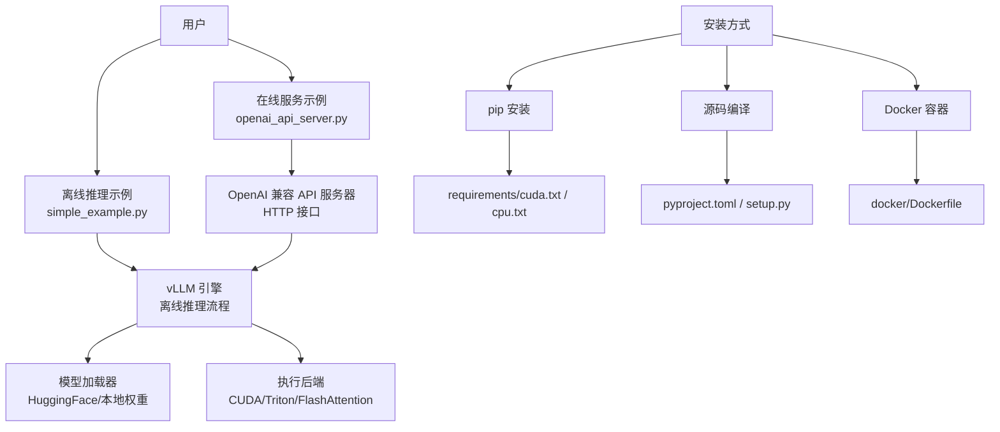
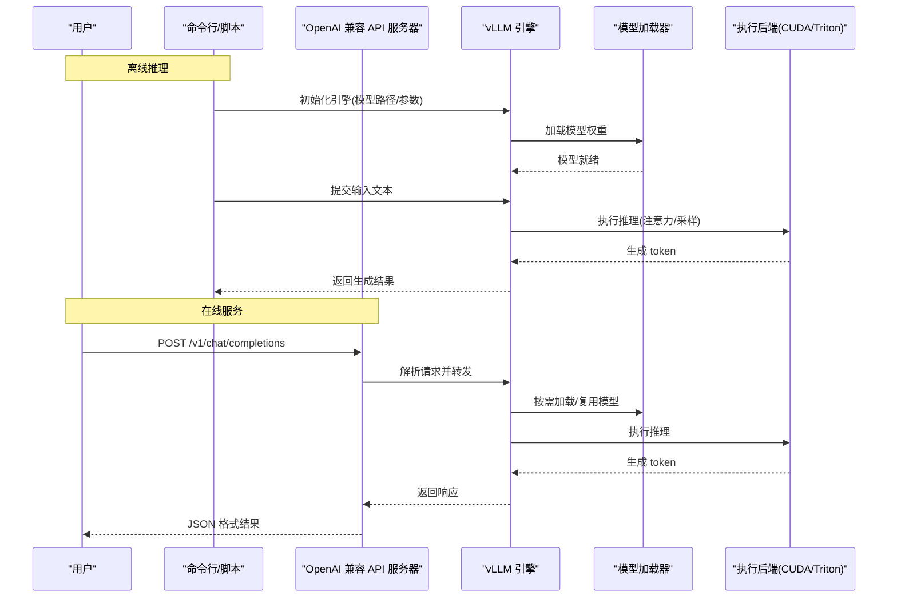
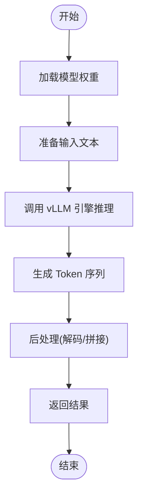
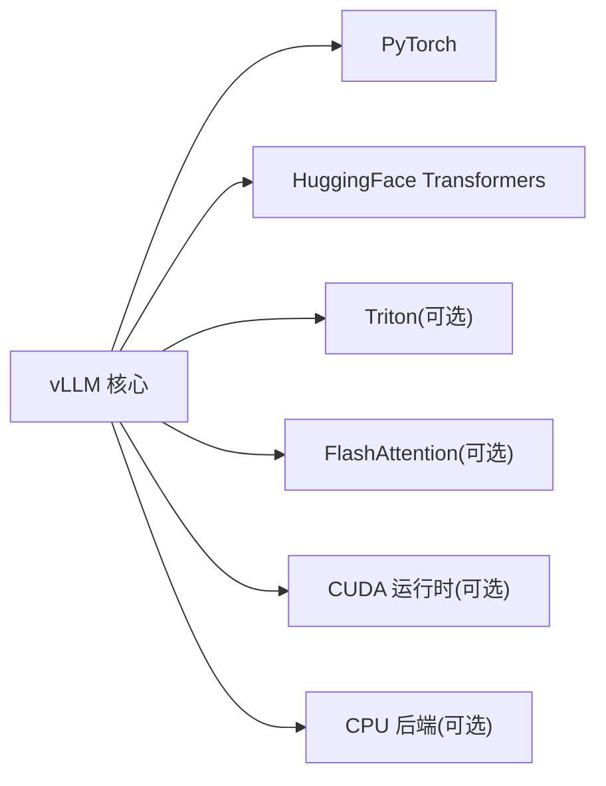

# 快速开始

<cite>
**本文档引用的文件**   
- [README.md](file://README.md)
- [pyproject.toml](file://pyproject.toml)
- [requirements/cuda.txt](file://requirements/cuda.txt)
- [requirements/cpu.txt](file://requirements/cpu.txt)
- [docker/Dockerfile](file://docker/Dockerfile)
- [examples/basic/offline_inference/simple_example.py](file://examples/basic/offline_inference/simple_example.py)
- [examples/basic/online_serving/openai_api_server.py](file://examples/basic/online_serving/openai_api_server.py)
- [docs/getting_started/installation/pip_installation.md](file://docs/getting_started/installation/pip_installation.md)
- [docs/getting_started/installation/source_installation.md](file://docs/getting_started/installation/source_installation.md)
- [docs/getting_started/installation/docker_installation.md](file://docs/getting_started/installation/docker_installation.md)
- [docs/getting_started/quickstart.md](file://docs/getting_started/quickstart.md)
- [docs/serving/online_serving/openai_compatible_api.md](file://docs/serving/online_serving/openai_compatible_api.md)
- [docs/serving/offline_inference.md](file://docs/serving/offline_inference.md)
- [docs/usage/troubleshooting.md](file://docs/usage/troubleshooting.md)
</cite>

## 目录
1. [简介](#简介)
2. [项目结构](#项目结构)
3. [核心组件](#核心组件)
4. [架构总览](#架构总览)
5. [详细组件分析](#详细组件分析)
6. [依赖关系分析](#依赖关系分析)
7. [性能注意事项](#性能注意事项)
8. [故障排除指南](#故障排除指南)
9. [结论](#结论)
10. [附录](#附录)

## 简介
本快速开始指南旨在帮助你在最短时间内完成 vLLM 的安装与运行，包括环境要求、多平台安装方式（pip、源码编译、Docker）、离线推理示例和在线服务部署（OpenAI 兼容 API）。文档中的示例可直接运行，并给出预期输出说明。

## 项目结构
vLLM 仓库包含安装与使用文档、示例代码、Docker 配置以及核心 Python 包等。快速开始主要涉及以下目录与文件：
- 安装文档：docs/getting_started/installation 下的 pip、源码、Docker 安装说明
- 快速开始入口：docs/getting_started/quickstart.md
- 离线推理示例：examples/basic/offline_inference/simple_example.py
- 在线服务示例：examples/basic/online_serving/openai_api_server.py
- Docker 镜像构建：docker/Dockerfile
- 依赖与环境：requirements/*.txt、pyproject.toml、README.md

图表来源
- [docs/getting_started/quickstart.md](file://docs/getting_started/quickstart.md)
- [examples/basic/offline_inference/simple_example.py](file://examples/basic/offline_inference/simple_example.py)
- [examples/basic/online_serving/openai_api_server.py](file://examples/basic/online_serving/openai_api_server.py)
- [docker/Dockerfile](file://docker/Dockerfile)
- [requirements/cuda.txt](file://requirements/cuda.txt)
- [requirements/cpu.txt](file://requirements/cpu.txt)
- [pyproject.toml](file://pyproject.toml)

章节来源
- [README.md](file://README.md)
- [docs/getting_started/quickstart.md](file://docs/getting_started/quickstart.md)

## 核心组件
- 离线推理引擎：通过 Python API 直接调用 vLLM 引擎进行批量或单条文本生成，适合脚本化任务与批处理。
- OpenAI 兼容 API 服务器：提供标准 OpenAI 风格的 HTTP 接口，便于与现有客户端集成。
- 模型加载器：支持从 HuggingFace Hub 或本地路径加载模型权重，自动适配不同模型架构。
- 执行后端：基于 CUDA/Triton/FlashAttention 等高性能内核，最大化 GPU 吞吐与延迟优化。

章节来源
- [docs/serving/offline_inference.md](file://docs/serving/offline_inference.md)
- [docs/serving/online_serving/openai_compatible_api.md](file://docs/serving/online_serving/openai_compatible_api.md)

## 架构总览
下图展示了离线推理与在线服务的整体交互流程，包括请求进入、模型加载、推理执行与结果返回。

图表来源
- [examples/basic/offline_inference/simple_example.py](file://examples/basic/offline_inference/simple_example.py)
- [examples/basic/online_serving/openai_api_server.py](file://examples/basic/online_serving/openai_api_server.py)
- [docs/serving/offline_inference.md](file://docs/serving/offline_inference.md)
- [docs/serving/online_serving/openai_compatible_api.md](file://docs/serving/online_serving/openai_compatible_api.md)

## 详细组件分析

### 环境要求
- Python 版本：建议使用 Python 3.10+（具体以官方安装文档为准）
- CUDA 驱动：NVIDIA GPU 需安装匹配的 CUDA 驱动；若使用 CPU 推理则无需 CUDA
- PyTorch 版本：根据 CUDA/CPU 选择对应 wheel，确保与 vLLM 二进制兼容
- Triton/FlashAttention：GPU 推理推荐启用以获得最佳性能

章节来源
- [docs/getting_started/installation/pip_installation.md](file://docs/getting_started/installation/pip_installation.md)
- [requirements/cuda.txt](file://requirements/cuda.txt)
- [requirements/cpu.txt](file://requirements/cpu.txt)

### 安装方法
- pip 安装：适用于大多数用户，按 CUDA/CPU 选择相应命令
- 源码编译：适用于需要定制内核或最新功能的开发者
- Docker 容器：开箱即用，内置依赖与运行时环境

章节来源
- [docs/getting_started/installation/pip_installation.md](file://docs/getting_started/installation/pip_installation.md)
- [docs/getting_started/installation/source_installation.md](file://docs/getting_started/installation/source_installation.md)
- [docs/getting_started/installation/docker_installation.md](file://docs/getting_started/installation/docker_installation.md)
- [docker/Dockerfile](file://docker/Dockerfile)

### 离线推理示例
- 示例位置：examples/basic/offline_inference/simple_example.py
- 功能说明：加载指定模型，处理输入文本，生成输出并打印结果
- 预期输出：包含生成的文本内容，可能带有停止原因或元数据

章节来源
- [examples/basic/offline_inference/simple_example.py](file://examples/basic/offline_inference/simple_example.py)
- [docs/serving/offline_inference.md](file://docs/serving/offline_inference.md)

### 在线服务部署（OpenAI 兼容 API）
- 示例位置：examples/basic/online_serving/openai_api_server.py
- 功能说明：启动 HTTP 服务，暴露 OpenAI 风格接口（如 /v1/chat/completions）
- 使用方式：通过任意 OpenAI 客户端库或 curl 发送请求，获取 JSON 响应

章节来源
- [examples/basic/online_serving/openai_api_server.py](file://examples/basic/online_serving/openai_api_server.py)
- [docs/serving/online_serving/openai_compatible_api.md](file://docs/serving/online_serving/openai_compatible_api.md)

### 概念性概览
下图展示了一个典型的离线推理流程，从输入到输出的关键步骤。

[此图为概念流程图，不直接映射具体源代码文件]

## 依赖关系分析
vLLM 的依赖分为运行时依赖与可选加速库。CUDA 环境下推荐使用 cuBLAS、cuDNN、Triton、FlashAttention 等以提升性能；CPU 环境仅需基础 Python 依赖。

图表来源
- [pyproject.toml](file://pyproject.toml)
- [requirements/cuda.txt](file://requirements/cuda.txt)
- [requirements/cpu.txt](file://requirements/cpu.txt)

章节来源
- [pyproject.toml](file://pyproject.toml)
- [requirements/cuda.txt](file://requirements/cuda.txt)
- [requirements/cpu.txt](file://requirements/cpu.txt)

## 性能注意事项
- 优先使用 GPU 与 CUDA 环境，启用 Triton 与 FlashAttention 可获得显著吞吐提升
- 合理设置批大小、上下文长度与采样参数，避免显存溢出
- 对于长文本场景，考虑启用 KV Cache 与分页注意力优化
- 监控显存与 GPU 利用率，动态调整并发与批大小

[本节为通用指导，不直接分析具体文件]

## 故障排除指南
常见问题与解决思路：
- 无法导入 vLLM：检查 Python 版本与依赖是否匹配，确认已正确安装 CUDA/CPU 版本
- 显存不足：降低批大小或上下文长度，或使用量化/低精度模式
- 模型加载失败：确认模型路径或 HuggingFace 访问权限，检查网络与缓存
- API 服务不可用：检查端口占用、防火墙与进程状态

章节来源
- [docs/usage/troubleshooting.md](file://docs/usage/troubleshooting.md)

## 结论
通过本快速开始指南，你可以在最短时间内完成 vLLM 的安装与运行，掌握离线推理与在线服务的基本用法。建议结合官方文档与示例进一步探索高级特性与性能调优。

[本节为总结性内容，不直接分析具体文件]

## 附录
- 快速开始入口：docs/getting_started/quickstart.md
- 安装文档：docs/getting_started/installation/*
- 示例代码：examples/basic/offline_inference/* 与 examples/basic/online_serving/*
- Docker 镜像：docker/Dockerfile

[本节为补充信息，不直接分析具体文件]