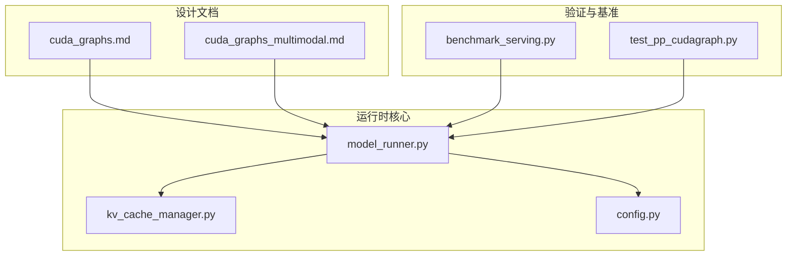
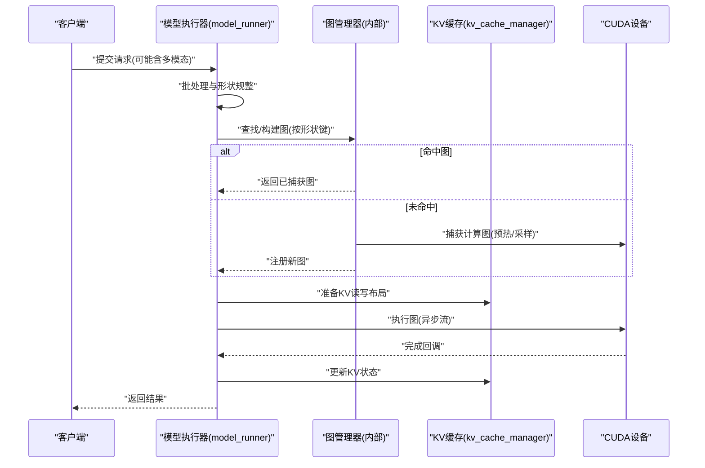
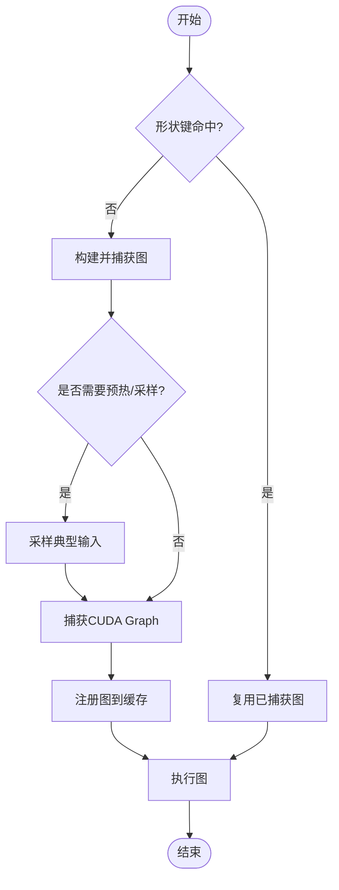
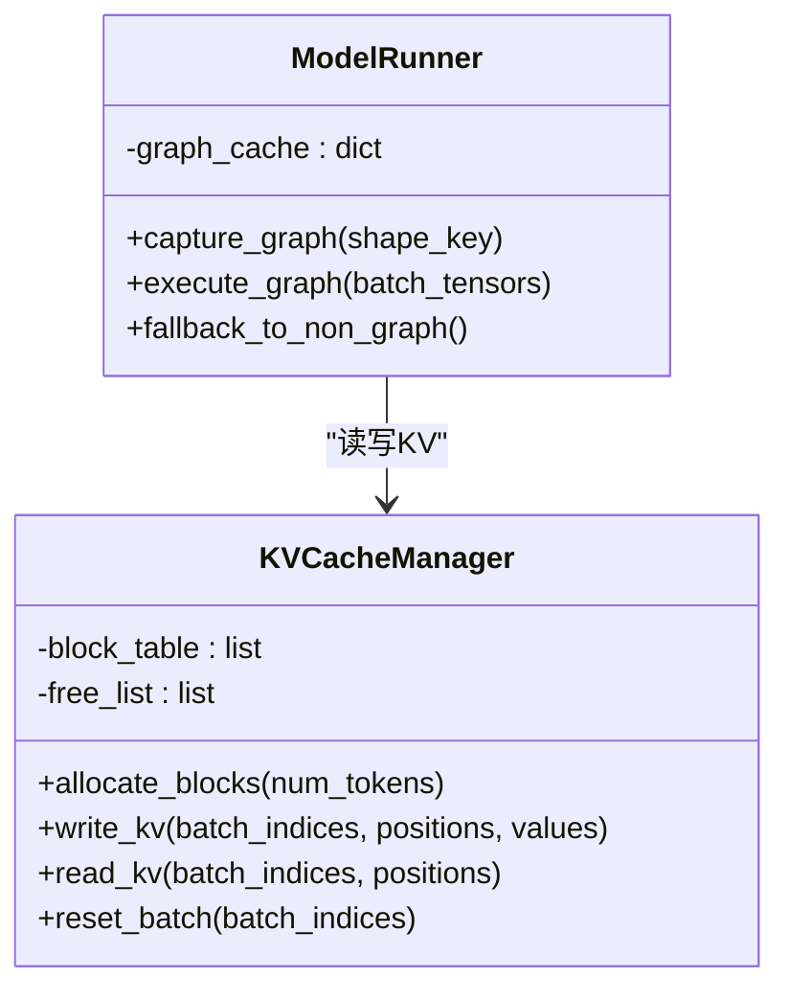
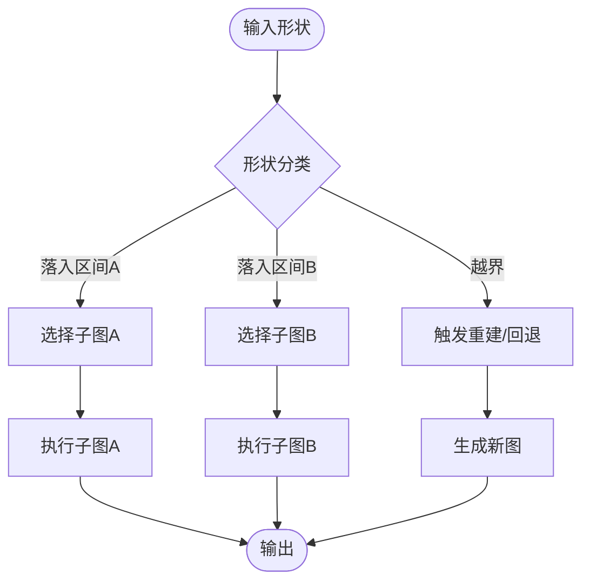
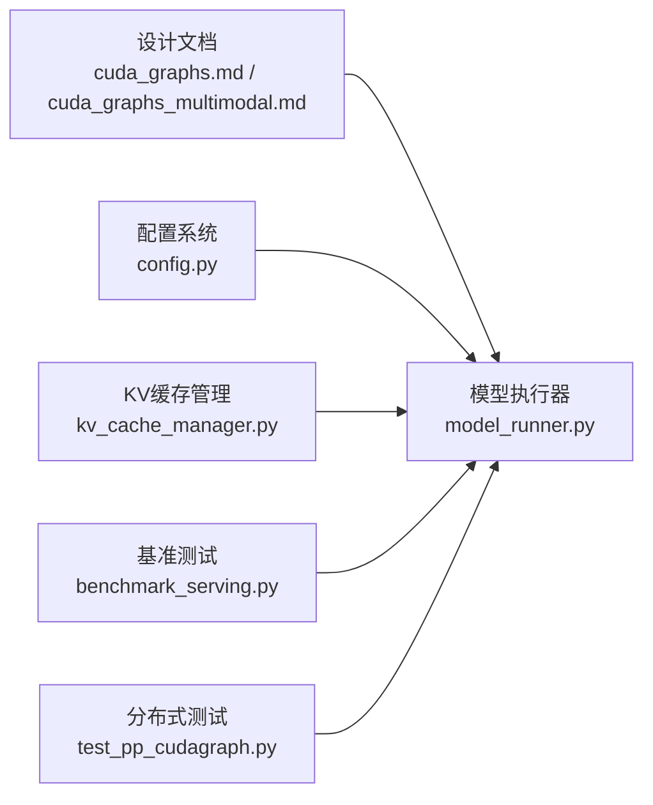

# CUDA Graph优化

<cite>
**本文引用的文件**   
- [vllm/design/cuda_graphs.md](file://vllm/design/cuda_graphs.md)
- [vllm/design/cuda_graphs_multimodal.md](file://vllm/design/cuda_graphs_multimodal.md)
- [vllm/model_executor/model_runner.py](file://vllm/model_executor/model_runner.py)
- [vllm/v1/core/kv_cache_manager.py](file://vllm/v1/core/kv_cache_manager.py)
- [vllm/config.py](file://vllm/config.py)
- [benchmarks/benchmark_serving.py](file://benchmarks/benchmark_serving.py)
- [tests/distributed/test_pp_cudagraph.py](file://tests/distributed/test_pp_cudagraph.py)
</cite>

## 目录
1. [简介](#简介)
2. [项目结构](#项目结构)
3. [核心组件](#核心组件)
4. [架构总览](#架构总览)
5. [详细组件分析](#详细组件分析)
6. [依赖关系分析](#依赖关系分析)
7. [性能考量](#性能考量)
8. [故障排除指南](#故障排除指南)
9. [结论](#结论)
10. [附录](#附录)

## 简介
本文件系统性阐述 vLLM 中 CUDA Graph 的优化机制与实现原理，覆盖概念、优势、使用场景、图构建流程、内存管理、执行优化、breakable CUDA Graph 策略（动态形状与条件分支）、配置参数、性能调优方法与故障排除。内容基于仓库中的设计文档与关键实现文件进行归纳与可视化说明，帮助读者从宏观到微观全面理解 vLLM 如何利用 CUDA Graph 提升推理吞吐与延迟稳定性。

## 项目结构
围绕 CUDA Graph 的相关设计与实现主要分布在以下位置：
- 设计文档：vllm/design/cuda_graphs.md、vllm/design/cuda_graphs_multimodal.md
- 模型执行器与调度：vllm/model_executor/model_runner.py
- KV Cache 管理与图边界：vllm/v1/core/kv_cache_manager.py
- 配置项定义：vllm/config.py
- 基准测试与回归：benchmarks/benchmark_serving.py
- 分布式/流水线并行相关测试：tests/distributed/test_pp_cudagraph.py

图表来源 
- [vllm/design/cuda_graphs.md](file://vllm/design/cuda_graphs.md)
- [vllm/design/cuda_graphs_multimodal.md](file://vllm/design/cuda_graphs_multimodal.md)
- [vllm/model_executor/model_runner.py](file://vllm/model_executor/model_runner.py)
- [vllm/v1/core/kv_cache_manager.py](file://vllm/v1/core/kv_cache_manager.py)
- [vllm/config.py](file://vllm/config.py)
- [benchmarks/benchmark_serving.py](file://benchmarks/benchmark_serving.py)
- [tests/distributed/test_pp_cudagraph.py](file://tests/distributed/test_pp_cudagraph.py)

章节来源
- [vllm/design/cuda_graphs.md](file://vllm/design/cuda_graphs.md)
- [vllm/design/cuda_graphs_multimodal.md](file://vllm/design/cuda_graphs_multimodal.md)
- [vllm/model_executor/model_runner.py](file://vllm/model_executor/model_runner.py)
- [vllm/v1/core/kv_cache_manager.py](file://vllm/v1/core/kv_cache_manager.py)
- [vllm/config.py](file://vllm/config.py)
- [benchmarks/benchmark_serving.py](file://benchmarks/benchmark_serving.py)
- [tests/distributed/test_pp_cudagraph.py](file://tests/distributed/test_pp_cudagraph.py)

## 核心组件
- 图构建与缓存：负责在首次或预热阶段捕获计算图，建立输入形状/元数据到图的映射，并在后续请求命中时复用。
- 执行引擎：将请求按批次组织为固定形状的张量，调用已捕获的图执行，减少 Python/CUDA 驱动开销。
- KV Cache 管理：维护分页式 KV 缓存，确保图执行期间 KV 写入与读取满足一致性，必要时触发图重建或回退。
- 配置系统：暴露开关与阈值，控制是否启用图、最大图数量、动态形状容忍度等。
- 多模态支持：对图像/音频等多模态输入进行预处理与对齐，保证进入图前形状稳定。

章节来源
- [vllm/model_executor/model_runner.py](file://vllm/model_executor/model_runner.py)
- [vllm/v1/core/kv_cache_manager.py](file://vllm/v1/core/kv_cache_manager.py)
- [vllm/config.py](file://vllm/config.py)
- [vllm/design/cuda_graphs_multimodal.md](file://vllm/design/cuda_graphs_multimodal.md)

## 架构总览
下图展示了 vLLM 中 CUDA Graph 的整体交互：请求进入后由模型执行器进行批处理与形状规整，随后通过图管理器选择或构建图，最终执行并写回 KV Cache。

图表来源 
- [vllm/model_executor/model_runner.py](file://vllm/model_executor/model_runner.py)
- [vllm/v1/core/kv_cache_manager.py](file://vllm/v1/core/kv_cache_manager.py)

章节来源
- [vllm/model_executor/model_runner.py](file://vllm/model_executor/model_runner.py)
- [vllm/v1/core/kv_cache_manager.py](file://vllm/v1/core/kv_cache_manager.py)

## 详细组件分析

### 图构建与缓存策略
- 形状键设计：以 batch_size、序列长度、注意力头数等关键维度作为键，避免频繁重建。
- 预热与采样：启动阶段对典型形状进行预热捕获，提高命中率。
- 失效与重建：当形状超出阈值或内存不足时，选择性重建部分图或全部图。
- 多模态适配：对多模态输入先做标准化与对齐，再参与图构建，确保进入图的数据形状稳定。

图表来源 
- [vllm/model_executor/model_runner.py](file://vllm/model_executor/model_runner.py)
- [vllm/design/cuda_graphs.md](file://vllm/design/cuda_graphs.md)

章节来源
- [vllm/model_executor/model_runner.py](file://vllm/model_executor/model_runner.py)
- [vllm/design/cuda_graphs.md](file://vllm/design/cuda_graphs.md)

### 内存管理与KV一致性
- 预分配与分页：KV Cache 采用分页块管理，图执行期间避免动态分配。
- 同步点设置：在图边界插入必要的同步，确保 CPU/GPU 间数据一致。
- 回退策略：若图内出现不支持的操作或内存压力过大，回退到非图路径。

图表来源 
- [vllm/v1/core/kv_cache_manager.py](file://vllm/v1/core/kv_cache_manager.py)
- [vllm/model_executor/model_runner.py](file://vllm/model_executor/model_runner.py)

章节来源
- [vllm/v1/core/kv_cache_manager.py](file://vllm/v1/core/kv_cache_manager.py)
- [vllm/model_executor/model_runner.py](file://vllm/model_executor/model_runner.py)

### Breakable CUDA Graph：动态形状与条件分支
- 动态形状处理：通过“可打断”的图边界，将变化维度（如序列长度）外置为参数，或使用多个子图覆盖常见形状区间。
- 条件分支：在图外判断分支，选择不同子图执行；或将分支常量折叠进图，保持图内无分支。
- 最小化重建：仅在形状跨越阈值或资源紧张时重建，日常请求尽量命中现有图。

图表来源 
- [vllm/design/cuda_graphs.md](file://vllm/design/cuda_graphs.md)
- [vllm/design/cuda_graphs_multimodal.md](file://vllm/design/cuda_graphs_multimodal.md)

章节来源
- [vllm/design/cuda_graphs.md](file://vllm/design/cuda_graphs.md)
- [vllm/design/cuda_graphs_multimodal.md](file://vllm/design/cuda_graphs_multimodal.md)

### 多模态输入的图适配
- 预处理阶段：将图像/音频等统一为固定尺寸或分块表示，确保进入图前形状稳定。
- 融合策略：尽可能将多模态特征提取与文本解码融合入图，减少跨核通信。
- 降级路径：若多模态算子不被图支持，自动回退到非图路径。

章节来源
- [vllm/design/cuda_graphs_multimodal.md](file://vllm/design/cuda_graphs_multimodal.md)

### 配置参数与开关
- 启用/禁用图：全局开关控制是否使用 CUDA Graph。
- 最大图数量：限制缓存的图数量，防止显存占用过高。
- 动态形状阈值：决定何时触发重建或回退。
- 预热模式：是否启用启动期预热捕获。

章节来源
- [vllm/config.py](file://vllm/config.py)

### 执行优化要点
- 批不变性：确保同一批内的操作顺序与依赖稳定，便于图捕获。
- 流与事件：合理划分 CUDA Stream，利用事件同步减少等待。
- Kernel 融合：优先使用融合内核，降低启动开销。

章节来源
- [vllm/model_executor/model_runner.py](file://vllm/model_executor/model_runner.py)

## 依赖关系分析
下图展示关键模块之间的依赖关系：模型执行器依赖 KV 缓存管理与配置系统，设计文档指导实现细节，基准与测试用于验证行为。

图表来源 
- [vllm/design/cuda_graphs.md](file://vllm/design/cuda_graphs.md)
- [vllm/design/cuda_graphs_multimodal.md](file://vllm/design/cuda_graphs_multimodal.md)
- [vllm/model_executor/model_runner.py](file://vllm/model_executor/model_runner.py)
- [vllm/v1/core/kv_cache_manager.py](file://vllm/v1/core/kv_cache_manager.py)
- [vllm/config.py](file://vllm/config.py)
- [benchmarks/benchmark_serving.py](file://benchmarks/benchmark_serving.py)
- [tests/distributed/test_pp_cudagraph.py](file://tests/distributed/test_pp_cudagraph.py)

章节来源
- [vllm/design/cuda_graphs.md](file://vllm/design/cuda_graphs.md)
- [vllm/design/cuda_graphs_multimodal.md](file://vllm/design/cuda_graphs_multimodal.md)
- [vllm/model_executor/model_runner.py](file://vllm/model_executor/model_runner.py)
- [vllm/v1/core/kv_cache_manager.py](file://vllm/v1/core/kv_cache_manager.py)
- [vllm/config.py](file://vllm/config.py)
- [benchmarks/benchmark_serving.py](file://benchmarks/benchmark_serving.py)
- [tests/distributed/test_pp_cudagraph.py](file://tests/distributed/test_pp_cudagraph.py)

## 性能考量
- 命中率优先：通过预热与形状分区提高图命中率，减少重建成本。
- 显存预算：限制图数量与大小，避免 OOM；必要时启用回退。
- 批大小与序列长度：调整批大小与最大序列长度以获得更稳定的形状分布。
- 多模态预处理：将耗时且形状变化的预处理移出图，提升整体效率。
- 监控指标：跟踪图命中率、重建频率、平均延迟与吞吐，定位瓶颈。

[本节为通用指导，不直接分析具体文件]

## 故障排除指南
- 现象：图命中率低
  - 检查形状分区是否过细或过粗，调整阈值与预热策略。
  - 确认多模态预处理是否稳定输出固定形状。
- 现象：显存不足
  - 降低最大图数量或单图容量，启用回退路径。
  - 检查 KV Cache 分页块大小与分配策略。
- 现象：延迟抖动
  - 增加预热样本多样性，减少运行期重建。
  - 检查流与事件同步是否过度阻塞。
- 现象：多模态异常
  - 确认多模态算子是否在图支持列表中，否则启用回退。
  - 校验输入尺寸与通道数是否符合预期。

章节来源
- [vllm/model_executor/model_runner.py](file://vllm/model_executor/model_runner.py)
- [vllm/v1/core/kv_cache_manager.py](file://vllm/v1/core/kv_cache_manager.py)
- [vllm/design/cuda_graphs.md](file://vllm/design/cuda_graphs.md)
- [vllm/design/cuda_graphs_multimodal.md](file://vllm/design/cuda_graphs_multimodal.md)

## 结论
vLLM 通过精细的形状管理、KV Cache 一致性保障与 breakable CUDA Graph 策略，在保持高吞吐的同时兼顾动态性与稳定性。合理配置与预热、监控命中率与显存使用，是获得最佳性能的关键。多模态场景需特别关注预处理与算子支持，必要时采用回退路径保证鲁棒性。

[本节为总结性内容，不直接分析具体文件]

## 附录
- 参考设计文档：
  - [vllm/design/cuda_graphs.md](file://vllm/design/cuda_graphs.md)
  - [vllm/design/cuda_graphs_multimodal.md](file://vllm/design/cuda_graphs_multimodal.md)
- 关键实现：
  - [vllm/model_executor/model_runner.py](file://vllm/model_executor/model_runner.py)
  - [vllm/v1/core/kv_cache_manager.py](file://vllm/v1/core/kv_cache_manager.py)
  - [vllm/config.py](file://vllm/config.py)
- 验证与基准：
  - [benchmarks/benchmark_serving.py](file://benchmarks/benchmark_serving.py)
  - [tests/distributed/test_pp_cudagraph.py](file://tests/distributed/test_pp_cudagraph.py)