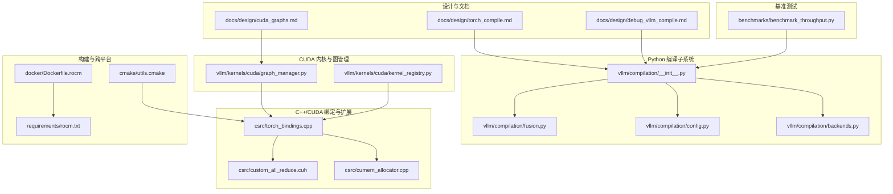
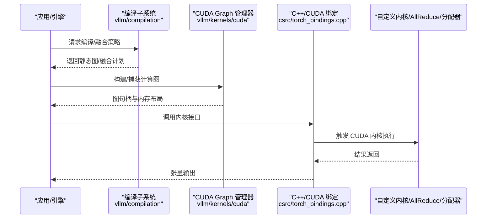
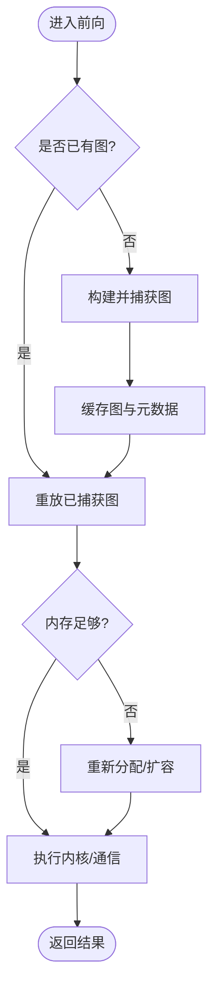
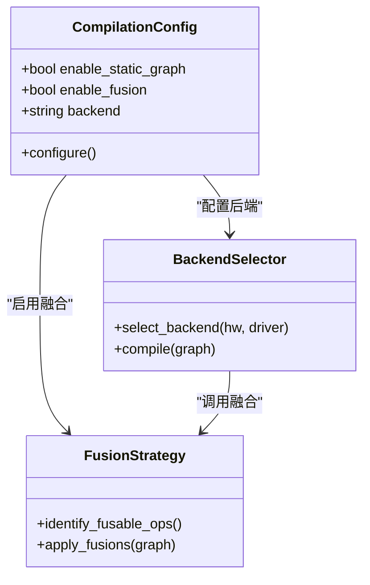
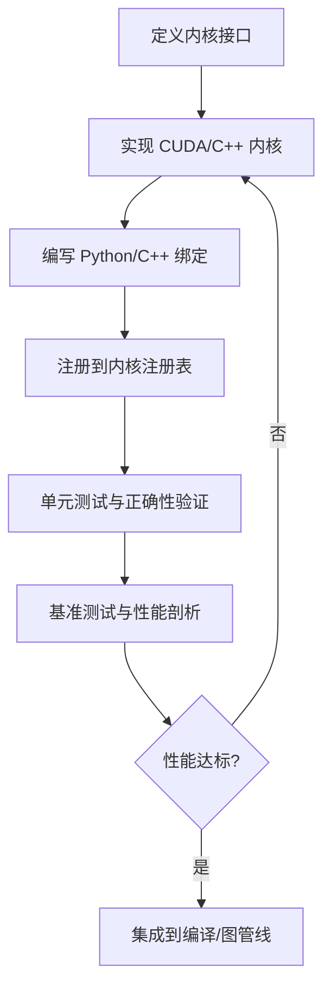
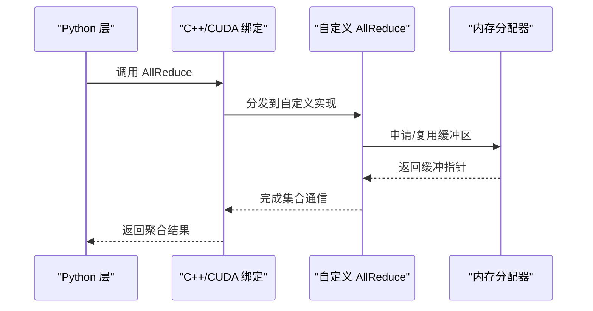
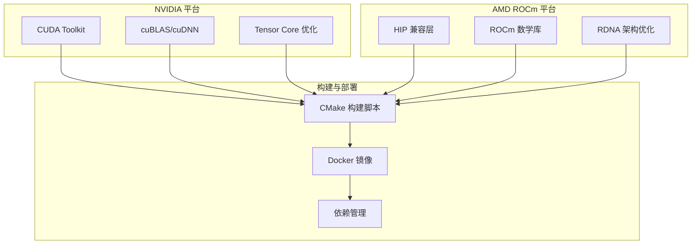
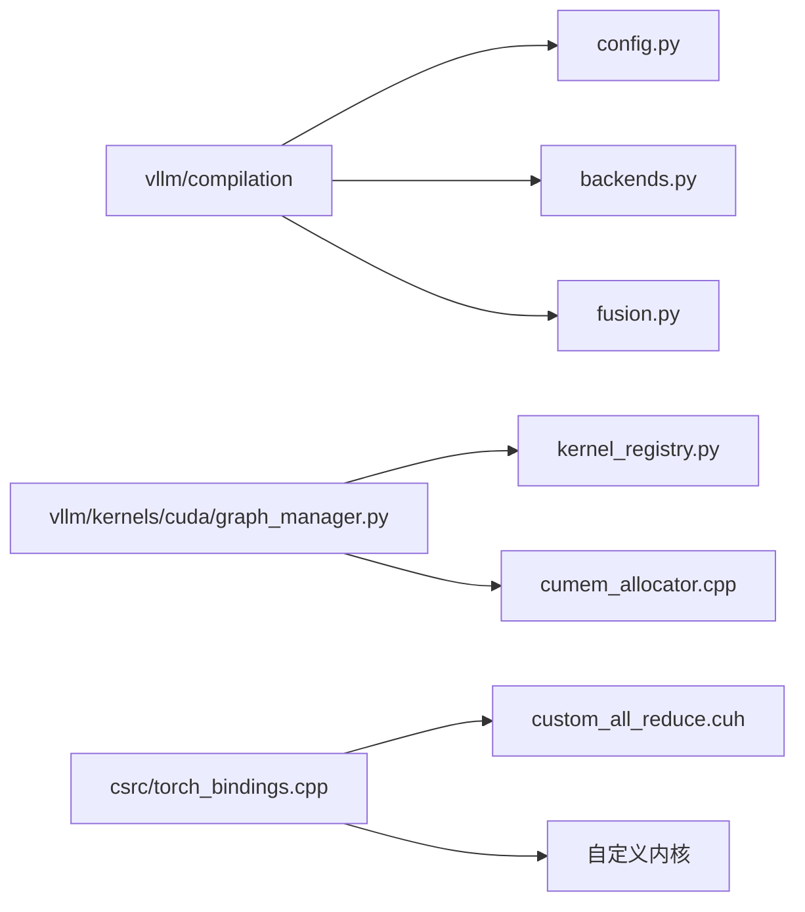

# CUDA和编译优化

<cite>
**本文引用的文件**   
- [docs/design/cuda_graphs.md](file://docs/design/cuda_graphs.md)
- [docs/design/torch_compile.md](file://docs/design/torch_compile.md)
- [docs/design/debug_vllm_compile.md](file://docs/design/debug_vllm_compile.md)
- [vllm/compilation/__init__.py](file://vllm/compilation/__init__.py)
- [vllm/compilation/fusion.py](file://vllm/compilation/fusion.py)
- [vllm/compilation/config.py](file://vllm/compilation/config.py)
- [vllm/compilation/backends.py](file://vllm/compilation/backends.py)
- [vllm/kernels/cuda/graph_manager.py](file://vllm/kernels/cuda/graph_manager.py)
- [vllm/kernels/cuda/kernel_registry.py](file://vllm/kernels/cuda/kernel_registry.py)
- [csrc/torch_bindings.cpp](file://csrc/torch_bindings.cpp)
- [csrc/custom_all_reduce.cuh](file://csrc/custom_all_reduce.cuh)
- [csrc/cumem_allocator.cpp](file://csrc/cumem_allocator.cpp)
- [cmake/utils.cmake](file://cmake/utils.cmake)
- [docker/Dockerfile.rocm](file://docker/Dockerfile.rocm)
- [requirements/rocm.txt](file://requirements/rocm.txt)
- [benchmarks/benchmark_throughput.py](file://benchmarks/benchmark_throughput.py)
</cite>

## 目录
1. [简介](#简介)
2. [项目结构](#项目结构)
3. [核心组件](#核心组件)
4. [架构总览](#架构总览)
5. [详细组件分析](#详细组件分析)
6. [依赖关系分析](#依赖关系分析)
7. [性能考量](#性能考量)
8. [故障排查指南](#故障排查指南)
9. [结论](#结论)
10. [附录](#附录)

## 简介
本文件聚焦 vLLM 中的 CUDA 内核优化与编译技术，系统性阐述：
- CUDA Graph 的构建、执行与内存管理策略及性能收益
- Torch Compile 的集成方式、静态图编译、算子融合与内存优化
- 自定义 CUDA 内核的开发流程与调优技巧
- 不同硬件平台（NVIDIA GPU、AMD ROCm）的编译配置与优化建议
- 编译性能分析与调试工具使用方法

## 项目结构
围绕 CUDA 与编译优化的关键代码与文档分布如下：
- 设计文档：CUDA Graph、Torch Compile、调试指南等位于 docs/design
- Python 编译子系统：vllm/compilation 提供后端选择、融合策略与配置
- CUDA 内核与图管理：vllm/kernels/cuda 包含图管理器与内核注册表
- C++/CUDA 绑定与扩展：csrc 下包含 torch 绑定、自定义 AllReduce、内存分配器等
- 构建与跨平台：cmake 与 docker 提供构建脚本与 ROCm 镜像
- 基准测试：benchmarks 提供吞吐与延迟评测入口

图表来源
- [docs/design/cuda_graphs.md](file://docs/design/cuda_graphs.md)
- [docs/design/torch_compile.md](file://docs/design/torch_compile.md)
- [docs/design/debug_vllm_compile.md](file://docs/design/debug_vllm_compile.md)
- [vllm/compilation/__init__.py](file://vllm/compilation/__init__.py)
- [vllm/compilation/fusion.py](file://vllm/compilation/fusion.py)
- [vllm/compilation/config.py](file://vllm/compilation/config.py)
- [vllm/compilation/backends.py](file://vllm/compilation/backends.py)
- [vllm/kernels/cuda/graph_manager.py](file://vllm/kernels/cuda/graph_manager.py)
- [vllm/kernels/cuda/kernel_registry.py](file://vllm/kernels/cuda/kernel_registry.py)
- [csrc/torch_bindings.cpp](file://csrc/torch_bindings.cpp)
- [csrc/custom_all_reduce.cuh](file://csrc/custom_all_reduce.cuh)
- [csrc/cumem_allocator.cpp](file://csrc/cumem_allocator.cpp)
- [cmake/utils.cmake](file://cmake/utils.cmake)
- [docker/Dockerfile.rocm](file://docker/Dockerfile.rocm)
- [requirements/rocm.txt](file://requirements/rocm.txt)
- [benchmarks/benchmark_throughput.py](file://benchmarks/benchmark_throughput.py)

章节来源
- [docs/design/cuda_graphs.md](file://docs/design/cuda_graphs.md)
- [docs/design/torch_compile.md](file://docs/design/torch_compile.md)
- [docs/design/debug_vllm_compile.md](file://docs/design/debug_vllm_compile.md)
- [vllm/compilation/__init__.py](file://vllm/compilation/__init__.py)
- [vllm/compilation/fusion.py](file://vllm/compilation/fusion.py)
- [vllm/compilation/config.py](file://vllm/compilation/config.py)
- [vllm/compilation/backends.py](file://vllm/compilation/backends.py)
- [vllm/kernels/cuda/graph_manager.py](file://vllm/kernels/cuda/graph_manager.py)
- [vllm/kernels/cuda/kernel_registry.py](file://vllm/kernels/cuda/kernel_registry.py)
- [csrc/torch_bindings.cpp](file://csrc/torch_bindings.cpp)
- [csrc/custom_all_reduce.cuh](file://csrc/custom_all_reduce.cuh)
- [csrc/cumem_allocator.cpp](file://csrc/cumem_allocator.cpp)
- [cmake/utils.cmake](file://cmake/utils.cmake)
- [docker/Dockerfile.rocm](file://docker/Dockerfile.rocm)
- [requirements/rocm.txt](file://requirements/rocm.txt)
- [benchmarks/benchmark_throughput.py](file://benchmarks/benchmark_throughput.py)

## 核心组件
- CUDA Graph 管理器：负责图的构建、缓存、重放与内存复用，降低主机端调用开销并提升吞吐。
- Torch Compile 集成：通过后端选择与融合策略，将动态图转换为静态图，进行算子融合与内存优化。
- 内核注册表：统一注册与分发自定义 CUDA 内核，便于在不同硬件后端间切换。
- 自定义 AllReduce 与内存分配器：减少通信与内存分配开销，提升分布式训练/推理效率。
- 构建系统与跨平台支持：CMake 与 Docker 脚本支持多后端编译，包括 ROCm。

章节来源
- [vllm/kernels/cuda/graph_manager.py](file://vllm/kernels/cuda/graph_manager.py)
- [vllm/compilation/__init__.py](file://vllm/compilation/__init__.py)
- [vllm/compilation/fusion.py](file://vllm/compilation/fusion.py)
- [vllm/compilation/config.py](file://vllm/compilation/config.py)
- [vllm/compilation/backends.py](file://vllm/compilation/backends.py)
- [vllm/kernels/cuda/kernel_registry.py](file://vllm/kernels/cuda/kernel_registry.py)
- [csrc/custom_all_reduce.cuh](file://csrc/custom_all_reduce.cuh)
- [csrc/cumem_allocator.cpp](file://csrc/cumem_allocator.cpp)
- [cmake/utils.cmake](file://cmake/utils.cmake)
- [docker/Dockerfile.rocm](file://docker/Dockerfile.rocm)
- [requirements/rocm.txt](file://requirements/rocm.txt)

## 架构总览
下图展示了从 Python 层到 CUDA 内核的执行路径，以及编译与图管理的交互关系。

图表来源
- [vllm/compilation/__init__.py](file://vllm/compilation/__init__.py)
- [vllm/kernels/cuda/graph_manager.py](file://vllm/kernels/cuda/graph_manager.py)
- [csrc/torch_bindings.cpp](file://csrc/torch_bindings.cpp)
- [csrc/custom_all_reduce.cuh](file://csrc/custom_all_reduce.cuh)
- [csrc/cumem_allocator.cpp](file://csrc/cumem_allocator.cpp)

## 详细组件分析

### CUDA Graph：构建、执行与内存管理
- 图构建：在首次前向或特定阶段捕获计算序列，生成可重放的图对象；对可变维度进行参数化以支持批大小变化。
- 图执行：通过重放机制减少主机端调度开销，提高 GPU 利用率与吞吐。
- 内存管理：结合预分配与池化策略，避免频繁分配释放带来的碎片与同步开销。

图表来源
- [vllm/kernels/cuda/graph_manager.py](file://vllm/kernels/cuda/graph_manager.py)
- [csrc/cumem_allocator.cpp](file://csrc/cumem_allocator.cpp)

章节来源
- [docs/design/cuda_graphs.md](file://docs/design/cuda_graphs.md)
- [vllm/kernels/cuda/graph_manager.py](file://vllm/kernels/cuda/graph_manager.py)
- [csrc/cumem_allocator.cpp](file://csrc/cumem_allocator.cpp)

### Torch Compile：静态图编译、算子融合与内存优化
- 后端选择：根据硬件与驱动选择合适的编译后端（如 Inductor/Triton），启用静态图模式。
- 算子融合：识别相邻算子并进行融合，减少中间张量与同步点，提升带宽利用率。
- 内存优化：通过常量折叠、死代码消除、内存重排等手段降低峰值内存占用。

图表来源
- [vllm/compilation/config.py](file://vllm/compilation/config.py)
- [vllm/compilation/fusion.py](file://vllm/compilation/fusion.py)
- [vllm/compilation/backends.py](file://vllm/compilation/backends.py)

章节来源
- [docs/design/torch_compile.md](file://docs/design/torch_compile.md)
- [vllm/compilation/__init__.py](file://vllm/compilation/__init__.py)
- [vllm/compilation/config.py](file://vllm/compilation/config.py)
- [vllm/compilation/fusion.py](file://vllm/compilation/fusion.py)
- [vllm/compilation/backends.py](file://vllm/compilation/backends.py)

### 自定义 CUDA 内核开发流程与调优
- 开发流程：定义内核原型 -> 编写 CUDA/C++ 实现 -> 通过绑定暴露给 Python -> 注册到内核注册表 -> 单元测试验证。
- 调优技巧：使用合适的线程块/网格尺寸、共享内存分块、寄存器压力控制、访存对齐与合并访问。
- 性能评估：结合基准测试与性能剖析工具定位瓶颈，迭代优化内核实现。

图表来源
- [vllm/kernels/cuda/kernel_registry.py](file://vllm/kernels/cuda/kernel_registry.py)
- [csrc/torch_bindings.cpp](file://csrc/torch_bindings.cpp)

章节来源
- [vllm/kernels/cuda/kernel_registry.py](file://vllm/kernels/cuda/kernel_registry.py)
- [csrc/torch_bindings.cpp](file://csrc/torch_bindings.cpp)

### 自定义 AllReduce 与内存分配器
- AllReduce：通过自定义实现减少通信开销，适配不同拓扑与带宽特性。
- 内存分配器：基于 CUDA Memory 的分配策略，支持预分配、池化与复用，降低碎片与同步成本。

图表来源
- [csrc/custom_all_reduce.cuh](file://csrc/custom_all_reduce.cuh)
- [csrc/cumem_allocator.cpp](file://csrc/cumem_allocator.cpp)
- [csrc/torch_bindings.cpp](file://csrc/torch_bindings.cpp)

章节来源
- [csrc/custom_all_reduce.cuh](file://csrc/custom_all_reduce.cuh)
- [csrc/cumem_allocator.cpp](file://csrc/cumem_allocator.cpp)
- [csrc/torch_bindings.cpp](file://csrc/torch_bindings.cpp)

### 跨平台编译配置与优化建议（NVIDIA GPU、AMD ROCm）
- NVIDIA GPU：优先使用 CUDA 与 cuBLAS/cuDNN，启用 Tensor Core 加速，合理设置 SM 占用与并行度。
- AMD ROCm：使用 HIP 兼容层与 ROCm 库，调整编译器标志与内核参数，关注内存带宽与矩阵单元特性。
- 构建系统：通过 CMake 与 Docker 脚本快速切换后端，确保依赖版本一致性与环境隔离。

图表来源
- [cmake/utils.cmake](file://cmake/utils.cmake)
- [docker/Dockerfile.rocm](file://docker/Dockerfile.rocm)
- [requirements/rocm.txt](file://requirements/rocm.txt)

章节来源
- [cmake/utils.cmake](file://cmake/utils.cmake)
- [docker/Dockerfile.rocm](file://docker/Dockerfile.rocm)
- [requirements/rocm.txt](file://requirements/rocm.txt)

## 依赖关系分析
- 编译子系统依赖配置与后端选择模块，影响最终生成的静态图与融合策略。
- CUDA Graph 管理器依赖内核注册表与内存分配器，确保图执行时的资源可用性与高效性。
- C++/CUDA 绑定作为桥梁，连接 Python 层与底层内核实现，需保证 ABI 稳定与错误处理完善。

图表来源
- [vllm/compilation/config.py](file://vllm/compilation/config.py)
- [vllm/compilation/backends.py](file://vllm/compilation/backends.py)
- [vllm/compilation/fusion.py](file://vllm/compilation/fusion.py)
- [vllm/kernels/cuda/graph_manager.py](file://vllm/kernels/cuda/graph_manager.py)
- [vllm/kernels/cuda/kernel_registry.py](file://vllm/kernels/cuda/kernel_registry.py)
- [csrc/cumem_allocator.cpp](file://csrc/cumem_allocator.cpp)
- [csrc/torch_bindings.cpp](file://csrc/torch_bindings.cpp)
- [csrc/custom_all_reduce.cuh](file://csrc/custom_all_reduce.cuh)

章节来源
- [vllm/compilation/config.py](file://vllm/compilation/config.py)
- [vllm/compilation/backends.py](file://vllm/compilation/backends.py)
- [vllm/compilation/fusion.py](file://vllm/compilation/fusion.py)
- [vllm/kernels/cuda/graph_manager.py](file://vllm/kernels/cuda/graph_manager.py)
- [vllm/kernels/cuda/kernel_registry.py](file://vllm/kernels/cuda/kernel_registry.py)
- [csrc/cumem_allocator.cpp](file://csrc/cumem_allocator.cpp)
- [csrc/torch_bindings.cpp](file://csrc/torch_bindings.cpp)
- [csrc/custom_all_reduce.cuh](file://csrc/custom_all_reduce.cuh)

## 性能考量
- 图重放与内存复用：通过 CUDA Graph 减少主机端开销，结合预分配降低内存碎片。
- 算子融合与静态图：利用 Torch Compile 将多个小算子融合为单一内核，减少同步与数据传输。
- 通信与内存优化：自定义 AllReduce 与分配器针对特定硬件特性进行优化，提升整体吞吐。
- 基准测试与剖析：使用内置基准与外部工具（如 nsys、rocprof）定位热点，指导内核与编译参数调优。

章节来源
- [benchmarks/benchmark_throughput.py](file://benchmarks/benchmark_throughput.py)
- [docs/design/debug_vllm_compile.md](file://docs/design/debug_vllm_compile.md)

## 故障排查指南
- 编译失败：检查环境变量与依赖版本，确认后端选择与编译器标志正确。
- 图构建异常：验证输入形状与类型一致性，确保图参数化范围覆盖实际使用场景。
- 内核崩溃：检查内核边界条件与内存访问模式，使用调试工具捕获错误上下文。
- 性能退化：对比未优化与优化后的执行路径，识别融合失败或内存瓶颈。

章节来源
- [docs/design/debug_vllm_compile.md](file://docs/design/debug_vllm_compile.md)
- [csrc/torch_bindings.cpp](file://csrc/torch_bindings.cpp)

## 结论
vLLM 通过 CUDA Graph 与 Torch Compile 的深度集成，实现了高效的静态图执行与算子融合，显著提升了推理吞吐与延迟表现。配合自定义内核、AllReduce 与内存分配器优化，以及对多硬件平台的构建支持，形成了完整的 CUDA 内核优化与编译技术体系。持续的性能剖析与基准测试是保持高性能的关键。

## 附录
- 常用命令与环境变量：参考各模块 README 与配置文件说明
- 调试工具：nsys、rocprof、torch.compile 日志选项
- 最佳实践：固定输入形状、预热图构建、合理设置批大小与并行度