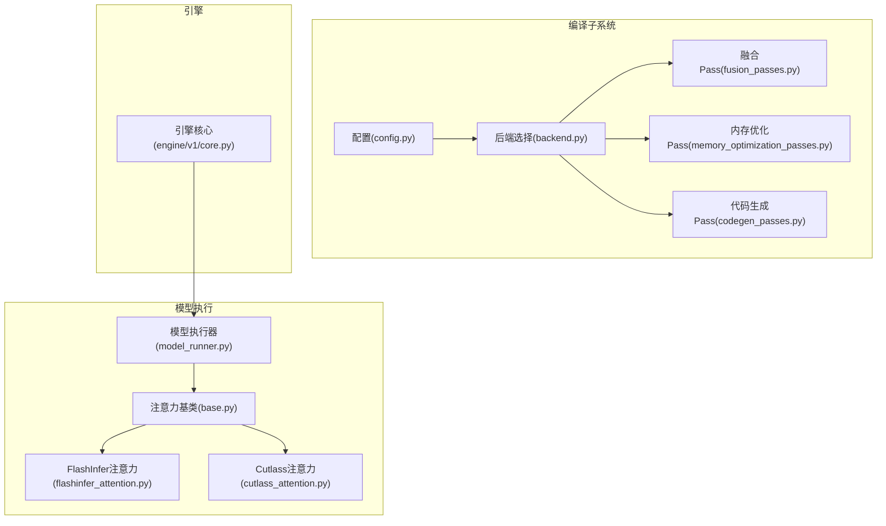
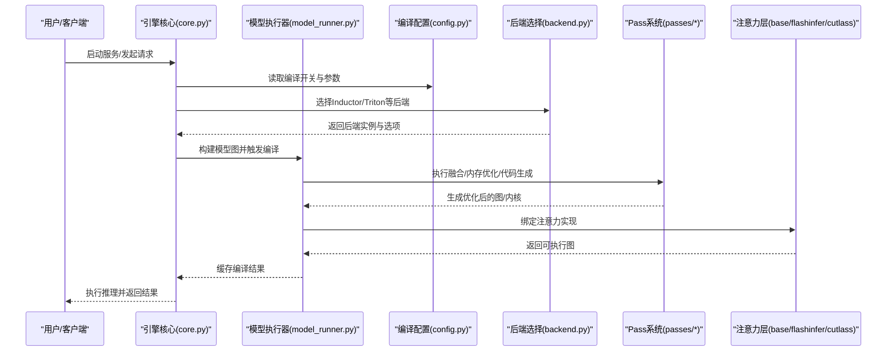
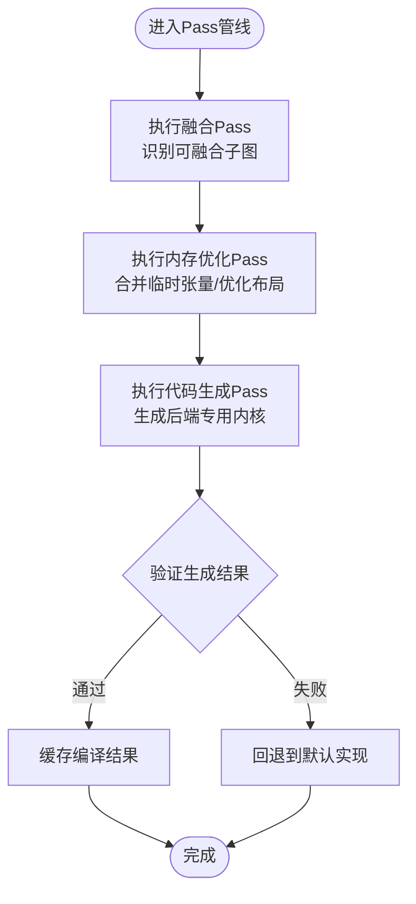
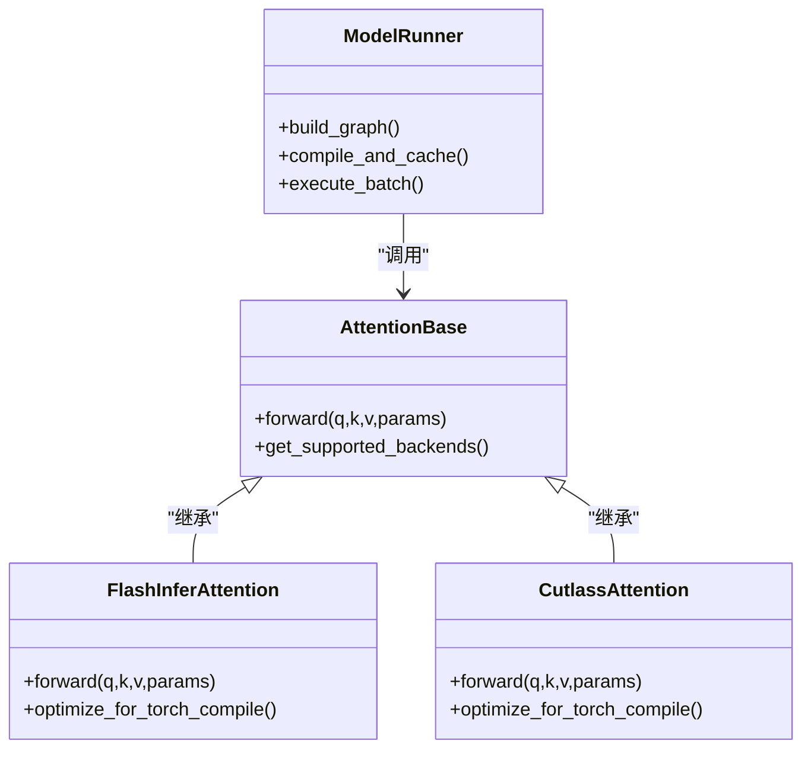
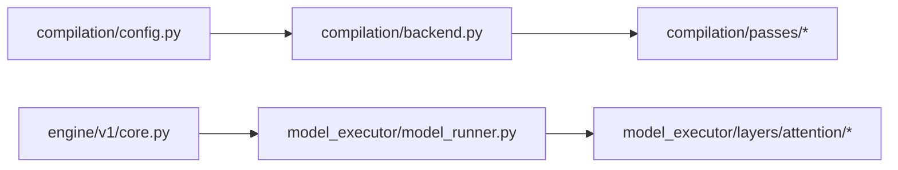

# Torch Compile集成

<cite>
**本文引用的文件**   
- [vllm/compilation/__init__.py](file://vllm/compilation/__init__.py)
- [vllm/compilation/config.py](file://vllm/compilation/config.py)
- [vllm/compilation/backend.py](file://vllm/compilation/backend.py)
- [vllm/compilation/passes/fusion_passes.py](file://vllm/compilation/passes/fusion_passes.py)
- [vllm/compilation/passes/memory_optimization_passes.py](file://vllm/compilation/passes/memory_optimization_passes.py)
- [vllm/compilation/passes/codegen_passes.py](file://vllm/compilation/passes/codegen_passes.py)
- [vllm/model_executor/layers/attention/base.py](file://vllm/model_executor/layers/attention/base.py)
- [vllm/model_executor/layers/attention/flashinfer_attention.py](file://vllm/model_executor/layers/attention/flashinfer_attention.py)
- [vllm/model_executor/layers/attention/cutlass_attention.py](file://vllm/model_executor/layers/attention/cutlass_attention.py)
- [vllm/model_executor/model_runner.py](file://vllm/model_executor/model_runner.py)
- [vllm/engine/v1/core.py](file://vllm/engine/v1/core.py)
- [docs/design/torch_compile.md](file://docs/design/torch_compile.md)
- [tests/compile/test_config.py](file://tests/compile/test_config.py)
- [tests/compile/test_wrapper.py](file://tests/compile/test_wrapper.py)
- [tests/compile/test_aot_compile.py](file://tests/compile/test_aot_compile.py)
</cite>

## 目录
1. [简介](#简介)
2. [项目结构](#项目结构)
3. [核心组件](#核心组件)
4. [架构总览](#架构总览)
5. [详细组件分析](#详细组件分析)
6. [依赖关系分析](#依赖关系分析)
7. [性能考量](#性能考量)
8. [故障排查指南](#故障排查指南)
9. [结论](#结论)
10. [附录](#附录)

## 简介
本文件系统性解析 vLLM 中 Torch Compile 的集成与优化策略，涵盖编译原理、流程与后端选择机制；详解 Inductor、Triton 等后端的配置与使用；阐述编译 pass 系统（算子融合、内存优化、代码生成）的设计与实践；并提供编译性能分析方法与常见问题解决方案。目标是帮助读者在理解 vLLM 编译体系的同时，能够高效定位问题并调优推理性能。

## 项目结构
vLLM 将 Torch Compile 相关能力集中在 compilation 模块，并通过 model_executor 和 engine 层进行集成。关键目录与职责如下：
- vllm/compilation：编译配置、后端注册、pass 系统与工具函数
- vllm/model_executor：模型执行器与注意力层，提供可被编译的图片段
- vllm/engine/v1：引擎入口，负责调度编译与执行
- docs/design：设计文档，包含 torch_compile 专题说明
- tests/compile：覆盖编译配置、wrapper、AOT 编译等用例

图表来源 
- [vllm/compilation/config.py](file://vllm/compilation/config.py)
- [vllm/compilation/backend.py](file://vllm/compilation/backend.py)
- [vllm/compilation/passes/fusion_passes.py](file://vllm/compilation/passes/fusion_passes.py)
- [vllm/compilation/passes/memory_optimization_passes.py](file://vllm/compilation/passes/memory_optimization_passes.py)
- [vllm/compilation/passes/codegen_passes.py](file://vllm/compilation/passes/codegen_passes.py)
- [vllm/model_executor/model_runner.py](file://vllm/model_executor/model_runner.py)
- [vllm/model_executor/layers/attention/base.py](file://vllm/model_executor/layers/attention/base.py)
- [vllm/model_executor/layers/attention/flashinfer_attention.py](file://vllm/model_executor/layers/attention/flashinfer_attention.py)
- [vllm/model_executor/layers/attention/cutlass_attention.py](file://vllm/model_executor/layers/attention/cutlass_attention.py)
- [vllm/engine/v1/core.py](file://vllm/engine/v1/core.py)

章节来源
- [docs/design/torch_compile.md](file://docs/design/torch_compile.md)
- [vllm/compilation/__init__.py](file://vllm/compilation/__init__.py)

## 核心组件
- 编译配置（config.py）：集中管理 Torch Compile 开关、模式（如 eager/graph mode）、缓存策略、阈值与特性标志位。
- 后端选择（backend.py）：根据硬件、可用库与配置动态选择 Inductor/Triton 等后端，并注入相应编译选项。
- Pass 系统（passes/*）：
  - 融合 Pass（fusion_passes.py）：识别可融合的子图（如激活+归一化、GEMM+偏置），减少内核调用开销。
  - 内存优化 Pass（memory_optimization_passes.py）：合并临时张量、避免重复分配、优化布局与视图操作。
  - 代码生成 Pass（codegen_passes.py）：针对目标后端生成最优代码（如 Triton kernel 或 Inductor 定制代码）。
- 模型执行器（model_runner.py）：组织前向图、触发编译、缓存编译结果并在推理阶段复用。
- 注意力层（base.py, flashinfer_attention.py, cutlass_attention.py）：提供多种注意力实现，作为编译图的重要节点。
- 引擎核心（engine/v1/core.py）：协调模型加载、编译与执行，处理批调度与状态管理。

章节来源
- [vllm/compilation/config.py](file://vllm/compilation/config.py)
- [vllm/compilation/backend.py](file://vllm/compilation/backend.py)
- [vllm/compilation/passes/fusion_passes.py](file://vllm/compilation/passes/fusion_passes.py)
- [vllm/compilation/passes/memory_optimization_passes.py](file://vllm/compilation/passes/memory_optimization_passes.py)
- [vllm/compilation/passes/codegen_passes.py](file://vllm/compilation/passes/codegen_passes.py)
- [vllm/model_executor/model_runner.py](file://vllm/model_executor/model_runner.py)
- [vllm/model_executor/layers/attention/base.py](file://vllm/model_executor/layers/attention/base.py)
- [vllm/model_executor/layers/attention/flashinfer_attention.py](file://vllm/model_executor/layers/attention/flashinfer_attention.py)
- [vllm/model_executor/layers/attention/cutlass_attention.py](file://vllm/model_executor/layers/attention/cutlass_attention.py)
- [vllm/engine/v1/core.py](file://vllm/engine/v1/core.py)

## 架构总览
Torch Compile 在 vLLM 中的整体工作流如下：
- 启动时读取编译配置，初始化后端选择器与 pass 管线。
- 模型加载阶段构建计算图，按注意力层类型选择具体实现。
- 编译阶段对图进行融合、内存优化与代码生成，产出后端专用内核。
- 运行阶段复用已编译图，结合引擎批调度执行推理。

图表来源 
- [vllm/engine/v1/core.py](file://vllm/engine/v1/core.py)
- [vllm/model_executor/model_runner.py](file://vllm/model_executor/model_runner.py)
- [vllm/compilation/config.py](file://vllm/compilation/config.py)
- [vllm/compilation/backend.py](file://vllm/compilation/backend.py)
- [vllm/compilation/passes/fusion_passes.py](file://vllm/compilation/passes/fusion_passes.py)
- [vllm/compilation/passes/memory_optimization_passes.py](file://vllm/compilation/passes/memory_optimization_passes.py)
- [vllm/compilation/passes/codegen_passes.py](file://vllm/compilation/passes/codegen_passes.py)
- [vllm/model_executor/layers/attention/base.py](file://vllm/model_executor/layers/attention/base.py)
- [vllm/model_executor/layers/attention/flashinfer_attention.py](file://vllm/model_executor/layers/attention/flashinfer_attention.py)
- [vllm/model_executor/layers/attention/cutlass_attention.py](file://vllm/model_executor/layers/attention/cutlass_attention.py)

## 详细组件分析

### 编译配置与开关（config.py）
- 功能要点：
  - 控制是否启用 Torch Compile、选择编译模式（如 AOT/动态图）、设置缓存路径与版本哈希。
  - 暴露阈值与特性开关（例如是否允许某些融合、是否开启内存优化 pass）。
- 使用建议：
  - 开发调试阶段关闭严格检查，便于快速迭代。
  - 生产环境开启全量优化，配合缓存策略提升冷启动速度。

章节来源
- [vllm/compilation/config.py](file://vllm/compilation/config.py)
- [tests/compile/test_config.py](file://tests/compile/test_config.py)

### 后端选择机制（backend.py）
- 功能要点：
  - 基于硬件检测（CUDA/ROCm/CPU/XPU）与可用库（Triton、Inductor）选择合适后端。
  - 注入后端特定编译选项（如内核搜索范围、内存池大小、精度设置）。
- 典型后端：
  - Inductor：通用 GPU/CPU 后端，适合通用算子与大规模矩阵运算。
  - Triton：面向自定义内核与高性能注意力场景，支持细粒度优化。
- 扩展方式：
  - 注册新的后端实现，并在选择逻辑中添加条件分支。

章节来源
- [vllm/compilation/backend.py](file://vllm/compilation/backend.py)

### Pass 系统设计与实现（passes/*）
- 融合 Pass（fusion_passes.py）：
  - 识别常见模式（如 GELU + LayerNorm、Bias Add + ReLU），将其合并为单一内核以减少同步与访存。
  - 通过图匹配与规则引擎驱动融合决策。
- 内存优化 Pass（memory_optimization_passes.py）：
  - 合并连续分配、消除冗余拷贝、优化张量布局（如行优先/列优先切换）。
  - 降低峰值显存占用，提高带宽利用率。
- 代码生成 Pass（codegen_passes.py）：
  - 针对目标后端生成高效代码（Triton kernel 或 Inductor 定制代码）。
  - 支持参数化模板与自动调参（autotune）以适配不同形状与硬件。

图表来源 
- [vllm/compilation/passes/fusion_passes.py](file://vllm/compilation/passes/fusion_passes.py)
- [vllm/compilation/passes/memory_optimization_passes.py](file://vllm/compilation/passes/memory_optimization_passes.py)
- [vllm/compilation/passes/codegen_passes.py](file://vllm/compilation/passes/codegen_passes.py)

章节来源
- [vllm/compilation/passes/fusion_passes.py](file://vllm/compilation/passes/fusion_passes.py)
- [vllm/compilation/passes/memory_optimization_passes.py](file://vllm/compilation/passes/memory_optimization_passes.py)
- [vllm/compilation/passes/codegen_passes.py](file://vllm/compilation/passes/codegen_passes.py)

### 模型执行器与注意力层集成（model_runner.py, base.py, flashinfer_attention.py, cutlass_attention.py）
- 模型执行器：
  - 负责构建前向图、调用编译子系统、缓存编译产物并在推理阶段复用。
  - 与引擎核心协作，处理批调度与状态同步。
- 注意力层：
  - 基类定义统一接口，具体实现包括 FlashInfer 与 Cutlass 两种高性能方案。
  - 编译时将注意力子图作为关键节点进行融合与优化。

图表来源 
- [vllm/model_executor/model_runner.py](file://vllm/model_executor/model_runner.py)
- [vllm/model_executor/layers/attention/base.py](file://vllm/model_executor/layers/attention/base.py)
- [vllm/model_executor/layers/attention/flashinfer_attention.py](file://vllm/model_executor/layers/attention/flashinfer_attention.py)
- [vllm/model_executor/layers/attention/cutlass_attention.py](file://vllm/model_executor/layers/attention/cutlass_attention.py)

章节来源
- [vllm/model_executor/model_runner.py](file://vllm/model_executor/model_runner.py)
- [vllm/model_executor/layers/attention/base.py](file://vllm/model_executor/layers/attention/base.py)
- [vllm/model_executor/layers/attention/flashinfer_attention.py](file://vllm/model_executor/layers/attention/flashinfer_attention.py)
- [vllm/model_executor/layers/attention/cutlass_attention.py](file://vllm/model_executor/layers/attention/cutlass_attention.py)

### 引擎核心与编译调度（engine/v1/core.py）
- 职责：
  - 初始化编译配置与后端选择。
  - 协调模型加载、编译与执行生命周期。
  - 管理编译缓存与失效策略。
- 关键点：
  - 在首次请求时触发 AOT 编译，后续请求直接复用。
  - 支持动态形状与批大小变化时的增量编译。

章节来源
- [vllm/engine/v1/core.py](file://vllm/engine/v1/core.py)

## 依赖关系分析
- 模块耦合：
  - compilation 模块独立于 model_executor，通过接口抽象解耦。
  - model_executor 依赖 attention 层的具体实现，但不关心底层编译细节。
- 外部依赖：
  - Torch Compile、Triton、Inductor、CUDA/ROCm 驱动。
- 潜在循环依赖：
  - 通过分层设计与接口隔离避免循环引用。

图表来源 
- [vllm/compilation/config.py](file://vllm/compilation/config.py)
- [vllm/compilation/backend.py](file://vllm/compilation/backend.py)
- [vllm/compilation/passes/fusion_passes.py](file://vllm/compilation/passes/fusion_passes.py)
- [vllm/compilation/passes/memory_optimization_passes.py](file://vllm/compilation/passes/memory_optimization_passes.py)
- [vllm/compilation/passes/codegen_passes.py](file://vllm/compilation/passes/codegen_passes.py)
- [vllm/engine/v1/core.py](file://vllm/engine/v1/core.py)
- [vllm/model_executor/model_runner.py](file://vllm/model_executor/model_runner.py)
- [vllm/model_executor/layers/attention/base.py](file://vllm/model_executor/layers/attention/base.py)
- [vllm/model_executor/layers/attention/flashinfer_attention.py](file://vllm/model_executor/layers/attention/flashinfer_attention.py)
- [vllm/model_executor/layers/attention/cutlass_attention.py](file://vllm/model_executor/layers/attention/cutlass_attention.py)

章节来源
- [vllm/compilation/__init__.py](file://vllm/compilation/__init__.py)

## 性能考量
- 编译模式选择：
  - AOT 编译适合稳定形状与高吞吐场景，减少运行时开销。
  - 动态图编译适合形状多变场景，但可能引入额外开销。
- 后端选择：
  - Inductor 通用性强，适合大多数算子。
  - Triton 在注意力与自定义内核上表现优异，需关注内核搜索时间。
- 融合与内存优化：
  - 合理配置融合规则，避免过度融合导致代码膨胀。
  - 监控显存峰值，必要时调整内存优化 pass 的激进程度。
- 缓存策略：
  - 利用编译缓存加速冷启动，定期清理过期产物。

[本节为通用指导，不直接分析具体文件]

## 故障排查指南
- 常见问题：
  - 编译失败：检查后端可用性、硬件驱动版本与依赖库。
  - 性能未达预期：确认融合规则是否生效，查看生成的内核是否最优。
  - 显存溢出：调整内存优化 pass，减少临时张量分配。
- 诊断工具：
  - 启用 Torch Compile 日志，观察编译过程与错误堆栈。
  - 使用性能剖析工具（如 nvprof/nsys）分析内核执行热点。
- 测试用例参考：
  - 编译配置测试（test_config.py）
  - Wrapper 行为测试（test_wrapper.py）
  - AOT 编译端到端测试（test_aot_compile.py）

章节来源
- [tests/compile/test_config.py](file://tests/compile/test_config.py)
- [tests/compile/test_wrapper.py](file://tests/compile/test_wrapper.py)
- [tests/compile/test_aot_compile.py](file://tests/compile/test_aot_compile.py)

## 结论
vLLM 通过模块化设计将 Torch Compile 深度集成到推理流水线中，借助灵活的 pass 系统与多后端选择机制，实现了高性能、可扩展的编译优化。开发者可通过配置开关与自定义 pass 精细调优，满足不同场景下的性能与资源需求。

[本节为总结性内容，不直接分析具体文件]

## 附录
- 设计文档：torch_compile.md 提供了更详细的架构说明与最佳实践。
- 示例与测试：tests/compile 目录下包含丰富的用例，可作为学习与调试参考。

章节来源
- [docs/design/torch_compile.md](file://docs/design/torch_compile.md)