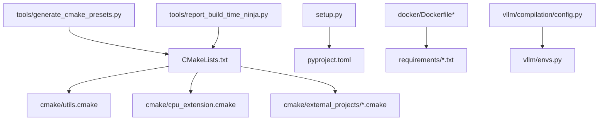
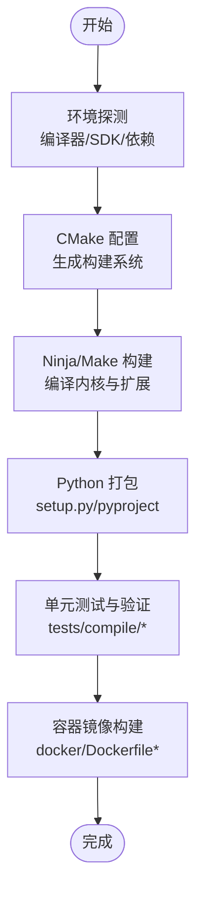
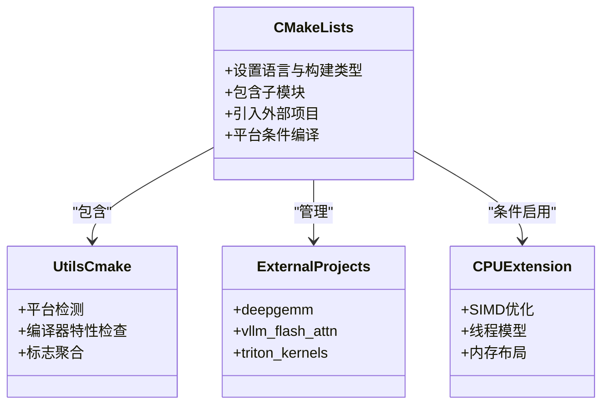
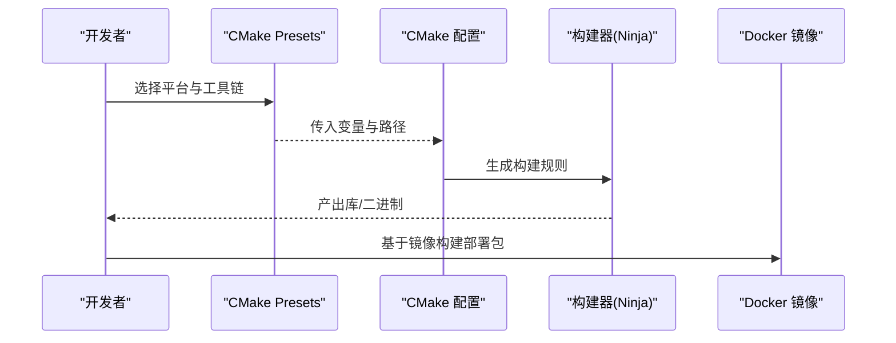
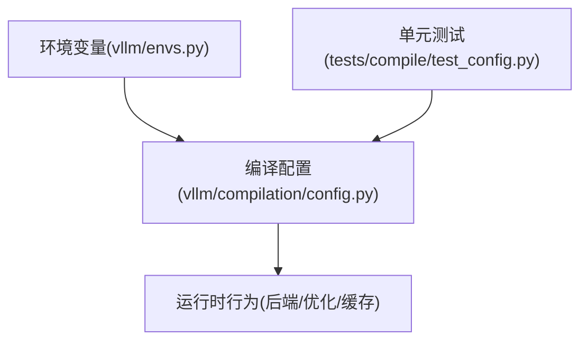
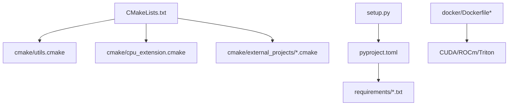

# 编译配置和优化

<cite>
**本文引用的文件**   
- [CMakeLists.txt](file://CMakeLists.txt)
- [setup.py](file://setup.py)
- [pyproject.toml](file://pyproject.toml)
- [cmake/utils.cmake](file://cmake/utils.cmake)
- [cmake/external_projects/deepgemm.cmake](file://cmake/external_projects/deepgemm.cmake)
- [cmake/external_projects/vllm_flash_attn.cmake](file://cmake/external_projects/vllm_flash_attn.cmake)
- [cmake/external_projects/triton_kernels.cmake](file://cmake/external_projects/triton_kernels.cmake)
- [cmake/cpu_extension.cmake](file://cmake/cpu_extension.cmake)
- [docker/Dockerfile](file://docker/Dockerfile)
- [docker/Dockerfile.rocm](file://docker/Dockerfile.rocm)
- [docker/Dockerfile.cpu](file://docker/Dockerfile.cpu)
- [requirements/cuda.txt](file://requirements/cuda.txt)
- [requirements/rocm.txt](file://requirements/rocm.txt)
- [requirements/common.txt](file://requirements/common.txt)
- [tools/generate_cmake_presets.py](file://tools/generate_cmake_presets.py)
- [tools/report_build_time_ninja.py](file://tools/report_build_time_ninja.py)
- [vllm/envs.py](file://vllm/envs.py)
- [vllm/compilation/config.py](file://vllm/compilation/config.py)
- [tests/compile/test_config.py](file://tests/compile/test_config.py)
</cite>

## 目录
1. [简介](#简介)
2. [项目结构](#项目结构)
3. [核心组件](#核心组件)
4. [架构总览](#架构总览)
5. [详细组件分析](#详细组件分析)
6. [依赖关系分析](#依赖关系分析)
7. [性能考量](#性能考量)
8. [故障排除指南](#故障排除指南)
9. [结论](#结论)
10. [附录](#附录)

## 简介
本文件面向希望深入理解并优化 vLLM 编译系统的工程师与运维人员，系统阐述 CMake 构建体系、交叉编译与多平台支持、目标平台选择、优化级别配置、依赖库管理以及在不同场景（开发、生产、CI/CD）下的最佳实践。同时提供编译性能分析与常见问题的排查方法，帮助读者快速定位问题并提升构建效率。

## 项目结构
vLLM 的构建系统由 Python 打包脚本、CMake 顶层工程与模块、Docker 镜像定义、依赖清单与工具脚本共同组成：
- 顶层构建入口：CMakeLists.txt、setup.py、pyproject.toml
- CMake 模块化配置：cmake/*.cmake 与 cmake/external_projects/*.cmake
- 平台与容器化：docker/* 与 requirements/*
- 构建工具与报告：tools/*（生成预设、统计构建时间等）
- 运行时编译配置与环境变量：vllm/compilation/config.py、vllm/envs.py
- 单元测试：tests/compile/test_config.py

图表来源 
- [CMakeLists.txt](file://CMakeLists.txt)
- [cmake/utils.cmake](file://cmake/utils.cmake)
- [cmake/cpu_extension.cmake](file://cmake/cpu_extension.cmake)
- [cmake/external_projects/deepgemm.cmake](file://cmake/external_projects/deepgemm.cmake)
- [cmake/external_projects/vllm_flash_attn.cmake](file://cmake/external_projects/vllm_flash_attn.cmake)
- [cmake/external_projects/triton_kernels.cmake](file://cmake/external_projects/triton_kernels.cmake)
- [setup.py](file://setup.py)
- [pyproject.toml](file://pyproject.toml)
- [docker/Dockerfile](file://docker/Dockerfile)
- [requirements/cuda.txt](file://requirements/cuda.txt)
- [requirements/rocm.txt](file://requirements/rocm.txt)
- [tools/generate_cmake_presets.py](file://tools/generate_cmake_presets.py)
- [tools/report_build_time_ninja.py](file://tools/report_build_time_ninja.py)

章节来源
- [CMakeLists.txt](file://CMakeLists.txt)
- [setup.py](file://setup.py)
- [pyproject.toml](file://pyproject.toml)

## 核心组件
- CMake 顶层工程与模块
  - 顶层 CMakeLists.txt 负责发现编译器、设置全局选项、包含子模块与外部项目。
  - cmake/utils.cmake 提供通用工具函数（如平台检测、路径处理、编译标志聚合）。
  - cmake/cpu_extension.cmake 用于 CPU 扩展的开关与参数控制。
  - cmake/external_projects/*.cmake 管理第三方内核与加速库（如 deepgemm、flash attention、triton kernels）的获取、配置与链接。
- Python 构建与打包
  - setup.py 与 pyproject.toml 协调 Python 包构建、可选特性开关与依赖安装。
- 容器化与依赖
  - docker/Dockerfile* 定义不同平台（CUDA、ROCm、CPU、XPU、TPU）的基础环境与构建步骤。
  - requirements/*.txt 声明 Python 依赖与平台特定依赖。
- 构建工具
  - tools/generate_cmake_presets.py 生成 CMake Presets，便于跨平台与 CI 使用。
  - tools/report_build_time_ninja.py 解析 Ninja 输出，统计各阶段构建耗时。
- 运行时编译配置
  - vllm/compilation/config.py 暴露编译相关配置项（如后端选择、优化级别、缓存策略）。
  - vllm/envs.py 集中环境变量定义与读取，影响运行期行为与构建时探测。

章节来源
- [cmake/utils.cmake](file://cmake/utils.cmake)
- [cmake/cpu_extension.cmake](file://cmake/cpu_extension.cmake)
- [cmake/external_projects/deepgemm.cmake](file://cmake/external_projects/deepgemm.cmake)
- [cmake/external_projects/vllm_flash_attn.cmake](file://cmake/external_projects/vllm_flash_attn.cmake)
- [cmake/external_projects/triton_kernels.cmake](file://cmake/external_projects/triton_kernels.cmake)
- [setup.py](file://setup.py)
- [pyproject.toml](file://pyproject.toml)
- [docker/Dockerfile](file://docker/Dockerfile)
- [requirements/cuda.txt](file://requirements/cuda.txt)
- [requirements/rocm.txt](file://requirements/rocm.txt)
- [tools/generate_cmake_presets.py](file://tools/generate_cmake_presets.py)
- [tools/report_build_time_ninja.py](file://tools/report_build_time_ninja.py)
- [vllm/compilation/config.py](file://vllm/compilation/config.py)
- [vllm/envs.py](file://vllm/envs.py)

## 架构总览
下图展示了从源码到可执行/库的构建流程，包括 CMake 配置、外部依赖拉取与编译、Python 包构建、容器镜像封装等环节。

图表来源 
- [CMakeLists.txt](file://CMakeLists.txt)
- [setup.py](file://setup.py)
- [pyproject.toml](file://pyproject.toml)
- [docker/Dockerfile](file://docker/Dockerfile)
- [tools/generate_cmake_presets.py](file://tools/generate_cmake_presets.py)

## 详细组件分析

### CMake 构建系统与多平台支持
- 顶层 CMakeLists.txt
  - 负责启用必要的语言（C/C++/CUDA/ROCM），设置默认构建类型（Debug/Release），包含子模块与外部项目。
  - 通过变量控制是否启用 CUDA/ROCm/XPU 等后端，以及是否构建 CPU 扩展。
- cmake/utils.cmake
  - 提供平台检测、编译器特性检查、路径与标志聚合的工具函数。
  - 建议将平台特定的编译选项集中在此，便于维护与复用。
- cmake/cpu_extension.cmake
  - 控制 CPU 侧内核的编译开关与优化标志（如 SIMD、线程池、内存对齐）。
- cmake/external_projects/*.cmake
  - 统一管理第三方加速库的下载、补丁、配置与链接（例如 deepgemm、flash attention、triton kernels）。
  - 可通过变量或预设切换版本与构建选项。

图表来源 
- [CMakeLists.txt](file://CMakeLists.txt)
- [cmake/utils.cmake](file://cmake/utils.cmake)
- [cmake/external_projects/deepgemm.cmake](file://cmake/external_projects/deepgemm.cmake)
- [cmake/external_projects/vllm_flash_attn.cmake](file://cmake/external_projects/vllm_flash_attn.cmake)
- [cmake/external_projects/triton_kernels.cmake](file://cmake/external_projects/triton_kernels.cmake)
- [cmake/cpu_extension.cmake](file://cmake/cpu_extension.cmake)

章节来源
- [CMakeLists.txt](file://CMakeLists.txt)
- [cmake/utils.cmake](file://cmake/utils.cmake)
- [cmake/cpu_extension.cmake](file://cmake/cpu_extension.cmake)
- [cmake/external_projects/deepgemm.cmake](file://cmake/external_projects/deepgemm.cmake)
- [cmake/external_projects/vllm_flash_attn.cmake](file://cmake/external_projects/vllm_flash_attn.cmake)
- [cmake/external_projects/triton_kernels.cmake](file://cmake/external_projects/triton_kernels.cmake)

### 目标平台选择与交叉编译
- 平台选择
  - 通过 CMake 变量或环境变量指定目标平台（CUDA、ROCm、XPU、CPU）。
  - Docker 镜像按平台拆分（Dockerfile、Dockerfile.rocm、Dockerfile.cpu），确保 SDK 与驱动一致。
- 交叉编译
  - 使用 CMake Presets（由 tools/generate_cmake_presets.py 生成）统一配置工具链、SDK 路径与优化标志。
  - 在 CI 中通过预设切换不同平台的构建任务，避免手工配置错误。
- 依赖管理
  - requirements/*.txt 声明 Python 依赖；platform-specific 依赖（如 cuda.txt、rocm.txt）按需安装。
  - 外部 C++/CUDA/ROCm 库通过 external_projects/*.cmake 管理，支持离线缓存与版本锁定。

图表来源 
- [tools/generate_cmake_presets.py](file://tools/generate_cmake_presets.py)
- [docker/Dockerfile](file://docker/Dockerfile)
- [docker/Dockerfile.rocm](file://docker/Dockerfile.rocm)
- [docker/Dockerfile.cpu](file://docker/Dockerfile.cpu)
- [requirements/cuda.txt](file://requirements/cuda.txt)
- [requirements/rocm.txt](file://requirements/rocm.txt)

章节来源
- [tools/generate_cmake_presets.py](file://tools/generate_cmake_presets.py)
- [docker/Dockerfile](file://docker/Dockerfile)
- [docker/Dockerfile.rocm](file://docker/Dockerfile.rocm)
- [docker/Dockerfile.cpu](file://docker/Dockerfile.cpu)
- [requirements/cuda.txt](file://requirements/cuda.txt)
- [requirements/rocm.txt](file://requirements/rocm.txt)

### 优化级别配置与依赖库管理
- 优化级别
  - 通过 CMake 的构建类型（Debug/Release/RelWithDebInfo）控制整体优化等级。
  - 针对 GPU/CPU 内核可设置额外标志（如 CUDA_ARCH、ROCM_ARCH、SIMD 指令集）。
  - 外部项目（如 triton_kernels、flash attention）可在其 cmake 文件中启用特定优化。
- 依赖库管理
  - Python 层依赖通过 requirements/*.txt 与 pyproject.toml 管理。
  - C++/GPU 依赖通过 external_projects/*.cmake 拉取与编译，支持本地缓存与版本固定。
  - 容器镜像内预装必要 SDK（CUDA/ROCm/Clang/Triton），保证一致性。

章节来源
- [cmake/external_projects/triton_kernels.cmake](file://cmake/external_projects/triton_kernels.cmake)
- [cmake/external_projects/vllm_flash_attn.cmake](file://cmake/external_projects/vllm_flash_attn.cmake)
- [cmake/external_projects/deepgemm.cmake](file://cmake/external_projects/deepgemm.cmake)
- [requirements/common.txt](file://requirements/common.txt)
- [requirements/cuda.txt](file://requirements/cuda.txt)
- [requirements/rocm.txt](file://requirements/rocm.txt)
- [pyproject.toml](file://pyproject.toml)

### 构建系统使用方法（CMake 与 Ninja）
- 基本流程
  - 生成构建系统：根据平台与选项调用 CMake 生成 Ninja 规则。
  - 并行构建：使用 Ninja 的多进程加速编译。
  - 增量构建：利用 Ninja 的依赖图进行增量更新。
- 常用命令模式
  - 配置阶段：指定工具链、SDK 路径、优化级别与后端开关。
  - 构建阶段：按目标（库、测试、示例）选择性构建。
  - 打包阶段：生成 Python 包与容器镜像。
- 构建时间统计
  - 使用 tools/report_build_time_ninja.py 解析 Ninja 输出，定位慢步骤。

章节来源
- [tools/report_build_time_ninja.py](file://tools/report_build_time_ninja.py)
- [CMakeLists.txt](file://CMakeLists.txt)

### 开发、生产与 CI/CD 最佳实践
- 开发环境
  - 使用 Debug 构建类型，开启详细日志与符号信息。
  - 启用最小必要后端（如仅 CUDA），缩短构建时间。
  - 使用本地缓存（Ninja 缓存、外部项目缓存）加速迭代。
- 生产部署
  - 使用 Release/RelWithDebInfo 构建类型，关闭调试信息以减小体积。
  - 锁定依赖版本（requirements、external_projects 版本），确保可重现性。
  - 通过容器镜像固化运行时环境（CUDA/ROCm/驱动版本）。
- CI/CD 集成
  - 使用 CMake Presets 统一配置，减少环境差异。
  - 分阶段构建（配置、构建、测试、打包），失败快速反馈。
  - 缓存关键依赖与中间产物，提升流水线速度。

章节来源
- [tools/generate_cmake_presets.py](file://tools/generate_cmake_presets.py)
- [docker/Dockerfile](file://docker/Dockerfile)
- [requirements/common.txt](file://requirements/common.txt)

### 运行时编译配置与环境变量
- vllm/compilation/config.py
  - 暴露编译相关配置项（如后端选择、优化级别、缓存策略），供运行时动态调整。
- vllm/envs.py
  - 集中环境变量定义与读取，影响运行期行为与构建时探测（如 CUDA/ROCm 路径、Triton 开关）。
- tests/compile/test_config.py
  - 对编译配置进行单元测试，验证配置生效与边界情况。

图表来源 
- [vllm/envs.py](file://vllm/envs.py)
- [vllm/compilation/config.py](file://vllm/compilation/config.py)
- [tests/compile/test_config.py](file://tests/compile/test_config.py)

章节来源
- [vllm/compilation/config.py](file://vllm/compilation/config.py)
- [vllm/envs.py](file://vllm/envs.py)
- [tests/compile/test_config.py](file://tests/compile/test_config.py)

## 依赖关系分析
- 内部依赖
  - CMakeLists.txt 依赖 cmake/utils.cmake、cmake/cpu_extension.cmake 与 external_projects/*.cmake。
  - setup.py 与 pyproject.toml 协调 Python 包构建与依赖安装。
- 外部依赖
  - CUDA/ROCm SDK、Triton、Flash Attention、DeepGEMM 等通过 external_projects 管理。
  - Python 依赖通过 requirements/*.txt 与 pyproject.toml 声明。
- 容器化依赖
  - docker/Dockerfile* 预装必要 SDK 与工具链，确保构建与运行环境一致。

图表来源 
- [CMakeLists.txt](file://CMakeLists.txt)
- [cmake/utils.cmake](file://cmake/utils.cmake)
- [cmake/cpu_extension.cmake](file://cmake/cpu_extension.cmake)
- [cmake/external_projects/deepgemm.cmake](file://cmake/external_projects/deepgemm.cmake)
- [setup.py](file://setup.py)
- [pyproject.toml](file://pyproject.toml)
- [requirements/common.txt](file://requirements/common.txt)
- [docker/Dockerfile](file://docker/Dockerfile)

章节来源
- [CMakeLists.txt](file://CMakeLists.txt)
- [setup.py](file://setup.py)
- [pyproject.toml](file://pyproject.toml)
- [requirements/common.txt](file://requirements/common.txt)
- [docker/Dockerfile](file://docker/Dockerfile)

## 性能考量
- 构建性能
  - 使用 Ninja 并行构建，合理设置并发度以避免资源争用。
  - 启用增量构建与缓存（Ninja 缓存、外部项目缓存、Python 包缓存）。
  - 通过 tools/report_build_time_ninja.py 分析慢步骤，针对性优化。
- 运行时性能
  - 选择合适的优化级别与后端（CUDA/ROCm/CPU），并根据硬件特性调整标志。
  - 锁定依赖版本，避免不兼容导致的性能回退。
  - 使用容器镜像固化环境，减少“在我机器上正常”的问题。

[本节为通用指导，无需具体文件引用]

## 故障排除指南
- 常见问题
  - 编译器/SDK 路径不正确：检查 CMake 变量与环境变量（CUDA_PATH、ROCM_PATH、Triton 路径）。
  - 依赖缺失或版本冲突：核对 requirements/*.txt 与 external_projects 版本，必要时锁定版本。
  - 构建失败：查看 Ninja 输出与日志，定位具体错误；使用 Debug 构建类型获取更多信息。
  - 运行时崩溃：检查 vllm/envs.py 与 vllm/compilation/config.py 的配置是否正确生效。
- 诊断工具
  - tools/report_build_time_ninja.py：分析构建耗时。
  - tests/compile/test_config.py：验证编译配置。
  - docker/Dockerfile*：确认基础镜像与依赖版本。

章节来源
- [tools/report_build_time_ninja.py](file://tools/report_build_time_ninja.py)
- [tests/compile/test_config.py](file://tests/compile/test_config.py)
- [vllm/envs.py](file://vllm/envs.py)
- [vllm/compilation/config.py](file://vllm/compilation/config.py)
- [docker/Dockerfile](file://docker/Dockerfile)

## 结论
vLLM 的编译系统以 CMake 为核心，结合 Python 打包、容器化与工具脚本，形成完整的构建与发布流程。通过合理的平台选择、优化级别配置与依赖管理，可以在开发、生产与 CI/CD 场景中实现高效、稳定与可重现的构建。借助诊断工具与最佳实践，能够快速定位问题并持续优化构建性能。

[本节为总结，无需具体文件引用]

## 附录
- 参考文件
  - CMake 顶层与模块：CMakeLists.txt、cmake/utils.cmake、cmake/cpu_extension.cmake、cmake/external_projects/*.cmake
  - Python 构建：setup.py、pyproject.toml、requirements/*.txt
  - 容器化：docker/Dockerfile*
  - 工具：tools/generate_cmake_presets.py、tools/report_build_time_ninja.py
  - 运行时配置：vllm/compilation/config.py、vllm/envs.py
  - 测试：tests/compile/test_config.py

[本节为附录，无需具体文件引用]