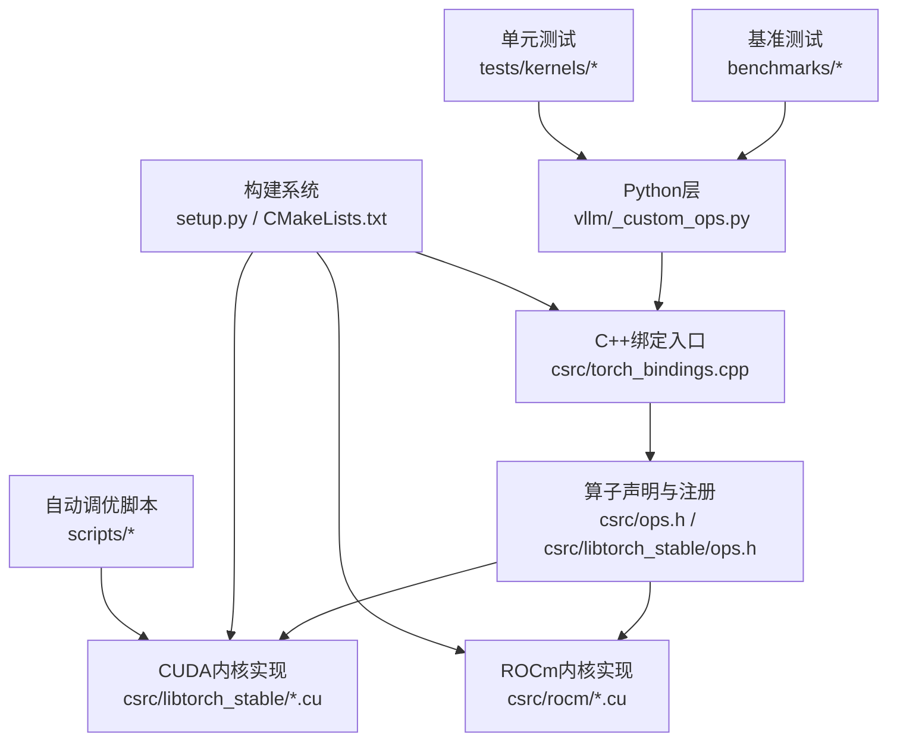
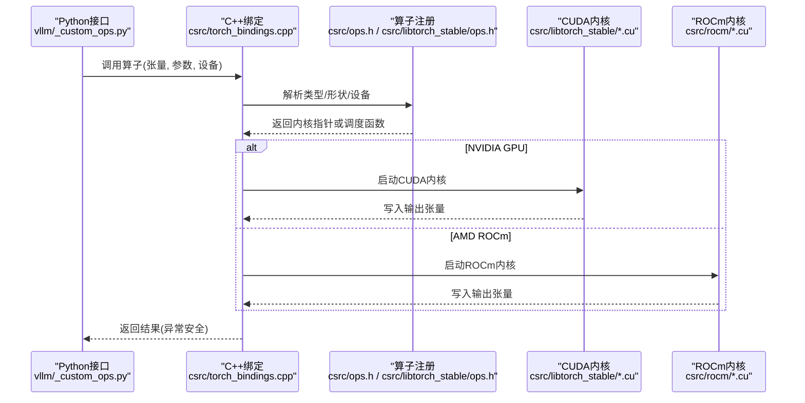
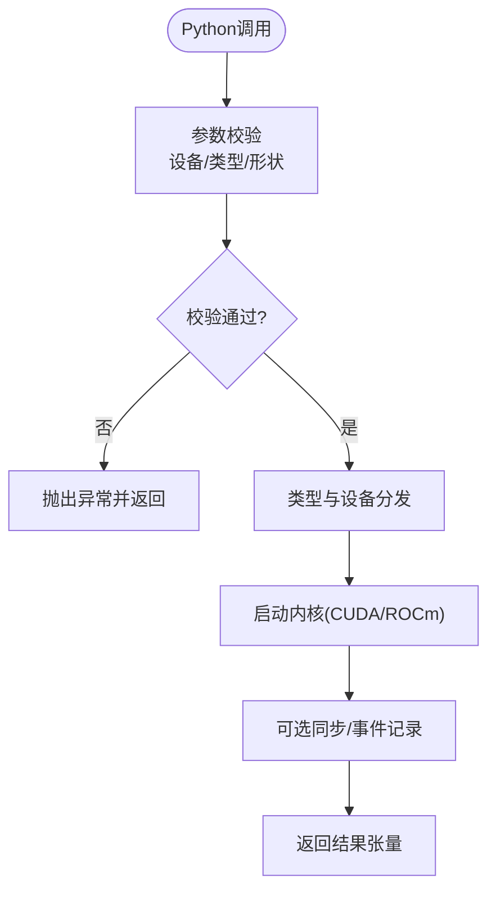
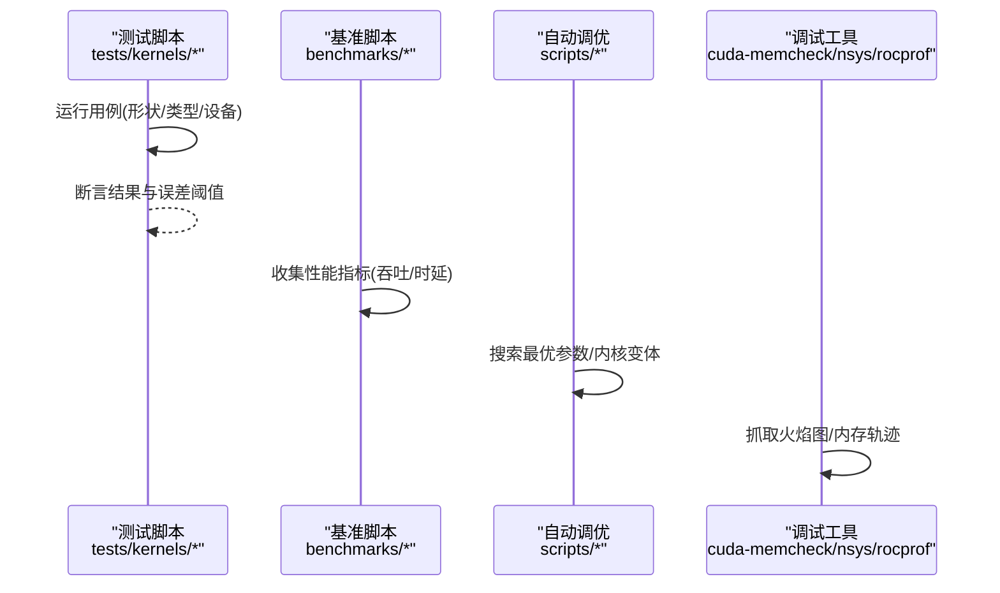
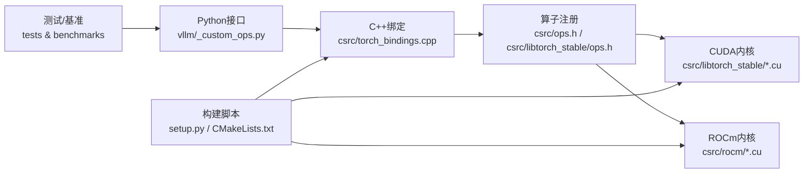

# 自定义CUDA内核开发

<cite>
**本文引用的文件**   
- [CMakeLists.txt](file://CMakeLists.txt)
- [setup.py](file://setup.py)
- [csrc/torch_bindings.cpp](file://csrc/torch_bindings.cpp)
- [csrc/ops.h](file://csrc/ops.h)
- [csrc/cuda_utils.h](file://csrc/cuda_utils.h)
- [csrc/dispatch_utils.h](file://csrc/dispatch_utils.h)
- [csrc/libtorch_stable/torch_bindings.cpp](file://csrc/libtorch_stable/torch_bindings.cpp)
- [csrc/libtorch_stable/ops.h](file://csrc/libtorch_stable/ops.h)
- [csrc/libtorch_stable/activation_kernels.cu](file://csrc/libtorch_stable/activation_kernels.cu)
- [csrc/libtorch_stable/cache_kernels.cu](file://csrc/libtorch_stable/cache_kernels.cu)
- [csrc/libtorch_stable/layernorm_kernels.cu](file://csrc/libtorch_stable/layernorm_kernels.cu)
- [csrc/libtorch_stable/sampler.cu](file://csrc/libtorch_stable/sampler.cu)
- [csrc/libtorch_stable/topk.cu](file://csrc/libtorch_stable/topk.cu)
- [csrc/rocm/torch_bindings.cpp](file://csrc/rocm/torch_bindings.cpp)
- [csrc/rocm/attention.cu](file://csrc/rocm/attention.cu)
- [csrc/rocm/q_gemm_rdna3.cu](file://csrc/rocm/q_gemm_rdna3.cu)
- [csrc/rocm/skinny_gemms.cu](file://csrc/rocm/skinny_gemms.cu)
- [vllm/_custom_ops.py](file://vllm/_custom_ops.py)
- [vllm/kernels/__init__.py](file://vllm/kernels/__init__.py)
- [benchmarks/fused_kernels/layernorm_rms_benchmarks.py](file://benchmarks/fused_kernels/layernorm_rms_benchmarks.py)
- [benchmarks/kernels/benchmark_layernorm.py](file://benchmarks/kernels/benchmark_layernorm.py)
- [tests/kernels/test_cache_kernels.py](file://tests/kernels/test_cache_kernels.py)
- [tests/kernels/test_fused_qk_norm_rope_gate.py](file://tests/kernels/test_fused_qk_norm_rope_gate.py)
- [scripts/autotune_helion_kernels.py](file://scripts/autotune_helion_kernels.py)
- [scripts/benchmark_helion_kernels.py](file://scripts/benchmark_helion_kernels.py)
</cite>

## 目录
1. [简介](#简介)
2. [项目结构](#项目结构)
3. [核心组件](#核心组件)
4. [架构总览](#架构总览)
5. [详细组件分析](#详细组件分析)
6. [依赖关系分析](#依赖关系分析)
7. [性能考量](#性能考量)
8. [故障排查指南](#故障排查指南)
9. [结论](#结论)
10. [附录](#附录)

## 简介
本文件面向希望在 vLLM 中开发自定义 CUDA 内核的工程师，系统阐述从内核编写、内存管理、性能优化到与 PyTorch 绑定的完整流程。内容覆盖 NVIDIA GPU 与 AMD ROCm 平台适配，以及测试、调试与性能分析工具链的使用建议。文档以仓库现有实现为依据，提供可追溯的文件来源与图示说明，帮助读者快速上手并高质量交付内核。

## 项目结构
vLLM 的自定义内核主要位于 csrc 与 csrc/libtorch_stable 目录，Python 绑定在 vllm/_custom_ops.py 中，构建脚本由 setup.py 与 CMakeLists.txt 驱动，ROCm 适配集中在 csrc/rocm。基准与测试分别位于 benchmarks 与 tests 目录，辅助脚本用于自动调参与基准测量。

图表来源
- [setup.py](file://setup.py)
- [CMakeLists.txt](file://CMakeLists.txt)
- [csrc/torch_bindings.cpp](file://csrc/torch_bindings.cpp)
- [csrc/ops.h](file://csrc/ops.h)
- [csrc/libtorch_stable/ops.h](file://csrc/libtorch_stable/ops.h)
- [csrc/libtorch_stable/activation_kernels.cu](file://csrc/libtorch_stable/activation_kernels.cu)
- [csrc/rocm/torch_bindings.cpp](file://csrc/rocm/torch_bindings.cpp)
- [vllm/_custom_ops.py](file://vllm/_custom_ops.py)

章节来源
- [setup.py](file://setup.py)
- [CMakeLists.txt](file://CMakeLists.txt)
- [csrc/torch_bindings.cpp](file://csrc/torch_bindings.cpp)
- [csrc/ops.h](file://csrc/ops.h)
- [csrc/libtorch_stable/ops.h](file://csrc/libtorch_stable/ops.h)
- [vllm/_custom_ops.py](file://vllm/_custom_ops.py)

## 核心组件
- Python 接口层：统一暴露算子调用、参数校验与错误处理，屏蔽底层差异。
- C++ 绑定层：将 Python 张量转换为 ATen/Tensor 描述，解析设备、数据类型与形状，调度具体内核。
- 内核实现层：按功能划分（激活、归一化、采样、TopK、缓存等），提供 CUDA 与 ROCm 双后端实现。
- 构建与分发：通过 setup.py 与 CMake 编译原生扩展，支持多平台条件编译。
- 基准与测试：针对关键路径提供性能基准与正确性测试，确保稳定性与性能回归防护。

章节来源
- [vllm/_custom_ops.py](file://vllm/_custom_ops.py)
- [csrc/torch_bindings.cpp](file://csrc/torch_bindings.cpp)
- [csrc/libtorch_stable/torch_bindings.cpp](file://csrc/libtorch_stable/torch_bindings.cpp)
- [csrc/rocm/torch_bindings.cpp](file://csrc/rocm/torch_bindings.cpp)
- [csrc/libtorch_stable/ops.h](file://csrc/libtorch_stable/ops.h)
- [csrc/ops.h](file://csrc/ops.h)

## 架构总览
下图展示从 Python 调用到内核执行的端到端流程，包括设备选择、类型分发、内核调度与结果返回。

图表来源
- [csrc/torch_bindings.cpp](file://csrc/torch_bindings.cpp)
- [csrc/ops.h](file://csrc/ops.h)
- [csrc/libtorch_stable/ops.h](file://csrc/libtorch_stable/ops.h)
- [csrc/libtorch_stable/activation_kernels.cu](file://csrc/libtorch_stable/activation_kernels.cu)
- [csrc/rocm/attention.cu](file://csrc/rocm/attention.cu)
- [vllm/_custom_ops.py](file://vllm/_custom_ops.py)

## 详细组件分析

### 内核编写规范与最佳实践
- 线程块与网格配置：根据数据规模动态计算 launch 配置，避免过小的 block 导致低占用率。
- 内存访问模式：尽量使用合并访问（coalesced memory access），减少 bank conflict，必要时使用共享内存做 tile。
- 数据类型与精度：优先使用半精度（FP16/BF16）与 INT4/INT8 量化路径，注意溢出与舍入策略。
- 错误边界：对越界索引、非法输入进行保护，保证内核不崩溃且返回合理值。
- 可移植性：使用统一的宏与头文件抽象设备特性，便于在 CUDA 与 HIP/ROCm 间切换。

章节来源
- [csrc/libtorch_stable/activation_kernels.cu](file://csrc/libtorch_stable/activation_kernels.cu)
- [csrc/libtorch_stable/layernorm_kernels.cu](file://csrc/libtorch_stable/layernorm_kernels.cu)
- [csrc/libtorch_stable/cache_kernels.cu](file://csrc/libtorch_stable/cache_kernels.cu)
- [csrc/rocm/attention.cu](file://csrc/rocm/attention.cu)
- [csrc/rocm/q_gemm_rdna3.cu](file://csrc/rocm/q_gemm_rdna3.cu)

### 内存管理与分配策略
- 张量生命周期：输入输出张量由上层管理，内核仅读写；避免在内核中分配/释放内存。
- 流与同步：使用异步执行与事件标记，减少 host-device 同步开销；批量操作时复用流。
- 连续性与布局：要求输入为连续内存或明确步幅；对非连续张量进行视图转换或拷贝。
- 预取与重叠：对大矩阵运算采用分块与流水线，隐藏访存延迟。

章节来源
- [csrc/cuda_utils.h](file://csrc/cuda_utils.h)
- [csrc/libtorch_stable/cache_kernels.cu](file://csrc/libtorch_stable/cache_kernels.cu)
- [csrc/libtorch_stable/layernorm_kernels.cu](file://csrc/libtorch_stable/layernorm_kernels.cu)

### 与 PyTorch 的绑定与Python接口设计
- 参数校验：检查设备一致性、数据类型兼容性、形状合法性与维度范围。
- 错误处理：捕获异常并转换为 Python 异常，附带清晰的错误信息。
- 返回值：返回新张量或原地修改；保持与 PyTorch 语义一致。
- 可选参数：默认值与可选开关（如是否原地、是否融合）需清晰定义。

图表来源
- [vllm/_custom_ops.py](file://vllm/_custom_ops.py)
- [csrc/torch_bindings.cpp](file://csrc/torch_bindings.cpp)
- [csrc/libtorch_stable/torch_bindings.cpp](file://csrc/libtorch_stable/torch_bindings.cpp)

章节来源
- [vllm/_custom_ops.py](file://vllm/_custom_ops.py)
- [csrc/torch_bindings.cpp](file://csrc/torch_bindings.cpp)
- [csrc/libtorch_stable/torch_bindings.cpp](file://csrc/libtorch_stable/torch_bindings.cpp)

### 不同硬件平台的适配方法
- NVIDIA CUDA：使用 nvcc 编译，利用 SM 特性（寄存器、共享内存、warp shuffle）。
- AMD ROCm：使用 HIP 转译与 hipcc，关注 wmma/wavefront 指令集与内存模型差异。
- 条件编译：通过宏区分 CUDA/ROCm 路径，统一 API 暴露。
- 性能差异：针对 RDNA3 等架构优化 GEMM 与访存模式，必要时提供专用内核。

章节来源
- [csrc/rocm/torch_bindings.cpp](file://csrc/rocm/torch_bindings.cpp)
- [csrc/rocm/attention.cu](file://csrc/rocm/attention.cu)
- [csrc/rocm/q_gemm_rdna3.cu](file://csrc/rocm/q_gemm_rdna3.cu)
- [csrc/rocm/skinny_gemms.cu](file://csrc/rocm/skinny_gemms.cu)

### 内核测试、调试与性能分析工具链
- 正确性测试：针对典型形状与数据类型编写单元测试，覆盖边界情况。
- 基准测试：固定批大小、序列长度、注意力头数等参数，统计吞吐与时延。
- 自动调优：基于 Helion 或其他代码生成器搜索最优内核参数。
- 调试手段：使用 cuda-memcheck、nsys、rocprof 定位内存与性能问题。

图表来源
- [tests/kernels/test_cache_kernels.py](file://tests/kernels/test_cache_kernels.py)
- [tests/kernels/test_fused_qk_norm_rope_gate.py](file://tests/kernels/test_fused_qk_norm_rope_gate.py)
- [benchmarks/fused_kernels/layernorm_rms_benchmarks.py](file://benchmarks/fused_kernels/layernorm_rms_benchmarks.py)
- [benchmarks/kernels/benchmark_layernorm.py](file://benchmarks/kernels/benchmark_layernorm.py)
- [scripts/autotune_helion_kernels.py](file://scripts/autotune_helion_kernels.py)
- [scripts/benchmark_helion_kernels.py](file://scripts/benchmark_helion_kernels.py)

章节来源
- [tests/kernels/test_cache_kernels.py](file://tests/kernels/test_cache_kernels.py)
- [tests/kernels/test_fused_qk_norm_rope_gate.py](file://tests/kernels/test_fused_qk_norm_rope_gate.py)
- [benchmarks/fused_kernels/layernorm_rms_benchmarks.py](file://benchmarks/fused_kernels/layernorm_rms_benchmarks.py)
- [benchmarks/kernels/benchmark_layernorm.py](file://benchmarks/kernels/benchmark_layernorm.py)
- [scripts/autotune_helion_kernels.py](file://scripts/autotune_helion_kernels.py)
- [scripts/benchmark_helion_kernels.py](file://scripts/benchmark_helion_kernels.py)

### 关键内核示例与复杂度分析
- 激活函数（Activation）：逐元素操作，时间复杂度 O(N)，空间复杂度 O(1)。
- LayerNorm/RMSNorm：归一化统计量计算与缩放，时间复杂度 O(N)，注意数值稳定性。
- 采样（Sampler）：概率分布变换与随机采样，时间复杂度 O(V) 或 O(log V) 取决于实现。
- TopK：部分排序与选择，时间复杂度 O(N log K) 或线性近似。
- 缓存（Cache）：KV Cache 读写与更新，时间复杂度 O(B*L*D)，需考虑访存合并与带宽瓶颈。

章节来源
- [csrc/libtorch_stable/activation_kernels.cu](file://csrc/libtorch_stable/activation_kernels.cu)
- [csrc/libtorch_stable/layernorm_kernels.cu](file://csrc/libtorch_stable/layernorm_kernels.cu)
- [csrc/libtorch_stable/sampler.cu](file://csrc/libtorch_stable/sampler.cu)
- [csrc/libtorch_stable/topk.cu](file://csrc/libtorch_stable/topk.cu)
- [csrc/libtorch_stable/cache_kernels.cu](file://csrc/libtorch_stable/cache_kernels.cu)

## 依赖关系分析
- Python 层依赖 C++ 绑定模块，后者依赖算子注册表与内核库。
- 构建系统依赖 PyTorch 头文件与 CUDA/ROCm SDK。
- 测试与基准依赖 Python 包与外部工具（如 nsys、rocprof）。

图表来源
- [vllm/_custom_ops.py](file://vllm/_custom_ops.py)
- [csrc/torch_bindings.cpp](file://csrc/torch_bindings.cpp)
- [csrc/ops.h](file://csrc/ops.h)
- [csrc/libtorch_stable/ops.h](file://csrc/libtorch_stable/ops.h)
- [csrc/libtorch_stable/activation_kernels.cu](file://csrc/libtorch_stable/activation_kernels.cu)
- [csrc/rocm/attention.cu](file://csrc/rocm/attention.cu)
- [setup.py](file://setup.py)
- [CMakeLists.txt](file://CMakeLists.txt)

章节来源
- [vllm/_custom_ops.py](file://vllm/_custom_ops.py)
- [csrc/torch_bindings.cpp](file://csrc/torch_bindings.cpp)
- [csrc/ops.h](file://csrc/ops.h)
- [csrc/libtorch_stable/ops.h](file://csrc/libtorch_stable/ops.h)
- [setup.py](file://setup.py)
- [CMakeLists.txt](file://CMakeLists.txt)

## 性能考量
- 访存优化：合并访问、共享内存 tile、避免分支导致的 warp divergence。
- 计算密度：提高算术强度，减少重复加载权重与中间结果。
- 并行粒度：合理划分线程块与网格，匹配硬件最大并发能力。
- 流水线与重叠：计算与通信/IO 重叠，降低整体时延。
- 精度权衡：在满足精度前提下使用更低精度路径提升吞吐。

[本节为通用指导，不直接分析具体文件]

## 故障排查指南
- 常见错误：设备不一致、类型不匹配、形状非法、越界访问。
- 调试步骤：先跑最小用例，逐步扩大规模；使用 cuda-memcheck/rocprof 定位内存与性能热点。
- 日志与断言：在绑定层增加参数校验与断言，尽早失败。
- 回退策略：当内核不稳定时，回退到 CPU 或更稳健的实现。

章节来源
- [csrc/torch_bindings.cpp](file://csrc/torch_bindings.cpp)
- [csrc/libtorch_stable/torch_bindings.cpp](file://csrc/libtorch_stable/torch_bindings.cpp)
- [csrc/rocm/torch_bindings.cpp](file://csrc/rocm/torch_bindings.cpp)

## 结论
在 vLLM 中开发自定义 CUDA 内核需要遵循严格的编写规范、合理的内存管理策略与完善的测试基准体系。通过统一的绑定层与条件编译机制，可在 NVIDIA 与 AMD 平台上保持一致的 Python 接口与行为。借助自动调优与性能分析工具，持续优化内核性能与稳定性，最终服务于高效推理服务。

[本节为总结，不直接分析具体文件]

## 附录
- 参考文件路径：
  - 绑定与注册：[csrc/torch_bindings.cpp](file://csrc/torch_bindings.cpp)、[csrc/ops.h](file://csrc/ops.h)、[csrc/libtorch_stable/ops.h](file://csrc/libtorch_stable/ops.h)
  - CUDA 内核：[csrc/libtorch_stable/activation_kernels.cu](file://csrc/libtorch_stable/activation_kernels.cu)、[csrc/libtorch_stable/layernorm_kernels.cu](file://csrc/libtorch_stable/layernorm_kernels.cu)、[csrc/libtorch_stable/cache_kernels.cu](file://csrc/libtorch_stable/cache_kernels.cu)、[csrc/libtorch_stable/sampler.cu](file://csrc/libtorch_stable/sampler.cu)、[csrc/libtorch_stable/topk.cu](file://csrc/libtorch_stable/topk.cu)
  - ROCm 内核：[csrc/rocm/attention.cu](file://csrc/rocm/attention.cu)、[csrc/rocm/q_gemm_rdna3.cu](file://csrc/rocm/q_gemm_rdna3.cu)、[csrc/rocm/skinny_gemms.cu](file://csrc/rocm/skinny_gemms.cu)
  - Python 接口：[vllm/_custom_ops.py](file://vllm/_custom_ops.py)
  - 构建脚本：[setup.py](file://setup.py)、[CMakeLists.txt](file://CMakeLists.txt)
  - 测试与基准：[tests/kernels/test_cache_kernels.py](file://tests/kernels/test_cache_kernels.py)、[tests/kernels/test_fused_qk_norm_rope_gate.py](file://tests/kernels/test_fused_qk_norm_rope_gate.py)、[benchmarks/fused_kernels/layernorm_rms_benchmarks.py](file://benchmarks/fused_kernels/layernorm_rms_benchmarks.py)、[benchmarks/kernels/benchmark_layernorm.py](file://benchmarks/kernels/benchmark_layernorm.py)
  - 自动调优：[scripts/autotune_helion_kernels.py](file://scripts/autotune_helion_kernels.py)、[scripts/benchmark_helion_kernels.py](file://scripts/benchmark_helion_kernels.py)

[本节为参考列表，不直接分析具体文件]