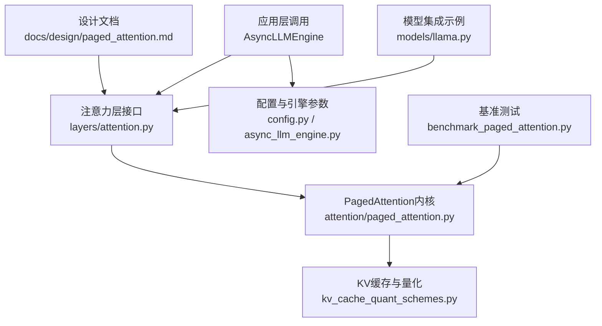
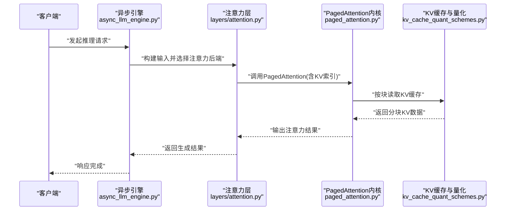
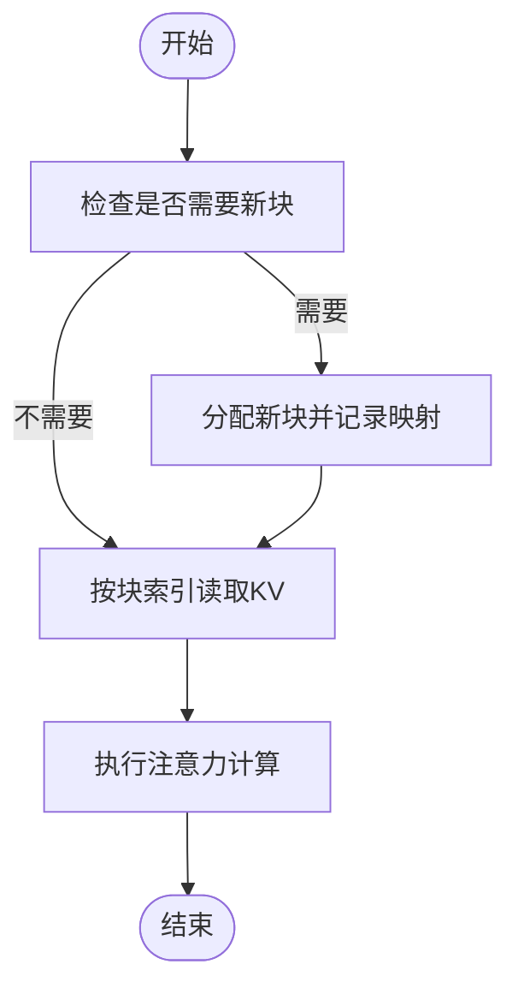
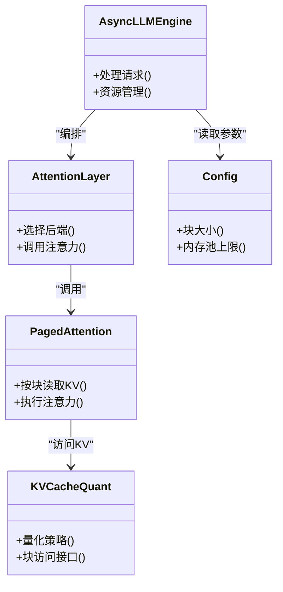

# PagedAttention技术

<cite>
**本文引用的文件**   
- [vllm/attention/paged_attention.py](file://vllm/attention/paged_attention.py)
- [vllm/model_executor/layers/quantization/kv_cache_quant_schemes.py](file://vllm/model_executor/layers/quantization/kv_cache_quant_schemes.py)
- [vllm/model_executor/layers/attention.py](file://vllm/model_executor/layers/attention.py)
- [benchmarks/kernels/benchmark_paged_attention.py](file://benchmarks/kernels/benchmark_paged_attention.py)
- [docs/design/paged_attention.md](file://docs/design/paged_attention.md)
- [vllm/config.py](file://vllm/config.py)
- [vllm/engine/async_llm_engine.py](file://vllm/engine/async_llm_engine.py)
- [vllm/model_executor/models/llama.py](file://vllm/model_executor/models/llama.py)
</cite>

## 目录
1. [简介](#简介)
2. [项目结构](#项目结构)
3. [核心组件](#核心组件)
4. [架构总览](#架构总览)
5. [详细组件分析](#详细组件分析)
6. [依赖关系分析](#依赖关系分析)
7. [性能考量](#性能考量)
8. [故障排查指南](#故障排查指南)
9. [结论](#结论)
10. [附录](#附录)

## 简介
PagedAttention是vLLM的核心创新之一，通过引入“分页式KV缓存”机制，将注意力计算中的键值（KV）张量按固定大小的块进行分配与复用，从而显著缓解传统连续内存分配导致的显存碎片与浪费问题。该设计在长上下文、多请求并发场景下尤为有效，能够在不改变模型语义的前提下，以更高的显存利用率与吞吐实现稳定推理。

本技术文档聚焦以下目标：
- 解释传统注意力机制的内存碎片问题及成因
- 阐述PagedAttention的分页管理、块分配策略与内存复用原理
- 给出与标准注意力的性能对比要点与长上下文内存节省效果
- 提供关键配置参数说明与优化建议（如块大小调优、内存池配置）

## 项目结构
围绕PagedAttention的实现与使用，代码库主要分布在以下位置：
- 注意力内核与接口定义：位于vllm/attention与vllm/model_executor/layers/attention.py
- KV缓存量化方案与存储：位于vllm/model_executor/layers/quantization/kv_cache_quant_schemes.py
- 设计与背景说明：docs/design/paged_attention.md
- 基准测试与性能评估：benchmarks/kernels/benchmark_paged_attention.py
- 引擎与配置集成：vllm/config.py、vllm/engine/async_llm_engine.py
- 典型模型集成示例：vllm/model_executor/models/llama.py

图表来源 
- [vllm/attention/paged_attention.py](file://vllm/attention/paged_attention.py)
- [vllm/model_executor/layers/attention.py](file://vllm/model_executor/layers/attention.py)
- [vllm/model_executor/layers/quantization/kv_cache_quant_schemes.py](file://vllm/model_executor/layers/quantization/kv_cache_quant_schemes.py)
- [docs/design/paged_attention.md](file://docs/design/paged_attention.md)
- [benchmarks/kernels/benchmark_paged_attention.py](file://benchmarks/kernels/benchmark_paged_attention.py)
- [vllm/config.py](file://vllm/config.py)
- [vllm/engine/async_llm_engine.py](file://vllm/engine/async_llm_engine.py)
- [vllm/model_executor/models/llama.py](file://vllm/model_executor/models/llama.py)

章节来源
- [docs/design/paged_attention.md](file://docs/design/paged_attention.md)
- [vllm/model_executor/layers/attention.py](file://vllm/model_executor/layers/attention.py)
- [vllm/attention/paged_attention.py](file://vllm/attention/paged_attention.py)
- [vllm/model_executor/layers/quantization/kv_cache_quant_schemes.py](file://vllm/model_executor/layers/quantation/kv_cache_quant_schemes.py)
- [benchmarks/kernels/benchmark_paged_attention.py](file://benchmarks/kernels/benchmark_paged_attention.py)
- [vllm/config.py](file://vllm/config.py)
- [vllm/engine/async_llm_engine.py](file://vllm/engine/async_llm_engine.py)
- [vllm/model_executor/models/llama.py](file://vllm/model_executor/models/llama.py)

## 核心组件
- 注意力层接口：负责调度具体注意力实现，包括PagedAttention与标准注意力后端的选择与适配
- PagedAttention内核：实现基于块的KV缓存读取与注意力计算，支持不同数据类型与量化格式
- KV缓存量化方案：定义KV缓存的存储布局、量化策略与访问路径
- 引擎与配置：暴露可配置的块大小、内存池上限等参数，并在运行时动态分配与回收块
- 基准测试：提供端到端与内核级性能测量，用于验证PagedAttention的优势与边界条件

章节来源
- [vllm/model_executor/layers/attention.py](file://vllm/model_executor/layers/attention.py)
- [vllm/attention/paged_attention.py](file://vllm/attention/paged_attention.py)
- [vllm/model_executor/layers/quantization/kv_cache_quant_schemes.py](file://vllm/model_executor/layers/quantization/kv_cache_quant_schemes.py)
- [vllm/config.py](file://vllm/config.py)
- [vllm/engine/async_llm_engine.py](file://vllm/engine/async_llm_engine.py)
- [benchmarks/kernels/benchmark_paged_attention.py](file://benchmarks/kernels/benchmark_paged_attention.py)

## 架构总览
下图展示了从引擎到注意力内核的数据与控制流，以及KV缓存的分页管理机制如何参与注意力计算。

图表来源 
- [vllm/engine/async_llm_engine.py](file://vllm/engine/async_llm_engine.py)
- [vllm/model_executor/layers/attention.py](file://vllm/model_executor/layers/attention.py)
- [vllm/attention/paged_attention.py](file://vllm/attention/paged_attention.py)
- [vllm/model_executor/layers/quantization/kv_cache_quant_schemes.py](file://vllm/model_executor/layers/quantization/kv_cache_quant_schemes.py)

## 详细组件分析

### 传统注意力机制的内存碎片问题
- 连续分配导致碎片化：传统方法为每个请求的KV缓存分配连续显存空间，随着请求长度与批大小变化，容易产生无法利用的小块碎片
- 扩容与复制开销：当需要扩展KV缓存时，往往触发重新分配与数据拷贝，增加延迟与峰值显存占用
- 长上下文放大问题：上下文越长，KV缓存越大，碎片与扩容成本越高，限制并发与吞吐

章节来源
- [docs/design/paged_attention.md](file://docs/design/paged_attention.md)

### PagedAttention的分页管理机制
- 固定大小块：将KV缓存切分为固定大小的块，所有块具有相同尺寸，便于统一管理与复用
- 块分配表：维护逻辑序列到物理块的映射表，支持任意顺序访问与跨块拼接
- 按需分配与释放：仅在需要时分配新块，并在请求结束或上下文截断时及时释放，降低峰值显存
- 共享与复用：相同前缀的KV块可在多个请求间共享，提升缓存命中率与整体效率

图表来源 
- [vllm/attention/paged_attention.py](file://vllm/attention/paged_attention.py)
- [vllm/model_executor/layers/quantization/kv_cache_quant_schemes.py](file://vllm/model_executor/layers/quantization/kv_cache_quant_schemes.py)

章节来源
- [vllm/attention/paged_attention.py](file://vllm/attention/paged_attention.py)
- [vllm/model_executor/layers/quantization/kv_cache_quant_schemes.py](file://vllm/model_executor/layers/quantization/kv_cache_quant_schemes.py)

### 块分配策略与内存复用
- 分配策略：优先复用空闲块；若无可用块则向内存池申请新块；达到上限后触发垃圾回收或拒绝新请求
- 复用原则：基于前缀哈希或序列ID匹配，命中则直接复用已有块，避免重复计算与存储
- 回收策略：根据引用计数或LRU策略回收长期未使用的块，保持高利用率

章节来源
- [vllm/model_executor/layers/quantization/kv_cache_quant_schemes.py](file://vllm/model_executor/layers/quantization/kv_cache_quant_schemes.py)
- [vllm/engine/async_llm_engine.py](file://vllm/engine/async_llm_engine.py)

### 与标准注意力的性能对比与长上下文优势
- 吞吐与延迟：PagedAttention通过减少碎片与扩容开销，在批量推理中显著提升吞吐并降低尾延迟
- 显存占用：固定块与共享机制使峰值显存更稳定，长上下文场景下显存占用更低
- 可扩展性：块粒度与映射表设计使得大规模并发与超长上下文更具可扩展性

章节来源
- [benchmarks/kernels/benchmark_paged_attention.py](file://benchmarks/kernels/benchmark_paged_attention.py)
- [docs/design/paged_attention.md](file://docs/design/paged_attention.md)

### 配置参数与优化建议
- 块大小（block_size）：影响KV缓存粒度与访存效率，过大导致碎片率上升，过小增加索引开销
- 内存池上限（max_num_blocks）：控制最大可分配块数，需结合显存容量与并发规模设置
- 量化与数据类型：选择合适的KV缓存量化方案以降低带宽与显存压力
- 前缀缓存与共享：启用前缀缓存以提升重复上下文的复用率

章节来源
- [vllm/config.py](file://vllm/config.py)
- [vllm/engine/async_llm_engine.py](file://vllm/engine/async_llm_engine.py)
- [vllm/model_executor/layers/quantization/kv_cache_quant_schemes.py](file://vllm/model_executor/layers/quantization/kv_cache_quant_schemes.py)

### 模型集成与调用路径
- 注意力层选择：根据后端能力与配置选择PagedAttention或标准注意力实现
- 模型适配：典型模型（如Llama）在注意力层中注入KV缓存与块映射信息
- 引擎编排：异步引擎协调请求生命周期、资源分配与结果回传

章节来源
- [vllm/model_executor/layers/attention.py](file://vllm/model_executor/layers/attention.py)
- [vllm/model_executor/models/llama.py](file://vllm/model_executor/models/llama.py)
- [vllm/engine/async_llm_engine.py](file://vllm/engine/async_llm_engine.py)

## 依赖关系分析
PagedAttention的实现依赖于注意力层接口、KV缓存量化方案与引擎配置。其调用链与模块耦合如下：

图表来源 
- [vllm/engine/async_llm_engine.py](file://vllm/engine/async_llm_engine.py)
- [vllm/model_executor/layers/attention.py](file://vllm/model_executor/layers/attention.py)
- [vllm/attention/paged_attention.py](file://vllm/attention/paged_attention.py)
- [vllm/model_executor/layers/quantization/kv_cache_quant_schemes.py](file://vllm/model_executor/layers/quantization/kv_cache_quant_schemes.py)
- [vllm/config.py](file://vllm/config.py)

章节来源
- [vllm/engine/async_llm_engine.py](file://vllm/engine/async_llm_engine.py)
- [vllm/model_executor/layers/attention.py](file://vllm/model_executor/layers/attention.py)
- [vllm/attention/paged_attention.py](file://vllm/attention/paged_attention.py)
- [vllm/model_executor/layers/quantization/kv_cache_quant_schemes.py](file://vllm/model_executor/layers/quantization/kv_cache_quant_schemes.py)
- [vllm/config.py](file://vllm/config.py)

## 性能考量
- 块大小调优：在访局部性与索引开销之间权衡，通常选择与硬件缓存行对齐的尺寸
- 内存池配置：根据GPU显存与并发需求设定上限，避免频繁扩容与回收
- 量化与数据类型：采用低精度KV缓存以减少带宽与显存占用，同时保证数值稳定性
- 前缀缓存：对重复前缀进行缓存与共享，提高命中率与整体吞吐

[本节为通用指导，不直接分析具体文件]

## 故障排查指南
- 显存不足：检查内存池上限与块大小是否合理，必要时降低并发或增大块上限
- 性能下降：确认是否启用了前缀缓存与合适的量化方案，核对块大小是否与硬件特性匹配
- 错误日志：关注引擎与注意力层的异常信息，定位KV缓存分配失败或索引越界等问题

章节来源
- [vllm/engine/async_llm_engine.py](file://vllm/engine/async_llm_engine.py)
- [vllm/model_executor/layers/attention.py](file://vllm/model_executor/layers/attention.py)
- [vllm/attention/paged_attention.py](file://vllm/attention/paged_attention.py)

## 结论
PagedAttention通过分页式KV缓存管理，有效解决了传统注意力机制中的显存碎片与扩容开销问题，在长上下文与高并发场景中展现出显著的内存节省与吞吐提升。配合合理的块大小与内存池配置，以及量化与前缀缓存等优化手段，可在实际部署中获得稳定且高效的推理性能。

[本节为总结性内容，不直接分析具体文件]

## 附录
- 设计文档：docs/design/paged_attention.md提供了背景、动机与总体设计思路
- 基准测试：benchmarks/kernels/benchmark_paged_attention.py可用于复现实验与性能对比
- 模型集成：vllm/model_executor/models/llama.py展示了如何在典型模型中接入PagedAttention

章节来源
- [docs/design/paged_attention.md](file://docs/design/paged_attention.md)
- [benchmarks/kernels/benchmark_paged_attention.py](file://benchmarks/kernels/benchmark_paged_attention.py)
- [vllm/model_executor/models/llama.py](file://vllm/model_executor/models/llama.py)