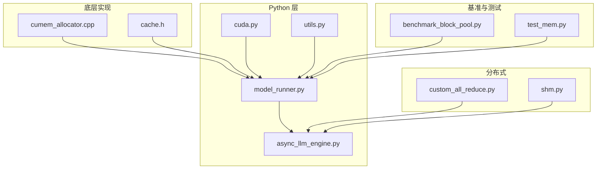
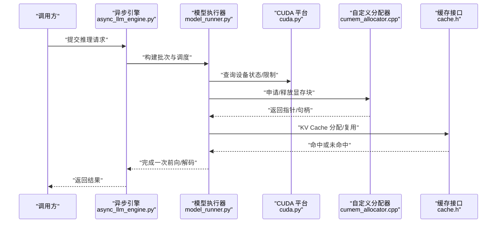
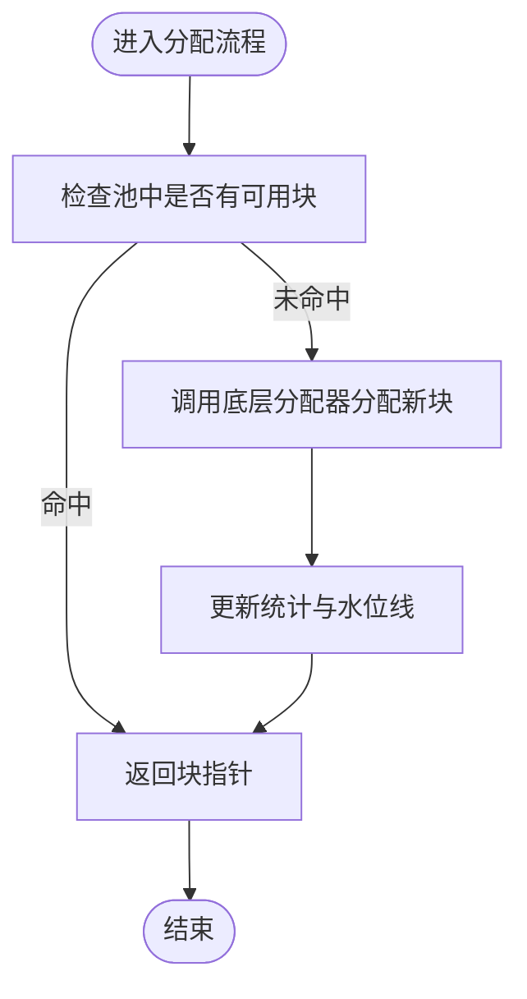
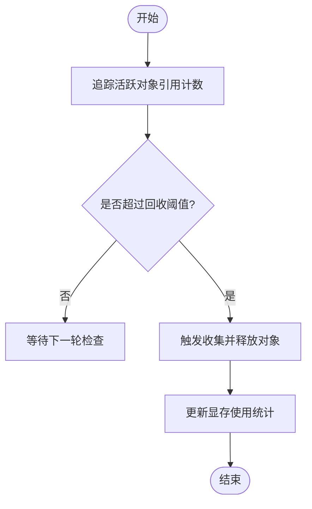
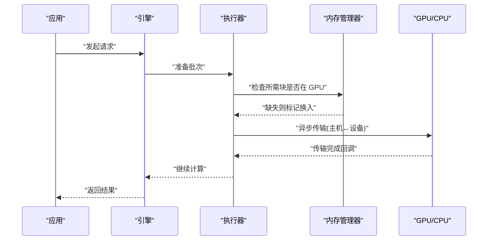
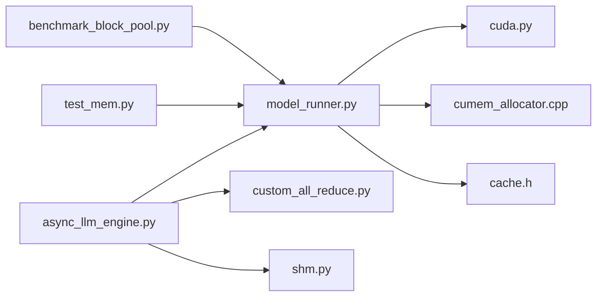

# 内存优化

<cite>
**本文引用的文件**   
- [cumem_allocator.cpp](file://csrc/cumem_allocator.cpp)
- [cache.h](file://csrc/cache.h)
- [benchmarks/benchmark_block_pool.py](file://benchmarks/benchmark_block_pool.py)
- [vllm/config/conserving_memory.md](file://vllm/config/conserving_memory.md)
- [vllm/engine/async_llm_engine.py](file://vllm/engine/async_llm_engine.py)
- [vllm/model_executor/model_runner.py](file://vllm/model_executor/model_runner.py)
- [vllm/platforms/cuda.py](file://vllm/platforms/cuda.py)
- [vllm/utils.py](file://vllm/utils.py)
- [tests/basic_correctness/test_mem.py](file://tests/basic_correctness/test_mem.py)
- [vllm/profiler/profiler.py](file://vllm/profiler/profiler.py)
- [vllm/distributed/device_communicator/custom_all_reduce.py](file://vllm/distributed/device_communicator/custom_all_reduce.py)
- [vllm/distributed/shm.py](file://vllm/distributed/shm.py)
</cite>

## 目录
1. [简介](#简介)
2. [项目结构](#项目结构)
3. [核心组件](#核心组件)
4. [架构总览](#架构总览)
5. [详细组件分析](#详细组件分析)
6. [依赖关系分析](#依赖关系分析)
7. [性能考量](#性能考量)
8. [故障排查指南](#故障排查指南)
9. [结论](#结论)
10. [附录](#附录)

## 简介
本文件系统性梳理 vLLM 的内存管理优化技术，覆盖 GPU 内存池与分配策略、垃圾回收优化、CPU-GPU 内存交换与异步传输、内存泄漏检测与分析方法、不同模型规模的配置建议与溢出预防、性能监控指标与调优工具，以及多进程环境下的内存共享与同步机制。内容基于仓库中的实现与文档进行归纳，帮助读者在工程实践中高效定位与解决内存相关问题。

## 项目结构
围绕内存优化的关键代码与文档分布在以下位置：
- C++ 底层分配器与缓存接口：csrc/cumem_allocator.cpp、csrc/cache.h
- 块池基准测试：benchmarks/benchmark_block_pool.py
- 内存节省配置说明：vllm/config/conserving_memory.md
- 引擎与执行器（异步调度、显存控制）：vllm/engine/async_llm_engine.py、vllm/model_executor/model_runner.py
- 平台抽象（CUDA 相关）：vllm/platforms/cuda.py
- 通用工具（内存统计、设备信息）：vllm/utils.py
- 内存相关测试：tests/basic_correctness/test_mem.py
- 性能剖析：vllm/profiler/profiler.py
- 分布式通信与共享内存：vllm/distributed/device_communicator/custom_all_reduce.py、vllm/distributed/shm.py

图表来源
- [cumem_allocator.cpp](file://csrc/cumem_allocator.cpp)
- [cache.h](file://csrc/cache.h)
- [vllm/model_executor/model_runner.py](file://vllm/model_executor/model_runner.py)
- [vllm/engine/async_llm_engine.py](file://vllm/engine/async_llm_engine.py)
- [vllm/platforms/cuda.py](file://vllm/platforms/cuda.py)
- [vllm/utils.py](file://vllm/utils.py)
- [benchmarks/benchmark_block_pool.py](file://benchmarks/benchmark_block_pool.py)
- [tests/basic_correctness/test_mem.py](file://tests/basic_correctness/test_mem.py)
- [vllm/distributed/device_communicator/custom_all_reduce.py](file://vllm/distributed/device_communicator/custom_all_reduce.py)
- [vllm/distributed/shm.py](file://vllm/distributed/shm.py)

章节来源
- [cumem_allocator.cpp](file://csrc/cumem_allocator.cpp)
- [cache.h](file://csrc/cache.h)
- [benchmarks/benchmark_block_pool.py](file://benchmarks/benchmark_block_pool.py)
- [vllm/config/conserving_memory.md](file://vllm/config/conserving_memory.md)
- [vllm/engine/async_llm_engine.py](file://vllm/engine/async_llm_engine.py)
- [vllm/model_executor/model_runner.py](file://vllm/model_executor/model_runner.py)
- [vllm/platforms/cuda.py](file://vllm/platforms/cuda.py)
- [vllm/utils.py](file://vllm/utils.py)
- [tests/basic_correctness/test_mem.py](file://tests/basic_correctness/test_mem.py)
- [vllm/profiler/profiler.py](file://vllm/profiler/profiler.py)
- [vllm/distributed/device_communicator/custom_all_reduce.py](file://vllm/distributed/device_communicator/custom_all_reduce.py)
- [vllm/distributed/shm.py](file://vllm/distributed/shm.py)

## 核心组件
- GPU 内存分配器与缓存
  - 自定义 CUDA 内存分配器用于减少碎片与提升分配效率
  - 缓存接口提供统一的块级缓存能力，支撑 KV Cache 等大块数据复用
- 模型执行器与引擎
  - 模型执行器负责张量生命周期管理与显存使用策略
  - 异步引擎协调请求调度、批处理与资源释放
- 平台抽象与工具
  - CUDA 平台封装设备能力与限制
  - 工具模块提供显存统计、设备信息查询等
- 基准与测试
  - 块池基准用于评估分配/回收性能
  - 内存正确性测试覆盖常见边界场景
- 分布式与共享内存
  - 自定义 AllReduce 降低通信开销
  - 共享内存支持多进程间零拷贝或低拷贝数据共享

章节来源
- [cumem_allocator.cpp](file://csrc/cumem_allocator.cpp)
- [cache.h](file://csrc/cache.h)
- [vllm/model_executor/model_runner.py](file://vllm/model_executor/model_runner.py)
- [vllm/engine/async_llm_engine.py](file://vllm/engine/async_llm_engine.py)
- [vllm/platforms/cuda.py](file://vllm/platforms/cuda.py)
- [vllm/utils.py](file://vllm/utils.py)
- [benchmarks/benchmark_block_pool.py](file://benchmarks/benchmark_block_pool.py)
- [tests/basic_correctness/test_mem.py](file://tests/basic_correctness/test_mem.py)
- [vllm/distributed/device_communicator/custom_all_reduce.py](file://vllm/distributed/device_communicator/custom_all_reduce.py)
- [vllm/distributed/shm.py](file://vllm/distributed/shm.py)

## 架构总览
下图展示从 Python 层到 C++ 层的内存管理路径，包括分配器、缓存、执行器与引擎的交互。

图表来源
- [vllm/engine/async_llm_engine.py](file://vllm/engine/async_llm_engine.py)
- [vllm/model_executor/model_runner.py](file://vllm/model_executor/model_runner.py)
- [vllm/platforms/cuda.py](file://vllm/platforms/cuda.py)
- [csrc/cumem_allocator.cpp](file://csrc/cumem_allocator.cpp)
- [csrc/cache.h](file://csrc/cache.h)

## 详细组件分析

### GPU 内存池与分配策略
- 自定义分配器通过预分配与池化策略减少频繁系统调用带来的碎片与延迟
- 按块大小分级管理，结合缓存命中率动态调整池容量
- 与缓存接口协作，优先复用已分配块，避免重复分配

图表来源
- [csrc/cumem_allocator.cpp](file://csrc/cumem_allocator.cpp)
- [csrc/cache.h](file://csrc/cache.h)

章节来源
- [csrc/cumem_allocator.cpp](file://csrc/cumem_allocator.cpp)
- [csrc/cache.h](file://csrc/cache.h)

### 垃圾回收与显存释放
- 在执行器层面跟踪张量生命周期，及时释放不再使用的中间结果
- 引擎在请求完成后触发清理，确保 KV Cache 与临时缓冲回收
- 结合阈值与水位线策略，避免频繁 GC 导致的抖动

章节来源
- [vllm/model_executor/model_runner.py](file://vllm/model_executor/model_runner.py)
- [vllm/engine/async_llm_engine.py](file://vllm/engine/async_llm_engine.py)

### CPU-GPU 内存交换与异步数据传输
- 在显存紧张时，将不活跃的 KV 块或权重迁移至 CPU，按需再加载
- 使用异步拷贝与队列机制隐藏传输延迟，提高吞吐
- 根据访问模式与热点预测，优化换入换出时机

章节来源
- [vllm/model_executor/model_runner.py](file://vllm/model_executor/model_runner.py)
- [vllm/engine/async_llm_engine.py](file://vllm/engine/async_llm_engine.py)
- [vllm/platforms/cuda.py](file://vllm/platforms/cuda.py)

### 内存泄漏检测与分析方法
- 使用内置统计与日志输出显存占用趋势，识别异常增长
- 结合基准测试与单元测试，复现并定位泄漏点
- 利用剖析工具对热点路径进行采样，定位高频分配与未释放区域

章节来源
- [vllm/utils.py](file://vllm/utils.py)
- [tests/basic_correctness/test_mem.py](file://tests/basic_correctness/test_mem.py)
- [vllm/profiler/profiler.py](file://vllm/profiler/profiler.py)

### 不同模型规模的内存配置建议与溢出预防
- 小模型：增大批大小与 KV Cache 块数，充分利用显存
- 中大型模型：启用量化与压缩，限制最大序列长度，合理设置上下文窗口
- 超大模型：采用分片与跨卡并行，开启 CPU 卸载与分页式 KV Cache
- 溢出预防：设置显存水位线与告警阈值，动态降级批大小，避免 OOM

章节来源
- [vllm/config/conserving_memory.md](file://vllm/config/conserving_memory.md)
- [vllm/model_executor/model_runner.py](file://vllm/model_executor/model_runner.py)

### 内存性能监控指标与调优工具
- 关键指标：显存峰值、平均占用、分配/回收频率、缓存命中率、传输带宽利用率
- 工具：基准脚本评估块池性能；剖析模块采集运行时指标；日志与可视化面板辅助诊断

章节来源
- [benchmarks/benchmark_block_pool.py](file://benchmarks/benchmark_block_pool.py)
- [vllm/profiler/profiler.py](file://vllm/profiler/profiler.py)
- [vllm/utils.py](file://vllm/utils.py)

### 多进程环境下的内存共享与同步机制
- 使用共享内存实现多进程间的零拷贝或低拷贝数据传递
- 通过事件与锁机制保证一致性，避免竞态条件
- 在分布式场景中结合 AllReduce 与集合通信优化整体吞吐

章节来源
- [vllm/distributed/shm.py](file://vllm/distributed/shm.py)
- [vllm/distributed/device_communicator/custom_all_reduce.py](file://vllm/distributed/device_communicator/custom_all_reduce.py)

## 依赖关系分析
- 执行器依赖平台抽象获取设备能力，调用分配器与缓存接口完成内存管理
- 引擎协调执行器与分布式组件，统一资源生命周期
- 基准与测试驱动性能回归与正确性验证

图表来源
- [vllm/engine/async_llm_engine.py](file://vllm/engine/async_llm_engine.py)
- [vllm/model_executor/model_runner.py](file://vllm/model_executor/model_runner.py)
- [vllm/platforms/cuda.py](file://vllm/platforms/cuda.py)
- [csrc/cumem_allocator.cpp](file://csrc/cumem_allocator.cpp)
- [csrc/cache.h](file://csrc/cache.h)
- [vllm/distributed/device_communicator/custom_all_reduce.py](file://vllm/distributed/device_communicator/custom_all_reduce.py)
- [vllm/distributed/shm.py](file://vllm/distributed/shm.py)
- [benchmarks/benchmark_block_pool.py](file://benchmarks/benchmark_block_pool.py)
- [tests/basic_correctness/test_mem.py](file://tests/basic_correctness/test_mem.py)

## 性能考量
- 分配器与缓存命中率直接影响延迟与吞吐，需结合工作负载特征调参
- 异步传输与批处理可显著降低空闲时间，但需平衡内存占用
- 大模型下量化与压缩能显著降低显存压力，同时保持精度可接受
- 监控水位线与告警有助于提前发现潜在瓶颈

## 故障排查指南
- 显存不足（OOM）
  - 检查批大小、序列长度与 KV Cache 配置
  - 启用 CPU 卸载与分页式缓存
  - 观察分配器与缓存命中率，必要时调整池大小
- 内存泄漏
  - 使用统计与日志定位持续增长的对象
  - 运行内存相关测试用例复现场景
  - 借助剖析工具定位高频分配路径
- 传输瓶颈
  - 检查异步队列与带宽利用率
  - 优化换入换出策略，减少不必要的数据移动
- 多进程问题
  - 确认共享内存初始化与同步机制正常
  - 排查锁与事件的使用是否正确

章节来源
- [vllm/utils.py](file://vllm/utils.py)
- [tests/basic_correctness/test_mem.py](file://tests/basic_correctness/test_mem.py)
- [vllm/profiler/profiler.py](file://vllm/profiler/profiler.py)
- [vllm/distributed/shm.py](file://vllm/distributed/shm.py)

## 结论
vLLM 通过自定义分配器、缓存接口、执行器与引擎协同，构建了高效的内存管理体系。结合异步传输、量化压缩与分布式共享内存，能够在不同模型规模下实现稳定且高吞吐的推理服务。配合完善的监控与诊断工具，可有效预防与定位内存问题，保障生产环境的可靠性。

## 附录
- 常用配置项参考：内存节省与优化选项见配置文件与文档
- 基准与测试：使用基准脚本与测试用例持续验证内存行为
- 剖析与监控：结合剖析模块与日志面板进行实时观测